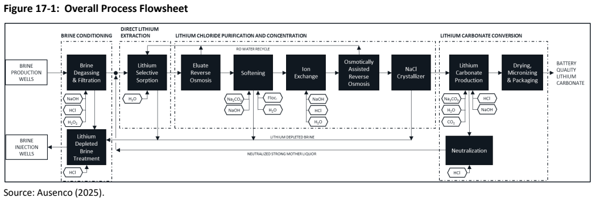
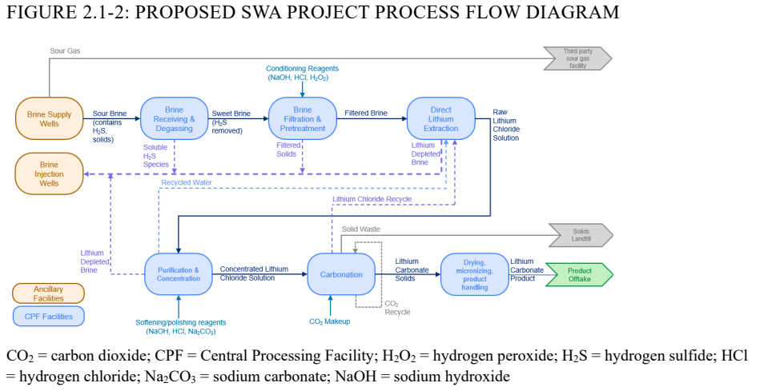
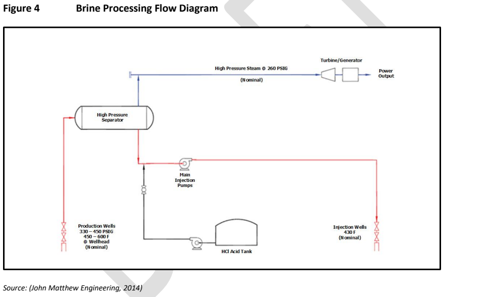
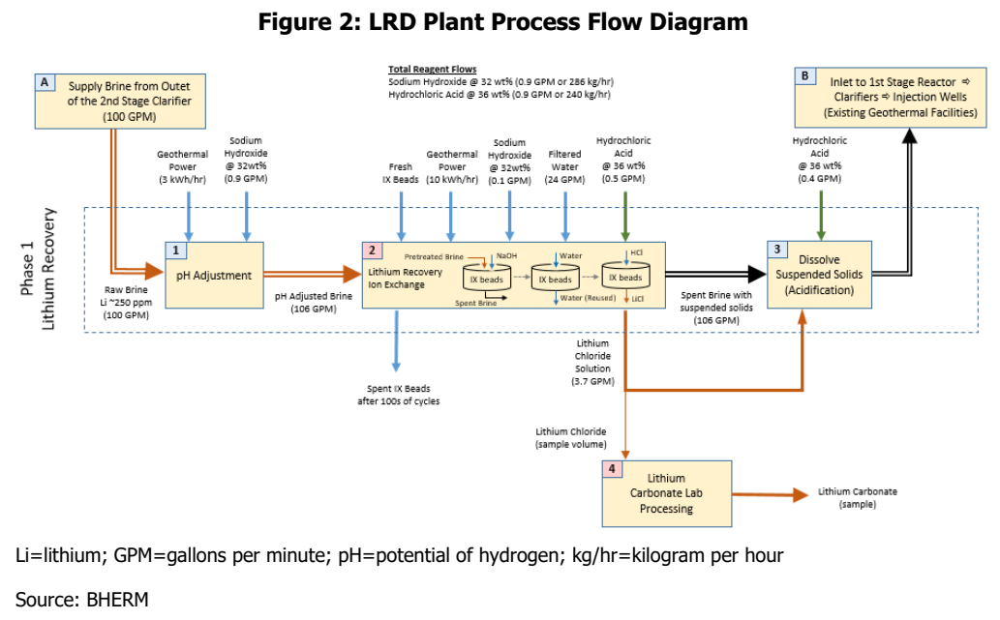
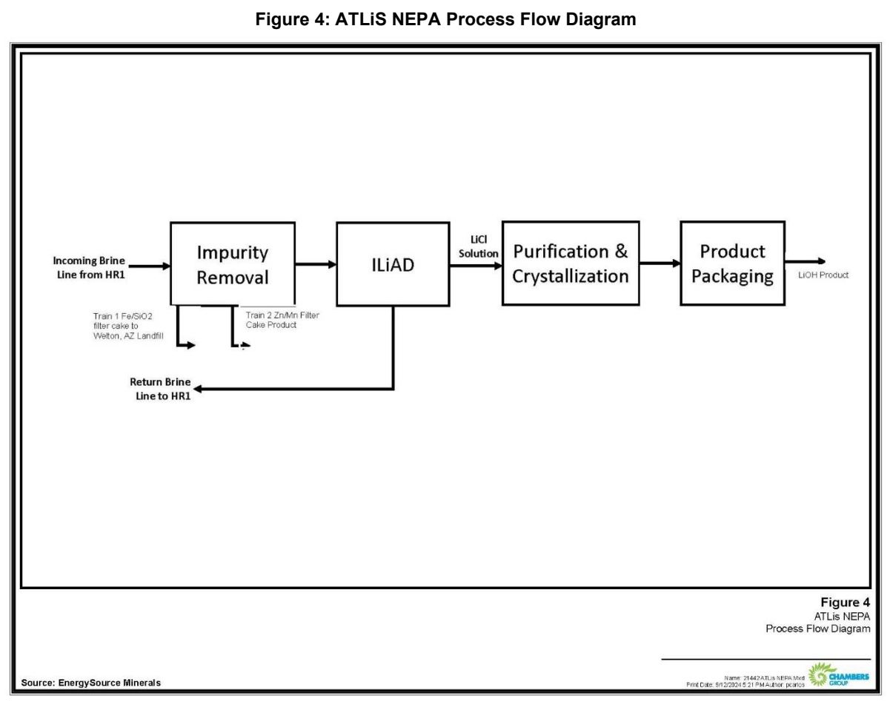
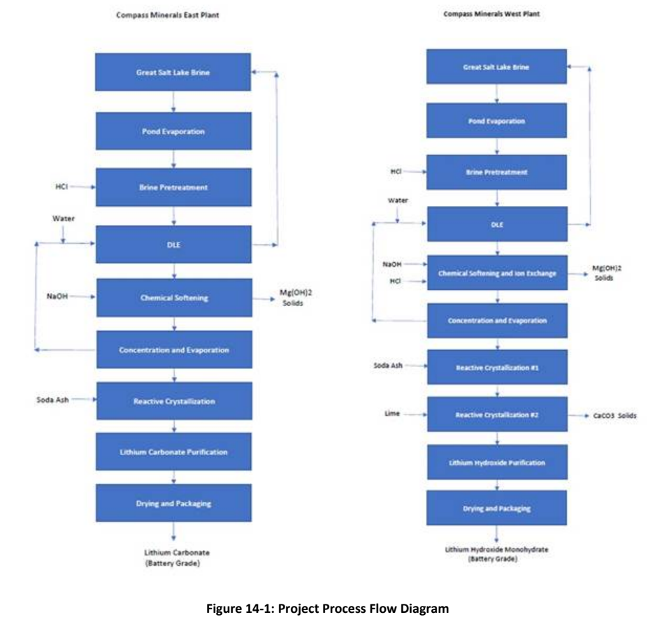
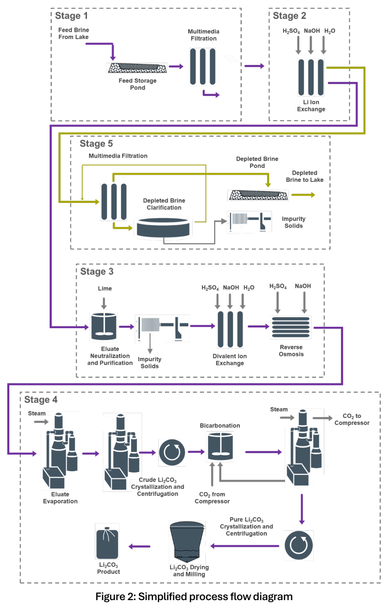
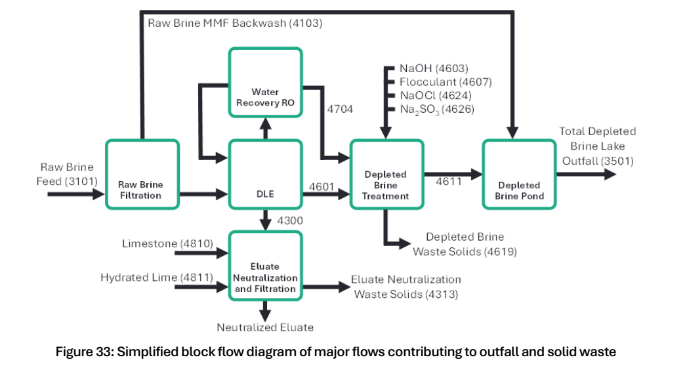
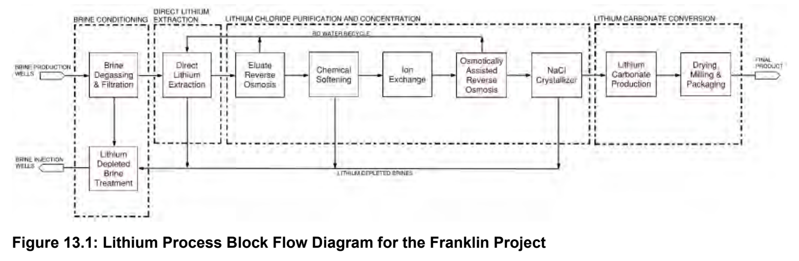
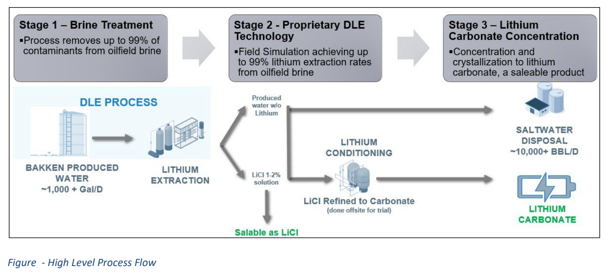

> **Research draft for source review.** The observations below have been checked by an AI assistant against source text, with selected source pages also inspected visually. No human review has yet been recorded. These observations remain provisional; the separate human-reviewed dataset contains no accepted rows. The report distinguishes technical-report estimates, company targets, reported test results, and agency decisions.

# US DLE project evidence {#library}

Explore US direct lithium extraction projects through public filings and technical reports. **18 research profiles**, including proposed developments, demonstrations and historical projects.

::: {.research-routes}

[**Compare chemistry →** Concentrations, sample basis and full published analyses.](#chemistry-comparison)

[**Compare pretreatment →** Selected methods, tested alternatives and disclosure gaps.](#pretreatment-comparison)

[**Browse flowsheets →** Published diagrams, water flows and process boundaries.](#flowsheet-library)

:::

## Explore a project {#featured-projects}

| Project | Location / feed context | Start here |
|:--|:--|:--|
| [South West Arkansas](#south-west-arkansas) | Arkansas · Smackover brine | [Chemistry](#swa-water-composition) · [Process](#swa-process-flowsheets) |
| [Waterleaf / Lilac](#waterleaf) | Utah · Great Salt Lake brine | [Chemistry](#waterleaf-water-composition) · [Process](#waterleaf-process-flowsheets) |
| [Hell’s Kitchen](#hells-kitchen) | California · Geothermal brine | [Chemistry](#hk-water-composition) · [Process](#hk-process-flowsheets) |

[**All 18 projects →**](#project-reports) · [Principal findings](#principal-findings) · [Disclosure coverage](#composition-and-flowsheet-availability)

# Overview

This research draft brings together project-specific securities disclosures and environmental records for 18 US direct lithium extraction (DLE) project profiles, including development programs, historical demonstrations and suspended designs. The count is a set of research profiles, not 18 operating plants or independent companies. Its purpose is to make the evidence findable and comparable **where the definitions allow it**, while preserving disagreements and gaps. It does not establish present operating performance. **South West Arkansas and Hell’s Kitchen retain their September 14, 2026 collection cutoff; the other profiles use September 16, 2026.** A collection date is not the date of the underlying study.

<!-- BEGIN COUNTS -->

**Collection:** 124 source records; 100 successful original-file downloads; 24 failed original-file downloads. The saved PDFs contain 6,562 pages. **Evidence:** 815 observations; 0 accepted after human review.

<!-- END COUNTS -->

The source manifest covers official agency pages, submitted reports and attachments, agency decisions, SEC indexes and selected exhibits, and explicitly labeled issuer supplements. The saved SEC histories now contain **2,846 metadata entries**: 219 Standard Lithium, 79 Plum Acquisition Corp. IV, 2,453 Compass Minerals (April 2003–September 2026) and 95 EnergyX (November 2020–July 2026). Metadata is inventoried, not assumed to be downloaded or reviewed project evidence. [D006](#d006), [D007](#d007), [D083](#d083), [D084](#d084), [D091](#d091).

## Project reports

Research profiles are grouped by project location, including foreign parent companies. They are not a count of operating plants. Dates and engineering scope are preserved within each profile.

| Project / location | Available records and gaps | Technical views |
|:--|:--|:--|
| [South West Arkansas](#south-west-arkansas) · Lafayette and Columbia counties, Arkansas | full published pilot-feed composition, process flowsheets, project profile, sources and evidence. | [Chemistry](south-west-arkansas-chemistry.html) · [Process](south-west-arkansas-process.html) · [Evidence](south-west-arkansas-evidence.html) |
| [Hell’s Kitchen](#hells-kitchen) · Imperial County, California | full expected brine composition, geothermal schematic, lithium-process disclosure limits, sources and evidence. | [Chemistry](hells-kitchen-chemistry.html) · [Process](hells-kitchen-process.html) · [Evidence](hells-kitchen-evidence.html) |
| [BHER demonstration](#bher) · Imperial County, California | measured brine, canal-water and steam tables; process diagram; field-test outcome. | [Chemistry](bher-chemistry.html) · [Process](bher-process.html) · [Evidence](bher-evidence.html) |
| [ATLiS](#atlis) · Imperial County, California | DOE block flowsheet, brine/water flows, reagent use and explicit chemistry gaps. | [Chemistry](atlis-chemistry.html) · [Process](atlis-process.html) · [Evidence](atlis-evidence.html) |
| [Ogden / Great Salt Lake](#ogden) · Utah | lake and pond chemistry, historical process design, and separate EnergyX proposal. | [Chemistry](ogden-chemistry.html) · [Process](ogden-process.html) · [Evidence](ogden-evidence.html) |
| [Green River](#green-river) · Utah | Anson/Blackstone permit chemistry, injection limits and stream-label discrepancy. | [Chemistry](green-river-chemistry.html) · [Process](green-river-process.html) · [Evidence](green-river-evidence.html) |
| [Waterleaf / Lilac](#waterleaf) · Box Elder County, Utah | pilot and 12-stream design chemistry, groundwater laboratory results, numbered flowsheet and public water summaries. | [Chemistry](waterleaf-chemistry.html) · [Process](waterleaf-process.html) · [Evidence](waterleaf-evidence.html) |
| [Franklin](#franklin) · Hopkins, Franklin and Titus counties, Texas | 2023 exploration-average chemistry, expected flowsheet and separate 2026 PEA assumptions. | [Chemistry](franklin-chemistry.html) · [Process](franklin-process.html) · [Evidence](franklin-evidence.html) |
| [Wellspring](#wellspring) · North Dakota | North Dakota produced-water field program; grant records and high-level diagram. | [Chemistry](wellspring-chemistry.html) · [Process](wellspring-process.html) · [Evidence](wellspring-evidence.html) |
| [Paradox](#paradox) · West of Moab, Grand County, Utah | draft permit chemistry with reused Green River ranges and unresolved stream labels. | [Chemistry](paradox-chemistry.html) · [Process](paradox-process.html) · [Evidence](paradox-evidence.html) |
| [US Magnesium](#us-magnesium) · Utah | historical DLE installation and idling; limited government-survey evidence. | [Chemistry](us-magnesium-chemistry.html) · [Process](us-magnesium-process.html) · [Evidence](us-magnesium-evidence.html) |
| [Mandrake Utah](#utah-lithium) · San Juan County, Utah | resource-horizon concentrations and September 2026 bulk-sample appraisal update. | [Chemistry](utah-lithium-chemistry.html) · [Process](utah-lithium-process.html) · [Evidence](utah-lithium-evidence.html) |
| [Evergreen](#evergreen) · Southwest Arkansas | TETRA/Saltwerx unit history; direct lithium engineering records still needed. | [Chemistry](evergreen-chemistry.html) · [Process](evergreen-process.html) · [Evidence](evergreen-evidence.html) |
| [Pine / Exxon](#pine) · Miller and Lafayette counties, Arkansas | Exxon/Saltwerx unit identity; neighboring-property evidence with technical gaps. | [Chemistry](pine-chemistry.html) · [Process](pine-process.html) · [Evidence](pine-evidence.html) |
| [Lonestar](#lonestar) · Northeast Texas | Texas demonstration and mineral-option disclosures; chemistry package not established. | [Chemistry](lonestar-chemistry.html) · [Process](lonestar-process.html) · [Evidence](lonestar-evidence.html) |
| [Daytona / Folsom Point](#daytona) · Southwest Arkansas | EnergyX Arkansas acquisition/development record; no dated feed assay established. | [Chemistry](daytona-chemistry.html) · [Process](daytona-process.html) · [Evidence](daytona-evidence.html) |
| [Magnolia](#magnolia) · Magnolia, Arkansas | issuer-supported pilot record; direct project government package still needed. | [Chemistry](magnolia-chemistry.html) · [Process](magnolia-process.html) · [Evidence](magnolia-evidence.html) |
| [LANXESS history](#lanxess) · El Dorado, Arkansas | ended commercial arrangement and separate continuing demonstration evidence. | [Chemistry](lanxess-chemistry.html) · [Process](lanxess-process.html) · [Evidence](lanxess-evidence.html) |

## Principal findings

- **Pretreatment now has a dedicated comparison.** The [all-project matrix](#pretreatment-by-project) distinguishes selected designs, tested alternatives and disclosure gaps; the [method inventory](#pretreatment-methods) and [stream-boundary check](#pretreatment-boundaries) keep feed preparation separate from eluate purification and discharge treatment.

- **The expanded report contains 18 profiles with uneven evidence.** Waterleaf adds six measured brine/eluate constituents, eleven design-ion rows across twelve numbered streams, and a separate groundwater laboratory panel; Franklin adds ten exploration-average brine constituents. Several additions establish project identity or history only, and Magnolia remains an explicitly issuer-supported profile. [Disclosure comparison](#composition-and-flowsheet-availability).
- **New concentrations retain their stream and date.** Waterleaf reports 69 mg/L raw-brine lithium and 2,044 mg/L in pilot eluate. Franklin reports 668 mg/L in 2023 exploration averages versus 515 mg/L as a 2026 PEA lifetime model average. Paradox repeats Green River’s proposed 170–210 ppm range; those tables are not independent assays. [Waterleaf](#waterleaf-water-composition), [Franklin](#franklin-water-composition), [Paradox](#paradox-water-composition).
- **A process diagram is not a complete water balance.** Source diagrams cover BHER, ATLiS, historical Ogden, Waterleaf, Franklin and Wellspring. Waterleaf publishes a design water-summary table and a 12-stream chemistry/flow excerpt, while the full Appendix D.4 balance is redacted. BHER cancelled its completed-balance deliverable; none of these packages establishes all numbered streams with measured flows and compositions. [BHER](#bher-process-flowsheets), [ATLiS](#atlis-process-flowsheets), [Ogden](#ogden-process-flowsheets).

- **The original pilot’s brine concentration figures have different bases.** SWA's September 2025 plant-design table uses 439.9 mg/L lithium; HK's August 2023 EIR gives 250 mg/L as expected geothermal brine composition. Neither is a directly comparable dated well assay. SWA separately reports well-sample results and changing concentrations in its production model. [O009](#o009), [O051](#o051), [brine chemistry comparison](#brine-concentration-and-chemistry).
- **Recovery needs a process boundary.** South West Arkansas reports greater than 95% lithium extraction in demonstration/pilot testing, while the commercial process design uses 89.25% overall brine-to-product recovery. These are different quantities. [O002](#o002), [O003](#o003).
- **Water figures need reconciliation.** The 2025 South West Arkansas feasibility study gives 3.17 million m³/year; the May 2026 DOE assessment gives 1,600–1,700 gpm for the central processing facility, after planned recycling. Hell’s Kitchen gives both 6,100 and 6,300 acre-feet/year for its lithium facility in different EIR sections. [O016](#o016), [O017](#o017), [O055](#o055), [O056](#o056).
- **Emissions estimates are not comparable as presented.** South West Arkansas's estimate includes gas-fired electricity generation. Hell’s Kitchen's combined net result includes credit for geothermal electricity displacing grid power. Neither number is a measured lithium-product carbon intensity. [O033](#o033), [O063](#o063).
- **Study vintage changes the story.** South West Arkansas's earlier PFS describes lithium hydroxide monohydrate; its later DFS describes lithium carbonate. Its announced first-production target moved from 2027 in the earlier source to 2029 in the August 2026 announcement. [O045](#o045), [O048](#o048), [O004](#o004), [O044](#o044).
- **Permitting decisions have specific scope.** DOE's FONSI addresses its funding action. Hell’s Kitchen's county decisions concern specified project entitlements. These records do not demonstrate that every authorization has been obtained, that litigation is resolved, or that commercial operations have begun. [O042](#o042), [O065](#o065), [O066](#o066).

## How to read the report

Start with a project or a dedicated chemistry, pretreatment or flowsheet comparison. Use each **O-number** to reach the full observation, and each **D-number** to reach the document catalog. Observation links identify a printed page, section, table, or slide; PDF citations also include the physical PDF page number, which may differ from printed pagination.

On narrow screens, scroll wide tables sideways to read the remaining columns. The [pretreatment comparison](#pretreatment-comparison) covers all 18 project profiles.

**Reported measurement** means the source reports a test result; it is not independent verification by this pilot. **Design/model estimate** means an engineering or economic assumption. **Company target** means a forward-looking statement. **Agency decision** is confined to the named action. **Not located** is a bounded search outcome, not a claim that information does not exist.

# Project profiles

## South West Arkansas

The project is developed through **SWA Lithium LLC**, associated with Standard Lithium and Equinor under the Smackover Lithium name. The Reynolds Brine Unit and the central processing facility belong to the commercial project considered here. Standard Lithium's demonstration plant at the LANXESS South site provides supporting test evidence; the LANXESS Phase 1A commercial project and East Texas projects are separate. [D002](#d002), [D035](#d035), [D044](#d044).

The 2025 DFS describes selective sorption followed by concentration, impurity removal and conversion to lithium carbonate. The nominal design is 22,500 t/year, while the economic model's lifetime average is 22,155.8 t (LCE)/year. The process-design table uses 439.9 mg/L lithium, while the economic summary uses 481 mg/L. Retaining both avoids accidentally treating a modelled production average as the process-design feed concentration. [O001](#o001), [O004](#o004), [O005](#o005), [O009](#o009), [O014](#o014).

| Selected evidence | Reported value | Interpretation |
|:--|:--|:--|
| Brine flow | 1,325 m³/h | Commercial design, not freshwater input. [O008](#o008) |
| Overall lithium recovery | 89.25% | Brine to finished product, distinct from DLE-stage testing. [O003](#o003) |
| Product purity | >99.5% lithium carbonate | Proposed specification in October 2025 agency correspondence; not a measured assay. [O074](#o074) |
| Electrical demand | 40,008 kWe | CPF plus wellfield; gas-fuelled design. [O020](#o020) |
| Natural gas | 3,000 million standard cubic feet/year | DOE generation estimate. [O022](#o022) |
| Main process inputs | Acid, peroxide, caustic, soda ash, CO₂ | Annual reported quantities are retained in the appendix. [O024](#o024)–[O028](#o028) |
| Initial capital | US$1,448.9 million | 2025 DFS estimate. [O034](#o034) |
| Cash operating cost | US$4,516.05/t LCE | Q1 2025 cost basis; separate from royalties and sustaining costs. [O035](#o035) |

The May 2026 DOE assessment describes freshwater from the Sparta aquifer, with site-specific yield testing still prospective in that document. A possible Red River Alluvium alternative is discussed as potentially requiring additional NEPA work. This pilot did not establish completion of the proposed local yield testing. [O017](#o017), [O019](#o019).

The DOE decision describes US$225 million in proposed financial assistance; that is not evidence of full disbursement. The August 31, 2026 government-hosted company announcement describes an LG Energy Solution offtake for 8,000 metric tonnes/year over ten years after commercial production begins, and targets initial commercial production in 2029. Contract pricing is confidential and the executed contract was not acquired. [O041](#o041), [O043](#o043), [O044](#o044).

### Water composition: full published feed table {#swa-water-composition}

**A fuller composition table is available.** Table 13-1 lists 11 parameters for both the SWA pilot feed and the separate LANXESS demonstration feed. The SWA column reports average IPC-1 samples from **October 2024–January 2025**, including **476 mg/L lithium**. The demonstration column covers **May 4–June 30, 2023**; the report explicitly says that supply is not representative of SWA. These sample averages differ in basis from the 439.9 mg/L commercial-design value and the 481 mg/L economic assumption. [D044](#d044), printed pp. 81–83 / PDF pp. 103–105.

| Component | SWA pilot feed (mg/L), Oct 2024–Jan 2025 | LANXESS demonstration feed (mg/L), May–Jun 2023 |
|:--|--:|--:|
| Lithium | 476 [O109](#o109) | 237 [O120](#o120) |
| Sodium | 79,200 [O110](#o110) | 61,136 [O121](#o121) |
| Calcium | 38,400 [O111](#o111) | 31,793 [O122](#o122) |
| Magnesium | 2,810 [O112](#o112) | 2,682 [O123](#o123) |
| Potassium | 7,670 [O113](#o113) | 2,385 [O124](#o124) |
| Strontium | 2,480 [O114](#o114) | 1,932 [O125](#o125) |
| Boron | 334 [O115](#o115) | 189 [O126](#o126) |
| Silicon | 8 [O116](#o116) | 10 [O127](#o127) |
| Chlorides | 189,000 [O117](#o117) | 175,000 [O128](#o128) |
| Bromides | 5,300 [O118](#o118) | &lt;360 [O129](#o129) |
| Total alkalinity (as CaCO3) | 492 [O119](#o119) | &lt;100 [O130](#o130) |

This reproduces **every listed row of Table 13-1**, including detection-limit qualifiers. The source describes on-site analyses with regular independent WETLAB validation. A full listed table is not an exhaustive water analysis: Table 13-1 does not list pH, density, temperature, all trace species, a charge-balance check or a measured TDS total. The commercial-design TDS of 370,121 mg/L comes from a different table and must not be appended to the pilot composition as if measured in the same sample. [O013](#o013).

Fresh makeup water is a separate stream from lithium-bearing brine. The water-supply sections describe groundwater sourcing, treatment and demand, but a complete project-specific makeup-water laboratory analysis was not located in those reviewed sections. [D044](#d044), §17.6.2; [D029](#d029), §3.6.

### Process flowsheets in the filings {#swa-process-flowsheets}

**Yes: SWA publishes an end-to-end process block flowsheet.** The best detailed overview is **Figure 17-1, printed p. 120 / PDF p. 142** of the DFS. Figure 13-1, printed p. 80 / PDF p. 102, is another process overview. The diagram below is a crop of the published Figure 17-1, retaining its title and source attribution. [O131](#o131).

[Open DFS Figure 17-1 at PDF page 142](https://www.standardlithium.com/_resources/reports/South-West-Arkansas-NI-43-101-DFS.pdf?v=120808%3Fv%3D1761065229#page=142). The visible sequence is brine degassing/filtration → lithium-selective sorption → eluate reverse osmosis → softening → ion exchange → osmotically assisted reverse osmosis → NaCl crystallization → lithium-carbonate production → drying and product handling. The figure also shows reagent additions, water recycle, neutralization and depleted-brine reinjection.

**An official DOE-hosted diagram is also available:** Figure 2.1-2, printed p. 11 / PDF p. 18 of the final EA. It provides a second view of the wells, CPF, reagents and recycle paths. [O132](#o132).

[Open DOE Figure 2.1-2 at PDF page 18](https://www.energy.gov/sites/default/files/2026-05/final-ea-2304-swa-lithium-2026-05.pdf#page=18). A separate well-pad separation flowsheet appears in DFS Figure 17-2, printed p. 122 / PDF p. 144.

These figures cover the major process stages. They do **not** supply a complete numbered-stream material/energy balance with every stream's flow and composition, or a piping and instrumentation diagram. Use the published **1,325 m³/h commercial design feed** alongside its own design basis, not as the throughput of the earlier pilot samples. [O008](#o008).

### Pretreatment {#south-west-arkansas-pretreatment}

Well-pad phase separation → air stripping/scrubbing → cooling → pH/ORP conditioning → multimedia filtration → UF. Gases, oils, precipitated iron and suspended solids; NaOH/H2O2 for conditioning. Figure 17-1 also shows HCl entering the combined pretreatment block, but its precise duty is unresolved. Selected commercial design with supporting trials; no stage-by-stage outlet assay or removal efficiency established here. [O561](#o561), [O562](#o562), [O563](#o563), [O564](#o564)

[Compare pretreatment methods across all projects](#pretreatment-comparison).

## Hell’s Kitchen

The county environmental record covers **Hell’s Kitchen PowerCo 1 (HKP1)** and **LithiumCo 1 (HKL1)**, associated with Controlled Thermal Resources (US) Inc. and named project subsidiaries. Later securities disclosures occur through Plum Acquisition Corp. IV in connection with a proposed combination with Controlled Thermal Resources Holdings Inc. The two entity descriptions and their dates are retained; the proposed transaction is not assumed closed. [D004](#d004), [D041](#d041), [D043](#d043).

The EIR describes geothermal power generation, lithium hydroxide production, supporting utilities, and brine reinjection. The final EIR consists of the draft EIR plus comments, responses and revisions; the downloaded final-EIR volume alone is not a replacement for the full draft report and its appendices. [D031](#d031), PDF p. 47; [O049](#o049), [O062](#o062).

| Selected environmental evidence | Reported value | Interpretation |
|:--|:--|:--|
| Net geothermal generation capacity | 49.9 MW | HKP1 generation, not lithium demand. [O052](#o052) |
| Average lithium-facility demand | Approximately 35 MW | HKL1; peak 40 MW. [O053](#o053) |
| Annual lithium electricity | 276 million kWh/year | Modelled with 90% availability. [O054](#o054) |
| Combined operating freshwater | Approximately 6,500 AFY | Includes 200 AFY for HKP1 and 6,300 AFY for HKL1 in the WSA summary. [O057](#o057) |
| Net combined GHG estimate | −10,435 metric tons CO₂e/year | Includes electricity-generation credit. [O063](#o063) |
| Hazardous waste | No more than approximately 10 tons/year | A limited waste category; not all residuals. [O061](#o061) |

The county record contains Planning Commission approval dated December 13, 2023 and Board of Supervisors approval dated January 23, 2024. A later CEC determination describes a March 2025 pretreatment research grant to **Materials Research LLC**; it is not treated as a grant to CTR. [O065](#o065)–[O067](#o067).

The August 2026 SEC presentation targets Stage 1 lithium capacity of 25,000 TPA LCE and commercial operation in Q4 2030. These are management targets from a later plan, not performance established by the 2023 EIR. Only web text could be checked; the original download remains unavailable. [O069](#o069), [O070](#o070).

The EIR's expected geothermal brine composition includes **250 mg/L lithium**, with magnesium, calcium, boron and other constituents listed in Table 2.0-2. The table does not identify a dated well assay or the exact stream point relative to steam separation and lithium pretreatment. This corrects the initial extraction pass, which overlooked the table. [O051](#o051), [D022](#d022), PDF pp. 64–65.

Project-specific recovery and annual reagent-consumption quantities were not established in the screened environmental text. The securities presentation's operating-cost unit needs clarification before economic comparison. [O050](#o050), [O060](#o060), [O072](#o072).

### Water composition: full published expected table {#hk-water-composition}

**A broad expected brine composition is available:** Table 2.0-2 of the EIR, printed pp. 2.0-10–11 / PDF pp. 64–65, lists the 23 entries below. The same table appears in the March 2022 initial study as Table 2, pp. 14–15. This is expected geothermal brine composition, not a dated well assay. [D022](#d022), [D012](#d012).

| Constituent | Expected concentration (mg/L) | Evidence |
|:--|--:|:--|
| Ammonium (NH4) | 250 | [O075](#o075) |
| Arsenic (As) | 10 | [O076](#o076) |
| Barium (Ba) | 250 | [O077](#o077) |
| Boron (B) | 350 | [O078](#o078) |
| Bromine (Br) | 100 | [O079](#o079) |
| Calcium (Ca) | 29,000 | [O080](#o080) |
| Cesium | 15 | [O081](#o081) |
| Chloride (Cl) | 156,000 | [O082](#o082) |
| Cobalt (Co) | &lt;0.05 | [O083](#o083) |
| Copper (Cu) | 5 | [O084](#o084) |
| Iodide (I) | 10 | [O085](#o085) |
| Fluoride (F) | 25 | [O086](#o086) |
| Iron (Fe) | 1,600 | [O087](#o087) |
| Lead (Pb) | 100 | [O088](#o088) |
| Lithium (Li) | 250 | [O051](#o051) |
| Magnesium (Mg) | 50 | [O089](#o089) |
| Manganese (Mn) | 1,400 | [O090](#o090) |
| Potassium (K) | 17,000 | [O091](#o091) |
| Sodium (Na) | 54,000 | [O092](#o092) |
| Silica (SiO2) | 350 | [O093](#o093) |
| Strontium (Sr) | 500 | [O094](#o094) |
| Sulphate | 5 | [O095](#o095) |
| Zinc (Zn) | 500 | [O096](#o096) |

This is the **full published table**, not evidence of a complete analytical characterization. It does not specify a sampling date, laboratory method, pH, density, temperature, TDS total or an unambiguous stream point relative to geothermal flashing and lithium pretreatment. Cesium is printed with the symbol “C” in the source; the element name is retained here without adopting that symbol. Silicon in the SWA table and silica (SiO₂) here have different reporting bases.

Fresh makeup water is separate: the EIR describes IID irrigation-water supply, steam-condensate reuse and filtration/reverse-osmosis treatment. A complete site-specific makeup-water laboratory analysis was not located in the reviewed water-supply sections. [D022](#d022), printed pp. 2.0-18–19 / PDF pp. 72–73.

### Process diagrams and disclosure limits {#hk-process-flowsheets}

**A geothermal brine-handling diagram is present; a complete lithium-extraction flowsheet was not located in the reviewed environmental materials.** The published schematic shows production wells, a high-pressure separator, the steam-to-turbine branch, acid addition, injection pumps and injection wells. It does not draw the lithium extraction, purification or product-conversion stages. [O133](#o133).

[Open Figure 4 at PDF page 125 of the combined appendices](https://ceqanet.lci.ca.gov/2022030704/3/Attachment/glQHYR#page=125). Its internal reference is Air Quality Technical Report, p. 8 of 62, dated August 15, 2023; the figure credits John Matthew Engineering (2014). A similar diagram is on [draft-EIR PDF page 64](https://ceqanet.lci.ca.gov/2022030704/3/Attachment/kwHBZD#page=64).

**The lithium process is described in words** in §2.9.2, printed pp. 2.0-17–18 / PDF pp. 71–72: geothermal brine cooling → silica/polymetallic recovery → proprietary LiCl extraction → concentration/purification → conversion to lithium hydroxide monohydrate → crystallization, separation, drying and packaging. This sentence is a summary of the narrative, not a reproduced engineering flowsheet. [O134](#o134).

That description gives approximately **5.9 million lb/hr** of brine feeding the cooling trains. It is a mass-flow design value for the 2023 plan; no volume conversion or extraction recovery is inferred from it. [O135](#o135). A numbered-stream balance giving all water, brine, reagent and product compositions was not located in the reviewed environmental documents. The newer SEC presentation's original remains unavailable for visual diagram review, so this is a bounded finding, not a claim that no other public flowsheet exists. [D037](#d037).

### Pretreatment {#hells-kitchen-pretreatment}

Vacuum-flash cooling → proprietary silica/polymetallic recovery and filtration → lithium extraction. Silica and polymetallic products; boron removal is only a possibility. Recipe and dose not specified. Proposed sequence; proprietary chemistry and impurity residuals unresolved. [O568](#o568), [O569](#o569)

[Compare pretreatment methods across all projects](#pretreatment-comparison).

## BHER Minerals demonstration {#bher}

**Disclosure summary:** measured brine lithium **222 ppm**, with 24 parameters in the published brine table; separate canal-water and steam analyses; a process diagram with selected design flows. These are records of a historical demonstration that did not achieve its intended outcome. Collection cutoff: **September 16, 2026**; principal technical source published **August 2024**, describing 2021–2023 work. [O144](#o144), [O201](#o201).

BHER Minerals LLC (BHERM), associated with BHE Renewables and CalEnergy, tested a small side stream of Salton Sea geothermal brine at its Region 1 facilities. The final CEC report describes lithium-titanate ion-exchange media, sodium-hydroxide conditioning and hydrochloric-acid elution. The earlier 2020 CEQA exemption named Lilac resin; that initial description must not be assumed to describe every later test. [D058](#d058), pp. 1–3; [D059](#d059).

### Published brine, canal-water and steam chemistry {#bher-water-composition}

The following reproduces all parameters in **Tables 4–6, printed p. 17 / PDF p. 24**. The report identifies CalEnergy laboratory averages. It dates the canal-water analysis September 13, 2021, but does not give sample dates for the brine and steam averages. Preserve **ppm** as printed: a mass-versus-volume convention and density are not established, so these values are not converted to mg/L.

**Geothermal brine — Table 4.**

| Parameter | Reported concentration (ppm) | Evidence |
|:--|--:|:--|
| Arsenic | 15 | [O136](#o136) |
| Barium | 223 | [O137](#o137) |
| Cadmium | 1.99 | [O138](#o138) |
| Calcium | 31365 | [O139](#o139) |
| Chromium | 0.43 | [O140](#o140) |
| Copper | 4.15 | [O141](#o141) |
| Iron | 1001 | [O142](#o142) |
| Lead | 82.3 | [O143](#o143) |
| Lithium | 222 | [O144](#o144) |
| Magnesium | 69.2 | [O145](#o145) |
| Manganese | 1077 | [O146](#o146) |
| Nickel | 0.0039 | [O147](#o147) |
| Potassium | 15599 | [O148](#o148) |
| Silver | 0.12 | [O149](#o149) |
| Sodium | 66916 | [O150](#o150) |
| Strontium | 532 | [O151](#o151) |
| Zinc | 356 | [O152](#o152) |
| Chloride | 181019 | [O153](#o153) |
| Fluoride | 25 | [O154](#o154) |
| Sulfate | 111 | [O155](#o155) |
| Silica | 161 | [O157](#o157) |
| TDS | 305453 | [O158](#o158) |
| TSS | 418 | [O159](#o159) |

| pH (dimensionless) | Evidence |
|--:|:--|
| 4.82 | [O156](#o156) |

**Canal water — Table 5, September 13, 2021.** These surprisingly low printed concentrations are retained without speculative unit corrections.

| Parameter | Reported concentration (ppm) | Evidence |
|:--|--:|:--|
| Calcium | 0.42 | [O160](#o160) |
| Chlorides | 1.83 | [O161](#o161) |
| Iron | 0.01 | [O162](#o162) |
| Magnesium | 0.12 | [O163](#o163) |
| Manganese | 0.001 | [O164](#o164) |
| Potassium | 0.05 | [O165](#o165) |
| Sodium | 0.47 | [O166](#o166) |

| pH (dimensionless) | Evidence |
|--:|:--|
| 6.96 | [O167](#o167) |

**Steam — Table 6.** The report calls the stream steam; it does not give a full sampling or condensate-normalization protocol.

| Parameter | Reported concentration (ppm) | Evidence |
|:--|:--|:--|
| Barium | 0.035 | [O168](#o168) |
| Calcium | 68.1 | [O169](#o169) |
| Iron | 1.04 | [O170](#o170) |
| Magnesium | 29.4 | [O171](#o171) |
| Manganese | 0.031 | [O172](#o172) |
| Potassium | 4.77 | [O173](#o173) |
| Sodium | 108 | [O174](#o174) |
| Chloride | 113 | [O175](#o175) |
| Fluoride | 0.319 | [O176](#o176) |
| Sulfate | 247 | [O177](#o177) |
| Antimony | Not detected; limit not given | [O178](#o178) |
| Arsenic | Not detected; limit not given | [O179](#o179) |
| Beryllium | Not detected; limit not given | [O180](#o180) |
| Cadmium | Not detected; limit not given | [O181](#o181) |
| Cobalt | Not detected; limit not given | [O182](#o182) |
| Copper | Not detected; limit not given | [O183](#o183) |
| Lead | Not detected; limit not given | [O184](#o184) |
| Molybdenum | Not detected; limit not given | [O185](#o185) |
| Nickel | Not detected; limit not given | [O186](#o186) |
| Nitrates | Not detected; limit not given | [O187](#o187) |
| Selenium | Not detected; limit not given | [O188](#o188) |
| Silver | Not detected; limit not given | [O189](#o189) |
| Thallium | Not detected; limit not given | [O190](#o190) |

These are full transcriptions of the selected tables, not proof of exhaustive analytical coverage. Nondetects are not zero. The report does not provide sample-by-sample certificates, detection limits, charge-balance closure or full temperature/density characterization. [Open the original chemistry page](https://www.energy.ca.gov/sites/default/files/2024-08/CEC-500-2024-094.pdf#page=24).

### Process diagram and stream quantities {#bher-process-flowsheets}

[Open Figure 2 at PDF page 18](https://www.energy.ca.gov/sites/default/files/2024-08/CEC-500-2024-094.pdf#page=18). The diagram covers brine conditioning, ion exchange, washing and acid elution, spent-brine acidification and return to geothermal facilities. Lithium carbonate conversion is shown only for a **laboratory sample** of the eluate. [O200](#o200).

| Stream or input | Original design quantity | Boundary / issue | Evidence |
|:--|:--|:--|:--|
| Raw brine | 100 gpm; Li approximately 250 ppm | Diagram concentration differs from measured Table 4 average | [O191](#o191), [O192](#o192) |
| Incremental freshwater | Approximately 6 gpm (10 acre-ft/year) | Table 1 estimate; existing geothermal facility use excluded | [O193](#o193) |
| Filtered water | 24 gpm | Figure 2 gross process input; reuse shown | [O194](#o194) |
| Spent brine | 106 gpm | Return stream, before connection to existing facilities | [O195](#o195) |
| LiCl solution | 3.7 gpm | Only a sample goes to laboratory product conversion | [O196](#o196) |
| NaOH at 32 wt% | Total 0.9 gpm / 286 kg/hr | Branches show 0.9 plus 0.1 gpm: unresolved discrepancy | [O197](#o197) |
| HCl at 36 wt% | Total 0.9 gpm / 240 kg/hr | Acid elution and return-stream acidification | [O198](#o198) |
| Electricity annotations | 3 and 10 kWh/hr | Two diagram annotations, not a measured energy balance | [O199](#o199) |

**A completed mass/energy balance is not available in this report.** Table 7 is a sampling-point plan; the mass-balance and techno-economic deliverables were cancelled because of technical difficulties. The 6 gpm net-water estimate and 24 gpm process-water annotation cannot simply be interchanged. [O203](#o203).

### Test outcome and later development

The final report states that the planned one-tenth commercial-scale demonstration was unsuccessful under field conditions. In the sixth test, adsorption declined from about 80% to 25% over 30 cycles. The supplier termination was acknowledged June 23, 2023. Pretreatment for iron and silicon, media durability and low-pH materials compatibility were key lessons. [O201](#o201), [O202](#o202).

The under-$4,000/metric-ton production-cost figure was an objective, not an achieved cost. Full commercial economics, product-purity results, annual emissions, executed offtake and current commercial operating performance are not established here. [O204](#o204).

BHE and Occidental announced a TerraLithium joint venture in June 2024. Treat that later program separately; this report does not establish its current performance or transfer the failed historical media results to it. [O205](#o205).

### Pretreatment {#bher-pretreatment}

Existing secondary clarification → NaOH pH adjustment; weir tank acquired after initial solids clogging. pH conditioning and precipitated solids. Original media-tolerance assumption did not establish adequate iron/silicon removal. Field-test failure informs risk; media degradation was also observed, so no single-cause attribution. [O570](#o570), [O571](#o571), [O572](#o572)

[Compare pretreatment methods across all projects](#pretreatment-comparison).

## EnergySource Minerals ATLiS {#atlis}

**Disclosure summary:** a commercial **7,000 gpm brine-processing design**, a published process block diagram, water demand and detailed chemical-use estimates. A complete geothermal-feed or makeup-water composition was **not located in the screened documents**. Collection cutoff: **September 16, 2026**; technical vintages: **2021 EIR and March 2025 DOE EA**. [O206](#o206), [O236](#o236).

EnergySource Minerals LLC proposes ATLiS beside Hudson Ranch Power I (HR1) in Imperial County, California. It would process post-geothermal brine after HR1's secondary clarification and return lithium-depleted brine to HR1 for reinjection. County records use **CUP 20-0008**, **SCH 2020120143**; the later federal review is **DOE/EA-2279**, also circulated under **SCH 2024110237**. This is a separate facility from both Hell’s Kitchen and the BHER demonstration. [D060](#d060), [D074](#d074), [D085](#d085), §2.4.2.

### Water chemistry and flow boundaries {#atlis-water-composition}

The 2021 EIR and 2025 EA describe impurity removal, ILiAD adsorption/desorption, lithium-chloride purification, conversion through carbonate to hydroxide, crystallization and packaging. Their selected process sections do not disclose a complete named-stream assay. The EIR's HR1 groundwater-monitoring appendix does contain laboratory analyses, but these describe **environmental monitoring wells**, not geothermal production brine or canal makeup water. They must not be used to fill the missing feed-composition fields. [O236](#o236).

| Quantity | Reported value | Date / basis | Evidence |
|:--|:--|:--|:--|
| Geothermal brine | Approximately 7,000 gpm | 2025 commercial design; impurity-removal inlet | [O206](#o206) |
| Geothermal brine mass | Approximately 4.0 million lb/hour | 2025 EA safety section; no density reconciliation | [O207](#o207) |
| Cooling/process water | 3,400 acre-feet/year | IID water supply; design demand | [O208](#o208) |
| Hourly water requirement | Approximately 90,000 gallons/hour | As separately printed; not exact equivalent of annual figure | [O209](#o209) |
| Electricity | Up to 17 MW | Purchased power for ATLiS operations | [O210](#o210) |
| Fe-silica cake | 136,200 metric tonnes/year dry; about 190,000 tonnes/year wet | Design residue quantities; dry/wet bases differ | [O211](#o211), [O212](#o212) |

The source pairs 90,000 gallons/hour with 3,400 acre-feet/year; those do not match under continuous annual operation. No operating-hour correction is imposed. Brine flow, freshwater purchase, pond storage and reinjection are separate quantities. Full lithium concentration, recovery, product assay, eluate chemistry and a closed water balance remain gaps in this reviewed environmental package. [O209](#o209), [O236](#o236).

### Published process diagram {#atlis-process-flowsheets}

[Open Figure 4 at PDF page 15](https://www.energy.gov/sites/default/files/2025-03/final-ea-fonsi-ea-2279-atlis-2025-03.pdf#page=15). The diagram shows the main processing stages, two filter-cake outlets and the return-brine connection. It does not expose the proprietary ILiAD equipment arrangement, regeneration steps or numerical compositions/flows of each internal stream. [O213](#o213).

### Chemical inputs, residues and emissions {#atlis-reagents}

The full chemical-use table below preserves the source units. Despite the source title “Annual Chemical/Materials Usage,” several rows are daily rates. Chemical ton conventions and solution strengths are not established by this table. These are design inputs, not measured consumption or water composition. [D061](#d061), p. 34 / PDF p. 40, Table 13.

| Chemical/material | Reported quantity | Original unit | Evidence |
|:--|:--|:--|:--|
| Limestone | 102.0 | tons/day | [O217](#o217) |
| Quicklime | 158.0 | tons/day | [O218](#o218) |
| Flocculant | 2256.0 | pounds/day | [O219](#o219) |
| HCl | 208.4 | tons/day | [O220](#o220) |
| Antifoam | 906.0 | pounds/day | [O221](#o221) |
| Sodium hydroxide | 1356.1 | tons/year | [O222](#o222) |
| Soda ash | 40589.5 | tons/year | [O223](#o223) |
| EDTA | 0.8 | tons/year | [O224](#o224) |
| Lithium coagulant | 549.0 | pounds/day | [O225](#o225) |
| Canal coagulant | 10.0 | pounds/day | [O226](#o226) |
| Sodium bisulfite | 2.8 | tons/year | [O227](#o227) |
| Lithium biocide | 6.0 | pounds/day | [O228](#o228) |
| Sodium hypochlorite | 0.2 | tons/day | [O229](#o229) |
| Canal anti-scalant | 5000.0 | pounds/year | [O230](#o230) |
| Lithium polymer | 25.00 | pounds/day | [O231](#o231) |
| Actiflo polymer | 14.0 | pounds/day | [O232](#o232) |
| Veolia lime | 19079.4 | tons/year | [O233](#o233) |
| Cooling tower chemical | 8.5 | tons/year | [O234](#o234) |
| CO2 | 1008.0 | tons/year | [O235](#o235) |

The EA estimates filter cake disposal to Wellton, Arizona until commercial uses become viable. It incorporates a **16,650.91 metric tonnes/year** construction-plus-operation GHG estimate from the 2021 EIR; construction is annualized over 30 years. Its separate avoided-gasoline calculation is not a measured lithium-product carbon footprint. [O212](#o212), [O215](#o215).

### Approval, schedule and remaining gaps

DOE announced its final EA and signed FONSI on **March 26, 2025**, explicitly stating that this was not a final decision to issue a federal loan. The EA expects full production in **Q4 2027**; the 2021 EIR had expected operations in Q2 2023. These are dated plans, not independently verified construction milestones. [O237](#o237), [O214](#o214); [D085](#d085), p. 2.0-10 / PDF p. 54.

Capacity also needs a product basis: the 2021 EIR estimates shipments of 19,000 metric tons of “Li product,” while the later EA uses 20,000 tons/year in an avoided-emissions calculation. Neither wording should silently become a consistent LCE capacity. [O216](#o216); [D085](#d085), PDF p. 54. Project cost, executed offtake terms, complete financing, current construction status and actual commercial performance are not established by this package.

### Pretreatment {#atlis-pretreatment}

HR1 post-secondary-clarifier brine → Fe/silica removal → Mn/Zn removal → ILiAD. Separated solids → filter-press dewatering. HCl pH control disclosed; limestone/CaO facilities listed. Detailed chemical sequence not disclosed. Commercial proposal; Fe/silica cake initially a waste, Mn/Zn intended products. No verified operating efficiency. [O573](#o573), [O574](#o574); [O211](#o211).

[Compare pretreatment methods across all projects](#pretreatment-comparison).

## Ogden / Great Salt Lake {#ogden}

**Disclosure summary:** selected multi-cation lake and pond tables, a historical East/West process flowsheet, and design water, energy and reagent quantities. **Evaporation precedes DLE**; ambient lake water is not the same stream as concentrated DLE feed. Collection cutoff: **September 16, 2026**. Chemistry and process design: Compass **2022 technical report**; latest relevant proposal screened: EnergyX **July 2026 SEC circular**. [D073](#d073), [D089](#d089).

Compass Minerals' Ogden operation processes Great Salt Lake salts. Its 2022 lithium initial assessment used EnergySource Minerals' ILiAD technology and separate East and West product plants. The issuer-hosted PDF is preserved as **D073**, a supplement to the SEC technical exhibit **D064**, whose original download was blocked. [D073](#d073), §14.

### Lake and pond composition {#ogden-water-composition}

The following is the **full five-cation Table 7.2**, including its published aggregate. Sampling covered 2020 and the first half of 2021. FB-2 is in the south arm; LVG-4 and RD-2 are north-arm locations. Location/depth averages must not be merged into an invented representative plant feed. All concentrations are **mg/L**. [D073](#d073), pp. 44–45 / PDF pp. 56–57.

| Location / depth | Samples | B (mg/L) | Ca (mg/L) | K (mg/L) | Li (mg/L) | Mg (mg/L) | Evidence |
|:--|:--|:--|:--|:--|:--|:--|:--|
| FB-2 Deep | 6 | 34.9 | 314 | 4642 | 37.8 | 7293 | [O241](#o241) |
| FB-2 Deep Intermediate | 6 | 28 | 306 | 3908 | 30.7 | 6102 | [O246](#o246) |
| FB-2 Deep Shallow | 6 | 24.5 | 282 | 3162 | 25.9 | 5002 | [O251](#o251) |
| FB-2 Shallow | 5 | 23.8 | 280 | 3380 | 27.2 | 5274 | [O256](#o256) |
| FB-2 Shallow Intermediate | 6 | 25 | 275 | 3442 | 27.6 | 5347 | [O261](#o261) |
| LVG-4 Deep | 6 | 45.9 | 398 | 7870 | 58.6 | 11877 | [O266](#o266) |
| LVG-4 Intermediate | 6 | 46.2 | 355 | 7475 | 56.8 | 11448 | [O271](#o271) |
| LVG-4 Shallow | 6 | 45.8 | 348 | 7545 | 57 | 11550 | [O276](#o276) |
| LVG-4 Surface | 4 | 42.8 | 342 | 7058 | 52.6 | 10595 | [O281](#o281) |
| RD-2 Deep | 6 | 47.7 | 349 | 7305 | 55.2 | 11073 | [O286](#o286) |
| RD-2 Intermediate | 6 | 46.6 | 371 | 7463 | 56.8 | 11332 | [O291](#o291) |
| RD-2 Shallow | 6 | 48.5 | 401 | 7665 | 57.4 | 11545 | [O296](#o296) |
| RD-2 Surface | 1 | 48.4 | 266 | 7380 | 51.6 | 9920 | [O301](#o301) |
| Sub Total | 70 | 38.5 | 335 | 5934 | 45.4 | 9058 | [O306](#o306) |

Each constituent has its own observation in the evidence appendix. The source aggregate is not an additional independent sample. The narrative spells LVG-4 as LGV-4; table labels above are retained.

**Pond 114 interstitial brine — full Table 7.3.** All samples are dated **March 3, 2020**. Concentrations are mg/L; halite thickness is feet. Ratios are reported source values, not new calculations.

| Sample | Halite (ft) | Li (mg/L) | K (mg/L) | Mg (mg/L) | Na (mg/L) | K:Li (ratio) | Mg:Li (ratio) | Evidence |
|:--|:--|:--|:--|:--|:--|:--|:--|:--|
| 114TP01 | 8.0 | 238 | 18400 | 41400 | 63300 | 77:1 | 174:1 | [O308](#o308) |
| 114TP02 | 6.5 | 328 | 26700 | 50100 | 51800 | 81:1 | 153:1 | [O314](#o314) |
| 114TP03 | 6.5 | 321 | 25300 | 50900 | 52600 | 79:1 | 159:1 | [O320](#o320) |
| 114TP04 | 6.5 | 279 | 23800 | 46100 | 52400 | 85:1 | 165:1 | [O326](#o326) |
| 114TP05 | 5.5 | 265 | 23100 | 43000 | 46700 | 87:1 | 162:1 | [O332](#o332) |
| 114TP06 | 6.5 | 125 | 12900 | 23400 | 89000 | 103:1 | 187:1 | [O338](#o338) |
| 114TP07 | 6.5 | 208 | 17400 | 38400 | 68000 | 84:1 | 185:1 | [O344](#o344) |
| Average | — | 252 | 21100 | 41900 | 60500 | 84:1 | 166:1 | [O350](#o350) |

[Open Table 7.3 at PDF page 60](https://s22.q4cdn.com/834578860/files/doc_downloads/2022/09/CMP-Ex96.1-Revised-Ogden-Lithium-Technical-Report-Summary.pdf#page=60). These samples show lateral variability; the source assumes a full-thickness mix and does not resolve vertical chemistry. Other pond tables remain accessible in **Tables 7.5–7.9, PDF pp. 66–68**; they were identified but not fully transcribed in this pass. The selected tables above lack a complete anion suite, pH, density, TDS and a linked production-stream assay. Laboratory field-blank tables in §8 are quality-control evidence, not the brine composition.

The narrative separately gives **51 mg/L** for ambient north-arm brine, **180 mg/L** for an average one-year concentrated brine, and **>1,000 mg/L** for final magnesium-chloride bittern. These are different streams and averaging bases. The 2022 design considers interstitial brine, approximately two-year brine and highly concentrated DustGard brine. [O356](#o356), [O357](#o357), [O358](#o358); [D073](#d073), §14.2.

### Historical process flowsheet and demands {#ogden-process-flowsheets}

[Open Figure 14-1 at PDF page 148](https://s22.q4cdn.com/834578860/files/doc_downloads/2022/09/CMP-Ex96.1-Revised-Ogden-Lithium-Technical-Report-Summary.pdf#page=148). Both branches include pond evaporation, pretreatment and DLE. East produces lithium carbonate; West adds conversion to lithium hydroxide monohydrate. Reagents and water-recycle branches are shown. This is a **historical block flowsheet**, with no complete numbered-stream material/energy balance, and is not a published EnergyX 2026 engineering design. [O359](#o359).

| 2022 design quantity | East plant | West plant | Interpretation |
|:--|:--|:--|:--|
| Fresh water from site wells | 487 AFY [O360](#o360) | 693 AFY [O361](#o361) | Design consumption; AFY defined by source footnote |
| Connected electrical load | 2,901 kW [O367](#o367) | 5,848 kW [O369](#o369) | Pond pumps separately 5,000 kW [O371](#o371) |
| Annual electrical energy | 21,601 MWh/year [O368](#o368) | 43,544 MWh/year [O370](#o370) | Pond pumps separately 31,050 MWh/year [O372](#o372) |
| Intended output | 10,800 tonnes/year Li2CO3 [O364](#o364) | 27,800 tonnes/year LHM [O365](#o365) | 85% equipment-effectiveness assumption; different products |
| Capital estimate | US$262.0 million [O362](#o362) | US$710.1 million [O363](#o363) | Historical FEL-1 estimate; exclusions and cost-year caveat below |

The report describes pilot/column/cycle results exceeding **85% lithium recovery** across tested feeds. This does not establish full commercial brine-to-product performance. [O366](#o366).

Capital values include contingency but exclude items such as sustaining capital, land acquisition, sunk costs, working capital and financing. The report's general currency convention is constant Q3 2021 USD, while its operating-cost basis specifically uses Q1 2022 USD; Table 18.5 does not independently restate the capital cost year. This ambiguity is retained, and the figures are not promoted to current project costs. [D073](#d073), §§2.2, 18.1.1, 18.2.1.

Reagent utilization is also disclosed for the historical design: East caustic 24, HCl 2, soda ash 58 and clarifier polymer 2 tonnes/day; West caustic 43.3, HCl 5.5, soda ash 107.5, quicklime 73.9, CO2 3.3 and clarifier polymer 3.1 tonnes/day. Each quantity is retained in the evidence appendix. [D073](#d073), Tables 18.1–18.2 / PDF p. 178.

### Keep the 2022 design and 2026 proposal separate

Compass's 2025 annual filing reports that it terminated its lithium-development pursuit on **January 23, 2024**, following the 2023 investment pause. [O383](#o383).

EnergyX's July 2026 filing describes a **March 19, 2026 largely non-binding MOU**, with proposed Phase I and Phase II targets of approximately 10,000 and 20,000 tpa LCE. Definitive agreements and approvals remain conditions. The July circular specified a 180-day expiry after the March 19 execution; an extension or executed definitive agreement was not established by this collection cutoff. [O384](#o384). The separate 2026 proposal does not inherit the old recovery, water, cost or flowsheet claims.

The latest Compass June-quarter filing was inventoried and web-screened without a lithium-specific update. The blocked SEC originals, full current engineering design, current stream assays, project funding, executed offtake and a completed water balance remain gaps. [D090](#d090).

### Pretreatment {#ogden-pretreatment}

Evaporation ponds and prior salt recovery → brine filtration / pretreatment with a disclosed HCl input → ILiAD. Figure 14-1 shows HCl entering pretreatment in both plants; its purpose, dose, pH and order relative to filtration are unspecified. Total HCl consumption also includes downstream uses. Different concentrated feed streams; specific filter type and outlet specifications are not given in the reviewed process section. Historical Compass design; not the later EnergyX configuration. No assumed raw-brine Mg-softening step. [O575](#o575), [O576](#o576)

[Compare pretreatment methods across all projects](#pretreatment-comparison).

## Anson / Blackstone Green River {#green-river}

**Disclosure summary:** an **18-parameter brine table** in a November 2023 draft injection-permit attachment, including lithium **170–210 ppm**, density and pH. The table's stream label is ambiguous. An injection schematic is available, but a complete lithium-process flowsheet was not located in the reviewed package. Collection cutoff: **September 16, 2026**. [O385](#o385), [O404](#o404).

Anson's August 2024 announcement links its wholly owned Blackstone subsidiary and the Utah injection approval to **Green River**. The agency's current index lists Blackstone under **UTU-19-F4-8F9143D**. Anson's separately named Paradox project is not merged with this site. [O405](#o405), [O406](#o406).

### Full published permit chemistry table {#green-river-water-composition}

**Read this qualification first:** Table D-1 calls the stream “production brine”; the preceding page calls it spent brine after lithium/bromide depletion and rinse-water dilution. No dated assay or lab method resolves the conflict. The ranges below are transcribed as proposed permit chemistry, **not verified raw-feed or operating-effluent measurements**. Ppm is retained without converting to mg/L. [D079](#d079), pp. 16–17.

| Parameter | Published range (ppm) | Evidence |
|:--|--:|:--|
| Lithium | 170–210 | [O385](#o385) |
| Bromine | 3500–4000 | [O386](#o386) |
| Boron | 1400–1700 | [O387](#o387) |
| Sodium | 18000–20000 | [O388](#o388) |
| Potassium | 25000–29000 | [O389](#o389) |
| Calcium | 45000–50000 | [O390](#o390) |
| Magnesium | 35000–40000 | [O391](#o391) |
| Chloride | 220000–260000 | [O392](#o392) |
| Iron | 200–250 | [O393](#o393) |
| Sulfate | 50–100 | [O394](#o394) |
| Strontium | 1500–1800 | [O395](#o395) |
| Barium | 1–4 | [O396](#o396) |
| Zinc | 3–4 | [O397](#o397) |
| Bicarbonate | 1200–1400 | [O398](#o398) |
| Fluoride | 30–35 | [O399](#o399) |
| TDS | 350000–400000 | [O400](#o400) |

| Density (g/cm³) | pH (dimensionless) | Evidence |
|--:|--:|:--|
| 1.27–1.28 | 4.5–5.0 | [O401](#o401), [O402](#o402) |

**Cross-project reuse:** all ranges also occur in [Paradox’s 2024 draft](#paradox-water-composition). Their common sample/design provenance is unresolved, so they are not counted as independent assays.

[Open Table D-1 at PDF page 17](https://www.utah.gov/pmn/files/1044667.pdf#page=17). These are all listed parameters, including density and pH. Temperature, analytical methods, detection limits, sample dates and a complete charge-balanced analysis are not supplied. Separate raw-feed, eluate, spent-brine and fresh-water analyses would be needed to resolve the process balance.

### Injection flow and diagram limits {#green-river-process-flowsheets}

The draft attachment sets an injection-flow ceiling of **2,000 gpm**, with automatic shutdown near the maximum. This is a **draft permit limit**, not achieved DLE throughput or a current validated final-permit condition. [O403](#o403).

[Figure F-1, PDF page 26](https://www.utah.gov/pmn/files/1044667.pdf#page=26) shows an **injection pump manifold**. Its following component table credits an ASARCO 1993 copper-mining report. The drawing is therefore not reproduced as if it were a project-specific lithium flowsheet. It does not disclose extraction, regeneration, purification, product conversion or a full material balance. [O404](#o404).

### Permit status and remaining evidence

The current agency index provides final permit and statement-of-basis links, but both returned HTML viewer/login responses to collection instead of the expected PDFs. They are recorded as unavailable originals. The November 2023 public-notice permit, fact sheet and attachments remain distinct historical drafts. [O406](#o406); [D069](#d069), [D070](#d070), [D078](#d078), [D092](#d092).

An injection authorization listing does not demonstrate that every construction/operating approval is in place or that the plant is producing. Current recovery, product purity, reagent consumption, energy demand, freshwater consumption, emissions, costs, financing, offtake and commercial commissioning are not established by this selected permit package. Those gaps remain visible rather than being filled with figures from Anson's separate Paradox project.

### Pretreatment {#green-river-pretreatment}

No upstream DLE pretreatment train established in reviewed injection package. Injection-side solids handling is not evidence of the incoming DLE treatment. Permit chemistry has a production/spent-brine label conflict; no method inferred from it. [D079](#d079), Attachment D pp. 16–17; [O404](#o404).

[Compare pretreatment methods across all projects](#pretreatment-comparison).

## Waterleaf / Lilac Great Salt Lake Phase 1 {#waterleaf}

**Disclosure summary:** measured pilot raw-brine/eluate chemistry; a separate groundwater laboratory panel; and public commercial-design chemistry, flows, density and solids for 12 numbered streams. Figure 33 links the outfall/waste streams. Full Appendix D.4 is redacted; its public Table 23 excerpt is available. **Cutoff: September 16, 2026.**

Waterleaf Phase 1 LLC proposes Lilac ion-exchange DLE on Gunnison Bay, the north arm of Great Salt Lake, in Box Elder County, Utah. This is separate from Compass/EnergyX Ogden and US Magnesium. The agency draft identifies commercial UPDES **UT0026352**, replacing demonstration permit **UT0026280**. The June 30, 2026 fact sheet and July public notice are drafts, not evidence of final authorization or completed construction. [D111](#d111), [D112](#d112); [D116](#d116), PDF p. 22.

### Pilot brine and eluate composition {#waterleaf-water-composition}

Table 11 covers selected stable periods in optimal pilot weeks 16–28, excluding ramp-up and transitions. It is a measured pilot average, not the whole commercial design feed. All six listed constituents are reproduced; anions, TDS and charge balance are absent from this table. [D113](#d113), pp. 83–84.

|Constituent | Raw brine (mg/L) | DLE eluate (mg/L) | Evidence |
|:--|:--|:--|:--|
| Lithium | 69 | 2044 | [O407](#o407), [O408](#o408) |
| Sodium | 85774 | 603 | [O409](#o409), [O410](#o410) |
| Magnesium | 13290 | 293 | [O411](#o411), [O412](#o412) |
| Calcium | 300 | 97 | [O413](#o413), [O414](#o414) |
| Potassium | 8362 | 203 | [O415](#o415), [O416](#o416) |
| Boron | 50 | 0.9 | [O417](#o417), [O418](#o418) |

Reported pilot DLE recovery is **87%** ([O419](#o419)). Commercial whole-process recovery is **78.8%**, combining 84.5% DLE and 93.3% downstream recovery ([O421](#o421)). Commercial design is **5,000 mt/yr lithium carbonate** at 90% nominal availability. The rounded **11,300 gpm** intake is the equipment-design case; Table 23 separately gives nominal intake **33,347 L/min** and design intake **42,610 L/min**. Keep those bases separate when calculating an intensity. These are design assumptions, not achieved commercial output. [O420](#o420), [O422](#o422), [O587](#o587), [O599](#o599).

Pilot crystallization occurred in batches at Lilac's Oakland laboratory; the commercial design puts it on site and recovers water differently. Pilot potable water came from Geneva Rock, while commercial makeup is proposed from groundwater. Those boundaries prevent treating pilot and commercial effluents as interchangeable. [D113](#d113), p. 84.

### Commercial design stream chemistry {#waterleaf-design-water-composition}

**Table 23 is public.** It reports eleven aqueous-ion rows for twelve numbered streams, with nominal/design flows, density and solids. These are **rounded commercial model values**, separate from the measured pilot Table 11. The source identifies the composition block as nominal. [D113](#d113), [Table 23, PDF pp. 130–131](https://ffsl.utah.gov/wp-content/uploads/Waterleaf_GSL_P1_Operations-Application_Redacted.pdf#page=130).

Stream **3101 is raw brine** and **3501 is total depleted-brine outfall**. The source's stream names are reproduced below; MMF means multimedia filtration and RO means reverse osmosis. The [numbered diagram and flow tables](#waterleaf-numbered-flowsheet) link these compositions to process location.

| Stream | Source description |
|:--|:--|
| 3101 | Raw Brine |
| 3501 | Total Depl. Brine Outfall |
| 4103 | Raw Brine MMF Backwash |
| 4601 | Depl. Brine |
| 4603 | Fresh NaOH for Brine Neut. |
| 4607 | Dilute Flocc. |
| 4609 | Depl. Brine MMF Feed |
| 4611 | Depl. Brine |
| 4624 | 12% NaClO |
| 4625 | Depl. Brine MMF Filtrate |
| 4626 | 15% Na2SO3 Depl. Brine MMF Filtrate |
| 4704 | Water Recovery RO Retentate |

The long stream 4626 header is retained as printed; Figure 33 identifies its reagent as **Na₂SO₃ (sodium sulfite)**. Source dashes mean **not reported in this table**, not zero or a detection limit. The printed ionic labels below are source notation, not independently verified speciation.

#### Major cations {#waterleaf-design-cations}

| Stream | Li+ (mg/L) | Na+ (mg/L) | Mg2+ (mg/L) | Ca2+ (mg/L) | K+ (mg/L) |
|:--|--:|--:|--:|--:|--:|
| 3101 | 68.0 [O683](#o683) | 98,464 [O695](#o695) | 14,633 [O707](#o707) | 309 [O719](#o719) | 8,721 [O731](#o731) |
| 3501 | 14.2 [O684](#o684) | 97,872 [O696](#o696) | 14,482 [O708](#o708) | 300 [O720](#o720) | 8,638 [O732](#o732) |
| 4103 | 77.4 [O685](#o685) | 98,327 [O697](#o697) | 14,576 [O709](#o709) | 307 [O721](#o721) | 8,691 [O733](#o733) |
| 4601 | 12.1 [O686](#o686) | 98,190 [O698](#o698) | 14,539 [O710](#o710) | 300 [O722](#o722) | 8,672 [O734](#o734) |
| 4603 | 0.0 [O687](#o687) | 140,135 [O699](#o699) | 3.8 [O711](#o711) | 1.1 [O723](#o723) | 2.3 [O735](#o735) |
| 4607 | 0.0 [O688](#o688) | 34.5 [O700](#o700) | 3.9 [O712](#o712) | 1.2 [O724](#o724) | 2.4 [O736](#o736) |
| 4609 | 12.0 [O689](#o689) | 97,842 [O701](#o701) | 14,479 [O713](#o713) | 300 [O725](#o725) | 8,637 [O737](#o737) |
| 4611 | 12.0 [O690](#o690) | 97,700 [O702](#o702) | 14,455 [O714](#o714) | 300 [O726](#o726) | 8,623 [O738](#o738) |
| 4624 | - [O691](#o691) | 42,805 [O703](#o703) | - [O715](#o715) | - [O727](#o727) | - [O739](#o739) |
| 4625 | 12.0 [O692](#o692) | 97,844 [O704](#o704) | 14,479 [O716](#o716) | 300 [O728](#o728) | 8,637 [O740](#o740) |
| 4626 | 0.0 [O693](#o693) | 64,299 [O705](#o705) | 3.8 [O717](#o717) | 1.1 [O729](#o729) | 2.4 [O741](#o741) |
| 4704 | 11.0 [O694](#o694) | 17,548 [O706](#o706) | 2,219 [O718](#o718) | 374 [O730](#o730) | 1,350 [O742](#o742) |

#### Other constituents and anions {#waterleaf-design-anions}

| Stream | B3+ (mg/L) | Sr2+ (mg/L) | Fe2+ (mg/L) | Mn2+/Mn4+ (mg/L) | Cl− (mg/L) | SO4²− (mg/L) |
|:--|--:|--:|--:|--:|--:|--:|
| 3101 | 62.0 [O743](#o743) | 4.0 [O755](#o755) | 0.6 [O767](#o767) | 0.0 [O779](#o779) | 183,942 [O791](#o791) | 26,976 [O803](#o803) |
| 3501 | 61.4 [O744](#o744) | 3.4 [O756](#o756) | 0.6 [O768](#o768) | 0.0 [O780](#o780) | 182,249 [O792](#o792) | 27,240 [O804](#o804) |
| 4103 | 61.8 [O745](#o745) | 4.0 [O757](#o757) | 0.6 [O769](#o769) | 0.0 [O781](#o781) | 183,226 [O793](#o793) | 27,331 [O805](#o805) |
| 4601 | 61.6 [O746](#o746) | 3.4 [O758](#o758) | 0.6 [O770](#o770) | 0.2 [O782](#o782) | 182,943 [O794](#o794) | 27,317 [O806](#o806) |
| 4603 | 0.0 [O747](#o747) | 0.0 [O759](#o759) | 0.0 [O771](#o771) | 0.0 [O783](#o783) | 92.8 [O795](#o795) | 82.8 [O807](#o807) |
| 4607 | 0.0 [O748](#o748) | 0.0 [O760](#o760) | 0.0 [O772](#o772) | 0.0 [O784](#o784) | 62.0 [O796](#o796) | 7.5 [O808](#o808) |
| 4609 | 61.4 [O749](#o749) | 3.4 [O761](#o761) | 0.6 [O773](#o773) | 0.0 [O785](#o785) | 182,207 [O797](#o797) | 27,205 [O809](#o809) |
| 4611 | 61.3 [O750](#o750) | 3.4 [O762](#o762) | 0.6 [O774](#o774) | 0.0 [O786](#o786) | 181,926 [O798](#o798) | 27,193 [O810](#o810) |
| 4624 | - [O751](#o751) | - [O763](#o763) | - [O775](#o775) | - [O787](#o787) | 4,280.1 [O799](#o799) | - [O811](#o811) |
| 4625 | 61.4 [O752](#o752) | 3.4 [O764](#o764) | 0.6 [O776](#o776) | 0.0 [O788](#o788) | 182,210 [O800](#o800) | 27,206 [O812](#o812) |
| 4626 | 0.0 [O753](#o753) | 0.0 [O765](#o765) | 1.8 [O777](#o777) | 0.0 [O789](#o789) | 96.6 [O801](#o801) | 1,039 [O813](#o813) |
| 4704 | 8.8 [O754](#o754) | 0.6 [O766](#o766) | 0.1 [O778](#o778) | 0.3 [O790](#o790) | 32,024 [O802](#o802) | 4,234 [O814](#o814) |

This reproduces all listed chemistry cells, including dashes. It is not an exhaustive chemical characterization or a measured operating balance. The underlying full Appendix D.4 remains redacted. Do not substitute design raw-brine **68.0 mg/L Li** for the **69 mg/L pilot average**, or treat design outfall **14.2 mg/L Li** as a lithium-rich product stream.

### Groundwater: full listed sample results {#waterleaf-groundwater}

Appendix E.2 contains an ACZ laboratory package for **sample L94016-01, well 13-4110, collected April 11, 2025 at 08:45**. This tested an existing well to investigate the aquifer for a potential new supply well roughly five miles away. It is **not lake brine or a confirmed final production-well assay**. The following tables reproduce all environmental-sample result entries on lab pages 2, 3, 12 and 17, including calculated parameters; preparation records, surrogate recovery, QC spikes and the trip blank remain in the linked original. **Lithium is not listed in this groundwater panel.** [O511](#o511).

Dissolved metals were laboratory filtered at 0.45 µm. **MDL** is the method detection limit; **PQL** is the practical quantitation limit. **U** means not detected above the stated limit; **B** marks an estimated result between MDL and PQL. A nondetect is not zero.

|Dissolved constituent | Result (mg/L) | MDL (mg/L) | PQL (mg/L) | Qualifier | Method | Evidence |
|:--|:--|:--|:--|:--|:--|:--|
| Aluminum | &lt;0.14 | 0.14 | 0.5 | U | EPA 200.7 | [O464](#o464) |
| Arsenic | 0.00133 | 0.0002 | 0.001 | — | EPA 200.8 | [O465](#o465) |
| Barium | 0.0573 | 0.009 | 0.035 | — | EPA 200.7 | [O466](#o466) |
| Boron | 0.295 | 0.03 | 0.1 | — | EPA 200.7 | [O467](#o467) |
| Cadmium | &lt;0.00005 | 0.00005 | 0.00025 | U | EPA 200.8 | [O468](#o468) |
| Calcium | 82.9 | 0.1 | 0.5 | — | EPA 200.7 | [O469](#o469) |
| Chromium | 0.00108 | 0.0005 | 0.002 | B | EPA 200.8 | [O470](#o470) |
| Copper | 0.00812 | 0.0016 | 0.004 | — | EPA 200.8 | [O471](#o471) |
| Iron | &lt;0.06 | 0.06 | 0.15 | U | EPA 200.7 | [O472](#o472) |
| Lead | &lt;0.0001 | 0.0001 | 0.0005 | U | EPA 200.8 | [O473](#o473) |
| Magnesium | 35.2 | 0.2 | 1 | — | EPA 200.7 | [O474](#o474) |
| Manganese | 0.065 | 0.01 | 0.05 | — | EPA 200.7 | [O475](#o475) |
| Mercury | &lt;0.0002 | 0.0002 | 0.001 | U | EPA 245.1 | [O476](#o476) |
| Molybdenum | 0.00240 | 0.0002 | 0.0005 | — | EPA 200.8 | [O477](#o477) |
| Nickel | &lt;0.008 | 0.008 | 0.04 | U | EPA 200.7 | [O478](#o478) |
| Potassium | 27.6 | 0.5 | 1 | — | EPA 200.7 | [O479](#o479) |
| Selenium | 0.00244 | 0.0001 | 0.00025 | — | EPA 200.8 | [O480](#o480) |
| Silver | &lt;0.0001 | 0.0001 | 0.0005 | U | EPA 200.8 | [O481](#o481) |
| Sodium | 884 | 0.2 | 1 | — | EPA 200.7 | [O482](#o482) |
| Uranium | 0.00274 | 0.0001 | 0.0005 | — | EPA 200.8 | [O483](#o483) |
| Zinc | 0.119 | 0.02 | 0.05 | — | EPA 200.7 | [O484](#o484) |

|Wet-chemistry parameter | Result (mg/L) | MDL (mg/L) | PQL (mg/L) | Qualifier | Evidence |
|:--|:--|:--|:--|:--|:--|
| Bicarbonate as CaCO3 | 174 | 2 | 20 | — | [O485](#o485) |
| Carbonate as CaCO3 | 7.1 | 2 | 20 | B | [O486](#o486) |
| Hydroxide as CaCO3 | &lt;2 | 2 | 20 | U | [O487](#o487) |
| Total alkalinity as CaCO3 | 181 | 2 | 20 | — | [O488](#o488) |
| Chloride | 1700 | 100 | 200 | — | [O489](#o489) |
| Fluoride | 0.70 | 0.15 | 0.35 | — | [O490](#o490) |
| Dissolved hardness as CaCO3 | 352 | 0.2 | 5 | — | [O491](#o491) |
| Nitrate as N | 1.31 | 0.02 | 0.1 | — | [O492](#o492) |
| Nitrate/nitrite as N | 1.31 | 0.02 | 0.1 | RA; ZU | [O493](#o493) |
| Nitrite as N | &lt;0.01 | 0.01 | 0.05 | U; RA; ZU | [O494](#o494) |
| Ammonia nitrogen | &lt;0.1 | 0.1 | 0.2 | U; RA | [O495](#o495) |
| Filterable residue (TDS), 180°C | 2890 | 20 | 40 | — | [O496](#o496) |
| Sulfate | 105 | 5 | 25 | M3 | [O497](#o497) |

Extended qualifiers: **RA** means a duplicate difference was not used because concentration was too low; **ZU** records analysis/filter-workgroup timing; **M3** means the spike recovery was unusable because of the sample/spike concentration ratio, while the control sample was acceptable. The lab pH has **H**, indicating exceeded holding time. [D113](#d113), PDF pp. 813, 820.

|Other parameter | Result | Unit | Qualification | Evidence |
|:--|:--|:--|:--|:--|
| Cation–anion balance | -6.9 | % | Calculated, source sign retained. | [O498](#o498) |
| Sum of anions | 54 | meq/L | Calculated. | [O499](#o499) |
| Sum of cations | 47 | meq/L | Calculated. | [O500](#o500) |
| Laboratory pH | 8.2 | pH units | H: method hold time exceeded; pH is an immediate field test. This is not field pH. | [O501](#o501) |
| Temperature at laboratory pH measurement | 21.6 | °C | Not reservoir or field temperature. | [O502](#o502) |
| Sodium adsorption ratio | 21 | dimensionless | USGS I1738-78. | [O503](#o503) |

|Organic constituent | Result (µg/L) | MDL (µg/L) | PQL (µg/L) | Qualifier | Evidence |
|:--|:--|:--|:--|:--|:--|
| Benzene | &lt;1 | 1 | 5 | U; Q9 | [O504](#o504) |
| Ethylbenzene | &lt;1 | 1 | 5 | U; Q9 | [O505](#o505) |
| m,p-Xylene | &lt;2 | 2 | 10 | U; Q9 | [O506](#o506) |
| o-Xylene | &lt;1 | 1 | 5 | U; Q9 | [O507](#o507) |
| Toluene | &lt;1 | 1 | 5 | U; Q9 | [O508](#o508) |

All five organic results carry **Q9**: insufficient sample to meet method QC requirements. [D113](#d113), PDF p. 825.

|Radiochemistry | Printed result (pCi/L) | Error ± (pCi/L) | LLD (pCi/L) | Evidence |
|:--|:--|:--|:--|:--|
| Gross alpha | 18 | 20 | 51 | [O509](#o509) |
| Gross beta | 21 | 15 | 40 | [O510](#o510) |

Both radiochemistry results are below their reported lower limits of detection (LLD); they are not quantified detections. Gross alpha also carries the lab's RG precision qualifier. This is a broad published analytical panel, not proof that every dissolved species has been characterized. [D113](#d113), PDF pp. 826, 829.

### Public flowsheet and commercial water balance {#waterleaf-process-flowsheets}

[O423](#o423). [Open Figure 2 at PDF page 39](https://ffsl.utah.gov/wp-content/uploads/Waterleaf_GSL_P1_Operations-Application_Redacted.pdf#page=39). The diagram connects intake filtration, lithium ion exchange, eluate purification/concentration, carbonate crystallization and depleted-brine return. The later DWQ fact sheet describes off-site further processing and lists three main stages, while its attachment depicts carbonate production. The application and discharge-permit boundaries need reconciliation. [D112](#d112), pp. 1–2 and 19.

#### Numbered outfall and waste flowsheet {#waterleaf-numbered-flowsheet}

[O815](#o815). [Open Figure 33 at PDF page 128](https://ffsl.utah.gov/wp-content/uploads/Waterleaf_GSL_P1_Operations-Application_Redacted.pdf#page=128). Raw-brine backwash, depleted-brine treatment, RO retentate and reagent additions feed the outfall branch. Eluate neutralization and its solids are separate. The diagram maps to [Table 23 chemistry](#waterleaf-design-water-composition); it does not cover the complete carbonate-conversion balance.

#### Table 23: nominal and design stream flows {#waterleaf-stream-flows}

All twelve source columns are retained. **Nominal** is the 90%-uptime case without margin; **Design** is the 100%-uptime equipment case with 15% margin. These rounded total-stream flows differ from Table 12's water-content masses. The two volumetric units and mass unit are preserved as printed, without forcing their rounded values or densities to agree exactly. [D113](#d113), PDF p. 130; operating bases on p. 89.

| Stream / source description | Nominal flow (L/min) | Design flow (L/min) | Density (kg/L) | Solids (w%) |
|:--|--:|--:|--:|--:|
| 3101 · Raw brine | 33,347 [O587](#o587) | 42,610 [O599](#o599) | 1.2 [O659](#o659) | 0.007 [O671](#o671) |
| 3501 · Total outfall | 33,666 [O588](#o588) | 43,017 [O600](#o600) | 1.2 [O660](#o660) | 0.006 [O672](#o672) |
| 4103 · Raw-brine MMF backwash | 1,129 [O589](#o589) | 1,443 [O601](#o601) | 1.2 [O661](#o661) | 0.2 [O673](#o673) |
| 4601 · Depleted brine | 32,370 [O590](#o590) | 41,361 [O602](#o602) | 1.2 [O662](#o662) | 0 [O674](#o674) |
| 4603 · Fresh NaOH | 8.2 [O591](#o591) | 10.5 [O603](#o603) | 1.2 [O663](#o663) | 0 [O675](#o675) |
| 4607 · Dilute flocculant | 21.7 [O592](#o592) | 27.7 [O604](#o604) | 1.0 [O664](#o664) | 0.3 [O676](#o676) |
| 4609 · Depleted-brine MMF feed | 33,143 [O593](#o593) | 42,349 [O605](#o605) | 1.2 [O665](#o665) | 0.002 [O677](#o677) |
| 4611 · Depleted brine | 32,590 [O594](#o594) | 41,643 [O606](#o606) | 1.2 [O666](#o666) | 0.001 [O678](#o678) |
| 4624 · 12% NaClO | 5.8 [O595](#o595) | 7.5 [O607](#o607) | 1.2 [O667](#o667) | 0 [O679](#o679) |
| 4625 · Depleted-brine MMF filtrate | 32,537 [O596](#o596) | 41,575 [O608](#o608) | 1.2 [O668](#o668) | 0.001 [O680](#o680) |
| 4626 · 15% Na2SO3 (source label) | 7.8 [O597](#o597) | 9.9 [O609](#o609) | 1.2 [O669](#o669) | 0 [O681](#o681) |
| 4704 · Water-recovery RO retentate | 139 [O598](#o598) | 178 [O610](#o610) | 1.1 [O670](#o670) | 0 [O682](#o682) |

#### Table 23: source volume and solution-mass units {#waterleaf-stream-mass}

| Stream | Nominal flow (m³/hr) | Design flow (m³/hr) | Nominal mass (mt/hr) | Design mass (mt/hr) |
|:--|--:|--:|--:|--:|
| 3101 | 2,001 [O611](#o611) | 2,557 [O623](#o623) | 2,438 [O635](#o635) | 3,115 [O647](#o647) |
| 3501 | 2,020 [O612](#o612) | 2,581 [O624](#o624) | 2,464 [O636](#o636) | 3,149 [O648](#o648) |
| 4103 | 67.8 [O613](#o613) | 87 [O625](#o625) | 82.6 [O637](#o637) | 105 [O649](#o649) |
| 4601 | 1,943 [O614](#o614) | 2,483 [O626](#o626) | 2,370 [O638](#o638) | 3,029 [O650](#o650) |
| 4603 | 0.5 [O615](#o615) | 0.6 [O627](#o627) | 0.6 [O639](#o639) | 0.8 [O651](#o651) |
| 4607 | 1.3 [O616](#o616) | 1.7 [O628](#o628) | 1.3 [O640](#o640) | 1.7 [O652](#o652) |
| 4609 | 1,989 [O617](#o617) | 2,541 [O629](#o629) | 2,426 [O641](#o641) | 3,100 [O653](#o653) |
| 4611 | 1,955 [O618](#o618) | 2,499 [O630](#o630) | 2,382 [O642](#o642) | 3,044 [O654](#o654) |
| 4624 | 0.4 [O619](#o619) | 0.4 [O631](#o631) | 0.4 [O643](#o643) | 0.5 [O655](#o655) |
| 4625 | 1,952 [O620](#o620) | 2,494 [O632](#o632) | 2,381 [O644](#o644) | 3,043 [O656](#o656) |
| 4626 | 0.5 [O621](#o621) | 0.6 [O633](#o633) | 0.5 [O645](#o645) | 0.7 [O657](#o657) |
| 4704 | 8.3 [O622](#o622) | 10.7 [O634](#o634) | 8.8 [O646](#o646) | 11.2 [O658](#o658) |

The solids values retain the source's weight-percent magnitude. Nominal solution mass is **2,438 mt/hr** at raw-brine intake and **2,464 mt/hr** at the combined outfall; those are not freshwater demand. All flows and compositions remain design estimates pending human source review.

#### Table 12: water-content summary {#waterleaf-water-summary}

Table 12's complete public summary follows. Negative signs indicate water leaving or consumed. **Nominal** is the stated 90%-uptime operating case without margin; **Design** is the stated 100%-uptime equipment case with a 15% margin. These are water masses, not total saline-solution flows. [D113](#d113), pp. 85, 89.

|Direction | Water stream | Nominal (mt/hr) | Design (mt/hr) | Evidence |
|:--|:--|:--|:--|:--|
| In | Brine water content | 1769.8 | 2261.4 | [O424](#o424), [O425](#o425) |
| In | Groundwater makeup | 33.79 | 43.18 | [O426](#o426), [O427](#o427) |
| In | Water in reagents | 1.10 | 1.41 | [O428](#o428), [O429](#o429) |
| In | Generated: depleted-brine water addition | 0.456 | 0.583 | [O430](#o430), [O431](#o431) |
| In | Generated: eluate-system water addition | 0.060 | 0.076 | [O432](#o432), [O433](#o433) |
| In | Total | 1805.2 | 2306.6 | [O434](#o434), [O435](#o435) |
| Out | Brine solids: free moisture | -0.037 | -0.047 | [O436](#o436), [O437](#o437) |
| Out | Eluate solids: free moisture | -0.697 | -0.890 | [O438](#o438), [O439](#o439) |
| Out | Depleted-brine water content | -1795.2 | -2293.9 | [O440](#o440), [O441](#o441) |
| Out | Evaporation | -0.968 | -1.24 | [O442](#o442), [O443](#o443) |
| Out | Potable/fire water | -0.270 | -0.345 | [O444](#o444), [O445](#o445) |
| Out | Laboratory operations | -0.038 | -0.048 | [O446](#o446), [O447](#o447) |
| Out | Seal water | -6.48 | -8.29 | [O448](#o448), [O449](#o449) |
| Out | Cooling tower blowdown and makeup | -0.198 | -0.253 | [O450](#o450), [O451](#o451) |
| Out | Boiler blowdown and makeup | -0.725 | -0.927 | [O452](#o452), [O453](#o453) |
| Out | Liquid process waste | -0.304 | -0.389 | [O454](#o454), [O455](#o455) |
| Out | Consumed: gypsum formation | -0.134 | -0.171 | [O456](#o456), [O457](#o457) |
| Out | Consumed: depleted-brine carbonate | -0.087 | -0.111 | [O458](#o458), [O459](#o459) |
| Out | Total | -1805.0 | -2306.3 | [O460](#o460), [O461](#o461) |
| Net | Printed net | 0.000 | 0.000 | [O462](#o462), [O463](#o463) |

The printed totals differ by 0.2 and 0.3 mt/hr, although the source prints zero net. Preserve this rounding/closure discrepancy; do not silently force closure. Table 12 is a water-content summary. The separate public [Table 23 excerpt](#waterleaf-design-water-composition) discloses chemistry and nominal/design flows for twelve streams, linked by [Figure 33](#waterleaf-numbered-flowsheet). It is not a complete measured plant balance. The full Appendix D.4 and inspected detailed appendix pages are redacted (for example PDF pp. 584, 597 and 628). Commercial energy, annual reagent demand, waste chemistry, costs, binding offtake and final approvals were not comprehensively extracted in this addition.

### Pretreatment {#waterleaf-pretreatment}

Intake screening → surge storage → raw-brine multimedia filtration. Native suspended material; raw-filter backwash routed through depleted-brine return. UF alternatives were tested. Selected commercial design supported by pilot/short cold-brine tests; no upstream dissolved-Mg/Ca removal claimed. [O577](#o577), [O578](#o578)

[Compare pretreatment methods across all projects](#pretreatment-comparison).

## Standard Lithium / Equinor Franklin {#franklin}

**Disclosure summary:** all ten constituents in a published exploration-average brine table and an expected lithium process flowsheet. A September 2026 PEA announcement supplies newer model assumptions. **Cutoff: September 16, 2026.**

Franklin lies in Hopkins, Franklin and Titus counties, Texas. Standard Lithium and Equinor hold 55% and 45% of the Texas partnership; this is separate from SWA and LANXESS commercial history. The 2025 technical report is an issuer-hosted supplement; the newer PEA announcement is SEC-filed but its original download was denied. [D117](#d117), [D118](#d118), [D119](#d119).

### Full published brine table {#franklin-water-composition}

Table 13.1 reports **2023 exploration-sample averages tested by WETLAB**. All ten Franklin entries follow. The source also repeats SWA and LANXESS comparison columns, which are not counted as new independent measurements here.

|Constituent | Franklin feed (mg/L) | Evidence |
|:--|:--|:--|
| Lithium | 668 | [O512](#o512) |
| Sodium | 94560 | [O513](#o513) |
| Calcium | 32760 | [O514](#o514) |
| Magnesium | 1735 | [O515](#o515) |
| Potassium | 13286 | [O516](#o516) |
| Strontium | 2522 | [O517](#o517) |
| Boron | 486 | [O518](#o518) |
| Silicon | 29 | [O519](#o519) |
| Chlorides | 210000 | [O520](#o520) |
| Bromides | 4343 | [O521](#o521) |

This table omits alkalinity, TDS, pH and a charge-balance result; “full published table” does not mean an exhaustive water analysis. No full makeup-water assay was extracted. [D117](#d117), printed p. 62 / PDF p. 69.

### Expected process flowsheet {#franklin-process-flowsheets}

[O522](#o522). [Open Figure 13.1 at PDF page 69](https://www.standardlithium.com/_resources/reports/Franklin-Project-NI-43-101-MRE.pdf?v=110803#page=69). The SWA-derived sequence includes brine pretreatment, DLE, purification/concentration and carbonate conversion. The next section recommends project-specific DLE, pretreatment and downstream test work. It supplies no complete measured stream balance. Potential bromine/potash circuits are discussed separately in §13.6; they should not be assumed part of a validated lithium plant.

### Newer PEA basis {#franklin-pea}

The September 8, 2026 announcement models 20 years on a 100%-project basis. **668 mg/L** above remains the older exploration average; **515 mg/L** below is a modelled lifetime average.

|Year-one Li (mg/L) | Lifetime-average Li (mg/L) | Average brine flow (bbl/d) | Capacity (tpa carbonate) | Average output (tpa carbonate) |
|:--|:--|:--|:--|:--|
| 562 [O524](#o524) | 515 [O523](#o523) | 455000 [O525](#o525) | 70000 [O526](#o526) | 64600 [O527](#o527) |

The PEA is preliminary and includes inferred resources. The announcement says a supporting report will follow; that later report was not collected in this pass. It reports preliminary vendor testing without numerical recovery/rejection results sufficient for this comparison. Project-specific full water, energy and reagent balances, binding offtake and completed permitting remain gaps. [D118](#d118), “Processing Overview” and technical-report statement.

### Pretreatment {#franklin-pretreatment}

H2S removal if applicable → iron precipitation → suspended-solids filtration recommended for testing. Optional bromine route additionally needs bisulfite treatment and partial ammonia neutralization. Expected / recommended train; optional co-product circuit kept separate from lithium-only case. [O583](#o583), [O584](#o584)

[Compare pretreatment methods across all projects](#pretreatment-comparison).

## Wellspring Hydro / LibertyStream, North Dakota {#wellspring}

**Disclosure summary:** government-hosted applicant proposal and high-level process drawing; no complete project-feed composition established. This profile covers a **distributed field program**, not a single fully identified commercial plant. **Cutoff: September 16, 2026.**

Triple 8 LLC, doing business as Wellspring Hydro, proposes produced-water DLE and carbonate validation with LibertyStream Infrastructure Partners. The August 31, 2025 application names more than ten North Dakota saltwater-disposal facilities but offers site details upon request. Earlier R-50-67 Prairie Lithium work is separate from the R-56-78 LibertyStream program. [O528](#o528); [D120](#d120).

### Chemistry and validation {#wellspring-water-composition}

The application describes a tenfold LiCl concentration step but does not establish a full feed assay with major ions, dated samples and detection limits. Its “Lithium Value of Basins” graphic is not a site-specific feed-water analysis. The **99.5% carbonate purity** is a validation objective, not an accepted product assay. [O530](#o530); [D115](#d115), pp. 1, 20.

| Item | Source basis | Interpretation |
|:--|:--|:--|
| Grant listing | US$500,000, R-56-78. [O531](#o531) | Award, not proof of disbursement or completed performance |
| Water/waste balance | Requested output in application p. 10 | Completed results not supplied in the selected proposal |
| Site-specific feed, recovery, energy and cost | Not established from this package | Do not substitute generic basin or technology claims |

### High-level process drawing {#wellspring-process-flowsheets}

[O529](#o529). [Open the source at PDF page 21](https://www.ndic.nd.gov/sites/www/files/documents/Renewable-Energy-Program/Grant-Rounds--Final-Reports/Proposals/Grant-Rounds-59-50/R-56-A-Unlocking-Lithium-Carbonate-in-Produced-Wat.pdf#page=21). The drawing shows brine treatment, DLE and carbonate conversion; it labels trial refining as off site. Its approximate 1,000+ gal/day feed and 10,000+ bbl/day disposal labels use different scales and do not form a closed balance. The drawing makes two separate “up to 99%” claims: Stage 1 contaminant removal and Stage 2 lithium extraction. Neither is supported here by the species-specific or recovery test series needed to accept it as project performance. [O585](#o585). Current permitting, measured outcomes, construction, economics and offtake need follow-up.

### Pretreatment {#wellspring-pretreatment}

Brine-treatment block and proposed site-specific technology selection; exact train not established. Species-specific targets, reagents and outlet limits are not supplied in selected passages. Applicant proposal. Carbonate-refining precipitation/filtration is downstream of DLE. [O585](#o585), [O586](#o586)

[Compare pretreatment methods across all projects](#pretreatment-comparison).

## Anson / A1 Lithium Paradox {#paradox}

**Disclosure summary:** 18 proposed chemistry parameters in a May 2024 draft UIC package. The ranges match Green River exactly and have an unresolved stream label. **Cutoff: September 16, 2026.**

A1 Lithium's Paradox development west of Moab in Grand County, Utah, is separate from Anson/Blackstone Green River. The agency notice identifies **UTU-37-AP-1D61E74**. “A1 Lithium LLC” and “A1 Lithium Inc.” occur as source-name variants. The collected public notice and permit are draft-stage evidence; final authorization was not verified. [D114](#d114), [D123](#d123).

### Full published permit chemistry {#paradox-water-composition}

The Table D-1 heading calls this production brine, while the operating plan calls it spent brine after lithium/bromide removal and rinse-water dilution. All values repeat [Green River's draft table](#green-river-water-composition). These are **proposed permit ranges**, not two independent feed-water assays. Retain ppm without converting it to mg/L.

|Parameter | Published range (ppm) | Evidence |
|:--|:--|:--|
| Lithium | 170–210 | [O532](#o532) |
| Bromine | 3500–4000 | [O533](#o533) |
| Boron | 1400–1700 | [O534](#o534) |
| Sodium | 18000–20000 | [O535](#o535) |
| Potassium | 25000–29000 | [O536](#o536) |
| Calcium | 45000–50000 | [O537](#o537) |
| Magnesium | 35000–40000 | [O538](#o538) |
| Chloride | 220000–260000 | [O539](#o539) |
| Iron | 200–250 | [O540](#o540) |
| Sulfate | 50–100 | [O541](#o541) |
| Strontium | 1500–1800 | [O542](#o542) |
| Barium | 1–4 | [O543](#o543) |
| Zinc | 3–4 | [O544](#o544) |
| Bicarbonate | 1200–1400 | [O545](#o545) |
| Fluoride | 30–35 | [O546](#o546) |
| TDS | 350000–400000 | [O547](#o547) |

|Density (g/cm³) | pH (dimensionless) | Evidence |
|:--|:--|:--|
| 1.27–1.28 | 4.5–5.0 | [O548](#o548), [O549](#o549) |

[Open Table D-1 at PDF page 48](https://www.utah.gov/pmn/files/1126711.pdf#page=48). Sample dates, methods, detection limits and separately identified feed/eluate/effluent analyses are missing from this table.

### Injection scope and process gaps {#paradox-process-flowsheets}

The draft operating plan gives **2,000 gpm overall and 300 gpm per well** as injection ceilings. These are proposed limits, not achieved plant throughput; the combined-flow and well-count basis require confirmation. [O550](#o550).

A complete DLE-to-product flowsheet and measured water balance were not located in the reviewed injection-permit package. Recovery, purity, utility demand, reagents, emissions, costs, funding, offtake and commissioning were not established in this focused addition. Wider Anson corporate/project studies remain to collect; the draft chemistry is not a substitute for them.

### Pretreatment {#paradox-pretreatment}

No upstream DLE pretreatment train established in reviewed injection package. Shared Green River chemistry does not identify a treatment recipe. Draft spent-brine management cannot substitute for an upstream process flowsheet. [D114](#d114), Attachment D, PDF pp. 46–48.

[Compare pretreatment methods across all projects](#pretreatment-comparison).

## US Magnesium / International Battery Metals {#us-magnesium}

**Historical profile; cutoff September 16, 2026.** Utah Geological Survey's *Utah Mining 2024* records DLE installation in mid-2024 using International Battery Metals technology, followed by idling of US Magnesium operations in late 2024. This is a separate Great Salt Lake operation from Ogden and Waterleaf. The survey draws partly on company information and does not establish a current restart. [O551](#o551).

### Chemistry and process evidence {#us-magnesium-water-composition}

| Question | Located evidence | Limit |
|:--|:--|:--|
| Lithium source | Byproduct material from magnesium production | Not equivalent to untreated lake water |
| DLE product | Intended high-grade lithium chloride | No project-specific product assay in this survey passage |
| Capacity | Approximately 10,000 t/year carbonate target for the operation | Not measured output of the IBAT installation |
| Full water composition / flowsheet | Not located in selected survey | Operator technical package and permits still needed |

The agency summary identifies a historical installation, not a complete engineering record. No direct feed assay, full numbered-stream balance, validated recovery, consumption data, economics or current offtake was established in this addition. [D116](#d116), printed p. 15 / PDF p. 21.

### Pretreatment {#us-magnesium-pretreatment}

DLE installation on magnesium-operation byproduct material; specific preparation train not established. Prior magnesium processing changes the feed, but the survey does not detail DLE pretreatment. Historical government-survey summary; no transfer of Ogden or Waterleaf methods. [O551](#o551).

[Compare pretreatment methods across all projects](#pretreatment-comparison).

## Mandrake Utah Lithium Project {#utah-lithium}

**Exploration/testing profile; cutoff September 16, 2026.** Mandrake's Lisbon Valley project in San Juan County, Utah, is separate from Anson's projects. Electroflow is a DLE testing partner, not a second mineral project counted here. [D116](#d116), PDF p. 22; [D124](#d124).

### Concentration and test status {#utah-lithium-water-composition}

| Li (mg/L) | Basis | Evidence |
|:--|:--|:--|
| 69–142 | Estimated average grades across resource horizons; not a current DLE-feed assay | [O552](#o552) |

The September 15, 2026 issuer announcement reports approximately **8,000 L** collected from Evelyn Chambers #1's existing Leadville perforations and transferred to Electroflow for appraisal. Purity, recovery and costing results are future outputs in that announcement. The wording “bulk brine production complete” refers to sample collection, not commercial lithium production. [O553](#o553).

No full chemistry panel for that delivered brine, complete process flowsheet or measured water/energy balance was found in these selected records. UGS summarizes a 3.6 Mt LCE resource, whereas the issuer update says 3.3 Mt; the discrepancy needs the underlying dated resource reports. These figures are not used to rank projects. [D116](#d116), [D124](#d124).

### Pretreatment {#utah-lithium-pretreatment}

Brine supplied to Electroflow for appraisal; pretreatment selection not established. No full treatment train, reagent schedule or inlet/outlet pair in the cited update. Sample delivery is not completed pretreatment validation. [O553](#o553).

[Compare pretreatment methods across all projects](#pretreatment-comparison).

## TETRA / Saltwerx Evergreen {#evergreen}

**Limited development profile; cutoff September 16, 2026.** Evergreen is distinct from Exxon/Saltwerx Pine and SWA's Reynolds unit. TETRA's SEC annual report describes the unit and potential bromine/lithium development. The neighboring-property section of SWA's DFS reports TETRA as operator with 65% working interest and Saltwerx with 35%. [O554](#o554), [O555](#o555).

### Unit history and chemistry gaps {#evergreen-water-composition}

| Record | Reported scope | Limit |
|:--|:--|:--|
| 2023 unit history | Approximately 6,138 acres, described in TETRA's 10-K | Direct AOGC orders not collected |
| April 2025 expansion | 6,953 acres in SWA DFS §23.3 | Later footprint, not a contradictory measurement of the same vintage |
| Development | Bromine plant work; lithium validation still prospective in the 10-K | Bromine progress is not achieved lithium output |
| Full feed chemistry / lithium flowsheet | Not extracted in this addition | Underlying TETRA technical studies and unit-specific permits are priority follow-up |

No unit-specific concentration is presented here. The 10-K refers to updated technical studies, but those studies were not collected for this addition. Do not assign SWA brine chemistry or recovery to Evergreen merely because TETRA and Saltwerx appear in both regional histories. [D121](#d121), mineral-resource discussion; [D044](#d044), §23.3.

### Pretreatment {#evergreen-pretreatment}

No lithium-specific pretreatment train established in the currently collected unit/development records. Bromine development alone does not specify the future lithium-feed preparation. Underlying TETRA technical studies remain uncollected; no process inferred from neighboring SWA. [O554](#o554), [O555](#o555).

[Compare pretreatment methods across all projects](#pretreatment-comparison).

## ExxonMobil / Saltwerx Pine {#pine}

**Limited identity/permitting-history profile; cutoff September 16, 2026.** The SEC-filed SWA DFS and its saved issuer PDF identify Saltwerx, acquired by ExxonMobil, and the **Pine brine unit** in Miller and Lafayette counties, Arkansas. The record reports April 2025 unitization of **56,245.58 acres**. The direct AOGC order was not collected. [O556](#o556); [D001](#d001), [D044](#d044), §23.2.

### Project boundary and disclosure gaps {#pine-water-composition}

| Question | Evidence boundary |
|:--|:--|
| Which project? | Pine unit, separate from TETRA-operated Evergreen and SWA Reynolds |
| Historical acreage | Earlier 120,000 gross mineral acres describes a larger Saltwerx lease position |
| Brine concentration / full composition | No Pine-specific table extracted from this neighboring-property record |
| DLE flowsheet / water balance | No Pine-specific engineering package collected in this addition |

This profile establishes a distinct development record. It does not establish measured recovery, product purity, commercial operation or all required approvals. Direct Exxon technical disclosures, unit orders and environmental submissions remain the next evidence targets. Historical ownership or aliases are not counted as extra projects.

### Pretreatment {#pine-pretreatment}

No Pine-specific pretreatment train established in the collected unit-identity record. Targets, chemistry, filters and outputs unresolved. Direct Exxon project engineering evidence still needed. [O556](#o556).

[Compare pretreatment methods across all projects](#pretreatment-comparison).

## EnergyX / EXSO Lonestar, Texas {#lonestar}

**Limited securities profile; cutoff September 16, 2026.** The July 2026 SEC circular identifies EXSO's Northeast Texas options and a commissioned demonstration plant in leased industrial space. Option rights are conditional; commissioning does not establish commercial production. [O557](#o557).

### Chemistry and scope {#lonestar-water-composition}

| Evidence sought | Result of this addition |
|:--|:--|
| Project-specific dated feed assay | Not established |
| Full water composition | Not established |
| Site-specific flowsheet and closed balance | Not established |
| Source | SEC circular, “Project Lonestar,” printed p. 46; web text only |

Some corporate wording uses Lonestar across Texas and Arkansas; this page follows the Texas assets, while [Daytona](daytona.html) follows the acquired Arkansas leases. Generic technology tests and combined production ambitions are not assigned to either site's measured performance. Local permit and technical packages remain to collect. [D089](#d089).

### Pretreatment {#lonestar-pretreatment}

No site-specific pretreatment train established in the selected Texas project disclosure. Generic LiTAS or multi-project claims are not a Texas treatment specification. Commissioned demonstration does not itself document the pretreatment train. [O557](#o557).

[Compare pretreatment methods across all projects](#pretreatment-comparison).

## EnergyX Daytona / Folsom Point, Arkansas {#daytona}

**Limited acquisition/development profile; cutoff September 16, 2026.** EnergyX's SEC circular reports the October 1, 2025 acquisition of Daytona Lithium Pty. Ltd. from Pantera, including Folsom Point Energy LLC and its Southwest Arkansas mineral leases. This page separates those assets from Texas Lonestar; it does not imply a wholly independent technology platform. [O558](#o558).

### Chemistry and process disclosure {#daytona-water-composition}

| Evidence sought | Result of this addition |
|:--|:--|
| Measured project-feed lithium | No dated assay established; regional targeting language is insufficient |
| Full water composition / flowsheet | Not established in the selected filing sections |
| Development status | Acquisition and development disclosure, not commercial operating evidence |
| Direct permits and technical studies | Not collected |

The filing identifies LiTAS as the intended technology but does not supply a site-specific closed water balance. Recovery, consumptions, costs and offtake require project-specific records. [D089](#d089), “Daytona Lithium Pty. Ltd. Acquisition,” printed p. 46.

### Pretreatment {#daytona-pretreatment}

No Arkansas asset-specific pretreatment train established in the selected acquisition disclosure. Targets, reagents and treated-feed assays unresolved. Do not inherit Texas or Ogden methods merely through shared ownership. [O558](#o558).

[Compare pretreatment methods across all projects](#pretreatment-comparison).

## Albemarle Magnolia DLE pilot {#magnolia}

**Issuer-supported profile; direct government package still needed. Cutoff: September 16, 2026.** Albemarle's 2024 sustainability report says DLE piloting began at Magnolia, Arkansas, in 2024, using a different brine and extraction technology from its La Negra pilot in Chile. [O559](#o559).

### Chemistry and evidence limits {#magnolia-water-composition}

| Question | Located evidence | Limit |
|:--|:--|:--|
| Pilot identity | Magnolia, Arkansas; 2024 piloting statement | Issuer report, not an agency approval |
| Brine concentration / full composition | Not located in the cited pilot passage | Regional or other-site chemistry is not substituted |
| Full flowsheet / water balance | Not located in this source | Direct technical and permit records still needed |

The Chile recovery claim on the same source page is not a Magnolia result. Regional bromine production and site-wide sustainability metrics likewise cannot establish DLE water or emissions intensity. The SWA DFS's neighboring-property description supplies context but not direct Magnolia engineering evidence. [D122](#d122), PDF p. 46; [D044](#d044), §23.1.

### Pretreatment {#magnolia-pretreatment}

Pilot statement does not disclose a Magnolia-specific pretreatment train. Different brine/technology from La Negra; no Chile method or efficiency transferred. Issuer-only pilot evidence; direct government/technical package missing. [O559](#o559).

[Compare pretreatment methods across all projects](#pretreatment-comparison).

## Standard Lithium / LANXESS commercial history {#lanxess}

**Historical commercial profile with separate demonstration evidence. Cutoff: September 16, 2026.** Standard Lithium's 2025 annual information form says the LANXESS commercial MOU ended by mutual agreement in 2025 and the company stopped pursuing that property development. It separately describes continued demonstration work near the South plant in El Dorado, Arkansas. [O560](#o560).

### Existing demonstration chemistry {#lanxess-water-composition}

| Li (mg/L) | Stream / date | Evidence |
|:--|:--|:--|
| 237 | Post-bromine-extraction demonstration feed, May 4–June 30, 2023 average | Existing [O120](#o120), [full 11-parameter column](#swa-water-composition) |

The same demonstration table is already included under SWA as supporting process research; it is linked here without creating a duplicate measurement set. Its chemistry is not representative of SWA raw brine and does not prove commercial LANXESS 1A operation. [D044](#d044), Table 13-1; [D117](#d117), Table 13.1 note 2.

Historical standalone commercial studies and a complete current demonstration stream balance were not added in this pass. Project cessation and continued pilot work are different events; preserve both when interpreting schedules, capacity, economics and offtake. [D119](#d119), “Other Projects.”

### Pretreatment {#lanxess-pretreatment}

Post-bromine feed with upstream phase separation/vacuum degassing; pH/ORP, temperature and filtration trials. UF, multimedia, activated carbon, walnut-shell and iron-guard-bed options tested; not all selected. Demonstration supports SWA research; not proof that the ended commercial project was built. [O567](#o567), [O566](#o566)

[Compare pretreatment methods across all projects](#pretreatment-comparison).

# Brine chemistry comparison {#chemistry-comparison}

Each row retains its own stream, date and evidence basis. **Li (mg/L) and Li (ppm) are separate source units.** A blank entry is not zero. Product eluate is shown separately; values are not ranked as project performance.

## Reported brine measurements {#feed-chemistry-comparison}

| Project | Stream / basis | Li (mg/L) | Li (ppm) | Sample or study date / source |
|:--|:--|--:|--:|:--|
| [SWA](#swa-water-composition) | Pilot-feed average · reported measurement | 476 | — | Oct 2024–Jan 2025 · [O109](#o109) |
| [BHER](#bher-water-composition) | Brine laboratory average · reported measurement | — | 222 | Sample dates not reported; 2024 report · [O144](#o144) |
| [Ogden](#ogden-water-composition) | Lake location/depth averages · reported measurements | 25.9–58.6 | — | 2020–H1 2021 · [O251](#o251), [O266](#o266); complete table in project |
| [Ogden](#ogden-water-composition) | Pond 114 individual samples · reported measurements | 125–328 | — | March 3, 2020 · [O314](#o314), [O338](#o338); concentrated pond feed |
| [Waterleaf](#waterleaf-water-composition) | Pilot raw brine · selected stable-period average | 69 | — | 2025 pilot, weeks 16–28 · [O407](#o407) |
| [Franklin](#franklin-water-composition) | Exploration sample average · reported measurement | 668 | — | 2023 samples / 2025 report · [O512](#o512) |
| [LANXESS history](#lanxess-water-composition) | Post-bromine demonstration feed · also cited under SWA | 237 | — | May–June 2023 · [O120](#o120); not independent SWA-feed evidence |

## Expected, design, resource and permit values {#design-chemistry-comparison}

| Project | Stream / basis | Li (mg/L) | Li (ppm) | Study date / source |
|:--|:--|--:|--:|:--|
| [Hell’s Kitchen](#hk-water-composition) | Expected geothermal composition · assay/stream point unresolved | 250 | — | 2023 EIR · [O051](#o051) |
| [BHER](#bher-process-flowsheets) | Process-diagram brine value · separate approximate basis | — | approximately 250 | 2024 report · [O192](#o192) |
| [Mandrake Utah](#utah-lithium-water-composition) | Resource-horizon average grades · not delivered DLE-test feed | 69–142 | — | 2024 resource summary · [O552](#o552) |
| [SWA](#swa-water-composition) | Commercial process-design feed | 439.9 | — | 2025 DFS · [O009](#o009) |
| [Waterleaf](#waterleaf-design-water-composition) | Raw-brine stream 3101 · commercial model | 68.0 | — | February 2026 application · [O683](#o683) |
| [Franklin](#franklin-pea) | Plant-life average · economic/resource model | 515 | — | September 2026 PEA · [O523](#o523) |
| [Franklin](#franklin-pea) | Year-one concentration · economic/resource model | 562 | — | September 2026 PEA · [O524](#o524) |
| [Green River](#green-river-water-composition) | Proposed permit chemistry · production/spent-brine label unresolved | — | 170–210 | November 2023 draft · [O385](#o385) |
| [Paradox](#paradox-water-composition) | Proposed permit chemistry · repeats Green River ranges | — | 170–210 | May 2024 draft · [O532](#o532); not an independent assay |

## Lithium-rich product streams {#product-chemistry-comparison}

| Project | Stream / basis | Li (mg/L) | Sample or study date / source |
|:--|:--|--:|:--|
| [Waterleaf](#waterleaf-water-composition) | Pilot DLE eluate · selected stable-period average | 2044 | 2025 pilot, weeks 16–28 · [O408](#o408) |

## Projects with chemistry gaps {#chemistry-disclosure-gaps}

ATLiS, Wellspring, US Magnesium, Evergreen, Pine, Lonestar, Daytona and Magnolia do not have a comparable project-feed lithium assay established in the collected records. Each has a [dedicated project profile](#project-reports); the [18-project disclosure table](#composition-and-flowsheet-availability) identifies the specific gap. A full published table reproduces all its listed rows; it is not a claim of exhaustive water chemistry.

# Published process flowsheets {#flowsheet-library}

Source figures from eight project profiles. These are block/process drawings with differing scope; no complete measured stream-by-stream balance was established. [All-project disclosure coverage](#composition-and-flowsheet-availability) includes projects without a published figure in this report.

::: {.flow-gallery}

## South West Arkansas {#gallery-1}

[Process, original source and limitations](#swa-process-flowsheets)

## South West Arkansas {#gallery-2}

[Process, original source and limitations](#swa-process-flowsheets)

## Hell’s Kitchen {#gallery-3}

[Process, original source and limitations](#hk-process-flowsheets)

## BHER demonstration {#gallery-4}

[Process, original source and limitations](#bher-process-flowsheets)

## ATLiS {#gallery-5}

[Process, original source and limitations](#atlis-process-flowsheets)

## Ogden / Great Salt Lake {#gallery-6}

[Process, original source and limitations](#ogden-process-flowsheets)

## Waterleaf / Lilac {#gallery-7}

[Process, original source and limitations](#waterleaf-process-flowsheets)

## Waterleaf numbered outfall streams {#gallery-waterleaf-streams}

[Numbered flowsheet, flows and chemistry](#waterleaf-numbered-flowsheet)

## Franklin {#gallery-8}

[Process, original source and limitations](#franklin-process-flowsheets)

## Wellspring {#gallery-9}

[Process, original source and limitations](#wellspring-process-flowsheets)

:::

# Cross-project comparison

This original-pilot engineering comparison covers SWA and Hell’s Kitchen. The [18-profile disclosure coverage](#composition-and-flowsheet-availability) and [brine chemistry comparison](#chemistry-comparison) have separate views. The table preserves source definitions. It does not convert products, normalize water intensity, or calculate a comparative environmental ranking.

| Topic | South West Arkansas | Hell’s Kitchen | Comparability |
|:--|:--|:--|:--|
| Brine lithium | 439.9 mg/L; September 2025 process-design basis. [O009](#o009) | 250 mg/L; August 2023 expected geothermal composition. [O051](#o051) | Different source basis; exact HK stream point and assay provenance unspecified. |
| Product/capacity | 22,500 t/year carbonate; September 2025 commercial design. [O004](#o004) | 25,000 TPA LCE; August 2026 Stage 1 target. [O069](#o069) | Different vintage and evidential basis; product conventions require checking. |
| Recovery | >95% reported demonstration/pilot extraction; 89.25% commercial whole-process design, September 2025 DFS. [O002](#o002), [O003](#o003) | Not established in screened 2023 environmental text. [O050](#o050) | No performance ranking. |
| Freshwater | Commercial estimates: 3.17 million m³/year, September 2025 DFS; 1,600–1,700 gpm CPF, May 2026 EA. [O016](#o016), [O017](#o017) | August 2023 design: 6,100 or 6,300 AFY HKL1; approximately 6,500 AFY combined. [O055](#o055)–[O057](#o057) | Reconcile source differences, boundaries and operating hours first. |
| Electrical demand | 40,008 kWe CPF + wellfield; September 2025 commercial design. [O020](#o020) | Approximately 35 MW average HKL1 demand, alongside 49.9 MW generation; August 2023 design. [O052](#o052), [O053](#o053) | Consumption boundaries differ; generation is a separate quantity. |
| GHG | 290,000 tons/year potential emissions; May 2026 commercial-facility estimate. [O033](#o033) | −10,435 metric tons/year net combined estimate; August 2023 EIR. [O063](#o063) | Gross/potential and net/credited accounting; unresolved ton conventions. |
| Operating costs | US$4,516.05/t LCE, Q1 2025 cost basis; initial commercial-phase model. [O035](#o035) | August 2026 expansion model; unit/basis unresolved. [O072](#o072) | No cost ranking. |
| Development | DOE funding FONSI, May 2026. [O042](#o042) | County Board approval, January 2024. [O066](#o066) | Different agency actions, not equivalent completion milestones. |

## Composition and flowsheet availability

“Full table” means all rows of a named published table, not an exhaustive chemical characterization. No complete measured stream-by-stream material/energy balance was established for the covered profiles.

| Project / technical vintage | Li (mg/L) | Li (ppm) | Stream basis | Broader chemistry | Diagram and balance coverage |
|:--|:--|:--|:--|:--|:--|
| [South West Arkansas](south-west-arkansas.html) · 2025 DFS | 476; design 439.9 | — | Measured pilot feed; separate design | 11 parameters in full two-feed table. [Table](#swa-water-composition) | Overall block flowsheets; no complete numbered balance. [Figures](#swa-process-flowsheets) |
| [Hell’s Kitchen](hells-kitchen.html) · 2023 EIR | 250 | — | Expected geothermal brine | 23 expected constituents. [Table](#hk-water-composition) | Geothermal schematic; lithium stages in narrative. [Limits](#hk-process-flowsheets) |
| [BHER demonstration](bher.html) · 2024 report | — | 222; diagram approximately 250 | Laboratory-average brine; separate diagram basis | 24 brine parameters plus canal-water and steam tables. [Tables](#bher-water-composition) | Demonstration PFD with selected flows; balance deliverable cancelled. [Figure](#bher-process-flowsheets) |
| [ATLiS](atlis.html) · 2021/2025 environmental studies | — | — | Complete project-specific feed assay not located | Monitoring-well chemistry is a different stream. [Scope](#atlis-water-composition) | Four-stage block diagram; brine and water estimates, no closed balance. [Figure](#atlis-process-flowsheets) |
| [Ogden](ogden.html) · 2022 initial assessment | Lake: 25.9–58.6; Pond: 125–328 | — | Lake Table 7.2 location/depth averages; Pond 114 individual samples | Five-cation lake table and four-cation pond table; not complete water analyses. [Tables](#ogden-water-composition) | Historical East/West block flowsheets include pond evaporation. [Figure](#ogden-process-flowsheets) |
| [Green River](green-river.html) · 2023 draft permit | — | 170–210 | Production/spent-brine label unresolved | 18 proposed parameters, including density and pH. [Table](#green-river-water-composition) | Injection manifold only, with reused copper-project provenance. [Limits](#green-river-process-flowsheets) |
| [Waterleaf](waterleaf.html) · 2025 pilot / 2026 application | Pilot: 69 raw, 2044 eluate; design: 68.0 raw, 14.2 outfall | — | Selected pilot averages; separate commercial model | Six pilot constituents; eleven design-ion rows for twelve streams; separate groundwater panel. [Design table](#waterleaf-design-water-composition) | Numbered outfall/waste diagram, nominal/design stream flows and water summary; full Appendix D.4 redacted. [Scope](#waterleaf-numbered-flowsheet) |
| [Franklin](franklin.html) · 2023 samples / 2025 report; 2026 PEA | 668 samples; 515 model average | — | Exploration average vs separate lifetime model | Ten-constituent table; no complete makeup-water analysis. [Details](#franklin-water-composition) | Expected lithium block flowsheet; no measured complete balance. [Scope](#franklin-process-flowsheets) |
| [Wellspring](wellspring.html) · 2025 grant application | — | — | Distributed produced-water program | Full site-specific feed assay not established. [Details](#wellspring-water-composition) | High-level drawing mixes scales; no closed balance. [Scope](#wellspring-process-flowsheets) |
| [Paradox](paradox.html) · 2024 draft permit | — | 170–210 | Production/spent label unresolved; repeats Green River | 18 proposed parameters, not an independent measured assay. [Details](#paradox-water-composition) | Injection package; full DLE flowsheet not located. [Scope](#paradox-process-flowsheets) |
| [US Magnesium](us-magnesium.html) · 2024 historical events | — | — | Magnesium-operation byproduct | Feed chemistry not established in survey. [Details](#us-magnesium-water-composition) | Historical installation; engineering package missing. [Scope](#us-magnesium-water-composition) |
| [Mandrake Utah](utah-lithium.html) · 2024 resource / 2026 sample collection | 69–142 | — | Resource-horizon averages; not delivered test-feed assay | Bulk-sample composition not established. [Details](#utah-lithium-water-composition) | Electroflow appraisal prospective; no full PFD located. [Scope](#utah-lithium-water-composition) |
| [Evergreen](evergreen.html) · 2025 annual disclosure | — | — | Distinct TETRA/Saltwerx unit | Direct technical-report chemistry not yet extracted. [Details](#evergreen-water-composition) | Bromine development does not establish lithium operation. [Scope](#evergreen-water-composition) |
| [Pine](pine.html) · 2025 neighboring-property disclosure | — | — | Saltwerx/Exxon unit identity | Pine-specific assay not established. [Details](#pine-water-composition) | Direct unit/process package not collected. [Scope](#pine-water-composition) |
| [Lonestar](lonestar.html) · July 2026 SEC circular | — | — | Texas demo and mineral options | Dated feed panel not established. [Details](#lonestar-water-composition) | Site-specific full PFD not located. [Scope](#lonestar-water-composition) |
| [Daytona / Folsom Point](daytona.html) · July 2026 SEC circular | — | — | Acquired Arkansas leases | Regional target range excluded as a measured assay. [Details](#daytona-water-composition) | Site-specific full PFD not located. [Scope](#daytona-water-composition) |
| [Magnolia](magnolia.html) · 2024 issuer pilot statement | — | — | Issuer-supported lead; government package missing | Magnolia-specific assay not located. [Details](#magnolia-water-composition) | Do not transfer La Negra performance to this pilot. [Scope](#magnolia-water-composition) |
| [LANXESS history](lanxess.html) · 2023 demo chemistry; 2025 commercial cessation | 237 demo | — | Post-bromine demonstration feed, already counted under SWA | Existing 11-parameter column; no duplicate observations. [Details](#lanxess-water-composition) | Historical commercial studies not added in this pass. [Scope](#lanxess-water-composition) |

A dash means no value is presented in that unit. Do not rank these lithium values directly: ppm and mg/L are retained as distinct source units; lake, concentrated pond brine, geothermal feed and proposed injection chemistry are different boundaries. The earlier two-project engineering comparison above retains its original scope.

## Pretreatment comparison {#pretreatment-comparison}

**The filings disclose different treatment trains, not a single interchangeable “pretreatment” step.** The comparison below covers all 18 profiles, including explicit gaps. It uses the collected study vintages; no new claim of current plant operation or exhaustive historical coverage is made. The observations remain pending human review.

Here, **pretreatment means preparing the brine before it enters the lithium-selective extraction step**. Existing well-pad, geothermal or pond operations are identified as upstream feed history. Purification of lithium-rich eluate and treatment of depleted brine are separate. **“Not established” means the reviewed project records do not identify a defensible train; it does not mean the plant needs no pretreatment.**

The clearest contrasts are SWA’s gas removal, chemical conditioning and multimedia-plus-UF design; Waterleaf’s selected raw-brine multimedia filtration; ATLiS’s staged non-lithium mineral removal; and BHER’s reported response to field-test solids clogging. There is no matched dataset here for ranking their cost, water use or overall effectiveness. [SWA](#south-west-arkansas-pretreatment), [Waterleaf](#waterleaf-pretreatment), [ATLiS](#atlis-pretreatment), [BHER](#bher-pretreatment).

### Methods disclosed {#pretreatment-methods}

This inventory includes selected methods and tested alternatives. It is a synthesis of the cited project descriptions, not a recommendation to combine every listed method into one plant.

| Method / operation | Role before DLE | Where disclosed | Comparison limit |
|:--|:--|:--|:--|
| Phase separation; gas stripping/scrubbing | Separate oil/gas phases and dissolved gases. | SWA design: well-pad separation, then air stripping and H2S scrubber. LANXESS test history and Franklin co-product concept: vacuum degassing. [O561](#o561), [O562](#o562), [O567](#o567), [O584](#o584) | These are different gas-handling arrangements; no matched removal/cost data. |
| Temperature conditioning | Bring brine to the chosen extraction/process conditions. | SWA heat exchanger; HK vacuum-flash cooling. [O563](#o563), [O568](#o568) | Cooling is not itself proof of contaminant removal. |
| pH / oxidation-reduction adjustment | Condition brine; where stated, form removable iron solids. | SWA NaOH/H2O2; BHER NaOH pH elevation. ATLiS identifies HCl for pH control. Ogden Figure 14-1 shows pre-DLE HCl input, with duty unresolved. [O576](#o576). [O563](#o563), [O570](#o570), [O574](#o574) | Different purposes and feed chemistry; do not infer equal pH, dose or iron removal. |
| Screening, clarification and weir separation | Remove or intercept suspended/coarse material. | Waterleaf intake screens; pre-existing geothermal clarification at BHER/ATLiS; BHER added weir tank after clogging. [O577](#o577), [O571](#o571), [O573](#o573) | Solids separation alone does not establish removal of dissolved salts. |
| Solar evaporation and salt precipitation | Concentrate brine and remove salts before it reaches the DLE plant. | Ogden’s historical pond and salt-recovery operations prepare distinct feed streams. [O575](#o575) | Existing upstream operations, not a dedicated DLE pretreatment unit; pond history changes the inlet chemistry. |
| Multimedia filtration | Filter suspended matter; SWA also names residual oil droplets. | Selected for Waterleaf; precedes UF in SWA. [O577](#o577), [O564](#o564) | Waterleaf’s short cold-brine test is not a universal advantage over UF. |
| Ultrafiltration: pressurized/submerged, polymeric/ceramic options | Membrane solid–liquid separation before extraction. | SWA selects UF after multimedia; LANXESS tests pressurized/submerged UF; Waterleaf tests polymeric/ceramic UF. [O564](#o564), [O566](#o566), [O578](#o578) | Plant selection differs. Waterleaf reports winter flux penalties; SWA retains UF in its own design. |
| Precoat filtration | An evaluated filtration alternative. | Waterleaf lists it among tested incoming-brine options. [O578](#o578) | Not selected as its main raw-brine filter; a separate downstream filter press must not be mistaken for the same stage. |
| Activated carbon, walnut-shell filters and iron guard beds | Hydrocarbon-removal / residual-iron options in the test program. | Listed in LANXESS-site demonstration tests supporting SWA. [O566](#o566) | No like-for-like performance table; source says many tested options were sub-optimal. |
| Staged mineral removal with solids dewatering | Remove targeted non-lithium minerals before DLE. | ATLiS: Fe/silica then Mn/Zn removal on the brine path; separated solids go to filter presses. HK: proprietary silica/polymetallic removal and filtration. [O573](#o573), [O569](#o569) | Detailed reaction recipes are incomplete; waste versus potential product disposition differs. |
| Conditional dehalogenation / neutralization | Prepare bromine-depleted brine for lithium extraction. | Franklin co-product concept: sodium bisulfite after bromine extraction, then partial neutralization with anhydrous ammonia. [O584](#o584) | Optional bromine pathway, not a confirmed requirement for the lithium-only project. |

### Project-by-project comparison {#pretreatment-by-project}

**Design** describes the proposed commercial train; **test history** describes reported trials; **recommended work** is prospective. A method listed in a test program is not automatically a commercial selection. Open a project for reagent details, residuals, source locators and qualifications.

| Project / source vintage | Incoming-brine treatment or gap | Evidence basis |
|:--|:--|:--|
| [SWA · 2025 DFS / 2026 EA](#south-west-arkansas-pretreatment) | Well-pad phase separation → air stripping/scrubbing → cooling → pH/ORP conditioning → multimedia filtration → UF. | Selected commercial design; supporting trials |
| [Hell’s Kitchen · 2023 EIR](#hells-kitchen-pretreatment) | Vacuum-flash cooling → proprietary silica/polymetallic recovery and filtration → lithium extraction. | Proposed sequence; proprietary chemistry |
| [BHER demonstration · 2022–2023](#bher-pretreatment) | Existing secondary clarification → NaOH pH adjustment; weir tank acquired after initial solids clogging. | Field-test response; later media degradation also observed |
| [ATLiS · 2021 EIR / 2025 EA](#atlis-pretreatment) | HR1 post-secondary-clarifier brine → Fe/silica removal → Mn/Zn removal → ILiAD. Separated solids → filter-press dewatering. | Commercial proposal; no verified operating efficiency |
| [Ogden · historical 2022 design](#ogden-pretreatment) | Evaporation ponds and prior salt recovery → brine filtration / pretreatment with a disclosed HCl input → ILiAD. | Historical 2022 Compass design |
| [Green River · 2023 draft UIC](#green-river-pretreatment) | No upstream DLE pretreatment train established in reviewed injection package. | Not established in collected draft injection package |
| [Waterleaf · 2025 tests / 2026 application](#waterleaf-pretreatment) | Intake screening → surge storage → raw-brine multimedia filtration. | Selected design; pilot and short cold-brine tests |
| [Franklin · 2025 report / 2026 PEA](#franklin-pretreatment) | H2S removal if applicable → iron precipitation → suspended-solids filtration recommended for testing. | Recommended tests; optional bromine route is separate |
| [Wellspring · 2025 application](#wellspring-pretreatment) | Brine-treatment block and proposed site-specific technology selection; exact train not established. | Site-specific qualification proposed |
| [Paradox · 2024 draft UIC](#paradox-pretreatment) | No upstream DLE pretreatment train established in reviewed injection package. | Not established in collected draft injection package |
| [US Magnesium · 2024 historical events](#us-magnesium-pretreatment) | DLE installation on magnesium-operation byproduct material; specific preparation train not established. | Historical installation; train not established |
| [Mandrake Utah · September 2026 testing update](#utah-lithium-pretreatment) | Brine supplied to Electroflow for appraisal; pretreatment selection not established. | Sample appraisal; selection not established |
| [Evergreen · 2025 disclosures](#evergreen-pretreatment) | No lithium-specific pretreatment train established in the currently collected unit/development records. | Not established in collected unit records |
| [Pine · 2025 neighboring-property disclosure](#pine-pretreatment) | No Pine-specific pretreatment train established in the collected unit-identity record. | Not established in collected unit records |
| [Lonestar · July 2026 filing](#lonestar-pretreatment) | No site-specific pretreatment train established in the selected Texas project disclosure. | Not established in selected Texas disclosure |
| [Daytona / Folsom Point · July 2026 filing](#daytona-pretreatment) | No Arkansas asset-specific pretreatment train established in the selected acquisition disclosure. | Not established in selected Arkansas disclosure |
| [Magnolia · 2024 issuer report](#magnolia-pretreatment) | Pilot statement does not disclose a Magnolia-specific pretreatment train. | Issuer pilot statement; train not established |
| [LANXESS history · 2020–2025 demonstration](#lanxess-pretreatment) | Post-bromine feed with upstream phase separation/vacuum degassing; pH/ORP, temperature and filtration trials. | Demonstration test history; not all options selected |

### Conditions and outcomes that can actually be checked {#pretreatment-conditions}

BHER’s process description gives a pH change; Waterleaf gives a short filtration test. They measure different things and should not be ranked against one another.

| Project / basis | Feed pH (dimensionless) | Conditioned pH (dimensionless) | Reagent / evidence |
|:--|--:|--:|:--|
| BHER demonstration process, 2022–2023 | 4.7 | 7.5 | NaOH; process description, not proof of sufficient impurity removal. [O570](#o570) |

| Waterleaf test location / scale | Feed temperatures (°C) | Flux (L/m²/h) | Duration (h) | Pressure result (psi differential) | Filtrate particle-size result (µm) |
|:--|:--|--:|--:|:--|:--|
| Oakland pilot-scale column; application pp. 106–107 | 13 and 1.5 | 12000 | 12 | Below the 5 psi design ceiling; 5 is not the measured operating pressure | No particles above 4 reported in the tested filtrates |

Waterleaf sources: [O579](#o579), [O580](#o580), [O581](#o581). The GSL pilot performance period excluded the coldest months; the separate Oakland test supplied cold-brine evidence. Particle size is not TSS concentration, and a 12-hour test does not demonstrate seasonal media life, cleaning demand or full-scale reliability. The applicant’s narrative attributes UF difficulties to cold-brine viscosity and lower flux; it does not publish a matched lifecycle-cost comparison in these passages. [O578](#o578).

BHER’s first field trial stopped after precipitated solids clogged valves and contaminated media; a weir tank was then acquired. Later tests also identified media structural degradation, and the report highlights iron/silicon removal as an unresolved need. These findings support attention to pretreatment but do not isolate it as the sole cause of failure. [O571](#o571), [O572](#o572).

### Keep downstream treatment separate {#pretreatment-boundaries}

| Project / stream | Treatment after DLE | Why it is excluded from incoming-brine pretreatment |
|:--|:--|:--|
| SWA concentrated eluate | NaOH/soda-ash Ca/Mg precipitation, clarification and polishing | Acts after lithium extraction and eluate RO. [O565](#o565) |
| Waterleaf eluate | Neutralization and divalent-ion purification | Conditions the lithium-rich product stream, not raw lake water. [O582](#o582) |
| Waterleaf depleted brine | pH adjustment, NaOCl manganese precipitation, residual-oxidant neutralization with sodium sulfite and solids removal | Prepares discharge after extraction; do not put these reagents in the raw-MMF recipe. [O582](#o582) |
| Wellspring LiCl feed to carbonate unit | Precipitation and filtration designed for carbonate refining | Vendor feedstock had already passed through DLE. [O586](#o586) |
| BHER loaded media / depleted brine | Wash, acid elution and depleted-brine acidification | These are extraction-cycle or return-stream operations. [O570](#o570) |

For a quantitative pretreatment ranking, the remaining requirements are matched inlet/outlet analyses, lithium loss across each stage, removal efficiency by species, reagent dose per volume of brine, wash/backwash demand, filter flux and cleaning history, residual mass/disposal route, and costs at a common operating scale. **No complete, comparable set was established across the 18 profiles.** Retaining the exact stream is essential: a DLE impurity-rejection percentage or final-product purity is not a pretreatment removal percentage.

## Brine concentration and chemistry

**The principal design figures are 439.9 mg/L lithium for SWA and 250 mg/L for HK.** The first belongs to SWA's process-design basis; the second is labeled expected geothermal brine composition in the EIR. Preserve those descriptions when using the numbers. The HK value is not established as a measured concentration at the inlet to the lithium extraction equipment. [O009](#o009), [O051](#o051).

| Constituent | SWA process design (mg/L), September 2025 | HK expected composition (mg/L), August 2023 |
|:--|:--|:--|
| Lithium, Li | 439.9 [O009](#o009) | 250 [O051](#o051) |
| Magnesium, Mg | 3,361.2 [O010](#o010) | 50 [O089](#o089) |
| Calcium, Ca | 39,051.1 [O011](#o011) | 29,000 [O080](#o080) |
| Boron, B | 296.6 [O012](#o012) | 350 [O078](#o078) |
| Total dissolved solids | 370,121 [O013](#o013) | Not listed as a total in Table 2.0-2 |

Sources: [D044](#d044), Table 17-1, printed p. 120 / PDF p. 142; [D022](#d022), Table 2.0-2, printed pp. 2.0-10–11 / PDF pp. 64–65. HK's table additionally reports chloride, sodium, potassium, silica, iron and other constituents, retained individually in the appendix. A missing total is not a zero, and the reported species have not been summed into an inferred TDS measurement. [O075](#o075)–[O096](#o096).

For a direct unit interpretation, 439.9 mg/L means **0.4399 kg of contained lithium per m³ of brine**, and 250 mg/L means **0.250 kg/m³**, before extraction losses. These are unit conversions, not recovered-product yields. Lithium concentration, total dissolved solids and final lithium-carbonate purity are different quantities. We retain mg/L rather than treating it as mass-based ppm without a brine density.

SWA also discloses **actual well-sampling results**. Selected reported values below retain their intervals and averaging basis; they are not averaged across wells into an invented project grade.

| Well | Sampling year(s) | Interval | Li (mg/L) | Basis |
|:--|:--|:--|--:|:--|
| Taylor, Beulah et al. 1 | 2023 | Upper Smackover | 549 | Porosity-thickness-weighted value. [O097](#o097) |
| Carter Moore 1 | 2023 | Upper + Middle | 156 | Mixed-interval test value. [O098](#o098) |
| International Paper Co. 1 | 2024–2025 | Upper Smackover | 479 | Reported well average from later sampling. [O099](#o099) |
| Speer 1 | 2023 | Upper / top of Middle | 589 | Reported test average. [O100](#o100) |
| Montague 1 | 2023 | Upper Smackover | 555 | Reported test average. [O101](#o101) |
| Lester 2 | 2025 | Upper Smackover | 582 | Reported three-sample average. [O102](#o102) |
| International Paper Co. 1 | 2023 | Middle Smackover | 306 | Reported weighted zone average. [O103](#o103) |

These data are reported in [D044](#d044), Table 9-1, printed p. 58 / PDF p. 80; §§9.2–9.3 describe sampling and averaging. The later International Paper Upper-zone results supersede the earlier Upper-zone sampling. The 2018 McKamie Patton samples are outside the current project area and do not enter this comparison. Individual Middle-zone results are also retained in the appendix. [O104](#o104), [O105](#o105).

The **economic summary uses 481 mg/L**, whereas the reserve-production schedule models concentration declining from **549 mg/L in year 1 to 370 mg/L in year 20**, reaching **162 mg/L in year 40** in the extended reserve case. These are model outputs and assumptions, not repeat measurements of operating plant feed. The reserve table excludes production ramp-up and uses the old 2028 start-year label; the report's newer schedule target remains separately identified. [O014](#o014), [O106](#o106)–[O108](#o108).

The practical research fields are therefore: lithium concentration; other brine constituents and TDS; well and sampled interval; sample date and method; stream location; design or measurement basis; and any forecast change through time. The expected HK composition table leaves several of those assay and stream details unspecified.

## Discrepancies requiring review

SWA Figure 17-1 shows an HCl input to the combined pretreatment block whose duty is unresolved in the conditioning prose. [O563](#o563).

New-profile discrepancies: Paradox/Green River repeat the same chemistry with production/spent labels; Waterleaf’s rounded totals do not reproduce its printed zero water balance, and its two agency packages describe differing processing boundaries; Mandrake resource totals differ between the survey and issuer update. These remain explicit in their profiles.

1. **SWA freshwater:** the annual DFS estimate and later EA flow estimates are not reconciled. Their differing dates and plant boundaries may matter. No annualization assumption has been imposed. [O016](#o016), [O017](#o017).
2. **SWA lithium concentration:** Table 17-1 and Table 1-6 use different bases. Preserve both until the engineering and reservoir-model relationship is resolved. [O009](#o009), [O014](#o014).
3. **HK water:** the project-description and WSA-summary figures differ within the draft EIR. Table 4.13-7 also labels accumulated multiyear volumes as “AFY”; those totals are not adopted as annual demand. [O055](#o055)–[O057](#o057); [D022](#d022), PDF p. 288.
4. **HK energy wording and revision:** the draft EIR contains an editorial comment, which the final EIR explicitly strikes out while retaining that annual-energy statement in its revisions section. Elsewhere, the final EIR's responses use 275,940,000 kWh/year of demand and 430,567,140 kWh/year of generation; these differ from the draft's rounded demand and 416 million kWh/year generation. The response also gives net emissions of −10,443 metric tons CO₂e/year, differing from the draft table's −10,435. The comparison above retains the explicitly dated draft figures; these final-response differences remain to reconcile. The separate malformed “147,732,2 kWh” statement in the draft is excluded. [D022](#d022), PDF p. 177; [D031](#d031), PDF pp. 180, 197–198.
5. **SWA unit error:** the DFS prints 28.4 m³/h beside “125,041 gpm” for well-drilling water. That pair is dimensionally inconsistent as printed; it is excluded rather than silently corrected. [D044](#d044), PDF p. 153, §17.6.2.1.
6. **HK newer financial assumptions:** the supporting model and underlying technical report were not acquired. Numerical securities observations are provisional and separately identified. [O071](#o071), [O072](#o072).

# Source directory {#source-directory}

Find a document by ID, associated project, agency or title. Shared documents retain one catalog record and list all project associations established by the profile source lists and observation register. Follow the catalog entry for source provenance, distinct issue/filing/effective dates and retrieval limitations.

<!-- BEGIN SOURCEINDEX -->

| Document | Associated projects | Agency / type | Published / filed |
|:--|:--|:--|:--|
| [D001 — South West Arkansas NI 43-101 definitive feasibility study](#d001) | [South West Arkansas](south-west-arkansas.html), [Evergreen](evergreen.html), [Pine / Exxon](pine.html), [Magnolia](magnolia.html) | SEC · Technical report / EX-99.1 | 2025-10-14 |
| [D002 — DOE EA-2304 project record](#d002) | [South West Arkansas](south-west-arkansas.html) | DOE · Agency index | Not established |
| [D003 — Hell's Kitchen notice of preparation and initial study record](#d003) | [Hell’s Kitchen](hells-kitchen.html) | Imperial County / CEQAnet · NOP | 2022-03-25 |
| [D004 — Hell's Kitchen draft EIR record](#d004) | [Hell’s Kitchen](hells-kitchen.html) | Imperial County / CEQAnet · Draft EIR index | 2023-08-30 |
| [D005 — Hell's Kitchen notice of determination](#d005) | [Hell’s Kitchen](hells-kitchen.html) | Imperial County / CEQAnet · NOD | 2024-01-24 |
| [D006 — Standard Lithium filing-history API](#d006) | [South West Arkansas](south-west-arkansas.html) | SEC · Filing index | Not established |
| [D007 — Plum Acquisition Corp. IV filing-history API](#d007) | [Hell’s Kitchen](hells-kitchen.html) | SEC · Filing index | Not established |
| [D008 — DOE final EA landing page](#d008) | [South West Arkansas](south-west-arkansas.html) | DOE · Final EA index | 2026-05-13 |
| [D009 — DOE FONSI landing page](#d009) | [South West Arkansas](south-west-arkansas.html) | DOE · Decision index | 2026-05-13 |
| [D010 — Hell's Kitchen final EIR county index](#d010) | [Hell’s Kitchen](hells-kitchen.html) | Imperial County · Final EIR index | Not established |
| [D011 — Hell's Kitchen notice of preparation and scoping meeting](#d011) | [Hell’s Kitchen](hells-kitchen.html) | Imperial County / CEQAnet · Attachment: NOP | Not established |
| [D012 — Hell's Kitchen initial study](#d012) | [Hell’s Kitchen](hells-kitchen.html) | Imperial County / CEQAnet · Attachment: NOP | 2022-03 |
| [D013 — Hell's Kitchen NOP notice of completion](#d013) | [Hell’s Kitchen](hells-kitchen.html) | Imperial County / CEQAnet · Attachment: NOP | Not established |
| [D014 — CDFW scoping comment letter](#d014) | [Hell’s Kitchen](hells-kitchen.html) | Imperial County / CEQAnet · Attachment: NOP | 2022-05-10 |
| [D015 — NAHC scoping comment letter](#d015) | [Hell’s Kitchen](hells-kitchen.html) | Imperial County / CEQAnet · Attachment: NOP | 2022-04-14 |
| [D016 — Memo: additional draft-EIR documents](#d016) | [Hell’s Kitchen](hells-kitchen.html) | Imperial County / CEQAnet · Attachment: Draft EIR index | 2023-10-04 |
| [D017 — County letter: addition of draft-EIR chapters](#d017) | [Hell’s Kitchen](hells-kitchen.html) | Imperial County / CEQAnet · Attachment: Draft EIR index | 2023-10-03 |
| [D018 — Hell's Kitchen draft EIR: Chapters 6 and 7](#d018) | [Hell’s Kitchen](hells-kitchen.html) | Imperial County / CEQAnet · Attachment: Draft EIR index | Not established |
| [D019 — Memo: draft-EIR review-period modification](#d019) | [Hell’s Kitchen](hells-kitchen.html) | Imperial County / CEQAnet · Attachment: Draft EIR index | 2023-09-06 |
| [D020 — County letter: draft-EIR circulation modification](#d020) | [Hell’s Kitchen](hells-kitchen.html) | Imperial County / CEQAnet · Attachment: Draft EIR index | 2023-09-06 |
| [D021 — Hell's Kitchen draft EIR: combined appendices](#d021) | [Hell’s Kitchen](hells-kitchen.html) | Imperial County / CEQAnet · Attachment: Draft EIR index | 2023 |
| [D022 — Hell's Kitchen draft environmental impact report](#d022) | [Hell’s Kitchen](hells-kitchen.html) | Imperial County / CEQAnet · Attachment: Draft EIR index | 2023-08 |
| [D023 — Hell's Kitchen electronic-submittal summary form](#d023) | [Hell’s Kitchen](hells-kitchen.html) | Imperial County / CEQAnet · Attachment: Draft EIR index | Not established |
| [D024 — Hell's Kitchen notice of intent](#d024) | [Hell’s Kitchen](hells-kitchen.html) | Imperial County / CEQAnet · Attachment: Draft EIR index | Not established |
| [D025 — Hell's Kitchen draft-EIR notice of completion](#d025) | [Hell’s Kitchen](hells-kitchen.html) | Imperial County / CEQAnet · Attachment: Draft EIR index | Not established |
| [D026 — CDFW draft-EIR comment letter](#d026) | [Hell’s Kitchen](hells-kitchen.html) | Imperial County / CEQAnet · Attachment: Draft EIR index | 2023-10-23 |
| [D027 — State Lands Commission draft-EIR comment letter](#d027) | [Hell’s Kitchen](hells-kitchen.html) | Imperial County / CEQAnet · Attachment: Draft EIR index | 2023-10-23 |
| [D028 — Hell's Kitchen county determination: January 2024](#d028) | [Hell’s Kitchen](hells-kitchen.html) | Imperial County / CEQAnet · Attachment: NOD | 2024-01-24 |
| [D029 — DOE/EA-2304: Final Environmental Assessment (May 2026)](#d029) | [South West Arkansas](south-west-arkansas.html) | DOE · Attachment: Final EA index | 2026-05-13 |
| [D030 — DOE/EA-2304: Finding of No Significant Impact (May 2026)](#d030) | [South West Arkansas](south-west-arkansas.html) | DOE · Attachment: Decision index | 2026-05-13 |
| [D031 — Hell's Kitchen final EIR: responses and revisions](#d031) | [Hell’s Kitchen](hells-kitchen.html) | Imperial County · Attachment: Final EIR index | 2023-12 |
| [D032 — CEQAnet project chronology](#d032) | [Hell’s Kitchen](hells-kitchen.html) | Imperial County / CEQAnet · Project index | Not established |
| [D033 — Hell's Kitchen geothermal lithium extraction pilot](#d033) | [Hell’s Kitchen](hells-kitchen.html) | California Energy Commission / CEQAnet · Pilot exemption | 2020-08-05 |
| [D034 — DOE draft EA landing page](#d034) | [South West Arkansas](south-west-arkansas.html) | DOE · Draft EA index | 2026-03-11 |
| [D035 — South West Arkansas official issuer project page](#d035) | [South West Arkansas](south-west-arkansas.html) | Standard Lithium · Issuer project index | Not established |
| [D036 — CTR / Plum March 2026 investor presentation](#d036) | [Hell’s Kitchen](hells-kitchen.html) | SEC · Investor presentation | 2026-03-09 |
| [D037 — CTR / Plum August 2026 investor presentation](#d037) | [Hell’s Kitchen](hells-kitchen.html) | SEC · Investor presentation | 2026-08-20 |
| [D038 — 2021 SW Arkansas preliminary economic assessment](#d038) | [South West Arkansas](south-west-arkansas.html) | SEC · Technical report | 2021-11-26 |
| [D039 — Amended and restated SW Arkansas PFS](#d039) | [South West Arkansas](south-west-arkansas.html) | SEC · Technical report | 2025-07-31 |
| [D040 — Standard Lithium June 2026 management discussion](#d040) | [South West Arkansas](south-west-arkansas.html) | SEC · Management discussion | 2026-08-10 |
| [D041 — CTR / Plum merger announcement](#d041) | [Hell’s Kitchen](hells-kitchen.html) | SEC · Merger announcement | 2026-03-09 |
| [D042 — Plum June 2026 quarterly report](#d042) | [Hell’s Kitchen](hells-kitchen.html) | SEC · Quarterly report | 2026-08-14 |
| [D043 — CTR / Plum presentation supersession notice](#d043) | [Hell’s Kitchen](hells-kitchen.html) | SEC · 8-K | 2026-08-20 |
| [D044 — South West Arkansas DFS - issuer PDF copy](#d044) | [South West Arkansas](south-west-arkansas.html), [Evergreen](evergreen.html), [Pine / Exxon](pine.html), [Magnolia](magnolia.html), [LANXESS history](lanxess.html) | Standard Lithium · Technical report (issuer copy of D001) | 2025-10-14 |
| [D045 — Hell's Kitchen pilot: CEC notice of exemption](#d045) | [Hell’s Kitchen](hells-kitchen.html) | California Energy Commission / CEQAnet · Attachment: Pilot exemption | 2020-08-05 |
| [D046 — DOE/EA-2304: Draft Environmental Assessment](#d046) | [South West Arkansas](south-west-arkansas.html) | DOE · Attachment: Draft EA index | 2026-03-11 |
| [D047 — DOE/EA-2304: Dear Reader Letter](#d047) | [South West Arkansas](south-west-arkansas.html) | DOE · Attachment: Draft EA index | 2026-03-11 |
| [D048 — Hell's Kitchen December 2023 NOD](#d048) | [Hell’s Kitchen](hells-kitchen.html) | CEQAnet · NOD | 2023-12-18 |
| [D049 — Hell's Kitchen subsequent NOD](#d049) | [Hell’s Kitchen](hells-kitchen.html) | CEQAnet · NOD | 2025-06-18 |
| [D050 — Hell's Kitchen county determination: December 2023](#d050) | [Hell’s Kitchen](hells-kitchen.html) | CEQAnet · Attachment: NOD | 2023-12-15 |
| [D051 — Materials Research LLC: CEC determination EPC-24-043](#d051) | [Hell’s Kitchen](hells-kitchen.html) | CEQAnet · Attachment: NOD | 2025-06-13 |
| [D052 — 2023 SWA preliminary feasibility results (issuer supplement)](#d052) | [South West Arkansas](south-west-arkansas.html) | Standard Lithium · PFS announcement | 2023-08-08 |
| [D053 — SWA LG Energy Solution offtake announcement](#d053) | [South West Arkansas](south-west-arkansas.html) | Arkansas Department of Commerce · Offtake announcement | 2026-08-31 |
| [D054 — Arkansas DEQ draft air permits index](#d054) | [South West Arkansas](south-west-arkansas.html) | Arkansas DEQ · Permit search index | Not established |
| [D055 — CTR issuer homepage](#d055) | [Hell’s Kitchen](hells-kitchen.html) | Controlled Thermal Resources · Issuer index | Not established |
| [D056 — CTR August 2026 presentation issuer notice](#d056) | [Hell’s Kitchen](hells-kitchen.html) | Controlled Thermal Resources · Presentation index | 2026-08-20 |
| [D057 — BHERM final project report index](#d057) | [BHER demonstration](bher.html) | California Energy Commission · Report index | 2024-08-30 |
| [D058 — BHERM lithium recovery demonstration final report CEC-500-2024-094](#d058) | [BHER demonstration](bher.html) | California Energy Commission · Grant final report | 2024-08 |
| [D059 — Salton Sea geothermal lithium recovery demonstration exemption](#d059) | [BHER demonstration](bher.html) | CEQAnet / CEC · Notice of exemption | 2020-06-17 |
| [D060 — DOE EA-2279 ATLiS project index](#d060) | [ATLiS](atlis.html) | DOE · Environmental review index | Not established |
| [D061 — ATLiS final environmental assessment and FONSI](#d061) | [ATLiS](atlis.html) | DOE · Final EA and FONSI | 2025-03 |
| [D062 — ATLiS early CEQA project record SCH 2020120143](#d062) | [ATLiS](atlis.html) | CEQAnet / Imperial County · Environmental review index | Not established |
| [D063 — ATLiS federal environmental review in state clearinghouse](#d063) | [ATLiS](atlis.html) | CEQAnet / DOE · Draft EA index | 2024-11-07 |
| [D064 — Ogden lithium updated technical report summary](#d064) | [Ogden / Great Salt Lake](ogden.html) | SEC · Technical report / EX-96.1 | 2022-09-14 |
| [D065 — Compass Minerals 2023 annual report](#d065) | [Ogden / Great Salt Lake](ogden.html) | SEC · 10-K | 2023-11-29 |
| [D066 — Compass Minerals 2025 annual report](#d066) | [Ogden / Great Salt Lake](ogden.html) | SEC · 10-K | 2025-12-12 |
| [D067 — EnergyX June 2026 offering amendment](#d067) | [Ogden / Great Salt Lake](ogden.html) | SEC · Regulation A offering amendment | 2026-06-16 |
| [D068 — Blackstone draft injection permit public notice](#d068) | [Green River](green-river.html) | Utah DEQ / Public Notice Website · Public notice | 2023-11-08 |
| [D069 — Blackstone draft UIC permit UTU-19-F4-8F9143D](#d069) | [Green River](green-river.html) | Utah Division of Water Quality · Draft injection permit | 2023-11 |
| [D070 — Blackstone UIC permit agency archive](#d070) | [Green River](green-river.html) | Utah Division of Water Quality · Injection permit | Not established |
| [D071 — Compass September 2022 technology and economics announcement](#d071) | [Ogden / Great Salt Lake](ogden.html) | Issuer · Issuer announcement | 2022-09-14 |
| [D072 — Utah water quality notices alphabetical archive](#d072) | [Green River](green-river.html) | Utah DEQ · Agency index | Not established |
| [D073 — Ogden September 2022 technical report issuer PDF](#d073) | [Ogden / Great Salt Lake](ogden.html) | Issuer · Technical report / issuer-hosted copy | 2022-09-14 |
| [D074 — ATLiS June 2021 draft EIR archive](#d074) | [ATLiS](atlis.html) | CEQAnet / Imperial County · Draft EIR index | 2021-06-28 |
| [D075 — ATLiS December 2020 scoping record](#d075) | [ATLiS](atlis.html) | CEQAnet / Imperial County · NOP index | 2020-12-08 |
| [D076 — BHER demonstration CEC exemption original](#d076) | [BHER demonstration](bher.html) | CEQAnet / CEC · Notice of exemption | 2020-06-17 |
| [D077 — ATLiS November 2024 draft environmental assessment](#d077) | [ATLiS](atlis.html) | CEQAnet / DOE · Draft EA | 2024-11 |
| [D078 — Blackstone November 2023 draft fact sheet and statement of basis](#d078) | [Green River](green-river.html) | Utah Division of Water Quality · Draft statement of basis | 2023-11-07 |
| [D079 — Blackstone November 2023 draft permit attachments A-I](#d079) | [Green River](green-river.html) | Utah Division of Water Quality · Draft permit attachments | 2023-11 |
| [D080 — ATLiS county final EIR introduction](#d080) | [ATLiS](atlis.html) | Imperial County · Final EIR chapter | 2021 |
| [D081 — ATLiS county final EIR responses to comments](#d081) | [ATLiS](atlis.html) | Imperial County · Final EIR chapter | 2021 |
| [D082 — Occidental and BHE TerraLithium joint venture announcement](#d082) | [BHER demonstration](bher.html) | Issuer · Issuer announcement | 2024-06-04 |
| [D083 — Compass Minerals SEC submissions index](#d083) | [Ogden / Great Salt Lake](ogden.html) | SEC · Filing index | Not established |
| [D084 — EnergyX SEC submissions index](#d084) | [Ogden / Great Salt Lake](ogden.html) | SEC · Filing index | Not established |
| [D085 — ATLiS full 2021 draft EIR and appendices](#d085) | [ATLiS](atlis.html) | Imperial County / CEQAnet · Draft EIR | 2021-06-28 |
| [D086 — ATLiS CEQA historical project index](#d086) | [ATLiS](atlis.html) | CEQAnet · Agency index | Not established |
| [D087 — Utah current groundwater and UIC permit index](#d087) | [Green River](green-river.html) | Utah DEQ · Agency index | Not established |
| [D088 — Anson announces Green River UIC approval](#d088) | [Green River](green-river.html) | Issuer / ASX announcement · Issuer announcement | 2024-08-26 |
| [D089 — EnergyX July 2026 offering circular](#d089) | [Ogden / Great Salt Lake](ogden.html), [Lonestar](lonestar.html), [Daytona / Folsom Point](daytona.html) | SEC · 253G2 | 2026-07-13 |
| [D090 — Compass Minerals June 2026 quarterly report](#d090) | [Ogden / Great Salt Lake](ogden.html) | SEC · 10-Q | 2026-08-06 |
| [D091 — Compass Minerals historical SEC submissions index](#d091) | [Ogden / Great Salt Lake](ogden.html) | SEC · Filing index | Not established |
| [D092 — Blackstone final UIC statement of basis](#d092) | [Green River](green-river.html) | Utah DEQ · Permit statement of basis | 2024 |
| [D093 — DOE ATLiS final EA and FONSI publication notice](#d093) | [ATLiS](atlis.html) | DOE · Agency decision notice | 2025-03-26 |
| [D094 — ATLiS_Notice_of_Availability](#d094) | [ATLiS](atlis.html) | CEQAnet / DOE · Attachment: Draft EA index | Not established |
| [D095 — ATLiS_Summary_Form](#d095) | [ATLiS](atlis.html) | CEQAnet / DOE · Attachment: Draft EA index | Not established |
| [D096 — ATLiS_Notice_of_Completion](#d096) | [ATLiS](atlis.html) | CEQAnet / DOE · Attachment: Draft EA index | Not established |
| [D097 — 2024110237_CDFW Comment](#d097) | [ATLiS](atlis.html) | CEQAnet / DOE · Attachment: Draft EA index | Not established |
| [D098 — 2024110237_DOT Comment](#d098) | [ATLiS](atlis.html) | CEQAnet / DOE · Attachment: Draft EA index | Not established |
| [D099 — 2024110237_DTSC Comment](#d099) | [ATLiS](atlis.html) | CEQAnet / DOE · Attachment: Draft EA index | Not established |
| [D100 — Notice of Availability-ATLiS-DEIR](#d100) | [ATLiS](atlis.html) | CEQAnet / Imperial County · Attachment: Draft EIR index | Not established |
| [D101 — Respond to Mitigation Measures](#d101) | [ATLiS](atlis.html) | CEQAnet / Imperial County · Attachment: Draft EIR index | Not established |
| [D102 — Summary Form](#d102) | [ATLiS](atlis.html) | CEQAnet / Imperial County · Attachment: Draft EIR index | Not established |
| [D103 — Revised-NOC-ATLiS](#d103) | [ATLiS](atlis.html) | CEQAnet / Imperial County · Attachment: Draft EIR index | Not established |
| [D104 — 2020120143_Conservation Comment](#d104) | [ATLiS](atlis.html) | CEQAnet / Imperial County · Attachment: Draft EIR index | Not established |
| [D105 — 2020120143_Conservation Comment](#d105) | [ATLiS](atlis.html) | CEQAnet / Imperial County · Attachment: Draft EIR index | Not established |
| [D106 — CUP20-0008 Initial Study Energy Source ATLiS](#d106) | [ATLiS](atlis.html) | CEQAnet / Imperial County · Attachment: NOP index | Not established |
| [D107 — CUP20-0008 NOC](#d107) | [ATLiS](atlis.html) | CEQAnet / Imperial County · Attachment: NOP index | Not established |
| [D108 — CUP20-0008 NOP](#d108) | [ATLiS](atlis.html) | CEQAnet / Imperial County · Attachment: NOP index | Not established |
| [D109 — 2020120143_Caltrans comment](#d109) | [ATLiS](atlis.html) | CEQAnet / Imperial County · Attachment: NOP index | Not established |
| [D110 — 2020120143_NAHC Comment](#d110) | [ATLiS](atlis.html) | CEQAnet / Imperial County · Attachment: NOP index | Not established |
| [D111 — Great Salt Lake Phase 1 public notice](#d111) | [Waterleaf / Lilac](waterleaf.html) | Utah DWQ · Public notice | 2026-07-01 |
| [D112 — Phase 1 draft fact sheet and flow diagram](#d112) | [Waterleaf / Lilac](waterleaf.html) | Utah DWQ · Draft UPDES fact sheet | 2026-06-30 |
| [D113 — Phase 1 operations application, redacted](#d113) | [Waterleaf / Lilac](waterleaf.html) | Utah FFSL · Redacted operations application | 2026-02-20 |
| [D114 — A1 Lithium draft UIC permit and attachments](#d114) | [Paradox](paradox.html) | Utah DWQ · Draft UIC permit and attachments | 2024-05 |
| [D115 — R-56-A lithium carbonate grant application](#d115) | [Wellspring](wellspring.html) | North Dakota Industrial Commission · Grant application | 2025-08-31 |
| [D116 — Utah Mining 2024](#d116) | [Waterleaf / Lilac](waterleaf.html), [US Magnesium](us-magnesium.html), [Mandrake Utah](utah-lithium.html) | Utah Geological Survey · Government survey | 2025 |
| [D117 — Maiden inferred resource technical report](#d117) | [Franklin](franklin.html), [LANXESS history](lanxess.html) | Issuer website · NI 43-101 technical report | 2025-11-05 |
| [D118 — September 8 2026 PEA announcement, SEC exhibit](#d118) | [Franklin](franklin.html) | SEC · SEC EX-99.1 | 2026-09-08 |
| [D119 — Annual information form, 2025 year](#d119) | [Franklin](franklin.html), [LANXESS history](lanxess.html) | SEC · Annual information form | 2026-03-30 |
| [D120 — North Dakota renewable grant rounds 50-59](#d120) | [Wellspring](wellspring.html) | NDIC · Agency grant index | Not established |
| [D121 — TETRA 2025 annual report](#d121) | [Evergreen](evergreen.html) | SEC · Form 10-K | Not established |
| [D122 — Albemarle 2024 Sustainability Report](#d122) | [Magnolia](magnolia.html) | Issuer website · Sustainability report | Not established |
| [D123 — A1 Lithium UIC notice](#d123) | [Paradox](paradox.html) | Utah DWQ · UIC public notice | 2024-05-23 |
| [D124 — Bulk Brine Production Complete at Utah Lithium Project](#d124) | [Mandrake Utah](utah-lithium.html) | Issuer website · Issuer-hosted ASX announcement | 2026-09-15 |

<!-- END SOURCEINDEX -->

# Filing catalog

Dates preserve source precision: a month or year is not expanded into an invented day. “Not established” means the date has not been verified. Parent records link attachments to their filing context; an attachment may have been added after its parent's original posting date.

“Original saved” means bytes from the displayed source URL were retained. **D044 is an issuer-hosted PDF copy**, not a byte-verified copy of the inaccessible SEC HTML exhibit. Government-hosted company announcements likewise remain company claims. Documents labeled as indexes or administrative attachments are not counted as independent technical studies.

<!-- BEGIN CATALOG -->

## South West Arkansas sources {#south-west-arkansas-sources}

### D001

**[South West Arkansas NI 43-101 definitive feasibility study](https://www.sec.gov/Archives/edgar/data/1537137/000110465925099044/tm2528539d1_ex99-1.htm)**

Technical report / EX-99.1 · SEC. Entity: Standard Lithium Ltd..

Published/filed: **2025-10-14**; effective/event date: **2025-09-03**. Source role: official filing.

Original download unavailable. HTTP Error 403: Forbidden.

Definitive feasibility study and NI 43-101 technical report for the initial SWA commercial phase; the SEC original could not be downloaded.

### D002

**[DOE EA-2304 project record](https://www.energy.gov/nepa/doeea-2304-swa-lithium-llc-south-west-arkansas-project-lafayette-county-arkansas)**

Agency index · DOE. Entity: SWA Lithium LLC.

Published/filed: **not established**; effective/event date: **not established**. Source role: official agency record.

Original saved.

Federal environmental-review index for proposed DOE assistance to the SWA project.

### D006

**[Standard Lithium filing-history API](https://data.sec.gov/submissions/CIK0001537137.json)**

Filing index · SEC. Entity: Standard Lithium Ltd..

Published/filed: **not established**; effective/event date: **not established**. Source role: official index.

Original saved.

SEC metadata snapshot for the foreign parent; includes corporate filings beyond this project.

### D008

**[DOE final EA landing page](https://www.energy.gov/nepa/articles/doeea-2304-final-environmental-assessment-may-2026)**

Final EA index · DOE. Entity: DOE NETL.

Published/filed: **2026-05-13**; effective/event date: **not established**. Source role: official agency record.

Original saved.

Publication context and download link for the final SWA environmental assessment.

### D009

**[DOE FONSI landing page](https://www.energy.gov/nepa/articles/doeea-2304-finding-no-significant-impact-may-2026)**

Decision index · DOE. Entity: DOE NETL.

Published/filed: **2026-05-13**; effective/event date: **not established**. Source role: official agency record.

Original saved.

Publication context and download link for the DOE finding of no significant impact.

### D029

**[DOE/EA-2304: Final Environmental Assessment (May 2026)](https://www.energy.gov/sites/default/files/2026-05/final-ea-2304-swa-lithium-2026-05.pdf)**

Attachment: Final EA index · DOE. Entity: DOE NETL.

Published/filed: **2026-05-13**; effective/event date: **2026-05**. Source role: official document.

Original saved; 230 PDF pages.

Final federal analysis of the proposed SWA facility, utilities, environmental effects and alternatives.

Attachment or associated copy of [D008](#d008).

### D030

**[DOE/EA-2304: Finding of No Significant Impact (May 2026)](https://www.energy.gov/sites/default/files/2026-05/fonsi-ea-2304-swa-lithium-2026-05.pdf)**

Attachment: Decision index · DOE. Entity: DOE NETL.

Published/filed: **2026-05-13**; effective/event date: **2026-05-13**. Source role: official document.

Original saved; 11 PDF pages.

DOE decision for its proposed funding action, with environmental conditions; not a complete permit inventory.

Attachment or associated copy of [D009](#d009).

### D034

**[DOE draft EA landing page](https://www.energy.gov/nepa/articles/doeea-2304-draft-environmental-assessment-march-2026)**

Draft EA index · DOE. Entity: Standard Lithium Ltd. / SWA Lithium LLC.

Published/filed: **2026-03-11**; effective/event date: **not established**. Source role: official record.

Original saved.

Publication context for the draft SWA environmental assessment and reader letter.

### D035

**[South West Arkansas official issuer project page](https://www.standardlithium.com/projects/smackover/arkansas/)**

Issuer project index · Standard Lithium. Entity: Standard Lithium Ltd. / SWA Lithium LLC.

Published/filed: **not established**; effective/event date: **not established**. Source role: issuer supplement.

Original saved.

Issuer project description and accessible technical-report link; company statements remain issuer evidence.

### D038

**[2021 SW Arkansas preliminary economic assessment](https://www.sec.gov/Archives/edgar/data/1537137/000117184321008188/exh_991.htm)**

Technical report · SEC. Entity: Standard Lithium Ltd. / SWA Lithium LLC.

Published/filed: **2021-11-26**; effective/event date: **2021-11-20**. Source role: official record.

Original download unavailable. HTTP Error 403: Forbidden.

Historical preliminary economic assessment; original SEC download unavailable.

### D039

**[Amended and restated SW Arkansas PFS](https://www.sec.gov/Archives/edgar/data/1537137/000110465925072513/tm2521695d1_ex99-1.htm)**

Technical report · SEC. Entity: Standard Lithium Ltd. / SWA Lithium LLC.

Published/filed: **2025-07-31**; effective/event date: **2023-08-08**. Source role: official record.

Original download unavailable. HTTP Error 403: Forbidden.

Amended July 23, 2025; effective August 8, 2023. Distinguish report date from SEC filing date. Report issue date July 23, 2025; SEC accession filing date July 31, 2025, from the saved SEC submissions inventory. The study effective date remains August 8, 2023.

### D040

**[Standard Lithium June 2026 management discussion](https://www.sec.gov/Archives/edgar/data/1537137/000119312526341303/ck0001537137-ex99_2.htm)**

Management discussion · SEC. Entity: Standard Lithium Ltd. / SWA Lithium LLC.

Published/filed: **2026-08-10**; effective/event date: **2026-06-30**. Source role: official record.

Original download unavailable. HTTP Error 403: Forbidden.

Recent parent-company management discussion identified through the filing index; original download unavailable.

### D044

**[South West Arkansas DFS - issuer PDF copy](https://www.standardlithium.com/_resources/reports/South-West-Arkansas-NI-43-101-DFS.pdf?v=120808%3Fv%3D1761065229)**

Technical report (issuer copy of D001) · Standard Lithium. Entity: Standard Lithium Ltd..

Published/filed: **2025-10-14**; effective/event date: **2025-09-03**. Source role: issuer copy; SEC bytes unavailable.

Original saved; 237 PDF pages.

Issuer-hosted DFS PDF used for page-mapped extraction; not byte-verified against the inaccessible SEC HTML.

Attachment or associated copy of [D001](#d001).

### D046

**[DOE/EA-2304: Draft Environmental Assessment](https://www.energy.gov/sites/default/files/2026-03/draft-ea-2304-swa-lithium-with-appendices_2026-03.pdf)**

Attachment: Draft EA index · DOE. Entity: Standard Lithium Ltd. / SWA Lithium LLC.

Published/filed: **2026-03-11**; effective/event date: **2026-03**. Source role: official document.

Original saved; 210 PDF pages.

Earlier federal environmental analysis retained separately from the May final assessment.

Attachment or associated copy of [D034](#d034).

### D047

**[DOE/EA-2304: Dear Reader Letter](https://www.energy.gov/sites/default/files/2026-03/reader-letter-ea-2304-swa-lithium-2026-03.pdf)**

Attachment: Draft EA index · DOE. Entity: Standard Lithium Ltd. / SWA Lithium LLC.

Published/filed: **2026-03-11**; effective/event date: **not established**. Source role: official document.

Original saved; 2 PDF pages.

DOE cover letter explaining draft-EA review and comments.

Attachment or associated copy of [D034](#d034).

### D052

**[2023 SWA preliminary feasibility results (issuer supplement)](https://www.standardlithium.com/news/standard-lithium-announces-positive-preliminary-feasibility-study-results-for-its-south-west-arkansas-project)**

PFS announcement · Standard Lithium. Entity: Standard Lithium Ltd. / SWA Lithium LLC.

Published/filed: **2023-08-08**; effective/event date: **not established**. Source role: issuer supplement.

Original saved.

Issuer summary of the older lithium-hydroxide PFS, retained for study-vintage comparison.

### D053

**[SWA LG Energy Solution offtake announcement](https://commerce.arkansas.gov/smackover-lithium-lg-energy-solution-south-west-arkansas/)**

Offtake announcement · Arkansas Department of Commerce. Entity: Standard Lithium Ltd. / SWA Lithium LLC.

Published/filed: **2026-08-31**; effective/event date: **not established**. Source role: government-hosted company announcement.

Original saved.

Government-hosted issuer announcement of an offtake agreement and revised production target; executed contract not acquired.

### D054

**[Arkansas DEQ draft air permits index](https://www.adeq.state.ar.us/air/permits/draft_noi.aspx)**

Permit search index · Arkansas DEQ. Entity: Standard Lithium Ltd. / SWA Lithium LLC.

Published/filed: **not established**; effective/event date: **not established**. Source role: official index.

Original saved.

Snapshot of the changing statewide draft-air-permit list; no project-specific permit was established from this page.

## Hell’s Kitchen sources {#hells-kitchen-sources}

### D003

**[Hell's Kitchen notice of preparation and initial study record](https://ceqanet.lci.ca.gov/2022030704)**

NOP · Imperial County / CEQAnet. Entity: Hell's Kitchen Power Co 1 LLC.

Published/filed: **2022-03-25**; effective/event date: **not established**. Source role: official agency record.

Original saved.

Early state clearinghouse record linking the commercial-project scoping notice, initial study and agency comments.

### D004

**[Hell's Kitchen draft EIR record](https://ceqanet.lci.ca.gov/2022030704/3)**

Draft EIR index · Imperial County / CEQAnet. Entity: Controlled Thermal Resources (US) Inc. and subsidiaries.

Published/filed: **2023-08-30**; effective/event date: **not established**. Source role: official agency record.

Original saved.

Draft environmental-review filing with main EIR, appendices, circulation notices and agency comments.

### D005

**[Hell's Kitchen notice of determination](https://ceqanet.lci.ca.gov/2022030704/5)**

NOD · Imperial County / CEQAnet. Entity: Imperial County.

Published/filed: **2024-01-24**; effective/event date: **2024-01-23**. Source role: official agency decision.

Original saved.

State record of the January 2024 county Board action and associated determination.

### D007

**[Plum Acquisition Corp. IV filing-history API](https://data.sec.gov/submissions/CIK0002030482.json)**

Filing index · SEC. Entity: Plum Acquisition Corp. IV.

Published/filed: **not established**; effective/event date: **not established**. Source role: official index.

Original saved.

SEC metadata snapshot for the proposed CTR transaction vehicle; does not establish merger completion.

### D010

**[Hell's Kitchen final EIR county index](https://www.icpds.com/planning/environmental-impact-reports/final-eirs/cup21-0020-21-hell-s-kitchen-power-and-lithium-feir)**

Final EIR index · Imperial County. Entity: Imperial County.

Published/filed: **not established**; effective/event date: **not established**. Source role: official agency record.

Original saved.

County index linking the final EIR comments, responses and revisions volume.

### D011

**[Hell's Kitchen notice of preparation and scoping meeting](https://ceqanet.lci.ca.gov/2022030704/Attachment/8XLi5h)**

Attachment: NOP · Imperial County / CEQAnet. Entity: Hell's Kitchen Power Co 1 LLC.

Published/filed: **not established**; effective/event date: **not established**. Source role: official document.

Original saved; 2 PDF pages.

Scoping notice describing the proposed power and lithium facilities and public consultation.

Attachment or associated copy of [D003](#d003).

### D012

**[Hell's Kitchen initial study](https://ceqanet.lci.ca.gov/2022030704/Attachment/umqX2Z)**

Attachment: NOP · Imperial County / CEQAnet. Entity: Hell's Kitchen Power Co 1 LLC.

Published/filed: **2022-03**; effective/event date: **not established**. Source role: official document.

Original saved; 49 PDF pages.

Initial environmental study used to determine issues for the commercial-project EIR.

Attachment or associated copy of [D003](#d003).

### D013

**[Hell's Kitchen NOP notice of completion](https://ceqanet.lci.ca.gov/2022030704/Attachment/YH8qR2)**

Attachment: NOP · Imperial County / CEQAnet. Entity: Hell's Kitchen Power Co 1 LLC.

Published/filed: **not established**; effective/event date: **not established**. Source role: official document.

Original saved; 2 PDF pages.

State clearinghouse transmittal accompanying the initial notice of preparation.

Attachment or associated copy of [D003](#d003).

### D014

**[CDFW scoping comment letter](https://ceqanet.lci.ca.gov/2022030704/Attachment/0ImBn9)**

Attachment: NOP · Imperial County / CEQAnet. Entity: California Department of Fish and Wildlife.

Published/filed: **2022-05-10**; effective/event date: **not established**. Source role: official document.

Original saved; 8 PDF pages.

CDFW scoping comments on biological resources and environmental analysis; the letter contains a PowerCo naming typo.

Attachment or associated copy of [D003](#d003).

### D015

**[NAHC scoping comment letter](https://ceqanet.lci.ca.gov/2022030704/Attachment/hgiL03)**

Attachment: NOP · Imperial County / CEQAnet. Entity: Native American Heritage Commission.

Published/filed: **2022-04-14**; effective/event date: **not established**. Source role: official document.

Original saved; 5 PDF pages.

NAHC scoping comments on cultural and tribal resources.

Attachment or associated copy of [D003](#d003).

### D016

**[Memo: additional draft-EIR documents](https://ceqanet.lci.ca.gov/2022030704/3/Attachment/LGzUMI)**

Attachment: Draft EIR index · Imperial County / CEQAnet. Entity: Controlled Thermal Resources (US) Inc. and subsidiaries.

Published/filed: **2023-10-04**; effective/event date: **not established**. Source role: official document.

Original saved; 1 PDF pages.

Administrative notice that additional draft-EIR material was posted.

Attachment or associated copy of [D004](#d004).

### D017

**[County letter: addition of draft-EIR chapters](https://ceqanet.lci.ca.gov/2022030704/3/Attachment/DQpNEB)**

Attachment: Draft EIR index · Imperial County / CEQAnet. Entity: Controlled Thermal Resources (US) Inc. and subsidiaries.

Published/filed: **2023-10-03**; effective/event date: **not established**. Source role: official document.

Original saved; 1 PDF pages.

County transmittal requesting addition of missing draft-EIR chapters.

Attachment or associated copy of [D004](#d004).

### D018

**[Hell's Kitchen draft EIR: Chapters 6 and 7](https://ceqanet.lci.ca.gov/2022030704/3/Attachment/bu09C9)**

Attachment: Draft EIR index · Imperial County / CEQAnet. Entity: Controlled Thermal Resources (US) Inc. and subsidiaries.

Published/filed: **not established**; effective/event date: **not established**. Source role: official document.

Original saved; 23 PDF pages.

Separately posted draft-EIR chapters addressing other CEQA considerations and report preparation.

Attachment or associated copy of [D004](#d004).

### D019

**[Memo: draft-EIR review-period modification](https://ceqanet.lci.ca.gov/2022030704/3/Attachment/jJpaN_)**

Attachment: Draft EIR index · Imperial County / CEQAnet. Entity: Controlled Thermal Resources (US) Inc. and subsidiaries.

Published/filed: **2023-09-06**; effective/event date: **not established**. Source role: official document.

Original saved; 1 PDF pages.

Administrative notice of a revised public-review period.

Attachment or associated copy of [D004](#d004).

### D020

**[County letter: draft-EIR circulation modification](https://ceqanet.lci.ca.gov/2022030704/3/Attachment/QRVs1-)**

Attachment: Draft EIR index · Imperial County / CEQAnet. Entity: Controlled Thermal Resources (US) Inc. and subsidiaries.

Published/filed: **2023-09-06**; effective/event date: **not established**. Source role: official document.

Original saved; 1 PDF pages.

County letter modifying the draft-EIR circulation period.

Attachment or associated copy of [D004](#d004).

### D021

**[Hell's Kitchen draft EIR: combined appendices](https://ceqanet.lci.ca.gov/2022030704/3/Attachment/glQHYR)**

Attachment: Draft EIR index · Imperial County / CEQAnet. Entity: Controlled Thermal Resources (US) Inc. and subsidiaries.

Published/filed: **2023**; effective/event date: **not established**. Source role: official document.

Original saved; 1562 PDF pages.

Combined supporting studies and appendices; text-screened, not exhaustively visually reviewed.

Attachment or associated copy of [D004](#d004).

### D022

**[Hell's Kitchen draft environmental impact report](https://ceqanet.lci.ca.gov/2022030704/3/Attachment/kwHBZD)**

Attachment: Draft EIR index · Imperial County / CEQAnet. Entity: Controlled Thermal Resources (US) Inc. and subsidiaries.

Published/filed: **2023-08**; effective/event date: **not established**. Source role: official document.

Original saved; 309 PDF pages.

Main draft EIR describing plant design, environmental demands, impacts and mitigation.

Attachment or associated copy of [D004](#d004).

### D023

**[Hell's Kitchen electronic-submittal summary form](https://ceqanet.lci.ca.gov/2022030704/3/Attachment/VnuF4_)**

Attachment: Draft EIR index · Imperial County / CEQAnet. Entity: Controlled Thermal Resources (US) Inc. and subsidiaries.

Published/filed: **not established**; effective/event date: **not established**. Source role: official document.

Original saved; 2 PDF pages.

Electronic-submittal summary form; native text extraction may omit populated form fields.

Attachment or associated copy of [D004](#d004).

### D024

**[Hell's Kitchen notice of intent](https://ceqanet.lci.ca.gov/2022030704/3/Attachment/-GFe3A)**

Attachment: Draft EIR index · Imperial County / CEQAnet. Entity: Controlled Thermal Resources (US) Inc. and subsidiaries.

Published/filed: **not established**; effective/event date: **not established**. Source role: official document.

Original saved; 2 PDF pages.

Public notice describing the commercial project and draft-EIR consultation.

Attachment or associated copy of [D004](#d004).

### D025

**[Hell's Kitchen draft-EIR notice of completion](https://ceqanet.lci.ca.gov/2022030704/3/Attachment/xPbRbA)**

Attachment: Draft EIR index · Imperial County / CEQAnet. Entity: Controlled Thermal Resources (US) Inc. and subsidiaries.

Published/filed: **not established**; effective/event date: **not established**. Source role: official document.

Original saved; 2 PDF pages.

State clearinghouse transmittal for circulation of the draft EIR.

Attachment or associated copy of [D004](#d004).

### D026

**[CDFW draft-EIR comment letter](https://ceqanet.lci.ca.gov/2022030704/3/Attachment/JqUkRF)**

Attachment: Draft EIR index · Imperial County / CEQAnet. Entity: California Department of Fish and Wildlife.

Published/filed: **2023-10-23**; effective/event date: **not established**. Source role: official document.

Original saved; 6 PDF pages.

CDFW comments on the draft EIR and requested analysis or mitigation.

Attachment or associated copy of [D004](#d004).

### D027

**[State Lands Commission draft-EIR comment letter](https://ceqanet.lci.ca.gov/2022030704/3/Attachment/El2Rtc)**

Attachment: Draft EIR index · Imperial County / CEQAnet. Entity: California State Lands Commission.

Published/filed: **2023-10-23**; effective/event date: **not established**. Source role: official document.

Original saved; 5 PDF pages.

State Lands Commission comments on the draft EIR.

Attachment or associated copy of [D004](#d004).

### D028

**[Hell's Kitchen county determination: January 2024](https://ceqanet.lci.ca.gov/2022030704/5/Attachment/ZsdNWy)**

Attachment: NOD · Imperial County / CEQAnet. Entity: Imperial County.

Published/filed: **2024-01-24**; effective/event date: **2024-01-23**. Source role: official document.

Original saved; 1 PDF pages.

Filed county notice reporting the January 23, 2024 Board approval and specified entitlements.

Attachment or associated copy of [D005](#d005).

### D031

**[Hell's Kitchen final EIR: responses and revisions](https://www.icpds.com/assets/Hell%27sKitchen-FEIR-1701483474.pdf)**

Attachment: Final EIR index · Imperial County. Entity: Imperial County.

Published/filed: **2023-12**; effective/event date: **not established**. Source role: official document.

Original saved; 200 PDF pages.

Final-EIR comments, responses and text revisions, to be read together with the draft EIR and appendices.

Attachment or associated copy of [D010](#d010).

### D032

**[CEQAnet project chronology](https://ceqanet.lci.ca.gov/Project/2022030704)**

Project index · Imperial County / CEQAnet. Entity: Controlled Thermal Resources and project subsidiaries.

Published/filed: **not established**; effective/event date: **not established**. Source role: official record.

Original saved.

State project chronology used to enumerate five posted commercial-project environmental records.

### D033

**[Hell's Kitchen geothermal lithium extraction pilot](https://ceqanet.lci.ca.gov/2020080039/2)**

Pilot exemption · California Energy Commission / CEQAnet. Entity: Controlled Thermal Resources and project subsidiaries.

Published/filed: **2020-08-05**; effective/event date: **not established**. Source role: official record.

Original saved.

Separate 2020 lithium-extraction pilot exemption record; distinct from the later commercial EIR.

### D036

**[CTR / Plum March 2026 investor presentation](https://www.sec.gov/Archives/edgar/data/2030482/000121390026024933/ea028050001ex99-2.htm)**

Investor presentation · SEC. Entity: Controlled Thermal Resources and project subsidiaries.

Published/filed: **2026-03-09**; effective/event date: **2026-03**. Source role: official record.

Original download unavailable. HTTP Error 403: Forbidden.

Earlier CTR transaction presentation; original SEC download unavailable.

### D037

**[CTR / Plum August 2026 investor presentation](https://www.sec.gov/Archives/edgar/data/2030482/000121390026091866/ea030275401ex99-1.htm)**

Investor presentation · SEC. Entity: Controlled Thermal Resources and project subsidiaries.

Published/filed: **2026-08-20**; effective/event date: **2026-08**. Source role: official record.

Original download unavailable. HTTP Error 403: Forbidden.

Updated CTR transaction presentation used for explicitly labeled web-text observations; original download unavailable.

### D041

**[CTR / Plum merger announcement](https://www.sec.gov/Archives/edgar/data/2030482/000121390026024933/ea028050001ex99-1.htm)**

Merger announcement · SEC. Entity: Controlled Thermal Resources and project subsidiaries.

Published/filed: **2026-03-09**; effective/event date: **2026-03-08**. Source role: official record.

Original download unavailable. HTTP Error 403: Forbidden.

Announcement of a proposed CTR/Plum business combination; not proof of closing.

### D042

**[Plum June 2026 quarterly report](https://www.sec.gov/Archives/edgar/data/2030482/000121390026090092/ea0301580-10q_plum4.htm)**

Quarterly report · SEC. Entity: Controlled Thermal Resources and project subsidiaries.

Published/filed: **2026-08-14**; effective/event date: **2026-06-30**. Source role: official record.

Original download unavailable. HTTP Error 403: Forbidden.

Transaction vehicle quarterly filing; original download unavailable.

### D043

**[CTR / Plum presentation supersession notice](https://www.sec.gov/Archives/edgar/data/2030482/000121390026091868/ea0302754-8k425_plum4.htm)**

8-K · SEC. Entity: Controlled Thermal Resources and project subsidiaries.

Published/filed: **2026-08-20**; effective/event date: **not established**. Source role: official record.

Original download unavailable. HTTP Error 403: Forbidden.

Filing concerning the updated August presentation and its relationship to earlier materials.

### D045

**[Hell's Kitchen pilot: CEC notice of exemption](https://ceqanet.lci.ca.gov/2020080039/2/Attachment/YDFxkE)**

Attachment: Pilot exemption · California Energy Commission / CEQAnet. Entity: Controlled Thermal Resources and project subsidiaries.

Published/filed: **2020-08-05**; effective/event date: **not established**. Source role: official document.

Original saved; 2 PDF pages.

CEC exemption describing Phase I pilot-process design and preparations for subsequent work.

Attachment or associated copy of [D033](#d033).

### D048

**[Hell's Kitchen December 2023 NOD](https://ceqanet.lci.ca.gov/2022030704/4)**

NOD · CEQAnet. Entity: Imperial County / responsible agency.

Published/filed: **2023-12-18**; effective/event date: **2023-12-13**. Source role: official agency decision.

Original saved.

State record of the December 2023 Planning Commission action.

### D049

**[Hell's Kitchen subsequent NOD](https://ceqanet.lci.ca.gov/2022030704/6)**

NOD · CEQAnet. Entity: Materials Research LLC (grant recipient); California Energy Commission.

Published/filed: **2025-06-18**; effective/event date: **2025-03-17**. Source role: official agency decision.

Original saved.

CEC action concerning a Materials Research LLC pretreatment research grant; not treated as CTR funding.

### D050

**[Hell's Kitchen county determination: December 2023](https://ceqanet.lci.ca.gov/2022030704/4/Attachment/2xlcp2)**

Attachment: NOD · CEQAnet. Entity: Imperial County / responsible agency.

Published/filed: **2023-12-15**; effective/event date: **2023-12-13**. Source role: official document.

Original saved; 1 PDF pages.

Filed county notice reporting the December 13, 2023 Planning Commission approval.

Attachment or associated copy of [D048](#d048).

### D051

**[Materials Research LLC: CEC determination EPC-24-043](https://ceqanet.lci.ca.gov/2022030704/6/Attachment/r9vqeq)**

Attachment: NOD · CEQAnet. Entity: Materials Research LLC (grant recipient); California Energy Commission.

Published/filed: **2025-06-13**; effective/event date: **2025-03-17**. Source role: official document.

Original saved; 1 PDF pages.

CEC determination for Materials Research LLC project EPC-24-043 using the existing project environmental record.

Attachment or associated copy of [D049](#d049).

### D055

**[CTR issuer homepage](https://ct-thermal.squarespace.com/)**

Issuer index · Controlled Thermal Resources. Entity: Controlled Thermal Resources and project subsidiaries.

Published/filed: **not established**; effective/event date: **not established**. Source role: issuer supplement.

Original saved.

Issuer identity and navigation source used to locate the newer presentation notice.

### D056

**[CTR August 2026 presentation issuer notice](https://ct-thermal.squarespace.com/latest-news/ctr-files-investor-presentation-with-sec)**

Presentation index · Controlled Thermal Resources. Entity: Controlled Thermal Resources and project subsidiaries.

Published/filed: **2026-08-20**; effective/event date: **not established**. Source role: issuer supplement.

Original saved.

Issuer notice directing readers to the August SEC presentation; no downloadable issuer PDF was located.

## BHER demonstration sources {#bher-sources}

### D057

**[BHERM final project report index](https://www.energy.ca.gov/publications/2024/bherm-lithium-recovery-demonstration-final-project-report)**

Report index · California Energy Commission. Entity: BHER Minerals LLC.

Published/filed: **2024-08-30**; effective/event date: **not established**. Source role: official agency record.

Original saved.

BHERM final project report index. Expansion source collected to document project history and chemistry/process disclosure.

### D058

**[BHERM lithium recovery demonstration final report CEC-500-2024-094](https://www.energy.ca.gov/sites/default/files/2024-08/CEC-500-2024-094.pdf)**

Grant final report · California Energy Commission. Entity: BHER Minerals LLC.

Published/filed: **2024-08**; effective/event date: **not established**. Source role: official agency record.

Original saved; 32 PDF pages.

BHERM lithium recovery demonstration final report CEC-500-2024-094. Expansion source collected to document project history and chemistry/process disclosure.

### D059

**[Salton Sea geothermal lithium recovery demonstration exemption](https://ceqanet.lci.ca.gov/2020060332/2)**

Notice of exemption · CEQAnet / CEC. Entity: BHER Minerals LLC.

Published/filed: **2020-06-17**; effective/event date: **not established**. Source role: official agency record.

Original saved.

Salton Sea geothermal lithium recovery demonstration exemption. Expansion source collected to document project history and chemistry/process disclosure.

### D076

**[BHER demonstration CEC exemption original](https://ceqanet.lci.ca.gov/2020060332/2/Attachment/1BylSL)**

Notice of exemption · CEQAnet / CEC. Entity: BHER Minerals LLC.

Published/filed: **2020-06-17**; effective/event date: **not established**. Source role: official agency record.

Original saved; 2 PDF pages.

BHER demonstration CEC exemption original. Preserved to distinguish source versions and project phases.

### D082

**[Occidental and BHE TerraLithium joint venture announcement](https://www.oxy.com/siteassets/documents/news-releases/pr-060424_occidental-and-bhe-renewables-form-joint-venture-to-commercialize-terralithium-extraction-technology.pdf)**

Issuer announcement · Issuer. Entity: Occidental / BHE Renewables.

Published/filed: **2024-06-04**; effective/event date: **not established**. Source role: issuer supplement.

Original saved; 3 PDF pages.

Occidental and BHE TerraLithium joint venture announcement. Preserved to distinguish source versions and project phases.

## ATLiS sources {#atlis-sources}

### D060

**[DOE EA-2279 ATLiS project index](https://www.energy.gov/nepa/doeea-2279-atlis-project-imperial-county-california)**

Environmental review index · DOE. Entity: EnergySource Minerals LLC.

Published/filed: **not established**; effective/event date: **not established**. Source role: official agency record.

Original saved.

DOE EA-2279 ATLiS project index. Expansion source collected to document project history and chemistry/process disclosure.

### D061

**[ATLiS final environmental assessment and FONSI](https://www.energy.gov/sites/default/files/2025-03/final-ea-fonsi-ea-2279-atlis-2025-03.pdf)**

Final EA and FONSI · DOE. Entity: EnergySource Minerals LLC.

Published/filed: **2025-03**; effective/event date: **not established**. Source role: official agency record.

Original saved; 222 PDF pages.

ATLiS final environmental assessment and FONSI. Expansion source collected to document project history and chemistry/process disclosure.

### D062

**[ATLiS early CEQA project record SCH 2020120143](https://ceqanet.lci.ca.gov/2020120143)**

Environmental review index · CEQAnet / Imperial County. Entity: EnergySource Minerals LLC.

Published/filed: **not established**; effective/event date: **not established**. Source role: official agency record.

Original download unavailable. HTTP Error 404: Not Found.

ATLiS early CEQA project record SCH 2020120143. Expansion source collected to document project history and chemistry/process disclosure.

### D063

**[ATLiS federal environmental review in state clearinghouse](https://ceqanet.lci.ca.gov/2024110237)**

Draft EA index · CEQAnet / DOE. Entity: EnergySource Minerals LLC.

Published/filed: **2024-11-07**; effective/event date: **not established**. Source role: official agency record.

Original saved.

ATLiS federal environmental review in state clearinghouse. Expansion source collected to document project history and chemistry/process disclosure.

### D074

**[ATLiS June 2021 draft EIR archive](https://ceqanet.lci.ca.gov/2020120143/3)**

Draft EIR index · CEQAnet / Imperial County. Entity: EnergySource Minerals LLC.

Published/filed: **2021-06-28**; effective/event date: **not established**. Source role: official agency record.

Original saved.

ATLiS June 2021 draft EIR archive. Preserved to distinguish source versions and project phases.

### D075

**[ATLiS December 2020 scoping record](https://ceqanet.lci.ca.gov/2020120143/2)**

NOP index · CEQAnet / Imperial County. Entity: EnergySource Minerals LLC.

Published/filed: **2020-12-08**; effective/event date: **not established**. Source role: official agency record.

Original saved.

ATLiS December 2020 scoping record. Preserved to distinguish source versions and project phases.

### D077

**[ATLiS November 2024 draft environmental assessment](https://ceqanet.lci.ca.gov/2024110237/Attachment/hqr8KL)**

Draft EA · CEQAnet / DOE. Entity: EnergySource Minerals LLC.

Published/filed: **2024-11**; effective/event date: **not established**. Source role: official agency record.

Original saved; 91 PDF pages.

ATLiS November 2024 draft environmental assessment. Preserved to distinguish source versions and project phases.

### D080

**[ATLiS county final EIR introduction](https://www.icpds.com/assets/CUP20-0008-FINAL-EIR-1.0-Introduction.pdf)**

Final EIR chapter · Imperial County. Entity: EnergySource Minerals LLC.

Published/filed: **2021**; effective/event date: **not established**. Source role: official agency record.

Original saved; 3 PDF pages.

ATLiS county final EIR introduction. Preserved to distinguish source versions and project phases.

### D081

**[ATLiS county final EIR responses to comments](https://www.icpds.com/assets/CUP20-0008-FINAL-EIR--3.0-Comments-and-Response-to-comments-.pdf)**

Final EIR chapter · Imperial County. Entity: EnergySource Minerals LLC.

Published/filed: **2021**; effective/event date: **not established**. Source role: official agency record.

Original saved; 16 PDF pages.

ATLiS county final EIR responses to comments. Preserved to distinguish source versions and project phases.

### D085

**[ATLiS full 2021 draft EIR and appendices](https://ceqanet.lci.ca.gov/2020120143/3/Attachment/1WAuc8)**

Draft EIR · Imperial County / CEQAnet. Entity: EnergySource Minerals LLC.

Published/filed: **2021-06-28**; effective/event date: **not established**. Source role: official agency record.

Original saved; 1388 PDF pages.

ATLiS full 2021 draft EIR and appendices. Expansion source; dates and boundaries retained separately from earlier technical evidence.

### D086

**[ATLiS CEQA historical project index](https://ceqanet.lci.ca.gov/Project/2020120143)**

Agency index · CEQAnet. Entity: EnergySource Minerals LLC.

Published/filed: **not established**; effective/event date: **not established**. Source role: official index.

Original saved.

ATLiS CEQA historical project index. Expansion source; dates and boundaries retained separately from earlier technical evidence.

### D093

**[DOE ATLiS final EA and FONSI publication notice](https://www.energy.gov/nepa/articles/doeea-2279-final-environmental-assessment-and-finding-no-significant-impact-march)**

Agency decision notice · DOE. Entity: DOE Loan Programs Office.

Published/filed: **2025-03-26**; effective/event date: **not established**. Source role: official agency record.

Original saved.

DOE confirms issuance of its EA and signed FONSI for potential financial assistance; explicitly not a final loan decision.

### D094

**[ATLiS_Notice_of_Availability](https://ceqanet.lci.ca.gov/2024110237/Attachment/xFbE5U)**

Attachment: Draft EA index · CEQAnet / DOE. Entity: EnergySource Minerals LLC.

Published/filed: **not established**; effective/event date: **not established**. Source role: official document.

Original saved; 2 PDF pages.

ATLiS_Notice_of_Availability; linked from the saved agency/index record. Relevance and source dates require review.

Attachment or associated copy of [D063](#d063).

### D095

**[ATLiS_Summary_Form](https://ceqanet.lci.ca.gov/2024110237/Attachment/8cxygm)**

Attachment: Draft EA index · CEQAnet / DOE. Entity: EnergySource Minerals LLC.

Published/filed: **not established**; effective/event date: **not established**. Source role: official document.

Original saved; 2 PDF pages.

ATLiS_Summary_Form; linked from the saved agency/index record. Relevance and source dates require review.

Attachment or associated copy of [D063](#d063).

### D096

**[ATLiS_Notice_of_Completion](https://ceqanet.lci.ca.gov/2024110237/Attachment/aSVCIK)**

Attachment: Draft EA index · CEQAnet / DOE. Entity: EnergySource Minerals LLC.

Published/filed: **not established**; effective/event date: **not established**. Source role: official document.

Original saved; 2 PDF pages.

ATLiS_Notice_of_Completion; linked from the saved agency/index record. Relevance and source dates require review.

Attachment or associated copy of [D063](#d063).

### D097

**[2024110237_CDFW Comment](https://ceqanet.lci.ca.gov/2024110237/Attachment/4wtsP8)**

Attachment: Draft EA index · CEQAnet / DOE. Entity: EnergySource Minerals LLC.

Published/filed: **not established**; effective/event date: **not established**. Source role: official document.

Original saved; 8 PDF pages.

2024110237_CDFW Comment; linked from the saved agency/index record. Relevance and source dates require review.

Attachment or associated copy of [D063](#d063).

### D098

**[2024110237_DOT Comment](https://ceqanet.lci.ca.gov/2024110237/Attachment/ZWafjP)**

Attachment: Draft EA index · CEQAnet / DOE. Entity: EnergySource Minerals LLC.

Published/filed: **not established**; effective/event date: **not established**. Source role: official document.

Original saved; 3 PDF pages.

2024110237_DOT Comment; linked from the saved agency/index record. Relevance and source dates require review.

Attachment or associated copy of [D063](#d063).

### D099

**[2024110237_DTSC Comment](https://ceqanet.lci.ca.gov/2024110237/Attachment/s-nBpu)**

Attachment: Draft EA index · CEQAnet / DOE. Entity: EnergySource Minerals LLC.

Published/filed: **not established**; effective/event date: **not established**. Source role: official document.

Original saved; 8 PDF pages.

2024110237_DTSC Comment; linked from the saved agency/index record. Relevance and source dates require review.

Attachment or associated copy of [D063](#d063).

### D100

**[Notice of Availability-ATLiS-DEIR](https://ceqanet.lci.ca.gov/2020120143/3/Attachment/dAJdaA)**

Attachment: Draft EIR index · CEQAnet / Imperial County. Entity: EnergySource Minerals LLC.

Published/filed: **not established**; effective/event date: **not established**. Source role: official document.

Original saved; 1 PDF pages.

Notice of Availability-ATLiS-DEIR; linked from the saved agency/index record. Relevance and source dates require review.

Attachment or associated copy of [D074](#d074).

### D101

**[Respond to Mitigation Measures](https://ceqanet.lci.ca.gov/2020120143/3/Attachment/_B5Eec)**

Attachment: Draft EIR index · CEQAnet / Imperial County. Entity: EnergySource Minerals LLC.

Published/filed: **not established**; effective/event date: **not established**. Source role: official document.

Original saved; 8 PDF pages.

Respond to Mitigation Measures; linked from the saved agency/index record. Relevance and source dates require review.

Attachment or associated copy of [D074](#d074).

### D102

**[Summary Form](https://ceqanet.lci.ca.gov/2020120143/3/Attachment/wFYba_)**

Attachment: Draft EIR index · CEQAnet / Imperial County. Entity: EnergySource Minerals LLC.

Published/filed: **not established**; effective/event date: **not established**. Source role: official document.

Original saved; 2 PDF pages.

Summary Form; linked from the saved agency/index record. Relevance and source dates require review.

Attachment or associated copy of [D074](#d074).

### D103

**[Revised-NOC-ATLiS](https://ceqanet.lci.ca.gov/2020120143/3/Attachment/FQns9J)**

Attachment: Draft EIR index · CEQAnet / Imperial County. Entity: EnergySource Minerals LLC.

Published/filed: **not established**; effective/event date: **not established**. Source role: official document.

Original saved; 2 PDF pages.

Revised-NOC-ATLiS; linked from the saved agency/index record. Relevance and source dates require review.

Attachment or associated copy of [D074](#d074).

### D104

**[2020120143_Conservation Comment](https://ceqanet.lci.ca.gov/2020120143/3/Attachment/xAHJbc)**

Attachment: Draft EIR index · CEQAnet / Imperial County. Entity: EnergySource Minerals LLC.

Published/filed: **not established**; effective/event date: **not established**. Source role: official document.

Original saved; 2 PDF pages.

2020120143_Conservation Comment; linked from the saved agency/index record. Relevance and source dates require review.

Attachment or associated copy of [D074](#d074).

### D105

**[2020120143_Conservation Comment](https://ceqanet.lci.ca.gov/2020120143/3/Attachment/DoBXLI)**

Attachment: Draft EIR index · CEQAnet / Imperial County. Entity: EnergySource Minerals LLC.

Published/filed: **not established**; effective/event date: **not established**. Source role: official document.

Original saved; 3 PDF pages.

2020120143_Conservation Comment; linked from the saved agency/index record. Relevance and source dates require review.

Attachment or associated copy of [D074](#d074).

### D106

**[CUP20-0008 Initial Study Energy Source ATLiS](https://ceqanet.lci.ca.gov/2020120143/2/Attachment/nKsfJy)**

Attachment: NOP index · CEQAnet / Imperial County. Entity: EnergySource Minerals LLC.

Published/filed: **not established**; effective/event date: **not established**. Source role: official document.

Original saved; 42 PDF pages.

CUP20-0008 Initial Study Energy Source ATLiS; linked from the saved agency/index record. Relevance and source dates require review.

Attachment or associated copy of [D075](#d075).

### D107

**[CUP20-0008 NOC](https://ceqanet.lci.ca.gov/2020120143/2/Attachment/CchMo3)**

Attachment: NOP index · CEQAnet / Imperial County. Entity: EnergySource Minerals LLC.

Published/filed: **not established**; effective/event date: **not established**. Source role: official document.

Original saved; 2 PDF pages.

CUP20-0008 NOC; linked from the saved agency/index record. Relevance and source dates require review.

Attachment or associated copy of [D075](#d075).

### D108

**[CUP20-0008 NOP](https://ceqanet.lci.ca.gov/2020120143/2/Attachment/HtuT1Q)**

Attachment: NOP index · CEQAnet / Imperial County. Entity: EnergySource Minerals LLC.

Published/filed: **not established**; effective/event date: **not established**. Source role: official document.

Original saved; 1 PDF pages.

CUP20-0008 NOP; linked from the saved agency/index record. Relevance and source dates require review.

Attachment or associated copy of [D075](#d075).

### D109

**[2020120143_Caltrans comment](https://ceqanet.lci.ca.gov/2020120143/2/Attachment/-JskzA)**

Attachment: NOP index · CEQAnet / Imperial County. Entity: EnergySource Minerals LLC.

Published/filed: **not established**; effective/event date: **not established**. Source role: official document.

Original saved; 2 PDF pages.

2020120143_Caltrans comment; linked from the saved agency/index record. Relevance and source dates require review.

Attachment or associated copy of [D075](#d075).

### D110

**[2020120143_NAHC Comment](https://ceqanet.lci.ca.gov/2020120143/2/Attachment/c7xI6t)**

Attachment: NOP index · CEQAnet / Imperial County. Entity: EnergySource Minerals LLC.

Published/filed: **not established**; effective/event date: **not established**. Source role: official document.

Original saved; 5 PDF pages.

2020120143_NAHC Comment; linked from the saved agency/index record. Relevance and source dates require review.

Attachment or associated copy of [D075](#d075).

## Ogden / Great Salt Lake sources {#ogden-sources}

### D064

**[Ogden lithium updated technical report summary](https://www.sec.gov/Archives/edgar/data/1227654/000122765422000252/cmpex961revisedogdenlithiu.htm)**

Technical report / EX-96.1 · SEC. Entity: Compass Minerals International Inc..

Published/filed: **2022-09-14**; effective/event date: **not established**. Source role: official filing.

Original download unavailable. HTTP Error 403: Forbidden.

Ogden lithium updated technical report summary. Expansion source collected to document project history and chemistry/process disclosure.

### D065

**[Compass Minerals 2023 annual report](https://www.sec.gov/Archives/edgar/data/1227654/000122765423000226/cmp-20230930.htm)**

10-K · SEC. Entity: Compass Minerals International Inc..

Published/filed: **2023-11-29**; effective/event date: **not established**. Source role: official filing.

Original download unavailable. HTTP Error 403: Forbidden.

Compass Minerals 2023 annual report. Expansion source collected to document project history and chemistry/process disclosure. SEC filing date November 29, 2023, from the saved accession inventory; the fiscal reporting period is distinct.

### D066

**[Compass Minerals 2025 annual report](https://www.sec.gov/Archives/edgar/data/1227654/000122765425000199/cmp-20250930.htm)**

10-K · SEC. Entity: Compass Minerals International Inc..

Published/filed: **2025-12-12**; effective/event date: **not established**. Source role: official filing.

Original download unavailable. HTTP Error 403: Forbidden.

Compass Minerals 2025 annual report. Expansion source collected to document project history and chemistry/process disclosure. SEC filing date December 12, 2025, from the saved accession inventory; the fiscal reporting period is distinct.

### D067

**[EnergyX June 2026 offering amendment](https://www.sec.gov/Archives/edgar/data/1830166/000149315226028871/partiiandiii.htm)**

Regulation A offering amendment · SEC. Entity: Energy Exploration Technologies Inc..

Published/filed: **2026-06-16**; effective/event date: **not established**. Source role: official filing.

Original download unavailable. HTTP Error 403: Forbidden.

EnergyX June 2026 offering amendment. Expansion source collected to document project history and chemistry/process disclosure.

### D071

**[Compass September 2022 technology and economics announcement](https://investors.compassminerals.com/investors-relations/investor-news/press-release-details/2022/Compass-Minerals-Announces-Selection-of-Direct-Lithium-Extraction-DLE-Technology-Provider-Attractive-Economics-and-Positive-Sustainability-Profile-for-First-Phase-of-Lithium-Project/default.aspx)**

Issuer announcement · Issuer. Entity: Compass Minerals International Inc..

Published/filed: **2022-09-14**; effective/event date: **not established**. Source role: issuer supplement.

Original download unavailable. HTTP Error 403: Forbidden.

Compass September 2022 technology and economics announcement. Expansion source collected to document project history and chemistry/process disclosure.

### D073

**[Ogden September 2022 technical report issuer PDF](https://s22.q4cdn.com/834578860/files/doc_downloads/2022/09/CMP-Ex96.1-Revised-Ogden-Lithium-Technical-Report-Summary.pdf)**

Technical report / issuer-hosted copy · Issuer. Entity: Compass Minerals International Inc..

Published/filed: **2022-09-14**; effective/event date: **2022-03-03**. Source role: issuer supplement.

Original saved; 200 PDF pages.

Ogden September 2022 technical report issuer PDF. Preserved to distinguish source versions and project phases. Study effective date March 3, 2022; updated report date September 14, 2022, as printed on the source cover.

### D083

**[Compass Minerals SEC submissions index](https://data.sec.gov/submissions/CIK0001227654.json)**

Filing index · SEC. Entity: Compass Minerals International Inc..

Published/filed: **not established**; effective/event date: **not established**. Source role: official agency record.

Original saved.

Compass Minerals SEC submissions index. Preserved to distinguish source versions and project phases.

### D084

**[EnergyX SEC submissions index](https://data.sec.gov/submissions/CIK0001830166.json)**

Filing index · SEC. Entity: Energy Exploration Technologies Inc..

Published/filed: **not established**; effective/event date: **not established**. Source role: official agency record.

Original saved.

EnergyX SEC submissions index. Preserved to distinguish source versions and project phases.

### D089

**[EnergyX July 2026 offering circular](https://www.sec.gov/Archives/edgar/data/1830166/000149315226032991/form253g2.htm)**

253G2 · SEC. Entity: Energy Exploration Technologies Inc..

Published/filed: **2026-07-13**; effective/event date: **not established**. Source role: official filing.

Original download unavailable. HTTP Error 403: Forbidden.

EnergyX July 2026 offering circular. Expansion source; dates and boundaries retained separately from earlier technical evidence.

### D090

**[Compass Minerals June 2026 quarterly report](https://www.sec.gov/Archives/edgar/data/1227654/000122765426000054/cmp-20260630.htm)**

10-Q · SEC. Entity: Compass Minerals International Inc..

Published/filed: **2026-08-06**; effective/event date: **not established**. Source role: official filing.

Original download unavailable. HTTP Error 403: Forbidden.

Compass Minerals June 2026 quarterly report. Expansion source; dates and boundaries retained separately from earlier technical evidence.

### D091

**[Compass Minerals historical SEC submissions index](https://data.sec.gov/submissions/CIK0001227654-submissions-001.json)**

Filing index · SEC. Entity: Compass Minerals International Inc..

Published/filed: **not established**; effective/event date: **not established**. Source role: official index.

Original saved.

Compass Minerals historical SEC submissions index. Expansion source; dates and boundaries retained separately from earlier technical evidence.

Attachment or associated copy of [D083](#d083).

## Green River sources {#green-river-sources}

### D068

**[Blackstone draft injection permit public notice](https://www.utah.gov/pmn/sitemap/notice/871019.html)**

Public notice · Utah DEQ / Public Notice Website. Entity: Blackstone Minerals NV LLC.

Published/filed: **2023-11-08**; effective/event date: **not established**. Source role: official agency record.

Original saved.

Blackstone draft injection permit public notice. Expansion source collected to document project history and chemistry/process disclosure.

### D069

**[Blackstone draft UIC permit UTU-19-F4-8F9143D](https://www.utah.gov/pmn/files/1044663.pdf)**

Draft injection permit · Utah Division of Water Quality. Entity: Blackstone Minerals NV LLC.

Published/filed: **2023-11**; effective/event date: **not established**. Source role: official agency record.

Original saved; 49 PDF pages.

Blackstone draft UIC permit UTU-19-F4-8F9143D. Expansion source collected to document project history and chemistry/process disclosure.

### D070

**[Blackstone UIC permit agency archive](https://lf-public.deq.utah.gov/WebLink/ElectronicFile.aspx?docid=444607&eqdocs=DWQ-2024-005095)**

Injection permit · Utah Division of Water Quality. Entity: Blackstone Minerals NV LLC.

Published/filed: **not established**; effective/event date: **not established**. Source role: official agency record.

Original download unavailable. Expected PDF, received HTML.

Blackstone UIC permit agency archive. Expansion source collected to document project history and chemistry/process disclosure.

### D072

**[Utah water quality notices alphabetical archive](https://deq.utah.gov/public-notices-archive/water-quality-public-notices-archive-z)**

Agency index · Utah DEQ. Entity: Utah DEQ.

Published/filed: **not established**; effective/event date: **not established**. Source role: official agency record.

Original download unavailable. HTTP Error 404: Not Found.

Utah water quality notices alphabetical archive. Expansion source collected to document project history and chemistry/process disclosure.

### D078

**[Blackstone November 2023 draft fact sheet and statement of basis](https://www.utah.gov/pmn/files/1044665.pdf)**

Draft statement of basis · Utah Division of Water Quality. Entity: Blackstone Minerals NV LLC.

Published/filed: **2023-11-07**; effective/event date: **not established**. Source role: official agency record.

Original saved; 4 PDF pages.

Blackstone November 2023 draft fact sheet and statement of basis. Preserved to distinguish source versions and project phases.

### D079

**[Blackstone November 2023 draft permit attachments A-I](https://www.utah.gov/pmn/files/1044667.pdf)**

Draft permit attachments · Utah Division of Water Quality. Entity: Blackstone Minerals NV LLC.

Published/filed: **2023-11**; effective/event date: **not established**. Source role: official agency record.

Original saved; 45 PDF pages.

Blackstone November 2023 draft permit attachments A-I. Preserved to distinguish source versions and project phases.

### D087

**[Utah current groundwater and UIC permit index](https://deq.utah.gov/dwq/ground-water-permits)**

Agency index · Utah DEQ. Entity: Blackstone Minerals NV LLC.

Published/filed: **not established**; effective/event date: **not established**. Source role: official index.

Original saved.

Utah current groundwater and UIC permit index. Expansion source; dates and boundaries retained separately from earlier technical evidence.

### D088

**[Anson announces Green River UIC approval](https://wcsecure.weblink.com.au/pdf/ASN/02842937.pdf)**

Issuer announcement · Issuer / ASX announcement. Entity: Anson Resources Ltd..

Published/filed: **2024-08-26**; effective/event date: **not established**. Source role: issuer supplement.

Original download unavailable. &lt;urlopen error [SSL: CERTIFICATE_VERIFY_FAILED] certificate verify failed: unable to get local issuer certificate (_ssl.c:1010)&gt;.

Anson announces Green River UIC approval. Expansion source; dates and boundaries retained separately from earlier technical evidence.

### D092

**[Blackstone final UIC statement of basis](https://lf-public.deq.utah.gov/WebLink/ElectronicFile.aspx?docid=444608&eqdocs=DWQ-2024-005093)**

Permit statement of basis · Utah DEQ. Entity: Blackstone Minerals NV LLC.

Published/filed: **2024**; effective/event date: **not established**. Source role: official agency record.

Original download unavailable. Expected PDF, received HTML.

Blackstone final UIC statement of basis. Expansion source; dates and boundaries retained separately from earlier technical evidence.

## Waterleaf / Lilac sources {#waterleaf-sources}

Shared source: [D116](#d116) — Utah Mining 2024.

### D111

**[Great Salt Lake Phase 1 public notice](https://www.utah.gov/pmn/sitemap/notice/1092617.html)**

Public notice · Utah DWQ. Entity: Waterleaf Phase 1 LLC.

Published/filed: **2026-07-01**; effective/event date: **not established**. Source role: official agency record.

Original saved.

Public consultation for UPDES UT0026352; record updated July 27, 2026. Draft stage, not proof of final authorization.

### D112

**[Phase 1 draft fact sheet and flow diagram](https://www.utah.gov/pmn/files/1456475.pdf)**

Draft UPDES fact sheet · Utah DWQ. Entity: Waterleaf Phase 1 LLC.

Published/filed: **2026-06-30**; effective/event date: **not established**. Source role: official agency draft.

Original saved; 19 PDF pages.

Commercial Phase 1 discharge proposal and schematic; off-site further-processing narrative needs reconciliation with carbonate process drawing.

### D113

**[Phase 1 operations application, redacted](https://ffsl.utah.gov/wp-content/uploads/Waterleaf_GSL_P1_Operations-Application_Redacted.pdf)**

Redacted operations application · Utah FFSL. Entity: Waterleaf Phase 1 LLC.

Published/filed: **2026-02-20**; effective/event date: **2026-02**. Source role: government-hosted applicant submission.

Original saved; 1197 PDF pages.

FFSL-hosted application, February 2026 revision (Appendix H; submission footer February 20). Public pilot chemistry, groundwater laboratory package, Table 12 water summary, Table 23 twelve-stream design chemistry/flows, and Figures 2/33. Full Appendix D.4 and inspected detailed appendix pages are redacted.

## Franklin sources {#franklin-sources}

Shared source: [D119](#d119) — Annual information form, 2025 year.

### D117

**[Maiden inferred resource technical report](https://www.standardlithium.com/_resources/reports/Franklin-Project-NI-43-101-MRE.pdf?v=110803)**

NI 43-101 technical report · Issuer website. Entity: Standard Lithium Ltd. / Texas Lithium.

Published/filed: **2025-11-05**; effective/event date: **2025-09-24**. Source role: issuer-hosted supplement; not SEC original.

Original saved; 105 PDF pages.

Issuer-hosted Franklin resource report with 2023 exploration-average composition and an expected lithium process flowsheet; not a current operating plant assay.

### D118

**[September 8 2026 PEA announcement, SEC exhibit](https://www.sec.gov/Archives/edgar/data/1537137/000117184326005911/exh_991.htm)**

SEC EX-99.1 · SEC. Entity: Standard Lithium Ltd. / Smackover Lithium.

Published/filed: **2026-09-08**; effective/event date: **2026-09-08**. Source role: official filing.

Original download unavailable. HTTP Error 403: Forbidden.

Franklin PEA announcement updates modelled concentration and production basis; web text accessible but original download denied.

## Wellspring sources {#wellspring-sources}

### D115

**[R-56-A lithium carbonate grant application](https://www.ndic.nd.gov/sites/www/files/documents/Renewable-Energy-Program/Grant-Rounds--Final-Reports/Proposals/Grant-Rounds-59-50/R-56-A-Unlocking-Lithium-Carbonate-in-Produced-Wat.pdf)**

Grant application · North Dakota Industrial Commission. Entity: Triple 8 LLC dba Wellspring Hydro.

Published/filed: **2025-08-31**; effective/event date: **not established**. Source role: government-hosted applicant submission.

Original saved; 23 PDF pages.

Applicant proposal for produced-water DLE and lithium carbonate validation with LibertyStream; includes a high-level flow drawing, not a completed measured balance.

### D120

**[North Dakota renewable grant rounds 50-59](https://www.ndic.nd.gov/research-grant-programs/renewable-energy-program/renewable-energy-program-grant-rounds/renewable)**

Agency grant index · NDIC. Entity: North Dakota Industrial Commission.

Published/filed: **not established**; effective/event date: **not established**. Source role: official grant index.

Original saved.

Official grant index includes Wellspring R-50-67 and R-56-78; awards and applications are separate records, not proof of completed technical outcomes.

## Paradox sources {#paradox-sources}

### D114

**[A1 Lithium draft UIC permit and attachments](https://www.utah.gov/pmn/files/1126711.pdf)**

Draft UIC permit and attachments · Utah DWQ. Entity: A1 Lithium Inc..

Published/filed: **2024-05**; effective/event date: **not established**. Source role: official agency draft.

Original saved; 77 PDF pages.

Draft UTU-37-AP-1D61E74 and technical attachments; chemistry repeats Green River ranges with unresolved production/spent-brine labeling.

### D123

**[A1 Lithium UIC notice](https://www.utah.gov/pmn/sitemap/notice/915809.html)**

UIC public notice · Utah DWQ. Entity: A1 Lithium Inc. / A1 Lithium LLC (notice variant).

Published/filed: **2024-05-23**; effective/event date: **not established**. Source role: official agency record.

Original saved.

Agency consultation record for A1 Lithium Class V injection permit; distinct from Blackstone Green River.

## US Magnesium sources {#us-magnesium-sources}

### D116

**[Utah Mining 2024](https://ugspub.nr.utah.gov/publications/circular/c-139.pdf)**

Government survey · Utah Geological Survey. Entity: Utah Geological Survey.

Published/filed: **2025**; effective/event date: **2024**. Source role: official government survey.

Original saved; 32 PDF pages.

Circular 139, Utah Mining 2024; historical US Magnesium DLE/idling and Utah exploration summaries, including Mandrake. Agency compilation draws on company information.

## Mandrake Utah sources {#utah-lithium-sources}

Shared source: [D116](#d116) — Utah Mining 2024.

### D124

**[Bulk Brine Production Complete at Utah Lithium Project](https://www.mandrakeresources.com.au/wp-content/uploads/2026/09/Bulk-Brine-Production-Complete-at-Utah-Lithium-Project.pdf)**

Issuer-hosted ASX announcement · Issuer website. Entity: Mandrake Resources Ltd..

Published/filed: **2026-09-15**; effective/event date: **2026-09-15**. Source role: issuer-hosted ASX announcement supplement.

Original saved; 4 PDF pages.

Evelyn Chambers #1 bulk brine delivered to Electroflow for technical/commercial appraisal. Delivery is not completed DLE validation or commercial lithium production.

## Evergreen sources {#evergreen-sources}

Shared source: [D001](#d001) — South West Arkansas NI 43-101 definitive feasibility study.

Shared source: [D044](#d044) — South West Arkansas DFS - issuer PDF copy.

### D121

**[TETRA 2025 annual report](https://www.sec.gov/Archives/edgar/data/844965/000084496526000015/tti-20251231.htm)**

Form 10-K · SEC. Entity: TETRA Technologies Inc..

Published/filed: **not established**; effective/event date: **2025-12-31**. Source role: official filing.

Original download unavailable. HTTP Error 403: Forbidden.

SEC annual report identifies Evergreen unit history and bromine development; lithium technology validation remains prospective in this filing. Web text only.

## Pine / Exxon sources {#pine-sources}

Shared source: [D001](#d001) — South West Arkansas NI 43-101 definitive feasibility study.

Shared source: [D044](#d044) — South West Arkansas DFS - issuer PDF copy.

## Lonestar sources {#lonestar-sources}

Shared source: [D089](#d089) — EnergyX July 2026 offering circular.

## Daytona / Folsom Point sources {#daytona-sources}

Shared source: [D089](#d089) — EnergyX July 2026 offering circular.

## Magnolia sources {#magnolia-sources}

Shared source: [D001](#d001) — South West Arkansas NI 43-101 definitive feasibility study.

Shared source: [D044](#d044) — South West Arkansas DFS - issuer PDF copy.

### D122

**[Albemarle 2024 Sustainability Report](https://www.albemarle.com/sites/default/files/2025-05/albemarle-sustainability-report-2024.pdf)**

Sustainability report · Issuer website. Entity: Albemarle Corporation.

Published/filed: **not established**; effective/event date: **2024**. Source role: issuer-hosted supplement.

Original saved; 79 PDF pages.

Issuer supplement reports Magnolia DLE piloting during 2024 using different brine/technology from La Negra; no project-specific government permit package established.

## LANXESS history sources {#lanxess-sources}

Shared source: [D044](#d044) — South West Arkansas DFS - issuer PDF copy.

Shared source: [D117](#d117) — Maiden inferred resource technical report.

### D119

**[Annual information form, 2025 year](https://www.sec.gov/Archives/edgar/data/1537137/000119312526130448/ck0001537137-ex99_1.htm)**

Annual information form · SEC. Entity: Standard Lithium Ltd..

Published/filed: **2026-03-30**; effective/event date: **2025-12-31**. Source role: official filing.

Original download unavailable. HTTP Error 403: Forbidden.

SEC-filed annual information form distinguishes discontinued LANXESS commercial development from continuing demonstration and describes Franklin ownership; web text only. SEC filing date March 30, 2026, from the saved accession inventory; the annual information form concerns the year ended December 31, 2025.

<!-- END CATALOG -->

# Evidence appendix

Every observation in the working CSV is reproduced below, including missing-information entries. Values remain as reported. Human review is pending unless a named, dated acceptance is recorded. References to a table identify the supporting evidence without reproducing long passages from the report.

<!-- BEGIN EVIDENCE -->

## South West Arkansas evidence {#south-west-arkansas-evidence}

### Process

#### O001

**DLE technology: Li-Pro lithium selective sorption (LSS).**

Basis: **design**; scale: commercial design; boundary: SWA initial phase. Date/basis: 2025-09-03.

Source: [D044](#d044), [p. 88, §13.3.2.3](https://www.standardlithium.com/_resources/reports/South-West-Arkansas-NI-43-101-DFS.pdf?v=120808%3Fv%3D1761065229#page=110) (PDF page 110).

Aquatech (formerly KTS); fixed-bed adsorption. This describes the extraction step, with additional purification and conversion downstream.

Review: AI source-text check; **human review pending**.

#### O002

**DLE extraction efficiency: &gt;95 %.**

Basis: **reported measurement**; scale: demonstration and SWA field pilot; boundary: DLE stage. Date/basis: 2025-09-03.

Source: [D044](#d044), [p. 88, §13.3.2.3](https://www.standardlithium.com/_resources/reports/South-West-Arkansas-NI-43-101-DFS.pdf?v=120808%3Fv%3D1761065229#page=110) (PDF page 110).

Reported demonstration and SWA pilot results; does not establish full-process recovery or commercial operation.

Review: AI text and rendered-page check; **human review pending**.

#### O003

**Overall lithium recovery: 89.25 %.**

Basis: **design**; scale: commercial design; boundary: brine to finished lithium carbonate. Date/basis: 2025-09-03.

Source: [D044](#d044), [p. 120, Table 17-1](https://www.standardlithium.com/_resources/reports/South-West-Arkansas-NI-43-101-DFS.pdf?v=120808%3Fv%3D1761065229#page=142) (PDF page 142).

Brine-to-product design basis; §13.7 reports 89.2% after rounding.

Review: AI text and rendered-page check; **human review pending**.

#### O004

**Nominal product capacity: 22,500 t/a lithium carbonate.**

Basis: **design**; scale: commercial design; boundary: SWA initial phase. Date/basis: 2025-09-03.

Source: [D044](#d044), [p. 120, Table 17-1](https://www.standardlithium.com/_resources/reports/South-West-Arkansas-NI-43-101-DFS.pdf?v=120808%3Fv%3D1761065229#page=142) (PDF page 142).

Review: AI text and rendered-page check; **human review pending**.

#### O005

**Modelled average annual production: 22,155.8 t (LCE)/a.**

Basis: **model estimate**; scale: commercial design; boundary: SWA initial phase. Date/basis: 2025-09-03.

Source: [D044](#d044), [p. 11, Table 1-6](https://www.standardlithium.com/_resources/reports/South-West-Arkansas-NI-43-101-DFS.pdf?v=120808%3Fv%3D1761065229#page=33) (PDF page 33).

Life-of-model average differs from nominal capacity; preserve the table's LCE label.

Review: AI text and rendered-page check; **human review pending**.

#### O006

**Plant availability: 93 %.**

Basis: **design**; scale: commercial design; boundary: SWA initial phase. Date/basis: 2025-09-03.

Source: [D044](#d044), [p. 120, Table 17-1](https://www.standardlithium.com/_resources/reports/South-West-Arkansas-NI-43-101-DFS.pdf?v=120808%3Fv%3D1761065229#page=142) (PDF page 142).

Review: AI text and rendered-page check; **human review pending**.

#### O007

**Annual operating hours: 8,147 h/a.**

Basis: **design**; scale: commercial design; boundary: SWA initial phase. Date/basis: 2025-09-03.

Source: [D044](#d044), [p. 120, Table 17-1](https://www.standardlithium.com/_resources/reports/South-West-Arkansas-NI-43-101-DFS.pdf?v=120808%3Fv%3D1761065229#page=142) (PDF page 142).

Review: AI text and rendered-page check; **human review pending**.

#### O008

**Brine throughput: 1,325 m³/h.**

Basis: **design**; scale: commercial design; boundary: SWA initial phase. Date/basis: 2025-09-03.

Source: [D044](#d044), [p. 120, Table 17-1](https://www.standardlithium.com/_resources/reports/South-West-Arkansas-NI-43-101-DFS.pdf?v=120808%3Fv%3D1761065229#page=142) (PDF page 142).

Table also gives 5,833.4 gpm. No freshwater equivalence implied.

Review: AI text and rendered-page check; **human review pending**.

#### O009

**Lithium feed concentration: 439.9 mg/L.**

Basis: **design**; scale: commercial design; boundary: SWA initial phase. Date/basis: 2025-09-03.

Source: [D044](#d044), [p. 120, Table 17-1](https://www.standardlithium.com/_resources/reports/South-West-Arkansas-NI-43-101-DFS.pdf?v=120808%3Fv%3D1761065229#page=142) (PDF page 142).

Process-design feed basis.

Review: AI text and rendered-page check; **human review pending**.

#### O010

**Magnesium feed concentration: 3,361.2 mg/L.**

Basis: **design**; scale: commercial design; boundary: SWA initial phase. Date/basis: 2025-09-03.

Source: [D044](#d044), [p. 120, Table 17-1](https://www.standardlithium.com/_resources/reports/South-West-Arkansas-NI-43-101-DFS.pdf?v=120808%3Fv%3D1761065229#page=142) (PDF page 142).

Process-design feed basis.

Review: AI text and rendered-page check; **human review pending**.

#### O011

**Calcium feed concentration: 39,051.1 mg/L.**

Basis: **design**; scale: commercial design; boundary: SWA initial phase. Date/basis: 2025-09-03.

Source: [D044](#d044), [p. 120, Table 17-1](https://www.standardlithium.com/_resources/reports/South-West-Arkansas-NI-43-101-DFS.pdf?v=120808%3Fv%3D1761065229#page=142) (PDF page 142).

Process-design feed basis.

Review: AI text and rendered-page check; **human review pending**.

#### O012

**Boron feed concentration: 296.6 mg/L.**

Basis: **design**; scale: commercial design; boundary: SWA initial phase. Date/basis: 2025-09-03.

Source: [D044](#d044), [p. 120, Table 17-1](https://www.standardlithium.com/_resources/reports/South-West-Arkansas-NI-43-101-DFS.pdf?v=120808%3Fv%3D1761065229#page=142) (PDF page 142).

Process-design feed basis.

Review: AI text and rendered-page check; **human review pending**.

#### O013

**Total dissolved solids: 370,121 mg/L.**

Basis: **design**; scale: commercial design; boundary: SWA initial phase. Date/basis: 2025-09-03.

Source: [D044](#d044), [p. 120, Table 17-1](https://www.standardlithium.com/_resources/reports/South-West-Arkansas-NI-43-101-DFS.pdf?v=120808%3Fv%3D1761065229#page=142) (PDF page 142).

Process-design feed basis.

Review: AI text and rendered-page check; **human review pending**.

#### O014

**Economic-model lithium concentration: 481 mg/L Li.**

Basis: **model estimate**; scale: commercial design; boundary: SWA initial phase. Date/basis: 2025-09-03.

Source: [D044](#d044), [p. 11, Table 1-6](https://www.standardlithium.com/_resources/reports/South-West-Arkansas-NI-43-101-DFS.pdf?v=120808%3Fv%3D1761065229#page=33) (PDF page 33).

Different basis from the 439.9 mg/L process design; retain both.

Review: AI text and rendered-page check; **human review pending**.

#### O015

**Product quality designation: Battery-quality lithium carbonate.**

Basis: **design**; scale: commercial design; boundary: SWA initial phase. Date/basis: 2025-09-03.

Source: [D044](#d044), [p. 120, Table 17-1](https://www.standardlithium.com/_resources/reports/South-West-Arkansas-NI-43-101-DFS.pdf?v=120808%3Fv%3D1761065229#page=142) (PDF page 142).

A specification designation, not an independently measured product assay.

Review: AI text and rendered-page check; **human review pending**.

#### O074

**Proposed lithium-carbonate purity: &gt;99.5 %.**

Basis: **design target**; scale: commercial design; boundary: final lithium carbonate product. Date/basis: 2025-10-23.

Source: [D029](#d029), [Appendix A correspondence: DOE letter to NRCS, October 23, 2025](https://www.energy.gov/sites/default/files/2026-05/final-ea-2304-swa-lithium-2026-05.pdf#page=82) (PDF page 82).

Proposed product specification stated in agency consultation correspondence appended to the May 2026 EA; not a measured product assay or demonstrated operating purity.

Review: AI source-text check; **human review pending**.

### Water and energy

#### O016

**Projected annual freshwater requirement: 3,170,000 m³/a.**

Basis: **design**; scale: commercial design; boundary: total project, based on process-plant design. Date/basis: 2025-09-03.

Source: [D044](#d044), [p. 131, §17.6.2.2](https://www.standardlithium.com/_resources/reports/South-West-Arkansas-NI-43-101-DFS.pdf?v=120808%3Fv%3D1761065229#page=153) (PDF page 153).

Also reported as 2,570 ac-ft. Does not reconcile directly with the later DOE flow estimate.

Review: AI text and rendered-page check; **human review pending**.

#### O017

**CPF freshwater demand: 1,600 to 1,700 gpm.**

Basis: **design**; scale: commercial design; boundary: central processing facility. Date/basis: 2026-05.

Source: [D029](#d029), [p. 14, §2.5](https://www.energy.gov/sites/default/files/2026-05/final-ea-2304-swa-lithium-2026-05.pdf#page=21) (PDF page 21).

Initial operation to peak brine production. Sparta aquifer source; already includes planned recycling.

Review: AI text and rendered-page check; **human review pending**.

#### O018

**DLE water recycling: approximately 85 %.**

Basis: **design**; scale: commercial design; boundary: DLE process unit. Date/basis: 2026-05.

Source: [D029](#d029), [p. 14, §2.5](https://www.energy.gov/sites/default/files/2026-05/final-ea-2304-swa-lithium-2026-05.pdf#page=21) (PDF page 21).

Fraction described for the DLE unit operation; not a plant-wide zero-water-use claim.

Review: AI text and rendered-page check; **human review pending**.

#### O019

**Freshwater supply validation: Site-specific testing planned.**

Basis: **unresolved condition**; scale: commercial design; boundary: SWA initial phase. Date/basis: 2026-05.

Source: [D029](#d029), [p. 34, §3.6.2.1](https://www.energy.gov/sites/default/files/2026-05/final-ea-2304-swa-lithium-2026-05.pdf#page=41) (PDF page 41).

EA says testing was expected in Q2 2026. Completion was not established in this pilot; alternate Red River Alluvium supply could require additional NEPA review (p. 16).

Review: AI source-text check; **human review pending**.

#### O020

**Total electrical demand: 40,008 kWe.**

Basis: **design**; scale: commercial design; boundary: CPF plus wellfield. Date/basis: 2025-09-03.

Source: [D044](#d044), [p. 131, Table 17-2](https://www.standardlithium.com/_resources/reports/South-West-Arkansas-NI-43-101-DFS.pdf?v=120808%3Fv%3D1761065229#page=153) (PDF page 153).

20,382 kWe CPF plus 19,626 kWe wellfield; 42,400 kWe generation sizing.

Review: AI text and rendered-page check; **human review pending**.

#### O021

**DOE average power demand: 30 to 40 MW.**

Basis: **design**; scale: commercial design; boundary: CPF plus wells and pipelines. Date/basis: 2026-05.

Source: [D029](#d029), [p. 14, §2.4](https://www.energy.gov/sites/default/files/2026-05/final-ea-2304-swa-lithium-2026-05.pdf#page=21) (PDF page 21).

Natural-gas generation; grid supply unavailable under the assessed design.

Review: AI text and rendered-page check; **human review pending**.

#### O022

**Natural gas consumption: 3,000 million standard cubic feet/year.**

Basis: **design**; scale: commercial design; boundary: SWA initial phase. Date/basis: 2026-05.

Source: [D029](#d029), [p. 14, §2.4](https://www.energy.gov/sites/default/files/2026-05/final-ea-2304-swa-lithium-2026-05.pdf#page=21) (PDF page 21).

Estimated power-generation fuel requirement.

Review: AI text and rendered-page check; **human review pending**.

#### O023

**Steam boiler supply: approximately 62,000 lb/h.**

Basis: **design**; scale: commercial design; boundary: CPF steam utility. Date/basis: 2025-09-03.

Source: [D044](#d044), [p. 142, §18.6.3.10](https://www.standardlithium.com/_resources/reports/South-West-Arkansas-NI-43-101-DFS.pdf?v=120808%3Fv%3D1761065229#page=164) (PDF page 164).

Low- and medium-pressure steam. The same passage also states 38 m³/h; no reconciliation attempted.

Review: AI source-text check; **human review pending**.

### Reagents and waste

#### O024

**32% hydrochloric acid: 40,560 t/a.**

Basis: **design**; scale: commercial design; boundary: lithium carbonate process. Date/basis: 2025-09-03.

Source: [D044](#d044), [p. 132, Table 17-3](https://www.standardlithium.com/_resources/reports/South-West-Arkansas-NI-43-101-DFS.pdf?v=120808%3Fv%3D1761065229#page=154) (PDF page 154).

Preserve stated delivery concentration; not converted to pure chemical mass. CO₂ is a reagent, not an emissions quantity.

Review: AI text and rendered-page check; **human review pending**.

#### O025

**Hydrogen peroxide: 1,520 t/a.**

Basis: **design**; scale: commercial design; boundary: lithium carbonate process. Date/basis: 2025-09-03.

Source: [D044](#d044), [p. 132, Table 17-3](https://www.standardlithium.com/_resources/reports/South-West-Arkansas-NI-43-101-DFS.pdf?v=120808%3Fv%3D1761065229#page=154) (PDF page 154).

Preserve stated delivery concentration; not converted to pure chemical mass. CO₂ is a reagent, not an emissions quantity.

Review: AI text and rendered-page check; **human review pending**.

#### O026

**50% sodium hydroxide: 15,470 t/a.**

Basis: **design**; scale: commercial design; boundary: lithium carbonate process. Date/basis: 2025-09-03.

Source: [D044](#d044), [p. 132, Table 17-3](https://www.standardlithium.com/_resources/reports/South-West-Arkansas-NI-43-101-DFS.pdf?v=120808%3Fv%3D1761065229#page=154) (PDF page 154).

Preserve stated delivery concentration; not converted to pure chemical mass. CO₂ is a reagent, not an emissions quantity.

Review: AI text and rendered-page check; **human review pending**.

#### O027

**Sodium carbonate: 50,380 t/a.**

Basis: **design**; scale: commercial design; boundary: lithium carbonate process. Date/basis: 2025-09-03.

Source: [D044](#d044), [p. 132, Table 17-3](https://www.standardlithium.com/_resources/reports/South-West-Arkansas-NI-43-101-DFS.pdf?v=120808%3Fv%3D1761065229#page=154) (PDF page 154).

Preserve stated delivery concentration; not converted to pure chemical mass. CO₂ is a reagent, not an emissions quantity.

Review: AI text and rendered-page check; **human review pending**.

#### O028

**Carbon dioxide reagent: 2,180 t/a.**

Basis: **design**; scale: commercial design; boundary: lithium carbonate process. Date/basis: 2025-09-03.

Source: [D044](#d044), [p. 132, Table 17-3](https://www.standardlithium.com/_resources/reports/South-West-Arkansas-NI-43-101-DFS.pdf?v=120808%3Fv%3D1761065229#page=154) (PDF page 154).

Preserve stated delivery concentration; not converted to pure chemical mass. CO₂ is a reagent, not an emissions quantity.

Review: AI text and rendered-page check; **human review pending**.

#### O029

**Operational waste total: 4,300 tons/year.**

Basis: **estimate**; scale: commercial design; boundary: SWA initial phase. Date/basis: 2026-05.

Source: [D029](#d029), [p. 52, Table 3.9-1](https://www.energy.gov/sites/default/files/2026-05/final-ea-2304-swa-lithium-2026-05.pdf#page=59) (PDF page 59).

Reported rounded total; source does not specify metric versus short tons in this table.

Review: AI text and rendered-page check; **human review pending**.

#### O030

**Non-hazardous process waste: 2,250 tons/year.**

Basis: **estimate**; scale: commercial design; boundary: SWA initial phase. Date/basis: 2026-05.

Source: [D029](#d029), [p. 52, Table 3.9-1](https://www.energy.gov/sites/default/files/2026-05/final-ea-2304-swa-lithium-2026-05.pdf#page=59) (PDF page 59).

Spent resin, membranes, and filter precoat; a subset of operational waste.

Review: AI text and rendered-page check; **human review pending**.

#### O031

**Hazardous maintenance waste: &lt;220 lb/month.**

Basis: **estimate**; scale: commercial design; boundary: SWA initial phase. Date/basis: 2026-05.

Source: [D029](#d029), [p. 52, Table 3.9-1](https://www.energy.gov/sites/default/files/2026-05/final-ea-2304-swa-lithium-2026-05.pdf#page=59) (PDF page 59).

Maintenance and cleaning; distinct from reinjected brine.

Review: AI text and rendered-page check; **human review pending**.

#### O032

**Brine disposal route: Reinjection into Smackover Formation.**

Basis: **design**; scale: commercial design; boundary: SWA initial phase. Date/basis: 2026-05.

Source: [D029](#d029), [p. 10, §2.1.3](https://www.energy.gov/sites/default/files/2026-05/final-ea-2304-swa-lithium-2026-05.pdf#page=17) (PDF page 17).

Reinjection includes lithium-depleted brine and specified returned processing streams; separate from off-site solid waste.

Review: AI source-text check; **human review pending**.

### Emissions

#### O033

**Potential CO₂e emissions: 290,000 tons/year.**

Basis: **potential to emit**; scale: commercial design; boundary: CPF potential emissions, including power for wellfield. Date/basis: 2026-05.

Source: [D029](#d029), [p. 21, Table 3.3-1](https://www.energy.gov/sites/default/files/2026-05/final-ea-2304-swa-lithium-2026-05.pdf#page=28) (PDF page 28).

Includes power generation for CPF and wellfield. Mass convention is not resolved here; not a cradle-to-gate intensity.

Review: AI text and rendered-page check; **human review pending**.

### Economics

#### O034

**Initial capital: 1,448.9 US$ million.**

Basis: **model estimate**; scale: commercial design; boundary: SWA initial phase. Date/basis: 2025-09-03.

Source: [D044](#d044), [p. 11, Table 1-6](https://www.standardlithium.com/_resources/reports/South-West-Arkansas-NI-43-101-DFS.pdf?v=120808%3Fv%3D1761065229#page=33) (PDF page 33).

2025 DFS; distinguish initial capital from sustaining and closure expenditure.

Review: AI text and rendered-page check; **human review pending**.

#### O035

**Cash operating cost: 4,516.05 US$/t LCE.**

Basis: **model estimate**; scale: commercial design; boundary: SWA initial phase. Date/basis: 2025-09-03.

Source: [D044](#d044), [p. 11, Table 1-6; p. 9, §1.15.2](https://www.standardlithium.com/_resources/reports/South-West-Arkansas-NI-43-101-DFS.pdf?v=120808%3Fv%3D1761065229#page=33) (PDF page 33).

Operating-cost basis Q1 2025 USD; excludes royalties included in the separate total-cash-cost metric.

Review: AI text and rendered-page check; **human review pending**.

#### O036

**All-in sustaining cost: 5,923.84 US$/t LCE.**

Basis: **model estimate**; scale: commercial design; boundary: SWA initial phase. Date/basis: 2025-09-03.

Source: [D044](#d044), [p. 11, Table 1-6](https://www.standardlithium.com/_resources/reports/South-West-Arkansas-NI-43-101-DFS.pdf?v=120808%3Fv%3D1761065229#page=33) (PDF page 33).

Includes total cash cost, sustaining capital, and closure capital under the report definition.

Review: AI text and rendered-page check; **human review pending**.

#### O037

**Assumed selling price: 22,400 US$/t.**

Basis: **model assumption**; scale: commercial design; boundary: SWA initial phase. Date/basis: 2025-09-03.

Source: [D044](#d044), [p. 11, Table 1-6](https://www.standardlithium.com/_resources/reports/South-West-Arkansas-NI-43-101-DFS.pdf?v=120808%3Fv%3D1761065229#page=33) (PDF page 33).

Economic-model assumption; not an observed sale price.

Review: AI text and rendered-page check; **human review pending**.

#### O038

**Post-tax NPV at 8%: 1,275.0 US$ million.**

Basis: **model estimate**; scale: commercial design; boundary: SWA initial phase. Date/basis: 2025-09-03.

Source: [D044](#d044), [p. 11, Table 1-6](https://www.standardlithium.com/_resources/reports/South-West-Arkansas-NI-43-101-DFS.pdf?v=120808%3Fv%3D1761065229#page=33) (PDF page 33).

20-year model, constant-dollar economics; price-sensitive, not a project valuation endorsement.

Review: AI text and rendered-page check; **human review pending**.

#### O039

**Post-tax IRR: 18.2 %.**

Basis: **model estimate**; scale: commercial design; boundary: SWA initial phase. Date/basis: 2025-09-03.

Source: [D044](#d044), [p. 11, Table 1-6](https://www.standardlithium.com/_resources/reports/South-West-Arkansas-NI-43-101-DFS.pdf?v=120808%3Fv%3D1761065229#page=33) (PDF page 33).

Review: AI text and rendered-page check; **human review pending**.

### Development

#### O040

**Modelled plant operating life: 20.0 years.**

Basis: **model assumption**; scale: commercial design; boundary: SWA initial phase. Date/basis: 2025-09-03.

Source: [D044](#d044), [p. 11, Table 1-6](https://www.standardlithium.com/_resources/reports/South-West-Arkansas-NI-43-101-DFS.pdf?v=120808%3Fv%3D1761065229#page=33) (PDF page 33).

Review: AI text and rendered-page check; **human review pending**.

#### O041

**DOE proposed financial assistance: 225 US$ million.**

Basis: **agency funding action**; scale: project development; boundary: SWA initial phase. Date/basis: 2026-05-13.

Source: [D030](#d030), [p. 1, Summary and Proposed Action](https://www.energy.gov/sites/default/files/2026-05/fonsi-ea-2304-swa-lithium-2026-05.pdf#page=1) (PDF page 1).

Funding described in FONSI; not evidence that the entire amount has been disbursed.

Review: AI source-text check; **human review pending**.

#### O042

**DOE FONSI: Issued 2026-05-13.**

Basis: **agency decision**; scale: project development; boundary: SWA initial phase. Date/basis: 2026-05-13.

Source: [D009](#d009), [DOE publication date and summary](https://www.energy.gov/nepa/articles/doeea-2304-finding-no-significant-impact-may-2026).

Applies to DOE's funding action. Does not establish that every state and local permit has issued.

Review: AI source-text check; **human review pending**.

#### O043

**LG Energy Solution offtake: 8,000 metric tonnes lithium carbonate/year.**

Basis: **announced contract**; scale: future commercial production; boundary: SWA initial phase. Date/basis: 2026-08-31.

Source: [D053](#d053), [Agreement terms paragraph](https://commerce.arkansas.gov/smackover-lithium-lg-energy-solution-south-west-arkansas/).

10 years following commercial production; pricing confidential. Government-hosted issuer announcement, not the executed agreement.

Review: AI source-text check; **human review pending**.

#### O044

**First commercial production target: 2029.**

Basis: **company target**; scale: project development; boundary: SWA initial phase. Date/basis: 2026-08-31.

Source: [D053](#d053), [Project financing paragraph](https://commerce.arkansas.gov/smackover-lithium-lg-energy-solution-south-west-arkansas/).

As of August 31, 2026; depends on FID and construction.

Review: AI source-text check; **human review pending**.

### History

#### O045

**2023 PFS base-case product capacity: 30,000 tpa lithium hydroxide monohydrate.**

Basis: **historical design**; scale: 2023 PFS design; boundary: SWA initial phase. Date/basis: 2023-08-08.

Source: [D052](#d052), [Table 1, base case](https://www.standardlithium.com/news/standard-lithium-announces-positive-preliminary-feasibility-study-results-for-its-south-west-arkansas-project).

Different product and study vintage from the 2025 carbonate DFS.

Review: AI source-text check; **human review pending**.

#### O046

**2023 PFS capital expenditure: 1,274 US$ million.**

Basis: **historical model estimate**; scale: 2023 PFS design; boundary: SWA initial phase. Date/basis: 2023-08-08.

Source: [D052](#d052), [Table 1, base case and footnotes](https://www.standardlithium.com/news/standard-lithium-announces-positive-preliminary-feasibility-study-results-for-its-south-west-arkansas-project).

Includes 20% contingency. Not an inflation-adjusted comparison with 2025 DFS.

Review: AI source-text check; **human review pending**.

#### O047

**2023 PFS operating cost: 4,073 US$/t LHM.**

Basis: **historical model estimate**; scale: 2023 PFS design; boundary: SWA initial phase. Date/basis: 2023-08-08.

Source: [D052](#d052), [Table 1, base case](https://www.standardlithium.com/news/standard-lithium-announces-positive-preliminary-feasibility-study-results-for-its-south-west-arkansas-project).

Lithium hydroxide monohydrate denominator; not directly comparable to carbonate/LCE.

Review: AI source-text check; **human review pending**.

#### O048

**2023 first-production target: 2027.**

Basis: **historical company target**; scale: 2023 project schedule; boundary: SWA initial phase. Date/basis: 2023-08-08.

Source: [D052](#d052), [Project overview / next steps](https://www.standardlithium.com/news/standard-lithium-announces-positive-preliminary-feasibility-study-results-for-its-south-west-arkansas-project).

Retained as an earlier target; the 2026 announcement targets 2029.

Review: AI source-text check; **human review pending**.

### Brine chemistry

#### O097

**Taylor, Beulah et al. 1: lithium, Upper Smackover: 549 mg/L.**

Basis: **reported measurement**; scale: well sampling; boundary: Taylor, Beulah et al. 1, Upper Smackover. Date/basis: 2023.

Source: [D044](#d044), [p. 58, Table 9-1; sampling and averaging context in §§9.2–9.3](https://www.standardlithium.com/_resources/reports/South-West-Arkansas-NI-43-101-DFS.pdf?v=120808%3Fv%3D1761065229#page=80) (PDF page 80).

Porosity-thickness-weighted well value; not a single-sample maximum. Samples analyzed by WETLAB. Source gives sampling years; no commercial plant-feed average is inferred.

Review: AI text and rendered-page check; **human review pending**.

#### O098

**Carter Moore 1: lithium, Upper plus Middle Smackover: 156 mg/L.**

Basis: **reported measurement**; scale: well sampling; boundary: Carter Moore 1, Upper plus Middle Smackover. Date/basis: 2023.

Source: [D044](#d044), [p. 58, Table 9-1; sampling and averaging context in §§9.2–9.3](https://www.standardlithium.com/_resources/reports/South-West-Arkansas-NI-43-101-DFS.pdf?v=120808%3Fv%3D1761065229#page=80) (PDF page 80).

Mixed-interval test; do not label as Upper-only or average it with other wells without weights. Samples analyzed by WETLAB. Source gives sampling years; no commercial plant-feed average is inferred.

Review: AI text and rendered-page check; **human review pending**.

#### O099

**International Paper Co. 1: lithium, Upper Smackover: 479 mg/L.**

Basis: **reported measurement**; scale: well sampling; boundary: International Paper Co. 1, Upper Smackover. Date/basis: 2024–2025.

Source: [D044](#d044), [p. 58, Table 9-1; sampling and averaging context in §§9.2–9.3](https://www.standardlithium.com/_resources/reports/South-West-Arkansas-NI-43-101-DFS.pdf?v=120808%3Fv%3D1761065229#page=80) (PDF page 80).

Reported well average. Section 9.2 says the later larger-volume sampling supersedes the 2023 Upper-zone sampling. Samples analyzed by WETLAB. Source gives sampling years; no commercial plant-feed average is inferred.

Review: AI text and rendered-page check; **human review pending**.

#### O100

**Speer 1: lithium, Upper / top of Middle Smackover: 589 mg/L.**

Basis: **reported measurement**; scale: well sampling; boundary: Speer 1, Upper / top of Middle Smackover. Date/basis: 2023.

Source: [D044](#d044), [p. 58, Table 9-1; sampling and averaging context in §§9.2–9.3](https://www.standardlithium.com/_resources/reports/South-West-Arkansas-NI-43-101-DFS.pdf?v=120808%3Fv%3D1761065229#page=80) (PDF page 80).

Average of the reported sample and duplicate for this test interval. Samples analyzed by WETLAB. Source gives sampling years; no commercial plant-feed average is inferred.

Review: AI text and rendered-page check; **human review pending**.

#### O101

**Montague 1: lithium, Upper Smackover: 555 mg/L.**

Basis: **reported measurement**; scale: well sampling; boundary: Montague 1, Upper Smackover. Date/basis: 2023.

Source: [D044](#d044), [p. 58, Table 9-1; sampling and averaging context in §§9.2–9.3](https://www.standardlithium.com/_resources/reports/South-West-Arkansas-NI-43-101-DFS.pdf?v=120808%3Fv%3D1761065229#page=80) (PDF page 80).

Average of the reported sample and duplicate for this test interval. Samples analyzed by WETLAB. Source gives sampling years; no commercial plant-feed average is inferred.

Review: AI text and rendered-page check; **human review pending**.

#### O102

**Lester 2: lithium, Upper Smackover: 582 mg/L.**

Basis: **reported measurement**; scale: well sampling; boundary: Lester 2, Upper Smackover. Date/basis: 2025.

Source: [D044](#d044), [p. 58, Table 9-1; sampling and averaging context in §§9.2–9.3](https://www.standardlithium.com/_resources/reports/South-West-Arkansas-NI-43-101-DFS.pdf?v=120808%3Fv%3D1761065229#page=80) (PDF page 80).

Reported average of three sample results; not the isolated 616 mg/L value. Samples analyzed by WETLAB. Source gives sampling years; no commercial plant-feed average is inferred.

Review: AI text and rendered-page check; **human review pending**.

#### O103

**International Paper Co. 1: lithium, Middle Smackover: 306 mg/L.**

Basis: **reported measurement**; scale: well sampling; boundary: International Paper Co. 1, Middle Smackover. Date/basis: 2023.

Source: [D044](#d044), [p. 58, Table 9-1; sampling and averaging context in §§9.2–9.3](https://www.standardlithium.com/_resources/reports/South-West-Arkansas-NI-43-101-DFS.pdf?v=120808%3Fv%3D1761065229#page=80) (PDF page 80).

Reported weighted Middle-zone average; separate from later Upper-zone samples. Samples analyzed by WETLAB. Source gives sampling years; no commercial plant-feed average is inferred.

Review: AI text and rendered-page check; **human review pending**.

#### O104

**Taylor, Beulah et al. 1: lithium, Middle Smackover: 551 mg/L.**

Basis: **reported measurement**; scale: well sampling; boundary: Taylor, Beulah et al. 1, Middle Smackover. Date/basis: 2023.

Source: [D044](#d044), [p. 58, Table 9-1; sampling and averaging context in §§9.2–9.3](https://www.standardlithium.com/_resources/reports/South-West-Arkansas-NI-43-101-DFS.pdf?v=120808%3Fv%3D1761065229#page=80) (PDF page 80).

Single reported sample/test value; do not call it a multi-sample well average. Samples analyzed by WETLAB. Source gives sampling years; no commercial plant-feed average is inferred.

Review: AI text and rendered-page check; **human review pending**.

#### O105

**Montague 1: lithium, Middle Smackover: 613 mg/L.**

Basis: **reported measurement**; scale: well sampling; boundary: Montague 1, Middle Smackover. Date/basis: 2023.

Source: [D044](#d044), [p. 58, Table 9-1; sampling and averaging context in §§9.2–9.3](https://www.standardlithium.com/_resources/reports/South-West-Arkansas-NI-43-101-DFS.pdf?v=120808%3Fv%3D1761065229#page=80) (PDF page 80).

Single reported sample/test value; do not call it a multi-sample well average. Samples analyzed by WETLAB. Source gives sampling years; no commercial plant-feed average is inferred.

Review: AI text and rendered-page check; **human review pending**.

#### O106

**Reserve production model: average lithium in year 1: 549 mg/L.**

Basis: **model estimate**; scale: commercial reserve-production model; boundary: produced brine delivered to processing facility. Date/basis: 2025-09-03.

Source: [D044](#d044), [p. 110, Table 15-1, year 1 / calendar year 2028 as printed](https://www.standardlithium.com/_resources/reports/South-West-Arkansas-NI-43-101-DFS.pdf?v=120808%3Fv%3D1761065229#page=132) (PDF page 132).

The 2025 model assigns year 1 to 2028; these are historical model calendar labels, not an updated construction or operating schedule. Table excludes production ramp-up. Do not merge the 40-year reserve case with the 20-year economic model.

Review: AI text and rendered-page check; **human review pending**.

#### O107

**Reserve production model: average lithium in year 20: 370 mg/L.**

Basis: **model estimate**; scale: commercial reserve-production model; boundary: produced brine delivered to processing facility. Date/basis: 2025-09-03.

Source: [D044](#d044), [p. 110, Table 15-1, year 20 / calendar year 2047 as printed](https://www.standardlithium.com/_resources/reports/South-West-Arkansas-NI-43-101-DFS.pdf?v=120808%3Fv%3D1761065229#page=132) (PDF page 132).

The 2025 model assigns year 20 to 2047; these are historical model calendar labels, not an updated construction or operating schedule. Table excludes production ramp-up. Do not merge the 40-year reserve case with the 20-year economic model.

Review: AI text and rendered-page check; **human review pending**.

#### O108

**Reserve production model: average lithium in year 40: 162 mg/L.**

Basis: **model estimate**; scale: commercial reserve-production model; boundary: produced brine delivered to processing facility. Date/basis: 2025-09-03.

Source: [D044](#d044), [p. 110, Table 15-1, year 40 / calendar year 2067 as printed](https://www.standardlithium.com/_resources/reports/South-West-Arkansas-NI-43-101-DFS.pdf?v=120808%3Fv%3D1761065229#page=132) (PDF page 132).

The 2025 model assigns year 40 to 2067; these are historical model calendar labels, not an updated construction or operating schedule. Table excludes production ramp-up. Do not merge the 40-year reserve case with the 20-year economic model.

Review: AI text and rendered-page check; **human review pending**.

### Composition and flowsheets

#### O109

**SWA pilot feed: Lithium: 476 mg/L.**

Basis: **reported measurement**; scale: pilot testing; boundary: IPC-1 brine supplied to the SWA LSS pilot. Date/basis: 2024-10 to 2025-01.

Source: [D044](#d044), [p. 82, Table 13-1, SWA pilot column; note 2](https://www.standardlithium.com/_resources/reports/South-West-Arkansas-NI-43-101-DFS.pdf?v=120808%3Fv%3D1761065229#page=104) (PDF page 104).

Average IPC-1 samples collected during pilot operation, October 2024–January 2025. Full listed table reproduced; not an exhaustive laboratory analysis or the commercial design basis. On-site laboratory results regularly validated by WETLAB according to note 3.

Review: AI text and rendered-page check; **human review pending**.

#### O110

**SWA pilot feed: Sodium: 79,200 mg/L.**

Basis: **reported measurement**; scale: pilot testing; boundary: IPC-1 brine supplied to the SWA LSS pilot. Date/basis: 2024-10 to 2025-01.

Source: [D044](#d044), [p. 82, Table 13-1, SWA pilot column; note 2](https://www.standardlithium.com/_resources/reports/South-West-Arkansas-NI-43-101-DFS.pdf?v=120808%3Fv%3D1761065229#page=104) (PDF page 104).

Average IPC-1 samples collected during pilot operation, October 2024–January 2025. Full listed table reproduced; not an exhaustive laboratory analysis or the commercial design basis. On-site laboratory results regularly validated by WETLAB according to note 3.

Review: AI text and rendered-page check; **human review pending**.

#### O111

**SWA pilot feed: Calcium: 38,400 mg/L.**

Basis: **reported measurement**; scale: pilot testing; boundary: IPC-1 brine supplied to the SWA LSS pilot. Date/basis: 2024-10 to 2025-01.

Source: [D044](#d044), [p. 82, Table 13-1, SWA pilot column; note 2](https://www.standardlithium.com/_resources/reports/South-West-Arkansas-NI-43-101-DFS.pdf?v=120808%3Fv%3D1761065229#page=104) (PDF page 104).

Average IPC-1 samples collected during pilot operation, October 2024–January 2025. Full listed table reproduced; not an exhaustive laboratory analysis or the commercial design basis. On-site laboratory results regularly validated by WETLAB according to note 3.

Review: AI text and rendered-page check; **human review pending**.

#### O112

**SWA pilot feed: Magnesium: 2,810 mg/L.**

Basis: **reported measurement**; scale: pilot testing; boundary: IPC-1 brine supplied to the SWA LSS pilot. Date/basis: 2024-10 to 2025-01.

Source: [D044](#d044), [p. 82, Table 13-1, SWA pilot column; note 2](https://www.standardlithium.com/_resources/reports/South-West-Arkansas-NI-43-101-DFS.pdf?v=120808%3Fv%3D1761065229#page=104) (PDF page 104).

Average IPC-1 samples collected during pilot operation, October 2024–January 2025. Full listed table reproduced; not an exhaustive laboratory analysis or the commercial design basis. On-site laboratory results regularly validated by WETLAB according to note 3.

Review: AI text and rendered-page check; **human review pending**.

#### O113

**SWA pilot feed: Potassium: 7,670 mg/L.**

Basis: **reported measurement**; scale: pilot testing; boundary: IPC-1 brine supplied to the SWA LSS pilot. Date/basis: 2024-10 to 2025-01.

Source: [D044](#d044), [p. 82, Table 13-1, SWA pilot column; note 2](https://www.standardlithium.com/_resources/reports/South-West-Arkansas-NI-43-101-DFS.pdf?v=120808%3Fv%3D1761065229#page=104) (PDF page 104).

Average IPC-1 samples collected during pilot operation, October 2024–January 2025. Full listed table reproduced; not an exhaustive laboratory analysis or the commercial design basis. On-site laboratory results regularly validated by WETLAB according to note 3.

Review: AI text and rendered-page check; **human review pending**.

#### O114

**SWA pilot feed: Strontium: 2,480 mg/L.**

Basis: **reported measurement**; scale: pilot testing; boundary: IPC-1 brine supplied to the SWA LSS pilot. Date/basis: 2024-10 to 2025-01.

Source: [D044](#d044), [p. 82, Table 13-1, SWA pilot column; note 2](https://www.standardlithium.com/_resources/reports/South-West-Arkansas-NI-43-101-DFS.pdf?v=120808%3Fv%3D1761065229#page=104) (PDF page 104).

Average IPC-1 samples collected during pilot operation, October 2024–January 2025. Full listed table reproduced; not an exhaustive laboratory analysis or the commercial design basis. On-site laboratory results regularly validated by WETLAB according to note 3.

Review: AI text and rendered-page check; **human review pending**.

#### O115

**SWA pilot feed: Boron: 334 mg/L.**

Basis: **reported measurement**; scale: pilot testing; boundary: IPC-1 brine supplied to the SWA LSS pilot. Date/basis: 2024-10 to 2025-01.

Source: [D044](#d044), [p. 82, Table 13-1, SWA pilot column; note 2](https://www.standardlithium.com/_resources/reports/South-West-Arkansas-NI-43-101-DFS.pdf?v=120808%3Fv%3D1761065229#page=104) (PDF page 104).

Average IPC-1 samples collected during pilot operation, October 2024–January 2025. Full listed table reproduced; not an exhaustive laboratory analysis or the commercial design basis. On-site laboratory results regularly validated by WETLAB according to note 3.

Review: AI text and rendered-page check; **human review pending**.

#### O116

**SWA pilot feed: Silicon: 8 mg/L.**

Basis: **reported measurement**; scale: pilot testing; boundary: IPC-1 brine supplied to the SWA LSS pilot. Date/basis: 2024-10 to 2025-01.

Source: [D044](#d044), [p. 82, Table 13-1, SWA pilot column; note 2](https://www.standardlithium.com/_resources/reports/South-West-Arkansas-NI-43-101-DFS.pdf?v=120808%3Fv%3D1761065229#page=104) (PDF page 104).

Average IPC-1 samples collected during pilot operation, October 2024–January 2025. Full listed table reproduced; not an exhaustive laboratory analysis or the commercial design basis. On-site laboratory results regularly validated by WETLAB according to note 3.

Review: AI text and rendered-page check; **human review pending**.

#### O117

**SWA pilot feed: Chlorides: 189,000 mg/L.**

Basis: **reported measurement**; scale: pilot testing; boundary: IPC-1 brine supplied to the SWA LSS pilot. Date/basis: 2024-10 to 2025-01.

Source: [D044](#d044), [p. 82, Table 13-1, SWA pilot column; note 2](https://www.standardlithium.com/_resources/reports/South-West-Arkansas-NI-43-101-DFS.pdf?v=120808%3Fv%3D1761065229#page=104) (PDF page 104).

Average IPC-1 samples collected during pilot operation, October 2024–January 2025. Full listed table reproduced; not an exhaustive laboratory analysis or the commercial design basis. On-site laboratory results regularly validated by WETLAB according to note 3.

Review: AI text and rendered-page check; **human review pending**.

#### O118

**SWA pilot feed: Bromides: 5,300 mg/L.**

Basis: **reported measurement**; scale: pilot testing; boundary: IPC-1 brine supplied to the SWA LSS pilot. Date/basis: 2024-10 to 2025-01.

Source: [D044](#d044), [p. 82, Table 13-1, SWA pilot column; note 2](https://www.standardlithium.com/_resources/reports/South-West-Arkansas-NI-43-101-DFS.pdf?v=120808%3Fv%3D1761065229#page=104) (PDF page 104).

Average IPC-1 samples collected during pilot operation, October 2024–January 2025. Full listed table reproduced; not an exhaustive laboratory analysis or the commercial design basis. On-site laboratory results regularly validated by WETLAB according to note 3.

Review: AI text and rendered-page check; **human review pending**.

#### O119

**SWA pilot feed: Total alkalinity (as CaCO3): 492 mg/L.**

Basis: **reported measurement**; scale: pilot testing; boundary: IPC-1 brine supplied to the SWA LSS pilot. Date/basis: 2024-10 to 2025-01.

Source: [D044](#d044), [p. 82, Table 13-1, SWA pilot column; note 2](https://www.standardlithium.com/_resources/reports/South-West-Arkansas-NI-43-101-DFS.pdf?v=120808%3Fv%3D1761065229#page=104) (PDF page 104).

Average IPC-1 samples collected during pilot operation, October 2024–January 2025. Full listed table reproduced; not an exhaustive laboratory analysis or the commercial design basis. On-site laboratory results regularly validated by WETLAB according to note 3.

Review: AI text and rendered-page check; **human review pending**.

#### O120

**LANXESS demonstration feed: Lithium: 237 mg/L.**

Basis: **reported measurement**; scale: LANXESS South demonstration plant; boundary: LANXESS South brine supply, outside SWA project. Date/basis: 2023-05-04 to 2023-06-30.

Source: [D044](#d044), [p. 82, Table 13-1, demonstration column; note 1](https://www.standardlithium.com/_resources/reports/South-West-Arkansas-NI-43-101-DFS.pdf?v=120808%3Fv%3D1761065229#page=104) (PDF page 104).

Average demonstration-plant supply samples from May 4–June 30, 2023. Section 13.2.1 explicitly says this brine is not representative of SWA; retained as a separate comparator. This is not a SWA resource sample.

Review: AI text and rendered-page check; **human review pending**.

#### O121

**LANXESS demonstration feed: Sodium: 61,136 mg/L.**

Basis: **reported measurement**; scale: LANXESS South demonstration plant; boundary: LANXESS South brine supply, outside SWA project. Date/basis: 2023-05-04 to 2023-06-30.

Source: [D044](#d044), [p. 82, Table 13-1, demonstration column; note 1](https://www.standardlithium.com/_resources/reports/South-West-Arkansas-NI-43-101-DFS.pdf?v=120808%3Fv%3D1761065229#page=104) (PDF page 104).

Average demonstration-plant supply samples from May 4–June 30, 2023. Section 13.2.1 explicitly says this brine is not representative of SWA; retained as a separate comparator. This is not a SWA resource sample.

Review: AI text and rendered-page check; **human review pending**.

#### O122

**LANXESS demonstration feed: Calcium: 31,793 mg/L.**

Basis: **reported measurement**; scale: LANXESS South demonstration plant; boundary: LANXESS South brine supply, outside SWA project. Date/basis: 2023-05-04 to 2023-06-30.

Source: [D044](#d044), [p. 82, Table 13-1, demonstration column; note 1](https://www.standardlithium.com/_resources/reports/South-West-Arkansas-NI-43-101-DFS.pdf?v=120808%3Fv%3D1761065229#page=104) (PDF page 104).

Average demonstration-plant supply samples from May 4–June 30, 2023. Section 13.2.1 explicitly says this brine is not representative of SWA; retained as a separate comparator. This is not a SWA resource sample.

Review: AI text and rendered-page check; **human review pending**.

#### O123

**LANXESS demonstration feed: Magnesium: 2,682 mg/L.**

Basis: **reported measurement**; scale: LANXESS South demonstration plant; boundary: LANXESS South brine supply, outside SWA project. Date/basis: 2023-05-04 to 2023-06-30.

Source: [D044](#d044), [p. 82, Table 13-1, demonstration column; note 1](https://www.standardlithium.com/_resources/reports/South-West-Arkansas-NI-43-101-DFS.pdf?v=120808%3Fv%3D1761065229#page=104) (PDF page 104).

Average demonstration-plant supply samples from May 4–June 30, 2023. Section 13.2.1 explicitly says this brine is not representative of SWA; retained as a separate comparator. This is not a SWA resource sample.

Review: AI text and rendered-page check; **human review pending**.

#### O124

**LANXESS demonstration feed: Potassium: 2,385 mg/L.**

Basis: **reported measurement**; scale: LANXESS South demonstration plant; boundary: LANXESS South brine supply, outside SWA project. Date/basis: 2023-05-04 to 2023-06-30.

Source: [D044](#d044), [p. 82, Table 13-1, demonstration column; note 1](https://www.standardlithium.com/_resources/reports/South-West-Arkansas-NI-43-101-DFS.pdf?v=120808%3Fv%3D1761065229#page=104) (PDF page 104).

Average demonstration-plant supply samples from May 4–June 30, 2023. Section 13.2.1 explicitly says this brine is not representative of SWA; retained as a separate comparator. This is not a SWA resource sample.

Review: AI text and rendered-page check; **human review pending**.

#### O125

**LANXESS demonstration feed: Strontium: 1,932 mg/L.**

Basis: **reported measurement**; scale: LANXESS South demonstration plant; boundary: LANXESS South brine supply, outside SWA project. Date/basis: 2023-05-04 to 2023-06-30.

Source: [D044](#d044), [p. 82, Table 13-1, demonstration column; note 1](https://www.standardlithium.com/_resources/reports/South-West-Arkansas-NI-43-101-DFS.pdf?v=120808%3Fv%3D1761065229#page=104) (PDF page 104).

Average demonstration-plant supply samples from May 4–June 30, 2023. Section 13.2.1 explicitly says this brine is not representative of SWA; retained as a separate comparator. This is not a SWA resource sample.

Review: AI text and rendered-page check; **human review pending**.

#### O126

**LANXESS demonstration feed: Boron: 189 mg/L.**

Basis: **reported measurement**; scale: LANXESS South demonstration plant; boundary: LANXESS South brine supply, outside SWA project. Date/basis: 2023-05-04 to 2023-06-30.

Source: [D044](#d044), [p. 82, Table 13-1, demonstration column; note 1](https://www.standardlithium.com/_resources/reports/South-West-Arkansas-NI-43-101-DFS.pdf?v=120808%3Fv%3D1761065229#page=104) (PDF page 104).

Average demonstration-plant supply samples from May 4–June 30, 2023. Section 13.2.1 explicitly says this brine is not representative of SWA; retained as a separate comparator. This is not a SWA resource sample.

Review: AI text and rendered-page check; **human review pending**.

#### O127

**LANXESS demonstration feed: Silicon: 10 mg/L.**

Basis: **reported measurement**; scale: LANXESS South demonstration plant; boundary: LANXESS South brine supply, outside SWA project. Date/basis: 2023-05-04 to 2023-06-30.

Source: [D044](#d044), [p. 82, Table 13-1, demonstration column; note 1](https://www.standardlithium.com/_resources/reports/South-West-Arkansas-NI-43-101-DFS.pdf?v=120808%3Fv%3D1761065229#page=104) (PDF page 104).

Average demonstration-plant supply samples from May 4–June 30, 2023. Section 13.2.1 explicitly says this brine is not representative of SWA; retained as a separate comparator. This is not a SWA resource sample.

Review: AI text and rendered-page check; **human review pending**.

#### O128

**LANXESS demonstration feed: Chlorides: 175,000 mg/L.**

Basis: **reported measurement**; scale: LANXESS South demonstration plant; boundary: LANXESS South brine supply, outside SWA project. Date/basis: 2023-05-04 to 2023-06-30.

Source: [D044](#d044), [p. 82, Table 13-1, demonstration column; note 1](https://www.standardlithium.com/_resources/reports/South-West-Arkansas-NI-43-101-DFS.pdf?v=120808%3Fv%3D1761065229#page=104) (PDF page 104).

Average demonstration-plant supply samples from May 4–June 30, 2023. Section 13.2.1 explicitly says this brine is not representative of SWA; retained as a separate comparator. This is not a SWA resource sample.

Review: AI text and rendered-page check; **human review pending**.

#### O129

**LANXESS demonstration feed: Bromides: &lt;360 mg/L.**

Basis: **reported measurement**; scale: LANXESS South demonstration plant; boundary: LANXESS South brine supply, outside SWA project. Date/basis: 2023-05-04 to 2023-06-30.

Source: [D044](#d044), [p. 82, Table 13-1, demonstration column; note 1](https://www.standardlithium.com/_resources/reports/South-West-Arkansas-NI-43-101-DFS.pdf?v=120808%3Fv%3D1761065229#page=104) (PDF page 104).

Average demonstration-plant supply samples from May 4–June 30, 2023. Section 13.2.1 explicitly says this brine is not representative of SWA; retained as a separate comparator. This is not a SWA resource sample.

Review: AI text and rendered-page check; **human review pending**.

#### O130

**LANXESS demonstration feed: Total alkalinity (as CaCO3): &lt;100 mg/L.**

Basis: **reported measurement**; scale: LANXESS South demonstration plant; boundary: LANXESS South brine supply, outside SWA project. Date/basis: 2023-05-04 to 2023-06-30.

Source: [D044](#d044), [p. 82, Table 13-1, demonstration column; note 1](https://www.standardlithium.com/_resources/reports/South-West-Arkansas-NI-43-101-DFS.pdf?v=120808%3Fv%3D1761065229#page=104) (PDF page 104).

Average demonstration-plant supply samples from May 4–June 30, 2023. Section 13.2.1 explicitly says this brine is not representative of SWA; retained as a separate comparator. This is not a SWA resource sample.

Review: AI text and rendered-page check; **human review pending**.

#### O131

**Public process flowsheet coverage: End-to-end process block diagram.**

Basis: **design diagram**; scale: commercial design; boundary: wellfield through lithium carbonate product. Date/basis: 2025-09-03.

Source: [D044](#d044), [p. 120, Figure 17-1; also p. 80, Figure 13-1](https://www.standardlithium.com/_resources/reports/South-West-Arkansas-NI-43-101-DFS.pdf?v=120808%3Fv%3D1761065229#page=142) (PDF page 142).

Shows conditioning, DLE, purification/concentration, carbonate production, recycle and reinjection. The diagram does not provide a complete numbered-stream material/energy balance or engineering P&ID.

Review: AI text and rendered-page check; **human review pending**.

#### O132

**DOE process flow diagram: Project process flow with reagents and recycle.**

Basis: **design diagram**; scale: commercial design; boundary: wellfield, CPF and reinjection. Date/basis: 2026-05.

Source: [D029](#d029), [p. 11, Figure 2.1-2](https://www.energy.gov/sites/default/files/2026-05/final-ea-2304-swa-lithium-2026-05.pdf#page=18) (PDF page 18).

Government-hosted overview diagram, useful alongside DFS Figure 17-1. No per-stream chemistry or quantitative mass-balance table is attached to this figure.

Review: AI text and rendered-page check; **human review pending**.

### Pretreatment and process boundaries

#### O561

**Well-pad separation and residual gas handling: Separate brine, sour gas and trace hydrocarbons; strip residual sour gas at CPF.**

Basis: **design description**; scale: proposed commercial plant; boundary: before DLE. Date/basis: 2026-05.

Source: [D029](#d029), [Printed p. 9, §2.1 process steps 1–2](https://www.energy.gov/sites/default/files/2026-05/final-ea-2304-swa-lithium-2026-05.pdf#page=16) (PDF page 16).

Well-pad sour gas goes to a third-party gas facility; trace hydrocarbons to a suitable facility. CPF sour gas converted to NaSH, with neutralization/redissolution in depleted brine or contingent off-site disposal. This is a proposed routing, not measured removal efficiency.

Review: AI source-text check; **human review pending**.

#### O562

**Commercial degassing method: Counter-current air stripping followed by H2S scrubbing.**

Basis: **design description**; scale: proposed commercial plant; boundary: before DLE. Date/basis: 2025-09-03.

Source: [D044](#d044), [Printed p. 125, §17.4.1.1](https://www.standardlithium.com/_resources/reports/South-West-Arkansas-NI-43-101-DFS.pdf?v=120808%3Fv%3D1761065229#page=147) (PDF page 147).

Targets dissolved H2S, methane and CO2. Air stripping transfers gases into an air stream; scrubber addresses H2S. Distinct from upstream LANXESS vacuum degassing in demonstration history.

Review: AI source-text check; **human review pending**.

#### O563

**Brine conditioning: Heat-exchanger cooling; NaOH and H2O2 for pH and oxidation-reduction control.**

Basis: **design description**; scale: proposed commercial plant; boundary: before DLE. Date/basis: 2025-09-03.

Source: [D044](#d044), [Printed p. 125, §17.4.1.2; test context §13.3.1 p. 84](https://www.standardlithium.com/_resources/reports/South-West-Arkansas-NI-43-101-DFS.pdf?v=120808%3Fv%3D1761065229#page=147) (PDF page 147).

Test section on PDF p. 106 links pH/ORP adjustment to iron precipitation ahead of filtration. Exact residual-iron specification and stage-specific chemical dose not established in these passages. Figure 17-1 (PDF p. 142) additionally shows HCl entering the combined brine-degassing/conditioning/filtration block. Its exact duty is not resolved by this conditioning prose; no acid dose or sequence inferred.

Review: AI source-text check; **human review pending**.

#### O564

**Selected commercial filtration sequence: Multimedia filters followed by ultrafiltration.**

Basis: **design description**; scale: proposed commercial plant; boundary: before DLE. Date/basis: 2025-09-03.

Source: [D044](#d044), [Printed p. 125, §17.4.1.3](https://www.standardlithium.com/_resources/reports/South-West-Arkansas-NI-43-101-DFS.pdf?v=120808%3Fv%3D1761065229#page=147) (PDF page 147).

Multimedia filters remove coarse suspended solids and residual oil droplets; UF removes remaining suspended solids to protect the LSS bed. UF includes backflush and clean-in-place. This does not imply removal of all dissolved Ca/Mg.

Review: AI source-text check; **human review pending**.

#### O565

**Ca/Mg softening location: Concentrated DLE eluate, after eluate reverse osmosis.**

Basis: **design description**; scale: proposed commercial plant; boundary: after DLE; not feed-brine pretreatment. Date/basis: 2025-09-03.

Source: [D044](#d044), [Printed p. 126, §17.4.3.2](https://www.standardlithium.com/_resources/reports/South-West-Arkansas-NI-43-101-DFS.pdf?v=120808%3Fv%3D1761065229#page=148) (PDF page 148).

NaOH precipitates Mg(OH)2; soda ash precipitates CaCO3; clarifier, polishing filter and filter press follow. Do not classify this as bulk raw-brine softening.

Review: AI source-text check; **human review pending**.

## Hell’s Kitchen evidence {#hells-kitchen-evidence}

### Process

#### O049

**2023 process description: Resin-based lithium recovery; lithium hydroxide product.**

Basis: **design**; scale: commercial design; boundary: HKP1 / HKL1. Date/basis: 2023-08.

Source: [D022](#d022), [p. 2.0-8, project facilities](https://ceqanet.lci.ca.gov/2022030704/3/Attachment/kwHBZD#page=62) (PDF page 62).

County environmental design; detailed operating performance is not established.

Review: AI source-text check; **human review pending**.

#### O050

**Lithium recovery percentage: not located in screened records.**

Basis: **not established**; scale: commercial design; boundary: HKP1 / HKL1. Date/basis: 2023-08.

Source: [D022](#d022), [Project description; screening also covered D021 and D031](https://ceqanet.lci.ca.gov/2022030704/3/Attachment/kwHBZD#page=62) (PDF page 62).

No project-specific verified recovery percentage located in screened EIR text. This is not proof no disclosure exists.

Review: AI source-text check; **human review pending**.

### Brine chemistry

#### O051

**Expected geothermal brine lithium concentration: 250 mg/L.**

Basis: **expected composition**; scale: commercial geothermal design; boundary: geothermal brine described under HKP1 brine-processing facility; exact sampling/stream point unspecified. Date/basis: 2023-08.

Source: [D022](#d022), [p. 2.0-11, Table 2.0-2 (starts on p. 2.0-10)](https://ceqanet.lci.ca.gov/2022030704/3/Attachment/kwHBZD#page=65) (PDF page 65).

Expected composition, not a dated well assay or demonstrated DLE inlet concentration. Table is also present in the March 2022 initial study D012, pp. 14–15. Corrects the initial extraction pass, which overlooked this table.

Review: AI text and rendered-page check; **human review pending**.

#### O075

**Expected brine Ammonium (NH4): 250 mg/L.**

Basis: **expected composition**; scale: commercial geothermal design; boundary: geothermal brine described under HKP1 brine-processing facility; exact sampling/stream point unspecified. Date/basis: 2023-08.

Source: [D022](#d022), [p. 2.0-10, Table 2.0-2](https://ceqanet.lci.ca.gov/2022030704/3/Attachment/kwHBZD#page=64) (PDF page 64).

Expected composition; not a dated sample assay. Table 2.0-2 does not specify density, assay method or sampling temperature.

Review: AI text and rendered-page check; **human review pending**.

#### O076

**Expected brine Arsenic (As): 10 mg/L.**

Basis: **expected composition**; scale: commercial geothermal design; boundary: geothermal brine described under HKP1 brine-processing facility; exact sampling/stream point unspecified. Date/basis: 2023-08.

Source: [D022](#d022), [p. 2.0-10, Table 2.0-2](https://ceqanet.lci.ca.gov/2022030704/3/Attachment/kwHBZD#page=64) (PDF page 64).

Expected composition; not a dated sample assay. Table 2.0-2 does not specify density, assay method or sampling temperature.

Review: AI text and rendered-page check; **human review pending**.

#### O077

**Expected brine Barium (Ba): 250 mg/L.**

Basis: **expected composition**; scale: commercial geothermal design; boundary: geothermal brine described under HKP1 brine-processing facility; exact sampling/stream point unspecified. Date/basis: 2023-08.

Source: [D022](#d022), [p. 2.0-11, Table 2.0-2](https://ceqanet.lci.ca.gov/2022030704/3/Attachment/kwHBZD#page=65) (PDF page 65).

Expected composition; not a dated sample assay. Table 2.0-2 does not specify density, assay method or sampling temperature.

Review: AI text and rendered-page check; **human review pending**.

#### O078

**Expected brine Boron (B): 350 mg/L.**

Basis: **expected composition**; scale: commercial geothermal design; boundary: geothermal brine described under HKP1 brine-processing facility; exact sampling/stream point unspecified. Date/basis: 2023-08.

Source: [D022](#d022), [p. 2.0-11, Table 2.0-2](https://ceqanet.lci.ca.gov/2022030704/3/Attachment/kwHBZD#page=65) (PDF page 65).

Expected composition; not a dated sample assay. Table 2.0-2 does not specify density, assay method or sampling temperature.

Review: AI text and rendered-page check; **human review pending**.

#### O079

**Expected brine Bromine (Br): 100 mg/L.**

Basis: **expected composition**; scale: commercial geothermal design; boundary: geothermal brine described under HKP1 brine-processing facility; exact sampling/stream point unspecified. Date/basis: 2023-08.

Source: [D022](#d022), [p. 2.0-11, Table 2.0-2](https://ceqanet.lci.ca.gov/2022030704/3/Attachment/kwHBZD#page=65) (PDF page 65).

Expected composition; not a dated sample assay. Table 2.0-2 does not specify density, assay method or sampling temperature.

Review: AI text and rendered-page check; **human review pending**.

#### O080

**Expected brine Calcium (Ca): 29,000 mg/L.**

Basis: **expected composition**; scale: commercial geothermal design; boundary: geothermal brine described under HKP1 brine-processing facility; exact sampling/stream point unspecified. Date/basis: 2023-08.

Source: [D022](#d022), [p. 2.0-11, Table 2.0-2](https://ceqanet.lci.ca.gov/2022030704/3/Attachment/kwHBZD#page=65) (PDF page 65).

Expected composition; not a dated sample assay. Table 2.0-2 does not specify density, assay method or sampling temperature.

Review: AI text and rendered-page check; **human review pending**.

#### O081

**Expected brine Cesium: 15 mg/L.**

Basis: **expected composition**; scale: commercial geothermal design; boundary: geothermal brine described under HKP1 brine-processing facility; exact sampling/stream point unspecified. Date/basis: 2023-08.

Source: [D022](#d022), [p. 2.0-11, Table 2.0-2](https://ceqanet.lci.ca.gov/2022030704/3/Attachment/kwHBZD#page=65) (PDF page 65).

Expected composition. Source prints the symbol C beside Cesium; the element name and value are retained without silently correcting the source symbol.

Review: AI text and rendered-page check; **human review pending**.

#### O082

**Expected brine Chloride (Cl): 156,000 mg/L.**

Basis: **expected composition**; scale: commercial geothermal design; boundary: geothermal brine described under HKP1 brine-processing facility; exact sampling/stream point unspecified. Date/basis: 2023-08.

Source: [D022](#d022), [p. 2.0-11, Table 2.0-2](https://ceqanet.lci.ca.gov/2022030704/3/Attachment/kwHBZD#page=65) (PDF page 65).

Expected composition; not a dated sample assay. Table 2.0-2 does not specify density, assay method or sampling temperature.

Review: AI text and rendered-page check; **human review pending**.

#### O083

**Expected brine Cobalt (Co): &lt;0.05 mg/L.**

Basis: **expected composition**; scale: commercial geothermal design; boundary: geothermal brine described under HKP1 brine-processing facility; exact sampling/stream point unspecified. Date/basis: 2023-08.

Source: [D022](#d022), [p. 2.0-11, Table 2.0-2](https://ceqanet.lci.ca.gov/2022030704/3/Attachment/kwHBZD#page=65) (PDF page 65).

Expected composition; not a dated sample assay. Table 2.0-2 does not specify density, assay method or sampling temperature.

Review: AI text and rendered-page check; **human review pending**.

#### O084

**Expected brine Copper (Cu): 5 mg/L.**

Basis: **expected composition**; scale: commercial geothermal design; boundary: geothermal brine described under HKP1 brine-processing facility; exact sampling/stream point unspecified. Date/basis: 2023-08.

Source: [D022](#d022), [p. 2.0-11, Table 2.0-2](https://ceqanet.lci.ca.gov/2022030704/3/Attachment/kwHBZD#page=65) (PDF page 65).

Expected composition; not a dated sample assay. Table 2.0-2 does not specify density, assay method or sampling temperature.

Review: AI text and rendered-page check; **human review pending**.

#### O085

**Expected brine Iodide (I): 10 mg/L.**

Basis: **expected composition**; scale: commercial geothermal design; boundary: geothermal brine described under HKP1 brine-processing facility; exact sampling/stream point unspecified. Date/basis: 2023-08.

Source: [D022](#d022), [p. 2.0-11, Table 2.0-2](https://ceqanet.lci.ca.gov/2022030704/3/Attachment/kwHBZD#page=65) (PDF page 65).

Expected composition; not a dated sample assay. Table 2.0-2 does not specify density, assay method or sampling temperature.

Review: AI text and rendered-page check; **human review pending**.

#### O086

**Expected brine Fluoride (F): 25 mg/L.**

Basis: **expected composition**; scale: commercial geothermal design; boundary: geothermal brine described under HKP1 brine-processing facility; exact sampling/stream point unspecified. Date/basis: 2023-08.

Source: [D022](#d022), [p. 2.0-11, Table 2.0-2](https://ceqanet.lci.ca.gov/2022030704/3/Attachment/kwHBZD#page=65) (PDF page 65).

Expected composition; not a dated sample assay. Table 2.0-2 does not specify density, assay method or sampling temperature.

Review: AI text and rendered-page check; **human review pending**.

#### O087

**Expected brine Iron (Fe): 1,600 mg/L.**

Basis: **expected composition**; scale: commercial geothermal design; boundary: geothermal brine described under HKP1 brine-processing facility; exact sampling/stream point unspecified. Date/basis: 2023-08.

Source: [D022](#d022), [p. 2.0-11, Table 2.0-2](https://ceqanet.lci.ca.gov/2022030704/3/Attachment/kwHBZD#page=65) (PDF page 65).

Expected composition; not a dated sample assay. Table 2.0-2 does not specify density, assay method or sampling temperature.

Review: AI text and rendered-page check; **human review pending**.

#### O088

**Expected brine Lead (Pb): 100 mg/L.**

Basis: **expected composition**; scale: commercial geothermal design; boundary: geothermal brine described under HKP1 brine-processing facility; exact sampling/stream point unspecified. Date/basis: 2023-08.

Source: [D022](#d022), [p. 2.0-11, Table 2.0-2](https://ceqanet.lci.ca.gov/2022030704/3/Attachment/kwHBZD#page=65) (PDF page 65).

Expected composition; not a dated sample assay. Table 2.0-2 does not specify density, assay method or sampling temperature.

Review: AI text and rendered-page check; **human review pending**.

#### O089

**Expected brine Magnesium (Mg): 50 mg/L.**

Basis: **expected composition**; scale: commercial geothermal design; boundary: geothermal brine described under HKP1 brine-processing facility; exact sampling/stream point unspecified. Date/basis: 2023-08.

Source: [D022](#d022), [p. 2.0-11, Table 2.0-2](https://ceqanet.lci.ca.gov/2022030704/3/Attachment/kwHBZD#page=65) (PDF page 65).

Expected composition; not a dated sample assay. Table 2.0-2 does not specify density, assay method or sampling temperature.

Review: AI text and rendered-page check; **human review pending**.

#### O090

**Expected brine Manganese (Mn): 1,400 mg/L.**

Basis: **expected composition**; scale: commercial geothermal design; boundary: geothermal brine described under HKP1 brine-processing facility; exact sampling/stream point unspecified. Date/basis: 2023-08.

Source: [D022](#d022), [p. 2.0-11, Table 2.0-2](https://ceqanet.lci.ca.gov/2022030704/3/Attachment/kwHBZD#page=65) (PDF page 65).

Expected composition; not a dated sample assay. Table 2.0-2 does not specify density, assay method or sampling temperature.

Review: AI text and rendered-page check; **human review pending**.

#### O091

**Expected brine Potassium (K): 17,000 mg/L.**

Basis: **expected composition**; scale: commercial geothermal design; boundary: geothermal brine described under HKP1 brine-processing facility; exact sampling/stream point unspecified. Date/basis: 2023-08.

Source: [D022](#d022), [p. 2.0-11, Table 2.0-2](https://ceqanet.lci.ca.gov/2022030704/3/Attachment/kwHBZD#page=65) (PDF page 65).

Expected composition; not a dated sample assay. Table 2.0-2 does not specify density, assay method or sampling temperature.

Review: AI text and rendered-page check; **human review pending**.

#### O092

**Expected brine Sodium (Na): 54,000 mg/L.**

Basis: **expected composition**; scale: commercial geothermal design; boundary: geothermal brine described under HKP1 brine-processing facility; exact sampling/stream point unspecified. Date/basis: 2023-08.

Source: [D022](#d022), [p. 2.0-11, Table 2.0-2](https://ceqanet.lci.ca.gov/2022030704/3/Attachment/kwHBZD#page=65) (PDF page 65).

Expected composition; not a dated sample assay. Table 2.0-2 does not specify density, assay method or sampling temperature.

Review: AI text and rendered-page check; **human review pending**.

#### O093

**Expected brine Silica (SiO2): 350 mg/L.**

Basis: **expected composition**; scale: commercial geothermal design; boundary: geothermal brine described under HKP1 brine-processing facility; exact sampling/stream point unspecified. Date/basis: 2023-08.

Source: [D022](#d022), [p. 2.0-11, Table 2.0-2](https://ceqanet.lci.ca.gov/2022030704/3/Attachment/kwHBZD#page=65) (PDF page 65).

Expected composition; not a dated sample assay. Table 2.0-2 does not specify density, assay method or sampling temperature.

Review: AI text and rendered-page check; **human review pending**.

#### O094

**Expected brine Strontium (Sr): 500 mg/L.**

Basis: **expected composition**; scale: commercial geothermal design; boundary: geothermal brine described under HKP1 brine-processing facility; exact sampling/stream point unspecified. Date/basis: 2023-08.

Source: [D022](#d022), [p. 2.0-11, Table 2.0-2](https://ceqanet.lci.ca.gov/2022030704/3/Attachment/kwHBZD#page=65) (PDF page 65).

Expected composition; not a dated sample assay. Table 2.0-2 does not specify density, assay method or sampling temperature.

Review: AI text and rendered-page check; **human review pending**.

#### O095

**Expected brine Sulphate: 5 mg/L.**

Basis: **expected composition**; scale: commercial geothermal design; boundary: geothermal brine described under HKP1 brine-processing facility; exact sampling/stream point unspecified. Date/basis: 2023-08.

Source: [D022](#d022), [p. 2.0-11, Table 2.0-2](https://ceqanet.lci.ca.gov/2022030704/3/Attachment/kwHBZD#page=65) (PDF page 65).

Expected composition; not a dated sample assay. Table 2.0-2 does not specify density, assay method or sampling temperature.

Review: AI text and rendered-page check; **human review pending**.

#### O096

**Expected brine Zinc (Zn): 500 mg/L.**

Basis: **expected composition**; scale: commercial geothermal design; boundary: geothermal brine described under HKP1 brine-processing facility; exact sampling/stream point unspecified. Date/basis: 2023-08.

Source: [D022](#d022), [p. 2.0-11, Table 2.0-2](https://ceqanet.lci.ca.gov/2022030704/3/Attachment/kwHBZD#page=65) (PDF page 65).

Expected composition; not a dated sample assay. Table 2.0-2 does not specify density, assay method or sampling temperature.

Review: AI text and rendered-page check; **human review pending**.

### Water and energy

#### O052

**Geothermal net power capacity: 49.9 MW.**

Basis: **design**; scale: commercial design; boundary: HKP1. Date/basis: 2023-08.

Source: [D022](#d022), [p. 2.0-19, Operational Energy Requirements](https://ceqanet.lci.ca.gov/2022030704/3/Attachment/kwHBZD#page=73) (PDF page 73).

Power generation capacity, not electricity consumption by lithium extraction.

Review: AI text and rendered-page check; **human review pending**.

#### O053

**Lithium facility average demand: approximately 35 MW.**

Basis: **design**; scale: commercial design; boundary: HKL1. Date/basis: 2023-08.

Source: [D022](#d022), [p. 2.0-19, Operational Energy Requirements](https://ceqanet.lci.ca.gov/2022030704/3/Attachment/kwHBZD#page=73) (PDF page 73).

Peak demand 40 MW; purchase/supply arrangement described separately.

Review: AI text and rendered-page check; **human review pending**.

#### O054

**Lithium facility annual electricity: 276,000,000 kWh/year.**

Basis: **model estimate**; scale: commercial design; boundary: HKL1. Date/basis: 2023-08.

Source: [D022](#d022), [p. 4.5-10, Operations-Related Electricity](https://ceqanet.lci.ca.gov/2022030704/3/Attachment/kwHBZD#page=177) (PDF page 177).

Assumes 90% availability; environmental analysis conservatively models grid supply. Final EIR D031, PDF pp. 197–198, strikes the editorial comment and repeats the annual demand/generation statement.

Review: AI source-text check; **human review pending**.

#### O055

**Purchased lithium-facility water: approximately 6,100 AFY.**

Basis: **design**; scale: commercial design; boundary: HKL1. Date/basis: 2023-08.

Source: [D022](#d022), [p. 2.0-19, water supply paragraph](https://ceqanet.lci.ca.gov/2022030704/3/Attachment/kwHBZD#page=73) (PDF page 73).

IID cooling makeup and process water. Conflicts with 6,300 AFY assigned to HKL1 in Table 4.13-6.

Review: AI text and rendered-page check; **human review pending**.

#### O056

**Lithium-facility operating water in WSA summary: 6,300 AFY.**

Basis: **design**; scale: commercial design; boundary: HKL1. Date/basis: 2023-08.

Source: [D022](#d022), [p. 4.13-15, Table 4.13-6](https://ceqanet.lci.ca.gov/2022030704/3/Attachment/kwHBZD#page=287) (PDF page 287).

Preserve alongside 6,100 AFY; unresolved within-document difference.

Review: AI text and rendered-page check; **human review pending**.

#### O057

**Combined operational freshwater: approximately 6,500 AFY.**

Basis: **design**; scale: commercial design; boundary: HKP1 plus HKL1. Date/basis: 2023-08.

Source: [D022](#d022), [p. 4.13-15, Table 4.13-6 and narrative](https://ceqanet.lci.ca.gov/2022030704/3/Attachment/kwHBZD#page=287) (PDF page 287).

HKP1 200 plus HKL1 6,300 AFY; 46 operating years within a 50-year lifecycle.

Review: AI text and rendered-page check; **human review pending**.

#### O058

**Annual geothermal electricity production: 416,000,000 kWh/year.**

Basis: **model estimate**; scale: commercial design; boundary: HKP1. Date/basis: 2023-08.

Source: [D022](#d022), [p. 4.5-10, Operations-Related Electricity](https://ceqanet.lci.ca.gov/2022030704/3/Attachment/kwHBZD#page=177) (PDF page 177).

Assumes 95% availability; not a measured production series. Final EIR D031, PDF pp. 197–198, strikes the editorial comment and repeats the annual demand/generation statement.

Review: AI source-text check; **human review pending**.

### Reagents and waste

#### O059

**Identified process chemicals: Hydrochloric acid; calcium oxide; sodium hydroxide; sodium sulfide.**

Basis: **design**; scale: commercial design; boundary: HKP1 / HKL1. Date/basis: 2023-08.

Source: [D022](#d022), [p. 2.0-21, Hazardous Materials](https://ceqanet.lci.ca.gov/2022030704/3/Attachment/kwHBZD#page=75) (PDF page 75).

Qualitative list; annual reagent quantities not established from the screened EIR text.

Review: AI source-text check; **human review pending**.

#### O060

**Annual reagent consumption: not located in screened records.**

Basis: **not established**; scale: commercial design; boundary: HKP1 / HKL1. Date/basis: 2023-08.

Source: [D022](#d022), [p. 2.0-21; screened D021 and D031](https://ceqanet.lci.ca.gov/2022030704/3/Attachment/kwHBZD#page=75) (PDF page 75).

Named chemicals do not establish mass consumption or chemical intensity.

Review: AI source-text check; **human review pending**.

#### O061

**Hazardous waste: no more than approximately 10 tons/year.**

Basis: **estimate**; scale: commercial design; boundary: HKP1 / HKL1. Date/basis: 2023-08.

Source: [D022](#d022), [p. 4.13-18, waste discussion](https://ceqanet.lci.ca.gov/2022030704/3/Attachment/kwHBZD#page=290) (PDF page 290).

Source does not specify ton convention in the passage; do not compare directly with SWA total waste.

Review: AI text and rendered-page check; **human review pending**.

#### O062

**Spent-brine disposition: Injection into subsurface geothermal reservoir.**

Basis: **design**; scale: commercial design; boundary: HKP1 / HKL1. Date/basis: 2023-08.

Source: [D022](#d022), [p. 2.0-19, Spent Fluid and Wastewater](https://ceqanet.lci.ca.gov/2022030704/3/Attachment/kwHBZD#page=73) (PDF page 73).

Upset/maintenance brine pond contents also returned via dedicated injection well.

Review: AI text and rendered-page check; **human review pending**.

### Emissions

#### O063

**Combined operational net GHG estimate: -10,435 metric tons CO₂e/year.**

Basis: **model estimate**; scale: commercial design; boundary: combined power and lithium with avoided-grid credit. Date/basis: 2023-08.

Source: [D022](#d022), [p. 4.7-14, Table 4.7-3 continuation](https://ceqanet.lci.ca.gov/2022030704/3/Attachment/kwHBZD#page=204) (PDF page 204).

Includes electricity-generation offsets and assumed IID grid mix; not gross direct emissions or lithium-product LCA.

Review: AI text and rendered-page check; **human review pending**.

#### O064

**Lithium-facility GHG subtotal: 24,865 metric tons CO₂e/year.**

Basis: **model estimate**; scale: commercial design; boundary: HKL1 under EIR accounting. Date/basis: 2023-08.

Source: [D022](#d022), [p. 4.7-14, Table 4.7-3 continuation](https://ceqanet.lci.ca.gov/2022030704/3/Attachment/kwHBZD#page=204) (PDF page 204).

Lithium subtotal under EIR assumptions; power credit is elsewhere in combined total.

Review: AI text and rendered-page check; **human review pending**.

### Development

#### O065

**Planning Commission approval: 2023-12-13.**

Basis: **agency decision**; scale: project development; boundary: HKP1 / HKL1. Date/basis: 2023-12-13.

Source: [D048](#d048), [Notice of Determination / Approved On](https://ceqanet.lci.ca.gov/2022030704/4).

Earlier county decision; retain alongside subsequent Board approval.

Review: AI source-text check; **human review pending**.

#### O066

**Board of Supervisors approval: 2024-01-23.**

Basis: **agency decision**; scale: project development; boundary: HKP1 / HKL1. Date/basis: 2024-01-23.

Source: [D005](#d005), [Notice of Determination / Approved On](https://ceqanet.lci.ca.gov/2022030704/5).

CUP 21-0020 and CUP 21-0021. Does not resolve later litigation or every permit.

Review: AI source-text check; **human review pending**.

#### O067

**Associated pretreatment research grant approval: 2025-03-17.**

Basis: **agency decision**; scale: research project; boundary: associated brine pretreatment research. Date/basis: 2025-03-17.

Source: [D049](#d049), [Document Description](https://ceqanet.lci.ca.gov/2022030704/6).

CEC grant recipient is Materials Research LLC; not a CTR financing award.

Review: AI source-text check; **human review pending**.

### History

#### O068

**EIR lithium-construction completion target: Q4 2025.**

Basis: **historical company target**; scale: 2023 environmental design; boundary: HKP1 / HKL1. Date/basis: 2023-08.

Source: [D022](#d022), [p. 2.0-16, Construction Workforce and Schedule](https://ceqanet.lci.ca.gov/2022030704/3/Attachment/kwHBZD#page=70) (PDF page 70).

Retain as a 2023 schedule assumption, not completed construction.

Review: AI source-text check; **human review pending**.

### Securities update

#### O069

**Stage 1 lithium capacity: 25,000 TPA LCE.**

Basis: **company target**; scale: August 2026 management plan; boundary: HKP1 / HKL1. Date/basis: 2026-08.

Source: [D037](#d037), [slide 19](https://www.sec.gov/Archives/edgar/data/2030482/000121390026091866/ea030275401ex99-1.htm).

Stage 1; LCE label retained.

Review: AI web-text check; original download unavailable; **human review pending**.

#### O070

**Stage 1 lithium commercial-operation target: Q4 2030.**

Basis: **company target**; scale: August 2026 management plan; boundary: HKP1 / HKL1. Date/basis: 2026-08.

Source: [D037](#d037), [slide 26](https://www.sec.gov/Archives/edgar/data/2030482/000121390026091866/ea030275401ex99-1.htm).

Conditional development schedule.

Review: AI web-text check; original download unavailable; **human review pending**.

#### O071

**Stage 1 lithium capital at COD: 1,450 US$ million.**

Basis: **company estimate**; scale: August 2026 management plan; boundary: HKP1 / HKL1. Date/basis: 2026-08.

Source: [D037](#d037), [slide 26](https://www.sec.gov/Archives/edgar/data/2030482/000121390026091866/ea030275401ex99-1.htm).

Slide schedule entry; supporting model not acquired.

Review: AI web-text check; original download unavailable; **human review pending**.

#### O072

**Lithium operating-cost label: approximately 6,216 US$ per TPA.**

Basis: **company estimate**; scale: Stages 1-4 management model; boundary: staged lithium expansion. Date/basis: 2026-08.

Source: [D037](#d037), [slide 27](https://www.sec.gov/Archives/edgar/data/2030482/000121390026091866/ea030275401ex99-1.htm).

Unit printed as per TPA; basis unresolved. Not harmonized with SWA US$/t.

Review: AI web-text check; original download unavailable; **human review pending**.

#### O073

**DLE technology update: Aquatech Li-PRO.**

Basis: **company description**; scale: August 2026 management plan; boundary: HKP1 / HKL1. Date/basis: 2026-08.

Source: [D037](#d037), [slide 18](https://www.sec.gov/Archives/edgar/data/2030482/000121390026091866/ea030275401ex99-1.htm).

Updated presentation process description.

Review: AI web-text check; original download unavailable; **human review pending**.

### Composition and flowsheets

#### O133

**Public geothermal brine diagram: Geothermal separator, steam branch and reinjection schematic.**

Basis: **design diagram**; scale: commercial geothermal design; boundary: HKP1 geothermal brine handling. Date/basis: 2023-08-15.

Source: [D021](#d021), [Air Quality Technical Report p. 8, Figure 4](https://ceqanet.lci.ca.gov/2022030704/3/Attachment/glQHYR#page=125) (PDF page 125).

Diagram attributed to John Matthew Engineering (2014), included in the August 2023 appendix. It does not show lithium extraction, purification or product conversion. Similar schematic in D022 PDF p. 64.

Review: AI text and rendered-page check; **human review pending**.

#### O134

**Disclosed lithium processing sequence: Cooling; mineral extraction; LiCl concentration/purification; hydroxide conversion; crystallization/drying.**

Basis: **design description**; scale: 2023 commercial design; boundary: HKL1 lithium and coproduct processing. Date/basis: 2023-08.

Source: [D022](#d022), [pp. 2.0-17–18, §2.9.2 (PDF pp. 71–72)](https://ceqanet.lci.ca.gov/2022030704/3/Attachment/kwHBZD#page=71) (PDF page 71).

Narrative process description using proprietary steps. No complete lithium-process engineering PFD or numbered-stream mass balance was located in the reviewed environmental materials; newer SEC presentation originals remain unavailable.

Review: AI source-text check; **human review pending**.

#### O135

**Design geothermal brine flow to cooling trains: approximately 5.9 million lb/hr.**

Basis: **design**; scale: 2023 commercial design; boundary: HKP1 brine feeding HKL1 vacuum-flash cooling trains. Date/basis: 2023-08.

Source: [D022](#d022), [p. 2.0-17, §2.9.2 Metal Recovery](https://ceqanet.lci.ca.gov/2022030704/3/Attachment/kwHBZD#page=71) (PDF page 71).

Mass flow at the 2023 design scale, not freshwater demand. No volume conversion or inferred recovery is applied without density and a consistent stream basis.

Review: AI source-text check; **human review pending**.

### Pretreatment and process boundaries

#### O568

**Upstream lithium-facility cooling: Vacuum-flash brine cooling.**

Basis: **design description**; scale: proposed commercial plant; boundary: before DLE. Date/basis: 2023-08.

Source: [D022](#d022), [Printed p. 2.0-17, §2.9.2, Metal Recovery](https://ceqanet.lci.ca.gov/2022030704/3/Attachment/kwHBZD#page=71) (PDF page 71).

Post-geothermal brine is cooled before mineral extraction. Vacuum flashing is described here as cooling, not assigned a quantified gas-removal efficiency.

Review: AI source-text check; **human review pending**.

#### O569

**Upstream non-lithium mineral recovery: Proprietary silica and polymetallic recovery; possible boron-compound recovery; solids filtration.**

Basis: **design description**; scale: proposed commercial plant; boundary: before DLE. Date/basis: 2023-08.

Source: [D022](#d022), [Printed pp. 2.0-17–18, §2.9.2; continues PDF p. 72](https://ceqanet.lci.ca.gov/2022030704/3/Attachment/kwHBZD#page=71) (PDF page 71).

Followed by proprietary LiCl extraction and separate LiCl purification. Exact reaction sequence, reagent doses, outlet impurity concentrations and a fully numbered process flowsheet are not disclosed in these passages.

Review: AI source-text check; **human review pending**.

## BHER demonstration evidence {#bher-evidence}

### Brine and water composition

#### O136

**brine — Arsenic: 15 ppm.**

Basis: **reported measurement**; scale: demonstration support analysis; boundary: brine. Date/basis: sample dates not reported; published 2024-08.

Source: [D058](#d058), [p. 17, Table 4](https://www.energy.ca.gov/sites/default/files/2024-08/CEC-500-2024-094.pdf#page=24) (PDF page 24).

CalEnergy laboratory averages. All published rows retained. The source does not define ppm as a mass or volume basis, provide sample-level results or detection limits. Canal-water values are transcribed as printed, without correcting their unexpectedly small magnitudes.

Review: AI text and rendered-page check; **human review pending**.

#### O137

**brine — Barium: 223 ppm.**

Basis: **reported measurement**; scale: demonstration support analysis; boundary: brine. Date/basis: sample dates not reported; published 2024-08.

Source: [D058](#d058), [p. 17, Table 4](https://www.energy.ca.gov/sites/default/files/2024-08/CEC-500-2024-094.pdf#page=24) (PDF page 24).

CalEnergy laboratory averages. All published rows retained. The source does not define ppm as a mass or volume basis, provide sample-level results or detection limits. Canal-water values are transcribed as printed, without correcting their unexpectedly small magnitudes.

Review: AI text and rendered-page check; **human review pending**.

#### O138

**brine — Cadmium: 1.99 ppm.**

Basis: **reported measurement**; scale: demonstration support analysis; boundary: brine. Date/basis: sample dates not reported; published 2024-08.

Source: [D058](#d058), [p. 17, Table 4](https://www.energy.ca.gov/sites/default/files/2024-08/CEC-500-2024-094.pdf#page=24) (PDF page 24).

CalEnergy laboratory averages. All published rows retained. The source does not define ppm as a mass or volume basis, provide sample-level results or detection limits. Canal-water values are transcribed as printed, without correcting their unexpectedly small magnitudes.

Review: AI text and rendered-page check; **human review pending**.

#### O139

**brine — Calcium: 31365 ppm.**

Basis: **reported measurement**; scale: demonstration support analysis; boundary: brine. Date/basis: sample dates not reported; published 2024-08.

Source: [D058](#d058), [p. 17, Table 4](https://www.energy.ca.gov/sites/default/files/2024-08/CEC-500-2024-094.pdf#page=24) (PDF page 24).

CalEnergy laboratory averages. All published rows retained. The source does not define ppm as a mass or volume basis, provide sample-level results or detection limits. Canal-water values are transcribed as printed, without correcting their unexpectedly small magnitudes.

Review: AI text and rendered-page check; **human review pending**.

#### O140

**brine — Chromium: 0.43 ppm.**

Basis: **reported measurement**; scale: demonstration support analysis; boundary: brine. Date/basis: sample dates not reported; published 2024-08.

Source: [D058](#d058), [p. 17, Table 4](https://www.energy.ca.gov/sites/default/files/2024-08/CEC-500-2024-094.pdf#page=24) (PDF page 24).

CalEnergy laboratory averages. All published rows retained. The source does not define ppm as a mass or volume basis, provide sample-level results or detection limits. Canal-water values are transcribed as printed, without correcting their unexpectedly small magnitudes.

Review: AI text and rendered-page check; **human review pending**.

#### O141

**brine — Copper: 4.15 ppm.**

Basis: **reported measurement**; scale: demonstration support analysis; boundary: brine. Date/basis: sample dates not reported; published 2024-08.

Source: [D058](#d058), [p. 17, Table 4](https://www.energy.ca.gov/sites/default/files/2024-08/CEC-500-2024-094.pdf#page=24) (PDF page 24).

CalEnergy laboratory averages. All published rows retained. The source does not define ppm as a mass or volume basis, provide sample-level results or detection limits. Canal-water values are transcribed as printed, without correcting their unexpectedly small magnitudes.

Review: AI text and rendered-page check; **human review pending**.

#### O142

**brine — Iron: 1001 ppm.**

Basis: **reported measurement**; scale: demonstration support analysis; boundary: brine. Date/basis: sample dates not reported; published 2024-08.

Source: [D058](#d058), [p. 17, Table 4](https://www.energy.ca.gov/sites/default/files/2024-08/CEC-500-2024-094.pdf#page=24) (PDF page 24).

CalEnergy laboratory averages. All published rows retained. The source does not define ppm as a mass or volume basis, provide sample-level results or detection limits. Canal-water values are transcribed as printed, without correcting their unexpectedly small magnitudes.

Review: AI text and rendered-page check; **human review pending**.

#### O143

**brine — Lead: 82.3 ppm.**

Basis: **reported measurement**; scale: demonstration support analysis; boundary: brine. Date/basis: sample dates not reported; published 2024-08.

Source: [D058](#d058), [p. 17, Table 4](https://www.energy.ca.gov/sites/default/files/2024-08/CEC-500-2024-094.pdf#page=24) (PDF page 24).

CalEnergy laboratory averages. All published rows retained. The source does not define ppm as a mass or volume basis, provide sample-level results or detection limits. Canal-water values are transcribed as printed, without correcting their unexpectedly small magnitudes.

Review: AI text and rendered-page check; **human review pending**.

#### O144

**brine — Lithium: 222 ppm.**

Basis: **reported measurement**; scale: demonstration support analysis; boundary: brine. Date/basis: sample dates not reported; published 2024-08.

Source: [D058](#d058), [p. 17, Table 4](https://www.energy.ca.gov/sites/default/files/2024-08/CEC-500-2024-094.pdf#page=24) (PDF page 24).

CalEnergy laboratory averages. All published rows retained. The source does not define ppm as a mass or volume basis, provide sample-level results or detection limits. Canal-water values are transcribed as printed, without correcting their unexpectedly small magnitudes.

Review: AI text and rendered-page check; **human review pending**.

#### O145

**brine — Magnesium: 69.2 ppm.**

Basis: **reported measurement**; scale: demonstration support analysis; boundary: brine. Date/basis: sample dates not reported; published 2024-08.

Source: [D058](#d058), [p. 17, Table 4](https://www.energy.ca.gov/sites/default/files/2024-08/CEC-500-2024-094.pdf#page=24) (PDF page 24).

CalEnergy laboratory averages. All published rows retained. The source does not define ppm as a mass or volume basis, provide sample-level results or detection limits. Canal-water values are transcribed as printed, without correcting their unexpectedly small magnitudes.

Review: AI text and rendered-page check; **human review pending**.

#### O146

**brine — Manganese: 1077 ppm.**

Basis: **reported measurement**; scale: demonstration support analysis; boundary: brine. Date/basis: sample dates not reported; published 2024-08.

Source: [D058](#d058), [p. 17, Table 4](https://www.energy.ca.gov/sites/default/files/2024-08/CEC-500-2024-094.pdf#page=24) (PDF page 24).

CalEnergy laboratory averages. All published rows retained. The source does not define ppm as a mass or volume basis, provide sample-level results or detection limits. Canal-water values are transcribed as printed, without correcting their unexpectedly small magnitudes.

Review: AI text and rendered-page check; **human review pending**.

#### O147

**brine — Nickel: 0.0039 ppm.**

Basis: **reported measurement**; scale: demonstration support analysis; boundary: brine. Date/basis: sample dates not reported; published 2024-08.

Source: [D058](#d058), [p. 17, Table 4](https://www.energy.ca.gov/sites/default/files/2024-08/CEC-500-2024-094.pdf#page=24) (PDF page 24).

CalEnergy laboratory averages. All published rows retained. The source does not define ppm as a mass or volume basis, provide sample-level results or detection limits. Canal-water values are transcribed as printed, without correcting their unexpectedly small magnitudes.

Review: AI text and rendered-page check; **human review pending**.

#### O148

**brine — Potassium: 15599 ppm.**

Basis: **reported measurement**; scale: demonstration support analysis; boundary: brine. Date/basis: sample dates not reported; published 2024-08.

Source: [D058](#d058), [p. 17, Table 4](https://www.energy.ca.gov/sites/default/files/2024-08/CEC-500-2024-094.pdf#page=24) (PDF page 24).

CalEnergy laboratory averages. All published rows retained. The source does not define ppm as a mass or volume basis, provide sample-level results or detection limits. Canal-water values are transcribed as printed, without correcting their unexpectedly small magnitudes.

Review: AI text and rendered-page check; **human review pending**.

#### O149

**brine — Silver: 0.12 ppm.**

Basis: **reported measurement**; scale: demonstration support analysis; boundary: brine. Date/basis: sample dates not reported; published 2024-08.

Source: [D058](#d058), [p. 17, Table 4](https://www.energy.ca.gov/sites/default/files/2024-08/CEC-500-2024-094.pdf#page=24) (PDF page 24).

CalEnergy laboratory averages. All published rows retained. The source does not define ppm as a mass or volume basis, provide sample-level results or detection limits. Canal-water values are transcribed as printed, without correcting their unexpectedly small magnitudes.

Review: AI text and rendered-page check; **human review pending**.

#### O150

**brine — Sodium: 66916 ppm.**

Basis: **reported measurement**; scale: demonstration support analysis; boundary: brine. Date/basis: sample dates not reported; published 2024-08.

Source: [D058](#d058), [p. 17, Table 4](https://www.energy.ca.gov/sites/default/files/2024-08/CEC-500-2024-094.pdf#page=24) (PDF page 24).

CalEnergy laboratory averages. All published rows retained. The source does not define ppm as a mass or volume basis, provide sample-level results or detection limits. Canal-water values are transcribed as printed, without correcting their unexpectedly small magnitudes.

Review: AI text and rendered-page check; **human review pending**.

#### O151

**brine — Strontium: 532 ppm.**

Basis: **reported measurement**; scale: demonstration support analysis; boundary: brine. Date/basis: sample dates not reported; published 2024-08.

Source: [D058](#d058), [p. 17, Table 4](https://www.energy.ca.gov/sites/default/files/2024-08/CEC-500-2024-094.pdf#page=24) (PDF page 24).

CalEnergy laboratory averages. All published rows retained. The source does not define ppm as a mass or volume basis, provide sample-level results or detection limits. Canal-water values are transcribed as printed, without correcting their unexpectedly small magnitudes.

Review: AI text and rendered-page check; **human review pending**.

#### O152

**brine — Zinc: 356 ppm.**

Basis: **reported measurement**; scale: demonstration support analysis; boundary: brine. Date/basis: sample dates not reported; published 2024-08.

Source: [D058](#d058), [p. 17, Table 4](https://www.energy.ca.gov/sites/default/files/2024-08/CEC-500-2024-094.pdf#page=24) (PDF page 24).

CalEnergy laboratory averages. All published rows retained. The source does not define ppm as a mass or volume basis, provide sample-level results or detection limits. Canal-water values are transcribed as printed, without correcting their unexpectedly small magnitudes.

Review: AI text and rendered-page check; **human review pending**.

#### O153

**brine — Chloride: 181019 ppm.**

Basis: **reported measurement**; scale: demonstration support analysis; boundary: brine. Date/basis: sample dates not reported; published 2024-08.

Source: [D058](#d058), [p. 17, Table 4](https://www.energy.ca.gov/sites/default/files/2024-08/CEC-500-2024-094.pdf#page=24) (PDF page 24).

CalEnergy laboratory averages. All published rows retained. The source does not define ppm as a mass or volume basis, provide sample-level results or detection limits. Canal-water values are transcribed as printed, without correcting their unexpectedly small magnitudes.

Review: AI text and rendered-page check; **human review pending**.

#### O154

**brine — Fluoride: 25 ppm.**

Basis: **reported measurement**; scale: demonstration support analysis; boundary: brine. Date/basis: sample dates not reported; published 2024-08.

Source: [D058](#d058), [p. 17, Table 4](https://www.energy.ca.gov/sites/default/files/2024-08/CEC-500-2024-094.pdf#page=24) (PDF page 24).

CalEnergy laboratory averages. All published rows retained. The source does not define ppm as a mass or volume basis, provide sample-level results or detection limits. Canal-water values are transcribed as printed, without correcting their unexpectedly small magnitudes.

Review: AI text and rendered-page check; **human review pending**.

#### O155

**brine — Sulfate: 111 ppm.**

Basis: **reported measurement**; scale: demonstration support analysis; boundary: brine. Date/basis: sample dates not reported; published 2024-08.

Source: [D058](#d058), [p. 17, Table 4](https://www.energy.ca.gov/sites/default/files/2024-08/CEC-500-2024-094.pdf#page=24) (PDF page 24).

CalEnergy laboratory averages. All published rows retained. The source does not define ppm as a mass or volume basis, provide sample-level results or detection limits. Canal-water values are transcribed as printed, without correcting their unexpectedly small magnitudes.

Review: AI text and rendered-page check; **human review pending**.

#### O156

**brine — pH: 4.82 pH units.**

Basis: **reported measurement**; scale: demonstration support analysis; boundary: brine. Date/basis: sample dates not reported; published 2024-08.

Source: [D058](#d058), [p. 17, Table 4](https://www.energy.ca.gov/sites/default/files/2024-08/CEC-500-2024-094.pdf#page=24) (PDF page 24).

CalEnergy laboratory averages. All published rows retained. The source does not define ppm as a mass or volume basis, provide sample-level results or detection limits. Canal-water values are transcribed as printed, without correcting their unexpectedly small magnitudes.

Review: AI text and rendered-page check; **human review pending**.

#### O157

**brine — Silica: 161 ppm.**

Basis: **reported measurement**; scale: demonstration support analysis; boundary: brine. Date/basis: sample dates not reported; published 2024-08.

Source: [D058](#d058), [p. 17, Table 4](https://www.energy.ca.gov/sites/default/files/2024-08/CEC-500-2024-094.pdf#page=24) (PDF page 24).

CalEnergy laboratory averages. All published rows retained. The source does not define ppm as a mass or volume basis, provide sample-level results or detection limits. Canal-water values are transcribed as printed, without correcting their unexpectedly small magnitudes.

Review: AI text and rendered-page check; **human review pending**.

#### O158

**brine — TDS: 305453 ppm.**

Basis: **reported measurement**; scale: demonstration support analysis; boundary: brine. Date/basis: sample dates not reported; published 2024-08.

Source: [D058](#d058), [p. 17, Table 4](https://www.energy.ca.gov/sites/default/files/2024-08/CEC-500-2024-094.pdf#page=24) (PDF page 24).

CalEnergy laboratory averages. All published rows retained. The source does not define ppm as a mass or volume basis, provide sample-level results or detection limits. Canal-water values are transcribed as printed, without correcting their unexpectedly small magnitudes.

Review: AI text and rendered-page check; **human review pending**.

#### O159

**brine — TSS: 418 ppm.**

Basis: **reported measurement**; scale: demonstration support analysis; boundary: brine. Date/basis: sample dates not reported; published 2024-08.

Source: [D058](#d058), [p. 17, Table 4](https://www.energy.ca.gov/sites/default/files/2024-08/CEC-500-2024-094.pdf#page=24) (PDF page 24).

CalEnergy laboratory averages. All published rows retained. The source does not define ppm as a mass or volume basis, provide sample-level results or detection limits. Canal-water values are transcribed as printed, without correcting their unexpectedly small magnitudes.

Review: AI text and rendered-page check; **human review pending**.

#### O160

**canal water — Calcium: 0.42 ppm.**

Basis: **reported measurement**; scale: demonstration support analysis; boundary: canal water. Date/basis: 2021-09-13.

Source: [D058](#d058), [p. 17, Table 5](https://www.energy.ca.gov/sites/default/files/2024-08/CEC-500-2024-094.pdf#page=24) (PDF page 24).

CalEnergy laboratory averages. All published rows retained. The source does not define ppm as a mass or volume basis, provide sample-level results or detection limits. Canal-water values are transcribed as printed, without correcting their unexpectedly small magnitudes.

Review: AI text and rendered-page check; **human review pending**.

#### O161

**canal water — Chlorides: 1.83 ppm.**

Basis: **reported measurement**; scale: demonstration support analysis; boundary: canal water. Date/basis: 2021-09-13.

Source: [D058](#d058), [p. 17, Table 5](https://www.energy.ca.gov/sites/default/files/2024-08/CEC-500-2024-094.pdf#page=24) (PDF page 24).

CalEnergy laboratory averages. All published rows retained. The source does not define ppm as a mass or volume basis, provide sample-level results or detection limits. Canal-water values are transcribed as printed, without correcting their unexpectedly small magnitudes.

Review: AI text and rendered-page check; **human review pending**.

#### O162

**canal water — Iron: 0.01 ppm.**

Basis: **reported measurement**; scale: demonstration support analysis; boundary: canal water. Date/basis: 2021-09-13.

Source: [D058](#d058), [p. 17, Table 5](https://www.energy.ca.gov/sites/default/files/2024-08/CEC-500-2024-094.pdf#page=24) (PDF page 24).

CalEnergy laboratory averages. All published rows retained. The source does not define ppm as a mass or volume basis, provide sample-level results or detection limits. Canal-water values are transcribed as printed, without correcting their unexpectedly small magnitudes.

Review: AI text and rendered-page check; **human review pending**.

#### O163

**canal water — Magnesium: 0.12 ppm.**

Basis: **reported measurement**; scale: demonstration support analysis; boundary: canal water. Date/basis: 2021-09-13.

Source: [D058](#d058), [p. 17, Table 5](https://www.energy.ca.gov/sites/default/files/2024-08/CEC-500-2024-094.pdf#page=24) (PDF page 24).

CalEnergy laboratory averages. All published rows retained. The source does not define ppm as a mass or volume basis, provide sample-level results or detection limits. Canal-water values are transcribed as printed, without correcting their unexpectedly small magnitudes.

Review: AI text and rendered-page check; **human review pending**.

#### O164

**canal water — Manganese: 0.001 ppm.**

Basis: **reported measurement**; scale: demonstration support analysis; boundary: canal water. Date/basis: 2021-09-13.

Source: [D058](#d058), [p. 17, Table 5](https://www.energy.ca.gov/sites/default/files/2024-08/CEC-500-2024-094.pdf#page=24) (PDF page 24).

CalEnergy laboratory averages. All published rows retained. The source does not define ppm as a mass or volume basis, provide sample-level results or detection limits. Canal-water values are transcribed as printed, without correcting their unexpectedly small magnitudes.

Review: AI text and rendered-page check; **human review pending**.

#### O165

**canal water — Potassium: 0.05 ppm.**

Basis: **reported measurement**; scale: demonstration support analysis; boundary: canal water. Date/basis: 2021-09-13.

Source: [D058](#d058), [p. 17, Table 5](https://www.energy.ca.gov/sites/default/files/2024-08/CEC-500-2024-094.pdf#page=24) (PDF page 24).

CalEnergy laboratory averages. All published rows retained. The source does not define ppm as a mass or volume basis, provide sample-level results or detection limits. Canal-water values are transcribed as printed, without correcting their unexpectedly small magnitudes.

Review: AI text and rendered-page check; **human review pending**.

#### O166

**canal water — Sodium: 0.47 ppm.**

Basis: **reported measurement**; scale: demonstration support analysis; boundary: canal water. Date/basis: 2021-09-13.

Source: [D058](#d058), [p. 17, Table 5](https://www.energy.ca.gov/sites/default/files/2024-08/CEC-500-2024-094.pdf#page=24) (PDF page 24).

CalEnergy laboratory averages. All published rows retained. The source does not define ppm as a mass or volume basis, provide sample-level results or detection limits. Canal-water values are transcribed as printed, without correcting their unexpectedly small magnitudes.

Review: AI text and rendered-page check; **human review pending**.

#### O167

**canal water — pH: 6.96 pH units.**

Basis: **reported measurement**; scale: demonstration support analysis; boundary: canal water. Date/basis: 2021-09-13.

Source: [D058](#d058), [p. 17, Table 5](https://www.energy.ca.gov/sites/default/files/2024-08/CEC-500-2024-094.pdf#page=24) (PDF page 24).

CalEnergy laboratory averages. All published rows retained. The source does not define ppm as a mass or volume basis, provide sample-level results or detection limits. Canal-water values are transcribed as printed, without correcting their unexpectedly small magnitudes.

Review: AI text and rendered-page check; **human review pending**.

#### O168

**steam — Barium: 0.035 ppm.**

Basis: **reported measurement**; scale: demonstration support analysis; boundary: steam. Date/basis: sample dates not reported; published 2024-08.

Source: [D058](#d058), [p. 17, Table 6](https://www.energy.ca.gov/sites/default/files/2024-08/CEC-500-2024-094.pdf#page=24) (PDF page 24).

CalEnergy laboratory averages. All published rows retained. The source does not define ppm as a mass or volume basis, provide sample-level results or detection limits. Canal-water values are transcribed as printed, without correcting their unexpectedly small magnitudes.

Review: AI text and rendered-page check; **human review pending**.

#### O169

**steam — Calcium: 68.1 ppm.**

Basis: **reported measurement**; scale: demonstration support analysis; boundary: steam. Date/basis: sample dates not reported; published 2024-08.

Source: [D058](#d058), [p. 17, Table 6](https://www.energy.ca.gov/sites/default/files/2024-08/CEC-500-2024-094.pdf#page=24) (PDF page 24).

CalEnergy laboratory averages. All published rows retained. The source does not define ppm as a mass or volume basis, provide sample-level results or detection limits. Canal-water values are transcribed as printed, without correcting their unexpectedly small magnitudes.

Review: AI text and rendered-page check; **human review pending**.

#### O170

**steam — Iron: 1.04 ppm.**

Basis: **reported measurement**; scale: demonstration support analysis; boundary: steam. Date/basis: sample dates not reported; published 2024-08.

Source: [D058](#d058), [p. 17, Table 6](https://www.energy.ca.gov/sites/default/files/2024-08/CEC-500-2024-094.pdf#page=24) (PDF page 24).

CalEnergy laboratory averages. All published rows retained. The source does not define ppm as a mass or volume basis, provide sample-level results or detection limits. Canal-water values are transcribed as printed, without correcting their unexpectedly small magnitudes.

Review: AI text and rendered-page check; **human review pending**.

#### O171

**steam — Magnesium: 29.4 ppm.**

Basis: **reported measurement**; scale: demonstration support analysis; boundary: steam. Date/basis: sample dates not reported; published 2024-08.

Source: [D058](#d058), [p. 17, Table 6](https://www.energy.ca.gov/sites/default/files/2024-08/CEC-500-2024-094.pdf#page=24) (PDF page 24).

CalEnergy laboratory averages. All published rows retained. The source does not define ppm as a mass or volume basis, provide sample-level results or detection limits. Canal-water values are transcribed as printed, without correcting their unexpectedly small magnitudes.

Review: AI text and rendered-page check; **human review pending**.

#### O172

**steam — Manganese: 0.031 ppm.**

Basis: **reported measurement**; scale: demonstration support analysis; boundary: steam. Date/basis: sample dates not reported; published 2024-08.

Source: [D058](#d058), [p. 17, Table 6](https://www.energy.ca.gov/sites/default/files/2024-08/CEC-500-2024-094.pdf#page=24) (PDF page 24).

CalEnergy laboratory averages. All published rows retained. The source does not define ppm as a mass or volume basis, provide sample-level results or detection limits. Canal-water values are transcribed as printed, without correcting their unexpectedly small magnitudes.

Review: AI text and rendered-page check; **human review pending**.

#### O173

**steam — Potassium: 4.77 ppm.**

Basis: **reported measurement**; scale: demonstration support analysis; boundary: steam. Date/basis: sample dates not reported; published 2024-08.

Source: [D058](#d058), [p. 17, Table 6](https://www.energy.ca.gov/sites/default/files/2024-08/CEC-500-2024-094.pdf#page=24) (PDF page 24).

CalEnergy laboratory averages. All published rows retained. The source does not define ppm as a mass or volume basis, provide sample-level results or detection limits. Canal-water values are transcribed as printed, without correcting their unexpectedly small magnitudes.

Review: AI text and rendered-page check; **human review pending**.

#### O174

**steam — Sodium: 108 ppm.**

Basis: **reported measurement**; scale: demonstration support analysis; boundary: steam. Date/basis: sample dates not reported; published 2024-08.

Source: [D058](#d058), [p. 17, Table 6](https://www.energy.ca.gov/sites/default/files/2024-08/CEC-500-2024-094.pdf#page=24) (PDF page 24).

CalEnergy laboratory averages. All published rows retained. The source does not define ppm as a mass or volume basis, provide sample-level results or detection limits. Canal-water values are transcribed as printed, without correcting their unexpectedly small magnitudes.

Review: AI text and rendered-page check; **human review pending**.

#### O175

**steam — Chloride: 113 ppm.**

Basis: **reported measurement**; scale: demonstration support analysis; boundary: steam. Date/basis: sample dates not reported; published 2024-08.

Source: [D058](#d058), [p. 17, Table 6](https://www.energy.ca.gov/sites/default/files/2024-08/CEC-500-2024-094.pdf#page=24) (PDF page 24).

CalEnergy laboratory averages. All published rows retained. The source does not define ppm as a mass or volume basis, provide sample-level results or detection limits. Canal-water values are transcribed as printed, without correcting their unexpectedly small magnitudes.

Review: AI text and rendered-page check; **human review pending**.

#### O176

**steam — Fluoride: 0.319 ppm.**

Basis: **reported measurement**; scale: demonstration support analysis; boundary: steam. Date/basis: sample dates not reported; published 2024-08.

Source: [D058](#d058), [p. 17, Table 6](https://www.energy.ca.gov/sites/default/files/2024-08/CEC-500-2024-094.pdf#page=24) (PDF page 24).

CalEnergy laboratory averages. All published rows retained. The source does not define ppm as a mass or volume basis, provide sample-level results or detection limits. Canal-water values are transcribed as printed, without correcting their unexpectedly small magnitudes.

Review: AI text and rendered-page check; **human review pending**.

#### O177

**steam — Sulfate: 247 ppm.**

Basis: **reported measurement**; scale: demonstration support analysis; boundary: steam. Date/basis: sample dates not reported; published 2024-08.

Source: [D058](#d058), [p. 17, Table 6](https://www.energy.ca.gov/sites/default/files/2024-08/CEC-500-2024-094.pdf#page=24) (PDF page 24).

CalEnergy laboratory averages. All published rows retained. The source does not define ppm as a mass or volume basis, provide sample-level results or detection limits. Canal-water values are transcribed as printed, without correcting their unexpectedly small magnitudes.

Review: AI text and rendered-page check; **human review pending**.

#### O178

**steam — Antimony: not detected detection limit not reported.**

Basis: **reported measurement**; scale: demonstration support analysis; boundary: steam. Date/basis: sample dates not reported; published 2024-08.

Source: [D058](#d058), [p. 17, Table 6](https://www.energy.ca.gov/sites/default/files/2024-08/CEC-500-2024-094.pdf#page=24) (PDF page 24).

Not detected is not zero. Source spelling Berylium/Thalium normalized to element names; no numeric detection limit is supplied.

Review: AI text and rendered-page check; **human review pending**.

#### O179

**steam — Arsenic: not detected detection limit not reported.**

Basis: **reported measurement**; scale: demonstration support analysis; boundary: steam. Date/basis: sample dates not reported; published 2024-08.

Source: [D058](#d058), [p. 17, Table 6](https://www.energy.ca.gov/sites/default/files/2024-08/CEC-500-2024-094.pdf#page=24) (PDF page 24).

Not detected is not zero. Source spelling Berylium/Thalium normalized to element names; no numeric detection limit is supplied.

Review: AI text and rendered-page check; **human review pending**.

#### O180

**steam — Beryllium: not detected detection limit not reported.**

Basis: **reported measurement**; scale: demonstration support analysis; boundary: steam. Date/basis: sample dates not reported; published 2024-08.

Source: [D058](#d058), [p. 17, Table 6](https://www.energy.ca.gov/sites/default/files/2024-08/CEC-500-2024-094.pdf#page=24) (PDF page 24).

Not detected is not zero. Source spelling Berylium/Thalium normalized to element names; no numeric detection limit is supplied.

Review: AI text and rendered-page check; **human review pending**.

#### O181

**steam — Cadmium: not detected detection limit not reported.**

Basis: **reported measurement**; scale: demonstration support analysis; boundary: steam. Date/basis: sample dates not reported; published 2024-08.

Source: [D058](#d058), [p. 17, Table 6](https://www.energy.ca.gov/sites/default/files/2024-08/CEC-500-2024-094.pdf#page=24) (PDF page 24).

Not detected is not zero. Source spelling Berylium/Thalium normalized to element names; no numeric detection limit is supplied.

Review: AI text and rendered-page check; **human review pending**.

#### O182

**steam — Cobalt: not detected detection limit not reported.**

Basis: **reported measurement**; scale: demonstration support analysis; boundary: steam. Date/basis: sample dates not reported; published 2024-08.

Source: [D058](#d058), [p. 17, Table 6](https://www.energy.ca.gov/sites/default/files/2024-08/CEC-500-2024-094.pdf#page=24) (PDF page 24).

Not detected is not zero. Source spelling Berylium/Thalium normalized to element names; no numeric detection limit is supplied.

Review: AI text and rendered-page check; **human review pending**.

#### O183

**steam — Copper: not detected detection limit not reported.**

Basis: **reported measurement**; scale: demonstration support analysis; boundary: steam. Date/basis: sample dates not reported; published 2024-08.

Source: [D058](#d058), [p. 17, Table 6](https://www.energy.ca.gov/sites/default/files/2024-08/CEC-500-2024-094.pdf#page=24) (PDF page 24).

Not detected is not zero. Source spelling Berylium/Thalium normalized to element names; no numeric detection limit is supplied.

Review: AI text and rendered-page check; **human review pending**.

#### O184

**steam — Lead: not detected detection limit not reported.**

Basis: **reported measurement**; scale: demonstration support analysis; boundary: steam. Date/basis: sample dates not reported; published 2024-08.

Source: [D058](#d058), [p. 17, Table 6](https://www.energy.ca.gov/sites/default/files/2024-08/CEC-500-2024-094.pdf#page=24) (PDF page 24).

Not detected is not zero. Source spelling Berylium/Thalium normalized to element names; no numeric detection limit is supplied.

Review: AI text and rendered-page check; **human review pending**.

#### O185

**steam — Molybdenum: not detected detection limit not reported.**

Basis: **reported measurement**; scale: demonstration support analysis; boundary: steam. Date/basis: sample dates not reported; published 2024-08.

Source: [D058](#d058), [p. 17, Table 6](https://www.energy.ca.gov/sites/default/files/2024-08/CEC-500-2024-094.pdf#page=24) (PDF page 24).

Not detected is not zero. Source spelling Berylium/Thalium normalized to element names; no numeric detection limit is supplied.

Review: AI text and rendered-page check; **human review pending**.

#### O186

**steam — Nickel: not detected detection limit not reported.**

Basis: **reported measurement**; scale: demonstration support analysis; boundary: steam. Date/basis: sample dates not reported; published 2024-08.

Source: [D058](#d058), [p. 17, Table 6](https://www.energy.ca.gov/sites/default/files/2024-08/CEC-500-2024-094.pdf#page=24) (PDF page 24).

Not detected is not zero. Source spelling Berylium/Thalium normalized to element names; no numeric detection limit is supplied.

Review: AI text and rendered-page check; **human review pending**.

#### O187

**steam — Nitrates: not detected detection limit not reported.**

Basis: **reported measurement**; scale: demonstration support analysis; boundary: steam. Date/basis: sample dates not reported; published 2024-08.

Source: [D058](#d058), [p. 17, Table 6](https://www.energy.ca.gov/sites/default/files/2024-08/CEC-500-2024-094.pdf#page=24) (PDF page 24).

Not detected is not zero. Source spelling Berylium/Thalium normalized to element names; no numeric detection limit is supplied.

Review: AI text and rendered-page check; **human review pending**.

#### O188

**steam — Selenium: not detected detection limit not reported.**

Basis: **reported measurement**; scale: demonstration support analysis; boundary: steam. Date/basis: sample dates not reported; published 2024-08.

Source: [D058](#d058), [p. 17, Table 6](https://www.energy.ca.gov/sites/default/files/2024-08/CEC-500-2024-094.pdf#page=24) (PDF page 24).

Not detected is not zero. Source spelling Berylium/Thalium normalized to element names; no numeric detection limit is supplied.

Review: AI text and rendered-page check; **human review pending**.

#### O189

**steam — Silver: not detected detection limit not reported.**

Basis: **reported measurement**; scale: demonstration support analysis; boundary: steam. Date/basis: sample dates not reported; published 2024-08.

Source: [D058](#d058), [p. 17, Table 6](https://www.energy.ca.gov/sites/default/files/2024-08/CEC-500-2024-094.pdf#page=24) (PDF page 24).

Not detected is not zero. Source spelling Berylium/Thalium normalized to element names; no numeric detection limit is supplied.

Review: AI text and rendered-page check; **human review pending**.

#### O190

**steam — Thallium: not detected detection limit not reported.**

Basis: **reported measurement**; scale: demonstration support analysis; boundary: steam. Date/basis: sample dates not reported; published 2024-08.

Source: [D058](#d058), [p. 17, Table 6](https://www.energy.ca.gov/sites/default/files/2024-08/CEC-500-2024-094.pdf#page=24) (PDF page 24).

Not detected is not zero. Source spelling Berylium/Thalium normalized to element names; no numeric detection limit is supplied.

Review: AI text and rendered-page check; **human review pending**.

### Process, flows and test outcome

#### O191

**Design brine throughput: 100 gpm.**

Basis: **design/model estimate**; scale: 100 gpm demonstration design; boundary: CEC-funded historical demonstration. Date/basis: 2024-08 report; 2021–2023 tests.

Source: [D058](#d058), [p. 11, Figure 2](https://www.energy.ca.gov/sites/default/files/2024-08/CEC-500-2024-094.pdf#page=18) (PDF page 18).

Raw brine is shown as approximately 250 ppm lithium in this diagram, distinct from the 222 ppm measured laboratory average.

Review: AI text and rendered-page check; **human review pending**.

#### O192

**Lithium concentration shown on process diagram: approximately 250 ppm.**

Basis: **design/model estimate**; scale: 100 gpm demonstration design; boundary: CEC-funded historical demonstration. Date/basis: 2024-08 report; 2021–2023 tests.

Source: [D058](#d058), [p. 11, Figure 2](https://www.energy.ca.gov/sites/default/files/2024-08/CEC-500-2024-094.pdf#page=18) (PDF page 18).

A diagram annotation, not the Table 4 measured average.

Review: AI text and rendered-page check; **human review pending**.

#### O193

**Expected incremental freshwater use: approximately 6 gpm.**

Basis: **design/model estimate**; scale: 100 gpm demonstration design; boundary: CEC-funded historical demonstration. Date/basis: 2024-08 report; 2021–2023 tests.

Source: [D058](#d058), [p. 7, Table 1](https://www.energy.ca.gov/sites/default/files/2024-08/CEC-500-2024-094.pdf#page=14) (PDF page 14).

Source also gives approximately 10 acre-ft/year. The existing Region 1 plant use is about 530 gpm; do not treat it as DLE-only water consumption.

Review: AI text and rendered-page check; **human review pending**.

#### O194

**Filtered water shown on diagram: 24 gpm.**

Basis: **design/model estimate**; scale: 100 gpm demonstration design; boundary: CEC-funded historical demonstration. Date/basis: 2024-08 report; 2021–2023 tests.

Source: [D058](#d058), [p. 11, Figure 2](https://www.energy.ca.gov/sites/default/files/2024-08/CEC-500-2024-094.pdf#page=18) (PDF page 18).

Gross process input shown separately from the Table 1 incremental-water estimate; water reuse is shown but a closed balance is not provided.

Review: AI text and rendered-page check; **human review pending**.

#### O195

**Spent brine shown on diagram: 106 gpm.**

Basis: **design/model estimate**; scale: 100 gpm demonstration design; boundary: CEC-funded historical demonstration. Date/basis: 2024-08 report; 2021–2023 tests.

Source: [D058](#d058), [p. 11, Figure 2](https://www.energy.ca.gov/sites/default/files/2024-08/CEC-500-2024-094.pdf#page=18) (PDF page 18).

Return stream includes suspended solids and acidification; value does not prove achieved field throughput.

Review: AI text and rendered-page check; **human review pending**.

#### O196

**Lithium chloride solution shown on diagram: 3.7 gpm.**

Basis: **design/model estimate**; scale: 100 gpm demonstration design; boundary: CEC-funded historical demonstration. Date/basis: 2024-08 report; 2021–2023 tests.

Source: [D058](#d058), [p. 11, Figure 2](https://www.energy.ca.gov/sites/default/files/2024-08/CEC-500-2024-094.pdf#page=18) (PDF page 18).

Only sample volume goes to laboratory carbonate conversion; remainder joins return stream.

Review: AI text and rendered-page check; **human review pending**.

#### O197

**Total sodium hydroxide reagent flow: 0.9 gpm at 32 wt%.**

Basis: **design/model estimate**; scale: 100 gpm demonstration design; boundary: CEC-funded historical demonstration. Date/basis: 2024-08 report; 2021–2023 tests.

Source: [D058](#d058), [p. 11, Figure 2](https://www.energy.ca.gov/sites/default/files/2024-08/CEC-500-2024-094.pdf#page=18) (PDF page 18).

Figure total lists 0.9 gpm or 286 kg/hr, while branch labels read 0.9 and 0.1 gpm. Preserve the inconsistency; do not force balance closure.

Review: AI text and rendered-page check; **human review pending**.

#### O198

**Total hydrochloric acid reagent flow: 0.9 gpm at 36 wt%.**

Basis: **design/model estimate**; scale: 100 gpm demonstration design; boundary: CEC-funded historical demonstration. Date/basis: 2024-08 report; 2021–2023 tests.

Source: [D058](#d058), [p. 11, Figure 2](https://www.energy.ca.gov/sites/default/files/2024-08/CEC-500-2024-094.pdf#page=18) (PDF page 18).

Figure also lists 240 kg/hr; branches 0.5 and 0.4 gpm.

Review: AI text and rendered-page check; **human review pending**.

#### O199

**Diagram electricity annotations: 3 and 10 kWh/hr.**

Basis: **design/model estimate**; scale: 100 gpm demonstration design; boundary: CEC-funded historical demonstration. Date/basis: 2024-08 report; 2021–2023 tests.

Source: [D058](#d058), [p. 11, Figure 2](https://www.energy.ca.gov/sites/default/files/2024-08/CEC-500-2024-094.pdf#page=18) (PDF page 18).

Source labels geothermal power at pH adjustment and ion exchange; not a complete metered energy balance.

Review: AI text and rendered-page check; **human review pending**.

#### O200

**Process diagram disclosure: simplified lithium recovery PFD.**

Basis: **design description**; scale: 100 gpm demonstration design; boundary: CEC-funded historical demonstration. Date/basis: 2024-08 report; 2021–2023 tests.

Source: [D058](#d058), [p. 11, Figure 2](https://www.energy.ca.gov/sites/default/files/2024-08/CEC-500-2024-094.pdf#page=18) (PDF page 18).

Covers brine conditioning, ion exchange, washing/elution, acidification, return to geothermal facilities and sample-only lab carbonate conversion.

Review: AI text and rendered-page check; **human review pending**.

#### O201

**Demonstration outcome: not successful at the stated one-tenth commercial scale.**

Basis: **reported test outcome**; scale: 100 gpm demonstration design; boundary: CEC-funded historical demonstration. Date/basis: 2024-08 report; 2021–2023 tests.

Source: [D058](#d058), [p. 22, Project Outcomes](https://www.energy.ca.gov/sites/default/files/2024-08/CEC-500-2024-094.pdf#page=29) (PDF page 29).

Lithium-titanate media failed under field conditions. Provider termination acknowledged June 23, 2023. This outcome does not describe later technology programs.

Review: AI source-text check; **human review pending**.

#### O202

**Sixth field test adsorption decline: 80 to 25 % over 30 cycles.**

Basis: **reported measurement**; scale: 100 gpm demonstration design; boundary: CEC-funded historical demonstration. Date/basis: 2024-08 report; 2021–2023 tests.

Source: [D058](#d058), [p. 21, Test #6 continuation](https://www.energy.ca.gov/sites/default/files/2024-08/CEC-500-2024-094.pdf#page=28) (PDF page 28).

Last media formulation; field adsorption is not overall brine-to-product recovery. Trial in May 2023.

Review: AI source-text check; **human review pending**.

#### O203

**Completed mass balance and techno-economic analysis: deliverables cancelled.**

Basis: **reported project outcome**; scale: 100 gpm demonstration design; boundary: CEC-funded historical demonstration. Date/basis: 2024-08 report; 2021–2023 tests.

Source: [D058](#d058), [p. 9, Task 2.4 and footnote 1](https://www.energy.ca.gov/sites/default/files/2024-08/CEC-500-2024-094.pdf#page=16) (PDF page 16).

Cancelled due to technical challenges. Table 7 lists sampling locations and planned metrics, not a completed mass/energy balance.

Review: AI source-text check; **human review pending**.

#### O204

**Production-cost objective: less than 4000 $/metric ton lithium carbonate.**

Basis: **company target**; scale: 100 gpm demonstration design; boundary: CEC-funded historical demonstration. Date/basis: 2024-08 report; 2021–2023 tests.

Source: [D058](#d058), [p. 2, Project Purpose](https://www.energy.ca.gov/sites/default/files/2024-08/CEC-500-2024-094.pdf#page=9) (PDF page 9).

Goal, not achieved production cost. Currency convention and cost year not specified alongside the target.

Review: AI source-text check; **human review pending**.

### Development history

#### O205

**Later technology program: TerraLithium joint venture announced.**

Basis: **issuer announcement**; scale: separate later development; boundary: BHE Renewables and Occidental. Date/basis: 2024-06-04.

Source: [D082](#d082), [p. 1](https://www.oxy.com/siteassets/documents/news-releases/pr-060424_occidental-and-bhe-renewables-form-joint-venture-to-commercialize-terralithium-extraction-technology.pdf#page=1) (PDF page 1).

Distinct technology program; the earlier CEC demonstration results must not be transferred to it.

Review: AI source-text check; **human review pending**.

### Pretreatment and process boundaries

#### O570

**Brine conditioning pH: 4.7 → 7.5 pH units.**

Basis: **reported demonstration process description**; scale: Region 1 / Unit 5 side-stream demonstration; boundary: before DLE. Date/basis: 2022–2023 trials; 2024 final report.

Source: [D058](#d058), [Printed p. 10, Technology Approach, unit operation 1](https://www.energy.ca.gov/sites/default/files/2024-08/CEC-500-2024-094.pdf#page=17) (PDF page 17).

NaOH conditions brine from Unit 5 secondary clarifier. Subsequent brine wash and acid elution occur on loaded media, and depleted-brine acidification is after DLE, not incoming-brine pretreatment.

Review: AI text and rendered-page check; **human review pending**.

#### O571

**Additional solids removal after clogging: Weir tank acquired to remove solids before lithium recovery reaction units.**

Basis: **reported field-test response**; scale: 2022 demonstration trial; boundary: before DLE. Date/basis: 2022-06.

Source: [D058](#d058), [Printed p. 19, Media Test #1](https://www.energy.ca.gov/sites/default/files/2024-08/CEC-500-2024-094.pdf#page=26) (PDF page 26).

Precipitated solids clogged inlet valves and contaminated media in test #1. Report records the equipment response, not a validated standalone removal percentage or proof that this solved later media failures.

Review: AI source-text check; **human review pending**.

#### O572

**Pretreatment lesson and causality limit: Effective iron/silicon removal identified as important; later pilot uses different technology.**

Basis: **reported field-test conclusion**; scale: unsuccessful 2022–2023 demonstration; boundary: before DLE. Date/basis: 2024 final report.

Source: [D058](#d058), [Printed p. 21, Evaluation of Project Benefits; see test #2 PDF p. 26](https://www.energy.ca.gov/sites/default/files/2024-08/CEC-500-2024-094.pdf#page=28) (PDF page 28).

Tests also found lithium-titanate structural degradation and low-pH materials incompatibility. Do not attribute all decline solely to pretreatment, or imply that a full iron/silica removal train had been validated. Existing O201/O202 retain overall outcome.

Review: AI source-text check; **human review pending**.

## ATLiS evidence {#atlis-evidence}

### Process and environmental demands

#### O206

**Brine processing rate: approximately 7000 gpm.**

Basis: **design/model estimate**; scale: proposed ATLiS commercial plant; boundary: HR1 brine-to-lithium products. Date/basis: 2025-03.

Source: [D061](#d061), [p. 14, §2.2.2.1](https://www.energy.gov/sites/default/files/2025-03/final-ea-fonsi-ea-2279-atlis-2025-03.pdf#page=20) (PDF page 20).

HR1 geothermal brine entering impurity removal; 2021 EIR identifies post-secondary-clarifier feed. Actual processing rate remains to be optimized.

Review: AI source-text check; **human review pending**.

#### O207

**Brine feed mass flow: approximately 4.0 million lb/hour.**

Basis: **design/model estimate**; scale: proposed ATLiS commercial plant; boundary: HR1 brine-to-lithium products. Date/basis: 2025-03.

Source: [D061](#d061), [p. 34, §3.9](https://www.energy.gov/sites/default/files/2025-03/final-ea-fonsi-ea-2279-atlis-2025-03.pdf#page=40) (PDF page 40).

Retain separately from 7000 gpm; no density-based reconciliation attempted.

Review: AI text and rendered-page check; **human review pending**.

#### O208

**Purchased cooling and process water: 3400 acre-feet/year.**

Basis: **design/model estimate**; scale: proposed ATLiS commercial plant; boundary: HR1 brine-to-lithium products. Date/basis: 2025-03.

Source: [D061](#d061), [p. 15, §2.2.3.1](https://www.energy.gov/sites/default/files/2025-03/final-ea-fonsi-ea-2279-atlis-2025-03.pdf#page=21) (PDF page 21).

Source pairs this with 90000 gallons/hour. Continuous operation at that rate does not yield 3400 AFY; operating-time/basis reconciliation remains open. Water supply agreement described as executed in September 2023.

Review: AI source-text check; **human review pending**.

#### O209

**Hourly water requirement: approximately 90000 gallons/hour.**

Basis: **design/model estimate**; scale: proposed ATLiS commercial plant; boundary: HR1 brine-to-lithium products. Date/basis: 2025-03.

Source: [D061](#d061), [p. 15, §2.2.3.1](https://www.energy.gov/sites/default/files/2025-03/final-ea-fonsi-ea-2279-atlis-2025-03.pdf#page=21) (PDF page 21).

Kept in original units alongside 3400 AFY; these are not silently treated as exact equivalents.

Review: AI source-text check; **human review pending**.

#### O210

**Electricity demand: up to 17 MW.**

Basis: **design/model estimate**; scale: proposed ATLiS commercial plant; boundary: HR1 brine-to-lithium products. Date/basis: 2025-03.

Source: [D061](#d061), [p. 15, §2.2.3.3](https://www.energy.gov/sites/default/files/2025-03/final-ea-fonsi-ea-2279-atlis-2025-03.pdf#page=21) (PDF page 21).

Electricity to be purchased from IID; not the geothermal plant generating capacity.

Review: AI source-text check; **human review pending**.

#### O211

**Fe-silica filter cake: 136200 metric tonnes/year dry.**

Basis: **design/model estimate**; scale: proposed ATLiS commercial plant; boundary: HR1 brine-to-lithium products. Date/basis: 2025-03.

Source: [D061](#d061), [p. 14, §2.2.2.1](https://www.energy.gov/sites/default/files/2025-03/final-ea-fonsi-ea-2279-atlis-2025-03.pdf#page=20) (PDF page 20).

Waste initially; commercial coproduct market prospective. Source also gives a wet-weight estimate.

Review: AI source-text check; **human review pending**.

#### O212

**Filter cake disposal: approximately 190000 tonnes/year wet.**

Basis: **design/model estimate**; scale: proposed ATLiS commercial plant; boundary: HR1 brine-to-lithium products. Date/basis: 2025-03.

Source: [D061](#d061), [p. 16, §2.2.6](https://www.energy.gov/sites/default/files/2025-03/final-ea-fonsi-ea-2279-atlis-2025-03.pdf#page=22) (PDF page 22).

To Wellton, Arizona pending other viable uses; estimated water content 30–40%.

Review: AI source-text check; **human review pending**.

#### O213

**Process diagram disclosure: four-stage block diagram.**

Basis: **design description**; scale: proposed ATLiS commercial plant; boundary: HR1 brine-to-lithium products. Date/basis: 2025-03.

Source: [D061](#d061), [p. 9, Figure 4](https://www.energy.gov/sites/default/files/2025-03/final-ea-fonsi-ea-2279-atlis-2025-03.pdf#page=15) (PDF page 15).

Impurity removal, ILiAD, purification/crystallization, packaging; also return brine and filter-cake branches. No numerical stream balance.

Review: AI text and rendered-page check; **human review pending**.

#### O214

**Full production timing in March 2025 EA: Q4 2027.**

Basis: **company target**; scale: proposed ATLiS commercial plant; boundary: HR1 brine-to-lithium products. Date/basis: 2025-03.

Source: [D061](#d061), [p. 13, §2.1.2](https://www.energy.gov/sites/default/files/2025-03/final-ea-fonsi-ea-2279-atlis-2025-03.pdf#page=19) (PDF page 19).

Not evidence the schedule has been achieved. The 2021 EIR had expected Q2 2023 operations.

Review: AI source-text check; **human review pending**.

#### O215

**Combined construction/operation GHG estimate: 16650.91 metric tonnes/year.**

Basis: **design/model estimate**; scale: proposed ATLiS commercial plant; boundary: HR1 brine-to-lithium products. Date/basis: 2025-03.

Source: [D061](#d061), [p. 39, §3.11.1](https://www.energy.gov/sites/default/files/2025-03/final-ea-fonsi-ea-2279-atlis-2025-03.pdf#page=45) (PDF page 45).

EA incorporates 2021 EIR estimate with construction annualized over 30 years. Separately calculated avoided gasoline emissions are not a measured product carbon intensity.

Review: AI source-text check; **human review pending**.

#### O216

**Production assumption used in avoided-emissions calculation: 20000 tons per annum.**

Basis: **design/model estimate**; scale: proposed ATLiS commercial plant; boundary: HR1 brine-to-lithium products. Date/basis: 2025-03.

Source: [D061](#d061), [p. 39, §3.11.1](https://www.energy.gov/sites/default/files/2025-03/final-ea-fonsi-ea-2279-atlis-2025-03.pdf#page=45) (PDF page 45).

EA uses this as a lithium-production assumption; product and ton convention require clarification before comparison with the earlier 19000 metric tons Li product shipping estimate.

Review: AI source-text check; **human review pending**.

### Reagents

#### O217

**Limestone: 102.0 tons/day.**

Basis: **design/model estimate**; scale: proposed commercial facility; boundary: ATLiS project chemical/material use. Date/basis: 2025-03.

Source: [D061](#d061), [p. 34, Table 13](https://www.energy.gov/sites/default/files/2025-03/final-ea-fonsi-ea-2279-atlis-2025-03.pdf#page=40) (PDF page 40).

Original mixed time units retained despite Annual in table title. Ton convention and reagent concentration not established here. This is chemical use, not brine composition.

Review: AI text and rendered-page check; **human review pending**.

#### O218

**Quicklime: 158.0 tons/day.**

Basis: **design/model estimate**; scale: proposed commercial facility; boundary: ATLiS project chemical/material use. Date/basis: 2025-03.

Source: [D061](#d061), [p. 34, Table 13](https://www.energy.gov/sites/default/files/2025-03/final-ea-fonsi-ea-2279-atlis-2025-03.pdf#page=40) (PDF page 40).

Original mixed time units retained despite Annual in table title. Ton convention and reagent concentration not established here. This is chemical use, not brine composition.

Review: AI text and rendered-page check; **human review pending**.

#### O219

**Flocculant: 2256.0 pounds/day.**

Basis: **design/model estimate**; scale: proposed commercial facility; boundary: ATLiS project chemical/material use. Date/basis: 2025-03.

Source: [D061](#d061), [p. 34, Table 13](https://www.energy.gov/sites/default/files/2025-03/final-ea-fonsi-ea-2279-atlis-2025-03.pdf#page=40) (PDF page 40).

Original mixed time units retained despite Annual in table title. Ton convention and reagent concentration not established here. This is chemical use, not brine composition.

Review: AI text and rendered-page check; **human review pending**.

#### O220

**HCl: 208.4 tons/day.**

Basis: **design/model estimate**; scale: proposed commercial facility; boundary: ATLiS project chemical/material use. Date/basis: 2025-03.

Source: [D061](#d061), [p. 34, Table 13](https://www.energy.gov/sites/default/files/2025-03/final-ea-fonsi-ea-2279-atlis-2025-03.pdf#page=40) (PDF page 40).

Original mixed time units retained despite Annual in table title. Ton convention and reagent concentration not established here. This is chemical use, not brine composition.

Review: AI text and rendered-page check; **human review pending**.

#### O221

**Antifoam: 906.0 pounds/day.**

Basis: **design/model estimate**; scale: proposed commercial facility; boundary: ATLiS project chemical/material use. Date/basis: 2025-03.

Source: [D061](#d061), [p. 34, Table 13](https://www.energy.gov/sites/default/files/2025-03/final-ea-fonsi-ea-2279-atlis-2025-03.pdf#page=40) (PDF page 40).

Original mixed time units retained despite Annual in table title. Ton convention and reagent concentration not established here. This is chemical use, not brine composition.

Review: AI text and rendered-page check; **human review pending**.

#### O222

**Sodium hydroxide: 1356.1 tons/year.**

Basis: **design/model estimate**; scale: proposed commercial facility; boundary: ATLiS project chemical/material use. Date/basis: 2025-03.

Source: [D061](#d061), [p. 34, Table 13](https://www.energy.gov/sites/default/files/2025-03/final-ea-fonsi-ea-2279-atlis-2025-03.pdf#page=40) (PDF page 40).

Original mixed time units retained despite Annual in table title. Ton convention and reagent concentration not established here. This is chemical use, not brine composition.

Review: AI text and rendered-page check; **human review pending**.

#### O223

**Soda ash: 40589.5 tons/year.**

Basis: **design/model estimate**; scale: proposed commercial facility; boundary: ATLiS project chemical/material use. Date/basis: 2025-03.

Source: [D061](#d061), [p. 34, Table 13](https://www.energy.gov/sites/default/files/2025-03/final-ea-fonsi-ea-2279-atlis-2025-03.pdf#page=40) (PDF page 40).

Original mixed time units retained despite Annual in table title. Ton convention and reagent concentration not established here. This is chemical use, not brine composition.

Review: AI text and rendered-page check; **human review pending**.

#### O224

**EDTA: 0.8 tons/year.**

Basis: **design/model estimate**; scale: proposed commercial facility; boundary: ATLiS project chemical/material use. Date/basis: 2025-03.

Source: [D061](#d061), [p. 34, Table 13](https://www.energy.gov/sites/default/files/2025-03/final-ea-fonsi-ea-2279-atlis-2025-03.pdf#page=40) (PDF page 40).

Original mixed time units retained despite Annual in table title. Ton convention and reagent concentration not established here. This is chemical use, not brine composition.

Review: AI text and rendered-page check; **human review pending**.

#### O225

**Lithium coagulant: 549.0 pounds/day.**

Basis: **design/model estimate**; scale: proposed commercial facility; boundary: ATLiS project chemical/material use. Date/basis: 2025-03.

Source: [D061](#d061), [p. 34, Table 13](https://www.energy.gov/sites/default/files/2025-03/final-ea-fonsi-ea-2279-atlis-2025-03.pdf#page=40) (PDF page 40).

Original mixed time units retained despite Annual in table title. Ton convention and reagent concentration not established here. This is chemical use, not brine composition.

Review: AI text and rendered-page check; **human review pending**.

#### O226

**Canal coagulant: 10.0 pounds/day.**

Basis: **design/model estimate**; scale: proposed commercial facility; boundary: ATLiS project chemical/material use. Date/basis: 2025-03.

Source: [D061](#d061), [p. 34, Table 13](https://www.energy.gov/sites/default/files/2025-03/final-ea-fonsi-ea-2279-atlis-2025-03.pdf#page=40) (PDF page 40).

Original mixed time units retained despite Annual in table title. Ton convention and reagent concentration not established here. This is chemical use, not brine composition.

Review: AI text and rendered-page check; **human review pending**.

#### O227

**Sodium bisulfite: 2.8 tons/year.**

Basis: **design/model estimate**; scale: proposed commercial facility; boundary: ATLiS project chemical/material use. Date/basis: 2025-03.

Source: [D061](#d061), [p. 34, Table 13](https://www.energy.gov/sites/default/files/2025-03/final-ea-fonsi-ea-2279-atlis-2025-03.pdf#page=40) (PDF page 40).

Original mixed time units retained despite Annual in table title. Ton convention and reagent concentration not established here. This is chemical use, not brine composition.

Review: AI text and rendered-page check; **human review pending**.

#### O228

**Lithium biocide: 6.0 pounds/day.**

Basis: **design/model estimate**; scale: proposed commercial facility; boundary: ATLiS project chemical/material use. Date/basis: 2025-03.

Source: [D061](#d061), [p. 34, Table 13](https://www.energy.gov/sites/default/files/2025-03/final-ea-fonsi-ea-2279-atlis-2025-03.pdf#page=40) (PDF page 40).

Original mixed time units retained despite Annual in table title. Ton convention and reagent concentration not established here. This is chemical use, not brine composition.

Review: AI text and rendered-page check; **human review pending**.

#### O229

**Sodium hypochlorite: 0.2 tons/day.**

Basis: **design/model estimate**; scale: proposed commercial facility; boundary: ATLiS project chemical/material use. Date/basis: 2025-03.

Source: [D061](#d061), [p. 34, Table 13](https://www.energy.gov/sites/default/files/2025-03/final-ea-fonsi-ea-2279-atlis-2025-03.pdf#page=40) (PDF page 40).

Original mixed time units retained despite Annual in table title. Ton convention and reagent concentration not established here. This is chemical use, not brine composition.

Review: AI text and rendered-page check; **human review pending**.

#### O230

**Canal anti-scalant: 5000.0 pounds/year.**

Basis: **design/model estimate**; scale: proposed commercial facility; boundary: ATLiS project chemical/material use. Date/basis: 2025-03.

Source: [D061](#d061), [p. 34, Table 13](https://www.energy.gov/sites/default/files/2025-03/final-ea-fonsi-ea-2279-atlis-2025-03.pdf#page=40) (PDF page 40).

Original mixed time units retained despite Annual in table title. Ton convention and reagent concentration not established here. This is chemical use, not brine composition.

Review: AI text and rendered-page check; **human review pending**.

#### O231

**Lithium polymer: 25.00 pounds/day.**

Basis: **design/model estimate**; scale: proposed commercial facility; boundary: ATLiS project chemical/material use. Date/basis: 2025-03.

Source: [D061](#d061), [p. 34, Table 13](https://www.energy.gov/sites/default/files/2025-03/final-ea-fonsi-ea-2279-atlis-2025-03.pdf#page=40) (PDF page 40).

Original mixed time units retained despite Annual in table title. Ton convention and reagent concentration not established here. This is chemical use, not brine composition.

Review: AI text and rendered-page check; **human review pending**.

#### O232

**Actiflo polymer: 14.0 pounds/day.**

Basis: **design/model estimate**; scale: proposed commercial facility; boundary: ATLiS project chemical/material use. Date/basis: 2025-03.

Source: [D061](#d061), [p. 34, Table 13](https://www.energy.gov/sites/default/files/2025-03/final-ea-fonsi-ea-2279-atlis-2025-03.pdf#page=40) (PDF page 40).

Original mixed time units retained despite Annual in table title. Ton convention and reagent concentration not established here. This is chemical use, not brine composition.

Review: AI text and rendered-page check; **human review pending**.

#### O233

**Veolia lime: 19079.4 tons/year.**

Basis: **design/model estimate**; scale: proposed commercial facility; boundary: ATLiS project chemical/material use. Date/basis: 2025-03.

Source: [D061](#d061), [p. 34, Table 13](https://www.energy.gov/sites/default/files/2025-03/final-ea-fonsi-ea-2279-atlis-2025-03.pdf#page=40) (PDF page 40).

Original mixed time units retained despite Annual in table title. Ton convention and reagent concentration not established here. This is chemical use, not brine composition.

Review: AI text and rendered-page check; **human review pending**.

#### O234

**Cooling tower chemical: 8.5 tons/year.**

Basis: **design/model estimate**; scale: proposed commercial facility; boundary: ATLiS project chemical/material use. Date/basis: 2025-03.

Source: [D061](#d061), [p. 34, Table 13](https://www.energy.gov/sites/default/files/2025-03/final-ea-fonsi-ea-2279-atlis-2025-03.pdf#page=40) (PDF page 40).

Original mixed time units retained despite Annual in table title. Ton convention and reagent concentration not established here. This is chemical use, not brine composition.

Review: AI text and rendered-page check; **human review pending**.

#### O235

**CO2: 1008.0 tons/year.**

Basis: **design/model estimate**; scale: proposed commercial facility; boundary: ATLiS project chemical/material use. Date/basis: 2025-03.

Source: [D061](#d061), [p. 34, Table 13](https://www.energy.gov/sites/default/files/2025-03/final-ea-fonsi-ea-2279-atlis-2025-03.pdf#page=40) (PDF page 40).

Original mixed time units retained despite Annual in table title. Ton convention and reagent concentration not established here. This is chemical use, not brine composition.

Review: AI text and rendered-page check; **human review pending**.

### Disclosure gaps

#### O236

**Complete geothermal feed and makeup-water analysis: not located in screened evidence.**

Basis: **bounded search result**; scale: proposed commercial facility; boundary: ATLiS feed/makeup water. Date/basis: 2026-09-16 review of 2021/2025 documents.

Source: [D085](#d085), [§2.4.2; EIR and appendices text screen; PDF pp. 1049–1089 groundwater context](https://ceqanet.lci.ca.gov/2020120143/3/Attachment/1WAuc8#page=52) (PDF page 52).

No complete project-specific feed or makeup-water constituent table located in screened D085, D061, D077, D080 and D081. HR1 monitoring-well analyses are environmental groundwater observations, not the hot geothermal production feed. Image-only appendix pages were not exhaustively OCRed.

Review: AI source-text check; **human review pending**.

### Development history

#### O237

**DOE environmental decision: Final EA and signed FONSI announced.**

Basis: **agency decision notice**; scale: proposed commercial facility; boundary: potential federal loan action. Date/basis: 2025-03-26.

Source: [D093](#d093), [DOE publication notice, body](https://www.energy.gov/nepa/articles/doeea-2279-final-environmental-assessment-and-finding-no-significant-impact-march).

DOE explicitly says the FONSI is not a final loan-issuance decision. Current construction/commercial-operation status and full financing were not independently established.

Review: AI source-text check; **human review pending**.

### Pretreatment and process boundaries

#### O573

**Pre-DLE impurity-removal sequence: Fe/silica removal, then Mn/Zn removal; mineral-depleted brine proceeds to ILiAD; separated solids go to filter-press dewatering.**

Basis: **design description**; scale: proposed commercial plant; boundary: before DLE. Date/basis: 2025-03.

Source: [D061](#d061), [Printed p. 14, §2.2.2.1; upstream secondary clarifiers PDF p. 43](https://www.energy.gov/sites/default/files/2025-03/final-ea-fonsi-ea-2279-atlis-2025-03.pdf#page=20) (PDF page 20).

Receives HR1 post-secondary-clarifier brine. Same detailed sequence in D085 PDF pp. 52–53 (2021 EIR). 2021 later Zn/Mn product refining is a separate step; not a reversal of pre-DLE impurity removal. Filter-press dewatering is a separated-solids branch, not a serial operation on the full brine flow.

Review: AI text and rendered-page check; **human review pending**.

#### O574

**Disclosed impurity-removal reagents and hardware: HCl for pH control; limestone tanks, CaO silo/slacker and filter presses listed.**

Basis: **design description**; scale: proposed commercial plant; boundary: before DLE. Date/basis: 2025-03.

Source: [D061](#d061), [Printed pp. 10 and 14, §§2.1.1.1 and 2.2.2.1 (PDF pp. 16, 20)](https://www.energy.gov/sites/default/files/2025-03/final-ea-fonsi-ea-2279-atlis-2025-03.pdf#page=16) (PDF page 16).

Exact chemical-addition sequence, pH set points, species-specific residuals and stage-specific reagent intensity are not established from these passages. Bulk plant chemical inventories should not be assigned wholly to pretreatment.

Review: AI source-text check; **human review pending**.

## Ogden / Great Salt Lake evidence {#ogden-evidence}

### Lake brine composition

#### O238

**FB-2 Deep — Boron: 34.9 mg/L.**

Basis: **reported measurement**; scale: lake sampling; boundary: ambient lake; FB-2 Deep. Date/basis: 2020–first half 2021.

Source: [D073](#d073), [p. 45, Table 7.2, FB-2 Deep](https://s22.q4cdn.com/834578860/files/doc_downloads/2022/09/CMP-Ex96.1-Revised-Ogden-Lithium-Technical-Report-Summary.pdf#page=57) (PDF page 57).

Source average over 6 samples. FB-2 is south arm; LVG-4 and RD-2 north arm. Sub Total is the source aggregate across locations, not a plant feed or a new independent sample. Table lists five cations only. Source narrative spells LVG-4 as LGV-4.

Review: AI text and rendered-page check; **human review pending**.

#### O239

**FB-2 Deep — Calcium: 314 mg/L.**

Basis: **reported measurement**; scale: lake sampling; boundary: ambient lake; FB-2 Deep. Date/basis: 2020–first half 2021.

Source: [D073](#d073), [p. 45, Table 7.2, FB-2 Deep](https://s22.q4cdn.com/834578860/files/doc_downloads/2022/09/CMP-Ex96.1-Revised-Ogden-Lithium-Technical-Report-Summary.pdf#page=57) (PDF page 57).

Source average over 6 samples. FB-2 is south arm; LVG-4 and RD-2 north arm. Sub Total is the source aggregate across locations, not a plant feed or a new independent sample. Table lists five cations only. Source narrative spells LVG-4 as LGV-4.

Review: AI text and rendered-page check; **human review pending**.

#### O240

**FB-2 Deep — Potassium: 4642 mg/L.**

Basis: **reported measurement**; scale: lake sampling; boundary: ambient lake; FB-2 Deep. Date/basis: 2020–first half 2021.

Source: [D073](#d073), [p. 45, Table 7.2, FB-2 Deep](https://s22.q4cdn.com/834578860/files/doc_downloads/2022/09/CMP-Ex96.1-Revised-Ogden-Lithium-Technical-Report-Summary.pdf#page=57) (PDF page 57).

Source average over 6 samples. FB-2 is south arm; LVG-4 and RD-2 north arm. Sub Total is the source aggregate across locations, not a plant feed or a new independent sample. Table lists five cations only. Source narrative spells LVG-4 as LGV-4.

Review: AI text and rendered-page check; **human review pending**.

#### O241

**FB-2 Deep — Lithium: 37.8 mg/L.**

Basis: **reported measurement**; scale: lake sampling; boundary: ambient lake; FB-2 Deep. Date/basis: 2020–first half 2021.

Source: [D073](#d073), [p. 45, Table 7.2, FB-2 Deep](https://s22.q4cdn.com/834578860/files/doc_downloads/2022/09/CMP-Ex96.1-Revised-Ogden-Lithium-Technical-Report-Summary.pdf#page=57) (PDF page 57).

Source average over 6 samples. FB-2 is south arm; LVG-4 and RD-2 north arm. Sub Total is the source aggregate across locations, not a plant feed or a new independent sample. Table lists five cations only. Source narrative spells LVG-4 as LGV-4.

Review: AI text and rendered-page check; **human review pending**.

#### O242

**FB-2 Deep — Magnesium: 7293 mg/L.**

Basis: **reported measurement**; scale: lake sampling; boundary: ambient lake; FB-2 Deep. Date/basis: 2020–first half 2021.

Source: [D073](#d073), [p. 45, Table 7.2, FB-2 Deep](https://s22.q4cdn.com/834578860/files/doc_downloads/2022/09/CMP-Ex96.1-Revised-Ogden-Lithium-Technical-Report-Summary.pdf#page=57) (PDF page 57).

Source average over 6 samples. FB-2 is south arm; LVG-4 and RD-2 north arm. Sub Total is the source aggregate across locations, not a plant feed or a new independent sample. Table lists five cations only. Source narrative spells LVG-4 as LGV-4.

Review: AI text and rendered-page check; **human review pending**.

#### O243

**FB-2 Deep Intermediate — Boron: 28 mg/L.**

Basis: **reported measurement**; scale: lake sampling; boundary: ambient lake; FB-2 Deep Intermediate. Date/basis: 2020–first half 2021.

Source: [D073](#d073), [p. 45, Table 7.2, FB-2 Deep Intermediate](https://s22.q4cdn.com/834578860/files/doc_downloads/2022/09/CMP-Ex96.1-Revised-Ogden-Lithium-Technical-Report-Summary.pdf#page=57) (PDF page 57).

Source average over 6 samples. FB-2 is south arm; LVG-4 and RD-2 north arm. Sub Total is the source aggregate across locations, not a plant feed or a new independent sample. Table lists five cations only. Source narrative spells LVG-4 as LGV-4.

Review: AI text and rendered-page check; **human review pending**.

#### O244

**FB-2 Deep Intermediate — Calcium: 306 mg/L.**

Basis: **reported measurement**; scale: lake sampling; boundary: ambient lake; FB-2 Deep Intermediate. Date/basis: 2020–first half 2021.

Source: [D073](#d073), [p. 45, Table 7.2, FB-2 Deep Intermediate](https://s22.q4cdn.com/834578860/files/doc_downloads/2022/09/CMP-Ex96.1-Revised-Ogden-Lithium-Technical-Report-Summary.pdf#page=57) (PDF page 57).

Source average over 6 samples. FB-2 is south arm; LVG-4 and RD-2 north arm. Sub Total is the source aggregate across locations, not a plant feed or a new independent sample. Table lists five cations only. Source narrative spells LVG-4 as LGV-4.

Review: AI text and rendered-page check; **human review pending**.

#### O245

**FB-2 Deep Intermediate — Potassium: 3908 mg/L.**

Basis: **reported measurement**; scale: lake sampling; boundary: ambient lake; FB-2 Deep Intermediate. Date/basis: 2020–first half 2021.

Source: [D073](#d073), [p. 45, Table 7.2, FB-2 Deep Intermediate](https://s22.q4cdn.com/834578860/files/doc_downloads/2022/09/CMP-Ex96.1-Revised-Ogden-Lithium-Technical-Report-Summary.pdf#page=57) (PDF page 57).

Source average over 6 samples. FB-2 is south arm; LVG-4 and RD-2 north arm. Sub Total is the source aggregate across locations, not a plant feed or a new independent sample. Table lists five cations only. Source narrative spells LVG-4 as LGV-4.

Review: AI text and rendered-page check; **human review pending**.

#### O246

**FB-2 Deep Intermediate — Lithium: 30.7 mg/L.**

Basis: **reported measurement**; scale: lake sampling; boundary: ambient lake; FB-2 Deep Intermediate. Date/basis: 2020–first half 2021.

Source: [D073](#d073), [p. 45, Table 7.2, FB-2 Deep Intermediate](https://s22.q4cdn.com/834578860/files/doc_downloads/2022/09/CMP-Ex96.1-Revised-Ogden-Lithium-Technical-Report-Summary.pdf#page=57) (PDF page 57).

Source average over 6 samples. FB-2 is south arm; LVG-4 and RD-2 north arm. Sub Total is the source aggregate across locations, not a plant feed or a new independent sample. Table lists five cations only. Source narrative spells LVG-4 as LGV-4.

Review: AI text and rendered-page check; **human review pending**.

#### O247

**FB-2 Deep Intermediate — Magnesium: 6102 mg/L.**

Basis: **reported measurement**; scale: lake sampling; boundary: ambient lake; FB-2 Deep Intermediate. Date/basis: 2020–first half 2021.

Source: [D073](#d073), [p. 45, Table 7.2, FB-2 Deep Intermediate](https://s22.q4cdn.com/834578860/files/doc_downloads/2022/09/CMP-Ex96.1-Revised-Ogden-Lithium-Technical-Report-Summary.pdf#page=57) (PDF page 57).

Source average over 6 samples. FB-2 is south arm; LVG-4 and RD-2 north arm. Sub Total is the source aggregate across locations, not a plant feed or a new independent sample. Table lists five cations only. Source narrative spells LVG-4 as LGV-4.

Review: AI text and rendered-page check; **human review pending**.

#### O248

**FB-2 Deep Shallow — Boron: 24.5 mg/L.**

Basis: **reported measurement**; scale: lake sampling; boundary: ambient lake; FB-2 Deep Shallow. Date/basis: 2020–first half 2021.

Source: [D073](#d073), [p. 45, Table 7.2, FB-2 Deep Shallow](https://s22.q4cdn.com/834578860/files/doc_downloads/2022/09/CMP-Ex96.1-Revised-Ogden-Lithium-Technical-Report-Summary.pdf#page=57) (PDF page 57).

Source average over 6 samples. FB-2 is south arm; LVG-4 and RD-2 north arm. Sub Total is the source aggregate across locations, not a plant feed or a new independent sample. Table lists five cations only. Source narrative spells LVG-4 as LGV-4.

Review: AI text and rendered-page check; **human review pending**.

#### O249

**FB-2 Deep Shallow — Calcium: 282 mg/L.**

Basis: **reported measurement**; scale: lake sampling; boundary: ambient lake; FB-2 Deep Shallow. Date/basis: 2020–first half 2021.

Source: [D073](#d073), [p. 45, Table 7.2, FB-2 Deep Shallow](https://s22.q4cdn.com/834578860/files/doc_downloads/2022/09/CMP-Ex96.1-Revised-Ogden-Lithium-Technical-Report-Summary.pdf#page=57) (PDF page 57).

Source average over 6 samples. FB-2 is south arm; LVG-4 and RD-2 north arm. Sub Total is the source aggregate across locations, not a plant feed or a new independent sample. Table lists five cations only. Source narrative spells LVG-4 as LGV-4.

Review: AI text and rendered-page check; **human review pending**.

#### O250

**FB-2 Deep Shallow — Potassium: 3162 mg/L.**

Basis: **reported measurement**; scale: lake sampling; boundary: ambient lake; FB-2 Deep Shallow. Date/basis: 2020–first half 2021.

Source: [D073](#d073), [p. 45, Table 7.2, FB-2 Deep Shallow](https://s22.q4cdn.com/834578860/files/doc_downloads/2022/09/CMP-Ex96.1-Revised-Ogden-Lithium-Technical-Report-Summary.pdf#page=57) (PDF page 57).

Source average over 6 samples. FB-2 is south arm; LVG-4 and RD-2 north arm. Sub Total is the source aggregate across locations, not a plant feed or a new independent sample. Table lists five cations only. Source narrative spells LVG-4 as LGV-4.

Review: AI text and rendered-page check; **human review pending**.

#### O251

**FB-2 Deep Shallow — Lithium: 25.9 mg/L.**

Basis: **reported measurement**; scale: lake sampling; boundary: ambient lake; FB-2 Deep Shallow. Date/basis: 2020–first half 2021.

Source: [D073](#d073), [p. 45, Table 7.2, FB-2 Deep Shallow](https://s22.q4cdn.com/834578860/files/doc_downloads/2022/09/CMP-Ex96.1-Revised-Ogden-Lithium-Technical-Report-Summary.pdf#page=57) (PDF page 57).

Source average over 6 samples. FB-2 is south arm; LVG-4 and RD-2 north arm. Sub Total is the source aggregate across locations, not a plant feed or a new independent sample. Table lists five cations only. Source narrative spells LVG-4 as LGV-4.

Review: AI text and rendered-page check; **human review pending**.

#### O252

**FB-2 Deep Shallow — Magnesium: 5002 mg/L.**

Basis: **reported measurement**; scale: lake sampling; boundary: ambient lake; FB-2 Deep Shallow. Date/basis: 2020–first half 2021.

Source: [D073](#d073), [p. 45, Table 7.2, FB-2 Deep Shallow](https://s22.q4cdn.com/834578860/files/doc_downloads/2022/09/CMP-Ex96.1-Revised-Ogden-Lithium-Technical-Report-Summary.pdf#page=57) (PDF page 57).

Source average over 6 samples. FB-2 is south arm; LVG-4 and RD-2 north arm. Sub Total is the source aggregate across locations, not a plant feed or a new independent sample. Table lists five cations only. Source narrative spells LVG-4 as LGV-4.

Review: AI text and rendered-page check; **human review pending**.

#### O253

**FB-2 Shallow — Boron: 23.8 mg/L.**

Basis: **reported measurement**; scale: lake sampling; boundary: ambient lake; FB-2 Shallow. Date/basis: 2020–first half 2021.

Source: [D073](#d073), [p. 45, Table 7.2, FB-2 Shallow](https://s22.q4cdn.com/834578860/files/doc_downloads/2022/09/CMP-Ex96.1-Revised-Ogden-Lithium-Technical-Report-Summary.pdf#page=57) (PDF page 57).

Source average over 5 samples. FB-2 is south arm; LVG-4 and RD-2 north arm. Sub Total is the source aggregate across locations, not a plant feed or a new independent sample. Table lists five cations only. Source narrative spells LVG-4 as LGV-4.

Review: AI text and rendered-page check; **human review pending**.

#### O254

**FB-2 Shallow — Calcium: 280 mg/L.**

Basis: **reported measurement**; scale: lake sampling; boundary: ambient lake; FB-2 Shallow. Date/basis: 2020–first half 2021.

Source: [D073](#d073), [p. 45, Table 7.2, FB-2 Shallow](https://s22.q4cdn.com/834578860/files/doc_downloads/2022/09/CMP-Ex96.1-Revised-Ogden-Lithium-Technical-Report-Summary.pdf#page=57) (PDF page 57).

Source average over 5 samples. FB-2 is south arm; LVG-4 and RD-2 north arm. Sub Total is the source aggregate across locations, not a plant feed or a new independent sample. Table lists five cations only. Source narrative spells LVG-4 as LGV-4.

Review: AI text and rendered-page check; **human review pending**.

#### O255

**FB-2 Shallow — Potassium: 3380 mg/L.**

Basis: **reported measurement**; scale: lake sampling; boundary: ambient lake; FB-2 Shallow. Date/basis: 2020–first half 2021.

Source: [D073](#d073), [p. 45, Table 7.2, FB-2 Shallow](https://s22.q4cdn.com/834578860/files/doc_downloads/2022/09/CMP-Ex96.1-Revised-Ogden-Lithium-Technical-Report-Summary.pdf#page=57) (PDF page 57).

Source average over 5 samples. FB-2 is south arm; LVG-4 and RD-2 north arm. Sub Total is the source aggregate across locations, not a plant feed or a new independent sample. Table lists five cations only. Source narrative spells LVG-4 as LGV-4.

Review: AI text and rendered-page check; **human review pending**.

#### O256

**FB-2 Shallow — Lithium: 27.2 mg/L.**

Basis: **reported measurement**; scale: lake sampling; boundary: ambient lake; FB-2 Shallow. Date/basis: 2020–first half 2021.

Source: [D073](#d073), [p. 45, Table 7.2, FB-2 Shallow](https://s22.q4cdn.com/834578860/files/doc_downloads/2022/09/CMP-Ex96.1-Revised-Ogden-Lithium-Technical-Report-Summary.pdf#page=57) (PDF page 57).

Source average over 5 samples. FB-2 is south arm; LVG-4 and RD-2 north arm. Sub Total is the source aggregate across locations, not a plant feed or a new independent sample. Table lists five cations only. Source narrative spells LVG-4 as LGV-4.

Review: AI text and rendered-page check; **human review pending**.

#### O257

**FB-2 Shallow — Magnesium: 5274 mg/L.**

Basis: **reported measurement**; scale: lake sampling; boundary: ambient lake; FB-2 Shallow. Date/basis: 2020–first half 2021.

Source: [D073](#d073), [p. 45, Table 7.2, FB-2 Shallow](https://s22.q4cdn.com/834578860/files/doc_downloads/2022/09/CMP-Ex96.1-Revised-Ogden-Lithium-Technical-Report-Summary.pdf#page=57) (PDF page 57).

Source average over 5 samples. FB-2 is south arm; LVG-4 and RD-2 north arm. Sub Total is the source aggregate across locations, not a plant feed or a new independent sample. Table lists five cations only. Source narrative spells LVG-4 as LGV-4.

Review: AI text and rendered-page check; **human review pending**.

#### O258

**FB-2 Shallow Intermediate — Boron: 25 mg/L.**

Basis: **reported measurement**; scale: lake sampling; boundary: ambient lake; FB-2 Shallow Intermediate. Date/basis: 2020–first half 2021.

Source: [D073](#d073), [p. 45, Table 7.2, FB-2 Shallow Intermediate](https://s22.q4cdn.com/834578860/files/doc_downloads/2022/09/CMP-Ex96.1-Revised-Ogden-Lithium-Technical-Report-Summary.pdf#page=57) (PDF page 57).

Source average over 6 samples. FB-2 is south arm; LVG-4 and RD-2 north arm. Sub Total is the source aggregate across locations, not a plant feed or a new independent sample. Table lists five cations only. Source narrative spells LVG-4 as LGV-4.

Review: AI text and rendered-page check; **human review pending**.

#### O259

**FB-2 Shallow Intermediate — Calcium: 275 mg/L.**

Basis: **reported measurement**; scale: lake sampling; boundary: ambient lake; FB-2 Shallow Intermediate. Date/basis: 2020–first half 2021.

Source: [D073](#d073), [p. 45, Table 7.2, FB-2 Shallow Intermediate](https://s22.q4cdn.com/834578860/files/doc_downloads/2022/09/CMP-Ex96.1-Revised-Ogden-Lithium-Technical-Report-Summary.pdf#page=57) (PDF page 57).

Source average over 6 samples. FB-2 is south arm; LVG-4 and RD-2 north arm. Sub Total is the source aggregate across locations, not a plant feed or a new independent sample. Table lists five cations only. Source narrative spells LVG-4 as LGV-4.

Review: AI text and rendered-page check; **human review pending**.

#### O260

**FB-2 Shallow Intermediate — Potassium: 3442 mg/L.**

Basis: **reported measurement**; scale: lake sampling; boundary: ambient lake; FB-2 Shallow Intermediate. Date/basis: 2020–first half 2021.

Source: [D073](#d073), [p. 45, Table 7.2, FB-2 Shallow Intermediate](https://s22.q4cdn.com/834578860/files/doc_downloads/2022/09/CMP-Ex96.1-Revised-Ogden-Lithium-Technical-Report-Summary.pdf#page=57) (PDF page 57).

Source average over 6 samples. FB-2 is south arm; LVG-4 and RD-2 north arm. Sub Total is the source aggregate across locations, not a plant feed or a new independent sample. Table lists five cations only. Source narrative spells LVG-4 as LGV-4.

Review: AI text and rendered-page check; **human review pending**.

#### O261

**FB-2 Shallow Intermediate — Lithium: 27.6 mg/L.**

Basis: **reported measurement**; scale: lake sampling; boundary: ambient lake; FB-2 Shallow Intermediate. Date/basis: 2020–first half 2021.

Source: [D073](#d073), [p. 45, Table 7.2, FB-2 Shallow Intermediate](https://s22.q4cdn.com/834578860/files/doc_downloads/2022/09/CMP-Ex96.1-Revised-Ogden-Lithium-Technical-Report-Summary.pdf#page=57) (PDF page 57).

Source average over 6 samples. FB-2 is south arm; LVG-4 and RD-2 north arm. Sub Total is the source aggregate across locations, not a plant feed or a new independent sample. Table lists five cations only. Source narrative spells LVG-4 as LGV-4.

Review: AI text and rendered-page check; **human review pending**.

#### O262

**FB-2 Shallow Intermediate — Magnesium: 5347 mg/L.**

Basis: **reported measurement**; scale: lake sampling; boundary: ambient lake; FB-2 Shallow Intermediate. Date/basis: 2020–first half 2021.

Source: [D073](#d073), [p. 45, Table 7.2, FB-2 Shallow Intermediate](https://s22.q4cdn.com/834578860/files/doc_downloads/2022/09/CMP-Ex96.1-Revised-Ogden-Lithium-Technical-Report-Summary.pdf#page=57) (PDF page 57).

Source average over 6 samples. FB-2 is south arm; LVG-4 and RD-2 north arm. Sub Total is the source aggregate across locations, not a plant feed or a new independent sample. Table lists five cations only. Source narrative spells LVG-4 as LGV-4.

Review: AI text and rendered-page check; **human review pending**.

#### O263

**LVG-4 Deep — Boron: 45.9 mg/L.**

Basis: **reported measurement**; scale: lake sampling; boundary: ambient lake; LVG-4 Deep. Date/basis: 2020–first half 2021.

Source: [D073](#d073), [p. 45, Table 7.2, LVG-4 Deep](https://s22.q4cdn.com/834578860/files/doc_downloads/2022/09/CMP-Ex96.1-Revised-Ogden-Lithium-Technical-Report-Summary.pdf#page=57) (PDF page 57).

Source average over 6 samples. FB-2 is south arm; LVG-4 and RD-2 north arm. Sub Total is the source aggregate across locations, not a plant feed or a new independent sample. Table lists five cations only. Source narrative spells LVG-4 as LGV-4.

Review: AI text and rendered-page check; **human review pending**.

#### O264

**LVG-4 Deep — Calcium: 398 mg/L.**

Basis: **reported measurement**; scale: lake sampling; boundary: ambient lake; LVG-4 Deep. Date/basis: 2020–first half 2021.

Source: [D073](#d073), [p. 45, Table 7.2, LVG-4 Deep](https://s22.q4cdn.com/834578860/files/doc_downloads/2022/09/CMP-Ex96.1-Revised-Ogden-Lithium-Technical-Report-Summary.pdf#page=57) (PDF page 57).

Source average over 6 samples. FB-2 is south arm; LVG-4 and RD-2 north arm. Sub Total is the source aggregate across locations, not a plant feed or a new independent sample. Table lists five cations only. Source narrative spells LVG-4 as LGV-4.

Review: AI text and rendered-page check; **human review pending**.

#### O265

**LVG-4 Deep — Potassium: 7870 mg/L.**

Basis: **reported measurement**; scale: lake sampling; boundary: ambient lake; LVG-4 Deep. Date/basis: 2020–first half 2021.

Source: [D073](#d073), [p. 45, Table 7.2, LVG-4 Deep](https://s22.q4cdn.com/834578860/files/doc_downloads/2022/09/CMP-Ex96.1-Revised-Ogden-Lithium-Technical-Report-Summary.pdf#page=57) (PDF page 57).

Source average over 6 samples. FB-2 is south arm; LVG-4 and RD-2 north arm. Sub Total is the source aggregate across locations, not a plant feed or a new independent sample. Table lists five cations only. Source narrative spells LVG-4 as LGV-4.

Review: AI text and rendered-page check; **human review pending**.

#### O266

**LVG-4 Deep — Lithium: 58.6 mg/L.**

Basis: **reported measurement**; scale: lake sampling; boundary: ambient lake; LVG-4 Deep. Date/basis: 2020–first half 2021.

Source: [D073](#d073), [p. 45, Table 7.2, LVG-4 Deep](https://s22.q4cdn.com/834578860/files/doc_downloads/2022/09/CMP-Ex96.1-Revised-Ogden-Lithium-Technical-Report-Summary.pdf#page=57) (PDF page 57).

Source average over 6 samples. FB-2 is south arm; LVG-4 and RD-2 north arm. Sub Total is the source aggregate across locations, not a plant feed or a new independent sample. Table lists five cations only. Source narrative spells LVG-4 as LGV-4.

Review: AI text and rendered-page check; **human review pending**.

#### O267

**LVG-4 Deep — Magnesium: 11877 mg/L.**

Basis: **reported measurement**; scale: lake sampling; boundary: ambient lake; LVG-4 Deep. Date/basis: 2020–first half 2021.

Source: [D073](#d073), [p. 45, Table 7.2, LVG-4 Deep](https://s22.q4cdn.com/834578860/files/doc_downloads/2022/09/CMP-Ex96.1-Revised-Ogden-Lithium-Technical-Report-Summary.pdf#page=57) (PDF page 57).

Source average over 6 samples. FB-2 is south arm; LVG-4 and RD-2 north arm. Sub Total is the source aggregate across locations, not a plant feed or a new independent sample. Table lists five cations only. Source narrative spells LVG-4 as LGV-4.

Review: AI text and rendered-page check; **human review pending**.

#### O268

**LVG-4 Intermediate — Boron: 46.2 mg/L.**

Basis: **reported measurement**; scale: lake sampling; boundary: ambient lake; LVG-4 Intermediate. Date/basis: 2020–first half 2021.

Source: [D073](#d073), [p. 45, Table 7.2, LVG-4 Intermediate](https://s22.q4cdn.com/834578860/files/doc_downloads/2022/09/CMP-Ex96.1-Revised-Ogden-Lithium-Technical-Report-Summary.pdf#page=57) (PDF page 57).

Source average over 6 samples. FB-2 is south arm; LVG-4 and RD-2 north arm. Sub Total is the source aggregate across locations, not a plant feed or a new independent sample. Table lists five cations only. Source narrative spells LVG-4 as LGV-4.

Review: AI text and rendered-page check; **human review pending**.

#### O269

**LVG-4 Intermediate — Calcium: 355 mg/L.**

Basis: **reported measurement**; scale: lake sampling; boundary: ambient lake; LVG-4 Intermediate. Date/basis: 2020–first half 2021.

Source: [D073](#d073), [p. 45, Table 7.2, LVG-4 Intermediate](https://s22.q4cdn.com/834578860/files/doc_downloads/2022/09/CMP-Ex96.1-Revised-Ogden-Lithium-Technical-Report-Summary.pdf#page=57) (PDF page 57).

Source average over 6 samples. FB-2 is south arm; LVG-4 and RD-2 north arm. Sub Total is the source aggregate across locations, not a plant feed or a new independent sample. Table lists five cations only. Source narrative spells LVG-4 as LGV-4.

Review: AI text and rendered-page check; **human review pending**.

#### O270

**LVG-4 Intermediate — Potassium: 7475 mg/L.**

Basis: **reported measurement**; scale: lake sampling; boundary: ambient lake; LVG-4 Intermediate. Date/basis: 2020–first half 2021.

Source: [D073](#d073), [p. 45, Table 7.2, LVG-4 Intermediate](https://s22.q4cdn.com/834578860/files/doc_downloads/2022/09/CMP-Ex96.1-Revised-Ogden-Lithium-Technical-Report-Summary.pdf#page=57) (PDF page 57).

Source average over 6 samples. FB-2 is south arm; LVG-4 and RD-2 north arm. Sub Total is the source aggregate across locations, not a plant feed or a new independent sample. Table lists five cations only. Source narrative spells LVG-4 as LGV-4.

Review: AI text and rendered-page check; **human review pending**.

#### O271

**LVG-4 Intermediate — Lithium: 56.8 mg/L.**

Basis: **reported measurement**; scale: lake sampling; boundary: ambient lake; LVG-4 Intermediate. Date/basis: 2020–first half 2021.

Source: [D073](#d073), [p. 45, Table 7.2, LVG-4 Intermediate](https://s22.q4cdn.com/834578860/files/doc_downloads/2022/09/CMP-Ex96.1-Revised-Ogden-Lithium-Technical-Report-Summary.pdf#page=57) (PDF page 57).

Source average over 6 samples. FB-2 is south arm; LVG-4 and RD-2 north arm. Sub Total is the source aggregate across locations, not a plant feed or a new independent sample. Table lists five cations only. Source narrative spells LVG-4 as LGV-4.

Review: AI text and rendered-page check; **human review pending**.

#### O272

**LVG-4 Intermediate — Magnesium: 11448 mg/L.**

Basis: **reported measurement**; scale: lake sampling; boundary: ambient lake; LVG-4 Intermediate. Date/basis: 2020–first half 2021.

Source: [D073](#d073), [p. 45, Table 7.2, LVG-4 Intermediate](https://s22.q4cdn.com/834578860/files/doc_downloads/2022/09/CMP-Ex96.1-Revised-Ogden-Lithium-Technical-Report-Summary.pdf#page=57) (PDF page 57).

Source average over 6 samples. FB-2 is south arm; LVG-4 and RD-2 north arm. Sub Total is the source aggregate across locations, not a plant feed or a new independent sample. Table lists five cations only. Source narrative spells LVG-4 as LGV-4.

Review: AI text and rendered-page check; **human review pending**.

#### O273

**LVG-4 Shallow — Boron: 45.8 mg/L.**

Basis: **reported measurement**; scale: lake sampling; boundary: ambient lake; LVG-4 Shallow. Date/basis: 2020–first half 2021.

Source: [D073](#d073), [p. 45, Table 7.2, LVG-4 Shallow](https://s22.q4cdn.com/834578860/files/doc_downloads/2022/09/CMP-Ex96.1-Revised-Ogden-Lithium-Technical-Report-Summary.pdf#page=57) (PDF page 57).

Source average over 6 samples. FB-2 is south arm; LVG-4 and RD-2 north arm. Sub Total is the source aggregate across locations, not a plant feed or a new independent sample. Table lists five cations only. Source narrative spells LVG-4 as LGV-4.

Review: AI text and rendered-page check; **human review pending**.

#### O274

**LVG-4 Shallow — Calcium: 348 mg/L.**

Basis: **reported measurement**; scale: lake sampling; boundary: ambient lake; LVG-4 Shallow. Date/basis: 2020–first half 2021.

Source: [D073](#d073), [p. 45, Table 7.2, LVG-4 Shallow](https://s22.q4cdn.com/834578860/files/doc_downloads/2022/09/CMP-Ex96.1-Revised-Ogden-Lithium-Technical-Report-Summary.pdf#page=57) (PDF page 57).

Source average over 6 samples. FB-2 is south arm; LVG-4 and RD-2 north arm. Sub Total is the source aggregate across locations, not a plant feed or a new independent sample. Table lists five cations only. Source narrative spells LVG-4 as LGV-4.

Review: AI text and rendered-page check; **human review pending**.

#### O275

**LVG-4 Shallow — Potassium: 7545 mg/L.**

Basis: **reported measurement**; scale: lake sampling; boundary: ambient lake; LVG-4 Shallow. Date/basis: 2020–first half 2021.

Source: [D073](#d073), [p. 45, Table 7.2, LVG-4 Shallow](https://s22.q4cdn.com/834578860/files/doc_downloads/2022/09/CMP-Ex96.1-Revised-Ogden-Lithium-Technical-Report-Summary.pdf#page=57) (PDF page 57).

Source average over 6 samples. FB-2 is south arm; LVG-4 and RD-2 north arm. Sub Total is the source aggregate across locations, not a plant feed or a new independent sample. Table lists five cations only. Source narrative spells LVG-4 as LGV-4.

Review: AI text and rendered-page check; **human review pending**.

#### O276

**LVG-4 Shallow — Lithium: 57 mg/L.**

Basis: **reported measurement**; scale: lake sampling; boundary: ambient lake; LVG-4 Shallow. Date/basis: 2020–first half 2021.

Source: [D073](#d073), [p. 45, Table 7.2, LVG-4 Shallow](https://s22.q4cdn.com/834578860/files/doc_downloads/2022/09/CMP-Ex96.1-Revised-Ogden-Lithium-Technical-Report-Summary.pdf#page=57) (PDF page 57).

Source average over 6 samples. FB-2 is south arm; LVG-4 and RD-2 north arm. Sub Total is the source aggregate across locations, not a plant feed or a new independent sample. Table lists five cations only. Source narrative spells LVG-4 as LGV-4.

Review: AI text and rendered-page check; **human review pending**.

#### O277

**LVG-4 Shallow — Magnesium: 11550 mg/L.**

Basis: **reported measurement**; scale: lake sampling; boundary: ambient lake; LVG-4 Shallow. Date/basis: 2020–first half 2021.

Source: [D073](#d073), [p. 45, Table 7.2, LVG-4 Shallow](https://s22.q4cdn.com/834578860/files/doc_downloads/2022/09/CMP-Ex96.1-Revised-Ogden-Lithium-Technical-Report-Summary.pdf#page=57) (PDF page 57).

Source average over 6 samples. FB-2 is south arm; LVG-4 and RD-2 north arm. Sub Total is the source aggregate across locations, not a plant feed or a new independent sample. Table lists five cations only. Source narrative spells LVG-4 as LGV-4.

Review: AI text and rendered-page check; **human review pending**.

#### O278

**LVG-4 Surface — Boron: 42.8 mg/L.**

Basis: **reported measurement**; scale: lake sampling; boundary: ambient lake; LVG-4 Surface. Date/basis: 2020–first half 2021.

Source: [D073](#d073), [p. 45, Table 7.2, LVG-4 Surface](https://s22.q4cdn.com/834578860/files/doc_downloads/2022/09/CMP-Ex96.1-Revised-Ogden-Lithium-Technical-Report-Summary.pdf#page=57) (PDF page 57).

Source average over 4 samples. FB-2 is south arm; LVG-4 and RD-2 north arm. Sub Total is the source aggregate across locations, not a plant feed or a new independent sample. Table lists five cations only. Source narrative spells LVG-4 as LGV-4.

Review: AI text and rendered-page check; **human review pending**.

#### O279

**LVG-4 Surface — Calcium: 342 mg/L.**

Basis: **reported measurement**; scale: lake sampling; boundary: ambient lake; LVG-4 Surface. Date/basis: 2020–first half 2021.

Source: [D073](#d073), [p. 45, Table 7.2, LVG-4 Surface](https://s22.q4cdn.com/834578860/files/doc_downloads/2022/09/CMP-Ex96.1-Revised-Ogden-Lithium-Technical-Report-Summary.pdf#page=57) (PDF page 57).

Source average over 4 samples. FB-2 is south arm; LVG-4 and RD-2 north arm. Sub Total is the source aggregate across locations, not a plant feed or a new independent sample. Table lists five cations only. Source narrative spells LVG-4 as LGV-4.

Review: AI text and rendered-page check; **human review pending**.

#### O280

**LVG-4 Surface — Potassium: 7058 mg/L.**

Basis: **reported measurement**; scale: lake sampling; boundary: ambient lake; LVG-4 Surface. Date/basis: 2020–first half 2021.

Source: [D073](#d073), [p. 45, Table 7.2, LVG-4 Surface](https://s22.q4cdn.com/834578860/files/doc_downloads/2022/09/CMP-Ex96.1-Revised-Ogden-Lithium-Technical-Report-Summary.pdf#page=57) (PDF page 57).

Source average over 4 samples. FB-2 is south arm; LVG-4 and RD-2 north arm. Sub Total is the source aggregate across locations, not a plant feed or a new independent sample. Table lists five cations only. Source narrative spells LVG-4 as LGV-4.

Review: AI text and rendered-page check; **human review pending**.

#### O281

**LVG-4 Surface — Lithium: 52.6 mg/L.**

Basis: **reported measurement**; scale: lake sampling; boundary: ambient lake; LVG-4 Surface. Date/basis: 2020–first half 2021.

Source: [D073](#d073), [p. 45, Table 7.2, LVG-4 Surface](https://s22.q4cdn.com/834578860/files/doc_downloads/2022/09/CMP-Ex96.1-Revised-Ogden-Lithium-Technical-Report-Summary.pdf#page=57) (PDF page 57).

Source average over 4 samples. FB-2 is south arm; LVG-4 and RD-2 north arm. Sub Total is the source aggregate across locations, not a plant feed or a new independent sample. Table lists five cations only. Source narrative spells LVG-4 as LGV-4.

Review: AI text and rendered-page check; **human review pending**.

#### O282

**LVG-4 Surface — Magnesium: 10595 mg/L.**

Basis: **reported measurement**; scale: lake sampling; boundary: ambient lake; LVG-4 Surface. Date/basis: 2020–first half 2021.

Source: [D073](#d073), [p. 45, Table 7.2, LVG-4 Surface](https://s22.q4cdn.com/834578860/files/doc_downloads/2022/09/CMP-Ex96.1-Revised-Ogden-Lithium-Technical-Report-Summary.pdf#page=57) (PDF page 57).

Source average over 4 samples. FB-2 is south arm; LVG-4 and RD-2 north arm. Sub Total is the source aggregate across locations, not a plant feed or a new independent sample. Table lists five cations only. Source narrative spells LVG-4 as LGV-4.

Review: AI text and rendered-page check; **human review pending**.

#### O283

**RD-2 Deep — Boron: 47.7 mg/L.**

Basis: **reported measurement**; scale: lake sampling; boundary: ambient lake; RD-2 Deep. Date/basis: 2020–first half 2021.

Source: [D073](#d073), [p. 45, Table 7.2, RD-2 Deep](https://s22.q4cdn.com/834578860/files/doc_downloads/2022/09/CMP-Ex96.1-Revised-Ogden-Lithium-Technical-Report-Summary.pdf#page=57) (PDF page 57).

Source average over 6 samples. FB-2 is south arm; LVG-4 and RD-2 north arm. Sub Total is the source aggregate across locations, not a plant feed or a new independent sample. Table lists five cations only. Source narrative spells LVG-4 as LGV-4.

Review: AI text and rendered-page check; **human review pending**.

#### O284

**RD-2 Deep — Calcium: 349 mg/L.**

Basis: **reported measurement**; scale: lake sampling; boundary: ambient lake; RD-2 Deep. Date/basis: 2020–first half 2021.

Source: [D073](#d073), [p. 45, Table 7.2, RD-2 Deep](https://s22.q4cdn.com/834578860/files/doc_downloads/2022/09/CMP-Ex96.1-Revised-Ogden-Lithium-Technical-Report-Summary.pdf#page=57) (PDF page 57).

Source average over 6 samples. FB-2 is south arm; LVG-4 and RD-2 north arm. Sub Total is the source aggregate across locations, not a plant feed or a new independent sample. Table lists five cations only. Source narrative spells LVG-4 as LGV-4.

Review: AI text and rendered-page check; **human review pending**.

#### O285

**RD-2 Deep — Potassium: 7305 mg/L.**

Basis: **reported measurement**; scale: lake sampling; boundary: ambient lake; RD-2 Deep. Date/basis: 2020–first half 2021.

Source: [D073](#d073), [p. 45, Table 7.2, RD-2 Deep](https://s22.q4cdn.com/834578860/files/doc_downloads/2022/09/CMP-Ex96.1-Revised-Ogden-Lithium-Technical-Report-Summary.pdf#page=57) (PDF page 57).

Source average over 6 samples. FB-2 is south arm; LVG-4 and RD-2 north arm. Sub Total is the source aggregate across locations, not a plant feed or a new independent sample. Table lists five cations only. Source narrative spells LVG-4 as LGV-4.

Review: AI text and rendered-page check; **human review pending**.

#### O286

**RD-2 Deep — Lithium: 55.2 mg/L.**

Basis: **reported measurement**; scale: lake sampling; boundary: ambient lake; RD-2 Deep. Date/basis: 2020–first half 2021.

Source: [D073](#d073), [p. 45, Table 7.2, RD-2 Deep](https://s22.q4cdn.com/834578860/files/doc_downloads/2022/09/CMP-Ex96.1-Revised-Ogden-Lithium-Technical-Report-Summary.pdf#page=57) (PDF page 57).

Source average over 6 samples. FB-2 is south arm; LVG-4 and RD-2 north arm. Sub Total is the source aggregate across locations, not a plant feed or a new independent sample. Table lists five cations only. Source narrative spells LVG-4 as LGV-4.

Review: AI text and rendered-page check; **human review pending**.

#### O287

**RD-2 Deep — Magnesium: 11073 mg/L.**

Basis: **reported measurement**; scale: lake sampling; boundary: ambient lake; RD-2 Deep. Date/basis: 2020–first half 2021.

Source: [D073](#d073), [p. 45, Table 7.2, RD-2 Deep](https://s22.q4cdn.com/834578860/files/doc_downloads/2022/09/CMP-Ex96.1-Revised-Ogden-Lithium-Technical-Report-Summary.pdf#page=57) (PDF page 57).

Source average over 6 samples. FB-2 is south arm; LVG-4 and RD-2 north arm. Sub Total is the source aggregate across locations, not a plant feed or a new independent sample. Table lists five cations only. Source narrative spells LVG-4 as LGV-4.

Review: AI text and rendered-page check; **human review pending**.

#### O288

**RD-2 Intermediate — Boron: 46.6 mg/L.**

Basis: **reported measurement**; scale: lake sampling; boundary: ambient lake; RD-2 Intermediate. Date/basis: 2020–first half 2021.

Source: [D073](#d073), [p. 45, Table 7.2, RD-2 Intermediate](https://s22.q4cdn.com/834578860/files/doc_downloads/2022/09/CMP-Ex96.1-Revised-Ogden-Lithium-Technical-Report-Summary.pdf#page=57) (PDF page 57).

Source average over 6 samples. FB-2 is south arm; LVG-4 and RD-2 north arm. Sub Total is the source aggregate across locations, not a plant feed or a new independent sample. Table lists five cations only. Source narrative spells LVG-4 as LGV-4.

Review: AI text and rendered-page check; **human review pending**.

#### O289

**RD-2 Intermediate — Calcium: 371 mg/L.**

Basis: **reported measurement**; scale: lake sampling; boundary: ambient lake; RD-2 Intermediate. Date/basis: 2020–first half 2021.

Source: [D073](#d073), [p. 45, Table 7.2, RD-2 Intermediate](https://s22.q4cdn.com/834578860/files/doc_downloads/2022/09/CMP-Ex96.1-Revised-Ogden-Lithium-Technical-Report-Summary.pdf#page=57) (PDF page 57).

Source average over 6 samples. FB-2 is south arm; LVG-4 and RD-2 north arm. Sub Total is the source aggregate across locations, not a plant feed or a new independent sample. Table lists five cations only. Source narrative spells LVG-4 as LGV-4.

Review: AI text and rendered-page check; **human review pending**.

#### O290

**RD-2 Intermediate — Potassium: 7463 mg/L.**

Basis: **reported measurement**; scale: lake sampling; boundary: ambient lake; RD-2 Intermediate. Date/basis: 2020–first half 2021.

Source: [D073](#d073), [p. 45, Table 7.2, RD-2 Intermediate](https://s22.q4cdn.com/834578860/files/doc_downloads/2022/09/CMP-Ex96.1-Revised-Ogden-Lithium-Technical-Report-Summary.pdf#page=57) (PDF page 57).

Source average over 6 samples. FB-2 is south arm; LVG-4 and RD-2 north arm. Sub Total is the source aggregate across locations, not a plant feed or a new independent sample. Table lists five cations only. Source narrative spells LVG-4 as LGV-4.

Review: AI text and rendered-page check; **human review pending**.

#### O291

**RD-2 Intermediate — Lithium: 56.8 mg/L.**

Basis: **reported measurement**; scale: lake sampling; boundary: ambient lake; RD-2 Intermediate. Date/basis: 2020–first half 2021.

Source: [D073](#d073), [p. 45, Table 7.2, RD-2 Intermediate](https://s22.q4cdn.com/834578860/files/doc_downloads/2022/09/CMP-Ex96.1-Revised-Ogden-Lithium-Technical-Report-Summary.pdf#page=57) (PDF page 57).

Source average over 6 samples. FB-2 is south arm; LVG-4 and RD-2 north arm. Sub Total is the source aggregate across locations, not a plant feed or a new independent sample. Table lists five cations only. Source narrative spells LVG-4 as LGV-4.

Review: AI text and rendered-page check; **human review pending**.

#### O292

**RD-2 Intermediate — Magnesium: 11332 mg/L.**

Basis: **reported measurement**; scale: lake sampling; boundary: ambient lake; RD-2 Intermediate. Date/basis: 2020–first half 2021.

Source: [D073](#d073), [p. 45, Table 7.2, RD-2 Intermediate](https://s22.q4cdn.com/834578860/files/doc_downloads/2022/09/CMP-Ex96.1-Revised-Ogden-Lithium-Technical-Report-Summary.pdf#page=57) (PDF page 57).

Source average over 6 samples. FB-2 is south arm; LVG-4 and RD-2 north arm. Sub Total is the source aggregate across locations, not a plant feed or a new independent sample. Table lists five cations only. Source narrative spells LVG-4 as LGV-4.

Review: AI text and rendered-page check; **human review pending**.

#### O293

**RD-2 Shallow — Boron: 48.5 mg/L.**

Basis: **reported measurement**; scale: lake sampling; boundary: ambient lake; RD-2 Shallow. Date/basis: 2020–first half 2021.

Source: [D073](#d073), [p. 45, Table 7.2, RD-2 Shallow](https://s22.q4cdn.com/834578860/files/doc_downloads/2022/09/CMP-Ex96.1-Revised-Ogden-Lithium-Technical-Report-Summary.pdf#page=57) (PDF page 57).

Source average over 6 samples. FB-2 is south arm; LVG-4 and RD-2 north arm. Sub Total is the source aggregate across locations, not a plant feed or a new independent sample. Table lists five cations only. Source narrative spells LVG-4 as LGV-4.

Review: AI text and rendered-page check; **human review pending**.

#### O294

**RD-2 Shallow — Calcium: 401 mg/L.**

Basis: **reported measurement**; scale: lake sampling; boundary: ambient lake; RD-2 Shallow. Date/basis: 2020–first half 2021.

Source: [D073](#d073), [p. 45, Table 7.2, RD-2 Shallow](https://s22.q4cdn.com/834578860/files/doc_downloads/2022/09/CMP-Ex96.1-Revised-Ogden-Lithium-Technical-Report-Summary.pdf#page=57) (PDF page 57).

Source average over 6 samples. FB-2 is south arm; LVG-4 and RD-2 north arm. Sub Total is the source aggregate across locations, not a plant feed or a new independent sample. Table lists five cations only. Source narrative spells LVG-4 as LGV-4.

Review: AI text and rendered-page check; **human review pending**.

#### O295

**RD-2 Shallow — Potassium: 7665 mg/L.**

Basis: **reported measurement**; scale: lake sampling; boundary: ambient lake; RD-2 Shallow. Date/basis: 2020–first half 2021.

Source: [D073](#d073), [p. 45, Table 7.2, RD-2 Shallow](https://s22.q4cdn.com/834578860/files/doc_downloads/2022/09/CMP-Ex96.1-Revised-Ogden-Lithium-Technical-Report-Summary.pdf#page=57) (PDF page 57).

Source average over 6 samples. FB-2 is south arm; LVG-4 and RD-2 north arm. Sub Total is the source aggregate across locations, not a plant feed or a new independent sample. Table lists five cations only. Source narrative spells LVG-4 as LGV-4.

Review: AI text and rendered-page check; **human review pending**.

#### O296

**RD-2 Shallow — Lithium: 57.4 mg/L.**

Basis: **reported measurement**; scale: lake sampling; boundary: ambient lake; RD-2 Shallow. Date/basis: 2020–first half 2021.

Source: [D073](#d073), [p. 45, Table 7.2, RD-2 Shallow](https://s22.q4cdn.com/834578860/files/doc_downloads/2022/09/CMP-Ex96.1-Revised-Ogden-Lithium-Technical-Report-Summary.pdf#page=57) (PDF page 57).

Source average over 6 samples. FB-2 is south arm; LVG-4 and RD-2 north arm. Sub Total is the source aggregate across locations, not a plant feed or a new independent sample. Table lists five cations only. Source narrative spells LVG-4 as LGV-4.

Review: AI text and rendered-page check; **human review pending**.

#### O297

**RD-2 Shallow — Magnesium: 11545 mg/L.**

Basis: **reported measurement**; scale: lake sampling; boundary: ambient lake; RD-2 Shallow. Date/basis: 2020–first half 2021.

Source: [D073](#d073), [p. 45, Table 7.2, RD-2 Shallow](https://s22.q4cdn.com/834578860/files/doc_downloads/2022/09/CMP-Ex96.1-Revised-Ogden-Lithium-Technical-Report-Summary.pdf#page=57) (PDF page 57).

Source average over 6 samples. FB-2 is south arm; LVG-4 and RD-2 north arm. Sub Total is the source aggregate across locations, not a plant feed or a new independent sample. Table lists five cations only. Source narrative spells LVG-4 as LGV-4.

Review: AI text and rendered-page check; **human review pending**.

#### O298

**RD-2 Surface — Boron: 48.4 mg/L.**

Basis: **reported measurement**; scale: lake sampling; boundary: ambient lake; RD-2 Surface. Date/basis: 2020–first half 2021.

Source: [D073](#d073), [p. 45, Table 7.2, RD-2 Surface](https://s22.q4cdn.com/834578860/files/doc_downloads/2022/09/CMP-Ex96.1-Revised-Ogden-Lithium-Technical-Report-Summary.pdf#page=57) (PDF page 57).

Source average over 1 samples. FB-2 is south arm; LVG-4 and RD-2 north arm. Sub Total is the source aggregate across locations, not a plant feed or a new independent sample. Table lists five cations only. Source narrative spells LVG-4 as LGV-4.

Review: AI text and rendered-page check; **human review pending**.

#### O299

**RD-2 Surface — Calcium: 266 mg/L.**

Basis: **reported measurement**; scale: lake sampling; boundary: ambient lake; RD-2 Surface. Date/basis: 2020–first half 2021.

Source: [D073](#d073), [p. 45, Table 7.2, RD-2 Surface](https://s22.q4cdn.com/834578860/files/doc_downloads/2022/09/CMP-Ex96.1-Revised-Ogden-Lithium-Technical-Report-Summary.pdf#page=57) (PDF page 57).

Source average over 1 samples. FB-2 is south arm; LVG-4 and RD-2 north arm. Sub Total is the source aggregate across locations, not a plant feed or a new independent sample. Table lists five cations only. Source narrative spells LVG-4 as LGV-4.

Review: AI text and rendered-page check; **human review pending**.

#### O300

**RD-2 Surface — Potassium: 7380 mg/L.**

Basis: **reported measurement**; scale: lake sampling; boundary: ambient lake; RD-2 Surface. Date/basis: 2020–first half 2021.

Source: [D073](#d073), [p. 45, Table 7.2, RD-2 Surface](https://s22.q4cdn.com/834578860/files/doc_downloads/2022/09/CMP-Ex96.1-Revised-Ogden-Lithium-Technical-Report-Summary.pdf#page=57) (PDF page 57).

Source average over 1 samples. FB-2 is south arm; LVG-4 and RD-2 north arm. Sub Total is the source aggregate across locations, not a plant feed or a new independent sample. Table lists five cations only. Source narrative spells LVG-4 as LGV-4.

Review: AI text and rendered-page check; **human review pending**.

#### O301

**RD-2 Surface — Lithium: 51.6 mg/L.**

Basis: **reported measurement**; scale: lake sampling; boundary: ambient lake; RD-2 Surface. Date/basis: 2020–first half 2021.

Source: [D073](#d073), [p. 45, Table 7.2, RD-2 Surface](https://s22.q4cdn.com/834578860/files/doc_downloads/2022/09/CMP-Ex96.1-Revised-Ogden-Lithium-Technical-Report-Summary.pdf#page=57) (PDF page 57).

Source average over 1 samples. FB-2 is south arm; LVG-4 and RD-2 north arm. Sub Total is the source aggregate across locations, not a plant feed or a new independent sample. Table lists five cations only. Source narrative spells LVG-4 as LGV-4.

Review: AI text and rendered-page check; **human review pending**.

#### O302

**RD-2 Surface — Magnesium: 9920 mg/L.**

Basis: **reported measurement**; scale: lake sampling; boundary: ambient lake; RD-2 Surface. Date/basis: 2020–first half 2021.

Source: [D073](#d073), [p. 45, Table 7.2, RD-2 Surface](https://s22.q4cdn.com/834578860/files/doc_downloads/2022/09/CMP-Ex96.1-Revised-Ogden-Lithium-Technical-Report-Summary.pdf#page=57) (PDF page 57).

Source average over 1 samples. FB-2 is south arm; LVG-4 and RD-2 north arm. Sub Total is the source aggregate across locations, not a plant feed or a new independent sample. Table lists five cations only. Source narrative spells LVG-4 as LGV-4.

Review: AI text and rendered-page check; **human review pending**.

#### O303

**Sub Total — Boron: 38.5 mg/L.**

Basis: **reported measurement**; scale: lake sampling; boundary: ambient lake; Sub Total. Date/basis: 2020–first half 2021.

Source: [D073](#d073), [p. 45, Table 7.2, Sub Total](https://s22.q4cdn.com/834578860/files/doc_downloads/2022/09/CMP-Ex96.1-Revised-Ogden-Lithium-Technical-Report-Summary.pdf#page=57) (PDF page 57).

Source average over 70 samples. FB-2 is south arm; LVG-4 and RD-2 north arm. Sub Total is the source aggregate across locations, not a plant feed or a new independent sample. Table lists five cations only. Source narrative spells LVG-4 as LGV-4.

Review: AI text and rendered-page check; **human review pending**.

#### O304

**Sub Total — Calcium: 335 mg/L.**

Basis: **reported measurement**; scale: lake sampling; boundary: ambient lake; Sub Total. Date/basis: 2020–first half 2021.

Source: [D073](#d073), [p. 45, Table 7.2, Sub Total](https://s22.q4cdn.com/834578860/files/doc_downloads/2022/09/CMP-Ex96.1-Revised-Ogden-Lithium-Technical-Report-Summary.pdf#page=57) (PDF page 57).

Source average over 70 samples. FB-2 is south arm; LVG-4 and RD-2 north arm. Sub Total is the source aggregate across locations, not a plant feed or a new independent sample. Table lists five cations only. Source narrative spells LVG-4 as LGV-4.

Review: AI text and rendered-page check; **human review pending**.

#### O305

**Sub Total — Potassium: 5934 mg/L.**

Basis: **reported measurement**; scale: lake sampling; boundary: ambient lake; Sub Total. Date/basis: 2020–first half 2021.

Source: [D073](#d073), [p. 45, Table 7.2, Sub Total](https://s22.q4cdn.com/834578860/files/doc_downloads/2022/09/CMP-Ex96.1-Revised-Ogden-Lithium-Technical-Report-Summary.pdf#page=57) (PDF page 57).

Source average over 70 samples. FB-2 is south arm; LVG-4 and RD-2 north arm. Sub Total is the source aggregate across locations, not a plant feed or a new independent sample. Table lists five cations only. Source narrative spells LVG-4 as LGV-4.

Review: AI text and rendered-page check; **human review pending**.

#### O306

**Sub Total — Lithium: 45.4 mg/L.**

Basis: **reported measurement**; scale: lake sampling; boundary: ambient lake; Sub Total. Date/basis: 2020–first half 2021.

Source: [D073](#d073), [p. 45, Table 7.2, Sub Total](https://s22.q4cdn.com/834578860/files/doc_downloads/2022/09/CMP-Ex96.1-Revised-Ogden-Lithium-Technical-Report-Summary.pdf#page=57) (PDF page 57).

Source average over 70 samples. FB-2 is south arm; LVG-4 and RD-2 north arm. Sub Total is the source aggregate across locations, not a plant feed or a new independent sample. Table lists five cations only. Source narrative spells LVG-4 as LGV-4.

Review: AI text and rendered-page check; **human review pending**.

#### O307

**Sub Total — Magnesium: 9058 mg/L.**

Basis: **reported measurement**; scale: lake sampling; boundary: ambient lake; Sub Total. Date/basis: 2020–first half 2021.

Source: [D073](#d073), [p. 45, Table 7.2, Sub Total](https://s22.q4cdn.com/834578860/files/doc_downloads/2022/09/CMP-Ex96.1-Revised-Ogden-Lithium-Technical-Report-Summary.pdf#page=57) (PDF page 57).

Source average over 70 samples. FB-2 is south arm; LVG-4 and RD-2 north arm. Sub Total is the source aggregate across locations, not a plant feed or a new independent sample. Table lists five cations only. Source narrative spells LVG-4 as LGV-4.

Review: AI text and rendered-page check; **human review pending**.

### Pond brine composition

#### O308

**114TP01 — Lithium: 238 mg/L.**

Basis: **reported measurement**; scale: pond sampling; boundary: Pond 114 interstitial brine. Date/basis: 2020-03-03.

Source: [D073](#d073), [p. 48, Table 7.3, 114TP01](https://s22.q4cdn.com/834578860/files/doc_downloads/2022/09/CMP-Ex96.1-Revised-Ogden-Lithium-Technical-Report-Summary.pdf#page=60) (PDF page 60).

Halite thickness 8.0 ft. Sampling did not resolve vertical variation; source assumes full-thickness homogeneous mix. Ratios and averages retained as published, without recomputing or merging with lake samples.

Review: AI text and rendered-page check; **human review pending**.

#### O309

**114TP01 — Potassium: 18400 mg/L.**

Basis: **reported measurement**; scale: pond sampling; boundary: Pond 114 interstitial brine. Date/basis: 2020-03-03.

Source: [D073](#d073), [p. 48, Table 7.3, 114TP01](https://s22.q4cdn.com/834578860/files/doc_downloads/2022/09/CMP-Ex96.1-Revised-Ogden-Lithium-Technical-Report-Summary.pdf#page=60) (PDF page 60).

Halite thickness 8.0 ft. Sampling did not resolve vertical variation; source assumes full-thickness homogeneous mix. Ratios and averages retained as published, without recomputing or merging with lake samples.

Review: AI text and rendered-page check; **human review pending**.

#### O310

**114TP01 — Magnesium: 41400 mg/L.**

Basis: **reported measurement**; scale: pond sampling; boundary: Pond 114 interstitial brine. Date/basis: 2020-03-03.

Source: [D073](#d073), [p. 48, Table 7.3, 114TP01](https://s22.q4cdn.com/834578860/files/doc_downloads/2022/09/CMP-Ex96.1-Revised-Ogden-Lithium-Technical-Report-Summary.pdf#page=60) (PDF page 60).

Halite thickness 8.0 ft. Sampling did not resolve vertical variation; source assumes full-thickness homogeneous mix. Ratios and averages retained as published, without recomputing or merging with lake samples.

Review: AI text and rendered-page check; **human review pending**.

#### O311

**114TP01 — Sodium: 63300 mg/L.**

Basis: **reported measurement**; scale: pond sampling; boundary: Pond 114 interstitial brine. Date/basis: 2020-03-03.

Source: [D073](#d073), [p. 48, Table 7.3, 114TP01](https://s22.q4cdn.com/834578860/files/doc_downloads/2022/09/CMP-Ex96.1-Revised-Ogden-Lithium-Technical-Report-Summary.pdf#page=60) (PDF page 60).

Halite thickness 8.0 ft. Sampling did not resolve vertical variation; source assumes full-thickness homogeneous mix. Ratios and averages retained as published, without recomputing or merging with lake samples.

Review: AI text and rendered-page check; **human review pending**.

#### O312

**114TP01 — K:Li: 77:1 ratio.**

Basis: **reported measurement**; scale: pond sampling; boundary: Pond 114 interstitial brine. Date/basis: 2020-03-03.

Source: [D073](#d073), [p. 48, Table 7.3, 114TP01](https://s22.q4cdn.com/834578860/files/doc_downloads/2022/09/CMP-Ex96.1-Revised-Ogden-Lithium-Technical-Report-Summary.pdf#page=60) (PDF page 60).

Halite thickness 8.0 ft. Sampling did not resolve vertical variation; source assumes full-thickness homogeneous mix. Ratios and averages retained as published, without recomputing or merging with lake samples.

Review: AI text and rendered-page check; **human review pending**.

#### O313

**114TP01 — Mg:Li: 174:1 ratio.**

Basis: **reported measurement**; scale: pond sampling; boundary: Pond 114 interstitial brine. Date/basis: 2020-03-03.

Source: [D073](#d073), [p. 48, Table 7.3, 114TP01](https://s22.q4cdn.com/834578860/files/doc_downloads/2022/09/CMP-Ex96.1-Revised-Ogden-Lithium-Technical-Report-Summary.pdf#page=60) (PDF page 60).

Halite thickness 8.0 ft. Sampling did not resolve vertical variation; source assumes full-thickness homogeneous mix. Ratios and averages retained as published, without recomputing or merging with lake samples.

Review: AI text and rendered-page check; **human review pending**.

#### O314

**114TP02 — Lithium: 328 mg/L.**

Basis: **reported measurement**; scale: pond sampling; boundary: Pond 114 interstitial brine. Date/basis: 2020-03-03.

Source: [D073](#d073), [p. 48, Table 7.3, 114TP02](https://s22.q4cdn.com/834578860/files/doc_downloads/2022/09/CMP-Ex96.1-Revised-Ogden-Lithium-Technical-Report-Summary.pdf#page=60) (PDF page 60).

Halite thickness 6.5 ft. Sampling did not resolve vertical variation; source assumes full-thickness homogeneous mix. Ratios and averages retained as published, without recomputing or merging with lake samples.

Review: AI text and rendered-page check; **human review pending**.

#### O315

**114TP02 — Potassium: 26700 mg/L.**

Basis: **reported measurement**; scale: pond sampling; boundary: Pond 114 interstitial brine. Date/basis: 2020-03-03.

Source: [D073](#d073), [p. 48, Table 7.3, 114TP02](https://s22.q4cdn.com/834578860/files/doc_downloads/2022/09/CMP-Ex96.1-Revised-Ogden-Lithium-Technical-Report-Summary.pdf#page=60) (PDF page 60).

Halite thickness 6.5 ft. Sampling did not resolve vertical variation; source assumes full-thickness homogeneous mix. Ratios and averages retained as published, without recomputing or merging with lake samples.

Review: AI text and rendered-page check; **human review pending**.

#### O316

**114TP02 — Magnesium: 50100 mg/L.**

Basis: **reported measurement**; scale: pond sampling; boundary: Pond 114 interstitial brine. Date/basis: 2020-03-03.

Source: [D073](#d073), [p. 48, Table 7.3, 114TP02](https://s22.q4cdn.com/834578860/files/doc_downloads/2022/09/CMP-Ex96.1-Revised-Ogden-Lithium-Technical-Report-Summary.pdf#page=60) (PDF page 60).

Halite thickness 6.5 ft. Sampling did not resolve vertical variation; source assumes full-thickness homogeneous mix. Ratios and averages retained as published, without recomputing or merging with lake samples.

Review: AI text and rendered-page check; **human review pending**.

#### O317

**114TP02 — Sodium: 51800 mg/L.**

Basis: **reported measurement**; scale: pond sampling; boundary: Pond 114 interstitial brine. Date/basis: 2020-03-03.

Source: [D073](#d073), [p. 48, Table 7.3, 114TP02](https://s22.q4cdn.com/834578860/files/doc_downloads/2022/09/CMP-Ex96.1-Revised-Ogden-Lithium-Technical-Report-Summary.pdf#page=60) (PDF page 60).

Halite thickness 6.5 ft. Sampling did not resolve vertical variation; source assumes full-thickness homogeneous mix. Ratios and averages retained as published, without recomputing or merging with lake samples.

Review: AI text and rendered-page check; **human review pending**.

#### O318

**114TP02 — K:Li: 81:1 ratio.**

Basis: **reported measurement**; scale: pond sampling; boundary: Pond 114 interstitial brine. Date/basis: 2020-03-03.

Source: [D073](#d073), [p. 48, Table 7.3, 114TP02](https://s22.q4cdn.com/834578860/files/doc_downloads/2022/09/CMP-Ex96.1-Revised-Ogden-Lithium-Technical-Report-Summary.pdf#page=60) (PDF page 60).

Halite thickness 6.5 ft. Sampling did not resolve vertical variation; source assumes full-thickness homogeneous mix. Ratios and averages retained as published, without recomputing or merging with lake samples.

Review: AI text and rendered-page check; **human review pending**.

#### O319

**114TP02 — Mg:Li: 153:1 ratio.**

Basis: **reported measurement**; scale: pond sampling; boundary: Pond 114 interstitial brine. Date/basis: 2020-03-03.

Source: [D073](#d073), [p. 48, Table 7.3, 114TP02](https://s22.q4cdn.com/834578860/files/doc_downloads/2022/09/CMP-Ex96.1-Revised-Ogden-Lithium-Technical-Report-Summary.pdf#page=60) (PDF page 60).

Halite thickness 6.5 ft. Sampling did not resolve vertical variation; source assumes full-thickness homogeneous mix. Ratios and averages retained as published, without recomputing or merging with lake samples.

Review: AI text and rendered-page check; **human review pending**.

#### O320

**114TP03 — Lithium: 321 mg/L.**

Basis: **reported measurement**; scale: pond sampling; boundary: Pond 114 interstitial brine. Date/basis: 2020-03-03.

Source: [D073](#d073), [p. 48, Table 7.3, 114TP03](https://s22.q4cdn.com/834578860/files/doc_downloads/2022/09/CMP-Ex96.1-Revised-Ogden-Lithium-Technical-Report-Summary.pdf#page=60) (PDF page 60).

Halite thickness 6.5 ft. Sampling did not resolve vertical variation; source assumes full-thickness homogeneous mix. Ratios and averages retained as published, without recomputing or merging with lake samples.

Review: AI text and rendered-page check; **human review pending**.

#### O321

**114TP03 — Potassium: 25300 mg/L.**

Basis: **reported measurement**; scale: pond sampling; boundary: Pond 114 interstitial brine. Date/basis: 2020-03-03.

Source: [D073](#d073), [p. 48, Table 7.3, 114TP03](https://s22.q4cdn.com/834578860/files/doc_downloads/2022/09/CMP-Ex96.1-Revised-Ogden-Lithium-Technical-Report-Summary.pdf#page=60) (PDF page 60).

Halite thickness 6.5 ft. Sampling did not resolve vertical variation; source assumes full-thickness homogeneous mix. Ratios and averages retained as published, without recomputing or merging with lake samples.

Review: AI text and rendered-page check; **human review pending**.

#### O322

**114TP03 — Magnesium: 50900 mg/L.**

Basis: **reported measurement**; scale: pond sampling; boundary: Pond 114 interstitial brine. Date/basis: 2020-03-03.

Source: [D073](#d073), [p. 48, Table 7.3, 114TP03](https://s22.q4cdn.com/834578860/files/doc_downloads/2022/09/CMP-Ex96.1-Revised-Ogden-Lithium-Technical-Report-Summary.pdf#page=60) (PDF page 60).

Halite thickness 6.5 ft. Sampling did not resolve vertical variation; source assumes full-thickness homogeneous mix. Ratios and averages retained as published, without recomputing or merging with lake samples.

Review: AI text and rendered-page check; **human review pending**.

#### O323

**114TP03 — Sodium: 52600 mg/L.**

Basis: **reported measurement**; scale: pond sampling; boundary: Pond 114 interstitial brine. Date/basis: 2020-03-03.

Source: [D073](#d073), [p. 48, Table 7.3, 114TP03](https://s22.q4cdn.com/834578860/files/doc_downloads/2022/09/CMP-Ex96.1-Revised-Ogden-Lithium-Technical-Report-Summary.pdf#page=60) (PDF page 60).

Halite thickness 6.5 ft. Sampling did not resolve vertical variation; source assumes full-thickness homogeneous mix. Ratios and averages retained as published, without recomputing or merging with lake samples.

Review: AI text and rendered-page check; **human review pending**.

#### O324

**114TP03 — K:Li: 79:1 ratio.**

Basis: **reported measurement**; scale: pond sampling; boundary: Pond 114 interstitial brine. Date/basis: 2020-03-03.

Source: [D073](#d073), [p. 48, Table 7.3, 114TP03](https://s22.q4cdn.com/834578860/files/doc_downloads/2022/09/CMP-Ex96.1-Revised-Ogden-Lithium-Technical-Report-Summary.pdf#page=60) (PDF page 60).

Halite thickness 6.5 ft. Sampling did not resolve vertical variation; source assumes full-thickness homogeneous mix. Ratios and averages retained as published, without recomputing or merging with lake samples.

Review: AI text and rendered-page check; **human review pending**.

#### O325

**114TP03 — Mg:Li: 159:1 ratio.**

Basis: **reported measurement**; scale: pond sampling; boundary: Pond 114 interstitial brine. Date/basis: 2020-03-03.

Source: [D073](#d073), [p. 48, Table 7.3, 114TP03](https://s22.q4cdn.com/834578860/files/doc_downloads/2022/09/CMP-Ex96.1-Revised-Ogden-Lithium-Technical-Report-Summary.pdf#page=60) (PDF page 60).

Halite thickness 6.5 ft. Sampling did not resolve vertical variation; source assumes full-thickness homogeneous mix. Ratios and averages retained as published, without recomputing or merging with lake samples.

Review: AI text and rendered-page check; **human review pending**.

#### O326

**114TP04 — Lithium: 279 mg/L.**

Basis: **reported measurement**; scale: pond sampling; boundary: Pond 114 interstitial brine. Date/basis: 2020-03-03.

Source: [D073](#d073), [p. 48, Table 7.3, 114TP04](https://s22.q4cdn.com/834578860/files/doc_downloads/2022/09/CMP-Ex96.1-Revised-Ogden-Lithium-Technical-Report-Summary.pdf#page=60) (PDF page 60).

Halite thickness 6.5 ft. Sampling did not resolve vertical variation; source assumes full-thickness homogeneous mix. Ratios and averages retained as published, without recomputing or merging with lake samples.

Review: AI text and rendered-page check; **human review pending**.

#### O327

**114TP04 — Potassium: 23800 mg/L.**

Basis: **reported measurement**; scale: pond sampling; boundary: Pond 114 interstitial brine. Date/basis: 2020-03-03.

Source: [D073](#d073), [p. 48, Table 7.3, 114TP04](https://s22.q4cdn.com/834578860/files/doc_downloads/2022/09/CMP-Ex96.1-Revised-Ogden-Lithium-Technical-Report-Summary.pdf#page=60) (PDF page 60).

Halite thickness 6.5 ft. Sampling did not resolve vertical variation; source assumes full-thickness homogeneous mix. Ratios and averages retained as published, without recomputing or merging with lake samples.

Review: AI text and rendered-page check; **human review pending**.

#### O328

**114TP04 — Magnesium: 46100 mg/L.**

Basis: **reported measurement**; scale: pond sampling; boundary: Pond 114 interstitial brine. Date/basis: 2020-03-03.

Source: [D073](#d073), [p. 48, Table 7.3, 114TP04](https://s22.q4cdn.com/834578860/files/doc_downloads/2022/09/CMP-Ex96.1-Revised-Ogden-Lithium-Technical-Report-Summary.pdf#page=60) (PDF page 60).

Halite thickness 6.5 ft. Sampling did not resolve vertical variation; source assumes full-thickness homogeneous mix. Ratios and averages retained as published, without recomputing or merging with lake samples.

Review: AI text and rendered-page check; **human review pending**.

#### O329

**114TP04 — Sodium: 52400 mg/L.**

Basis: **reported measurement**; scale: pond sampling; boundary: Pond 114 interstitial brine. Date/basis: 2020-03-03.

Source: [D073](#d073), [p. 48, Table 7.3, 114TP04](https://s22.q4cdn.com/834578860/files/doc_downloads/2022/09/CMP-Ex96.1-Revised-Ogden-Lithium-Technical-Report-Summary.pdf#page=60) (PDF page 60).

Halite thickness 6.5 ft. Sampling did not resolve vertical variation; source assumes full-thickness homogeneous mix. Ratios and averages retained as published, without recomputing or merging with lake samples.

Review: AI text and rendered-page check; **human review pending**.

#### O330

**114TP04 — K:Li: 85:1 ratio.**

Basis: **reported measurement**; scale: pond sampling; boundary: Pond 114 interstitial brine. Date/basis: 2020-03-03.

Source: [D073](#d073), [p. 48, Table 7.3, 114TP04](https://s22.q4cdn.com/834578860/files/doc_downloads/2022/09/CMP-Ex96.1-Revised-Ogden-Lithium-Technical-Report-Summary.pdf#page=60) (PDF page 60).

Halite thickness 6.5 ft. Sampling did not resolve vertical variation; source assumes full-thickness homogeneous mix. Ratios and averages retained as published, without recomputing or merging with lake samples.

Review: AI text and rendered-page check; **human review pending**.

#### O331

**114TP04 — Mg:Li: 165:1 ratio.**

Basis: **reported measurement**; scale: pond sampling; boundary: Pond 114 interstitial brine. Date/basis: 2020-03-03.

Source: [D073](#d073), [p. 48, Table 7.3, 114TP04](https://s22.q4cdn.com/834578860/files/doc_downloads/2022/09/CMP-Ex96.1-Revised-Ogden-Lithium-Technical-Report-Summary.pdf#page=60) (PDF page 60).

Halite thickness 6.5 ft. Sampling did not resolve vertical variation; source assumes full-thickness homogeneous mix. Ratios and averages retained as published, without recomputing or merging with lake samples.

Review: AI text and rendered-page check; **human review pending**.

#### O332

**114TP05 — Lithium: 265 mg/L.**

Basis: **reported measurement**; scale: pond sampling; boundary: Pond 114 interstitial brine. Date/basis: 2020-03-03.

Source: [D073](#d073), [p. 48, Table 7.3, 114TP05](https://s22.q4cdn.com/834578860/files/doc_downloads/2022/09/CMP-Ex96.1-Revised-Ogden-Lithium-Technical-Report-Summary.pdf#page=60) (PDF page 60).

Halite thickness 5.5 ft. Sampling did not resolve vertical variation; source assumes full-thickness homogeneous mix. Ratios and averages retained as published, without recomputing or merging with lake samples.

Review: AI text and rendered-page check; **human review pending**.

#### O333

**114TP05 — Potassium: 23100 mg/L.**

Basis: **reported measurement**; scale: pond sampling; boundary: Pond 114 interstitial brine. Date/basis: 2020-03-03.

Source: [D073](#d073), [p. 48, Table 7.3, 114TP05](https://s22.q4cdn.com/834578860/files/doc_downloads/2022/09/CMP-Ex96.1-Revised-Ogden-Lithium-Technical-Report-Summary.pdf#page=60) (PDF page 60).

Halite thickness 5.5 ft. Sampling did not resolve vertical variation; source assumes full-thickness homogeneous mix. Ratios and averages retained as published, without recomputing or merging with lake samples.

Review: AI text and rendered-page check; **human review pending**.

#### O334

**114TP05 — Magnesium: 43000 mg/L.**

Basis: **reported measurement**; scale: pond sampling; boundary: Pond 114 interstitial brine. Date/basis: 2020-03-03.

Source: [D073](#d073), [p. 48, Table 7.3, 114TP05](https://s22.q4cdn.com/834578860/files/doc_downloads/2022/09/CMP-Ex96.1-Revised-Ogden-Lithium-Technical-Report-Summary.pdf#page=60) (PDF page 60).

Halite thickness 5.5 ft. Sampling did not resolve vertical variation; source assumes full-thickness homogeneous mix. Ratios and averages retained as published, without recomputing or merging with lake samples.

Review: AI text and rendered-page check; **human review pending**.

#### O335

**114TP05 — Sodium: 46700 mg/L.**

Basis: **reported measurement**; scale: pond sampling; boundary: Pond 114 interstitial brine. Date/basis: 2020-03-03.

Source: [D073](#d073), [p. 48, Table 7.3, 114TP05](https://s22.q4cdn.com/834578860/files/doc_downloads/2022/09/CMP-Ex96.1-Revised-Ogden-Lithium-Technical-Report-Summary.pdf#page=60) (PDF page 60).

Halite thickness 5.5 ft. Sampling did not resolve vertical variation; source assumes full-thickness homogeneous mix. Ratios and averages retained as published, without recomputing or merging with lake samples.

Review: AI text and rendered-page check; **human review pending**.

#### O336

**114TP05 — K:Li: 87:1 ratio.**

Basis: **reported measurement**; scale: pond sampling; boundary: Pond 114 interstitial brine. Date/basis: 2020-03-03.

Source: [D073](#d073), [p. 48, Table 7.3, 114TP05](https://s22.q4cdn.com/834578860/files/doc_downloads/2022/09/CMP-Ex96.1-Revised-Ogden-Lithium-Technical-Report-Summary.pdf#page=60) (PDF page 60).

Halite thickness 5.5 ft. Sampling did not resolve vertical variation; source assumes full-thickness homogeneous mix. Ratios and averages retained as published, without recomputing or merging with lake samples.

Review: AI text and rendered-page check; **human review pending**.

#### O337

**114TP05 — Mg:Li: 162:1 ratio.**

Basis: **reported measurement**; scale: pond sampling; boundary: Pond 114 interstitial brine. Date/basis: 2020-03-03.

Source: [D073](#d073), [p. 48, Table 7.3, 114TP05](https://s22.q4cdn.com/834578860/files/doc_downloads/2022/09/CMP-Ex96.1-Revised-Ogden-Lithium-Technical-Report-Summary.pdf#page=60) (PDF page 60).

Halite thickness 5.5 ft. Sampling did not resolve vertical variation; source assumes full-thickness homogeneous mix. Ratios and averages retained as published, without recomputing or merging with lake samples.

Review: AI text and rendered-page check; **human review pending**.

#### O338

**114TP06 — Lithium: 125 mg/L.**

Basis: **reported measurement**; scale: pond sampling; boundary: Pond 114 interstitial brine. Date/basis: 2020-03-03.

Source: [D073](#d073), [p. 48, Table 7.3, 114TP06](https://s22.q4cdn.com/834578860/files/doc_downloads/2022/09/CMP-Ex96.1-Revised-Ogden-Lithium-Technical-Report-Summary.pdf#page=60) (PDF page 60).

Halite thickness 6.5 ft. Sampling did not resolve vertical variation; source assumes full-thickness homogeneous mix. Ratios and averages retained as published, without recomputing or merging with lake samples.

Review: AI text and rendered-page check; **human review pending**.

#### O339

**114TP06 — Potassium: 12900 mg/L.**

Basis: **reported measurement**; scale: pond sampling; boundary: Pond 114 interstitial brine. Date/basis: 2020-03-03.

Source: [D073](#d073), [p. 48, Table 7.3, 114TP06](https://s22.q4cdn.com/834578860/files/doc_downloads/2022/09/CMP-Ex96.1-Revised-Ogden-Lithium-Technical-Report-Summary.pdf#page=60) (PDF page 60).

Halite thickness 6.5 ft. Sampling did not resolve vertical variation; source assumes full-thickness homogeneous mix. Ratios and averages retained as published, without recomputing or merging with lake samples.

Review: AI text and rendered-page check; **human review pending**.

#### O340

**114TP06 — Magnesium: 23400 mg/L.**

Basis: **reported measurement**; scale: pond sampling; boundary: Pond 114 interstitial brine. Date/basis: 2020-03-03.

Source: [D073](#d073), [p. 48, Table 7.3, 114TP06](https://s22.q4cdn.com/834578860/files/doc_downloads/2022/09/CMP-Ex96.1-Revised-Ogden-Lithium-Technical-Report-Summary.pdf#page=60) (PDF page 60).

Halite thickness 6.5 ft. Sampling did not resolve vertical variation; source assumes full-thickness homogeneous mix. Ratios and averages retained as published, without recomputing or merging with lake samples.

Review: AI text and rendered-page check; **human review pending**.

#### O341

**114TP06 — Sodium: 89000 mg/L.**

Basis: **reported measurement**; scale: pond sampling; boundary: Pond 114 interstitial brine. Date/basis: 2020-03-03.

Source: [D073](#d073), [p. 48, Table 7.3, 114TP06](https://s22.q4cdn.com/834578860/files/doc_downloads/2022/09/CMP-Ex96.1-Revised-Ogden-Lithium-Technical-Report-Summary.pdf#page=60) (PDF page 60).

Halite thickness 6.5 ft. Sampling did not resolve vertical variation; source assumes full-thickness homogeneous mix. Ratios and averages retained as published, without recomputing or merging with lake samples.

Review: AI text and rendered-page check; **human review pending**.

#### O342

**114TP06 — K:Li: 103:1 ratio.**

Basis: **reported measurement**; scale: pond sampling; boundary: Pond 114 interstitial brine. Date/basis: 2020-03-03.

Source: [D073](#d073), [p. 48, Table 7.3, 114TP06](https://s22.q4cdn.com/834578860/files/doc_downloads/2022/09/CMP-Ex96.1-Revised-Ogden-Lithium-Technical-Report-Summary.pdf#page=60) (PDF page 60).

Halite thickness 6.5 ft. Sampling did not resolve vertical variation; source assumes full-thickness homogeneous mix. Ratios and averages retained as published, without recomputing or merging with lake samples.

Review: AI text and rendered-page check; **human review pending**.

#### O343

**114TP06 — Mg:Li: 187:1 ratio.**

Basis: **reported measurement**; scale: pond sampling; boundary: Pond 114 interstitial brine. Date/basis: 2020-03-03.

Source: [D073](#d073), [p. 48, Table 7.3, 114TP06](https://s22.q4cdn.com/834578860/files/doc_downloads/2022/09/CMP-Ex96.1-Revised-Ogden-Lithium-Technical-Report-Summary.pdf#page=60) (PDF page 60).

Halite thickness 6.5 ft. Sampling did not resolve vertical variation; source assumes full-thickness homogeneous mix. Ratios and averages retained as published, without recomputing or merging with lake samples.

Review: AI text and rendered-page check; **human review pending**.

#### O344

**114TP07 — Lithium: 208 mg/L.**

Basis: **reported measurement**; scale: pond sampling; boundary: Pond 114 interstitial brine. Date/basis: 2020-03-03.

Source: [D073](#d073), [p. 48, Table 7.3, 114TP07](https://s22.q4cdn.com/834578860/files/doc_downloads/2022/09/CMP-Ex96.1-Revised-Ogden-Lithium-Technical-Report-Summary.pdf#page=60) (PDF page 60).

Halite thickness 6.5 ft. Sampling did not resolve vertical variation; source assumes full-thickness homogeneous mix. Ratios and averages retained as published, without recomputing or merging with lake samples.

Review: AI text and rendered-page check; **human review pending**.

#### O345

**114TP07 — Potassium: 17400 mg/L.**

Basis: **reported measurement**; scale: pond sampling; boundary: Pond 114 interstitial brine. Date/basis: 2020-03-03.

Source: [D073](#d073), [p. 48, Table 7.3, 114TP07](https://s22.q4cdn.com/834578860/files/doc_downloads/2022/09/CMP-Ex96.1-Revised-Ogden-Lithium-Technical-Report-Summary.pdf#page=60) (PDF page 60).

Halite thickness 6.5 ft. Sampling did not resolve vertical variation; source assumes full-thickness homogeneous mix. Ratios and averages retained as published, without recomputing or merging with lake samples.

Review: AI text and rendered-page check; **human review pending**.

#### O346

**114TP07 — Magnesium: 38400 mg/L.**

Basis: **reported measurement**; scale: pond sampling; boundary: Pond 114 interstitial brine. Date/basis: 2020-03-03.

Source: [D073](#d073), [p. 48, Table 7.3, 114TP07](https://s22.q4cdn.com/834578860/files/doc_downloads/2022/09/CMP-Ex96.1-Revised-Ogden-Lithium-Technical-Report-Summary.pdf#page=60) (PDF page 60).

Halite thickness 6.5 ft. Sampling did not resolve vertical variation; source assumes full-thickness homogeneous mix. Ratios and averages retained as published, without recomputing or merging with lake samples.

Review: AI text and rendered-page check; **human review pending**.

#### O347

**114TP07 — Sodium: 68000 mg/L.**

Basis: **reported measurement**; scale: pond sampling; boundary: Pond 114 interstitial brine. Date/basis: 2020-03-03.

Source: [D073](#d073), [p. 48, Table 7.3, 114TP07](https://s22.q4cdn.com/834578860/files/doc_downloads/2022/09/CMP-Ex96.1-Revised-Ogden-Lithium-Technical-Report-Summary.pdf#page=60) (PDF page 60).

Halite thickness 6.5 ft. Sampling did not resolve vertical variation; source assumes full-thickness homogeneous mix. Ratios and averages retained as published, without recomputing or merging with lake samples.

Review: AI text and rendered-page check; **human review pending**.

#### O348

**114TP07 — K:Li: 84:1 ratio.**

Basis: **reported measurement**; scale: pond sampling; boundary: Pond 114 interstitial brine. Date/basis: 2020-03-03.

Source: [D073](#d073), [p. 48, Table 7.3, 114TP07](https://s22.q4cdn.com/834578860/files/doc_downloads/2022/09/CMP-Ex96.1-Revised-Ogden-Lithium-Technical-Report-Summary.pdf#page=60) (PDF page 60).

Halite thickness 6.5 ft. Sampling did not resolve vertical variation; source assumes full-thickness homogeneous mix. Ratios and averages retained as published, without recomputing or merging with lake samples.

Review: AI text and rendered-page check; **human review pending**.

#### O349

**114TP07 — Mg:Li: 185:1 ratio.**

Basis: **reported measurement**; scale: pond sampling; boundary: Pond 114 interstitial brine. Date/basis: 2020-03-03.

Source: [D073](#d073), [p. 48, Table 7.3, 114TP07](https://s22.q4cdn.com/834578860/files/doc_downloads/2022/09/CMP-Ex96.1-Revised-Ogden-Lithium-Technical-Report-Summary.pdf#page=60) (PDF page 60).

Halite thickness 6.5 ft. Sampling did not resolve vertical variation; source assumes full-thickness homogeneous mix. Ratios and averages retained as published, without recomputing or merging with lake samples.

Review: AI text and rendered-page check; **human review pending**.

#### O350

**Average — Lithium: 252 mg/L.**

Basis: **reported measurement**; scale: pond sampling; boundary: Pond 114 interstitial brine. Date/basis: 2020-03-03.

Source: [D073](#d073), [p. 48, Table 7.3, Average](https://s22.q4cdn.com/834578860/files/doc_downloads/2022/09/CMP-Ex96.1-Revised-Ogden-Lithium-Technical-Report-Summary.pdf#page=60) (PDF page 60).

Halite thickness not applicable to aggregate ft. Sampling did not resolve vertical variation; source assumes full-thickness homogeneous mix. Ratios and averages retained as published, without recomputing or merging with lake samples.

Review: AI text and rendered-page check; **human review pending**.

#### O351

**Average — Potassium: 21100 mg/L.**

Basis: **reported measurement**; scale: pond sampling; boundary: Pond 114 interstitial brine. Date/basis: 2020-03-03.

Source: [D073](#d073), [p. 48, Table 7.3, Average](https://s22.q4cdn.com/834578860/files/doc_downloads/2022/09/CMP-Ex96.1-Revised-Ogden-Lithium-Technical-Report-Summary.pdf#page=60) (PDF page 60).

Halite thickness not applicable to aggregate ft. Sampling did not resolve vertical variation; source assumes full-thickness homogeneous mix. Ratios and averages retained as published, without recomputing or merging with lake samples.

Review: AI text and rendered-page check; **human review pending**.

#### O352

**Average — Magnesium: 41900 mg/L.**

Basis: **reported measurement**; scale: pond sampling; boundary: Pond 114 interstitial brine. Date/basis: 2020-03-03.

Source: [D073](#d073), [p. 48, Table 7.3, Average](https://s22.q4cdn.com/834578860/files/doc_downloads/2022/09/CMP-Ex96.1-Revised-Ogden-Lithium-Technical-Report-Summary.pdf#page=60) (PDF page 60).

Halite thickness not applicable to aggregate ft. Sampling did not resolve vertical variation; source assumes full-thickness homogeneous mix. Ratios and averages retained as published, without recomputing or merging with lake samples.

Review: AI text and rendered-page check; **human review pending**.

#### O353

**Average — Sodium: 60500 mg/L.**

Basis: **reported measurement**; scale: pond sampling; boundary: Pond 114 interstitial brine. Date/basis: 2020-03-03.

Source: [D073](#d073), [p. 48, Table 7.3, Average](https://s22.q4cdn.com/834578860/files/doc_downloads/2022/09/CMP-Ex96.1-Revised-Ogden-Lithium-Technical-Report-Summary.pdf#page=60) (PDF page 60).

Halite thickness not applicable to aggregate ft. Sampling did not resolve vertical variation; source assumes full-thickness homogeneous mix. Ratios and averages retained as published, without recomputing or merging with lake samples.

Review: AI text and rendered-page check; **human review pending**.

#### O354

**Average — K:Li: 84:1 ratio.**

Basis: **reported measurement**; scale: pond sampling; boundary: Pond 114 interstitial brine. Date/basis: 2020-03-03.

Source: [D073](#d073), [p. 48, Table 7.3, Average](https://s22.q4cdn.com/834578860/files/doc_downloads/2022/09/CMP-Ex96.1-Revised-Ogden-Lithium-Technical-Report-Summary.pdf#page=60) (PDF page 60).

Halite thickness not applicable to aggregate ft. Sampling did not resolve vertical variation; source assumes full-thickness homogeneous mix. Ratios and averages retained as published, without recomputing or merging with lake samples.

Review: AI text and rendered-page check; **human review pending**.

#### O355

**Average — Mg:Li: 166:1 ratio.**

Basis: **reported measurement**; scale: pond sampling; boundary: Pond 114 interstitial brine. Date/basis: 2020-03-03.

Source: [D073](#d073), [p. 48, Table 7.3, Average](https://s22.q4cdn.com/834578860/files/doc_downloads/2022/09/CMP-Ex96.1-Revised-Ogden-Lithium-Technical-Report-Summary.pdf#page=60) (PDF page 60).

Halite thickness not applicable to aggregate ft. Sampling did not resolve vertical variation; source assumes full-thickness homogeneous mix. Ratios and averages retained as published, without recomputing or merging with lake samples.

Review: AI text and rendered-page check; **human review pending**.

### Historical process and economics

#### O356

**Ambient north-arm lithium concentration: 51 mg/L.**

Basis: **historical design / source estimate**; scale: 2022 initial assessment / supporting tests; boundary: Compass historical Ogden design. Date/basis: effective 2022-03-03; updated 2022-09-14.

Source: [D073](#d073), [p. 84, economic-extraction discussion](https://s22.q4cdn.com/834578860/files/doc_downloads/2022/09/CMP-Ex96.1-Revised-Ogden-Lithium-Technical-Report-Summary.pdf#page=96) (PDF page 96).

Source resource/feedstock reference, not actual concentrated DLE feed.

Review: AI source-text check; **human review pending**.

#### O357

**One-year concentrated brine lithium: 180 mg/L.**

Basis: **historical design / source estimate**; scale: 2022 initial assessment / supporting tests; boundary: Compass historical Ogden design. Date/basis: effective 2022-03-03; updated 2022-09-14.

Source: [D073](#d073), [p. 84, economic-extraction discussion](https://s22.q4cdn.com/834578860/files/doc_downloads/2022/09/CMP-Ex96.1-Revised-Ogden-Lithium-Technical-Report-Summary.pdf#page=96) (PDF page 96).

Average stated in narrative; distinct from lake and sampled interstitial brines.

Review: AI source-text check; **human review pending**.

#### O358

**Final magnesium-chloride bittern lithium: &gt;1000 mg/L.**

Basis: **historical design / source estimate**; scale: 2022 initial assessment / supporting tests; boundary: Compass historical Ogden design. Date/basis: effective 2022-03-03; updated 2022-09-14.

Source: [D073](#d073), [p. 84, economic-extraction discussion](https://s22.q4cdn.com/834578860/files/doc_downloads/2022/09/CMP-Ex96.1-Revised-Ogden-Lithium-Technical-Report-Summary.pdf#page=96) (PDF page 96).

Two- to three-year evaporatively concentrated brine; distinct stream boundary.

Review: AI source-text check; **human review pending**.

#### O359

**Process diagram disclosure: East/West project block flowsheets.**

Basis: **design description**; scale: 2022 initial assessment / supporting tests; boundary: Compass historical Ogden design. Date/basis: effective 2022-03-03; updated 2022-09-14.

Source: [D073](#d073), [p. 136, Figure 14-1](https://s22.q4cdn.com/834578860/files/doc_downloads/2022/09/CMP-Ex96.1-Revised-Ogden-Lithium-Technical-Report-Summary.pdf#page=148) (PDF page 148).

Includes upstream pond evaporation, DLE, purification, carbonate/hydroxide conversion, reagents and water recycle. Historical ILiAD design, not an EnergyX 2026 flowsheet.

Review: AI text and rendered-page check; **human review pending**.

#### O360

**Projected East-plant freshwater: 487 AFY.**

Basis: **historical design / source estimate**; scale: 2022 initial assessment / supporting tests; boundary: Compass historical Ogden design. Date/basis: effective 2022-03-03; updated 2022-09-14.

Source: [D073](#d073), [p. 138, Table 14.2](https://s22.q4cdn.com/834578860/files/doc_downloads/2022/09/CMP-Ex96.1-Revised-Ogden-Lithium-Technical-Report-Summary.pdf#page=150) (PDF page 150).

Site-well supply; table footnote defines AFY but column heading only says Volume. Not measured use.

Review: AI text and rendered-page check; **human review pending**.

#### O361

**Projected West-plant freshwater: 693 AFY.**

Basis: **historical design / source estimate**; scale: 2022 initial assessment / supporting tests; boundary: Compass historical Ogden design. Date/basis: effective 2022-03-03; updated 2022-09-14.

Source: [D073](#d073), [p. 138, Table 14.2](https://s22.q4cdn.com/834578860/files/doc_downloads/2022/09/CMP-Ex96.1-Revised-Ogden-Lithium-Technical-Report-Summary.pdf#page=150) (PDF page 150).

Site-well supply; keep separate East/West boundaries.

Review: AI text and rendered-page check; **human review pending**.

#### O362

**East plant capital: 262.0 US$ million.**

Basis: **historical design / source estimate**; scale: 2022 initial assessment / supporting tests; boundary: Compass historical Ogden design. Date/basis: effective 2022-03-03; updated 2022-09-14.

Source: [D073](#d073), [p. 169, Table 18.5](https://s22.q4cdn.com/834578860/files/doc_downloads/2022/09/CMP-Ex96.1-Revised-Ogden-Lithium-Technical-Report-Summary.pdf#page=181) (PDF page 181).

Historical FEL-1 capital estimate including contingency. Report general convention is Q3 2021 USD; operating-cost section specifies Q1 2022 USD; Table 18.5 does not restate capital cost year. Excludes sustaining capital, land, sunk costs, working capital and financing. Not a current EnergyX budget.

Review: AI text and rendered-page check; **human review pending**.

#### O363

**West plant capital: 710.1 US$ million.**

Basis: **historical design / source estimate**; scale: 2022 initial assessment / supporting tests; boundary: Compass historical Ogden design. Date/basis: effective 2022-03-03; updated 2022-09-14.

Source: [D073](#d073), [p. 169, Table 18.5](https://s22.q4cdn.com/834578860/files/doc_downloads/2022/09/CMP-Ex96.1-Revised-Ogden-Lithium-Technical-Report-Summary.pdf#page=181) (PDF page 181).

Historical FEL-1 capital estimate including contingency. Report general convention is Q3 2021 USD; operating-cost section specifies Q1 2022 USD; Table 18.5 does not restate capital cost year. Excludes sustaining capital, land, sunk costs, working capital and financing. Not a current EnergyX budget.

Review: AI text and rendered-page check; **human review pending**.

#### O364

**Intended lithium-carbonate production: 10800 tonnes/year.**

Basis: **historical design / source estimate**; scale: 2022 initial assessment / supporting tests; boundary: Compass historical Ogden design. Date/basis: effective 2022-03-03; updated 2022-09-14.

Source: [D073](#d073), [p. 135, §14.1](https://s22.q4cdn.com/834578860/files/doc_downloads/2022/09/CMP-Ex96.1-Revised-Ogden-Lithium-Technical-Report-Summary.pdf#page=147) (PDF page 147).

85% overall equipment effectiveness assumption; historical design.

Review: AI source-text check; **human review pending**.

#### O365

**Intended lithium-hydroxide-monohydrate production: 27800 tonnes/year.**

Basis: **historical design / source estimate**; scale: 2022 initial assessment / supporting tests; boundary: Compass historical Ogden design. Date/basis: effective 2022-03-03; updated 2022-09-14.

Source: [D073](#d073), [p. 135, §14.1](https://s22.q4cdn.com/834578860/files/doc_downloads/2022/09/CMP-Ex96.1-Revised-Ogden-Lithium-Technical-Report-Summary.pdf#page=147) (PDF page 147).

Product mass distinct from LCE; 85% equipment effectiveness assumption.

Review: AI source-text check; **human review pending**.

#### O366

**Sustained pilot recovery reported: &gt;85 %.**

Basis: **reported test result**; scale: 2022 initial assessment / supporting tests; boundary: Compass historical Ogden design. Date/basis: effective 2022-03-03; updated 2022-09-14.

Source: [D073](#d073), [p. 81, §10.4](https://s22.q4cdn.com/834578860/files/doc_downloads/2022/09/CMP-Ex96.1-Revised-Ogden-Lithium-Technical-Report-Summary.pdf#page=93) (PDF page 93).

Test results across tested feeds; not demonstrated full-scale brine-to-finished-product recovery.

Review: AI source-text check; **human review pending**.

### Energy

#### O367

**East plant connected power: 2901 kW.**

Basis: **design/model estimate**; scale: proposed commercial facility; boundary: East plant. Date/basis: 2022 study.

Source: [D073](#d073), [p. 137, Table 14.1](https://s22.q4cdn.com/834578860/files/doc_downloads/2022/09/CMP-Ex96.1-Revised-Ogden-Lithium-Technical-Report-Summary.pdf#page=149) (PDF page 149).

Historical design connected load and annual consumption are distinct quantities.

Review: AI text and rendered-page check; **human review pending**.

#### O368

**East plant annual energy: 21601 MWh/year.**

Basis: **design/model estimate**; scale: proposed commercial facility; boundary: East plant. Date/basis: 2022 study.

Source: [D073](#d073), [p. 137, Table 14.1](https://s22.q4cdn.com/834578860/files/doc_downloads/2022/09/CMP-Ex96.1-Revised-Ogden-Lithium-Technical-Report-Summary.pdf#page=149) (PDF page 149).

Historical design connected load and annual consumption are distinct quantities.

Review: AI text and rendered-page check; **human review pending**.

#### O369

**West plant connected power: 5848 kW.**

Basis: **design/model estimate**; scale: proposed commercial facility; boundary: West plant. Date/basis: 2022 study.

Source: [D073](#d073), [p. 137, Table 14.1](https://s22.q4cdn.com/834578860/files/doc_downloads/2022/09/CMP-Ex96.1-Revised-Ogden-Lithium-Technical-Report-Summary.pdf#page=149) (PDF page 149).

Historical design connected load and annual consumption are distinct quantities.

Review: AI text and rendered-page check; **human review pending**.

#### O370

**West plant annual energy: 43544 MWh/year.**

Basis: **design/model estimate**; scale: proposed commercial facility; boundary: West plant. Date/basis: 2022 study.

Source: [D073](#d073), [p. 137, Table 14.1](https://s22.q4cdn.com/834578860/files/doc_downloads/2022/09/CMP-Ex96.1-Revised-Ogden-Lithium-Technical-Report-Summary.pdf#page=149) (PDF page 149).

Historical design connected load and annual consumption are distinct quantities.

Review: AI text and rendered-page check; **human review pending**.

#### O371

**Pond pumps connected power: 5000 kW.**

Basis: **design/model estimate**; scale: proposed commercial facility; boundary: Pond pumps. Date/basis: 2022 study.

Source: [D073](#d073), [p. 137, Table 14.1](https://s22.q4cdn.com/834578860/files/doc_downloads/2022/09/CMP-Ex96.1-Revised-Ogden-Lithium-Technical-Report-Summary.pdf#page=149) (PDF page 149).

Historical design connected load and annual consumption are distinct quantities.

Review: AI text and rendered-page check; **human review pending**.

#### O372

**Pond pumps annual energy: 31050 MWh/year.**

Basis: **design/model estimate**; scale: proposed commercial facility; boundary: Pond pumps. Date/basis: 2022 study.

Source: [D073](#d073), [p. 137, Table 14.1](https://s22.q4cdn.com/834578860/files/doc_downloads/2022/09/CMP-Ex96.1-Revised-Ogden-Lithium-Technical-Report-Summary.pdf#page=149) (PDF page 149).

Historical design connected load and annual consumption are distinct quantities.

Review: AI text and rendered-page check; **human review pending**.

### Reagents

#### O373

**East plant — Caustic: 24 tonnes/day.**

Basis: **design/model estimate**; scale: proposed commercial facility; boundary: East plant. Date/basis: 2022 study.

Source: [D073](#d073), [p. 166, Table 18.1](https://s22.q4cdn.com/834578860/files/doc_downloads/2022/09/CMP-Ex96.1-Revised-Ogden-Lithium-Technical-Report-Summary.pdf#page=178) (PDF page 178).

Historical design reagent utilization. Concentrations and consumptions at other plant boundaries cannot be inferred.

Review: AI text and rendered-page check; **human review pending**.

#### O374

**East plant — Hydrochloric acid: 2 tonnes/day.**

Basis: **design/model estimate**; scale: proposed commercial facility; boundary: East plant. Date/basis: 2022 study.

Source: [D073](#d073), [p. 166, Table 18.1](https://s22.q4cdn.com/834578860/files/doc_downloads/2022/09/CMP-Ex96.1-Revised-Ogden-Lithium-Technical-Report-Summary.pdf#page=178) (PDF page 178).

Historical design reagent utilization. Concentrations and consumptions at other plant boundaries cannot be inferred.

Review: AI text and rendered-page check; **human review pending**.

#### O375

**East plant — Soda ash: 58 tonnes/day.**

Basis: **design/model estimate**; scale: proposed commercial facility; boundary: East plant. Date/basis: 2022 study.

Source: [D073](#d073), [p. 166, Table 18.1](https://s22.q4cdn.com/834578860/files/doc_downloads/2022/09/CMP-Ex96.1-Revised-Ogden-Lithium-Technical-Report-Summary.pdf#page=178) (PDF page 178).

Historical design reagent utilization. Concentrations and consumptions at other plant boundaries cannot be inferred.

Review: AI text and rendered-page check; **human review pending**.

#### O376

**East plant — Clarifier polymer: 2 tonnes/day.**

Basis: **design/model estimate**; scale: proposed commercial facility; boundary: East plant. Date/basis: 2022 study.

Source: [D073](#d073), [p. 166, Table 18.1](https://s22.q4cdn.com/834578860/files/doc_downloads/2022/09/CMP-Ex96.1-Revised-Ogden-Lithium-Technical-Report-Summary.pdf#page=178) (PDF page 178).

Historical design reagent utilization. Concentrations and consumptions at other plant boundaries cannot be inferred.

Review: AI text and rendered-page check; **human review pending**.

#### O377

**West plant — Caustic: 43.3 tonnes/day.**

Basis: **design/model estimate**; scale: proposed commercial facility; boundary: West plant. Date/basis: 2022 study.

Source: [D073](#d073), [p. 166, Table 18.2](https://s22.q4cdn.com/834578860/files/doc_downloads/2022/09/CMP-Ex96.1-Revised-Ogden-Lithium-Technical-Report-Summary.pdf#page=178) (PDF page 178).

Historical design reagent utilization. Concentrations and consumptions at other plant boundaries cannot be inferred.

Review: AI text and rendered-page check; **human review pending**.

#### O378

**West plant — Hydrochloric acid: 5.5 tonnes/day.**

Basis: **design/model estimate**; scale: proposed commercial facility; boundary: West plant. Date/basis: 2022 study.

Source: [D073](#d073), [p. 166, Table 18.2](https://s22.q4cdn.com/834578860/files/doc_downloads/2022/09/CMP-Ex96.1-Revised-Ogden-Lithium-Technical-Report-Summary.pdf#page=178) (PDF page 178).

Historical design reagent utilization. Concentrations and consumptions at other plant boundaries cannot be inferred.

Review: AI text and rendered-page check; **human review pending**.

#### O379

**West plant — Soda ash: 107.5 tonnes/day.**

Basis: **design/model estimate**; scale: proposed commercial facility; boundary: West plant. Date/basis: 2022 study.

Source: [D073](#d073), [p. 166, Table 18.2](https://s22.q4cdn.com/834578860/files/doc_downloads/2022/09/CMP-Ex96.1-Revised-Ogden-Lithium-Technical-Report-Summary.pdf#page=178) (PDF page 178).

Historical design reagent utilization. Concentrations and consumptions at other plant boundaries cannot be inferred.

Review: AI text and rendered-page check; **human review pending**.

#### O380

**West plant — Quicklime: 73.9 tonnes/day.**

Basis: **design/model estimate**; scale: proposed commercial facility; boundary: West plant. Date/basis: 2022 study.

Source: [D073](#d073), [p. 166, Table 18.2](https://s22.q4cdn.com/834578860/files/doc_downloads/2022/09/CMP-Ex96.1-Revised-Ogden-Lithium-Technical-Report-Summary.pdf#page=178) (PDF page 178).

Historical design reagent utilization. Concentrations and consumptions at other plant boundaries cannot be inferred.

Review: AI text and rendered-page check; **human review pending**.

#### O381

**West plant — CO2: 3.3 tonnes/day.**

Basis: **design/model estimate**; scale: proposed commercial facility; boundary: West plant. Date/basis: 2022 study.

Source: [D073](#d073), [p. 166, Table 18.2](https://s22.q4cdn.com/834578860/files/doc_downloads/2022/09/CMP-Ex96.1-Revised-Ogden-Lithium-Technical-Report-Summary.pdf#page=178) (PDF page 178).

Historical design reagent utilization. Concentrations and consumptions at other plant boundaries cannot be inferred.

Review: AI text and rendered-page check; **human review pending**.

#### O382

**West plant — Clarifier polymer: 3.1 tonnes/day.**

Basis: **design/model estimate**; scale: proposed commercial facility; boundary: West plant. Date/basis: 2022 study.

Source: [D073](#d073), [p. 166, Table 18.2](https://s22.q4cdn.com/834578860/files/doc_downloads/2022/09/CMP-Ex96.1-Revised-Ogden-Lithium-Technical-Report-Summary.pdf#page=178) (PDF page 178).

Historical design reagent utilization. Concentrations and consumptions at other plant boundaries cannot be inferred.

Review: AI text and rendered-page check; **human review pending**.

### Development history

#### O383

**Historical project termination: 2024-01-23.**

Basis: **company filing**; scale: proposed commercial facility; boundary: Compass lithium development. Date/basis: 2024-01-23.

Source: [D066](#d066), [2025 Form 10-K, Note 2, Fiscal 2024 impairments](https://www.sec.gov/Archives/edgar/data/1227654/000122765425000199/cmp-20250930.htm).

Company reports termination following its 2023 investment pause; US$74.8 million impairment recorded for fiscal 2024. SEC original unavailable; web text checked.

Review: AI web-text check; original download unavailable; **human review pending**.

#### O384

**EnergyX proposed arrangement: largely non-binding MOU.**

Basis: **company filing / proposed transaction**; scale: proposed commercial facility; boundary: EnergyX proposed Ogden development. Date/basis: 2026-03-19 MOU, disclosed 2026-07-13.

Source: [D089](#d089), [Business Description — Great Salt Lake Lithium Project](https://www.sec.gov/Archives/edgar/data/1830166/000149315226032991/form253g2.htm).

Definitive agreements and approvals remain conditions. Phase I target approximately 10000 tpa LCE; Phase II target approximately 20000 tpa. Old ILiAD performance and costs are not transferred to this proposal. No subsequent executed agreement established in this collection. July filing states 180-day MOU expiry after March 19 execution; no extension or definitive agreement established by cutoff. Do not assume MOU remains active.

Review: AI web-text check; original download unavailable; **human review pending**.

### Pretreatment and process boundaries

#### O575

**Upstream feed preparation: Solar-pond evaporation/concentration and salt precipitation before DLE plant feed.**

Basis: **design description**; scale: proposed commercial plant; boundary: before DLE. Date/basis: 2022-09.

Source: [D073](#d073), [Printed p. 137, §14.2](https://s22.q4cdn.com/834578860/files/doc_downloads/2022/09/CMP-Ex96.1-Revised-Ogden-Lithium-Technical-Report-Summary.pdf#page=149) (PDF page 149).

Interstitial brine, two-year brine and DustGard differ in upstream residence and mineral removal. This is an upstream feed history, not a membrane step or current EnergyX process design.

Review: AI source-text check; **human review pending**.

#### O576

**Historical plant-inlet treatment: Brine filtration after pond evaporation; HCl input shown in the pre-DLE pretreatment block.**

Basis: **design description**; scale: proposed commercial plant; boundary: before DLE. Date/basis: 2022-09.

Source: [D073](#d073), [Printed pp. 135–137, §§14.1–14.2; Figure 14-1 PDF p. 148](https://s22.q4cdn.com/834578860/files/doc_downloads/2022/09/CMP-Ex96.1-Revised-Ogden-Lithium-Technical-Report-Summary.pdf#page=148) (PDF page 148).

East: DustGard/interstitial-brine filtration; West: interstitial/two-year-brine filtration. Filter type, cutoff, outlet composition and measured pretreatment performance not specified in these sections. Do not infer upstream bulk-Mg softening from carbonate-conversion reagents. Figure 14-1 shows HCl entering pretreatment in both East and West plants. Its exact purpose, dose, pH and order relative to filtration are unspecified. The West diagram also has downstream HCl use; total HCl demand cannot be allocated wholly to pretreatment.

Review: AI text and rendered-page check; **human review pending**.

## Green River evidence {#green-river-evidence}

### Draft permit brine composition

#### O385

**Lithium: 170–210 ppm.**

Basis: **proposed permit range; assay basis unspecified**; scale: proposed Green River DLE/reinjection; boundary: ambiguous production/spent brine label. Date/basis: 2023-11 draft; sample date not reported.

Source: [D079](#d079), [p. 17, Table D-1](https://www.utah.gov/pmn/files/1044667.pdf#page=17) (PDF page 17).

Table title calls this production brine chemistry; p. 16 calls it spent-brine chemistry after Li/Br depletion and rinse-water dilution. Do not assign the range to measured raw feed or measured raffinate. Ppm basis, analytical method and detection limits unspecified. The same values recur in A1 Lithium/Paradox draft D114 Table D-1; do not count as independent project assays.

Review: AI text and rendered-page check; **human review pending**.

#### O386

**Bromine: 3500–4000 ppm.**

Basis: **proposed permit range; assay basis unspecified**; scale: proposed Green River DLE/reinjection; boundary: ambiguous production/spent brine label. Date/basis: 2023-11 draft; sample date not reported.

Source: [D079](#d079), [p. 17, Table D-1](https://www.utah.gov/pmn/files/1044667.pdf#page=17) (PDF page 17).

Table title calls this production brine chemistry; p. 16 calls it spent-brine chemistry after Li/Br depletion and rinse-water dilution. Do not assign the range to measured raw feed or measured raffinate. Ppm basis, analytical method and detection limits unspecified. The same values recur in A1 Lithium/Paradox draft D114 Table D-1; do not count as independent project assays.

Review: AI text and rendered-page check; **human review pending**.

#### O387

**Boron: 1400–1700 ppm.**

Basis: **proposed permit range; assay basis unspecified**; scale: proposed Green River DLE/reinjection; boundary: ambiguous production/spent brine label. Date/basis: 2023-11 draft; sample date not reported.

Source: [D079](#d079), [p. 17, Table D-1](https://www.utah.gov/pmn/files/1044667.pdf#page=17) (PDF page 17).

Table title calls this production brine chemistry; p. 16 calls it spent-brine chemistry after Li/Br depletion and rinse-water dilution. Do not assign the range to measured raw feed or measured raffinate. Ppm basis, analytical method and detection limits unspecified. The same values recur in A1 Lithium/Paradox draft D114 Table D-1; do not count as independent project assays.

Review: AI text and rendered-page check; **human review pending**.

#### O388

**Sodium: 18000–20000 ppm.**

Basis: **proposed permit range; assay basis unspecified**; scale: proposed Green River DLE/reinjection; boundary: ambiguous production/spent brine label. Date/basis: 2023-11 draft; sample date not reported.

Source: [D079](#d079), [p. 17, Table D-1](https://www.utah.gov/pmn/files/1044667.pdf#page=17) (PDF page 17).

Table title calls this production brine chemistry; p. 16 calls it spent-brine chemistry after Li/Br depletion and rinse-water dilution. Do not assign the range to measured raw feed or measured raffinate. Ppm basis, analytical method and detection limits unspecified. The same values recur in A1 Lithium/Paradox draft D114 Table D-1; do not count as independent project assays.

Review: AI text and rendered-page check; **human review pending**.

#### O389

**Potassium: 25000–29000 ppm.**

Basis: **proposed permit range; assay basis unspecified**; scale: proposed Green River DLE/reinjection; boundary: ambiguous production/spent brine label. Date/basis: 2023-11 draft; sample date not reported.

Source: [D079](#d079), [p. 17, Table D-1](https://www.utah.gov/pmn/files/1044667.pdf#page=17) (PDF page 17).

Table title calls this production brine chemistry; p. 16 calls it spent-brine chemistry after Li/Br depletion and rinse-water dilution. Do not assign the range to measured raw feed or measured raffinate. Ppm basis, analytical method and detection limits unspecified. The same values recur in A1 Lithium/Paradox draft D114 Table D-1; do not count as independent project assays.

Review: AI text and rendered-page check; **human review pending**.

#### O390

**Calcium: 45000–50000 ppm.**

Basis: **proposed permit range; assay basis unspecified**; scale: proposed Green River DLE/reinjection; boundary: ambiguous production/spent brine label. Date/basis: 2023-11 draft; sample date not reported.

Source: [D079](#d079), [p. 17, Table D-1](https://www.utah.gov/pmn/files/1044667.pdf#page=17) (PDF page 17).

Table title calls this production brine chemistry; p. 16 calls it spent-brine chemistry after Li/Br depletion and rinse-water dilution. Do not assign the range to measured raw feed or measured raffinate. Ppm basis, analytical method and detection limits unspecified. The same values recur in A1 Lithium/Paradox draft D114 Table D-1; do not count as independent project assays.

Review: AI text and rendered-page check; **human review pending**.

#### O391

**Magnesium: 35000–40000 ppm.**

Basis: **proposed permit range; assay basis unspecified**; scale: proposed Green River DLE/reinjection; boundary: ambiguous production/spent brine label. Date/basis: 2023-11 draft; sample date not reported.

Source: [D079](#d079), [p. 17, Table D-1](https://www.utah.gov/pmn/files/1044667.pdf#page=17) (PDF page 17).

Table title calls this production brine chemistry; p. 16 calls it spent-brine chemistry after Li/Br depletion and rinse-water dilution. Do not assign the range to measured raw feed or measured raffinate. Ppm basis, analytical method and detection limits unspecified. The same values recur in A1 Lithium/Paradox draft D114 Table D-1; do not count as independent project assays.

Review: AI text and rendered-page check; **human review pending**.

#### O392

**Chloride: 220000–260000 ppm.**

Basis: **proposed permit range; assay basis unspecified**; scale: proposed Green River DLE/reinjection; boundary: ambiguous production/spent brine label. Date/basis: 2023-11 draft; sample date not reported.

Source: [D079](#d079), [p. 17, Table D-1](https://www.utah.gov/pmn/files/1044667.pdf#page=17) (PDF page 17).

Table title calls this production brine chemistry; p. 16 calls it spent-brine chemistry after Li/Br depletion and rinse-water dilution. Do not assign the range to measured raw feed or measured raffinate. Ppm basis, analytical method and detection limits unspecified. The same values recur in A1 Lithium/Paradox draft D114 Table D-1; do not count as independent project assays.

Review: AI text and rendered-page check; **human review pending**.

#### O393

**Iron: 200–250 ppm.**

Basis: **proposed permit range; assay basis unspecified**; scale: proposed Green River DLE/reinjection; boundary: ambiguous production/spent brine label. Date/basis: 2023-11 draft; sample date not reported.

Source: [D079](#d079), [p. 17, Table D-1](https://www.utah.gov/pmn/files/1044667.pdf#page=17) (PDF page 17).

Table title calls this production brine chemistry; p. 16 calls it spent-brine chemistry after Li/Br depletion and rinse-water dilution. Do not assign the range to measured raw feed or measured raffinate. Ppm basis, analytical method and detection limits unspecified. The same values recur in A1 Lithium/Paradox draft D114 Table D-1; do not count as independent project assays.

Review: AI text and rendered-page check; **human review pending**.

#### O394

**Sulfate: 50–100 ppm.**

Basis: **proposed permit range; assay basis unspecified**; scale: proposed Green River DLE/reinjection; boundary: ambiguous production/spent brine label. Date/basis: 2023-11 draft; sample date not reported.

Source: [D079](#d079), [p. 17, Table D-1](https://www.utah.gov/pmn/files/1044667.pdf#page=17) (PDF page 17).

Table title calls this production brine chemistry; p. 16 calls it spent-brine chemistry after Li/Br depletion and rinse-water dilution. Do not assign the range to measured raw feed or measured raffinate. Ppm basis, analytical method and detection limits unspecified. The same values recur in A1 Lithium/Paradox draft D114 Table D-1; do not count as independent project assays.

Review: AI text and rendered-page check; **human review pending**.

#### O395

**Strontium: 1500–1800 ppm.**

Basis: **proposed permit range; assay basis unspecified**; scale: proposed Green River DLE/reinjection; boundary: ambiguous production/spent brine label. Date/basis: 2023-11 draft; sample date not reported.

Source: [D079](#d079), [p. 17, Table D-1](https://www.utah.gov/pmn/files/1044667.pdf#page=17) (PDF page 17).

Table title calls this production brine chemistry; p. 16 calls it spent-brine chemistry after Li/Br depletion and rinse-water dilution. Do not assign the range to measured raw feed or measured raffinate. Ppm basis, analytical method and detection limits unspecified. The same values recur in A1 Lithium/Paradox draft D114 Table D-1; do not count as independent project assays.

Review: AI text and rendered-page check; **human review pending**.

#### O396

**Barium: 1–4 ppm.**

Basis: **proposed permit range; assay basis unspecified**; scale: proposed Green River DLE/reinjection; boundary: ambiguous production/spent brine label. Date/basis: 2023-11 draft; sample date not reported.

Source: [D079](#d079), [p. 17, Table D-1](https://www.utah.gov/pmn/files/1044667.pdf#page=17) (PDF page 17).

Table title calls this production brine chemistry; p. 16 calls it spent-brine chemistry after Li/Br depletion and rinse-water dilution. Do not assign the range to measured raw feed or measured raffinate. Ppm basis, analytical method and detection limits unspecified. The same values recur in A1 Lithium/Paradox draft D114 Table D-1; do not count as independent project assays.

Review: AI text and rendered-page check; **human review pending**.

#### O397

**Zinc: 3–4 ppm.**

Basis: **proposed permit range; assay basis unspecified**; scale: proposed Green River DLE/reinjection; boundary: ambiguous production/spent brine label. Date/basis: 2023-11 draft; sample date not reported.

Source: [D079](#d079), [p. 17, Table D-1](https://www.utah.gov/pmn/files/1044667.pdf#page=17) (PDF page 17).

Table title calls this production brine chemistry; p. 16 calls it spent-brine chemistry after Li/Br depletion and rinse-water dilution. Do not assign the range to measured raw feed or measured raffinate. Ppm basis, analytical method and detection limits unspecified. The same values recur in A1 Lithium/Paradox draft D114 Table D-1; do not count as independent project assays.

Review: AI text and rendered-page check; **human review pending**.

#### O398

**Bicarbonate: 1200–1400 ppm.**

Basis: **proposed permit range; assay basis unspecified**; scale: proposed Green River DLE/reinjection; boundary: ambiguous production/spent brine label. Date/basis: 2023-11 draft; sample date not reported.

Source: [D079](#d079), [p. 17, Table D-1](https://www.utah.gov/pmn/files/1044667.pdf#page=17) (PDF page 17).

Table title calls this production brine chemistry; p. 16 calls it spent-brine chemistry after Li/Br depletion and rinse-water dilution. Do not assign the range to measured raw feed or measured raffinate. Ppm basis, analytical method and detection limits unspecified. The same values recur in A1 Lithium/Paradox draft D114 Table D-1; do not count as independent project assays.

Review: AI text and rendered-page check; **human review pending**.

#### O399

**Fluoride: 30–35 ppm.**

Basis: **proposed permit range; assay basis unspecified**; scale: proposed Green River DLE/reinjection; boundary: ambiguous production/spent brine label. Date/basis: 2023-11 draft; sample date not reported.

Source: [D079](#d079), [p. 17, Table D-1](https://www.utah.gov/pmn/files/1044667.pdf#page=17) (PDF page 17).

Table title calls this production brine chemistry; p. 16 calls it spent-brine chemistry after Li/Br depletion and rinse-water dilution. Do not assign the range to measured raw feed or measured raffinate. Ppm basis, analytical method and detection limits unspecified. The same values recur in A1 Lithium/Paradox draft D114 Table D-1; do not count as independent project assays.

Review: AI text and rendered-page check; **human review pending**.

#### O400

**TDS: 350000–400000 ppm.**

Basis: **proposed permit range; assay basis unspecified**; scale: proposed Green River DLE/reinjection; boundary: ambiguous production/spent brine label. Date/basis: 2023-11 draft; sample date not reported.

Source: [D079](#d079), [p. 17, Table D-1](https://www.utah.gov/pmn/files/1044667.pdf#page=17) (PDF page 17).

Table title calls this production brine chemistry; p. 16 calls it spent-brine chemistry after Li/Br depletion and rinse-water dilution. Do not assign the range to measured raw feed or measured raffinate. Ppm basis, analytical method and detection limits unspecified. The same values recur in A1 Lithium/Paradox draft D114 Table D-1; do not count as independent project assays.

Review: AI text and rendered-page check; **human review pending**.

#### O401

**Density: 1.27–1.28 g/cm³.**

Basis: **proposed permit range; assay basis unspecified**; scale: proposed Green River DLE/reinjection; boundary: ambiguous production/spent brine label. Date/basis: 2023-11 draft; sample date not reported.

Source: [D079](#d079), [p. 17, Table D-1](https://www.utah.gov/pmn/files/1044667.pdf#page=17) (PDF page 17).

Table title calls this production brine chemistry; p. 16 calls it spent-brine chemistry after Li/Br depletion and rinse-water dilution. Do not assign the range to measured raw feed or measured raffinate. Ppm basis, analytical method and detection limits unspecified. The same values recur in A1 Lithium/Paradox draft D114 Table D-1; do not count as independent project assays.

Review: AI text and rendered-page check; **human review pending**.

#### O402

**pH: 4.5–5.0 pH units.**

Basis: **proposed permit range; assay basis unspecified**; scale: proposed Green River DLE/reinjection; boundary: ambiguous production/spent brine label. Date/basis: 2023-11 draft; sample date not reported.

Source: [D079](#d079), [p. 17, Table D-1](https://www.utah.gov/pmn/files/1044667.pdf#page=17) (PDF page 17).

Table title calls this production brine chemistry; p. 16 calls it spent-brine chemistry after Li/Br depletion and rinse-water dilution. Do not assign the range to measured raw feed or measured raffinate. Ppm basis, analytical method and detection limits unspecified. The same values recur in A1 Lithium/Paradox draft D114 Table D-1; do not count as independent project assays.

Review: AI text and rendered-page check; **human review pending**.

### Injection and development

#### O403

**Draft injection-flow ceiling: 2000 gpm.**

Basis: **draft permit condition**; scale: proposed injection system; boundary: spent-brine injection. Date/basis: 2023-11.

Source: [D079](#d079), [p. 16, Attachment D §2](https://www.utah.gov/pmn/files/1044667.pdf#page=16) (PDF page 16).

Limit, not achieved throughput. Automatic shutdown within 5% of recommended maxima. Final permit original unavailable; no assertion that draft wording is current.

Review: AI text and rendered-page check; **human review pending**.

#### O404

**Diagram disclosure: injection pump manifold only.**

Basis: **permit attachment schematic**; scale: proposed commercial facility; boundary: injection plumbing. Date/basis: 2023-11 draft.

Source: [D079](#d079), [pp. 26–27, Figure F-1 and Table F-1](https://www.utah.gov/pmn/files/1044667.pdf#page=26) (PDF page 26).

The following component table credits ASARCO 1993 copper-mining technical report. This is a reused injection schematic, not a project-specific lithium extraction flowsheet or complete material balance.

Review: AI text and rendered-page check; **human review pending**.

#### O405

**Project/subsidiary identity: Green River / wholly owned Blackstone subsidiary.**

Basis: **issuer announcement**; scale: proposed commercial facility; boundary: Green River; not separate Paradox project. Date/basis: 2024-08-26.

Source: [D088](#d088), [ASX announcement dated August 26, 2024, p. 1](https://wcsecure.weblink.com.au/pdf/ASN/02842937.pdf).

Anson links the Utah UIC approval and its Blackstone subsidiary to Green River. Original download failed certificate validation; announcement web text checked.

Review: AI web-text check; original download unavailable; **human review pending**.

#### O406

**Permit present in current agency index: UTU-19-F4-8F9143D.**

Basis: **agency index**; scale: proposed commercial facility; boundary: Blackstone UIC authorization listing. Date/basis: index retrieved 2026-09-16.

Source: [D087](#d087), [Underground Injection Control Permits (Current), Blackstone Minerals row](https://deq.utah.gov/dwq/ground-water-permits).

The agency links a final permit and statement of basis, but both downloads returned HTML rather than PDFs. This establishes the listing, not verification of every final condition or commercial operation.

Review: AI source-text check; **human review pending**.

## Waterleaf / Lilac evidence {#waterleaf-evidence}

### Pilot brine and eluate chemistry

#### O407

**Lithium: 69 mg/L.**

Basis: **reported measurement; selected stable pilot periods**; scale: Great Salt Lake pilot; boundary: Raw brine. Date/basis: 2025 pilot; optimal operating weeks 16–28.

Source: [D113](#d113), [Table 11; §4.1.3.2, pp. 83–84](https://ffsl.utah.gov/wp-content/uploads/Waterleaf_GSL_P1_Operations-Application_Redacted.pdf#page=84) (PDF page 84).

Average of stable operating periods; transitions and ramp-up excluded. Six listed constituents only; pilot crystallization was off-site, unlike commercial design. Not a complete ionic analysis.

Review: AI text and rendered-page check; **human review pending**.

#### O408

**Lithium: 2044 mg/L.**

Basis: **reported measurement; selected stable pilot periods**; scale: Great Salt Lake pilot; boundary: DLE eluate. Date/basis: 2025 pilot; optimal operating weeks 16–28.

Source: [D113](#d113), [Table 11; §4.1.3.2, pp. 83–84](https://ffsl.utah.gov/wp-content/uploads/Waterleaf_GSL_P1_Operations-Application_Redacted.pdf#page=84) (PDF page 84).

Average of stable operating periods; transitions and ramp-up excluded. Six listed constituents only; pilot crystallization was off-site, unlike commercial design. Not a complete ionic analysis.

Review: AI text and rendered-page check; **human review pending**.

#### O409

**Sodium: 85774 mg/L.**

Basis: **reported measurement; selected stable pilot periods**; scale: Great Salt Lake pilot; boundary: Raw brine. Date/basis: 2025 pilot; optimal operating weeks 16–28.

Source: [D113](#d113), [Table 11; §4.1.3.2, pp. 83–84](https://ffsl.utah.gov/wp-content/uploads/Waterleaf_GSL_P1_Operations-Application_Redacted.pdf#page=84) (PDF page 84).

Average of stable operating periods; transitions and ramp-up excluded. Six listed constituents only; pilot crystallization was off-site, unlike commercial design. Not a complete ionic analysis.

Review: AI text and rendered-page check; **human review pending**.

#### O410

**Sodium: 603 mg/L.**

Basis: **reported measurement; selected stable pilot periods**; scale: Great Salt Lake pilot; boundary: DLE eluate. Date/basis: 2025 pilot; optimal operating weeks 16–28.

Source: [D113](#d113), [Table 11; §4.1.3.2, pp. 83–84](https://ffsl.utah.gov/wp-content/uploads/Waterleaf_GSL_P1_Operations-Application_Redacted.pdf#page=84) (PDF page 84).

Average of stable operating periods; transitions and ramp-up excluded. Six listed constituents only; pilot crystallization was off-site, unlike commercial design. Not a complete ionic analysis.

Review: AI text and rendered-page check; **human review pending**.

#### O411

**Magnesium: 13290 mg/L.**

Basis: **reported measurement; selected stable pilot periods**; scale: Great Salt Lake pilot; boundary: Raw brine. Date/basis: 2025 pilot; optimal operating weeks 16–28.

Source: [D113](#d113), [Table 11; §4.1.3.2, pp. 83–84](https://ffsl.utah.gov/wp-content/uploads/Waterleaf_GSL_P1_Operations-Application_Redacted.pdf#page=84) (PDF page 84).

Average of stable operating periods; transitions and ramp-up excluded. Six listed constituents only; pilot crystallization was off-site, unlike commercial design. Not a complete ionic analysis.

Review: AI text and rendered-page check; **human review pending**.

#### O412

**Magnesium: 293 mg/L.**

Basis: **reported measurement; selected stable pilot periods**; scale: Great Salt Lake pilot; boundary: DLE eluate. Date/basis: 2025 pilot; optimal operating weeks 16–28.

Source: [D113](#d113), [Table 11; §4.1.3.2, pp. 83–84](https://ffsl.utah.gov/wp-content/uploads/Waterleaf_GSL_P1_Operations-Application_Redacted.pdf#page=84) (PDF page 84).

Average of stable operating periods; transitions and ramp-up excluded. Six listed constituents only; pilot crystallization was off-site, unlike commercial design. Not a complete ionic analysis.

Review: AI text and rendered-page check; **human review pending**.

#### O413

**Calcium: 300 mg/L.**

Basis: **reported measurement; selected stable pilot periods**; scale: Great Salt Lake pilot; boundary: Raw brine. Date/basis: 2025 pilot; optimal operating weeks 16–28.

Source: [D113](#d113), [Table 11; §4.1.3.2, pp. 83–84](https://ffsl.utah.gov/wp-content/uploads/Waterleaf_GSL_P1_Operations-Application_Redacted.pdf#page=84) (PDF page 84).

Average of stable operating periods; transitions and ramp-up excluded. Six listed constituents only; pilot crystallization was off-site, unlike commercial design. Not a complete ionic analysis.

Review: AI text and rendered-page check; **human review pending**.

#### O414

**Calcium: 97 mg/L.**

Basis: **reported measurement; selected stable pilot periods**; scale: Great Salt Lake pilot; boundary: DLE eluate. Date/basis: 2025 pilot; optimal operating weeks 16–28.

Source: [D113](#d113), [Table 11; §4.1.3.2, pp. 83–84](https://ffsl.utah.gov/wp-content/uploads/Waterleaf_GSL_P1_Operations-Application_Redacted.pdf#page=84) (PDF page 84).

Average of stable operating periods; transitions and ramp-up excluded. Six listed constituents only; pilot crystallization was off-site, unlike commercial design. Not a complete ionic analysis.

Review: AI text and rendered-page check; **human review pending**.

#### O415

**Potassium: 8362 mg/L.**

Basis: **reported measurement; selected stable pilot periods**; scale: Great Salt Lake pilot; boundary: Raw brine. Date/basis: 2025 pilot; optimal operating weeks 16–28.

Source: [D113](#d113), [Table 11; §4.1.3.2, pp. 83–84](https://ffsl.utah.gov/wp-content/uploads/Waterleaf_GSL_P1_Operations-Application_Redacted.pdf#page=84) (PDF page 84).

Average of stable operating periods; transitions and ramp-up excluded. Six listed constituents only; pilot crystallization was off-site, unlike commercial design. Not a complete ionic analysis.

Review: AI text and rendered-page check; **human review pending**.

#### O416

**Potassium: 203 mg/L.**

Basis: **reported measurement; selected stable pilot periods**; scale: Great Salt Lake pilot; boundary: DLE eluate. Date/basis: 2025 pilot; optimal operating weeks 16–28.

Source: [D113](#d113), [Table 11; §4.1.3.2, pp. 83–84](https://ffsl.utah.gov/wp-content/uploads/Waterleaf_GSL_P1_Operations-Application_Redacted.pdf#page=84) (PDF page 84).

Average of stable operating periods; transitions and ramp-up excluded. Six listed constituents only; pilot crystallization was off-site, unlike commercial design. Not a complete ionic analysis.

Review: AI text and rendered-page check; **human review pending**.

#### O417

**Boron: 50 mg/L.**

Basis: **reported measurement; selected stable pilot periods**; scale: Great Salt Lake pilot; boundary: Raw brine. Date/basis: 2025 pilot; optimal operating weeks 16–28.

Source: [D113](#d113), [Table 11; §4.1.3.2, pp. 83–84](https://ffsl.utah.gov/wp-content/uploads/Waterleaf_GSL_P1_Operations-Application_Redacted.pdf#page=84) (PDF page 84).

Average of stable operating periods; transitions and ramp-up excluded. Six listed constituents only; pilot crystallization was off-site, unlike commercial design. Not a complete ionic analysis.

Review: AI text and rendered-page check; **human review pending**.

#### O418

**Boron: 0.9 mg/L.**

Basis: **reported measurement; selected stable pilot periods**; scale: Great Salt Lake pilot; boundary: DLE eluate. Date/basis: 2025 pilot; optimal operating weeks 16–28.

Source: [D113](#d113), [Table 11; §4.1.3.2, pp. 83–84](https://ffsl.utah.gov/wp-content/uploads/Waterleaf_GSL_P1_Operations-Application_Redacted.pdf#page=84) (PDF page 84).

Average of stable operating periods; transitions and ramp-up excluded. Six listed constituents only; pilot crystallization was off-site, unlike commercial design. Not a complete ionic analysis.

Review: AI text and rendered-page check; **human review pending**.

### Recovery

#### O419

**Pilot DLE lithium recovery: 87 %.**

Basis: **reported measurement; selected stable pilot periods**; scale: Great Salt Lake pilot; boundary: DLE stage. Date/basis: 2025 pilot; weeks 16–28.

Source: [D113](#d113), [Table 11](https://ffsl.utah.gov/wp-content/uploads/Waterleaf_GSL_P1_Operations-Application_Redacted.pdf#page=84) (PDF page 84).

Not whole-process product recovery. Table 10 rounds FEL-3 target to 84%; commercial §4.1.4 uses 84.5%.

Review: AI text and rendered-page check; **human review pending**.

### Commercial design

#### O420

**Nominal commercial lithium-carbonate production: 5000 mt/yr.**

Basis: **design estimate**; scale: commercial Phase 1; boundary: lithium carbonate product. Date/basis: 2026-02 application.

Source: [D113](#d113), [§4.1.4](https://ffsl.utah.gov/wp-content/uploads/Waterleaf_GSL_P1_Operations-Application_Redacted.pdf#page=85) (PDF page 85).

90% nominal plant availability; minimum 15% equipment design margin.

Review: AI source-text check; **human review pending**.

#### O421

**Overall facility lithium recovery: 78.8 %.**

Basis: **design estimate**; scale: commercial Phase 1; boundary: brine to lithium carbonate. Date/basis: 2026-02 application.

Source: [D113](#d113), [§4.1.4](https://ffsl.utah.gov/wp-content/uploads/Waterleaf_GSL_P1_Operations-Application_Redacted.pdf#page=85) (PDF page 85).

DLE IX recovery 84.5%, downstream balance-of-plant recovery 93.3%; distinct from reported pilot DLE recovery of 87%.

Review: AI source-text check; **human review pending**.

#### O422

**Rounded raw-brine intake: approximately 11300 gpm.**

Basis: **design estimate**; scale: commercial Phase 1; boundary: raw lake-brine intake. Date/basis: 2026-02 application.

Source: [D113](#d113), [§4.1.4](https://ffsl.utah.gov/wp-content/uploads/Waterleaf_GSL_P1_Operations-Application_Redacted.pdf#page=85) (PDF page 85).

Rounded equipment-design intake, approximately 11,300 gpm. Public Table 23 (PDF pp. 130–131) separately gives raw-brine nominal flow 33,347 L/min and design flow 42,610 L/min. Full Appendix D.4 is redacted, but this 12-stream design excerpt is public.

Review: AI source-text check; **human review pending**.

### Process diagrams

#### O423

**Simplified process flowsheet: Published.**

Basis: **proposed process design**; scale: commercial Phase 1; boundary: intake, DLE, eluate purification, carbonate production and depleted-brine return. Date/basis: 2026-02 application.

Source: [D113](#d113), [Figure 2](https://ffsl.utah.gov/wp-content/uploads/Waterleaf_GSL_P1_Operations-Application_Redacted.pdf#page=39) (PDF page 39).

Faithful source Figure 2; not a full numbered-stream balance. Full Appendix D.4 and inspected detailed appendix pages are redacted, but public Figure 33 (p. 128) and Table 23 (pp. 130–131) connect numbered outfall/waste streams and design chemistry/flows.

Review: AI text and rendered-page check; **human review pending**.

#### O815

**Numbered outfall and solid-waste flowsheet: Public diagram with numbered streams.**

Basis: **proposed process design**; scale: commercial Phase 1; boundary: outfall and solid-waste handling. Date/basis: 2026-02 application.

Source: [D113](#d113), [Figure 33](https://ffsl.utah.gov/wp-content/uploads/Waterleaf_GSL_P1_Operations-Application_Redacted.pdf#page=128) (PDF page 128).

Links raw-brine stream 3101, backwash 4103, depleted brine 4601/4611, outfall 3501, RO retentate 4704 and reagent/solids streams. Table 23 supplies a 12-stream public design excerpt. Does not cover the complete carbonate-conversion balance.

Review: AI text and rendered-page check; **human review pending**.

### Commercial water balance

#### O424

**Nominal: In — Brine water content: 1769.8 mt/hr.**

Basis: **design estimate**; scale: commercial Phase 1; boundary: facility water, nominal case. Date/basis: 2026-02 application.

Source: [D113](#d113), [Table 12, pp. 85–89](https://ffsl.utah.gov/wp-content/uploads/Waterleaf_GSL_P1_Operations-Application_Redacted.pdf#page=89) (PDF page 89).

Table signs and printed totals retained. Printed rounded totals do not reproduce printed zero net; unredacted detailed balance unavailable. Nominal: 90% uptime without margin; Design: 100% uptime with 15% margin. These are water masses, not total brine solution mass.

Review: AI text and rendered-page check; **human review pending**.

#### O425

**Design: In — Brine water content: 2261.4 mt/hr.**

Basis: **design estimate**; scale: commercial Phase 1; boundary: facility water, design case. Date/basis: 2026-02 application.

Source: [D113](#d113), [Table 12, pp. 85–89](https://ffsl.utah.gov/wp-content/uploads/Waterleaf_GSL_P1_Operations-Application_Redacted.pdf#page=89) (PDF page 89).

Table signs and printed totals retained. Printed rounded totals do not reproduce printed zero net; unredacted detailed balance unavailable. Nominal: 90% uptime without margin; Design: 100% uptime with 15% margin. These are water masses, not total brine solution mass.

Review: AI text and rendered-page check; **human review pending**.

#### O426

**Nominal: In — Groundwater makeup: 33.79 mt/hr.**

Basis: **design estimate**; scale: commercial Phase 1; boundary: facility water, nominal case. Date/basis: 2026-02 application.

Source: [D113](#d113), [Table 12, pp. 85–89](https://ffsl.utah.gov/wp-content/uploads/Waterleaf_GSL_P1_Operations-Application_Redacted.pdf#page=89) (PDF page 89).

Table signs and printed totals retained. Printed rounded totals do not reproduce printed zero net; unredacted detailed balance unavailable. Nominal: 90% uptime without margin; Design: 100% uptime with 15% margin. These are water masses, not total brine solution mass.

Review: AI text and rendered-page check; **human review pending**.

#### O427

**Design: In — Groundwater makeup: 43.18 mt/hr.**

Basis: **design estimate**; scale: commercial Phase 1; boundary: facility water, design case. Date/basis: 2026-02 application.

Source: [D113](#d113), [Table 12, pp. 85–89](https://ffsl.utah.gov/wp-content/uploads/Waterleaf_GSL_P1_Operations-Application_Redacted.pdf#page=89) (PDF page 89).

Table signs and printed totals retained. Printed rounded totals do not reproduce printed zero net; unredacted detailed balance unavailable. Nominal: 90% uptime without margin; Design: 100% uptime with 15% margin. These are water masses, not total brine solution mass.

Review: AI text and rendered-page check; **human review pending**.

#### O428

**Nominal: In — Water in reagents: 1.10 mt/hr.**

Basis: **design estimate**; scale: commercial Phase 1; boundary: facility water, nominal case. Date/basis: 2026-02 application.

Source: [D113](#d113), [Table 12, pp. 85–89](https://ffsl.utah.gov/wp-content/uploads/Waterleaf_GSL_P1_Operations-Application_Redacted.pdf#page=89) (PDF page 89).

Table signs and printed totals retained. Printed rounded totals do not reproduce printed zero net; unredacted detailed balance unavailable. Nominal: 90% uptime without margin; Design: 100% uptime with 15% margin. These are water masses, not total brine solution mass.

Review: AI text and rendered-page check; **human review pending**.

#### O429

**Design: In — Water in reagents: 1.41 mt/hr.**

Basis: **design estimate**; scale: commercial Phase 1; boundary: facility water, design case. Date/basis: 2026-02 application.

Source: [D113](#d113), [Table 12, pp. 85–89](https://ffsl.utah.gov/wp-content/uploads/Waterleaf_GSL_P1_Operations-Application_Redacted.pdf#page=89) (PDF page 89).

Table signs and printed totals retained. Printed rounded totals do not reproduce printed zero net; unredacted detailed balance unavailable. Nominal: 90% uptime without margin; Design: 100% uptime with 15% margin. These are water masses, not total brine solution mass.

Review: AI text and rendered-page check; **human review pending**.

#### O430

**Nominal: In — Generated: depleted-brine water addition: 0.456 mt/hr.**

Basis: **design estimate**; scale: commercial Phase 1; boundary: facility water, nominal case. Date/basis: 2026-02 application.

Source: [D113](#d113), [Table 12, pp. 85–89](https://ffsl.utah.gov/wp-content/uploads/Waterleaf_GSL_P1_Operations-Application_Redacted.pdf#page=89) (PDF page 89).

Table signs and printed totals retained. Printed rounded totals do not reproduce printed zero net; unredacted detailed balance unavailable. Nominal: 90% uptime without margin; Design: 100% uptime with 15% margin. These are water masses, not total brine solution mass.

Review: AI text and rendered-page check; **human review pending**.

#### O431

**Design: In — Generated: depleted-brine water addition: 0.583 mt/hr.**

Basis: **design estimate**; scale: commercial Phase 1; boundary: facility water, design case. Date/basis: 2026-02 application.

Source: [D113](#d113), [Table 12, pp. 85–89](https://ffsl.utah.gov/wp-content/uploads/Waterleaf_GSL_P1_Operations-Application_Redacted.pdf#page=89) (PDF page 89).

Table signs and printed totals retained. Printed rounded totals do not reproduce printed zero net; unredacted detailed balance unavailable. Nominal: 90% uptime without margin; Design: 100% uptime with 15% margin. These are water masses, not total brine solution mass.

Review: AI text and rendered-page check; **human review pending**.

#### O432

**Nominal: In — Generated: eluate-system water addition: 0.060 mt/hr.**

Basis: **design estimate**; scale: commercial Phase 1; boundary: facility water, nominal case. Date/basis: 2026-02 application.

Source: [D113](#d113), [Table 12, pp. 85–89](https://ffsl.utah.gov/wp-content/uploads/Waterleaf_GSL_P1_Operations-Application_Redacted.pdf#page=89) (PDF page 89).

Table signs and printed totals retained. Printed rounded totals do not reproduce printed zero net; unredacted detailed balance unavailable. Nominal: 90% uptime without margin; Design: 100% uptime with 15% margin. These are water masses, not total brine solution mass.

Review: AI text and rendered-page check; **human review pending**.

#### O433

**Design: In — Generated: eluate-system water addition: 0.076 mt/hr.**

Basis: **design estimate**; scale: commercial Phase 1; boundary: facility water, design case. Date/basis: 2026-02 application.

Source: [D113](#d113), [Table 12, pp. 85–89](https://ffsl.utah.gov/wp-content/uploads/Waterleaf_GSL_P1_Operations-Application_Redacted.pdf#page=89) (PDF page 89).

Table signs and printed totals retained. Printed rounded totals do not reproduce printed zero net; unredacted detailed balance unavailable. Nominal: 90% uptime without margin; Design: 100% uptime with 15% margin. These are water masses, not total brine solution mass.

Review: AI text and rendered-page check; **human review pending**.

#### O434

**Nominal: In — Total: 1805.2 mt/hr.**

Basis: **design estimate**; scale: commercial Phase 1; boundary: facility water, nominal case. Date/basis: 2026-02 application.

Source: [D113](#d113), [Table 12, pp. 85–89](https://ffsl.utah.gov/wp-content/uploads/Waterleaf_GSL_P1_Operations-Application_Redacted.pdf#page=89) (PDF page 89).

Table signs and printed totals retained. Printed rounded totals do not reproduce printed zero net; unredacted detailed balance unavailable. Nominal: 90% uptime without margin; Design: 100% uptime with 15% margin. These are water masses, not total brine solution mass.

Review: AI text and rendered-page check; **human review pending**.

#### O435

**Design: In — Total: 2306.6 mt/hr.**

Basis: **design estimate**; scale: commercial Phase 1; boundary: facility water, design case. Date/basis: 2026-02 application.

Source: [D113](#d113), [Table 12, pp. 85–89](https://ffsl.utah.gov/wp-content/uploads/Waterleaf_GSL_P1_Operations-Application_Redacted.pdf#page=89) (PDF page 89).

Table signs and printed totals retained. Printed rounded totals do not reproduce printed zero net; unredacted detailed balance unavailable. Nominal: 90% uptime without margin; Design: 100% uptime with 15% margin. These are water masses, not total brine solution mass.

Review: AI text and rendered-page check; **human review pending**.

#### O436

**Nominal: Out — Brine solids: free moisture: -0.037 mt/hr.**

Basis: **design estimate**; scale: commercial Phase 1; boundary: facility water, nominal case. Date/basis: 2026-02 application.

Source: [D113](#d113), [Table 12, pp. 85–89](https://ffsl.utah.gov/wp-content/uploads/Waterleaf_GSL_P1_Operations-Application_Redacted.pdf#page=89) (PDF page 89).

Table signs and printed totals retained. Printed rounded totals do not reproduce printed zero net; unredacted detailed balance unavailable. Nominal: 90% uptime without margin; Design: 100% uptime with 15% margin. These are water masses, not total brine solution mass.

Review: AI text and rendered-page check; **human review pending**.

#### O437

**Design: Out — Brine solids: free moisture: -0.047 mt/hr.**

Basis: **design estimate**; scale: commercial Phase 1; boundary: facility water, design case. Date/basis: 2026-02 application.

Source: [D113](#d113), [Table 12, pp. 85–89](https://ffsl.utah.gov/wp-content/uploads/Waterleaf_GSL_P1_Operations-Application_Redacted.pdf#page=89) (PDF page 89).

Table signs and printed totals retained. Printed rounded totals do not reproduce printed zero net; unredacted detailed balance unavailable. Nominal: 90% uptime without margin; Design: 100% uptime with 15% margin. These are water masses, not total brine solution mass.

Review: AI text and rendered-page check; **human review pending**.

#### O438

**Nominal: Out — Eluate solids: free moisture: -0.697 mt/hr.**

Basis: **design estimate**; scale: commercial Phase 1; boundary: facility water, nominal case. Date/basis: 2026-02 application.

Source: [D113](#d113), [Table 12, pp. 85–89](https://ffsl.utah.gov/wp-content/uploads/Waterleaf_GSL_P1_Operations-Application_Redacted.pdf#page=89) (PDF page 89).

Table signs and printed totals retained. Printed rounded totals do not reproduce printed zero net; unredacted detailed balance unavailable. Nominal: 90% uptime without margin; Design: 100% uptime with 15% margin. These are water masses, not total brine solution mass.

Review: AI text and rendered-page check; **human review pending**.

#### O439

**Design: Out — Eluate solids: free moisture: -0.890 mt/hr.**

Basis: **design estimate**; scale: commercial Phase 1; boundary: facility water, design case. Date/basis: 2026-02 application.

Source: [D113](#d113), [Table 12, pp. 85–89](https://ffsl.utah.gov/wp-content/uploads/Waterleaf_GSL_P1_Operations-Application_Redacted.pdf#page=89) (PDF page 89).

Table signs and printed totals retained. Printed rounded totals do not reproduce printed zero net; unredacted detailed balance unavailable. Nominal: 90% uptime without margin; Design: 100% uptime with 15% margin. These are water masses, not total brine solution mass.

Review: AI text and rendered-page check; **human review pending**.

#### O440

**Nominal: Out — Depleted-brine water content: -1795.2 mt/hr.**

Basis: **design estimate**; scale: commercial Phase 1; boundary: facility water, nominal case. Date/basis: 2026-02 application.

Source: [D113](#d113), [Table 12, pp. 85–89](https://ffsl.utah.gov/wp-content/uploads/Waterleaf_GSL_P1_Operations-Application_Redacted.pdf#page=89) (PDF page 89).

Table signs and printed totals retained. Printed rounded totals do not reproduce printed zero net; unredacted detailed balance unavailable. Nominal: 90% uptime without margin; Design: 100% uptime with 15% margin. These are water masses, not total brine solution mass.

Review: AI text and rendered-page check; **human review pending**.

#### O441

**Design: Out — Depleted-brine water content: -2293.9 mt/hr.**

Basis: **design estimate**; scale: commercial Phase 1; boundary: facility water, design case. Date/basis: 2026-02 application.

Source: [D113](#d113), [Table 12, pp. 85–89](https://ffsl.utah.gov/wp-content/uploads/Waterleaf_GSL_P1_Operations-Application_Redacted.pdf#page=89) (PDF page 89).

Table signs and printed totals retained. Printed rounded totals do not reproduce printed zero net; unredacted detailed balance unavailable. Nominal: 90% uptime without margin; Design: 100% uptime with 15% margin. These are water masses, not total brine solution mass.

Review: AI text and rendered-page check; **human review pending**.

#### O442

**Nominal: Out — Evaporation: -0.968 mt/hr.**

Basis: **design estimate**; scale: commercial Phase 1; boundary: facility water, nominal case. Date/basis: 2026-02 application.

Source: [D113](#d113), [Table 12, pp. 85–89](https://ffsl.utah.gov/wp-content/uploads/Waterleaf_GSL_P1_Operations-Application_Redacted.pdf#page=89) (PDF page 89).

Table signs and printed totals retained. Printed rounded totals do not reproduce printed zero net; unredacted detailed balance unavailable. Nominal: 90% uptime without margin; Design: 100% uptime with 15% margin. These are water masses, not total brine solution mass.

Review: AI text and rendered-page check; **human review pending**.

#### O443

**Design: Out — Evaporation: -1.24 mt/hr.**

Basis: **design estimate**; scale: commercial Phase 1; boundary: facility water, design case. Date/basis: 2026-02 application.

Source: [D113](#d113), [Table 12, pp. 85–89](https://ffsl.utah.gov/wp-content/uploads/Waterleaf_GSL_P1_Operations-Application_Redacted.pdf#page=89) (PDF page 89).

Table signs and printed totals retained. Printed rounded totals do not reproduce printed zero net; unredacted detailed balance unavailable. Nominal: 90% uptime without margin; Design: 100% uptime with 15% margin. These are water masses, not total brine solution mass.

Review: AI text and rendered-page check; **human review pending**.

#### O444

**Nominal: Out — Potable/fire water: -0.270 mt/hr.**

Basis: **design estimate**; scale: commercial Phase 1; boundary: facility water, nominal case. Date/basis: 2026-02 application.

Source: [D113](#d113), [Table 12, pp. 85–89](https://ffsl.utah.gov/wp-content/uploads/Waterleaf_GSL_P1_Operations-Application_Redacted.pdf#page=89) (PDF page 89).

Table signs and printed totals retained. Printed rounded totals do not reproduce printed zero net; unredacted detailed balance unavailable. Nominal: 90% uptime without margin; Design: 100% uptime with 15% margin. These are water masses, not total brine solution mass.

Review: AI text and rendered-page check; **human review pending**.

#### O445

**Design: Out — Potable/fire water: -0.345 mt/hr.**

Basis: **design estimate**; scale: commercial Phase 1; boundary: facility water, design case. Date/basis: 2026-02 application.

Source: [D113](#d113), [Table 12, pp. 85–89](https://ffsl.utah.gov/wp-content/uploads/Waterleaf_GSL_P1_Operations-Application_Redacted.pdf#page=89) (PDF page 89).

Table signs and printed totals retained. Printed rounded totals do not reproduce printed zero net; unredacted detailed balance unavailable. Nominal: 90% uptime without margin; Design: 100% uptime with 15% margin. These are water masses, not total brine solution mass.

Review: AI text and rendered-page check; **human review pending**.

#### O446

**Nominal: Out — Laboratory operations: -0.038 mt/hr.**

Basis: **design estimate**; scale: commercial Phase 1; boundary: facility water, nominal case. Date/basis: 2026-02 application.

Source: [D113](#d113), [Table 12, pp. 85–89](https://ffsl.utah.gov/wp-content/uploads/Waterleaf_GSL_P1_Operations-Application_Redacted.pdf#page=89) (PDF page 89).

Table signs and printed totals retained. Printed rounded totals do not reproduce printed zero net; unredacted detailed balance unavailable. Nominal: 90% uptime without margin; Design: 100% uptime with 15% margin. These are water masses, not total brine solution mass.

Review: AI text and rendered-page check; **human review pending**.

#### O447

**Design: Out — Laboratory operations: -0.048 mt/hr.**

Basis: **design estimate**; scale: commercial Phase 1; boundary: facility water, design case. Date/basis: 2026-02 application.

Source: [D113](#d113), [Table 12, pp. 85–89](https://ffsl.utah.gov/wp-content/uploads/Waterleaf_GSL_P1_Operations-Application_Redacted.pdf#page=89) (PDF page 89).

Table signs and printed totals retained. Printed rounded totals do not reproduce printed zero net; unredacted detailed balance unavailable. Nominal: 90% uptime without margin; Design: 100% uptime with 15% margin. These are water masses, not total brine solution mass.

Review: AI text and rendered-page check; **human review pending**.

#### O448

**Nominal: Out — Seal water: -6.48 mt/hr.**

Basis: **design estimate**; scale: commercial Phase 1; boundary: facility water, nominal case. Date/basis: 2026-02 application.

Source: [D113](#d113), [Table 12, pp. 85–89](https://ffsl.utah.gov/wp-content/uploads/Waterleaf_GSL_P1_Operations-Application_Redacted.pdf#page=89) (PDF page 89).

Table signs and printed totals retained. Printed rounded totals do not reproduce printed zero net; unredacted detailed balance unavailable. Nominal: 90% uptime without margin; Design: 100% uptime with 15% margin. These are water masses, not total brine solution mass.

Review: AI text and rendered-page check; **human review pending**.

#### O449

**Design: Out — Seal water: -8.29 mt/hr.**

Basis: **design estimate**; scale: commercial Phase 1; boundary: facility water, design case. Date/basis: 2026-02 application.

Source: [D113](#d113), [Table 12, pp. 85–89](https://ffsl.utah.gov/wp-content/uploads/Waterleaf_GSL_P1_Operations-Application_Redacted.pdf#page=89) (PDF page 89).

Table signs and printed totals retained. Printed rounded totals do not reproduce printed zero net; unredacted detailed balance unavailable. Nominal: 90% uptime without margin; Design: 100% uptime with 15% margin. These are water masses, not total brine solution mass.

Review: AI text and rendered-page check; **human review pending**.

#### O450

**Nominal: Out — Cooling tower blowdown and makeup: -0.198 mt/hr.**

Basis: **design estimate**; scale: commercial Phase 1; boundary: facility water, nominal case. Date/basis: 2026-02 application.

Source: [D113](#d113), [Table 12, pp. 85–89](https://ffsl.utah.gov/wp-content/uploads/Waterleaf_GSL_P1_Operations-Application_Redacted.pdf#page=89) (PDF page 89).

Table signs and printed totals retained. Printed rounded totals do not reproduce printed zero net; unredacted detailed balance unavailable. Nominal: 90% uptime without margin; Design: 100% uptime with 15% margin. These are water masses, not total brine solution mass.

Review: AI text and rendered-page check; **human review pending**.

#### O451

**Design: Out — Cooling tower blowdown and makeup: -0.253 mt/hr.**

Basis: **design estimate**; scale: commercial Phase 1; boundary: facility water, design case. Date/basis: 2026-02 application.

Source: [D113](#d113), [Table 12, pp. 85–89](https://ffsl.utah.gov/wp-content/uploads/Waterleaf_GSL_P1_Operations-Application_Redacted.pdf#page=89) (PDF page 89).

Table signs and printed totals retained. Printed rounded totals do not reproduce printed zero net; unredacted detailed balance unavailable. Nominal: 90% uptime without margin; Design: 100% uptime with 15% margin. These are water masses, not total brine solution mass.

Review: AI text and rendered-page check; **human review pending**.

#### O452

**Nominal: Out — Boiler blowdown and makeup: -0.725 mt/hr.**

Basis: **design estimate**; scale: commercial Phase 1; boundary: facility water, nominal case. Date/basis: 2026-02 application.

Source: [D113](#d113), [Table 12, pp. 85–89](https://ffsl.utah.gov/wp-content/uploads/Waterleaf_GSL_P1_Operations-Application_Redacted.pdf#page=89) (PDF page 89).

Table signs and printed totals retained. Printed rounded totals do not reproduce printed zero net; unredacted detailed balance unavailable. Nominal: 90% uptime without margin; Design: 100% uptime with 15% margin. These are water masses, not total brine solution mass.

Review: AI text and rendered-page check; **human review pending**.

#### O453

**Design: Out — Boiler blowdown and makeup: -0.927 mt/hr.**

Basis: **design estimate**; scale: commercial Phase 1; boundary: facility water, design case. Date/basis: 2026-02 application.

Source: [D113](#d113), [Table 12, pp. 85–89](https://ffsl.utah.gov/wp-content/uploads/Waterleaf_GSL_P1_Operations-Application_Redacted.pdf#page=89) (PDF page 89).

Table signs and printed totals retained. Printed rounded totals do not reproduce printed zero net; unredacted detailed balance unavailable. Nominal: 90% uptime without margin; Design: 100% uptime with 15% margin. These are water masses, not total brine solution mass.

Review: AI text and rendered-page check; **human review pending**.

#### O454

**Nominal: Out — Liquid process waste: -0.304 mt/hr.**

Basis: **design estimate**; scale: commercial Phase 1; boundary: facility water, nominal case. Date/basis: 2026-02 application.

Source: [D113](#d113), [Table 12, pp. 85–89](https://ffsl.utah.gov/wp-content/uploads/Waterleaf_GSL_P1_Operations-Application_Redacted.pdf#page=89) (PDF page 89).

Table signs and printed totals retained. Printed rounded totals do not reproduce printed zero net; unredacted detailed balance unavailable. Nominal: 90% uptime without margin; Design: 100% uptime with 15% margin. These are water masses, not total brine solution mass.

Review: AI text and rendered-page check; **human review pending**.

#### O455

**Design: Out — Liquid process waste: -0.389 mt/hr.**

Basis: **design estimate**; scale: commercial Phase 1; boundary: facility water, design case. Date/basis: 2026-02 application.

Source: [D113](#d113), [Table 12, pp. 85–89](https://ffsl.utah.gov/wp-content/uploads/Waterleaf_GSL_P1_Operations-Application_Redacted.pdf#page=89) (PDF page 89).

Table signs and printed totals retained. Printed rounded totals do not reproduce printed zero net; unredacted detailed balance unavailable. Nominal: 90% uptime without margin; Design: 100% uptime with 15% margin. These are water masses, not total brine solution mass.

Review: AI text and rendered-page check; **human review pending**.

#### O456

**Nominal: Out — Consumed: gypsum formation: -0.134 mt/hr.**

Basis: **design estimate**; scale: commercial Phase 1; boundary: facility water, nominal case. Date/basis: 2026-02 application.

Source: [D113](#d113), [Table 12, pp. 85–89](https://ffsl.utah.gov/wp-content/uploads/Waterleaf_GSL_P1_Operations-Application_Redacted.pdf#page=89) (PDF page 89).

Table signs and printed totals retained. Printed rounded totals do not reproduce printed zero net; unredacted detailed balance unavailable. Nominal: 90% uptime without margin; Design: 100% uptime with 15% margin. These are water masses, not total brine solution mass.

Review: AI text and rendered-page check; **human review pending**.

#### O457

**Design: Out — Consumed: gypsum formation: -0.171 mt/hr.**

Basis: **design estimate**; scale: commercial Phase 1; boundary: facility water, design case. Date/basis: 2026-02 application.

Source: [D113](#d113), [Table 12, pp. 85–89](https://ffsl.utah.gov/wp-content/uploads/Waterleaf_GSL_P1_Operations-Application_Redacted.pdf#page=89) (PDF page 89).

Table signs and printed totals retained. Printed rounded totals do not reproduce printed zero net; unredacted detailed balance unavailable. Nominal: 90% uptime without margin; Design: 100% uptime with 15% margin. These are water masses, not total brine solution mass.

Review: AI text and rendered-page check; **human review pending**.

#### O458

**Nominal: Out — Consumed: depleted-brine carbonate: -0.087 mt/hr.**

Basis: **design estimate**; scale: commercial Phase 1; boundary: facility water, nominal case. Date/basis: 2026-02 application.

Source: [D113](#d113), [Table 12, pp. 85–89](https://ffsl.utah.gov/wp-content/uploads/Waterleaf_GSL_P1_Operations-Application_Redacted.pdf#page=89) (PDF page 89).

Table signs and printed totals retained. Printed rounded totals do not reproduce printed zero net; unredacted detailed balance unavailable. Nominal: 90% uptime without margin; Design: 100% uptime with 15% margin. These are water masses, not total brine solution mass.

Review: AI text and rendered-page check; **human review pending**.

#### O459

**Design: Out — Consumed: depleted-brine carbonate: -0.111 mt/hr.**

Basis: **design estimate**; scale: commercial Phase 1; boundary: facility water, design case. Date/basis: 2026-02 application.

Source: [D113](#d113), [Table 12, pp. 85–89](https://ffsl.utah.gov/wp-content/uploads/Waterleaf_GSL_P1_Operations-Application_Redacted.pdf#page=89) (PDF page 89).

Table signs and printed totals retained. Printed rounded totals do not reproduce printed zero net; unredacted detailed balance unavailable. Nominal: 90% uptime without margin; Design: 100% uptime with 15% margin. These are water masses, not total brine solution mass.

Review: AI text and rendered-page check; **human review pending**.

#### O460

**Nominal: Out — Total: -1805.0 mt/hr.**

Basis: **design estimate**; scale: commercial Phase 1; boundary: facility water, nominal case. Date/basis: 2026-02 application.

Source: [D113](#d113), [Table 12, pp. 85–89](https://ffsl.utah.gov/wp-content/uploads/Waterleaf_GSL_P1_Operations-Application_Redacted.pdf#page=89) (PDF page 89).

Table signs and printed totals retained. Printed rounded totals do not reproduce printed zero net; unredacted detailed balance unavailable. Nominal: 90% uptime without margin; Design: 100% uptime with 15% margin. These are water masses, not total brine solution mass.

Review: AI text and rendered-page check; **human review pending**.

#### O461

**Design: Out — Total: -2306.3 mt/hr.**

Basis: **design estimate**; scale: commercial Phase 1; boundary: facility water, design case. Date/basis: 2026-02 application.

Source: [D113](#d113), [Table 12, pp. 85–89](https://ffsl.utah.gov/wp-content/uploads/Waterleaf_GSL_P1_Operations-Application_Redacted.pdf#page=89) (PDF page 89).

Table signs and printed totals retained. Printed rounded totals do not reproduce printed zero net; unredacted detailed balance unavailable. Nominal: 90% uptime without margin; Design: 100% uptime with 15% margin. These are water masses, not total brine solution mass.

Review: AI text and rendered-page check; **human review pending**.

#### O462

**Nominal: Net — Printed net: 0.000 mt/hr.**

Basis: **design estimate**; scale: commercial Phase 1; boundary: facility water, nominal case. Date/basis: 2026-02 application.

Source: [D113](#d113), [Table 12, pp. 85–89](https://ffsl.utah.gov/wp-content/uploads/Waterleaf_GSL_P1_Operations-Application_Redacted.pdf#page=89) (PDF page 89).

Table signs and printed totals retained. Printed rounded totals do not reproduce printed zero net; unredacted detailed balance unavailable. Nominal: 90% uptime without margin; Design: 100% uptime with 15% margin. These are water masses, not total brine solution mass.

Review: AI text and rendered-page check; **human review pending**.

#### O463

**Design: Net — Printed net: 0.000 mt/hr.**

Basis: **design estimate**; scale: commercial Phase 1; boundary: facility water, design case. Date/basis: 2026-02 application.

Source: [D113](#d113), [Table 12, pp. 85–89](https://ffsl.utah.gov/wp-content/uploads/Waterleaf_GSL_P1_Operations-Application_Redacted.pdf#page=89) (PDF page 89).

Table signs and printed totals retained. Printed rounded totals do not reproduce printed zero net; unredacted detailed balance unavailable. Nominal: 90% uptime without margin; Design: 100% uptime with 15% margin. These are water masses, not total brine solution mass.

Review: AI text and rendered-page check; **human review pending**.

### Groundwater laboratory chemistry

#### O464

**Aluminum (dissolved): &lt;0.14 mg/L.**

Basis: **reported laboratory result**; scale: single groundwater sample; boundary: Mango Spiral Jetty well 13-4110; potential supply aquifer test. Date/basis: 2025-04-11 08:45.

Source: [D113](#d113), [Appendix E.2, ACZ L94016-01, lab p. 2 of 24](https://ffsl.utah.gov/wp-content/uploads/Waterleaf_GSL_P1_Operations-Application_Redacted.pdf#page=811) (PDF page 811).

EPA 200.7; dilution 2; MDL 0.14 mg/L, PQL 0.5 mg/L; qualifier U. U: not detected above stated limit; B: estimated between MDL and PQL. 0.45 µm lab filtration. Not lake brine, pilot delivered water, or demonstrated future production-well quality.

Review: AI text and rendered-page check; **human review pending**.

#### O465

**Arsenic (dissolved): 0.00133 mg/L.**

Basis: **reported laboratory result**; scale: single groundwater sample; boundary: Mango Spiral Jetty well 13-4110; potential supply aquifer test. Date/basis: 2025-04-11 08:45.

Source: [D113](#d113), [Appendix E.2, ACZ L94016-01, lab p. 2 of 24](https://ffsl.utah.gov/wp-content/uploads/Waterleaf_GSL_P1_Operations-Application_Redacted.pdf#page=811) (PDF page 811).

EPA 200.8; dilution 1; MDL 0.0002 mg/L, PQL 0.001 mg/L; qualifier —. U: not detected above stated limit; B: estimated between MDL and PQL. 0.45 µm lab filtration. Not lake brine, pilot delivered water, or demonstrated future production-well quality.

Review: AI text and rendered-page check; **human review pending**.

#### O466

**Barium (dissolved): 0.0573 mg/L.**

Basis: **reported laboratory result**; scale: single groundwater sample; boundary: Mango Spiral Jetty well 13-4110; potential supply aquifer test. Date/basis: 2025-04-11 08:45.

Source: [D113](#d113), [Appendix E.2, ACZ L94016-01, lab p. 2 of 24](https://ffsl.utah.gov/wp-content/uploads/Waterleaf_GSL_P1_Operations-Application_Redacted.pdf#page=811) (PDF page 811).

EPA 200.7; dilution 1; MDL 0.009 mg/L, PQL 0.035 mg/L; qualifier —. U: not detected above stated limit; B: estimated between MDL and PQL. 0.45 µm lab filtration. Not lake brine, pilot delivered water, or demonstrated future production-well quality.

Review: AI text and rendered-page check; **human review pending**.

#### O467

**Boron (dissolved): 0.295 mg/L.**

Basis: **reported laboratory result**; scale: single groundwater sample; boundary: Mango Spiral Jetty well 13-4110; potential supply aquifer test. Date/basis: 2025-04-11 08:45.

Source: [D113](#d113), [Appendix E.2, ACZ L94016-01, lab p. 2 of 24](https://ffsl.utah.gov/wp-content/uploads/Waterleaf_GSL_P1_Operations-Application_Redacted.pdf#page=811) (PDF page 811).

EPA 200.7; dilution 1; MDL 0.03 mg/L, PQL 0.1 mg/L; qualifier —. U: not detected above stated limit; B: estimated between MDL and PQL. 0.45 µm lab filtration. Not lake brine, pilot delivered water, or demonstrated future production-well quality.

Review: AI text and rendered-page check; **human review pending**.

#### O468

**Cadmium (dissolved): &lt;0.00005 mg/L.**

Basis: **reported laboratory result**; scale: single groundwater sample; boundary: Mango Spiral Jetty well 13-4110; potential supply aquifer test. Date/basis: 2025-04-11 08:45.

Source: [D113](#d113), [Appendix E.2, ACZ L94016-01, lab p. 2 of 24](https://ffsl.utah.gov/wp-content/uploads/Waterleaf_GSL_P1_Operations-Application_Redacted.pdf#page=811) (PDF page 811).

EPA 200.8; dilution 1; MDL 0.00005 mg/L, PQL 0.00025 mg/L; qualifier U. U: not detected above stated limit; B: estimated between MDL and PQL. 0.45 µm lab filtration. Not lake brine, pilot delivered water, or demonstrated future production-well quality.

Review: AI text and rendered-page check; **human review pending**.

#### O469

**Calcium (dissolved): 82.9 mg/L.**

Basis: **reported laboratory result**; scale: single groundwater sample; boundary: Mango Spiral Jetty well 13-4110; potential supply aquifer test. Date/basis: 2025-04-11 08:45.

Source: [D113](#d113), [Appendix E.2, ACZ L94016-01, lab p. 2 of 24](https://ffsl.utah.gov/wp-content/uploads/Waterleaf_GSL_P1_Operations-Application_Redacted.pdf#page=811) (PDF page 811).

EPA 200.7; dilution 1; MDL 0.1 mg/L, PQL 0.5 mg/L; qualifier —. U: not detected above stated limit; B: estimated between MDL and PQL. 0.45 µm lab filtration. Not lake brine, pilot delivered water, or demonstrated future production-well quality.

Review: AI text and rendered-page check; **human review pending**.

#### O470

**Chromium (dissolved): 0.00108 mg/L.**

Basis: **reported laboratory result**; scale: single groundwater sample; boundary: Mango Spiral Jetty well 13-4110; potential supply aquifer test. Date/basis: 2025-04-11 08:45.

Source: [D113](#d113), [Appendix E.2, ACZ L94016-01, lab p. 2 of 24](https://ffsl.utah.gov/wp-content/uploads/Waterleaf_GSL_P1_Operations-Application_Redacted.pdf#page=811) (PDF page 811).

EPA 200.8; dilution 1; MDL 0.0005 mg/L, PQL 0.002 mg/L; qualifier B. U: not detected above stated limit; B: estimated between MDL and PQL. 0.45 µm lab filtration. Not lake brine, pilot delivered water, or demonstrated future production-well quality.

Review: AI text and rendered-page check; **human review pending**.

#### O471

**Copper (dissolved): 0.00812 mg/L.**

Basis: **reported laboratory result**; scale: single groundwater sample; boundary: Mango Spiral Jetty well 13-4110; potential supply aquifer test. Date/basis: 2025-04-11 08:45.

Source: [D113](#d113), [Appendix E.2, ACZ L94016-01, lab p. 2 of 24](https://ffsl.utah.gov/wp-content/uploads/Waterleaf_GSL_P1_Operations-Application_Redacted.pdf#page=811) (PDF page 811).

EPA 200.8; dilution 2; MDL 0.0016 mg/L, PQL 0.004 mg/L; qualifier —. U: not detected above stated limit; B: estimated between MDL and PQL. 0.45 µm lab filtration. Not lake brine, pilot delivered water, or demonstrated future production-well quality.

Review: AI text and rendered-page check; **human review pending**.

#### O472

**Iron (dissolved): &lt;0.06 mg/L.**

Basis: **reported laboratory result**; scale: single groundwater sample; boundary: Mango Spiral Jetty well 13-4110; potential supply aquifer test. Date/basis: 2025-04-11 08:45.

Source: [D113](#d113), [Appendix E.2, ACZ L94016-01, lab p. 2 of 24](https://ffsl.utah.gov/wp-content/uploads/Waterleaf_GSL_P1_Operations-Application_Redacted.pdf#page=811) (PDF page 811).

EPA 200.7; dilution 1; MDL 0.06 mg/L, PQL 0.15 mg/L; qualifier U. U: not detected above stated limit; B: estimated between MDL and PQL. 0.45 µm lab filtration. Not lake brine, pilot delivered water, or demonstrated future production-well quality.

Review: AI text and rendered-page check; **human review pending**.

#### O473

**Lead (dissolved): &lt;0.0001 mg/L.**

Basis: **reported laboratory result**; scale: single groundwater sample; boundary: Mango Spiral Jetty well 13-4110; potential supply aquifer test. Date/basis: 2025-04-11 08:45.

Source: [D113](#d113), [Appendix E.2, ACZ L94016-01, lab p. 2 of 24](https://ffsl.utah.gov/wp-content/uploads/Waterleaf_GSL_P1_Operations-Application_Redacted.pdf#page=811) (PDF page 811).

EPA 200.8; dilution 1; MDL 0.0001 mg/L, PQL 0.0005 mg/L; qualifier U. U: not detected above stated limit; B: estimated between MDL and PQL. 0.45 µm lab filtration. Not lake brine, pilot delivered water, or demonstrated future production-well quality.

Review: AI text and rendered-page check; **human review pending**.

#### O474

**Magnesium (dissolved): 35.2 mg/L.**

Basis: **reported laboratory result**; scale: single groundwater sample; boundary: Mango Spiral Jetty well 13-4110; potential supply aquifer test. Date/basis: 2025-04-11 08:45.

Source: [D113](#d113), [Appendix E.2, ACZ L94016-01, lab p. 2 of 24](https://ffsl.utah.gov/wp-content/uploads/Waterleaf_GSL_P1_Operations-Application_Redacted.pdf#page=811) (PDF page 811).

EPA 200.7; dilution 1; MDL 0.2 mg/L, PQL 1 mg/L; qualifier —. U: not detected above stated limit; B: estimated between MDL and PQL. 0.45 µm lab filtration. Not lake brine, pilot delivered water, or demonstrated future production-well quality.

Review: AI text and rendered-page check; **human review pending**.

#### O475

**Manganese (dissolved): 0.065 mg/L.**

Basis: **reported laboratory result**; scale: single groundwater sample; boundary: Mango Spiral Jetty well 13-4110; potential supply aquifer test. Date/basis: 2025-04-11 08:45.

Source: [D113](#d113), [Appendix E.2, ACZ L94016-01, lab p. 2 of 24](https://ffsl.utah.gov/wp-content/uploads/Waterleaf_GSL_P1_Operations-Application_Redacted.pdf#page=811) (PDF page 811).

EPA 200.7; dilution 1; MDL 0.01 mg/L, PQL 0.05 mg/L; qualifier —. U: not detected above stated limit; B: estimated between MDL and PQL. 0.45 µm lab filtration. Not lake brine, pilot delivered water, or demonstrated future production-well quality.

Review: AI text and rendered-page check; **human review pending**.

#### O476

**Mercury (dissolved): &lt;0.0002 mg/L.**

Basis: **reported laboratory result**; scale: single groundwater sample; boundary: Mango Spiral Jetty well 13-4110; potential supply aquifer test. Date/basis: 2025-04-11 08:45.

Source: [D113](#d113), [Appendix E.2, ACZ L94016-01, lab p. 2 of 24](https://ffsl.utah.gov/wp-content/uploads/Waterleaf_GSL_P1_Operations-Application_Redacted.pdf#page=811) (PDF page 811).

EPA 245.1; dilution 1; MDL 0.0002 mg/L, PQL 0.001 mg/L; qualifier U. U: not detected above stated limit; B: estimated between MDL and PQL. 0.45 µm lab filtration. Not lake brine, pilot delivered water, or demonstrated future production-well quality.

Review: AI text and rendered-page check; **human review pending**.

#### O477

**Molybdenum (dissolved): 0.00240 mg/L.**

Basis: **reported laboratory result**; scale: single groundwater sample; boundary: Mango Spiral Jetty well 13-4110; potential supply aquifer test. Date/basis: 2025-04-11 08:45.

Source: [D113](#d113), [Appendix E.2, ACZ L94016-01, lab p. 2 of 24](https://ffsl.utah.gov/wp-content/uploads/Waterleaf_GSL_P1_Operations-Application_Redacted.pdf#page=811) (PDF page 811).

EPA 200.8; dilution 1; MDL 0.0002 mg/L, PQL 0.0005 mg/L; qualifier —. U: not detected above stated limit; B: estimated between MDL and PQL. 0.45 µm lab filtration. Not lake brine, pilot delivered water, or demonstrated future production-well quality.

Review: AI text and rendered-page check; **human review pending**.

#### O478

**Nickel (dissolved): &lt;0.008 mg/L.**

Basis: **reported laboratory result**; scale: single groundwater sample; boundary: Mango Spiral Jetty well 13-4110; potential supply aquifer test. Date/basis: 2025-04-11 08:45.

Source: [D113](#d113), [Appendix E.2, ACZ L94016-01, lab p. 2 of 24](https://ffsl.utah.gov/wp-content/uploads/Waterleaf_GSL_P1_Operations-Application_Redacted.pdf#page=811) (PDF page 811).

EPA 200.7; dilution 1; MDL 0.008 mg/L, PQL 0.04 mg/L; qualifier U. U: not detected above stated limit; B: estimated between MDL and PQL. 0.45 µm lab filtration. Not lake brine, pilot delivered water, or demonstrated future production-well quality.

Review: AI text and rendered-page check; **human review pending**.

#### O479

**Potassium (dissolved): 27.6 mg/L.**

Basis: **reported laboratory result**; scale: single groundwater sample; boundary: Mango Spiral Jetty well 13-4110; potential supply aquifer test. Date/basis: 2025-04-11 08:45.

Source: [D113](#d113), [Appendix E.2, ACZ L94016-01, lab p. 2 of 24](https://ffsl.utah.gov/wp-content/uploads/Waterleaf_GSL_P1_Operations-Application_Redacted.pdf#page=811) (PDF page 811).

EPA 200.7; dilution 1; MDL 0.5 mg/L, PQL 1 mg/L; qualifier —. U: not detected above stated limit; B: estimated between MDL and PQL. 0.45 µm lab filtration. Not lake brine, pilot delivered water, or demonstrated future production-well quality.

Review: AI text and rendered-page check; **human review pending**.

#### O480

**Selenium (dissolved): 0.00244 mg/L.**

Basis: **reported laboratory result**; scale: single groundwater sample; boundary: Mango Spiral Jetty well 13-4110; potential supply aquifer test. Date/basis: 2025-04-11 08:45.

Source: [D113](#d113), [Appendix E.2, ACZ L94016-01, lab p. 2 of 24](https://ffsl.utah.gov/wp-content/uploads/Waterleaf_GSL_P1_Operations-Application_Redacted.pdf#page=811) (PDF page 811).

EPA 200.8; dilution 1; MDL 0.0001 mg/L, PQL 0.00025 mg/L; qualifier —. U: not detected above stated limit; B: estimated between MDL and PQL. 0.45 µm lab filtration. Not lake brine, pilot delivered water, or demonstrated future production-well quality.

Review: AI text and rendered-page check; **human review pending**.

#### O481

**Silver (dissolved): &lt;0.0001 mg/L.**

Basis: **reported laboratory result**; scale: single groundwater sample; boundary: Mango Spiral Jetty well 13-4110; potential supply aquifer test. Date/basis: 2025-04-11 08:45.

Source: [D113](#d113), [Appendix E.2, ACZ L94016-01, lab p. 2 of 24](https://ffsl.utah.gov/wp-content/uploads/Waterleaf_GSL_P1_Operations-Application_Redacted.pdf#page=811) (PDF page 811).

EPA 200.8; dilution 1; MDL 0.0001 mg/L, PQL 0.0005 mg/L; qualifier U. U: not detected above stated limit; B: estimated between MDL and PQL. 0.45 µm lab filtration. Not lake brine, pilot delivered water, or demonstrated future production-well quality.

Review: AI text and rendered-page check; **human review pending**.

#### O482

**Sodium (dissolved): 884 mg/L.**

Basis: **reported laboratory result**; scale: single groundwater sample; boundary: Mango Spiral Jetty well 13-4110; potential supply aquifer test. Date/basis: 2025-04-11 08:45.

Source: [D113](#d113), [Appendix E.2, ACZ L94016-01, lab p. 2 of 24](https://ffsl.utah.gov/wp-content/uploads/Waterleaf_GSL_P1_Operations-Application_Redacted.pdf#page=811) (PDF page 811).

EPA 200.7; dilution 1; MDL 0.2 mg/L, PQL 1 mg/L; qualifier —. U: not detected above stated limit; B: estimated between MDL and PQL. 0.45 µm lab filtration. Not lake brine, pilot delivered water, or demonstrated future production-well quality.

Review: AI text and rendered-page check; **human review pending**.

#### O483

**Uranium (dissolved): 0.00274 mg/L.**

Basis: **reported laboratory result**; scale: single groundwater sample; boundary: Mango Spiral Jetty well 13-4110; potential supply aquifer test. Date/basis: 2025-04-11 08:45.

Source: [D113](#d113), [Appendix E.2, ACZ L94016-01, lab p. 2 of 24](https://ffsl.utah.gov/wp-content/uploads/Waterleaf_GSL_P1_Operations-Application_Redacted.pdf#page=811) (PDF page 811).

EPA 200.8; dilution 1; MDL 0.0001 mg/L, PQL 0.0005 mg/L; qualifier —. U: not detected above stated limit; B: estimated between MDL and PQL. 0.45 µm lab filtration. Not lake brine, pilot delivered water, or demonstrated future production-well quality.

Review: AI text and rendered-page check; **human review pending**.

#### O484

**Zinc (dissolved): 0.119 mg/L.**

Basis: **reported laboratory result**; scale: single groundwater sample; boundary: Mango Spiral Jetty well 13-4110; potential supply aquifer test. Date/basis: 2025-04-11 08:45.

Source: [D113](#d113), [Appendix E.2, ACZ L94016-01, lab p. 2 of 24](https://ffsl.utah.gov/wp-content/uploads/Waterleaf_GSL_P1_Operations-Application_Redacted.pdf#page=811) (PDF page 811).

EPA 200.7; dilution 1; MDL 0.02 mg/L, PQL 0.05 mg/L; qualifier —. U: not detected above stated limit; B: estimated between MDL and PQL. 0.45 µm lab filtration. Not lake brine, pilot delivered water, or demonstrated future production-well quality.

Review: AI text and rendered-page check; **human review pending**.

#### O485

**Bicarbonate as CaCO3: 174 mg/L.**

Basis: **reported laboratory result or calculation**; scale: single groundwater sample; boundary: Mango Spiral Jetty well 13-4110; potential supply aquifer test. Date/basis: 2025-04-11 08:45.

Source: [D113](#d113), [Appendix E.2, ACZ L94016-01, lab p. 3 of 24](https://ffsl.utah.gov/wp-content/uploads/Waterleaf_GSL_P1_Operations-Application_Redacted.pdf#page=812) (PDF page 812).

SM 2320 B-2011; MDL 2, PQL 20 mg/L; qualifier —. Qualifiers on pp. 813/820: U not detected; B estimated between MDL and PQL; RA replicate difference not used below 10×MDL; ZU sample partly filtered/analyzed before filter workgroup creation; M3 spike recovery unusable because of sample/spike disproportion, control sample acceptable.

Review: AI text and rendered-page check; **human review pending**.

#### O486

**Carbonate as CaCO3: 7.1 mg/L.**

Basis: **reported laboratory result or calculation**; scale: single groundwater sample; boundary: Mango Spiral Jetty well 13-4110; potential supply aquifer test. Date/basis: 2025-04-11 08:45.

Source: [D113](#d113), [Appendix E.2, ACZ L94016-01, lab p. 3 of 24](https://ffsl.utah.gov/wp-content/uploads/Waterleaf_GSL_P1_Operations-Application_Redacted.pdf#page=812) (PDF page 812).

SM 2320 B-2011; MDL 2, PQL 20 mg/L; qualifier B. Qualifiers on pp. 813/820: U not detected; B estimated between MDL and PQL; RA replicate difference not used below 10×MDL; ZU sample partly filtered/analyzed before filter workgroup creation; M3 spike recovery unusable because of sample/spike disproportion, control sample acceptable.

Review: AI text and rendered-page check; **human review pending**.

#### O487

**Hydroxide as CaCO3: &lt;2 mg/L.**

Basis: **reported laboratory result or calculation**; scale: single groundwater sample; boundary: Mango Spiral Jetty well 13-4110; potential supply aquifer test. Date/basis: 2025-04-11 08:45.

Source: [D113](#d113), [Appendix E.2, ACZ L94016-01, lab p. 3 of 24](https://ffsl.utah.gov/wp-content/uploads/Waterleaf_GSL_P1_Operations-Application_Redacted.pdf#page=812) (PDF page 812).

SM 2320 B-2011; MDL 2, PQL 20 mg/L; qualifier U. Qualifiers on pp. 813/820: U not detected; B estimated between MDL and PQL; RA replicate difference not used below 10×MDL; ZU sample partly filtered/analyzed before filter workgroup creation; M3 spike recovery unusable because of sample/spike disproportion, control sample acceptable.

Review: AI text and rendered-page check; **human review pending**.

#### O488

**Total alkalinity as CaCO3: 181 mg/L.**

Basis: **reported laboratory result or calculation**; scale: single groundwater sample; boundary: Mango Spiral Jetty well 13-4110; potential supply aquifer test. Date/basis: 2025-04-11 08:45.

Source: [D113](#d113), [Appendix E.2, ACZ L94016-01, lab p. 3 of 24](https://ffsl.utah.gov/wp-content/uploads/Waterleaf_GSL_P1_Operations-Application_Redacted.pdf#page=812) (PDF page 812).

SM 2320 B-2011; MDL 2, PQL 20 mg/L; qualifier —. Qualifiers on pp. 813/820: U not detected; B estimated between MDL and PQL; RA replicate difference not used below 10×MDL; ZU sample partly filtered/analyzed before filter workgroup creation; M3 spike recovery unusable because of sample/spike disproportion, control sample acceptable.

Review: AI text and rendered-page check; **human review pending**.

#### O489

**Chloride: 1700 mg/L.**

Basis: **reported laboratory result or calculation**; scale: single groundwater sample; boundary: Mango Spiral Jetty well 13-4110; potential supply aquifer test. Date/basis: 2025-04-11 08:45.

Source: [D113](#d113), [Appendix E.2, ACZ L94016-01, lab p. 3 of 24](https://ffsl.utah.gov/wp-content/uploads/Waterleaf_GSL_P1_Operations-Application_Redacted.pdf#page=812) (PDF page 812).

SM 4500-Cl E-2011; MDL 100, PQL 200 mg/L; qualifier —. Qualifiers on pp. 813/820: U not detected; B estimated between MDL and PQL; RA replicate difference not used below 10×MDL; ZU sample partly filtered/analyzed before filter workgroup creation; M3 spike recovery unusable because of sample/spike disproportion, control sample acceptable.

Review: AI text and rendered-page check; **human review pending**.

#### O490

**Fluoride: 0.70 mg/L.**

Basis: **reported laboratory result or calculation**; scale: single groundwater sample; boundary: Mango Spiral Jetty well 13-4110; potential supply aquifer test. Date/basis: 2025-04-11 08:45.

Source: [D113](#d113), [Appendix E.2, ACZ L94016-01, lab p. 3 of 24](https://ffsl.utah.gov/wp-content/uploads/Waterleaf_GSL_P1_Operations-Application_Redacted.pdf#page=812) (PDF page 812).

SM 4500-F C-2011; MDL 0.15, PQL 0.35 mg/L; qualifier —. Qualifiers on pp. 813/820: U not detected; B estimated between MDL and PQL; RA replicate difference not used below 10×MDL; ZU sample partly filtered/analyzed before filter workgroup creation; M3 spike recovery unusable because of sample/spike disproportion, control sample acceptable.

Review: AI text and rendered-page check; **human review pending**.

#### O491

**Dissolved hardness as CaCO3: 352 mg/L.**

Basis: **reported laboratory result or calculation**; scale: single groundwater sample; boundary: Mango Spiral Jetty well 13-4110; potential supply aquifer test. Date/basis: 2025-04-11 08:45.

Source: [D113](#d113), [Appendix E.2, ACZ L94016-01, lab p. 3 of 24](https://ffsl.utah.gov/wp-content/uploads/Waterleaf_GSL_P1_Operations-Application_Redacted.pdf#page=812) (PDF page 812).

Calculated, SM 2340 B-2011; MDL 0.2, PQL 5 mg/L; qualifier —. Qualifiers on pp. 813/820: U not detected; B estimated between MDL and PQL; RA replicate difference not used below 10×MDL; ZU sample partly filtered/analyzed before filter workgroup creation; M3 spike recovery unusable because of sample/spike disproportion, control sample acceptable.

Review: AI text and rendered-page check; **human review pending**.

#### O492

**Nitrate as N: 1.31 mg/L.**

Basis: **reported laboratory result or calculation**; scale: single groundwater sample; boundary: Mango Spiral Jetty well 13-4110; potential supply aquifer test. Date/basis: 2025-04-11 08:45.

Source: [D113](#d113), [Appendix E.2, ACZ L94016-01, lab p. 3 of 24](https://ffsl.utah.gov/wp-content/uploads/Waterleaf_GSL_P1_Operations-Application_Redacted.pdf#page=812) (PDF page 812).

Calculated NO3NO2 minus NO2; MDL 0.02, PQL 0.1 mg/L; qualifier —. Qualifiers on pp. 813/820: U not detected; B estimated between MDL and PQL; RA replicate difference not used below 10×MDL; ZU sample partly filtered/analyzed before filter workgroup creation; M3 spike recovery unusable because of sample/spike disproportion, control sample acceptable.

Review: AI text and rendered-page check; **human review pending**.

#### O493

**Nitrate/nitrite as N: 1.31 mg/L.**

Basis: **reported laboratory result or calculation**; scale: single groundwater sample; boundary: Mango Spiral Jetty well 13-4110; potential supply aquifer test. Date/basis: 2025-04-11 08:45.

Source: [D113](#d113), [Appendix E.2, ACZ L94016-01, lab p. 3 of 24](https://ffsl.utah.gov/wp-content/uploads/Waterleaf_GSL_P1_Operations-Application_Redacted.pdf#page=812) (PDF page 812).

EPA 353.2; MDL 0.02, PQL 0.1 mg/L; qualifier RA; ZU. Qualifiers on pp. 813/820: U not detected; B estimated between MDL and PQL; RA replicate difference not used below 10×MDL; ZU sample partly filtered/analyzed before filter workgroup creation; M3 spike recovery unusable because of sample/spike disproportion, control sample acceptable.

Review: AI text and rendered-page check; **human review pending**.

#### O494

**Nitrite as N: &lt;0.01 mg/L.**

Basis: **reported laboratory result or calculation**; scale: single groundwater sample; boundary: Mango Spiral Jetty well 13-4110; potential supply aquifer test. Date/basis: 2025-04-11 08:45.

Source: [D113](#d113), [Appendix E.2, ACZ L94016-01, lab p. 3 of 24](https://ffsl.utah.gov/wp-content/uploads/Waterleaf_GSL_P1_Operations-Application_Redacted.pdf#page=812) (PDF page 812).

EPA 353.2; MDL 0.01, PQL 0.05 mg/L; qualifier U; RA; ZU. Qualifiers on pp. 813/820: U not detected; B estimated between MDL and PQL; RA replicate difference not used below 10×MDL; ZU sample partly filtered/analyzed before filter workgroup creation; M3 spike recovery unusable because of sample/spike disproportion, control sample acceptable.

Review: AI text and rendered-page check; **human review pending**.

#### O495

**Ammonia nitrogen: &lt;0.1 mg/L.**

Basis: **reported laboratory result or calculation**; scale: single groundwater sample; boundary: Mango Spiral Jetty well 13-4110; potential supply aquifer test. Date/basis: 2025-04-11 08:45.

Source: [D113](#d113), [Appendix E.2, ACZ L94016-01, lab p. 3 of 24](https://ffsl.utah.gov/wp-content/uploads/Waterleaf_GSL_P1_Operations-Application_Redacted.pdf#page=812) (PDF page 812).

EPA 350.1; MDL 0.1, PQL 0.2 mg/L; qualifier U; RA. Qualifiers on pp. 813/820: U not detected; B estimated between MDL and PQL; RA replicate difference not used below 10×MDL; ZU sample partly filtered/analyzed before filter workgroup creation; M3 spike recovery unusable because of sample/spike disproportion, control sample acceptable.

Review: AI text and rendered-page check; **human review pending**.

#### O496

**Filterable residue (TDS), 180°C: 2890 mg/L.**

Basis: **reported laboratory result or calculation**; scale: single groundwater sample; boundary: Mango Spiral Jetty well 13-4110; potential supply aquifer test. Date/basis: 2025-04-11 08:45.

Source: [D113](#d113), [Appendix E.2, ACZ L94016-01, lab p. 3 of 24](https://ffsl.utah.gov/wp-content/uploads/Waterleaf_GSL_P1_Operations-Application_Redacted.pdf#page=812) (PDF page 812).

SM 2540 C-2011; MDL 20, PQL 40 mg/L; qualifier —. Qualifiers on pp. 813/820: U not detected; B estimated between MDL and PQL; RA replicate difference not used below 10×MDL; ZU sample partly filtered/analyzed before filter workgroup creation; M3 spike recovery unusable because of sample/spike disproportion, control sample acceptable.

Review: AI text and rendered-page check; **human review pending**.

#### O497

**Sulfate: 105 mg/L.**

Basis: **reported laboratory result or calculation**; scale: single groundwater sample; boundary: Mango Spiral Jetty well 13-4110; potential supply aquifer test. Date/basis: 2025-04-11 08:45.

Source: [D113](#d113), [Appendix E.2, ACZ L94016-01, lab p. 3 of 24](https://ffsl.utah.gov/wp-content/uploads/Waterleaf_GSL_P1_Operations-Application_Redacted.pdf#page=812) (PDF page 812).

ASTM D516-07/-11/-16; MDL 5, PQL 25 mg/L; qualifier M3. Qualifiers on pp. 813/820: U not detected; B estimated between MDL and PQL; RA replicate difference not used below 10×MDL; ZU sample partly filtered/analyzed before filter workgroup creation; M3 spike recovery unusable because of sample/spike disproportion, control sample acceptable.

Review: AI text and rendered-page check; **human review pending**.

#### O498

**Cation–anion balance: -6.9 %.**

Basis: **reported laboratory result or calculation**; scale: single groundwater sample; boundary: well 13-4110. Date/basis: 2025-04-11 sample; lab analyses April 2025.

Source: [D113](#d113), [Appendix E.2, ACZ L94016-01, lab p. 3 of 24](https://ffsl.utah.gov/wp-content/uploads/Waterleaf_GSL_P1_Operations-Application_Redacted.pdf#page=812) (PDF page 812).

Calculated, source sign retained.

Review: AI text and rendered-page check; **human review pending**.

#### O499

**Sum of anions: 54 meq/L.**

Basis: **reported laboratory result or calculation**; scale: single groundwater sample; boundary: well 13-4110. Date/basis: 2025-04-11 sample; lab analyses April 2025.

Source: [D113](#d113), [Appendix E.2, ACZ L94016-01, lab p. 3 of 24](https://ffsl.utah.gov/wp-content/uploads/Waterleaf_GSL_P1_Operations-Application_Redacted.pdf#page=812) (PDF page 812).

Calculated.

Review: AI text and rendered-page check; **human review pending**.

#### O500

**Sum of cations: 47 meq/L.**

Basis: **reported laboratory result or calculation**; scale: single groundwater sample; boundary: well 13-4110. Date/basis: 2025-04-11 sample; lab analyses April 2025.

Source: [D113](#d113), [Appendix E.2, ACZ L94016-01, lab p. 3 of 24](https://ffsl.utah.gov/wp-content/uploads/Waterleaf_GSL_P1_Operations-Application_Redacted.pdf#page=812) (PDF page 812).

Calculated.

Review: AI text and rendered-page check; **human review pending**.

#### O501

**Laboratory pH: 8.2 pH units.**

Basis: **reported laboratory result or calculation**; scale: single groundwater sample; boundary: well 13-4110. Date/basis: 2025-04-11 sample; lab analyses April 2025.

Source: [D113](#d113), [Appendix E.2, ACZ L94016-01, lab p. 3 of 24](https://ffsl.utah.gov/wp-content/uploads/Waterleaf_GSL_P1_Operations-Application_Redacted.pdf#page=812) (PDF page 812).

H: method hold time exceeded; pH is an immediate field test. This is not field pH.

Review: AI text and rendered-page check; **human review pending**.

#### O502

**Temperature at laboratory pH measurement: 21.6 °C.**

Basis: **reported laboratory result or calculation**; scale: single groundwater sample; boundary: well 13-4110. Date/basis: 2025-04-11 sample; lab analyses April 2025.

Source: [D113](#d113), [Appendix E.2, ACZ L94016-01, lab p. 3 of 24](https://ffsl.utah.gov/wp-content/uploads/Waterleaf_GSL_P1_Operations-Application_Redacted.pdf#page=812) (PDF page 812).

Not reservoir or field temperature.

Review: AI text and rendered-page check; **human review pending**.

#### O503

**Sodium adsorption ratio: 21 dimensionless.**

Basis: **reported laboratory result or calculation**; scale: single groundwater sample; boundary: well 13-4110. Date/basis: 2025-04-11 sample; lab analyses April 2025.

Source: [D113](#d113), [Appendix E.2, ACZ L94016-01, lab p. 3 of 24](https://ffsl.utah.gov/wp-content/uploads/Waterleaf_GSL_P1_Operations-Application_Redacted.pdf#page=812) (PDF page 812).

USGS I1738-78.

Review: AI text and rendered-page check; **human review pending**.

#### O504

**Benzene: &lt;1 µg/L.**

Basis: **reported laboratory result**; scale: single groundwater sample; boundary: well 13-4110. Date/basis: 2025-04-11 08:45.

Source: [D113](#d113), [Appendix E.2, ACZ L94016-01, lab p. 12 of 24](https://ffsl.utah.gov/wp-content/uploads/Waterleaf_GSL_P1_Operations-Application_Redacted.pdf#page=821) (PDF page 821).

EPA 8021B, extraction 5030C, analysis April 22. MDL 1, PQL 5 µg/L. U not detected. Extended qualifier Q9 on p. 825: insufficient sample for method QC requirements. Separate trip blank L94016-02 is not another groundwater sample.

Review: AI text and rendered-page check; **human review pending**.

#### O505

**Ethylbenzene: &lt;1 µg/L.**

Basis: **reported laboratory result**; scale: single groundwater sample; boundary: well 13-4110. Date/basis: 2025-04-11 08:45.

Source: [D113](#d113), [Appendix E.2, ACZ L94016-01, lab p. 12 of 24](https://ffsl.utah.gov/wp-content/uploads/Waterleaf_GSL_P1_Operations-Application_Redacted.pdf#page=821) (PDF page 821).

EPA 8021B, extraction 5030C, analysis April 22. MDL 1, PQL 5 µg/L. U not detected. Extended qualifier Q9 on p. 825: insufficient sample for method QC requirements. Separate trip blank L94016-02 is not another groundwater sample.

Review: AI text and rendered-page check; **human review pending**.

#### O506

**m,p-Xylene: &lt;2 µg/L.**

Basis: **reported laboratory result**; scale: single groundwater sample; boundary: well 13-4110. Date/basis: 2025-04-11 08:45.

Source: [D113](#d113), [Appendix E.2, ACZ L94016-01, lab p. 12 of 24](https://ffsl.utah.gov/wp-content/uploads/Waterleaf_GSL_P1_Operations-Application_Redacted.pdf#page=821) (PDF page 821).

EPA 8021B, extraction 5030C, analysis April 22. MDL 2, PQL 10 µg/L. U not detected. Extended qualifier Q9 on p. 825: insufficient sample for method QC requirements. Separate trip blank L94016-02 is not another groundwater sample.

Review: AI text and rendered-page check; **human review pending**.

#### O507

**o-Xylene: &lt;1 µg/L.**

Basis: **reported laboratory result**; scale: single groundwater sample; boundary: well 13-4110. Date/basis: 2025-04-11 08:45.

Source: [D113](#d113), [Appendix E.2, ACZ L94016-01, lab p. 12 of 24](https://ffsl.utah.gov/wp-content/uploads/Waterleaf_GSL_P1_Operations-Application_Redacted.pdf#page=821) (PDF page 821).

EPA 8021B, extraction 5030C, analysis April 22. MDL 1, PQL 5 µg/L. U not detected. Extended qualifier Q9 on p. 825: insufficient sample for method QC requirements. Separate trip blank L94016-02 is not another groundwater sample.

Review: AI text and rendered-page check; **human review pending**.

#### O508

**Toluene: &lt;1 µg/L.**

Basis: **reported laboratory result**; scale: single groundwater sample; boundary: well 13-4110. Date/basis: 2025-04-11 08:45.

Source: [D113](#d113), [Appendix E.2, ACZ L94016-01, lab p. 12 of 24](https://ffsl.utah.gov/wp-content/uploads/Waterleaf_GSL_P1_Operations-Application_Redacted.pdf#page=821) (PDF page 821).

EPA 8021B, extraction 5030C, analysis April 22. MDL 1, PQL 5 µg/L. U not detected. Extended qualifier Q9 on p. 825: insufficient sample for method QC requirements. Separate trip blank L94016-02 is not another groundwater sample.

Review: AI text and rendered-page check; **human review pending**.

#### O509

**Gross alpha: 18 pCi/L.**

Basis: **reported radiochemistry result below LLD**; scale: single groundwater sample; boundary: well 13-4110; total gross alpha/beta. Date/basis: 2025-04-11 sample; 2025-04-21 measurement.

Source: [D113](#d113), [Appendix E.2, ACZ L94016-01, lab p. 17 of 24](https://ffsl.utah.gov/wp-content/uploads/Waterleaf_GSL_P1_Operations-Application_Redacted.pdf#page=826) (PDF page 826).

EPA 900.0; error ±20 pCi/L, LLD 51 pCi/L. Do not treat the printed estimate as a quantified detection. Gross alpha carries RG: replicate error ratio &lt;2, precision judged in control; see p. 829.

Review: AI text and rendered-page check; **human review pending**.

#### O510

**Gross beta: 21 pCi/L.**

Basis: **reported radiochemistry result below LLD**; scale: single groundwater sample; boundary: well 13-4110; total gross alpha/beta. Date/basis: 2025-04-11 sample; 2025-04-21 measurement.

Source: [D113](#d113), [Appendix E.2, ACZ L94016-01, lab p. 17 of 24](https://ffsl.utah.gov/wp-content/uploads/Waterleaf_GSL_P1_Operations-Application_Redacted.pdf#page=826) (PDF page 826).

EPA 900.0; error ±15 pCi/L, LLD 40 pCi/L. Do not treat the printed estimate as a quantified detection. Gross alpha carries RG: replicate error ratio &lt;2, precision judged in control; see p. 829.

Review: AI text and rendered-page check; **human review pending**.

### Disclosure limits

#### O511

**Groundwater analysis scope: Full listed environmental-sample results transcribed; lithium not listed.**

Basis: **source coverage finding**; scale: groundwater investigation; boundary: well 13-4110, about five miles from proposed new supply well. Date/basis: 2025-05-05 memorandum.

Source: [D113](#d113), [Appendix E.2; pp. 777, 811–829](https://ffsl.utah.gov/wp-content/uploads/Waterleaf_GSL_P1_Operations-Application_Redacted.pdf#page=775) (PDF page 775).

Source includes lab methods and QC. This aquifer test does not establish final commercial supply composition or an exhaustive analysis of every dissolved species.

Review: AI source-text check; **human review pending**.

### Pretreatment and process boundaries

#### O577

**Selected incoming-brine treatment: Intake screens/debris guards, surge storage, raw-brine multimedia filtration.**

Basis: **design description**; scale: proposed commercial plant; boundary: before DLE. Date/basis: 2026-02.

Source: [D113](#d113), [§3.3.3; intake screens §3.2 PDF p. 37](https://ffsl.utah.gov/wp-content/uploads/Waterleaf_GSL_P1_Operations-Application_Redacted.pdf#page=44) (PDF page 44).

Removes suspended sediment, precipitated salts and native particulates. Raw-MMF backwash uses filtered brine and is routed via depleted-brine system for lake return (§3.2/§3.3.3). Separate depleted-brine solids treatment may produce off-site waste; no claim that all plant wastes return to lake.

Review: AI source-text check; **human review pending**.

#### O578

**Filtration options evaluated and selected: Precoat, polymeric UF, ceramic UF and multimedia filtration tested; multimedia preferred.**

Basis: **reported pilot evaluation and design selection**; scale: GSL pilot plus Oakland cold-brine tests; boundary: before DLE. Date/basis: 2025 tests reported in February 2026 application.

Source: [D113](#d113), [§4.3.4.2, Brine Pretreatment](https://ffsl.utah.gov/wp-content/uploads/Waterleaf_GSL_P1_Operations-Application_Redacted.pdf#page=106) (PDF page 106).

Applicant reports winter high-viscosity brine reduced UF flux, raising membrane area/pressure and costs. Multimedia operated at lower pressure with acceptable filtrate after downstream DLE adjustments. Commercial cost advantage is not independently quantified here. GSL performance period excluded coldest months.

Review: AI text and rendered-page check; **human review pending**.

#### O579

**Multimedia cold-brine test flux: 12000 L/m²/h.**

Basis: **reported test condition**; scale: Oakland pilot-scale filtration column; boundary: before DLE. Date/basis: tests reported in February 2026 application.

Source: [D113](#d113), [§4.3.4.2, pp. 106–107, Figure 24](https://ffsl.utah.gov/wp-content/uploads/Waterleaf_GSL_P1_Operations-Application_Redacted.pdf#page=106) (PDF page 106).

Ambient/cold feeds 13°C and 1.5°C; pressure tracked over 12 h. Matches stated commercial design flux; not long-term full-scale operating validation.

Review: AI text and rendered-page check; **human review pending**.

#### O580

**Reported filter pressure relative to design ceiling: &lt;5 psi differential.**

Basis: **reported test result versus design ceiling**; scale: Oakland pilot-scale filtration column; boundary: before DLE. Date/basis: tests reported in February 2026 application.

Source: [D113](#d113), [§4.3.4.2, Figure 24](https://ffsl.utah.gov/wp-content/uploads/Waterleaf_GSL_P1_Operations-Application_Redacted.pdf#page=107) (PDF page 107).

12 h at 12,000 L/m²/h using 13°C and 1.5°C brine; source curves remain below the stated 5 psi maximum. Do not report 5 psi as the measured operating differential.

Review: AI text and rendered-page check; **human review pending**.

#### O581

**Particle-size result in tested filtrates: No particles above 4 µm.**

Basis: **reported sample result**; scale: Oakland ambient/cold filtration tests; boundary: before DLE. Date/basis: tests reported in February 2026 application.

Source: [D113](#d113), [§4.3.4.2, paragraph introducing Figure 25](https://ffsl.utah.gov/wp-content/uploads/Waterleaf_GSL_P1_Operations-Application_Redacted.pdf#page=107) (PDF page 107).

Source describes raw particles at 0.1–13 µm and no particles above 4 µm in the tested filtrates. Not a TSS concentration, membrane pore size, zero-solids claim, or universal capture guarantee.

Review: AI text and rendered-page check; **human review pending**.

#### O582

**Separate post-DLE treatment circuits: Eluate Ca/Mg purification; depleted-brine pH correction and Mn oxidation/filtration.**

Basis: **design description**; scale: proposed commercial plant; boundary: after DLE, on different streams. Date/basis: 2026-02.

Source: [D113](#d113), [§3.7.1; eluate treatment §3.2 PDF p. 37](https://ffsl.utah.gov/wp-content/uploads/Waterleaf_GSL_P1_Operations-Application_Redacted.pdf#page=57) (PDF page 57).

Eluate: limestone/hydrated-lime neutralization and subsequent purification. Depleted brine: NaOH as needed, NaOCl for manganese precipitation and sodium sulfite for residual oxidant. These chemicals are not assigned to raw-brine pretreatment.

Review: AI source-text check; **human review pending**.

### Commercial stream flows and properties

#### O587

**Stream 3101 (Raw Brine) — Nominal volumetric flow: 33,347 L/min.**

Basis: **design/model estimate**; scale: commercial Phase 1; boundary: Table 23 stream 3101: Raw Brine. Date/basis: 2026-02 application.

Source: [D113](#d113), [Table 23, stream 3101, Nominal volumetric flow (L/min)](https://ffsl.utah.gov/wp-content/uploads/Waterleaf_GSL_P1_Operations-Application_Redacted.pdf#page=130) (PDF page 130).

Table 23 is a rounded commercial design excerpt, not a measured stream assay. Stream numbers link to Figure 33 and the redacted full Appendix D.4. Nominal is the 90%-uptime case without margin; design is the 100%-uptime equipment case with 15% margin. No density or rounding reconciliation imposed.

Review: AI text and rendered-page check; **human review pending**.

#### O588

**Stream 3501 (Total Depl. Brine Outfall) — Nominal volumetric flow: 33,666 L/min.**

Basis: **design/model estimate**; scale: commercial Phase 1; boundary: Table 23 stream 3501: Total Depl. Brine Outfall. Date/basis: 2026-02 application.

Source: [D113](#d113), [Table 23, stream 3501, Nominal volumetric flow (L/min)](https://ffsl.utah.gov/wp-content/uploads/Waterleaf_GSL_P1_Operations-Application_Redacted.pdf#page=130) (PDF page 130).

Table 23 is a rounded commercial design excerpt, not a measured stream assay. Stream numbers link to Figure 33 and the redacted full Appendix D.4. Nominal is the 90%-uptime case without margin; design is the 100%-uptime equipment case with 15% margin. No density or rounding reconciliation imposed.

Review: AI text and rendered-page check; **human review pending**.

#### O589

**Stream 4103 (Raw Brine MMF Backwash) — Nominal volumetric flow: 1,129 L/min.**

Basis: **design/model estimate**; scale: commercial Phase 1; boundary: Table 23 stream 4103: Raw Brine MMF Backwash. Date/basis: 2026-02 application.

Source: [D113](#d113), [Table 23, stream 4103, Nominal volumetric flow (L/min)](https://ffsl.utah.gov/wp-content/uploads/Waterleaf_GSL_P1_Operations-Application_Redacted.pdf#page=130) (PDF page 130).

Table 23 is a rounded commercial design excerpt, not a measured stream assay. Stream numbers link to Figure 33 and the redacted full Appendix D.4. Nominal is the 90%-uptime case without margin; design is the 100%-uptime equipment case with 15% margin. No density or rounding reconciliation imposed.

Review: AI text and rendered-page check; **human review pending**.

#### O590

**Stream 4601 (Depl. Brine) — Nominal volumetric flow: 32,370 L/min.**

Basis: **design/model estimate**; scale: commercial Phase 1; boundary: Table 23 stream 4601: Depl. Brine. Date/basis: 2026-02 application.

Source: [D113](#d113), [Table 23, stream 4601, Nominal volumetric flow (L/min)](https://ffsl.utah.gov/wp-content/uploads/Waterleaf_GSL_P1_Operations-Application_Redacted.pdf#page=130) (PDF page 130).

Table 23 is a rounded commercial design excerpt, not a measured stream assay. Stream numbers link to Figure 33 and the redacted full Appendix D.4. Nominal is the 90%-uptime case without margin; design is the 100%-uptime equipment case with 15% margin. No density or rounding reconciliation imposed.

Review: AI text and rendered-page check; **human review pending**.

#### O591

**Stream 4603 (Fresh NaOH for Brine Neut.) — Nominal volumetric flow: 8.2 L/min.**

Basis: **design/model estimate**; scale: commercial Phase 1; boundary: Table 23 stream 4603: Fresh NaOH for Brine Neut.. Date/basis: 2026-02 application.

Source: [D113](#d113), [Table 23, stream 4603, Nominal volumetric flow (L/min)](https://ffsl.utah.gov/wp-content/uploads/Waterleaf_GSL_P1_Operations-Application_Redacted.pdf#page=130) (PDF page 130).

Table 23 is a rounded commercial design excerpt, not a measured stream assay. Stream numbers link to Figure 33 and the redacted full Appendix D.4. Nominal is the 90%-uptime case without margin; design is the 100%-uptime equipment case with 15% margin. No density or rounding reconciliation imposed.

Review: AI text and rendered-page check; **human review pending**.

#### O592

**Stream 4607 (Dilute Flocc.) — Nominal volumetric flow: 21.7 L/min.**

Basis: **design/model estimate**; scale: commercial Phase 1; boundary: Table 23 stream 4607: Dilute Flocc.. Date/basis: 2026-02 application.

Source: [D113](#d113), [Table 23, stream 4607, Nominal volumetric flow (L/min)](https://ffsl.utah.gov/wp-content/uploads/Waterleaf_GSL_P1_Operations-Application_Redacted.pdf#page=130) (PDF page 130).

Table 23 is a rounded commercial design excerpt, not a measured stream assay. Stream numbers link to Figure 33 and the redacted full Appendix D.4. Nominal is the 90%-uptime case without margin; design is the 100%-uptime equipment case with 15% margin. No density or rounding reconciliation imposed.

Review: AI text and rendered-page check; **human review pending**.

#### O593

**Stream 4609 (Depl. Brine MMF Feed) — Nominal volumetric flow: 33,143 L/min.**

Basis: **design/model estimate**; scale: commercial Phase 1; boundary: Table 23 stream 4609: Depl. Brine MMF Feed. Date/basis: 2026-02 application.

Source: [D113](#d113), [Table 23, stream 4609, Nominal volumetric flow (L/min)](https://ffsl.utah.gov/wp-content/uploads/Waterleaf_GSL_P1_Operations-Application_Redacted.pdf#page=130) (PDF page 130).

Table 23 is a rounded commercial design excerpt, not a measured stream assay. Stream numbers link to Figure 33 and the redacted full Appendix D.4. Nominal is the 90%-uptime case without margin; design is the 100%-uptime equipment case with 15% margin. No density or rounding reconciliation imposed.

Review: AI text and rendered-page check; **human review pending**.

#### O594

**Stream 4611 (Depl. Brine) — Nominal volumetric flow: 32,590 L/min.**

Basis: **design/model estimate**; scale: commercial Phase 1; boundary: Table 23 stream 4611: Depl. Brine. Date/basis: 2026-02 application.

Source: [D113](#d113), [Table 23, stream 4611, Nominal volumetric flow (L/min)](https://ffsl.utah.gov/wp-content/uploads/Waterleaf_GSL_P1_Operations-Application_Redacted.pdf#page=130) (PDF page 130).

Table 23 is a rounded commercial design excerpt, not a measured stream assay. Stream numbers link to Figure 33 and the redacted full Appendix D.4. Nominal is the 90%-uptime case without margin; design is the 100%-uptime equipment case with 15% margin. No density or rounding reconciliation imposed.

Review: AI text and rendered-page check; **human review pending**.

#### O595

**Stream 4624 (12% NaClO) — Nominal volumetric flow: 5.8 L/min.**

Basis: **design/model estimate**; scale: commercial Phase 1; boundary: Table 23 stream 4624: 12% NaClO. Date/basis: 2026-02 application.

Source: [D113](#d113), [Table 23, stream 4624, Nominal volumetric flow (L/min)](https://ffsl.utah.gov/wp-content/uploads/Waterleaf_GSL_P1_Operations-Application_Redacted.pdf#page=130) (PDF page 130).

Table 23 is a rounded commercial design excerpt, not a measured stream assay. Stream numbers link to Figure 33 and the redacted full Appendix D.4. Nominal is the 90%-uptime case without margin; design is the 100%-uptime equipment case with 15% margin. No density or rounding reconciliation imposed.

Review: AI text and rendered-page check; **human review pending**.

#### O596

**Stream 4625 (Depl. Brine MMF Filtrate) — Nominal volumetric flow: 32,537 L/min.**

Basis: **design/model estimate**; scale: commercial Phase 1; boundary: Table 23 stream 4625: Depl. Brine MMF Filtrate. Date/basis: 2026-02 application.

Source: [D113](#d113), [Table 23, stream 4625, Nominal volumetric flow (L/min)](https://ffsl.utah.gov/wp-content/uploads/Waterleaf_GSL_P1_Operations-Application_Redacted.pdf#page=130) (PDF page 130).

Table 23 is a rounded commercial design excerpt, not a measured stream assay. Stream numbers link to Figure 33 and the redacted full Appendix D.4. Nominal is the 90%-uptime case without margin; design is the 100%-uptime equipment case with 15% margin. No density or rounding reconciliation imposed.

Review: AI text and rendered-page check; **human review pending**.

#### O597

**Stream 4626 (15% Na2SO3 Depl. Brine MMF Filtrate) — Nominal volumetric flow: 7.8 L/min.**

Basis: **design/model estimate**; scale: commercial Phase 1; boundary: Table 23 stream 4626: 15% Na2SO3 Depl. Brine MMF Filtrate. Date/basis: 2026-02 application.

Source: [D113](#d113), [Table 23, stream 4626, Nominal volumetric flow (L/min)](https://ffsl.utah.gov/wp-content/uploads/Waterleaf_GSL_P1_Operations-Application_Redacted.pdf#page=130) (PDF page 130).

Table 23 is a rounded commercial design excerpt, not a measured stream assay. Stream numbers link to Figure 33 and the redacted full Appendix D.4. Nominal is the 90%-uptime case without margin; design is the 100%-uptime equipment case with 15% margin. No density or rounding reconciliation imposed. Full source header: "15% Na2SO3 Depl. Brine MMF Filtrate". Figure 33 also identifies sodium sulfite (Na2SO3); the table header wording is retained verbatim.

Review: AI text and rendered-page check; **human review pending**.

#### O598

**Stream 4704 (Water Recovery RO Retentate) — Nominal volumetric flow: 139 L/min.**

Basis: **design/model estimate**; scale: commercial Phase 1; boundary: Table 23 stream 4704: Water Recovery RO Retentate. Date/basis: 2026-02 application.

Source: [D113](#d113), [Table 23, stream 4704, Nominal volumetric flow (L/min)](https://ffsl.utah.gov/wp-content/uploads/Waterleaf_GSL_P1_Operations-Application_Redacted.pdf#page=130) (PDF page 130).

Table 23 is a rounded commercial design excerpt, not a measured stream assay. Stream numbers link to Figure 33 and the redacted full Appendix D.4. Nominal is the 90%-uptime case without margin; design is the 100%-uptime equipment case with 15% margin. No density or rounding reconciliation imposed.

Review: AI text and rendered-page check; **human review pending**.

#### O599

**Stream 3101 (Raw Brine) — Design volumetric flow: 42,610 L/min.**

Basis: **design/model estimate**; scale: commercial Phase 1; boundary: Table 23 stream 3101: Raw Brine. Date/basis: 2026-02 application.

Source: [D113](#d113), [Table 23, stream 3101, Design volumetric flow (L/min)](https://ffsl.utah.gov/wp-content/uploads/Waterleaf_GSL_P1_Operations-Application_Redacted.pdf#page=130) (PDF page 130).

Table 23 is a rounded commercial design excerpt, not a measured stream assay. Stream numbers link to Figure 33 and the redacted full Appendix D.4. Nominal is the 90%-uptime case without margin; design is the 100%-uptime equipment case with 15% margin. No density or rounding reconciliation imposed.

Review: AI text and rendered-page check; **human review pending**.

#### O600

**Stream 3501 (Total Depl. Brine Outfall) — Design volumetric flow: 43,017 L/min.**

Basis: **design/model estimate**; scale: commercial Phase 1; boundary: Table 23 stream 3501: Total Depl. Brine Outfall. Date/basis: 2026-02 application.

Source: [D113](#d113), [Table 23, stream 3501, Design volumetric flow (L/min)](https://ffsl.utah.gov/wp-content/uploads/Waterleaf_GSL_P1_Operations-Application_Redacted.pdf#page=130) (PDF page 130).

Table 23 is a rounded commercial design excerpt, not a measured stream assay. Stream numbers link to Figure 33 and the redacted full Appendix D.4. Nominal is the 90%-uptime case without margin; design is the 100%-uptime equipment case with 15% margin. No density or rounding reconciliation imposed.

Review: AI text and rendered-page check; **human review pending**.

#### O601

**Stream 4103 (Raw Brine MMF Backwash) — Design volumetric flow: 1,443 L/min.**

Basis: **design/model estimate**; scale: commercial Phase 1; boundary: Table 23 stream 4103: Raw Brine MMF Backwash. Date/basis: 2026-02 application.

Source: [D113](#d113), [Table 23, stream 4103, Design volumetric flow (L/min)](https://ffsl.utah.gov/wp-content/uploads/Waterleaf_GSL_P1_Operations-Application_Redacted.pdf#page=130) (PDF page 130).

Table 23 is a rounded commercial design excerpt, not a measured stream assay. Stream numbers link to Figure 33 and the redacted full Appendix D.4. Nominal is the 90%-uptime case without margin; design is the 100%-uptime equipment case with 15% margin. No density or rounding reconciliation imposed.

Review: AI text and rendered-page check; **human review pending**.

#### O602

**Stream 4601 (Depl. Brine) — Design volumetric flow: 41,361 L/min.**

Basis: **design/model estimate**; scale: commercial Phase 1; boundary: Table 23 stream 4601: Depl. Brine. Date/basis: 2026-02 application.

Source: [D113](#d113), [Table 23, stream 4601, Design volumetric flow (L/min)](https://ffsl.utah.gov/wp-content/uploads/Waterleaf_GSL_P1_Operations-Application_Redacted.pdf#page=130) (PDF page 130).

Table 23 is a rounded commercial design excerpt, not a measured stream assay. Stream numbers link to Figure 33 and the redacted full Appendix D.4. Nominal is the 90%-uptime case without margin; design is the 100%-uptime equipment case with 15% margin. No density or rounding reconciliation imposed.

Review: AI text and rendered-page check; **human review pending**.

#### O603

**Stream 4603 (Fresh NaOH for Brine Neut.) — Design volumetric flow: 10.5 L/min.**

Basis: **design/model estimate**; scale: commercial Phase 1; boundary: Table 23 stream 4603: Fresh NaOH for Brine Neut.. Date/basis: 2026-02 application.

Source: [D113](#d113), [Table 23, stream 4603, Design volumetric flow (L/min)](https://ffsl.utah.gov/wp-content/uploads/Waterleaf_GSL_P1_Operations-Application_Redacted.pdf#page=130) (PDF page 130).

Table 23 is a rounded commercial design excerpt, not a measured stream assay. Stream numbers link to Figure 33 and the redacted full Appendix D.4. Nominal is the 90%-uptime case without margin; design is the 100%-uptime equipment case with 15% margin. No density or rounding reconciliation imposed.

Review: AI text and rendered-page check; **human review pending**.

#### O604

**Stream 4607 (Dilute Flocc.) — Design volumetric flow: 27.7 L/min.**

Basis: **design/model estimate**; scale: commercial Phase 1; boundary: Table 23 stream 4607: Dilute Flocc.. Date/basis: 2026-02 application.

Source: [D113](#d113), [Table 23, stream 4607, Design volumetric flow (L/min)](https://ffsl.utah.gov/wp-content/uploads/Waterleaf_GSL_P1_Operations-Application_Redacted.pdf#page=130) (PDF page 130).

Table 23 is a rounded commercial design excerpt, not a measured stream assay. Stream numbers link to Figure 33 and the redacted full Appendix D.4. Nominal is the 90%-uptime case without margin; design is the 100%-uptime equipment case with 15% margin. No density or rounding reconciliation imposed.

Review: AI text and rendered-page check; **human review pending**.

#### O605

**Stream 4609 (Depl. Brine MMF Feed) — Design volumetric flow: 42,349 L/min.**

Basis: **design/model estimate**; scale: commercial Phase 1; boundary: Table 23 stream 4609: Depl. Brine MMF Feed. Date/basis: 2026-02 application.

Source: [D113](#d113), [Table 23, stream 4609, Design volumetric flow (L/min)](https://ffsl.utah.gov/wp-content/uploads/Waterleaf_GSL_P1_Operations-Application_Redacted.pdf#page=130) (PDF page 130).

Table 23 is a rounded commercial design excerpt, not a measured stream assay. Stream numbers link to Figure 33 and the redacted full Appendix D.4. Nominal is the 90%-uptime case without margin; design is the 100%-uptime equipment case with 15% margin. No density or rounding reconciliation imposed.

Review: AI text and rendered-page check; **human review pending**.

#### O606

**Stream 4611 (Depl. Brine) — Design volumetric flow: 41,643 L/min.**

Basis: **design/model estimate**; scale: commercial Phase 1; boundary: Table 23 stream 4611: Depl. Brine. Date/basis: 2026-02 application.

Source: [D113](#d113), [Table 23, stream 4611, Design volumetric flow (L/min)](https://ffsl.utah.gov/wp-content/uploads/Waterleaf_GSL_P1_Operations-Application_Redacted.pdf#page=130) (PDF page 130).

Table 23 is a rounded commercial design excerpt, not a measured stream assay. Stream numbers link to Figure 33 and the redacted full Appendix D.4. Nominal is the 90%-uptime case without margin; design is the 100%-uptime equipment case with 15% margin. No density or rounding reconciliation imposed.

Review: AI text and rendered-page check; **human review pending**.

#### O607

**Stream 4624 (12% NaClO) — Design volumetric flow: 7.5 L/min.**

Basis: **design/model estimate**; scale: commercial Phase 1; boundary: Table 23 stream 4624: 12% NaClO. Date/basis: 2026-02 application.

Source: [D113](#d113), [Table 23, stream 4624, Design volumetric flow (L/min)](https://ffsl.utah.gov/wp-content/uploads/Waterleaf_GSL_P1_Operations-Application_Redacted.pdf#page=130) (PDF page 130).

Table 23 is a rounded commercial design excerpt, not a measured stream assay. Stream numbers link to Figure 33 and the redacted full Appendix D.4. Nominal is the 90%-uptime case without margin; design is the 100%-uptime equipment case with 15% margin. No density or rounding reconciliation imposed.

Review: AI text and rendered-page check; **human review pending**.

#### O608

**Stream 4625 (Depl. Brine MMF Filtrate) — Design volumetric flow: 41,575 L/min.**

Basis: **design/model estimate**; scale: commercial Phase 1; boundary: Table 23 stream 4625: Depl. Brine MMF Filtrate. Date/basis: 2026-02 application.

Source: [D113](#d113), [Table 23, stream 4625, Design volumetric flow (L/min)](https://ffsl.utah.gov/wp-content/uploads/Waterleaf_GSL_P1_Operations-Application_Redacted.pdf#page=130) (PDF page 130).

Table 23 is a rounded commercial design excerpt, not a measured stream assay. Stream numbers link to Figure 33 and the redacted full Appendix D.4. Nominal is the 90%-uptime case without margin; design is the 100%-uptime equipment case with 15% margin. No density or rounding reconciliation imposed.

Review: AI text and rendered-page check; **human review pending**.

#### O609

**Stream 4626 (15% Na2SO3 Depl. Brine MMF Filtrate) — Design volumetric flow: 9.9 L/min.**

Basis: **design/model estimate**; scale: commercial Phase 1; boundary: Table 23 stream 4626: 15% Na2SO3 Depl. Brine MMF Filtrate. Date/basis: 2026-02 application.

Source: [D113](#d113), [Table 23, stream 4626, Design volumetric flow (L/min)](https://ffsl.utah.gov/wp-content/uploads/Waterleaf_GSL_P1_Operations-Application_Redacted.pdf#page=130) (PDF page 130).

Table 23 is a rounded commercial design excerpt, not a measured stream assay. Stream numbers link to Figure 33 and the redacted full Appendix D.4. Nominal is the 90%-uptime case without margin; design is the 100%-uptime equipment case with 15% margin. No density or rounding reconciliation imposed. Full source header: "15% Na2SO3 Depl. Brine MMF Filtrate". Figure 33 also identifies sodium sulfite (Na2SO3); the table header wording is retained verbatim.

Review: AI text and rendered-page check; **human review pending**.

#### O610

**Stream 4704 (Water Recovery RO Retentate) — Design volumetric flow: 178 L/min.**

Basis: **design/model estimate**; scale: commercial Phase 1; boundary: Table 23 stream 4704: Water Recovery RO Retentate. Date/basis: 2026-02 application.

Source: [D113](#d113), [Table 23, stream 4704, Design volumetric flow (L/min)](https://ffsl.utah.gov/wp-content/uploads/Waterleaf_GSL_P1_Operations-Application_Redacted.pdf#page=130) (PDF page 130).

Table 23 is a rounded commercial design excerpt, not a measured stream assay. Stream numbers link to Figure 33 and the redacted full Appendix D.4. Nominal is the 90%-uptime case without margin; design is the 100%-uptime equipment case with 15% margin. No density or rounding reconciliation imposed.

Review: AI text and rendered-page check; **human review pending**.

#### O611

**Stream 3101 (Raw Brine) — Nominal volumetric flow: 2,001 m³/hr.**

Basis: **design/model estimate**; scale: commercial Phase 1; boundary: Table 23 stream 3101: Raw Brine. Date/basis: 2026-02 application.

Source: [D113](#d113), [Table 23, stream 3101, Nominal volumetric flow (m³/hr)](https://ffsl.utah.gov/wp-content/uploads/Waterleaf_GSL_P1_Operations-Application_Redacted.pdf#page=130) (PDF page 130).

Table 23 is a rounded commercial design excerpt, not a measured stream assay. Stream numbers link to Figure 33 and the redacted full Appendix D.4. Nominal is the 90%-uptime case without margin; design is the 100%-uptime equipment case with 15% margin. No density or rounding reconciliation imposed.

Review: AI text and rendered-page check; **human review pending**.

#### O612

**Stream 3501 (Total Depl. Brine Outfall) — Nominal volumetric flow: 2,020 m³/hr.**

Basis: **design/model estimate**; scale: commercial Phase 1; boundary: Table 23 stream 3501: Total Depl. Brine Outfall. Date/basis: 2026-02 application.

Source: [D113](#d113), [Table 23, stream 3501, Nominal volumetric flow (m³/hr)](https://ffsl.utah.gov/wp-content/uploads/Waterleaf_GSL_P1_Operations-Application_Redacted.pdf#page=130) (PDF page 130).

Table 23 is a rounded commercial design excerpt, not a measured stream assay. Stream numbers link to Figure 33 and the redacted full Appendix D.4. Nominal is the 90%-uptime case without margin; design is the 100%-uptime equipment case with 15% margin. No density or rounding reconciliation imposed.

Review: AI text and rendered-page check; **human review pending**.

#### O613

**Stream 4103 (Raw Brine MMF Backwash) — Nominal volumetric flow: 67.8 m³/hr.**

Basis: **design/model estimate**; scale: commercial Phase 1; boundary: Table 23 stream 4103: Raw Brine MMF Backwash. Date/basis: 2026-02 application.

Source: [D113](#d113), [Table 23, stream 4103, Nominal volumetric flow (m³/hr)](https://ffsl.utah.gov/wp-content/uploads/Waterleaf_GSL_P1_Operations-Application_Redacted.pdf#page=130) (PDF page 130).

Table 23 is a rounded commercial design excerpt, not a measured stream assay. Stream numbers link to Figure 33 and the redacted full Appendix D.4. Nominal is the 90%-uptime case without margin; design is the 100%-uptime equipment case with 15% margin. No density or rounding reconciliation imposed.

Review: AI text and rendered-page check; **human review pending**.

#### O614

**Stream 4601 (Depl. Brine) — Nominal volumetric flow: 1,943 m³/hr.**

Basis: **design/model estimate**; scale: commercial Phase 1; boundary: Table 23 stream 4601: Depl. Brine. Date/basis: 2026-02 application.

Source: [D113](#d113), [Table 23, stream 4601, Nominal volumetric flow (m³/hr)](https://ffsl.utah.gov/wp-content/uploads/Waterleaf_GSL_P1_Operations-Application_Redacted.pdf#page=130) (PDF page 130).

Table 23 is a rounded commercial design excerpt, not a measured stream assay. Stream numbers link to Figure 33 and the redacted full Appendix D.4. Nominal is the 90%-uptime case without margin; design is the 100%-uptime equipment case with 15% margin. No density or rounding reconciliation imposed.

Review: AI text and rendered-page check; **human review pending**.

#### O615

**Stream 4603 (Fresh NaOH for Brine Neut.) — Nominal volumetric flow: 0.5 m³/hr.**

Basis: **design/model estimate**; scale: commercial Phase 1; boundary: Table 23 stream 4603: Fresh NaOH for Brine Neut.. Date/basis: 2026-02 application.

Source: [D113](#d113), [Table 23, stream 4603, Nominal volumetric flow (m³/hr)](https://ffsl.utah.gov/wp-content/uploads/Waterleaf_GSL_P1_Operations-Application_Redacted.pdf#page=130) (PDF page 130).

Table 23 is a rounded commercial design excerpt, not a measured stream assay. Stream numbers link to Figure 33 and the redacted full Appendix D.4. Nominal is the 90%-uptime case without margin; design is the 100%-uptime equipment case with 15% margin. No density or rounding reconciliation imposed.

Review: AI text and rendered-page check; **human review pending**.

#### O616

**Stream 4607 (Dilute Flocc.) — Nominal volumetric flow: 1.3 m³/hr.**

Basis: **design/model estimate**; scale: commercial Phase 1; boundary: Table 23 stream 4607: Dilute Flocc.. Date/basis: 2026-02 application.

Source: [D113](#d113), [Table 23, stream 4607, Nominal volumetric flow (m³/hr)](https://ffsl.utah.gov/wp-content/uploads/Waterleaf_GSL_P1_Operations-Application_Redacted.pdf#page=130) (PDF page 130).

Table 23 is a rounded commercial design excerpt, not a measured stream assay. Stream numbers link to Figure 33 and the redacted full Appendix D.4. Nominal is the 90%-uptime case without margin; design is the 100%-uptime equipment case with 15% margin. No density or rounding reconciliation imposed.

Review: AI text and rendered-page check; **human review pending**.

#### O617

**Stream 4609 (Depl. Brine MMF Feed) — Nominal volumetric flow: 1,989 m³/hr.**

Basis: **design/model estimate**; scale: commercial Phase 1; boundary: Table 23 stream 4609: Depl. Brine MMF Feed. Date/basis: 2026-02 application.

Source: [D113](#d113), [Table 23, stream 4609, Nominal volumetric flow (m³/hr)](https://ffsl.utah.gov/wp-content/uploads/Waterleaf_GSL_P1_Operations-Application_Redacted.pdf#page=130) (PDF page 130).

Table 23 is a rounded commercial design excerpt, not a measured stream assay. Stream numbers link to Figure 33 and the redacted full Appendix D.4. Nominal is the 90%-uptime case without margin; design is the 100%-uptime equipment case with 15% margin. No density or rounding reconciliation imposed.

Review: AI text and rendered-page check; **human review pending**.

#### O618

**Stream 4611 (Depl. Brine) — Nominal volumetric flow: 1,955 m³/hr.**

Basis: **design/model estimate**; scale: commercial Phase 1; boundary: Table 23 stream 4611: Depl. Brine. Date/basis: 2026-02 application.

Source: [D113](#d113), [Table 23, stream 4611, Nominal volumetric flow (m³/hr)](https://ffsl.utah.gov/wp-content/uploads/Waterleaf_GSL_P1_Operations-Application_Redacted.pdf#page=130) (PDF page 130).

Table 23 is a rounded commercial design excerpt, not a measured stream assay. Stream numbers link to Figure 33 and the redacted full Appendix D.4. Nominal is the 90%-uptime case without margin; design is the 100%-uptime equipment case with 15% margin. No density or rounding reconciliation imposed.

Review: AI text and rendered-page check; **human review pending**.

#### O619

**Stream 4624 (12% NaClO) — Nominal volumetric flow: 0.4 m³/hr.**

Basis: **design/model estimate**; scale: commercial Phase 1; boundary: Table 23 stream 4624: 12% NaClO. Date/basis: 2026-02 application.

Source: [D113](#d113), [Table 23, stream 4624, Nominal volumetric flow (m³/hr)](https://ffsl.utah.gov/wp-content/uploads/Waterleaf_GSL_P1_Operations-Application_Redacted.pdf#page=130) (PDF page 130).

Table 23 is a rounded commercial design excerpt, not a measured stream assay. Stream numbers link to Figure 33 and the redacted full Appendix D.4. Nominal is the 90%-uptime case without margin; design is the 100%-uptime equipment case with 15% margin. No density or rounding reconciliation imposed.

Review: AI text and rendered-page check; **human review pending**.

#### O620

**Stream 4625 (Depl. Brine MMF Filtrate) — Nominal volumetric flow: 1,952 m³/hr.**

Basis: **design/model estimate**; scale: commercial Phase 1; boundary: Table 23 stream 4625: Depl. Brine MMF Filtrate. Date/basis: 2026-02 application.

Source: [D113](#d113), [Table 23, stream 4625, Nominal volumetric flow (m³/hr)](https://ffsl.utah.gov/wp-content/uploads/Waterleaf_GSL_P1_Operations-Application_Redacted.pdf#page=130) (PDF page 130).

Table 23 is a rounded commercial design excerpt, not a measured stream assay. Stream numbers link to Figure 33 and the redacted full Appendix D.4. Nominal is the 90%-uptime case without margin; design is the 100%-uptime equipment case with 15% margin. No density or rounding reconciliation imposed.

Review: AI text and rendered-page check; **human review pending**.

#### O621

**Stream 4626 (15% Na2SO3 Depl. Brine MMF Filtrate) — Nominal volumetric flow: 0.5 m³/hr.**

Basis: **design/model estimate**; scale: commercial Phase 1; boundary: Table 23 stream 4626: 15% Na2SO3 Depl. Brine MMF Filtrate. Date/basis: 2026-02 application.

Source: [D113](#d113), [Table 23, stream 4626, Nominal volumetric flow (m³/hr)](https://ffsl.utah.gov/wp-content/uploads/Waterleaf_GSL_P1_Operations-Application_Redacted.pdf#page=130) (PDF page 130).

Table 23 is a rounded commercial design excerpt, not a measured stream assay. Stream numbers link to Figure 33 and the redacted full Appendix D.4. Nominal is the 90%-uptime case without margin; design is the 100%-uptime equipment case with 15% margin. No density or rounding reconciliation imposed. Full source header: "15% Na2SO3 Depl. Brine MMF Filtrate". Figure 33 also identifies sodium sulfite (Na2SO3); the table header wording is retained verbatim.

Review: AI text and rendered-page check; **human review pending**.

#### O622

**Stream 4704 (Water Recovery RO Retentate) — Nominal volumetric flow: 8.3 m³/hr.**

Basis: **design/model estimate**; scale: commercial Phase 1; boundary: Table 23 stream 4704: Water Recovery RO Retentate. Date/basis: 2026-02 application.

Source: [D113](#d113), [Table 23, stream 4704, Nominal volumetric flow (m³/hr)](https://ffsl.utah.gov/wp-content/uploads/Waterleaf_GSL_P1_Operations-Application_Redacted.pdf#page=130) (PDF page 130).

Table 23 is a rounded commercial design excerpt, not a measured stream assay. Stream numbers link to Figure 33 and the redacted full Appendix D.4. Nominal is the 90%-uptime case without margin; design is the 100%-uptime equipment case with 15% margin. No density or rounding reconciliation imposed.

Review: AI text and rendered-page check; **human review pending**.

#### O623

**Stream 3101 (Raw Brine) — Design volumetric flow: 2,557 m³/hr.**

Basis: **design/model estimate**; scale: commercial Phase 1; boundary: Table 23 stream 3101: Raw Brine. Date/basis: 2026-02 application.

Source: [D113](#d113), [Table 23, stream 3101, Design volumetric flow (m³/hr)](https://ffsl.utah.gov/wp-content/uploads/Waterleaf_GSL_P1_Operations-Application_Redacted.pdf#page=130) (PDF page 130).

Table 23 is a rounded commercial design excerpt, not a measured stream assay. Stream numbers link to Figure 33 and the redacted full Appendix D.4. Nominal is the 90%-uptime case without margin; design is the 100%-uptime equipment case with 15% margin. No density or rounding reconciliation imposed.

Review: AI text and rendered-page check; **human review pending**.

#### O624

**Stream 3501 (Total Depl. Brine Outfall) — Design volumetric flow: 2,581 m³/hr.**

Basis: **design/model estimate**; scale: commercial Phase 1; boundary: Table 23 stream 3501: Total Depl. Brine Outfall. Date/basis: 2026-02 application.

Source: [D113](#d113), [Table 23, stream 3501, Design volumetric flow (m³/hr)](https://ffsl.utah.gov/wp-content/uploads/Waterleaf_GSL_P1_Operations-Application_Redacted.pdf#page=130) (PDF page 130).

Table 23 is a rounded commercial design excerpt, not a measured stream assay. Stream numbers link to Figure 33 and the redacted full Appendix D.4. Nominal is the 90%-uptime case without margin; design is the 100%-uptime equipment case with 15% margin. No density or rounding reconciliation imposed.

Review: AI text and rendered-page check; **human review pending**.

#### O625

**Stream 4103 (Raw Brine MMF Backwash) — Design volumetric flow: 87 m³/hr.**

Basis: **design/model estimate**; scale: commercial Phase 1; boundary: Table 23 stream 4103: Raw Brine MMF Backwash. Date/basis: 2026-02 application.

Source: [D113](#d113), [Table 23, stream 4103, Design volumetric flow (m³/hr)](https://ffsl.utah.gov/wp-content/uploads/Waterleaf_GSL_P1_Operations-Application_Redacted.pdf#page=130) (PDF page 130).

Table 23 is a rounded commercial design excerpt, not a measured stream assay. Stream numbers link to Figure 33 and the redacted full Appendix D.4. Nominal is the 90%-uptime case without margin; design is the 100%-uptime equipment case with 15% margin. No density or rounding reconciliation imposed.

Review: AI text and rendered-page check; **human review pending**.

#### O626

**Stream 4601 (Depl. Brine) — Design volumetric flow: 2,483 m³/hr.**

Basis: **design/model estimate**; scale: commercial Phase 1; boundary: Table 23 stream 4601: Depl. Brine. Date/basis: 2026-02 application.

Source: [D113](#d113), [Table 23, stream 4601, Design volumetric flow (m³/hr)](https://ffsl.utah.gov/wp-content/uploads/Waterleaf_GSL_P1_Operations-Application_Redacted.pdf#page=130) (PDF page 130).

Table 23 is a rounded commercial design excerpt, not a measured stream assay. Stream numbers link to Figure 33 and the redacted full Appendix D.4. Nominal is the 90%-uptime case without margin; design is the 100%-uptime equipment case with 15% margin. No density or rounding reconciliation imposed.

Review: AI text and rendered-page check; **human review pending**.

#### O627

**Stream 4603 (Fresh NaOH for Brine Neut.) — Design volumetric flow: 0.6 m³/hr.**

Basis: **design/model estimate**; scale: commercial Phase 1; boundary: Table 23 stream 4603: Fresh NaOH for Brine Neut.. Date/basis: 2026-02 application.

Source: [D113](#d113), [Table 23, stream 4603, Design volumetric flow (m³/hr)](https://ffsl.utah.gov/wp-content/uploads/Waterleaf_GSL_P1_Operations-Application_Redacted.pdf#page=130) (PDF page 130).

Table 23 is a rounded commercial design excerpt, not a measured stream assay. Stream numbers link to Figure 33 and the redacted full Appendix D.4. Nominal is the 90%-uptime case without margin; design is the 100%-uptime equipment case with 15% margin. No density or rounding reconciliation imposed.

Review: AI text and rendered-page check; **human review pending**.

#### O628

**Stream 4607 (Dilute Flocc.) — Design volumetric flow: 1.7 m³/hr.**

Basis: **design/model estimate**; scale: commercial Phase 1; boundary: Table 23 stream 4607: Dilute Flocc.. Date/basis: 2026-02 application.

Source: [D113](#d113), [Table 23, stream 4607, Design volumetric flow (m³/hr)](https://ffsl.utah.gov/wp-content/uploads/Waterleaf_GSL_P1_Operations-Application_Redacted.pdf#page=130) (PDF page 130).

Table 23 is a rounded commercial design excerpt, not a measured stream assay. Stream numbers link to Figure 33 and the redacted full Appendix D.4. Nominal is the 90%-uptime case without margin; design is the 100%-uptime equipment case with 15% margin. No density or rounding reconciliation imposed.

Review: AI text and rendered-page check; **human review pending**.

#### O629

**Stream 4609 (Depl. Brine MMF Feed) — Design volumetric flow: 2,541 m³/hr.**

Basis: **design/model estimate**; scale: commercial Phase 1; boundary: Table 23 stream 4609: Depl. Brine MMF Feed. Date/basis: 2026-02 application.

Source: [D113](#d113), [Table 23, stream 4609, Design volumetric flow (m³/hr)](https://ffsl.utah.gov/wp-content/uploads/Waterleaf_GSL_P1_Operations-Application_Redacted.pdf#page=130) (PDF page 130).

Table 23 is a rounded commercial design excerpt, not a measured stream assay. Stream numbers link to Figure 33 and the redacted full Appendix D.4. Nominal is the 90%-uptime case without margin; design is the 100%-uptime equipment case with 15% margin. No density or rounding reconciliation imposed.

Review: AI text and rendered-page check; **human review pending**.

#### O630

**Stream 4611 (Depl. Brine) — Design volumetric flow: 2,499 m³/hr.**

Basis: **design/model estimate**; scale: commercial Phase 1; boundary: Table 23 stream 4611: Depl. Brine. Date/basis: 2026-02 application.

Source: [D113](#d113), [Table 23, stream 4611, Design volumetric flow (m³/hr)](https://ffsl.utah.gov/wp-content/uploads/Waterleaf_GSL_P1_Operations-Application_Redacted.pdf#page=130) (PDF page 130).

Table 23 is a rounded commercial design excerpt, not a measured stream assay. Stream numbers link to Figure 33 and the redacted full Appendix D.4. Nominal is the 90%-uptime case without margin; design is the 100%-uptime equipment case with 15% margin. No density or rounding reconciliation imposed.

Review: AI text and rendered-page check; **human review pending**.

#### O631

**Stream 4624 (12% NaClO) — Design volumetric flow: 0.4 m³/hr.**

Basis: **design/model estimate**; scale: commercial Phase 1; boundary: Table 23 stream 4624: 12% NaClO. Date/basis: 2026-02 application.

Source: [D113](#d113), [Table 23, stream 4624, Design volumetric flow (m³/hr)](https://ffsl.utah.gov/wp-content/uploads/Waterleaf_GSL_P1_Operations-Application_Redacted.pdf#page=130) (PDF page 130).

Table 23 is a rounded commercial design excerpt, not a measured stream assay. Stream numbers link to Figure 33 and the redacted full Appendix D.4. Nominal is the 90%-uptime case without margin; design is the 100%-uptime equipment case with 15% margin. No density or rounding reconciliation imposed.

Review: AI text and rendered-page check; **human review pending**.

#### O632

**Stream 4625 (Depl. Brine MMF Filtrate) — Design volumetric flow: 2,494 m³/hr.**

Basis: **design/model estimate**; scale: commercial Phase 1; boundary: Table 23 stream 4625: Depl. Brine MMF Filtrate. Date/basis: 2026-02 application.

Source: [D113](#d113), [Table 23, stream 4625, Design volumetric flow (m³/hr)](https://ffsl.utah.gov/wp-content/uploads/Waterleaf_GSL_P1_Operations-Application_Redacted.pdf#page=130) (PDF page 130).

Table 23 is a rounded commercial design excerpt, not a measured stream assay. Stream numbers link to Figure 33 and the redacted full Appendix D.4. Nominal is the 90%-uptime case without margin; design is the 100%-uptime equipment case with 15% margin. No density or rounding reconciliation imposed.

Review: AI text and rendered-page check; **human review pending**.

#### O633

**Stream 4626 (15% Na2SO3 Depl. Brine MMF Filtrate) — Design volumetric flow: 0.6 m³/hr.**

Basis: **design/model estimate**; scale: commercial Phase 1; boundary: Table 23 stream 4626: 15% Na2SO3 Depl. Brine MMF Filtrate. Date/basis: 2026-02 application.

Source: [D113](#d113), [Table 23, stream 4626, Design volumetric flow (m³/hr)](https://ffsl.utah.gov/wp-content/uploads/Waterleaf_GSL_P1_Operations-Application_Redacted.pdf#page=130) (PDF page 130).

Table 23 is a rounded commercial design excerpt, not a measured stream assay. Stream numbers link to Figure 33 and the redacted full Appendix D.4. Nominal is the 90%-uptime case without margin; design is the 100%-uptime equipment case with 15% margin. No density or rounding reconciliation imposed. Full source header: "15% Na2SO3 Depl. Brine MMF Filtrate". Figure 33 also identifies sodium sulfite (Na2SO3); the table header wording is retained verbatim.

Review: AI text and rendered-page check; **human review pending**.

#### O634

**Stream 4704 (Water Recovery RO Retentate) — Design volumetric flow: 10.7 m³/hr.**

Basis: **design/model estimate**; scale: commercial Phase 1; boundary: Table 23 stream 4704: Water Recovery RO Retentate. Date/basis: 2026-02 application.

Source: [D113](#d113), [Table 23, stream 4704, Design volumetric flow (m³/hr)](https://ffsl.utah.gov/wp-content/uploads/Waterleaf_GSL_P1_Operations-Application_Redacted.pdf#page=130) (PDF page 130).

Table 23 is a rounded commercial design excerpt, not a measured stream assay. Stream numbers link to Figure 33 and the redacted full Appendix D.4. Nominal is the 90%-uptime case without margin; design is the 100%-uptime equipment case with 15% margin. No density or rounding reconciliation imposed.

Review: AI text and rendered-page check; **human review pending**.

#### O635

**Stream 3101 (Raw Brine) — Nominal solution mass flow: 2,438 mt/hr.**

Basis: **design/model estimate**; scale: commercial Phase 1; boundary: Table 23 stream 3101: Raw Brine. Date/basis: 2026-02 application.

Source: [D113](#d113), [Table 23, stream 3101, Nominal solution mass flow (mt/hr)](https://ffsl.utah.gov/wp-content/uploads/Waterleaf_GSL_P1_Operations-Application_Redacted.pdf#page=130) (PDF page 130).

Table 23 is a rounded commercial design excerpt, not a measured stream assay. Stream numbers link to Figure 33 and the redacted full Appendix D.4. Nominal is the 90%-uptime case without margin; design is the 100%-uptime equipment case with 15% margin. No density or rounding reconciliation imposed. These are total stream solution masses, distinct from Table 12 water-content masses.

Review: AI text and rendered-page check; **human review pending**.

#### O636

**Stream 3501 (Total Depl. Brine Outfall) — Nominal solution mass flow: 2,464 mt/hr.**

Basis: **design/model estimate**; scale: commercial Phase 1; boundary: Table 23 stream 3501: Total Depl. Brine Outfall. Date/basis: 2026-02 application.

Source: [D113](#d113), [Table 23, stream 3501, Nominal solution mass flow (mt/hr)](https://ffsl.utah.gov/wp-content/uploads/Waterleaf_GSL_P1_Operations-Application_Redacted.pdf#page=130) (PDF page 130).

Table 23 is a rounded commercial design excerpt, not a measured stream assay. Stream numbers link to Figure 33 and the redacted full Appendix D.4. Nominal is the 90%-uptime case without margin; design is the 100%-uptime equipment case with 15% margin. No density or rounding reconciliation imposed. These are total stream solution masses, distinct from Table 12 water-content masses.

Review: AI text and rendered-page check; **human review pending**.

#### O637

**Stream 4103 (Raw Brine MMF Backwash) — Nominal solution mass flow: 82.6 mt/hr.**

Basis: **design/model estimate**; scale: commercial Phase 1; boundary: Table 23 stream 4103: Raw Brine MMF Backwash. Date/basis: 2026-02 application.

Source: [D113](#d113), [Table 23, stream 4103, Nominal solution mass flow (mt/hr)](https://ffsl.utah.gov/wp-content/uploads/Waterleaf_GSL_P1_Operations-Application_Redacted.pdf#page=130) (PDF page 130).

Table 23 is a rounded commercial design excerpt, not a measured stream assay. Stream numbers link to Figure 33 and the redacted full Appendix D.4. Nominal is the 90%-uptime case without margin; design is the 100%-uptime equipment case with 15% margin. No density or rounding reconciliation imposed. These are total stream solution masses, distinct from Table 12 water-content masses.

Review: AI text and rendered-page check; **human review pending**.

#### O638

**Stream 4601 (Depl. Brine) — Nominal solution mass flow: 2,370 mt/hr.**

Basis: **design/model estimate**; scale: commercial Phase 1; boundary: Table 23 stream 4601: Depl. Brine. Date/basis: 2026-02 application.

Source: [D113](#d113), [Table 23, stream 4601, Nominal solution mass flow (mt/hr)](https://ffsl.utah.gov/wp-content/uploads/Waterleaf_GSL_P1_Operations-Application_Redacted.pdf#page=130) (PDF page 130).

Table 23 is a rounded commercial design excerpt, not a measured stream assay. Stream numbers link to Figure 33 and the redacted full Appendix D.4. Nominal is the 90%-uptime case without margin; design is the 100%-uptime equipment case with 15% margin. No density or rounding reconciliation imposed. These are total stream solution masses, distinct from Table 12 water-content masses.

Review: AI text and rendered-page check; **human review pending**.

#### O639

**Stream 4603 (Fresh NaOH for Brine Neut.) — Nominal solution mass flow: 0.6 mt/hr.**

Basis: **design/model estimate**; scale: commercial Phase 1; boundary: Table 23 stream 4603: Fresh NaOH for Brine Neut.. Date/basis: 2026-02 application.

Source: [D113](#d113), [Table 23, stream 4603, Nominal solution mass flow (mt/hr)](https://ffsl.utah.gov/wp-content/uploads/Waterleaf_GSL_P1_Operations-Application_Redacted.pdf#page=130) (PDF page 130).

Table 23 is a rounded commercial design excerpt, not a measured stream assay. Stream numbers link to Figure 33 and the redacted full Appendix D.4. Nominal is the 90%-uptime case without margin; design is the 100%-uptime equipment case with 15% margin. No density or rounding reconciliation imposed. These are total stream solution masses, distinct from Table 12 water-content masses.

Review: AI text and rendered-page check; **human review pending**.

#### O640

**Stream 4607 (Dilute Flocc.) — Nominal solution mass flow: 1.3 mt/hr.**

Basis: **design/model estimate**; scale: commercial Phase 1; boundary: Table 23 stream 4607: Dilute Flocc.. Date/basis: 2026-02 application.

Source: [D113](#d113), [Table 23, stream 4607, Nominal solution mass flow (mt/hr)](https://ffsl.utah.gov/wp-content/uploads/Waterleaf_GSL_P1_Operations-Application_Redacted.pdf#page=130) (PDF page 130).

Table 23 is a rounded commercial design excerpt, not a measured stream assay. Stream numbers link to Figure 33 and the redacted full Appendix D.4. Nominal is the 90%-uptime case without margin; design is the 100%-uptime equipment case with 15% margin. No density or rounding reconciliation imposed. These are total stream solution masses, distinct from Table 12 water-content masses.

Review: AI text and rendered-page check; **human review pending**.

#### O641

**Stream 4609 (Depl. Brine MMF Feed) — Nominal solution mass flow: 2,426 mt/hr.**

Basis: **design/model estimate**; scale: commercial Phase 1; boundary: Table 23 stream 4609: Depl. Brine MMF Feed. Date/basis: 2026-02 application.

Source: [D113](#d113), [Table 23, stream 4609, Nominal solution mass flow (mt/hr)](https://ffsl.utah.gov/wp-content/uploads/Waterleaf_GSL_P1_Operations-Application_Redacted.pdf#page=130) (PDF page 130).

Table 23 is a rounded commercial design excerpt, not a measured stream assay. Stream numbers link to Figure 33 and the redacted full Appendix D.4. Nominal is the 90%-uptime case without margin; design is the 100%-uptime equipment case with 15% margin. No density or rounding reconciliation imposed. These are total stream solution masses, distinct from Table 12 water-content masses.

Review: AI text and rendered-page check; **human review pending**.

#### O642

**Stream 4611 (Depl. Brine) — Nominal solution mass flow: 2,382 mt/hr.**

Basis: **design/model estimate**; scale: commercial Phase 1; boundary: Table 23 stream 4611: Depl. Brine. Date/basis: 2026-02 application.

Source: [D113](#d113), [Table 23, stream 4611, Nominal solution mass flow (mt/hr)](https://ffsl.utah.gov/wp-content/uploads/Waterleaf_GSL_P1_Operations-Application_Redacted.pdf#page=130) (PDF page 130).

Table 23 is a rounded commercial design excerpt, not a measured stream assay. Stream numbers link to Figure 33 and the redacted full Appendix D.4. Nominal is the 90%-uptime case without margin; design is the 100%-uptime equipment case with 15% margin. No density or rounding reconciliation imposed. These are total stream solution masses, distinct from Table 12 water-content masses.

Review: AI text and rendered-page check; **human review pending**.

#### O643

**Stream 4624 (12% NaClO) — Nominal solution mass flow: 0.4 mt/hr.**

Basis: **design/model estimate**; scale: commercial Phase 1; boundary: Table 23 stream 4624: 12% NaClO. Date/basis: 2026-02 application.

Source: [D113](#d113), [Table 23, stream 4624, Nominal solution mass flow (mt/hr)](https://ffsl.utah.gov/wp-content/uploads/Waterleaf_GSL_P1_Operations-Application_Redacted.pdf#page=130) (PDF page 130).

Table 23 is a rounded commercial design excerpt, not a measured stream assay. Stream numbers link to Figure 33 and the redacted full Appendix D.4. Nominal is the 90%-uptime case without margin; design is the 100%-uptime equipment case with 15% margin. No density or rounding reconciliation imposed. These are total stream solution masses, distinct from Table 12 water-content masses.

Review: AI text and rendered-page check; **human review pending**.

#### O644

**Stream 4625 (Depl. Brine MMF Filtrate) — Nominal solution mass flow: 2,381 mt/hr.**

Basis: **design/model estimate**; scale: commercial Phase 1; boundary: Table 23 stream 4625: Depl. Brine MMF Filtrate. Date/basis: 2026-02 application.

Source: [D113](#d113), [Table 23, stream 4625, Nominal solution mass flow (mt/hr)](https://ffsl.utah.gov/wp-content/uploads/Waterleaf_GSL_P1_Operations-Application_Redacted.pdf#page=130) (PDF page 130).

Table 23 is a rounded commercial design excerpt, not a measured stream assay. Stream numbers link to Figure 33 and the redacted full Appendix D.4. Nominal is the 90%-uptime case without margin; design is the 100%-uptime equipment case with 15% margin. No density or rounding reconciliation imposed. These are total stream solution masses, distinct from Table 12 water-content masses.

Review: AI text and rendered-page check; **human review pending**.

#### O645

**Stream 4626 (15% Na2SO3 Depl. Brine MMF Filtrate) — Nominal solution mass flow: 0.5 mt/hr.**

Basis: **design/model estimate**; scale: commercial Phase 1; boundary: Table 23 stream 4626: 15% Na2SO3 Depl. Brine MMF Filtrate. Date/basis: 2026-02 application.

Source: [D113](#d113), [Table 23, stream 4626, Nominal solution mass flow (mt/hr)](https://ffsl.utah.gov/wp-content/uploads/Waterleaf_GSL_P1_Operations-Application_Redacted.pdf#page=130) (PDF page 130).

Table 23 is a rounded commercial design excerpt, not a measured stream assay. Stream numbers link to Figure 33 and the redacted full Appendix D.4. Nominal is the 90%-uptime case without margin; design is the 100%-uptime equipment case with 15% margin. No density or rounding reconciliation imposed. These are total stream solution masses, distinct from Table 12 water-content masses. Full source header: "15% Na2SO3 Depl. Brine MMF Filtrate". Figure 33 also identifies sodium sulfite (Na2SO3); the table header wording is retained verbatim.

Review: AI text and rendered-page check; **human review pending**.

#### O646

**Stream 4704 (Water Recovery RO Retentate) — Nominal solution mass flow: 8.8 mt/hr.**

Basis: **design/model estimate**; scale: commercial Phase 1; boundary: Table 23 stream 4704: Water Recovery RO Retentate. Date/basis: 2026-02 application.

Source: [D113](#d113), [Table 23, stream 4704, Nominal solution mass flow (mt/hr)](https://ffsl.utah.gov/wp-content/uploads/Waterleaf_GSL_P1_Operations-Application_Redacted.pdf#page=130) (PDF page 130).

Table 23 is a rounded commercial design excerpt, not a measured stream assay. Stream numbers link to Figure 33 and the redacted full Appendix D.4. Nominal is the 90%-uptime case without margin; design is the 100%-uptime equipment case with 15% margin. No density or rounding reconciliation imposed. These are total stream solution masses, distinct from Table 12 water-content masses.

Review: AI text and rendered-page check; **human review pending**.

#### O647

**Stream 3101 (Raw Brine) — Design solution mass flow: 3,115 mt/hr.**

Basis: **design/model estimate**; scale: commercial Phase 1; boundary: Table 23 stream 3101: Raw Brine. Date/basis: 2026-02 application.

Source: [D113](#d113), [Table 23, stream 3101, Design solution mass flow (mt/hr)](https://ffsl.utah.gov/wp-content/uploads/Waterleaf_GSL_P1_Operations-Application_Redacted.pdf#page=130) (PDF page 130).

Table 23 is a rounded commercial design excerpt, not a measured stream assay. Stream numbers link to Figure 33 and the redacted full Appendix D.4. Nominal is the 90%-uptime case without margin; design is the 100%-uptime equipment case with 15% margin. No density or rounding reconciliation imposed. These are total stream solution masses, distinct from Table 12 water-content masses.

Review: AI text and rendered-page check; **human review pending**.

#### O648

**Stream 3501 (Total Depl. Brine Outfall) — Design solution mass flow: 3,149 mt/hr.**

Basis: **design/model estimate**; scale: commercial Phase 1; boundary: Table 23 stream 3501: Total Depl. Brine Outfall. Date/basis: 2026-02 application.

Source: [D113](#d113), [Table 23, stream 3501, Design solution mass flow (mt/hr)](https://ffsl.utah.gov/wp-content/uploads/Waterleaf_GSL_P1_Operations-Application_Redacted.pdf#page=130) (PDF page 130).

Table 23 is a rounded commercial design excerpt, not a measured stream assay. Stream numbers link to Figure 33 and the redacted full Appendix D.4. Nominal is the 90%-uptime case without margin; design is the 100%-uptime equipment case with 15% margin. No density or rounding reconciliation imposed. These are total stream solution masses, distinct from Table 12 water-content masses.

Review: AI text and rendered-page check; **human review pending**.

#### O649

**Stream 4103 (Raw Brine MMF Backwash) — Design solution mass flow: 105 mt/hr.**

Basis: **design/model estimate**; scale: commercial Phase 1; boundary: Table 23 stream 4103: Raw Brine MMF Backwash. Date/basis: 2026-02 application.

Source: [D113](#d113), [Table 23, stream 4103, Design solution mass flow (mt/hr)](https://ffsl.utah.gov/wp-content/uploads/Waterleaf_GSL_P1_Operations-Application_Redacted.pdf#page=130) (PDF page 130).

Table 23 is a rounded commercial design excerpt, not a measured stream assay. Stream numbers link to Figure 33 and the redacted full Appendix D.4. Nominal is the 90%-uptime case without margin; design is the 100%-uptime equipment case with 15% margin. No density or rounding reconciliation imposed. These are total stream solution masses, distinct from Table 12 water-content masses.

Review: AI text and rendered-page check; **human review pending**.

#### O650

**Stream 4601 (Depl. Brine) — Design solution mass flow: 3,029 mt/hr.**

Basis: **design/model estimate**; scale: commercial Phase 1; boundary: Table 23 stream 4601: Depl. Brine. Date/basis: 2026-02 application.

Source: [D113](#d113), [Table 23, stream 4601, Design solution mass flow (mt/hr)](https://ffsl.utah.gov/wp-content/uploads/Waterleaf_GSL_P1_Operations-Application_Redacted.pdf#page=130) (PDF page 130).

Table 23 is a rounded commercial design excerpt, not a measured stream assay. Stream numbers link to Figure 33 and the redacted full Appendix D.4. Nominal is the 90%-uptime case without margin; design is the 100%-uptime equipment case with 15% margin. No density or rounding reconciliation imposed. These are total stream solution masses, distinct from Table 12 water-content masses.

Review: AI text and rendered-page check; **human review pending**.

#### O651

**Stream 4603 (Fresh NaOH for Brine Neut.) — Design solution mass flow: 0.8 mt/hr.**

Basis: **design/model estimate**; scale: commercial Phase 1; boundary: Table 23 stream 4603: Fresh NaOH for Brine Neut.. Date/basis: 2026-02 application.

Source: [D113](#d113), [Table 23, stream 4603, Design solution mass flow (mt/hr)](https://ffsl.utah.gov/wp-content/uploads/Waterleaf_GSL_P1_Operations-Application_Redacted.pdf#page=130) (PDF page 130).

Table 23 is a rounded commercial design excerpt, not a measured stream assay. Stream numbers link to Figure 33 and the redacted full Appendix D.4. Nominal is the 90%-uptime case without margin; design is the 100%-uptime equipment case with 15% margin. No density or rounding reconciliation imposed. These are total stream solution masses, distinct from Table 12 water-content masses.

Review: AI text and rendered-page check; **human review pending**.

#### O652

**Stream 4607 (Dilute Flocc.) — Design solution mass flow: 1.7 mt/hr.**

Basis: **design/model estimate**; scale: commercial Phase 1; boundary: Table 23 stream 4607: Dilute Flocc.. Date/basis: 2026-02 application.

Source: [D113](#d113), [Table 23, stream 4607, Design solution mass flow (mt/hr)](https://ffsl.utah.gov/wp-content/uploads/Waterleaf_GSL_P1_Operations-Application_Redacted.pdf#page=130) (PDF page 130).

Table 23 is a rounded commercial design excerpt, not a measured stream assay. Stream numbers link to Figure 33 and the redacted full Appendix D.4. Nominal is the 90%-uptime case without margin; design is the 100%-uptime equipment case with 15% margin. No density or rounding reconciliation imposed. These are total stream solution masses, distinct from Table 12 water-content masses.

Review: AI text and rendered-page check; **human review pending**.

#### O653

**Stream 4609 (Depl. Brine MMF Feed) — Design solution mass flow: 3,100 mt/hr.**

Basis: **design/model estimate**; scale: commercial Phase 1; boundary: Table 23 stream 4609: Depl. Brine MMF Feed. Date/basis: 2026-02 application.

Source: [D113](#d113), [Table 23, stream 4609, Design solution mass flow (mt/hr)](https://ffsl.utah.gov/wp-content/uploads/Waterleaf_GSL_P1_Operations-Application_Redacted.pdf#page=130) (PDF page 130).

Table 23 is a rounded commercial design excerpt, not a measured stream assay. Stream numbers link to Figure 33 and the redacted full Appendix D.4. Nominal is the 90%-uptime case without margin; design is the 100%-uptime equipment case with 15% margin. No density or rounding reconciliation imposed. These are total stream solution masses, distinct from Table 12 water-content masses.

Review: AI text and rendered-page check; **human review pending**.

#### O654

**Stream 4611 (Depl. Brine) — Design solution mass flow: 3,044 mt/hr.**

Basis: **design/model estimate**; scale: commercial Phase 1; boundary: Table 23 stream 4611: Depl. Brine. Date/basis: 2026-02 application.

Source: [D113](#d113), [Table 23, stream 4611, Design solution mass flow (mt/hr)](https://ffsl.utah.gov/wp-content/uploads/Waterleaf_GSL_P1_Operations-Application_Redacted.pdf#page=130) (PDF page 130).

Table 23 is a rounded commercial design excerpt, not a measured stream assay. Stream numbers link to Figure 33 and the redacted full Appendix D.4. Nominal is the 90%-uptime case without margin; design is the 100%-uptime equipment case with 15% margin. No density or rounding reconciliation imposed. These are total stream solution masses, distinct from Table 12 water-content masses.

Review: AI text and rendered-page check; **human review pending**.

#### O655

**Stream 4624 (12% NaClO) — Design solution mass flow: 0.5 mt/hr.**

Basis: **design/model estimate**; scale: commercial Phase 1; boundary: Table 23 stream 4624: 12% NaClO. Date/basis: 2026-02 application.

Source: [D113](#d113), [Table 23, stream 4624, Design solution mass flow (mt/hr)](https://ffsl.utah.gov/wp-content/uploads/Waterleaf_GSL_P1_Operations-Application_Redacted.pdf#page=130) (PDF page 130).

Table 23 is a rounded commercial design excerpt, not a measured stream assay. Stream numbers link to Figure 33 and the redacted full Appendix D.4. Nominal is the 90%-uptime case without margin; design is the 100%-uptime equipment case with 15% margin. No density or rounding reconciliation imposed. These are total stream solution masses, distinct from Table 12 water-content masses.

Review: AI text and rendered-page check; **human review pending**.

#### O656

**Stream 4625 (Depl. Brine MMF Filtrate) — Design solution mass flow: 3,043 mt/hr.**

Basis: **design/model estimate**; scale: commercial Phase 1; boundary: Table 23 stream 4625: Depl. Brine MMF Filtrate. Date/basis: 2026-02 application.

Source: [D113](#d113), [Table 23, stream 4625, Design solution mass flow (mt/hr)](https://ffsl.utah.gov/wp-content/uploads/Waterleaf_GSL_P1_Operations-Application_Redacted.pdf#page=130) (PDF page 130).

Table 23 is a rounded commercial design excerpt, not a measured stream assay. Stream numbers link to Figure 33 and the redacted full Appendix D.4. Nominal is the 90%-uptime case without margin; design is the 100%-uptime equipment case with 15% margin. No density or rounding reconciliation imposed. These are total stream solution masses, distinct from Table 12 water-content masses.

Review: AI text and rendered-page check; **human review pending**.

#### O657

**Stream 4626 (15% Na2SO3 Depl. Brine MMF Filtrate) — Design solution mass flow: 0.7 mt/hr.**

Basis: **design/model estimate**; scale: commercial Phase 1; boundary: Table 23 stream 4626: 15% Na2SO3 Depl. Brine MMF Filtrate. Date/basis: 2026-02 application.

Source: [D113](#d113), [Table 23, stream 4626, Design solution mass flow (mt/hr)](https://ffsl.utah.gov/wp-content/uploads/Waterleaf_GSL_P1_Operations-Application_Redacted.pdf#page=130) (PDF page 130).

Table 23 is a rounded commercial design excerpt, not a measured stream assay. Stream numbers link to Figure 33 and the redacted full Appendix D.4. Nominal is the 90%-uptime case without margin; design is the 100%-uptime equipment case with 15% margin. No density or rounding reconciliation imposed. These are total stream solution masses, distinct from Table 12 water-content masses. Full source header: "15% Na2SO3 Depl. Brine MMF Filtrate". Figure 33 also identifies sodium sulfite (Na2SO3); the table header wording is retained verbatim.

Review: AI text and rendered-page check; **human review pending**.

#### O658

**Stream 4704 (Water Recovery RO Retentate) — Design solution mass flow: 11.2 mt/hr.**

Basis: **design/model estimate**; scale: commercial Phase 1; boundary: Table 23 stream 4704: Water Recovery RO Retentate. Date/basis: 2026-02 application.

Source: [D113](#d113), [Table 23, stream 4704, Design solution mass flow (mt/hr)](https://ffsl.utah.gov/wp-content/uploads/Waterleaf_GSL_P1_Operations-Application_Redacted.pdf#page=130) (PDF page 130).

Table 23 is a rounded commercial design excerpt, not a measured stream assay. Stream numbers link to Figure 33 and the redacted full Appendix D.4. Nominal is the 90%-uptime case without margin; design is the 100%-uptime equipment case with 15% margin. No density or rounding reconciliation imposed. These are total stream solution masses, distinct from Table 12 water-content masses.

Review: AI text and rendered-page check; **human review pending**.

#### O659

**Stream 3101 (Raw Brine) — Density: 1.2 kg/L.**

Basis: **design/model estimate**; scale: commercial Phase 1; boundary: Table 23 stream 3101: Raw Brine. Date/basis: 2026-02 application.

Source: [D113](#d113), [Table 23, stream 3101, Density (kg/L)](https://ffsl.utah.gov/wp-content/uploads/Waterleaf_GSL_P1_Operations-Application_Redacted.pdf#page=130) (PDF page 130).

Table 23 is a rounded commercial design excerpt, not a measured stream assay. Stream numbers link to Figure 33 and the redacted full Appendix D.4. Nominal is the 90%-uptime case without margin; design is the 100%-uptime equipment case with 15% margin. No density or rounding reconciliation imposed.

Review: AI text and rendered-page check; **human review pending**.

#### O660

**Stream 3501 (Total Depl. Brine Outfall) — Density: 1.2 kg/L.**

Basis: **design/model estimate**; scale: commercial Phase 1; boundary: Table 23 stream 3501: Total Depl. Brine Outfall. Date/basis: 2026-02 application.

Source: [D113](#d113), [Table 23, stream 3501, Density (kg/L)](https://ffsl.utah.gov/wp-content/uploads/Waterleaf_GSL_P1_Operations-Application_Redacted.pdf#page=130) (PDF page 130).

Table 23 is a rounded commercial design excerpt, not a measured stream assay. Stream numbers link to Figure 33 and the redacted full Appendix D.4. Nominal is the 90%-uptime case without margin; design is the 100%-uptime equipment case with 15% margin. No density or rounding reconciliation imposed.

Review: AI text and rendered-page check; **human review pending**.

#### O661

**Stream 4103 (Raw Brine MMF Backwash) — Density: 1.2 kg/L.**

Basis: **design/model estimate**; scale: commercial Phase 1; boundary: Table 23 stream 4103: Raw Brine MMF Backwash. Date/basis: 2026-02 application.

Source: [D113](#d113), [Table 23, stream 4103, Density (kg/L)](https://ffsl.utah.gov/wp-content/uploads/Waterleaf_GSL_P1_Operations-Application_Redacted.pdf#page=130) (PDF page 130).

Table 23 is a rounded commercial design excerpt, not a measured stream assay. Stream numbers link to Figure 33 and the redacted full Appendix D.4. Nominal is the 90%-uptime case without margin; design is the 100%-uptime equipment case with 15% margin. No density or rounding reconciliation imposed.

Review: AI text and rendered-page check; **human review pending**.

#### O662

**Stream 4601 (Depl. Brine) — Density: 1.2 kg/L.**

Basis: **design/model estimate**; scale: commercial Phase 1; boundary: Table 23 stream 4601: Depl. Brine. Date/basis: 2026-02 application.

Source: [D113](#d113), [Table 23, stream 4601, Density (kg/L)](https://ffsl.utah.gov/wp-content/uploads/Waterleaf_GSL_P1_Operations-Application_Redacted.pdf#page=130) (PDF page 130).

Table 23 is a rounded commercial design excerpt, not a measured stream assay. Stream numbers link to Figure 33 and the redacted full Appendix D.4. Nominal is the 90%-uptime case without margin; design is the 100%-uptime equipment case with 15% margin. No density or rounding reconciliation imposed.

Review: AI text and rendered-page check; **human review pending**.

#### O663

**Stream 4603 (Fresh NaOH for Brine Neut.) — Density: 1.2 kg/L.**

Basis: **design/model estimate**; scale: commercial Phase 1; boundary: Table 23 stream 4603: Fresh NaOH for Brine Neut.. Date/basis: 2026-02 application.

Source: [D113](#d113), [Table 23, stream 4603, Density (kg/L)](https://ffsl.utah.gov/wp-content/uploads/Waterleaf_GSL_P1_Operations-Application_Redacted.pdf#page=130) (PDF page 130).

Table 23 is a rounded commercial design excerpt, not a measured stream assay. Stream numbers link to Figure 33 and the redacted full Appendix D.4. Nominal is the 90%-uptime case without margin; design is the 100%-uptime equipment case with 15% margin. No density or rounding reconciliation imposed.

Review: AI text and rendered-page check; **human review pending**.

#### O664

**Stream 4607 (Dilute Flocc.) — Density: 1.0 kg/L.**

Basis: **design/model estimate**; scale: commercial Phase 1; boundary: Table 23 stream 4607: Dilute Flocc.. Date/basis: 2026-02 application.

Source: [D113](#d113), [Table 23, stream 4607, Density (kg/L)](https://ffsl.utah.gov/wp-content/uploads/Waterleaf_GSL_P1_Operations-Application_Redacted.pdf#page=130) (PDF page 130).

Table 23 is a rounded commercial design excerpt, not a measured stream assay. Stream numbers link to Figure 33 and the redacted full Appendix D.4. Nominal is the 90%-uptime case without margin; design is the 100%-uptime equipment case with 15% margin. No density or rounding reconciliation imposed.

Review: AI text and rendered-page check; **human review pending**.

#### O665

**Stream 4609 (Depl. Brine MMF Feed) — Density: 1.2 kg/L.**

Basis: **design/model estimate**; scale: commercial Phase 1; boundary: Table 23 stream 4609: Depl. Brine MMF Feed. Date/basis: 2026-02 application.

Source: [D113](#d113), [Table 23, stream 4609, Density (kg/L)](https://ffsl.utah.gov/wp-content/uploads/Waterleaf_GSL_P1_Operations-Application_Redacted.pdf#page=130) (PDF page 130).

Table 23 is a rounded commercial design excerpt, not a measured stream assay. Stream numbers link to Figure 33 and the redacted full Appendix D.4. Nominal is the 90%-uptime case without margin; design is the 100%-uptime equipment case with 15% margin. No density or rounding reconciliation imposed.

Review: AI text and rendered-page check; **human review pending**.

#### O666

**Stream 4611 (Depl. Brine) — Density: 1.2 kg/L.**

Basis: **design/model estimate**; scale: commercial Phase 1; boundary: Table 23 stream 4611: Depl. Brine. Date/basis: 2026-02 application.

Source: [D113](#d113), [Table 23, stream 4611, Density (kg/L)](https://ffsl.utah.gov/wp-content/uploads/Waterleaf_GSL_P1_Operations-Application_Redacted.pdf#page=130) (PDF page 130).

Table 23 is a rounded commercial design excerpt, not a measured stream assay. Stream numbers link to Figure 33 and the redacted full Appendix D.4. Nominal is the 90%-uptime case without margin; design is the 100%-uptime equipment case with 15% margin. No density or rounding reconciliation imposed.

Review: AI text and rendered-page check; **human review pending**.

#### O667

**Stream 4624 (12% NaClO) — Density: 1.2 kg/L.**

Basis: **design/model estimate**; scale: commercial Phase 1; boundary: Table 23 stream 4624: 12% NaClO. Date/basis: 2026-02 application.

Source: [D113](#d113), [Table 23, stream 4624, Density (kg/L)](https://ffsl.utah.gov/wp-content/uploads/Waterleaf_GSL_P1_Operations-Application_Redacted.pdf#page=130) (PDF page 130).

Table 23 is a rounded commercial design excerpt, not a measured stream assay. Stream numbers link to Figure 33 and the redacted full Appendix D.4. Nominal is the 90%-uptime case without margin; design is the 100%-uptime equipment case with 15% margin. No density or rounding reconciliation imposed.

Review: AI text and rendered-page check; **human review pending**.

#### O668

**Stream 4625 (Depl. Brine MMF Filtrate) — Density: 1.2 kg/L.**

Basis: **design/model estimate**; scale: commercial Phase 1; boundary: Table 23 stream 4625: Depl. Brine MMF Filtrate. Date/basis: 2026-02 application.

Source: [D113](#d113), [Table 23, stream 4625, Density (kg/L)](https://ffsl.utah.gov/wp-content/uploads/Waterleaf_GSL_P1_Operations-Application_Redacted.pdf#page=130) (PDF page 130).

Table 23 is a rounded commercial design excerpt, not a measured stream assay. Stream numbers link to Figure 33 and the redacted full Appendix D.4. Nominal is the 90%-uptime case without margin; design is the 100%-uptime equipment case with 15% margin. No density or rounding reconciliation imposed.

Review: AI text and rendered-page check; **human review pending**.

#### O669

**Stream 4626 (15% Na2SO3 Depl. Brine MMF Filtrate) — Density: 1.2 kg/L.**

Basis: **design/model estimate**; scale: commercial Phase 1; boundary: Table 23 stream 4626: 15% Na2SO3 Depl. Brine MMF Filtrate. Date/basis: 2026-02 application.

Source: [D113](#d113), [Table 23, stream 4626, Density (kg/L)](https://ffsl.utah.gov/wp-content/uploads/Waterleaf_GSL_P1_Operations-Application_Redacted.pdf#page=130) (PDF page 130).

Table 23 is a rounded commercial design excerpt, not a measured stream assay. Stream numbers link to Figure 33 and the redacted full Appendix D.4. Nominal is the 90%-uptime case without margin; design is the 100%-uptime equipment case with 15% margin. No density or rounding reconciliation imposed. Full source header: "15% Na2SO3 Depl. Brine MMF Filtrate". Figure 33 also identifies sodium sulfite (Na2SO3); the table header wording is retained verbatim.

Review: AI text and rendered-page check; **human review pending**.

#### O670

**Stream 4704 (Water Recovery RO Retentate) — Density: 1.1 kg/L.**

Basis: **design/model estimate**; scale: commercial Phase 1; boundary: Table 23 stream 4704: Water Recovery RO Retentate. Date/basis: 2026-02 application.

Source: [D113](#d113), [Table 23, stream 4704, Density (kg/L)](https://ffsl.utah.gov/wp-content/uploads/Waterleaf_GSL_P1_Operations-Application_Redacted.pdf#page=130) (PDF page 130).

Table 23 is a rounded commercial design excerpt, not a measured stream assay. Stream numbers link to Figure 33 and the redacted full Appendix D.4. Nominal is the 90%-uptime case without margin; design is the 100%-uptime equipment case with 15% margin. No density or rounding reconciliation imposed.

Review: AI text and rendered-page check; **human review pending**.

#### O671

**Stream 3101 (Raw Brine) — Solids content: 0.007 w%.**

Basis: **design/model estimate**; scale: commercial Phase 1; boundary: Table 23 stream 3101: Raw Brine. Date/basis: 2026-02 application.

Source: [D113](#d113), [Table 23, stream 3101, Solids content (w%)](https://ffsl.utah.gov/wp-content/uploads/Waterleaf_GSL_P1_Operations-Application_Redacted.pdf#page=130) (PDF page 130).

Table 23 is a rounded commercial design excerpt, not a measured stream assay. Stream numbers link to Figure 33 and the redacted full Appendix D.4. Nominal is the 90%-uptime case without margin; design is the 100%-uptime equipment case with 15% margin. No density or rounding reconciliation imposed. Source prints percent signs in cells as well as w% in the unit header; numeric value retains the reported weight-percent magnitude.

Review: AI text and rendered-page check; **human review pending**.

#### O672

**Stream 3501 (Total Depl. Brine Outfall) — Solids content: 0.006 w%.**

Basis: **design/model estimate**; scale: commercial Phase 1; boundary: Table 23 stream 3501: Total Depl. Brine Outfall. Date/basis: 2026-02 application.

Source: [D113](#d113), [Table 23, stream 3501, Solids content (w%)](https://ffsl.utah.gov/wp-content/uploads/Waterleaf_GSL_P1_Operations-Application_Redacted.pdf#page=130) (PDF page 130).

Table 23 is a rounded commercial design excerpt, not a measured stream assay. Stream numbers link to Figure 33 and the redacted full Appendix D.4. Nominal is the 90%-uptime case without margin; design is the 100%-uptime equipment case with 15% margin. No density or rounding reconciliation imposed. Source prints percent signs in cells as well as w% in the unit header; numeric value retains the reported weight-percent magnitude.

Review: AI text and rendered-page check; **human review pending**.

#### O673

**Stream 4103 (Raw Brine MMF Backwash) — Solids content: 0.2 w%.**

Basis: **design/model estimate**; scale: commercial Phase 1; boundary: Table 23 stream 4103: Raw Brine MMF Backwash. Date/basis: 2026-02 application.

Source: [D113](#d113), [Table 23, stream 4103, Solids content (w%)](https://ffsl.utah.gov/wp-content/uploads/Waterleaf_GSL_P1_Operations-Application_Redacted.pdf#page=130) (PDF page 130).

Table 23 is a rounded commercial design excerpt, not a measured stream assay. Stream numbers link to Figure 33 and the redacted full Appendix D.4. Nominal is the 90%-uptime case without margin; design is the 100%-uptime equipment case with 15% margin. No density or rounding reconciliation imposed. Source prints percent signs in cells as well as w% in the unit header; numeric value retains the reported weight-percent magnitude.

Review: AI text and rendered-page check; **human review pending**.

#### O674

**Stream 4601 (Depl. Brine) — Solids content: 0 w%.**

Basis: **design/model estimate**; scale: commercial Phase 1; boundary: Table 23 stream 4601: Depl. Brine. Date/basis: 2026-02 application.

Source: [D113](#d113), [Table 23, stream 4601, Solids content (w%)](https://ffsl.utah.gov/wp-content/uploads/Waterleaf_GSL_P1_Operations-Application_Redacted.pdf#page=130) (PDF page 130).

Table 23 is a rounded commercial design excerpt, not a measured stream assay. Stream numbers link to Figure 33 and the redacted full Appendix D.4. Nominal is the 90%-uptime case without margin; design is the 100%-uptime equipment case with 15% margin. No density or rounding reconciliation imposed. Source prints percent signs in cells as well as w% in the unit header; numeric value retains the reported weight-percent magnitude.

Review: AI text and rendered-page check; **human review pending**.

#### O675

**Stream 4603 (Fresh NaOH for Brine Neut.) — Solids content: 0 w%.**

Basis: **design/model estimate**; scale: commercial Phase 1; boundary: Table 23 stream 4603: Fresh NaOH for Brine Neut.. Date/basis: 2026-02 application.

Source: [D113](#d113), [Table 23, stream 4603, Solids content (w%)](https://ffsl.utah.gov/wp-content/uploads/Waterleaf_GSL_P1_Operations-Application_Redacted.pdf#page=130) (PDF page 130).

Table 23 is a rounded commercial design excerpt, not a measured stream assay. Stream numbers link to Figure 33 and the redacted full Appendix D.4. Nominal is the 90%-uptime case without margin; design is the 100%-uptime equipment case with 15% margin. No density or rounding reconciliation imposed. Source prints percent signs in cells as well as w% in the unit header; numeric value retains the reported weight-percent magnitude.

Review: AI text and rendered-page check; **human review pending**.

#### O676

**Stream 4607 (Dilute Flocc.) — Solids content: 0.3 w%.**

Basis: **design/model estimate**; scale: commercial Phase 1; boundary: Table 23 stream 4607: Dilute Flocc.. Date/basis: 2026-02 application.

Source: [D113](#d113), [Table 23, stream 4607, Solids content (w%)](https://ffsl.utah.gov/wp-content/uploads/Waterleaf_GSL_P1_Operations-Application_Redacted.pdf#page=130) (PDF page 130).

Table 23 is a rounded commercial design excerpt, not a measured stream assay. Stream numbers link to Figure 33 and the redacted full Appendix D.4. Nominal is the 90%-uptime case without margin; design is the 100%-uptime equipment case with 15% margin. No density or rounding reconciliation imposed. Source prints percent signs in cells as well as w% in the unit header; numeric value retains the reported weight-percent magnitude.

Review: AI text and rendered-page check; **human review pending**.

#### O677

**Stream 4609 (Depl. Brine MMF Feed) — Solids content: 0.002 w%.**

Basis: **design/model estimate**; scale: commercial Phase 1; boundary: Table 23 stream 4609: Depl. Brine MMF Feed. Date/basis: 2026-02 application.

Source: [D113](#d113), [Table 23, stream 4609, Solids content (w%)](https://ffsl.utah.gov/wp-content/uploads/Waterleaf_GSL_P1_Operations-Application_Redacted.pdf#page=130) (PDF page 130).

Table 23 is a rounded commercial design excerpt, not a measured stream assay. Stream numbers link to Figure 33 and the redacted full Appendix D.4. Nominal is the 90%-uptime case without margin; design is the 100%-uptime equipment case with 15% margin. No density or rounding reconciliation imposed. Source prints percent signs in cells as well as w% in the unit header; numeric value retains the reported weight-percent magnitude.

Review: AI text and rendered-page check; **human review pending**.

#### O678

**Stream 4611 (Depl. Brine) — Solids content: 0.001 w%.**

Basis: **design/model estimate**; scale: commercial Phase 1; boundary: Table 23 stream 4611: Depl. Brine. Date/basis: 2026-02 application.

Source: [D113](#d113), [Table 23, stream 4611, Solids content (w%)](https://ffsl.utah.gov/wp-content/uploads/Waterleaf_GSL_P1_Operations-Application_Redacted.pdf#page=130) (PDF page 130).

Table 23 is a rounded commercial design excerpt, not a measured stream assay. Stream numbers link to Figure 33 and the redacted full Appendix D.4. Nominal is the 90%-uptime case without margin; design is the 100%-uptime equipment case with 15% margin. No density or rounding reconciliation imposed. Source prints percent signs in cells as well as w% in the unit header; numeric value retains the reported weight-percent magnitude.

Review: AI text and rendered-page check; **human review pending**.

#### O679

**Stream 4624 (12% NaClO) — Solids content: 0 w%.**

Basis: **design/model estimate**; scale: commercial Phase 1; boundary: Table 23 stream 4624: 12% NaClO. Date/basis: 2026-02 application.

Source: [D113](#d113), [Table 23, stream 4624, Solids content (w%)](https://ffsl.utah.gov/wp-content/uploads/Waterleaf_GSL_P1_Operations-Application_Redacted.pdf#page=130) (PDF page 130).

Table 23 is a rounded commercial design excerpt, not a measured stream assay. Stream numbers link to Figure 33 and the redacted full Appendix D.4. Nominal is the 90%-uptime case without margin; design is the 100%-uptime equipment case with 15% margin. No density or rounding reconciliation imposed. Source prints percent signs in cells as well as w% in the unit header; numeric value retains the reported weight-percent magnitude.

Review: AI text and rendered-page check; **human review pending**.

#### O680

**Stream 4625 (Depl. Brine MMF Filtrate) — Solids content: 0.001 w%.**

Basis: **design/model estimate**; scale: commercial Phase 1; boundary: Table 23 stream 4625: Depl. Brine MMF Filtrate. Date/basis: 2026-02 application.

Source: [D113](#d113), [Table 23, stream 4625, Solids content (w%)](https://ffsl.utah.gov/wp-content/uploads/Waterleaf_GSL_P1_Operations-Application_Redacted.pdf#page=130) (PDF page 130).

Table 23 is a rounded commercial design excerpt, not a measured stream assay. Stream numbers link to Figure 33 and the redacted full Appendix D.4. Nominal is the 90%-uptime case without margin; design is the 100%-uptime equipment case with 15% margin. No density or rounding reconciliation imposed. Source prints percent signs in cells as well as w% in the unit header; numeric value retains the reported weight-percent magnitude.

Review: AI text and rendered-page check; **human review pending**.

#### O681

**Stream 4626 (15% Na2SO3 Depl. Brine MMF Filtrate) — Solids content: 0 w%.**

Basis: **design/model estimate**; scale: commercial Phase 1; boundary: Table 23 stream 4626: 15% Na2SO3 Depl. Brine MMF Filtrate. Date/basis: 2026-02 application.

Source: [D113](#d113), [Table 23, stream 4626, Solids content (w%)](https://ffsl.utah.gov/wp-content/uploads/Waterleaf_GSL_P1_Operations-Application_Redacted.pdf#page=130) (PDF page 130).

Table 23 is a rounded commercial design excerpt, not a measured stream assay. Stream numbers link to Figure 33 and the redacted full Appendix D.4. Nominal is the 90%-uptime case without margin; design is the 100%-uptime equipment case with 15% margin. No density or rounding reconciliation imposed. Source prints percent signs in cells as well as w% in the unit header; numeric value retains the reported weight-percent magnitude. Full source header: "15% Na2SO3 Depl. Brine MMF Filtrate". Figure 33 also identifies sodium sulfite (Na2SO3); the table header wording is retained verbatim.

Review: AI text and rendered-page check; **human review pending**.

#### O682

**Stream 4704 (Water Recovery RO Retentate) — Solids content: 0 w%.**

Basis: **design/model estimate**; scale: commercial Phase 1; boundary: Table 23 stream 4704: Water Recovery RO Retentate. Date/basis: 2026-02 application.

Source: [D113](#d113), [Table 23, stream 4704, Solids content (w%)](https://ffsl.utah.gov/wp-content/uploads/Waterleaf_GSL_P1_Operations-Application_Redacted.pdf#page=130) (PDF page 130).

Table 23 is a rounded commercial design excerpt, not a measured stream assay. Stream numbers link to Figure 33 and the redacted full Appendix D.4. Nominal is the 90%-uptime case without margin; design is the 100%-uptime equipment case with 15% margin. No density or rounding reconciliation imposed. Source prints percent signs in cells as well as w% in the unit header; numeric value retains the reported weight-percent magnitude.

Review: AI text and rendered-page check; **human review pending**.

### Commercial stream chemistry

#### O683

**Stream 3101 (Raw Brine) — Li+: 68.0 mg/L.**

Basis: **design/model estimate**; scale: commercial Phase 1; boundary: Table 23 stream 3101: Raw Brine. Date/basis: 2026-02 application.

Source: [D113](#d113), [Table 23, stream 3101, Li+ (mg/L)](https://ffsl.utah.gov/wp-content/uploads/Waterleaf_GSL_P1_Operations-Application_Redacted.pdf#page=130) (PDF page 130).

Table 23 is a rounded commercial design excerpt, not a measured stream assay. Stream numbers link to Figure 33 and the redacted full Appendix D.4. Nominal is the 90%-uptime case without margin; design is the 100%-uptime equipment case with 15% margin. No density or rounding reconciliation imposed. Source block is headed "Mass Flow, Nominal / Aqueous Ion Composition"; values are concentrations in mg/L. Ionic labels are transcribed, not independently established chemical speciation.

Review: AI text and rendered-page check; **human review pending**.

#### O684

**Stream 3501 (Total Depl. Brine Outfall) — Li+: 14.2 mg/L.**

Basis: **design/model estimate**; scale: commercial Phase 1; boundary: Table 23 stream 3501: Total Depl. Brine Outfall. Date/basis: 2026-02 application.

Source: [D113](#d113), [Table 23, stream 3501, Li+ (mg/L)](https://ffsl.utah.gov/wp-content/uploads/Waterleaf_GSL_P1_Operations-Application_Redacted.pdf#page=130) (PDF page 130).

Table 23 is a rounded commercial design excerpt, not a measured stream assay. Stream numbers link to Figure 33 and the redacted full Appendix D.4. Nominal is the 90%-uptime case without margin; design is the 100%-uptime equipment case with 15% margin. No density or rounding reconciliation imposed. Source block is headed "Mass Flow, Nominal / Aqueous Ion Composition"; values are concentrations in mg/L. Ionic labels are transcribed, not independently established chemical speciation.

Review: AI text and rendered-page check; **human review pending**.

#### O685

**Stream 4103 (Raw Brine MMF Backwash) — Li+: 77.4 mg/L.**

Basis: **design/model estimate**; scale: commercial Phase 1; boundary: Table 23 stream 4103: Raw Brine MMF Backwash. Date/basis: 2026-02 application.

Source: [D113](#d113), [Table 23, stream 4103, Li+ (mg/L)](https://ffsl.utah.gov/wp-content/uploads/Waterleaf_GSL_P1_Operations-Application_Redacted.pdf#page=130) (PDF page 130).

Table 23 is a rounded commercial design excerpt, not a measured stream assay. Stream numbers link to Figure 33 and the redacted full Appendix D.4. Nominal is the 90%-uptime case without margin; design is the 100%-uptime equipment case with 15% margin. No density or rounding reconciliation imposed. Source block is headed "Mass Flow, Nominal / Aqueous Ion Composition"; values are concentrations in mg/L. Ionic labels are transcribed, not independently established chemical speciation.

Review: AI text and rendered-page check; **human review pending**.

#### O686

**Stream 4601 (Depl. Brine) — Li+: 12.1 mg/L.**

Basis: **design/model estimate**; scale: commercial Phase 1; boundary: Table 23 stream 4601: Depl. Brine. Date/basis: 2026-02 application.

Source: [D113](#d113), [Table 23, stream 4601, Li+ (mg/L)](https://ffsl.utah.gov/wp-content/uploads/Waterleaf_GSL_P1_Operations-Application_Redacted.pdf#page=130) (PDF page 130).

Table 23 is a rounded commercial design excerpt, not a measured stream assay. Stream numbers link to Figure 33 and the redacted full Appendix D.4. Nominal is the 90%-uptime case without margin; design is the 100%-uptime equipment case with 15% margin. No density or rounding reconciliation imposed. Source block is headed "Mass Flow, Nominal / Aqueous Ion Composition"; values are concentrations in mg/L. Ionic labels are transcribed, not independently established chemical speciation.

Review: AI text and rendered-page check; **human review pending**.

#### O687

**Stream 4603 (Fresh NaOH for Brine Neut.) — Li+: 0.0 mg/L.**

Basis: **design/model estimate**; scale: commercial Phase 1; boundary: Table 23 stream 4603: Fresh NaOH for Brine Neut.. Date/basis: 2026-02 application.

Source: [D113](#d113), [Table 23, stream 4603, Li+ (mg/L)](https://ffsl.utah.gov/wp-content/uploads/Waterleaf_GSL_P1_Operations-Application_Redacted.pdf#page=130) (PDF page 130).

Table 23 is a rounded commercial design excerpt, not a measured stream assay. Stream numbers link to Figure 33 and the redacted full Appendix D.4. Nominal is the 90%-uptime case without margin; design is the 100%-uptime equipment case with 15% margin. No density or rounding reconciliation imposed. Source block is headed "Mass Flow, Nominal / Aqueous Ion Composition"; values are concentrations in mg/L. Ionic labels are transcribed, not independently established chemical speciation.

Review: AI text and rendered-page check; **human review pending**.

#### O688

**Stream 4607 (Dilute Flocc.) — Li+: 0.0 mg/L.**

Basis: **design/model estimate**; scale: commercial Phase 1; boundary: Table 23 stream 4607: Dilute Flocc.. Date/basis: 2026-02 application.

Source: [D113](#d113), [Table 23, stream 4607, Li+ (mg/L)](https://ffsl.utah.gov/wp-content/uploads/Waterleaf_GSL_P1_Operations-Application_Redacted.pdf#page=130) (PDF page 130).

Table 23 is a rounded commercial design excerpt, not a measured stream assay. Stream numbers link to Figure 33 and the redacted full Appendix D.4. Nominal is the 90%-uptime case without margin; design is the 100%-uptime equipment case with 15% margin. No density or rounding reconciliation imposed. Source block is headed "Mass Flow, Nominal / Aqueous Ion Composition"; values are concentrations in mg/L. Ionic labels are transcribed, not independently established chemical speciation.

Review: AI text and rendered-page check; **human review pending**.

#### O689

**Stream 4609 (Depl. Brine MMF Feed) — Li+: 12.0 mg/L.**

Basis: **design/model estimate**; scale: commercial Phase 1; boundary: Table 23 stream 4609: Depl. Brine MMF Feed. Date/basis: 2026-02 application.

Source: [D113](#d113), [Table 23, stream 4609, Li+ (mg/L)](https://ffsl.utah.gov/wp-content/uploads/Waterleaf_GSL_P1_Operations-Application_Redacted.pdf#page=130) (PDF page 130).

Table 23 is a rounded commercial design excerpt, not a measured stream assay. Stream numbers link to Figure 33 and the redacted full Appendix D.4. Nominal is the 90%-uptime case without margin; design is the 100%-uptime equipment case with 15% margin. No density or rounding reconciliation imposed. Source block is headed "Mass Flow, Nominal / Aqueous Ion Composition"; values are concentrations in mg/L. Ionic labels are transcribed, not independently established chemical speciation.

Review: AI text and rendered-page check; **human review pending**.

#### O690

**Stream 4611 (Depl. Brine) — Li+: 12.0 mg/L.**

Basis: **design/model estimate**; scale: commercial Phase 1; boundary: Table 23 stream 4611: Depl. Brine. Date/basis: 2026-02 application.

Source: [D113](#d113), [Table 23, stream 4611, Li+ (mg/L)](https://ffsl.utah.gov/wp-content/uploads/Waterleaf_GSL_P1_Operations-Application_Redacted.pdf#page=130) (PDF page 130).

Table 23 is a rounded commercial design excerpt, not a measured stream assay. Stream numbers link to Figure 33 and the redacted full Appendix D.4. Nominal is the 90%-uptime case without margin; design is the 100%-uptime equipment case with 15% margin. No density or rounding reconciliation imposed. Source block is headed "Mass Flow, Nominal / Aqueous Ion Composition"; values are concentrations in mg/L. Ionic labels are transcribed, not independently established chemical speciation.

Review: AI text and rendered-page check; **human review pending**.

#### O691

**Stream 4624 (12% NaClO) — Li+: - mg/L.**

Basis: **design/model estimate**; scale: commercial Phase 1; boundary: Table 23 stream 4624: 12% NaClO. Date/basis: 2026-02 application.

Source: [D113](#d113), [Table 23, stream 4624, Li+ (mg/L)](https://ffsl.utah.gov/wp-content/uploads/Waterleaf_GSL_P1_Operations-Application_Redacted.pdf#page=130) (PDF page 130).

Table 23 is a rounded commercial design excerpt, not a measured stream assay. Stream numbers link to Figure 33 and the redacted full Appendix D.4. Nominal is the 90%-uptime case without margin; design is the 100%-uptime equipment case with 15% margin. No density or rounding reconciliation imposed. Source block is headed "Mass Flow, Nominal / Aqueous Ion Composition"; values are concentrations in mg/L. Ionic labels are transcribed, not independently established chemical speciation. Source dash retained: not reported in this table, not zero or a detection limit.

Review: AI text and rendered-page check; **human review pending**.

#### O692

**Stream 4625 (Depl. Brine MMF Filtrate) — Li+: 12.0 mg/L.**

Basis: **design/model estimate**; scale: commercial Phase 1; boundary: Table 23 stream 4625: Depl. Brine MMF Filtrate. Date/basis: 2026-02 application.

Source: [D113](#d113), [Table 23, stream 4625, Li+ (mg/L)](https://ffsl.utah.gov/wp-content/uploads/Waterleaf_GSL_P1_Operations-Application_Redacted.pdf#page=130) (PDF page 130).

Table 23 is a rounded commercial design excerpt, not a measured stream assay. Stream numbers link to Figure 33 and the redacted full Appendix D.4. Nominal is the 90%-uptime case without margin; design is the 100%-uptime equipment case with 15% margin. No density or rounding reconciliation imposed. Source block is headed "Mass Flow, Nominal / Aqueous Ion Composition"; values are concentrations in mg/L. Ionic labels are transcribed, not independently established chemical speciation.

Review: AI text and rendered-page check; **human review pending**.

#### O693

**Stream 4626 (15% Na2SO3 Depl. Brine MMF Filtrate) — Li+: 0.0 mg/L.**

Basis: **design/model estimate**; scale: commercial Phase 1; boundary: Table 23 stream 4626: 15% Na2SO3 Depl. Brine MMF Filtrate. Date/basis: 2026-02 application.

Source: [D113](#d113), [Table 23, stream 4626, Li+ (mg/L)](https://ffsl.utah.gov/wp-content/uploads/Waterleaf_GSL_P1_Operations-Application_Redacted.pdf#page=130) (PDF page 130).

Table 23 is a rounded commercial design excerpt, not a measured stream assay. Stream numbers link to Figure 33 and the redacted full Appendix D.4. Nominal is the 90%-uptime case without margin; design is the 100%-uptime equipment case with 15% margin. No density or rounding reconciliation imposed. Source block is headed "Mass Flow, Nominal / Aqueous Ion Composition"; values are concentrations in mg/L. Ionic labels are transcribed, not independently established chemical speciation. Full source header: "15% Na2SO3 Depl. Brine MMF Filtrate". Figure 33 also identifies sodium sulfite (Na2SO3); the table header wording is retained verbatim.

Review: AI text and rendered-page check; **human review pending**.

#### O694

**Stream 4704 (Water Recovery RO Retentate) — Li+: 11.0 mg/L.**

Basis: **design/model estimate**; scale: commercial Phase 1; boundary: Table 23 stream 4704: Water Recovery RO Retentate. Date/basis: 2026-02 application.

Source: [D113](#d113), [Table 23, stream 4704, Li+ (mg/L)](https://ffsl.utah.gov/wp-content/uploads/Waterleaf_GSL_P1_Operations-Application_Redacted.pdf#page=130) (PDF page 130).

Table 23 is a rounded commercial design excerpt, not a measured stream assay. Stream numbers link to Figure 33 and the redacted full Appendix D.4. Nominal is the 90%-uptime case without margin; design is the 100%-uptime equipment case with 15% margin. No density or rounding reconciliation imposed. Source block is headed "Mass Flow, Nominal / Aqueous Ion Composition"; values are concentrations in mg/L. Ionic labels are transcribed, not independently established chemical speciation.

Review: AI text and rendered-page check; **human review pending**.

#### O695

**Stream 3101 (Raw Brine) — Na+: 98,464 mg/L.**

Basis: **design/model estimate**; scale: commercial Phase 1; boundary: Table 23 stream 3101: Raw Brine. Date/basis: 2026-02 application.

Source: [D113](#d113), [Table 23, stream 3101, Na+ (mg/L)](https://ffsl.utah.gov/wp-content/uploads/Waterleaf_GSL_P1_Operations-Application_Redacted.pdf#page=130) (PDF page 130).

Table 23 is a rounded commercial design excerpt, not a measured stream assay. Stream numbers link to Figure 33 and the redacted full Appendix D.4. Nominal is the 90%-uptime case without margin; design is the 100%-uptime equipment case with 15% margin. No density or rounding reconciliation imposed. Source block is headed "Mass Flow, Nominal / Aqueous Ion Composition"; values are concentrations in mg/L. Ionic labels are transcribed, not independently established chemical speciation.

Review: AI text and rendered-page check; **human review pending**.

#### O696

**Stream 3501 (Total Depl. Brine Outfall) — Na+: 97,872 mg/L.**

Basis: **design/model estimate**; scale: commercial Phase 1; boundary: Table 23 stream 3501: Total Depl. Brine Outfall. Date/basis: 2026-02 application.

Source: [D113](#d113), [Table 23, stream 3501, Na+ (mg/L)](https://ffsl.utah.gov/wp-content/uploads/Waterleaf_GSL_P1_Operations-Application_Redacted.pdf#page=130) (PDF page 130).

Table 23 is a rounded commercial design excerpt, not a measured stream assay. Stream numbers link to Figure 33 and the redacted full Appendix D.4. Nominal is the 90%-uptime case without margin; design is the 100%-uptime equipment case with 15% margin. No density or rounding reconciliation imposed. Source block is headed "Mass Flow, Nominal / Aqueous Ion Composition"; values are concentrations in mg/L. Ionic labels are transcribed, not independently established chemical speciation.

Review: AI text and rendered-page check; **human review pending**.

#### O697

**Stream 4103 (Raw Brine MMF Backwash) — Na+: 98,327 mg/L.**

Basis: **design/model estimate**; scale: commercial Phase 1; boundary: Table 23 stream 4103: Raw Brine MMF Backwash. Date/basis: 2026-02 application.

Source: [D113](#d113), [Table 23, stream 4103, Na+ (mg/L)](https://ffsl.utah.gov/wp-content/uploads/Waterleaf_GSL_P1_Operations-Application_Redacted.pdf#page=130) (PDF page 130).

Table 23 is a rounded commercial design excerpt, not a measured stream assay. Stream numbers link to Figure 33 and the redacted full Appendix D.4. Nominal is the 90%-uptime case without margin; design is the 100%-uptime equipment case with 15% margin. No density or rounding reconciliation imposed. Source block is headed "Mass Flow, Nominal / Aqueous Ion Composition"; values are concentrations in mg/L. Ionic labels are transcribed, not independently established chemical speciation.

Review: AI text and rendered-page check; **human review pending**.

#### O698

**Stream 4601 (Depl. Brine) — Na+: 98,190 mg/L.**

Basis: **design/model estimate**; scale: commercial Phase 1; boundary: Table 23 stream 4601: Depl. Brine. Date/basis: 2026-02 application.

Source: [D113](#d113), [Table 23, stream 4601, Na+ (mg/L)](https://ffsl.utah.gov/wp-content/uploads/Waterleaf_GSL_P1_Operations-Application_Redacted.pdf#page=130) (PDF page 130).

Table 23 is a rounded commercial design excerpt, not a measured stream assay. Stream numbers link to Figure 33 and the redacted full Appendix D.4. Nominal is the 90%-uptime case without margin; design is the 100%-uptime equipment case with 15% margin. No density or rounding reconciliation imposed. Source block is headed "Mass Flow, Nominal / Aqueous Ion Composition"; values are concentrations in mg/L. Ionic labels are transcribed, not independently established chemical speciation.

Review: AI text and rendered-page check; **human review pending**.

#### O699

**Stream 4603 (Fresh NaOH for Brine Neut.) — Na+: 140,135 mg/L.**

Basis: **design/model estimate**; scale: commercial Phase 1; boundary: Table 23 stream 4603: Fresh NaOH for Brine Neut.. Date/basis: 2026-02 application.

Source: [D113](#d113), [Table 23, stream 4603, Na+ (mg/L)](https://ffsl.utah.gov/wp-content/uploads/Waterleaf_GSL_P1_Operations-Application_Redacted.pdf#page=130) (PDF page 130).

Table 23 is a rounded commercial design excerpt, not a measured stream assay. Stream numbers link to Figure 33 and the redacted full Appendix D.4. Nominal is the 90%-uptime case without margin; design is the 100%-uptime equipment case with 15% margin. No density or rounding reconciliation imposed. Source block is headed "Mass Flow, Nominal / Aqueous Ion Composition"; values are concentrations in mg/L. Ionic labels are transcribed, not independently established chemical speciation.

Review: AI text and rendered-page check; **human review pending**.

#### O700

**Stream 4607 (Dilute Flocc.) — Na+: 34.5 mg/L.**

Basis: **design/model estimate**; scale: commercial Phase 1; boundary: Table 23 stream 4607: Dilute Flocc.. Date/basis: 2026-02 application.

Source: [D113](#d113), [Table 23, stream 4607, Na+ (mg/L)](https://ffsl.utah.gov/wp-content/uploads/Waterleaf_GSL_P1_Operations-Application_Redacted.pdf#page=130) (PDF page 130).

Table 23 is a rounded commercial design excerpt, not a measured stream assay. Stream numbers link to Figure 33 and the redacted full Appendix D.4. Nominal is the 90%-uptime case without margin; design is the 100%-uptime equipment case with 15% margin. No density or rounding reconciliation imposed. Source block is headed "Mass Flow, Nominal / Aqueous Ion Composition"; values are concentrations in mg/L. Ionic labels are transcribed, not independently established chemical speciation.

Review: AI text and rendered-page check; **human review pending**.

#### O701

**Stream 4609 (Depl. Brine MMF Feed) — Na+: 97,842 mg/L.**

Basis: **design/model estimate**; scale: commercial Phase 1; boundary: Table 23 stream 4609: Depl. Brine MMF Feed. Date/basis: 2026-02 application.

Source: [D113](#d113), [Table 23, stream 4609, Na+ (mg/L)](https://ffsl.utah.gov/wp-content/uploads/Waterleaf_GSL_P1_Operations-Application_Redacted.pdf#page=130) (PDF page 130).

Table 23 is a rounded commercial design excerpt, not a measured stream assay. Stream numbers link to Figure 33 and the redacted full Appendix D.4. Nominal is the 90%-uptime case without margin; design is the 100%-uptime equipment case with 15% margin. No density or rounding reconciliation imposed. Source block is headed "Mass Flow, Nominal / Aqueous Ion Composition"; values are concentrations in mg/L. Ionic labels are transcribed, not independently established chemical speciation.

Review: AI text and rendered-page check; **human review pending**.

#### O702

**Stream 4611 (Depl. Brine) — Na+: 97,700 mg/L.**

Basis: **design/model estimate**; scale: commercial Phase 1; boundary: Table 23 stream 4611: Depl. Brine. Date/basis: 2026-02 application.

Source: [D113](#d113), [Table 23, stream 4611, Na+ (mg/L)](https://ffsl.utah.gov/wp-content/uploads/Waterleaf_GSL_P1_Operations-Application_Redacted.pdf#page=130) (PDF page 130).

Table 23 is a rounded commercial design excerpt, not a measured stream assay. Stream numbers link to Figure 33 and the redacted full Appendix D.4. Nominal is the 90%-uptime case without margin; design is the 100%-uptime equipment case with 15% margin. No density or rounding reconciliation imposed. Source block is headed "Mass Flow, Nominal / Aqueous Ion Composition"; values are concentrations in mg/L. Ionic labels are transcribed, not independently established chemical speciation.

Review: AI text and rendered-page check; **human review pending**.

#### O703

**Stream 4624 (12% NaClO) — Na+: 42,805 mg/L.**

Basis: **design/model estimate**; scale: commercial Phase 1; boundary: Table 23 stream 4624: 12% NaClO. Date/basis: 2026-02 application.

Source: [D113](#d113), [Table 23, stream 4624, Na+ (mg/L)](https://ffsl.utah.gov/wp-content/uploads/Waterleaf_GSL_P1_Operations-Application_Redacted.pdf#page=130) (PDF page 130).

Table 23 is a rounded commercial design excerpt, not a measured stream assay. Stream numbers link to Figure 33 and the redacted full Appendix D.4. Nominal is the 90%-uptime case without margin; design is the 100%-uptime equipment case with 15% margin. No density or rounding reconciliation imposed. Source block is headed "Mass Flow, Nominal / Aqueous Ion Composition"; values are concentrations in mg/L. Ionic labels are transcribed, not independently established chemical speciation.

Review: AI text and rendered-page check; **human review pending**.

#### O704

**Stream 4625 (Depl. Brine MMF Filtrate) — Na+: 97,844 mg/L.**

Basis: **design/model estimate**; scale: commercial Phase 1; boundary: Table 23 stream 4625: Depl. Brine MMF Filtrate. Date/basis: 2026-02 application.

Source: [D113](#d113), [Table 23, stream 4625, Na+ (mg/L)](https://ffsl.utah.gov/wp-content/uploads/Waterleaf_GSL_P1_Operations-Application_Redacted.pdf#page=130) (PDF page 130).

Table 23 is a rounded commercial design excerpt, not a measured stream assay. Stream numbers link to Figure 33 and the redacted full Appendix D.4. Nominal is the 90%-uptime case without margin; design is the 100%-uptime equipment case with 15% margin. No density or rounding reconciliation imposed. Source block is headed "Mass Flow, Nominal / Aqueous Ion Composition"; values are concentrations in mg/L. Ionic labels are transcribed, not independently established chemical speciation.

Review: AI text and rendered-page check; **human review pending**.

#### O705

**Stream 4626 (15% Na2SO3 Depl. Brine MMF Filtrate) — Na+: 64,299 mg/L.**

Basis: **design/model estimate**; scale: commercial Phase 1; boundary: Table 23 stream 4626: 15% Na2SO3 Depl. Brine MMF Filtrate. Date/basis: 2026-02 application.

Source: [D113](#d113), [Table 23, stream 4626, Na+ (mg/L)](https://ffsl.utah.gov/wp-content/uploads/Waterleaf_GSL_P1_Operations-Application_Redacted.pdf#page=130) (PDF page 130).

Table 23 is a rounded commercial design excerpt, not a measured stream assay. Stream numbers link to Figure 33 and the redacted full Appendix D.4. Nominal is the 90%-uptime case without margin; design is the 100%-uptime equipment case with 15% margin. No density or rounding reconciliation imposed. Source block is headed "Mass Flow, Nominal / Aqueous Ion Composition"; values are concentrations in mg/L. Ionic labels are transcribed, not independently established chemical speciation. Full source header: "15% Na2SO3 Depl. Brine MMF Filtrate". Figure 33 also identifies sodium sulfite (Na2SO3); the table header wording is retained verbatim.

Review: AI text and rendered-page check; **human review pending**.

#### O706

**Stream 4704 (Water Recovery RO Retentate) — Na+: 17,548 mg/L.**

Basis: **design/model estimate**; scale: commercial Phase 1; boundary: Table 23 stream 4704: Water Recovery RO Retentate. Date/basis: 2026-02 application.

Source: [D113](#d113), [Table 23, stream 4704, Na+ (mg/L)](https://ffsl.utah.gov/wp-content/uploads/Waterleaf_GSL_P1_Operations-Application_Redacted.pdf#page=130) (PDF page 130).

Table 23 is a rounded commercial design excerpt, not a measured stream assay. Stream numbers link to Figure 33 and the redacted full Appendix D.4. Nominal is the 90%-uptime case without margin; design is the 100%-uptime equipment case with 15% margin. No density or rounding reconciliation imposed. Source block is headed "Mass Flow, Nominal / Aqueous Ion Composition"; values are concentrations in mg/L. Ionic labels are transcribed, not independently established chemical speciation.

Review: AI text and rendered-page check; **human review pending**.

#### O707

**Stream 3101 (Raw Brine) — Mg2+: 14,633 mg/L.**

Basis: **design/model estimate**; scale: commercial Phase 1; boundary: Table 23 stream 3101: Raw Brine. Date/basis: 2026-02 application.

Source: [D113](#d113), [Table 23, stream 3101, Mg2+ (mg/L)](https://ffsl.utah.gov/wp-content/uploads/Waterleaf_GSL_P1_Operations-Application_Redacted.pdf#page=130) (PDF page 130).

Table 23 is a rounded commercial design excerpt, not a measured stream assay. Stream numbers link to Figure 33 and the redacted full Appendix D.4. Nominal is the 90%-uptime case without margin; design is the 100%-uptime equipment case with 15% margin. No density or rounding reconciliation imposed. Source block is headed "Mass Flow, Nominal / Aqueous Ion Composition"; values are concentrations in mg/L. Ionic labels are transcribed, not independently established chemical speciation.

Review: AI text and rendered-page check; **human review pending**.

#### O708

**Stream 3501 (Total Depl. Brine Outfall) — Mg2+: 14,482 mg/L.**

Basis: **design/model estimate**; scale: commercial Phase 1; boundary: Table 23 stream 3501: Total Depl. Brine Outfall. Date/basis: 2026-02 application.

Source: [D113](#d113), [Table 23, stream 3501, Mg2+ (mg/L)](https://ffsl.utah.gov/wp-content/uploads/Waterleaf_GSL_P1_Operations-Application_Redacted.pdf#page=130) (PDF page 130).

Table 23 is a rounded commercial design excerpt, not a measured stream assay. Stream numbers link to Figure 33 and the redacted full Appendix D.4. Nominal is the 90%-uptime case without margin; design is the 100%-uptime equipment case with 15% margin. No density or rounding reconciliation imposed. Source block is headed "Mass Flow, Nominal / Aqueous Ion Composition"; values are concentrations in mg/L. Ionic labels are transcribed, not independently established chemical speciation.

Review: AI text and rendered-page check; **human review pending**.

#### O709

**Stream 4103 (Raw Brine MMF Backwash) — Mg2+: 14,576 mg/L.**

Basis: **design/model estimate**; scale: commercial Phase 1; boundary: Table 23 stream 4103: Raw Brine MMF Backwash. Date/basis: 2026-02 application.

Source: [D113](#d113), [Table 23, stream 4103, Mg2+ (mg/L)](https://ffsl.utah.gov/wp-content/uploads/Waterleaf_GSL_P1_Operations-Application_Redacted.pdf#page=130) (PDF page 130).

Table 23 is a rounded commercial design excerpt, not a measured stream assay. Stream numbers link to Figure 33 and the redacted full Appendix D.4. Nominal is the 90%-uptime case without margin; design is the 100%-uptime equipment case with 15% margin. No density or rounding reconciliation imposed. Source block is headed "Mass Flow, Nominal / Aqueous Ion Composition"; values are concentrations in mg/L. Ionic labels are transcribed, not independently established chemical speciation.

Review: AI text and rendered-page check; **human review pending**.

#### O710

**Stream 4601 (Depl. Brine) — Mg2+: 14,539 mg/L.**

Basis: **design/model estimate**; scale: commercial Phase 1; boundary: Table 23 stream 4601: Depl. Brine. Date/basis: 2026-02 application.

Source: [D113](#d113), [Table 23, stream 4601, Mg2+ (mg/L)](https://ffsl.utah.gov/wp-content/uploads/Waterleaf_GSL_P1_Operations-Application_Redacted.pdf#page=130) (PDF page 130).

Table 23 is a rounded commercial design excerpt, not a measured stream assay. Stream numbers link to Figure 33 and the redacted full Appendix D.4. Nominal is the 90%-uptime case without margin; design is the 100%-uptime equipment case with 15% margin. No density or rounding reconciliation imposed. Source block is headed "Mass Flow, Nominal / Aqueous Ion Composition"; values are concentrations in mg/L. Ionic labels are transcribed, not independently established chemical speciation.

Review: AI text and rendered-page check; **human review pending**.

#### O711

**Stream 4603 (Fresh NaOH for Brine Neut.) — Mg2+: 3.8 mg/L.**

Basis: **design/model estimate**; scale: commercial Phase 1; boundary: Table 23 stream 4603: Fresh NaOH for Brine Neut.. Date/basis: 2026-02 application.

Source: [D113](#d113), [Table 23, stream 4603, Mg2+ (mg/L)](https://ffsl.utah.gov/wp-content/uploads/Waterleaf_GSL_P1_Operations-Application_Redacted.pdf#page=130) (PDF page 130).

Table 23 is a rounded commercial design excerpt, not a measured stream assay. Stream numbers link to Figure 33 and the redacted full Appendix D.4. Nominal is the 90%-uptime case without margin; design is the 100%-uptime equipment case with 15% margin. No density or rounding reconciliation imposed. Source block is headed "Mass Flow, Nominal / Aqueous Ion Composition"; values are concentrations in mg/L. Ionic labels are transcribed, not independently established chemical speciation.

Review: AI text and rendered-page check; **human review pending**.

#### O712

**Stream 4607 (Dilute Flocc.) — Mg2+: 3.9 mg/L.**

Basis: **design/model estimate**; scale: commercial Phase 1; boundary: Table 23 stream 4607: Dilute Flocc.. Date/basis: 2026-02 application.

Source: [D113](#d113), [Table 23, stream 4607, Mg2+ (mg/L)](https://ffsl.utah.gov/wp-content/uploads/Waterleaf_GSL_P1_Operations-Application_Redacted.pdf#page=130) (PDF page 130).

Table 23 is a rounded commercial design excerpt, not a measured stream assay. Stream numbers link to Figure 33 and the redacted full Appendix D.4. Nominal is the 90%-uptime case without margin; design is the 100%-uptime equipment case with 15% margin. No density or rounding reconciliation imposed. Source block is headed "Mass Flow, Nominal / Aqueous Ion Composition"; values are concentrations in mg/L. Ionic labels are transcribed, not independently established chemical speciation.

Review: AI text and rendered-page check; **human review pending**.

#### O713

**Stream 4609 (Depl. Brine MMF Feed) — Mg2+: 14,479 mg/L.**

Basis: **design/model estimate**; scale: commercial Phase 1; boundary: Table 23 stream 4609: Depl. Brine MMF Feed. Date/basis: 2026-02 application.

Source: [D113](#d113), [Table 23, stream 4609, Mg2+ (mg/L)](https://ffsl.utah.gov/wp-content/uploads/Waterleaf_GSL_P1_Operations-Application_Redacted.pdf#page=130) (PDF page 130).

Table 23 is a rounded commercial design excerpt, not a measured stream assay. Stream numbers link to Figure 33 and the redacted full Appendix D.4. Nominal is the 90%-uptime case without margin; design is the 100%-uptime equipment case with 15% margin. No density or rounding reconciliation imposed. Source block is headed "Mass Flow, Nominal / Aqueous Ion Composition"; values are concentrations in mg/L. Ionic labels are transcribed, not independently established chemical speciation.

Review: AI text and rendered-page check; **human review pending**.

#### O714

**Stream 4611 (Depl. Brine) — Mg2+: 14,455 mg/L.**

Basis: **design/model estimate**; scale: commercial Phase 1; boundary: Table 23 stream 4611: Depl. Brine. Date/basis: 2026-02 application.

Source: [D113](#d113), [Table 23, stream 4611, Mg2+ (mg/L)](https://ffsl.utah.gov/wp-content/uploads/Waterleaf_GSL_P1_Operations-Application_Redacted.pdf#page=130) (PDF page 130).

Table 23 is a rounded commercial design excerpt, not a measured stream assay. Stream numbers link to Figure 33 and the redacted full Appendix D.4. Nominal is the 90%-uptime case without margin; design is the 100%-uptime equipment case with 15% margin. No density or rounding reconciliation imposed. Source block is headed "Mass Flow, Nominal / Aqueous Ion Composition"; values are concentrations in mg/L. Ionic labels are transcribed, not independently established chemical speciation.

Review: AI text and rendered-page check; **human review pending**.

#### O715

**Stream 4624 (12% NaClO) — Mg2+: - mg/L.**

Basis: **design/model estimate**; scale: commercial Phase 1; boundary: Table 23 stream 4624: 12% NaClO. Date/basis: 2026-02 application.

Source: [D113](#d113), [Table 23, stream 4624, Mg2+ (mg/L)](https://ffsl.utah.gov/wp-content/uploads/Waterleaf_GSL_P1_Operations-Application_Redacted.pdf#page=130) (PDF page 130).

Table 23 is a rounded commercial design excerpt, not a measured stream assay. Stream numbers link to Figure 33 and the redacted full Appendix D.4. Nominal is the 90%-uptime case without margin; design is the 100%-uptime equipment case with 15% margin. No density or rounding reconciliation imposed. Source block is headed "Mass Flow, Nominal / Aqueous Ion Composition"; values are concentrations in mg/L. Ionic labels are transcribed, not independently established chemical speciation. Source dash retained: not reported in this table, not zero or a detection limit.

Review: AI text and rendered-page check; **human review pending**.

#### O716

**Stream 4625 (Depl. Brine MMF Filtrate) — Mg2+: 14,479 mg/L.**

Basis: **design/model estimate**; scale: commercial Phase 1; boundary: Table 23 stream 4625: Depl. Brine MMF Filtrate. Date/basis: 2026-02 application.

Source: [D113](#d113), [Table 23, stream 4625, Mg2+ (mg/L)](https://ffsl.utah.gov/wp-content/uploads/Waterleaf_GSL_P1_Operations-Application_Redacted.pdf#page=130) (PDF page 130).

Table 23 is a rounded commercial design excerpt, not a measured stream assay. Stream numbers link to Figure 33 and the redacted full Appendix D.4. Nominal is the 90%-uptime case without margin; design is the 100%-uptime equipment case with 15% margin. No density or rounding reconciliation imposed. Source block is headed "Mass Flow, Nominal / Aqueous Ion Composition"; values are concentrations in mg/L. Ionic labels are transcribed, not independently established chemical speciation.

Review: AI text and rendered-page check; **human review pending**.

#### O717

**Stream 4626 (15% Na2SO3 Depl. Brine MMF Filtrate) — Mg2+: 3.8 mg/L.**

Basis: **design/model estimate**; scale: commercial Phase 1; boundary: Table 23 stream 4626: 15% Na2SO3 Depl. Brine MMF Filtrate. Date/basis: 2026-02 application.

Source: [D113](#d113), [Table 23, stream 4626, Mg2+ (mg/L)](https://ffsl.utah.gov/wp-content/uploads/Waterleaf_GSL_P1_Operations-Application_Redacted.pdf#page=130) (PDF page 130).

Table 23 is a rounded commercial design excerpt, not a measured stream assay. Stream numbers link to Figure 33 and the redacted full Appendix D.4. Nominal is the 90%-uptime case without margin; design is the 100%-uptime equipment case with 15% margin. No density or rounding reconciliation imposed. Source block is headed "Mass Flow, Nominal / Aqueous Ion Composition"; values are concentrations in mg/L. Ionic labels are transcribed, not independently established chemical speciation. Full source header: "15% Na2SO3 Depl. Brine MMF Filtrate". Figure 33 also identifies sodium sulfite (Na2SO3); the table header wording is retained verbatim.

Review: AI text and rendered-page check; **human review pending**.

#### O718

**Stream 4704 (Water Recovery RO Retentate) — Mg2+: 2,219 mg/L.**

Basis: **design/model estimate**; scale: commercial Phase 1; boundary: Table 23 stream 4704: Water Recovery RO Retentate. Date/basis: 2026-02 application.

Source: [D113](#d113), [Table 23, stream 4704, Mg2+ (mg/L)](https://ffsl.utah.gov/wp-content/uploads/Waterleaf_GSL_P1_Operations-Application_Redacted.pdf#page=130) (PDF page 130).

Table 23 is a rounded commercial design excerpt, not a measured stream assay. Stream numbers link to Figure 33 and the redacted full Appendix D.4. Nominal is the 90%-uptime case without margin; design is the 100%-uptime equipment case with 15% margin. No density or rounding reconciliation imposed. Source block is headed "Mass Flow, Nominal / Aqueous Ion Composition"; values are concentrations in mg/L. Ionic labels are transcribed, not independently established chemical speciation.

Review: AI text and rendered-page check; **human review pending**.

#### O719

**Stream 3101 (Raw Brine) — Ca2+: 309 mg/L.**

Basis: **design/model estimate**; scale: commercial Phase 1; boundary: Table 23 stream 3101: Raw Brine. Date/basis: 2026-02 application.

Source: [D113](#d113), [Table 23, stream 3101, Ca2+ (mg/L)](https://ffsl.utah.gov/wp-content/uploads/Waterleaf_GSL_P1_Operations-Application_Redacted.pdf#page=130) (PDF page 130).

Table 23 is a rounded commercial design excerpt, not a measured stream assay. Stream numbers link to Figure 33 and the redacted full Appendix D.4. Nominal is the 90%-uptime case without margin; design is the 100%-uptime equipment case with 15% margin. No density or rounding reconciliation imposed. Source block is headed "Mass Flow, Nominal / Aqueous Ion Composition"; values are concentrations in mg/L. Ionic labels are transcribed, not independently established chemical speciation.

Review: AI text and rendered-page check; **human review pending**.

#### O720

**Stream 3501 (Total Depl. Brine Outfall) — Ca2+: 300 mg/L.**

Basis: **design/model estimate**; scale: commercial Phase 1; boundary: Table 23 stream 3501: Total Depl. Brine Outfall. Date/basis: 2026-02 application.

Source: [D113](#d113), [Table 23, stream 3501, Ca2+ (mg/L)](https://ffsl.utah.gov/wp-content/uploads/Waterleaf_GSL_P1_Operations-Application_Redacted.pdf#page=130) (PDF page 130).

Table 23 is a rounded commercial design excerpt, not a measured stream assay. Stream numbers link to Figure 33 and the redacted full Appendix D.4. Nominal is the 90%-uptime case without margin; design is the 100%-uptime equipment case with 15% margin. No density or rounding reconciliation imposed. Source block is headed "Mass Flow, Nominal / Aqueous Ion Composition"; values are concentrations in mg/L. Ionic labels are transcribed, not independently established chemical speciation.

Review: AI text and rendered-page check; **human review pending**.

#### O721

**Stream 4103 (Raw Brine MMF Backwash) — Ca2+: 307 mg/L.**

Basis: **design/model estimate**; scale: commercial Phase 1; boundary: Table 23 stream 4103: Raw Brine MMF Backwash. Date/basis: 2026-02 application.

Source: [D113](#d113), [Table 23, stream 4103, Ca2+ (mg/L)](https://ffsl.utah.gov/wp-content/uploads/Waterleaf_GSL_P1_Operations-Application_Redacted.pdf#page=130) (PDF page 130).

Table 23 is a rounded commercial design excerpt, not a measured stream assay. Stream numbers link to Figure 33 and the redacted full Appendix D.4. Nominal is the 90%-uptime case without margin; design is the 100%-uptime equipment case with 15% margin. No density or rounding reconciliation imposed. Source block is headed "Mass Flow, Nominal / Aqueous Ion Composition"; values are concentrations in mg/L. Ionic labels are transcribed, not independently established chemical speciation.

Review: AI text and rendered-page check; **human review pending**.

#### O722

**Stream 4601 (Depl. Brine) — Ca2+: 300 mg/L.**

Basis: **design/model estimate**; scale: commercial Phase 1; boundary: Table 23 stream 4601: Depl. Brine. Date/basis: 2026-02 application.

Source: [D113](#d113), [Table 23, stream 4601, Ca2+ (mg/L)](https://ffsl.utah.gov/wp-content/uploads/Waterleaf_GSL_P1_Operations-Application_Redacted.pdf#page=130) (PDF page 130).

Table 23 is a rounded commercial design excerpt, not a measured stream assay. Stream numbers link to Figure 33 and the redacted full Appendix D.4. Nominal is the 90%-uptime case without margin; design is the 100%-uptime equipment case with 15% margin. No density or rounding reconciliation imposed. Source block is headed "Mass Flow, Nominal / Aqueous Ion Composition"; values are concentrations in mg/L. Ionic labels are transcribed, not independently established chemical speciation.

Review: AI text and rendered-page check; **human review pending**.

#### O723

**Stream 4603 (Fresh NaOH for Brine Neut.) — Ca2+: 1.1 mg/L.**

Basis: **design/model estimate**; scale: commercial Phase 1; boundary: Table 23 stream 4603: Fresh NaOH for Brine Neut.. Date/basis: 2026-02 application.

Source: [D113](#d113), [Table 23, stream 4603, Ca2+ (mg/L)](https://ffsl.utah.gov/wp-content/uploads/Waterleaf_GSL_P1_Operations-Application_Redacted.pdf#page=130) (PDF page 130).

Table 23 is a rounded commercial design excerpt, not a measured stream assay. Stream numbers link to Figure 33 and the redacted full Appendix D.4. Nominal is the 90%-uptime case without margin; design is the 100%-uptime equipment case with 15% margin. No density or rounding reconciliation imposed. Source block is headed "Mass Flow, Nominal / Aqueous Ion Composition"; values are concentrations in mg/L. Ionic labels are transcribed, not independently established chemical speciation.

Review: AI text and rendered-page check; **human review pending**.

#### O724

**Stream 4607 (Dilute Flocc.) — Ca2+: 1.2 mg/L.**

Basis: **design/model estimate**; scale: commercial Phase 1; boundary: Table 23 stream 4607: Dilute Flocc.. Date/basis: 2026-02 application.

Source: [D113](#d113), [Table 23, stream 4607, Ca2+ (mg/L)](https://ffsl.utah.gov/wp-content/uploads/Waterleaf_GSL_P1_Operations-Application_Redacted.pdf#page=130) (PDF page 130).

Table 23 is a rounded commercial design excerpt, not a measured stream assay. Stream numbers link to Figure 33 and the redacted full Appendix D.4. Nominal is the 90%-uptime case without margin; design is the 100%-uptime equipment case with 15% margin. No density or rounding reconciliation imposed. Source block is headed "Mass Flow, Nominal / Aqueous Ion Composition"; values are concentrations in mg/L. Ionic labels are transcribed, not independently established chemical speciation.

Review: AI text and rendered-page check; **human review pending**.

#### O725

**Stream 4609 (Depl. Brine MMF Feed) — Ca2+: 300 mg/L.**

Basis: **design/model estimate**; scale: commercial Phase 1; boundary: Table 23 stream 4609: Depl. Brine MMF Feed. Date/basis: 2026-02 application.

Source: [D113](#d113), [Table 23, stream 4609, Ca2+ (mg/L)](https://ffsl.utah.gov/wp-content/uploads/Waterleaf_GSL_P1_Operations-Application_Redacted.pdf#page=130) (PDF page 130).

Table 23 is a rounded commercial design excerpt, not a measured stream assay. Stream numbers link to Figure 33 and the redacted full Appendix D.4. Nominal is the 90%-uptime case without margin; design is the 100%-uptime equipment case with 15% margin. No density or rounding reconciliation imposed. Source block is headed "Mass Flow, Nominal / Aqueous Ion Composition"; values are concentrations in mg/L. Ionic labels are transcribed, not independently established chemical speciation.

Review: AI text and rendered-page check; **human review pending**.

#### O726

**Stream 4611 (Depl. Brine) — Ca2+: 300 mg/L.**

Basis: **design/model estimate**; scale: commercial Phase 1; boundary: Table 23 stream 4611: Depl. Brine. Date/basis: 2026-02 application.

Source: [D113](#d113), [Table 23, stream 4611, Ca2+ (mg/L)](https://ffsl.utah.gov/wp-content/uploads/Waterleaf_GSL_P1_Operations-Application_Redacted.pdf#page=130) (PDF page 130).

Table 23 is a rounded commercial design excerpt, not a measured stream assay. Stream numbers link to Figure 33 and the redacted full Appendix D.4. Nominal is the 90%-uptime case without margin; design is the 100%-uptime equipment case with 15% margin. No density or rounding reconciliation imposed. Source block is headed "Mass Flow, Nominal / Aqueous Ion Composition"; values are concentrations in mg/L. Ionic labels are transcribed, not independently established chemical speciation.

Review: AI text and rendered-page check; **human review pending**.

#### O727

**Stream 4624 (12% NaClO) — Ca2+: - mg/L.**

Basis: **design/model estimate**; scale: commercial Phase 1; boundary: Table 23 stream 4624: 12% NaClO. Date/basis: 2026-02 application.

Source: [D113](#d113), [Table 23, stream 4624, Ca2+ (mg/L)](https://ffsl.utah.gov/wp-content/uploads/Waterleaf_GSL_P1_Operations-Application_Redacted.pdf#page=130) (PDF page 130).

Table 23 is a rounded commercial design excerpt, not a measured stream assay. Stream numbers link to Figure 33 and the redacted full Appendix D.4. Nominal is the 90%-uptime case without margin; design is the 100%-uptime equipment case with 15% margin. No density or rounding reconciliation imposed. Source block is headed "Mass Flow, Nominal / Aqueous Ion Composition"; values are concentrations in mg/L. Ionic labels are transcribed, not independently established chemical speciation. Source dash retained: not reported in this table, not zero or a detection limit.

Review: AI text and rendered-page check; **human review pending**.

#### O728

**Stream 4625 (Depl. Brine MMF Filtrate) — Ca2+: 300 mg/L.**

Basis: **design/model estimate**; scale: commercial Phase 1; boundary: Table 23 stream 4625: Depl. Brine MMF Filtrate. Date/basis: 2026-02 application.

Source: [D113](#d113), [Table 23, stream 4625, Ca2+ (mg/L)](https://ffsl.utah.gov/wp-content/uploads/Waterleaf_GSL_P1_Operations-Application_Redacted.pdf#page=130) (PDF page 130).

Table 23 is a rounded commercial design excerpt, not a measured stream assay. Stream numbers link to Figure 33 and the redacted full Appendix D.4. Nominal is the 90%-uptime case without margin; design is the 100%-uptime equipment case with 15% margin. No density or rounding reconciliation imposed. Source block is headed "Mass Flow, Nominal / Aqueous Ion Composition"; values are concentrations in mg/L. Ionic labels are transcribed, not independently established chemical speciation.

Review: AI text and rendered-page check; **human review pending**.

#### O729

**Stream 4626 (15% Na2SO3 Depl. Brine MMF Filtrate) — Ca2+: 1.1 mg/L.**

Basis: **design/model estimate**; scale: commercial Phase 1; boundary: Table 23 stream 4626: 15% Na2SO3 Depl. Brine MMF Filtrate. Date/basis: 2026-02 application.

Source: [D113](#d113), [Table 23, stream 4626, Ca2+ (mg/L)](https://ffsl.utah.gov/wp-content/uploads/Waterleaf_GSL_P1_Operations-Application_Redacted.pdf#page=130) (PDF page 130).

Table 23 is a rounded commercial design excerpt, not a measured stream assay. Stream numbers link to Figure 33 and the redacted full Appendix D.4. Nominal is the 90%-uptime case without margin; design is the 100%-uptime equipment case with 15% margin. No density or rounding reconciliation imposed. Source block is headed "Mass Flow, Nominal / Aqueous Ion Composition"; values are concentrations in mg/L. Ionic labels are transcribed, not independently established chemical speciation. Full source header: "15% Na2SO3 Depl. Brine MMF Filtrate". Figure 33 also identifies sodium sulfite (Na2SO3); the table header wording is retained verbatim.

Review: AI text and rendered-page check; **human review pending**.

#### O730

**Stream 4704 (Water Recovery RO Retentate) — Ca2+: 374 mg/L.**

Basis: **design/model estimate**; scale: commercial Phase 1; boundary: Table 23 stream 4704: Water Recovery RO Retentate. Date/basis: 2026-02 application.

Source: [D113](#d113), [Table 23, stream 4704, Ca2+ (mg/L)](https://ffsl.utah.gov/wp-content/uploads/Waterleaf_GSL_P1_Operations-Application_Redacted.pdf#page=130) (PDF page 130).

Table 23 is a rounded commercial design excerpt, not a measured stream assay. Stream numbers link to Figure 33 and the redacted full Appendix D.4. Nominal is the 90%-uptime case without margin; design is the 100%-uptime equipment case with 15% margin. No density or rounding reconciliation imposed. Source block is headed "Mass Flow, Nominal / Aqueous Ion Composition"; values are concentrations in mg/L. Ionic labels are transcribed, not independently established chemical speciation.

Review: AI text and rendered-page check; **human review pending**.

#### O731

**Stream 3101 (Raw Brine) — K+: 8,721 mg/L.**

Basis: **design/model estimate**; scale: commercial Phase 1; boundary: Table 23 stream 3101: Raw Brine. Date/basis: 2026-02 application.

Source: [D113](#d113), [Table 23, stream 3101, K+ (mg/L)](https://ffsl.utah.gov/wp-content/uploads/Waterleaf_GSL_P1_Operations-Application_Redacted.pdf#page=131) (PDF page 131).

Table 23 is a rounded commercial design excerpt, not a measured stream assay. Stream numbers link to Figure 33 and the redacted full Appendix D.4. Nominal is the 90%-uptime case without margin; design is the 100%-uptime equipment case with 15% margin. No density or rounding reconciliation imposed. Source block is headed "Mass Flow, Nominal / Aqueous Ion Composition"; values are concentrations in mg/L. Ionic labels are transcribed, not independently established chemical speciation.

Review: AI text and rendered-page check; **human review pending**.

#### O732

**Stream 3501 (Total Depl. Brine Outfall) — K+: 8,638 mg/L.**

Basis: **design/model estimate**; scale: commercial Phase 1; boundary: Table 23 stream 3501: Total Depl. Brine Outfall. Date/basis: 2026-02 application.

Source: [D113](#d113), [Table 23, stream 3501, K+ (mg/L)](https://ffsl.utah.gov/wp-content/uploads/Waterleaf_GSL_P1_Operations-Application_Redacted.pdf#page=131) (PDF page 131).

Table 23 is a rounded commercial design excerpt, not a measured stream assay. Stream numbers link to Figure 33 and the redacted full Appendix D.4. Nominal is the 90%-uptime case without margin; design is the 100%-uptime equipment case with 15% margin. No density or rounding reconciliation imposed. Source block is headed "Mass Flow, Nominal / Aqueous Ion Composition"; values are concentrations in mg/L. Ionic labels are transcribed, not independently established chemical speciation.

Review: AI text and rendered-page check; **human review pending**.

#### O733

**Stream 4103 (Raw Brine MMF Backwash) — K+: 8,691 mg/L.**

Basis: **design/model estimate**; scale: commercial Phase 1; boundary: Table 23 stream 4103: Raw Brine MMF Backwash. Date/basis: 2026-02 application.

Source: [D113](#d113), [Table 23, stream 4103, K+ (mg/L)](https://ffsl.utah.gov/wp-content/uploads/Waterleaf_GSL_P1_Operations-Application_Redacted.pdf#page=131) (PDF page 131).

Table 23 is a rounded commercial design excerpt, not a measured stream assay. Stream numbers link to Figure 33 and the redacted full Appendix D.4. Nominal is the 90%-uptime case without margin; design is the 100%-uptime equipment case with 15% margin. No density or rounding reconciliation imposed. Source block is headed "Mass Flow, Nominal / Aqueous Ion Composition"; values are concentrations in mg/L. Ionic labels are transcribed, not independently established chemical speciation.

Review: AI text and rendered-page check; **human review pending**.

#### O734

**Stream 4601 (Depl. Brine) — K+: 8,672 mg/L.**

Basis: **design/model estimate**; scale: commercial Phase 1; boundary: Table 23 stream 4601: Depl. Brine. Date/basis: 2026-02 application.

Source: [D113](#d113), [Table 23, stream 4601, K+ (mg/L)](https://ffsl.utah.gov/wp-content/uploads/Waterleaf_GSL_P1_Operations-Application_Redacted.pdf#page=131) (PDF page 131).

Table 23 is a rounded commercial design excerpt, not a measured stream assay. Stream numbers link to Figure 33 and the redacted full Appendix D.4. Nominal is the 90%-uptime case without margin; design is the 100%-uptime equipment case with 15% margin. No density or rounding reconciliation imposed. Source block is headed "Mass Flow, Nominal / Aqueous Ion Composition"; values are concentrations in mg/L. Ionic labels are transcribed, not independently established chemical speciation.

Review: AI text and rendered-page check; **human review pending**.

#### O735

**Stream 4603 (Fresh NaOH for Brine Neut.) — K+: 2.3 mg/L.**

Basis: **design/model estimate**; scale: commercial Phase 1; boundary: Table 23 stream 4603: Fresh NaOH for Brine Neut.. Date/basis: 2026-02 application.

Source: [D113](#d113), [Table 23, stream 4603, K+ (mg/L)](https://ffsl.utah.gov/wp-content/uploads/Waterleaf_GSL_P1_Operations-Application_Redacted.pdf#page=131) (PDF page 131).

Table 23 is a rounded commercial design excerpt, not a measured stream assay. Stream numbers link to Figure 33 and the redacted full Appendix D.4. Nominal is the 90%-uptime case without margin; design is the 100%-uptime equipment case with 15% margin. No density or rounding reconciliation imposed. Source block is headed "Mass Flow, Nominal / Aqueous Ion Composition"; values are concentrations in mg/L. Ionic labels are transcribed, not independently established chemical speciation.

Review: AI text and rendered-page check; **human review pending**.

#### O736

**Stream 4607 (Dilute Flocc.) — K+: 2.4 mg/L.**

Basis: **design/model estimate**; scale: commercial Phase 1; boundary: Table 23 stream 4607: Dilute Flocc.. Date/basis: 2026-02 application.

Source: [D113](#d113), [Table 23, stream 4607, K+ (mg/L)](https://ffsl.utah.gov/wp-content/uploads/Waterleaf_GSL_P1_Operations-Application_Redacted.pdf#page=131) (PDF page 131).

Table 23 is a rounded commercial design excerpt, not a measured stream assay. Stream numbers link to Figure 33 and the redacted full Appendix D.4. Nominal is the 90%-uptime case without margin; design is the 100%-uptime equipment case with 15% margin. No density or rounding reconciliation imposed. Source block is headed "Mass Flow, Nominal / Aqueous Ion Composition"; values are concentrations in mg/L. Ionic labels are transcribed, not independently established chemical speciation.

Review: AI text and rendered-page check; **human review pending**.

#### O737

**Stream 4609 (Depl. Brine MMF Feed) — K+: 8,637 mg/L.**

Basis: **design/model estimate**; scale: commercial Phase 1; boundary: Table 23 stream 4609: Depl. Brine MMF Feed. Date/basis: 2026-02 application.

Source: [D113](#d113), [Table 23, stream 4609, K+ (mg/L)](https://ffsl.utah.gov/wp-content/uploads/Waterleaf_GSL_P1_Operations-Application_Redacted.pdf#page=131) (PDF page 131).

Table 23 is a rounded commercial design excerpt, not a measured stream assay. Stream numbers link to Figure 33 and the redacted full Appendix D.4. Nominal is the 90%-uptime case without margin; design is the 100%-uptime equipment case with 15% margin. No density or rounding reconciliation imposed. Source block is headed "Mass Flow, Nominal / Aqueous Ion Composition"; values are concentrations in mg/L. Ionic labels are transcribed, not independently established chemical speciation.

Review: AI text and rendered-page check; **human review pending**.

#### O738

**Stream 4611 (Depl. Brine) — K+: 8,623 mg/L.**

Basis: **design/model estimate**; scale: commercial Phase 1; boundary: Table 23 stream 4611: Depl. Brine. Date/basis: 2026-02 application.

Source: [D113](#d113), [Table 23, stream 4611, K+ (mg/L)](https://ffsl.utah.gov/wp-content/uploads/Waterleaf_GSL_P1_Operations-Application_Redacted.pdf#page=131) (PDF page 131).

Table 23 is a rounded commercial design excerpt, not a measured stream assay. Stream numbers link to Figure 33 and the redacted full Appendix D.4. Nominal is the 90%-uptime case without margin; design is the 100%-uptime equipment case with 15% margin. No density or rounding reconciliation imposed. Source block is headed "Mass Flow, Nominal / Aqueous Ion Composition"; values are concentrations in mg/L. Ionic labels are transcribed, not independently established chemical speciation.

Review: AI text and rendered-page check; **human review pending**.

#### O739

**Stream 4624 (12% NaClO) — K+: - mg/L.**

Basis: **design/model estimate**; scale: commercial Phase 1; boundary: Table 23 stream 4624: 12% NaClO. Date/basis: 2026-02 application.

Source: [D113](#d113), [Table 23, stream 4624, K+ (mg/L)](https://ffsl.utah.gov/wp-content/uploads/Waterleaf_GSL_P1_Operations-Application_Redacted.pdf#page=131) (PDF page 131).

Table 23 is a rounded commercial design excerpt, not a measured stream assay. Stream numbers link to Figure 33 and the redacted full Appendix D.4. Nominal is the 90%-uptime case without margin; design is the 100%-uptime equipment case with 15% margin. No density or rounding reconciliation imposed. Source block is headed "Mass Flow, Nominal / Aqueous Ion Composition"; values are concentrations in mg/L. Ionic labels are transcribed, not independently established chemical speciation. Source dash retained: not reported in this table, not zero or a detection limit.

Review: AI text and rendered-page check; **human review pending**.

#### O740

**Stream 4625 (Depl. Brine MMF Filtrate) — K+: 8,637 mg/L.**

Basis: **design/model estimate**; scale: commercial Phase 1; boundary: Table 23 stream 4625: Depl. Brine MMF Filtrate. Date/basis: 2026-02 application.

Source: [D113](#d113), [Table 23, stream 4625, K+ (mg/L)](https://ffsl.utah.gov/wp-content/uploads/Waterleaf_GSL_P1_Operations-Application_Redacted.pdf#page=131) (PDF page 131).

Table 23 is a rounded commercial design excerpt, not a measured stream assay. Stream numbers link to Figure 33 and the redacted full Appendix D.4. Nominal is the 90%-uptime case without margin; design is the 100%-uptime equipment case with 15% margin. No density or rounding reconciliation imposed. Source block is headed "Mass Flow, Nominal / Aqueous Ion Composition"; values are concentrations in mg/L. Ionic labels are transcribed, not independently established chemical speciation.

Review: AI text and rendered-page check; **human review pending**.

#### O741

**Stream 4626 (15% Na2SO3 Depl. Brine MMF Filtrate) — K+: 2.4 mg/L.**

Basis: **design/model estimate**; scale: commercial Phase 1; boundary: Table 23 stream 4626: 15% Na2SO3 Depl. Brine MMF Filtrate. Date/basis: 2026-02 application.

Source: [D113](#d113), [Table 23, stream 4626, K+ (mg/L)](https://ffsl.utah.gov/wp-content/uploads/Waterleaf_GSL_P1_Operations-Application_Redacted.pdf#page=131) (PDF page 131).

Table 23 is a rounded commercial design excerpt, not a measured stream assay. Stream numbers link to Figure 33 and the redacted full Appendix D.4. Nominal is the 90%-uptime case without margin; design is the 100%-uptime equipment case with 15% margin. No density or rounding reconciliation imposed. Source block is headed "Mass Flow, Nominal / Aqueous Ion Composition"; values are concentrations in mg/L. Ionic labels are transcribed, not independently established chemical speciation. Full source header: "15% Na2SO3 Depl. Brine MMF Filtrate". Figure 33 also identifies sodium sulfite (Na2SO3); the table header wording is retained verbatim.

Review: AI text and rendered-page check; **human review pending**.

#### O742

**Stream 4704 (Water Recovery RO Retentate) — K+: 1,350 mg/L.**

Basis: **design/model estimate**; scale: commercial Phase 1; boundary: Table 23 stream 4704: Water Recovery RO Retentate. Date/basis: 2026-02 application.

Source: [D113](#d113), [Table 23, stream 4704, K+ (mg/L)](https://ffsl.utah.gov/wp-content/uploads/Waterleaf_GSL_P1_Operations-Application_Redacted.pdf#page=131) (PDF page 131).

Table 23 is a rounded commercial design excerpt, not a measured stream assay. Stream numbers link to Figure 33 and the redacted full Appendix D.4. Nominal is the 90%-uptime case without margin; design is the 100%-uptime equipment case with 15% margin. No density or rounding reconciliation imposed. Source block is headed "Mass Flow, Nominal / Aqueous Ion Composition"; values are concentrations in mg/L. Ionic labels are transcribed, not independently established chemical speciation.

Review: AI text and rendered-page check; **human review pending**.

#### O743

**Stream 3101 (Raw Brine) — B3+: 62.0 mg/L.**

Basis: **design/model estimate**; scale: commercial Phase 1; boundary: Table 23 stream 3101: Raw Brine. Date/basis: 2026-02 application.

Source: [D113](#d113), [Table 23, stream 3101, B3+ (mg/L)](https://ffsl.utah.gov/wp-content/uploads/Waterleaf_GSL_P1_Operations-Application_Redacted.pdf#page=131) (PDF page 131).

Table 23 is a rounded commercial design excerpt, not a measured stream assay. Stream numbers link to Figure 33 and the redacted full Appendix D.4. Nominal is the 90%-uptime case without margin; design is the 100%-uptime equipment case with 15% margin. No density or rounding reconciliation imposed. Source block is headed "Mass Flow, Nominal / Aqueous Ion Composition"; values are concentrations in mg/L. Ionic labels are transcribed, not independently established chemical speciation.

Review: AI text and rendered-page check; **human review pending**.

#### O744

**Stream 3501 (Total Depl. Brine Outfall) — B3+: 61.4 mg/L.**

Basis: **design/model estimate**; scale: commercial Phase 1; boundary: Table 23 stream 3501: Total Depl. Brine Outfall. Date/basis: 2026-02 application.

Source: [D113](#d113), [Table 23, stream 3501, B3+ (mg/L)](https://ffsl.utah.gov/wp-content/uploads/Waterleaf_GSL_P1_Operations-Application_Redacted.pdf#page=131) (PDF page 131).

Table 23 is a rounded commercial design excerpt, not a measured stream assay. Stream numbers link to Figure 33 and the redacted full Appendix D.4. Nominal is the 90%-uptime case without margin; design is the 100%-uptime equipment case with 15% margin. No density or rounding reconciliation imposed. Source block is headed "Mass Flow, Nominal / Aqueous Ion Composition"; values are concentrations in mg/L. Ionic labels are transcribed, not independently established chemical speciation.

Review: AI text and rendered-page check; **human review pending**.

#### O745

**Stream 4103 (Raw Brine MMF Backwash) — B3+: 61.8 mg/L.**

Basis: **design/model estimate**; scale: commercial Phase 1; boundary: Table 23 stream 4103: Raw Brine MMF Backwash. Date/basis: 2026-02 application.

Source: [D113](#d113), [Table 23, stream 4103, B3+ (mg/L)](https://ffsl.utah.gov/wp-content/uploads/Waterleaf_GSL_P1_Operations-Application_Redacted.pdf#page=131) (PDF page 131).

Table 23 is a rounded commercial design excerpt, not a measured stream assay. Stream numbers link to Figure 33 and the redacted full Appendix D.4. Nominal is the 90%-uptime case without margin; design is the 100%-uptime equipment case with 15% margin. No density or rounding reconciliation imposed. Source block is headed "Mass Flow, Nominal / Aqueous Ion Composition"; values are concentrations in mg/L. Ionic labels are transcribed, not independently established chemical speciation.

Review: AI text and rendered-page check; **human review pending**.

#### O746

**Stream 4601 (Depl. Brine) — B3+: 61.6 mg/L.**

Basis: **design/model estimate**; scale: commercial Phase 1; boundary: Table 23 stream 4601: Depl. Brine. Date/basis: 2026-02 application.

Source: [D113](#d113), [Table 23, stream 4601, B3+ (mg/L)](https://ffsl.utah.gov/wp-content/uploads/Waterleaf_GSL_P1_Operations-Application_Redacted.pdf#page=131) (PDF page 131).

Table 23 is a rounded commercial design excerpt, not a measured stream assay. Stream numbers link to Figure 33 and the redacted full Appendix D.4. Nominal is the 90%-uptime case without margin; design is the 100%-uptime equipment case with 15% margin. No density or rounding reconciliation imposed. Source block is headed "Mass Flow, Nominal / Aqueous Ion Composition"; values are concentrations in mg/L. Ionic labels are transcribed, not independently established chemical speciation.

Review: AI text and rendered-page check; **human review pending**.

#### O747

**Stream 4603 (Fresh NaOH for Brine Neut.) — B3+: 0.0 mg/L.**

Basis: **design/model estimate**; scale: commercial Phase 1; boundary: Table 23 stream 4603: Fresh NaOH for Brine Neut.. Date/basis: 2026-02 application.

Source: [D113](#d113), [Table 23, stream 4603, B3+ (mg/L)](https://ffsl.utah.gov/wp-content/uploads/Waterleaf_GSL_P1_Operations-Application_Redacted.pdf#page=131) (PDF page 131).

Table 23 is a rounded commercial design excerpt, not a measured stream assay. Stream numbers link to Figure 33 and the redacted full Appendix D.4. Nominal is the 90%-uptime case without margin; design is the 100%-uptime equipment case with 15% margin. No density or rounding reconciliation imposed. Source block is headed "Mass Flow, Nominal / Aqueous Ion Composition"; values are concentrations in mg/L. Ionic labels are transcribed, not independently established chemical speciation.

Review: AI text and rendered-page check; **human review pending**.

#### O748

**Stream 4607 (Dilute Flocc.) — B3+: 0.0 mg/L.**

Basis: **design/model estimate**; scale: commercial Phase 1; boundary: Table 23 stream 4607: Dilute Flocc.. Date/basis: 2026-02 application.

Source: [D113](#d113), [Table 23, stream 4607, B3+ (mg/L)](https://ffsl.utah.gov/wp-content/uploads/Waterleaf_GSL_P1_Operations-Application_Redacted.pdf#page=131) (PDF page 131).

Table 23 is a rounded commercial design excerpt, not a measured stream assay. Stream numbers link to Figure 33 and the redacted full Appendix D.4. Nominal is the 90%-uptime case without margin; design is the 100%-uptime equipment case with 15% margin. No density or rounding reconciliation imposed. Source block is headed "Mass Flow, Nominal / Aqueous Ion Composition"; values are concentrations in mg/L. Ionic labels are transcribed, not independently established chemical speciation.

Review: AI text and rendered-page check; **human review pending**.

#### O749

**Stream 4609 (Depl. Brine MMF Feed) — B3+: 61.4 mg/L.**

Basis: **design/model estimate**; scale: commercial Phase 1; boundary: Table 23 stream 4609: Depl. Brine MMF Feed. Date/basis: 2026-02 application.

Source: [D113](#d113), [Table 23, stream 4609, B3+ (mg/L)](https://ffsl.utah.gov/wp-content/uploads/Waterleaf_GSL_P1_Operations-Application_Redacted.pdf#page=131) (PDF page 131).

Table 23 is a rounded commercial design excerpt, not a measured stream assay. Stream numbers link to Figure 33 and the redacted full Appendix D.4. Nominal is the 90%-uptime case without margin; design is the 100%-uptime equipment case with 15% margin. No density or rounding reconciliation imposed. Source block is headed "Mass Flow, Nominal / Aqueous Ion Composition"; values are concentrations in mg/L. Ionic labels are transcribed, not independently established chemical speciation.

Review: AI text and rendered-page check; **human review pending**.

#### O750

**Stream 4611 (Depl. Brine) — B3+: 61.3 mg/L.**

Basis: **design/model estimate**; scale: commercial Phase 1; boundary: Table 23 stream 4611: Depl. Brine. Date/basis: 2026-02 application.

Source: [D113](#d113), [Table 23, stream 4611, B3+ (mg/L)](https://ffsl.utah.gov/wp-content/uploads/Waterleaf_GSL_P1_Operations-Application_Redacted.pdf#page=131) (PDF page 131).

Table 23 is a rounded commercial design excerpt, not a measured stream assay. Stream numbers link to Figure 33 and the redacted full Appendix D.4. Nominal is the 90%-uptime case without margin; design is the 100%-uptime equipment case with 15% margin. No density or rounding reconciliation imposed. Source block is headed "Mass Flow, Nominal / Aqueous Ion Composition"; values are concentrations in mg/L. Ionic labels are transcribed, not independently established chemical speciation.

Review: AI text and rendered-page check; **human review pending**.

#### O751

**Stream 4624 (12% NaClO) — B3+: - mg/L.**

Basis: **design/model estimate**; scale: commercial Phase 1; boundary: Table 23 stream 4624: 12% NaClO. Date/basis: 2026-02 application.

Source: [D113](#d113), [Table 23, stream 4624, B3+ (mg/L)](https://ffsl.utah.gov/wp-content/uploads/Waterleaf_GSL_P1_Operations-Application_Redacted.pdf#page=131) (PDF page 131).

Table 23 is a rounded commercial design excerpt, not a measured stream assay. Stream numbers link to Figure 33 and the redacted full Appendix D.4. Nominal is the 90%-uptime case without margin; design is the 100%-uptime equipment case with 15% margin. No density or rounding reconciliation imposed. Source block is headed "Mass Flow, Nominal / Aqueous Ion Composition"; values are concentrations in mg/L. Ionic labels are transcribed, not independently established chemical speciation. Source dash retained: not reported in this table, not zero or a detection limit.

Review: AI text and rendered-page check; **human review pending**.

#### O752

**Stream 4625 (Depl. Brine MMF Filtrate) — B3+: 61.4 mg/L.**

Basis: **design/model estimate**; scale: commercial Phase 1; boundary: Table 23 stream 4625: Depl. Brine MMF Filtrate. Date/basis: 2026-02 application.

Source: [D113](#d113), [Table 23, stream 4625, B3+ (mg/L)](https://ffsl.utah.gov/wp-content/uploads/Waterleaf_GSL_P1_Operations-Application_Redacted.pdf#page=131) (PDF page 131).

Table 23 is a rounded commercial design excerpt, not a measured stream assay. Stream numbers link to Figure 33 and the redacted full Appendix D.4. Nominal is the 90%-uptime case without margin; design is the 100%-uptime equipment case with 15% margin. No density or rounding reconciliation imposed. Source block is headed "Mass Flow, Nominal / Aqueous Ion Composition"; values are concentrations in mg/L. Ionic labels are transcribed, not independently established chemical speciation.

Review: AI text and rendered-page check; **human review pending**.

#### O753

**Stream 4626 (15% Na2SO3 Depl. Brine MMF Filtrate) — B3+: 0.0 mg/L.**

Basis: **design/model estimate**; scale: commercial Phase 1; boundary: Table 23 stream 4626: 15% Na2SO3 Depl. Brine MMF Filtrate. Date/basis: 2026-02 application.

Source: [D113](#d113), [Table 23, stream 4626, B3+ (mg/L)](https://ffsl.utah.gov/wp-content/uploads/Waterleaf_GSL_P1_Operations-Application_Redacted.pdf#page=131) (PDF page 131).

Table 23 is a rounded commercial design excerpt, not a measured stream assay. Stream numbers link to Figure 33 and the redacted full Appendix D.4. Nominal is the 90%-uptime case without margin; design is the 100%-uptime equipment case with 15% margin. No density or rounding reconciliation imposed. Source block is headed "Mass Flow, Nominal / Aqueous Ion Composition"; values are concentrations in mg/L. Ionic labels are transcribed, not independently established chemical speciation. Full source header: "15% Na2SO3 Depl. Brine MMF Filtrate". Figure 33 also identifies sodium sulfite (Na2SO3); the table header wording is retained verbatim.

Review: AI text and rendered-page check; **human review pending**.

#### O754

**Stream 4704 (Water Recovery RO Retentate) — B3+: 8.8 mg/L.**

Basis: **design/model estimate**; scale: commercial Phase 1; boundary: Table 23 stream 4704: Water Recovery RO Retentate. Date/basis: 2026-02 application.

Source: [D113](#d113), [Table 23, stream 4704, B3+ (mg/L)](https://ffsl.utah.gov/wp-content/uploads/Waterleaf_GSL_P1_Operations-Application_Redacted.pdf#page=131) (PDF page 131).

Table 23 is a rounded commercial design excerpt, not a measured stream assay. Stream numbers link to Figure 33 and the redacted full Appendix D.4. Nominal is the 90%-uptime case without margin; design is the 100%-uptime equipment case with 15% margin. No density or rounding reconciliation imposed. Source block is headed "Mass Flow, Nominal / Aqueous Ion Composition"; values are concentrations in mg/L. Ionic labels are transcribed, not independently established chemical speciation.

Review: AI text and rendered-page check; **human review pending**.

#### O755

**Stream 3101 (Raw Brine) — Sr2+: 4.0 mg/L.**

Basis: **design/model estimate**; scale: commercial Phase 1; boundary: Table 23 stream 3101: Raw Brine. Date/basis: 2026-02 application.

Source: [D113](#d113), [Table 23, stream 3101, Sr2+ (mg/L)](https://ffsl.utah.gov/wp-content/uploads/Waterleaf_GSL_P1_Operations-Application_Redacted.pdf#page=131) (PDF page 131).

Table 23 is a rounded commercial design excerpt, not a measured stream assay. Stream numbers link to Figure 33 and the redacted full Appendix D.4. Nominal is the 90%-uptime case without margin; design is the 100%-uptime equipment case with 15% margin. No density or rounding reconciliation imposed. Source block is headed "Mass Flow, Nominal / Aqueous Ion Composition"; values are concentrations in mg/L. Ionic labels are transcribed, not independently established chemical speciation.

Review: AI text and rendered-page check; **human review pending**.

#### O756

**Stream 3501 (Total Depl. Brine Outfall) — Sr2+: 3.4 mg/L.**

Basis: **design/model estimate**; scale: commercial Phase 1; boundary: Table 23 stream 3501: Total Depl. Brine Outfall. Date/basis: 2026-02 application.

Source: [D113](#d113), [Table 23, stream 3501, Sr2+ (mg/L)](https://ffsl.utah.gov/wp-content/uploads/Waterleaf_GSL_P1_Operations-Application_Redacted.pdf#page=131) (PDF page 131).

Table 23 is a rounded commercial design excerpt, not a measured stream assay. Stream numbers link to Figure 33 and the redacted full Appendix D.4. Nominal is the 90%-uptime case without margin; design is the 100%-uptime equipment case with 15% margin. No density or rounding reconciliation imposed. Source block is headed "Mass Flow, Nominal / Aqueous Ion Composition"; values are concentrations in mg/L. Ionic labels are transcribed, not independently established chemical speciation.

Review: AI text and rendered-page check; **human review pending**.

#### O757

**Stream 4103 (Raw Brine MMF Backwash) — Sr2+: 4.0 mg/L.**

Basis: **design/model estimate**; scale: commercial Phase 1; boundary: Table 23 stream 4103: Raw Brine MMF Backwash. Date/basis: 2026-02 application.

Source: [D113](#d113), [Table 23, stream 4103, Sr2+ (mg/L)](https://ffsl.utah.gov/wp-content/uploads/Waterleaf_GSL_P1_Operations-Application_Redacted.pdf#page=131) (PDF page 131).

Table 23 is a rounded commercial design excerpt, not a measured stream assay. Stream numbers link to Figure 33 and the redacted full Appendix D.4. Nominal is the 90%-uptime case without margin; design is the 100%-uptime equipment case with 15% margin. No density or rounding reconciliation imposed. Source block is headed "Mass Flow, Nominal / Aqueous Ion Composition"; values are concentrations in mg/L. Ionic labels are transcribed, not independently established chemical speciation.

Review: AI text and rendered-page check; **human review pending**.

#### O758

**Stream 4601 (Depl. Brine) — Sr2+: 3.4 mg/L.**

Basis: **design/model estimate**; scale: commercial Phase 1; boundary: Table 23 stream 4601: Depl. Brine. Date/basis: 2026-02 application.

Source: [D113](#d113), [Table 23, stream 4601, Sr2+ (mg/L)](https://ffsl.utah.gov/wp-content/uploads/Waterleaf_GSL_P1_Operations-Application_Redacted.pdf#page=131) (PDF page 131).

Table 23 is a rounded commercial design excerpt, not a measured stream assay. Stream numbers link to Figure 33 and the redacted full Appendix D.4. Nominal is the 90%-uptime case without margin; design is the 100%-uptime equipment case with 15% margin. No density or rounding reconciliation imposed. Source block is headed "Mass Flow, Nominal / Aqueous Ion Composition"; values are concentrations in mg/L. Ionic labels are transcribed, not independently established chemical speciation.

Review: AI text and rendered-page check; **human review pending**.

#### O759

**Stream 4603 (Fresh NaOH for Brine Neut.) — Sr2+: 0.0 mg/L.**

Basis: **design/model estimate**; scale: commercial Phase 1; boundary: Table 23 stream 4603: Fresh NaOH for Brine Neut.. Date/basis: 2026-02 application.

Source: [D113](#d113), [Table 23, stream 4603, Sr2+ (mg/L)](https://ffsl.utah.gov/wp-content/uploads/Waterleaf_GSL_P1_Operations-Application_Redacted.pdf#page=131) (PDF page 131).

Table 23 is a rounded commercial design excerpt, not a measured stream assay. Stream numbers link to Figure 33 and the redacted full Appendix D.4. Nominal is the 90%-uptime case without margin; design is the 100%-uptime equipment case with 15% margin. No density or rounding reconciliation imposed. Source block is headed "Mass Flow, Nominal / Aqueous Ion Composition"; values are concentrations in mg/L. Ionic labels are transcribed, not independently established chemical speciation.

Review: AI text and rendered-page check; **human review pending**.

#### O760

**Stream 4607 (Dilute Flocc.) — Sr2+: 0.0 mg/L.**

Basis: **design/model estimate**; scale: commercial Phase 1; boundary: Table 23 stream 4607: Dilute Flocc.. Date/basis: 2026-02 application.

Source: [D113](#d113), [Table 23, stream 4607, Sr2+ (mg/L)](https://ffsl.utah.gov/wp-content/uploads/Waterleaf_GSL_P1_Operations-Application_Redacted.pdf#page=131) (PDF page 131).

Table 23 is a rounded commercial design excerpt, not a measured stream assay. Stream numbers link to Figure 33 and the redacted full Appendix D.4. Nominal is the 90%-uptime case without margin; design is the 100%-uptime equipment case with 15% margin. No density or rounding reconciliation imposed. Source block is headed "Mass Flow, Nominal / Aqueous Ion Composition"; values are concentrations in mg/L. Ionic labels are transcribed, not independently established chemical speciation.

Review: AI text and rendered-page check; **human review pending**.

#### O761

**Stream 4609 (Depl. Brine MMF Feed) — Sr2+: 3.4 mg/L.**

Basis: **design/model estimate**; scale: commercial Phase 1; boundary: Table 23 stream 4609: Depl. Brine MMF Feed. Date/basis: 2026-02 application.

Source: [D113](#d113), [Table 23, stream 4609, Sr2+ (mg/L)](https://ffsl.utah.gov/wp-content/uploads/Waterleaf_GSL_P1_Operations-Application_Redacted.pdf#page=131) (PDF page 131).

Table 23 is a rounded commercial design excerpt, not a measured stream assay. Stream numbers link to Figure 33 and the redacted full Appendix D.4. Nominal is the 90%-uptime case without margin; design is the 100%-uptime equipment case with 15% margin. No density or rounding reconciliation imposed. Source block is headed "Mass Flow, Nominal / Aqueous Ion Composition"; values are concentrations in mg/L. Ionic labels are transcribed, not independently established chemical speciation.

Review: AI text and rendered-page check; **human review pending**.

#### O762

**Stream 4611 (Depl. Brine) — Sr2+: 3.4 mg/L.**

Basis: **design/model estimate**; scale: commercial Phase 1; boundary: Table 23 stream 4611: Depl. Brine. Date/basis: 2026-02 application.

Source: [D113](#d113), [Table 23, stream 4611, Sr2+ (mg/L)](https://ffsl.utah.gov/wp-content/uploads/Waterleaf_GSL_P1_Operations-Application_Redacted.pdf#page=131) (PDF page 131).

Table 23 is a rounded commercial design excerpt, not a measured stream assay. Stream numbers link to Figure 33 and the redacted full Appendix D.4. Nominal is the 90%-uptime case without margin; design is the 100%-uptime equipment case with 15% margin. No density or rounding reconciliation imposed. Source block is headed "Mass Flow, Nominal / Aqueous Ion Composition"; values are concentrations in mg/L. Ionic labels are transcribed, not independently established chemical speciation.

Review: AI text and rendered-page check; **human review pending**.

#### O763

**Stream 4624 (12% NaClO) — Sr2+: - mg/L.**

Basis: **design/model estimate**; scale: commercial Phase 1; boundary: Table 23 stream 4624: 12% NaClO. Date/basis: 2026-02 application.

Source: [D113](#d113), [Table 23, stream 4624, Sr2+ (mg/L)](https://ffsl.utah.gov/wp-content/uploads/Waterleaf_GSL_P1_Operations-Application_Redacted.pdf#page=131) (PDF page 131).

Table 23 is a rounded commercial design excerpt, not a measured stream assay. Stream numbers link to Figure 33 and the redacted full Appendix D.4. Nominal is the 90%-uptime case without margin; design is the 100%-uptime equipment case with 15% margin. No density or rounding reconciliation imposed. Source block is headed "Mass Flow, Nominal / Aqueous Ion Composition"; values are concentrations in mg/L. Ionic labels are transcribed, not independently established chemical speciation. Source dash retained: not reported in this table, not zero or a detection limit.

Review: AI text and rendered-page check; **human review pending**.

#### O764

**Stream 4625 (Depl. Brine MMF Filtrate) — Sr2+: 3.4 mg/L.**

Basis: **design/model estimate**; scale: commercial Phase 1; boundary: Table 23 stream 4625: Depl. Brine MMF Filtrate. Date/basis: 2026-02 application.

Source: [D113](#d113), [Table 23, stream 4625, Sr2+ (mg/L)](https://ffsl.utah.gov/wp-content/uploads/Waterleaf_GSL_P1_Operations-Application_Redacted.pdf#page=131) (PDF page 131).

Table 23 is a rounded commercial design excerpt, not a measured stream assay. Stream numbers link to Figure 33 and the redacted full Appendix D.4. Nominal is the 90%-uptime case without margin; design is the 100%-uptime equipment case with 15% margin. No density or rounding reconciliation imposed. Source block is headed "Mass Flow, Nominal / Aqueous Ion Composition"; values are concentrations in mg/L. Ionic labels are transcribed, not independently established chemical speciation.

Review: AI text and rendered-page check; **human review pending**.

#### O765

**Stream 4626 (15% Na2SO3 Depl. Brine MMF Filtrate) — Sr2+: 0.0 mg/L.**

Basis: **design/model estimate**; scale: commercial Phase 1; boundary: Table 23 stream 4626: 15% Na2SO3 Depl. Brine MMF Filtrate. Date/basis: 2026-02 application.

Source: [D113](#d113), [Table 23, stream 4626, Sr2+ (mg/L)](https://ffsl.utah.gov/wp-content/uploads/Waterleaf_GSL_P1_Operations-Application_Redacted.pdf#page=131) (PDF page 131).

Table 23 is a rounded commercial design excerpt, not a measured stream assay. Stream numbers link to Figure 33 and the redacted full Appendix D.4. Nominal is the 90%-uptime case without margin; design is the 100%-uptime equipment case with 15% margin. No density or rounding reconciliation imposed. Source block is headed "Mass Flow, Nominal / Aqueous Ion Composition"; values are concentrations in mg/L. Ionic labels are transcribed, not independently established chemical speciation. Full source header: "15% Na2SO3 Depl. Brine MMF Filtrate". Figure 33 also identifies sodium sulfite (Na2SO3); the table header wording is retained verbatim.

Review: AI text and rendered-page check; **human review pending**.

#### O766

**Stream 4704 (Water Recovery RO Retentate) — Sr2+: 0.6 mg/L.**

Basis: **design/model estimate**; scale: commercial Phase 1; boundary: Table 23 stream 4704: Water Recovery RO Retentate. Date/basis: 2026-02 application.

Source: [D113](#d113), [Table 23, stream 4704, Sr2+ (mg/L)](https://ffsl.utah.gov/wp-content/uploads/Waterleaf_GSL_P1_Operations-Application_Redacted.pdf#page=131) (PDF page 131).

Table 23 is a rounded commercial design excerpt, not a measured stream assay. Stream numbers link to Figure 33 and the redacted full Appendix D.4. Nominal is the 90%-uptime case without margin; design is the 100%-uptime equipment case with 15% margin. No density or rounding reconciliation imposed. Source block is headed "Mass Flow, Nominal / Aqueous Ion Composition"; values are concentrations in mg/L. Ionic labels are transcribed, not independently established chemical speciation.

Review: AI text and rendered-page check; **human review pending**.

#### O767

**Stream 3101 (Raw Brine) — Fe2+: 0.6 mg/L.**

Basis: **design/model estimate**; scale: commercial Phase 1; boundary: Table 23 stream 3101: Raw Brine. Date/basis: 2026-02 application.

Source: [D113](#d113), [Table 23, stream 3101, Fe2+ (mg/L)](https://ffsl.utah.gov/wp-content/uploads/Waterleaf_GSL_P1_Operations-Application_Redacted.pdf#page=131) (PDF page 131).

Table 23 is a rounded commercial design excerpt, not a measured stream assay. Stream numbers link to Figure 33 and the redacted full Appendix D.4. Nominal is the 90%-uptime case without margin; design is the 100%-uptime equipment case with 15% margin. No density or rounding reconciliation imposed. Source block is headed "Mass Flow, Nominal / Aqueous Ion Composition"; values are concentrations in mg/L. Ionic labels are transcribed, not independently established chemical speciation.

Review: AI text and rendered-page check; **human review pending**.

#### O768

**Stream 3501 (Total Depl. Brine Outfall) — Fe2+: 0.6 mg/L.**

Basis: **design/model estimate**; scale: commercial Phase 1; boundary: Table 23 stream 3501: Total Depl. Brine Outfall. Date/basis: 2026-02 application.

Source: [D113](#d113), [Table 23, stream 3501, Fe2+ (mg/L)](https://ffsl.utah.gov/wp-content/uploads/Waterleaf_GSL_P1_Operations-Application_Redacted.pdf#page=131) (PDF page 131).

Table 23 is a rounded commercial design excerpt, not a measured stream assay. Stream numbers link to Figure 33 and the redacted full Appendix D.4. Nominal is the 90%-uptime case without margin; design is the 100%-uptime equipment case with 15% margin. No density or rounding reconciliation imposed. Source block is headed "Mass Flow, Nominal / Aqueous Ion Composition"; values are concentrations in mg/L. Ionic labels are transcribed, not independently established chemical speciation.

Review: AI text and rendered-page check; **human review pending**.

#### O769

**Stream 4103 (Raw Brine MMF Backwash) — Fe2+: 0.6 mg/L.**

Basis: **design/model estimate**; scale: commercial Phase 1; boundary: Table 23 stream 4103: Raw Brine MMF Backwash. Date/basis: 2026-02 application.

Source: [D113](#d113), [Table 23, stream 4103, Fe2+ (mg/L)](https://ffsl.utah.gov/wp-content/uploads/Waterleaf_GSL_P1_Operations-Application_Redacted.pdf#page=131) (PDF page 131).

Table 23 is a rounded commercial design excerpt, not a measured stream assay. Stream numbers link to Figure 33 and the redacted full Appendix D.4. Nominal is the 90%-uptime case without margin; design is the 100%-uptime equipment case with 15% margin. No density or rounding reconciliation imposed. Source block is headed "Mass Flow, Nominal / Aqueous Ion Composition"; values are concentrations in mg/L. Ionic labels are transcribed, not independently established chemical speciation.

Review: AI text and rendered-page check; **human review pending**.

#### O770

**Stream 4601 (Depl. Brine) — Fe2+: 0.6 mg/L.**

Basis: **design/model estimate**; scale: commercial Phase 1; boundary: Table 23 stream 4601: Depl. Brine. Date/basis: 2026-02 application.

Source: [D113](#d113), [Table 23, stream 4601, Fe2+ (mg/L)](https://ffsl.utah.gov/wp-content/uploads/Waterleaf_GSL_P1_Operations-Application_Redacted.pdf#page=131) (PDF page 131).

Table 23 is a rounded commercial design excerpt, not a measured stream assay. Stream numbers link to Figure 33 and the redacted full Appendix D.4. Nominal is the 90%-uptime case without margin; design is the 100%-uptime equipment case with 15% margin. No density or rounding reconciliation imposed. Source block is headed "Mass Flow, Nominal / Aqueous Ion Composition"; values are concentrations in mg/L. Ionic labels are transcribed, not independently established chemical speciation.

Review: AI text and rendered-page check; **human review pending**.

#### O771

**Stream 4603 (Fresh NaOH for Brine Neut.) — Fe2+: 0.0 mg/L.**

Basis: **design/model estimate**; scale: commercial Phase 1; boundary: Table 23 stream 4603: Fresh NaOH for Brine Neut.. Date/basis: 2026-02 application.

Source: [D113](#d113), [Table 23, stream 4603, Fe2+ (mg/L)](https://ffsl.utah.gov/wp-content/uploads/Waterleaf_GSL_P1_Operations-Application_Redacted.pdf#page=131) (PDF page 131).

Table 23 is a rounded commercial design excerpt, not a measured stream assay. Stream numbers link to Figure 33 and the redacted full Appendix D.4. Nominal is the 90%-uptime case without margin; design is the 100%-uptime equipment case with 15% margin. No density or rounding reconciliation imposed. Source block is headed "Mass Flow, Nominal / Aqueous Ion Composition"; values are concentrations in mg/L. Ionic labels are transcribed, not independently established chemical speciation.

Review: AI text and rendered-page check; **human review pending**.

#### O772

**Stream 4607 (Dilute Flocc.) — Fe2+: 0.0 mg/L.**

Basis: **design/model estimate**; scale: commercial Phase 1; boundary: Table 23 stream 4607: Dilute Flocc.. Date/basis: 2026-02 application.

Source: [D113](#d113), [Table 23, stream 4607, Fe2+ (mg/L)](https://ffsl.utah.gov/wp-content/uploads/Waterleaf_GSL_P1_Operations-Application_Redacted.pdf#page=131) (PDF page 131).

Table 23 is a rounded commercial design excerpt, not a measured stream assay. Stream numbers link to Figure 33 and the redacted full Appendix D.4. Nominal is the 90%-uptime case without margin; design is the 100%-uptime equipment case with 15% margin. No density or rounding reconciliation imposed. Source block is headed "Mass Flow, Nominal / Aqueous Ion Composition"; values are concentrations in mg/L. Ionic labels are transcribed, not independently established chemical speciation.

Review: AI text and rendered-page check; **human review pending**.

#### O773

**Stream 4609 (Depl. Brine MMF Feed) — Fe2+: 0.6 mg/L.**

Basis: **design/model estimate**; scale: commercial Phase 1; boundary: Table 23 stream 4609: Depl. Brine MMF Feed. Date/basis: 2026-02 application.

Source: [D113](#d113), [Table 23, stream 4609, Fe2+ (mg/L)](https://ffsl.utah.gov/wp-content/uploads/Waterleaf_GSL_P1_Operations-Application_Redacted.pdf#page=131) (PDF page 131).

Table 23 is a rounded commercial design excerpt, not a measured stream assay. Stream numbers link to Figure 33 and the redacted full Appendix D.4. Nominal is the 90%-uptime case without margin; design is the 100%-uptime equipment case with 15% margin. No density or rounding reconciliation imposed. Source block is headed "Mass Flow, Nominal / Aqueous Ion Composition"; values are concentrations in mg/L. Ionic labels are transcribed, not independently established chemical speciation.

Review: AI text and rendered-page check; **human review pending**.

#### O774

**Stream 4611 (Depl. Brine) — Fe2+: 0.6 mg/L.**

Basis: **design/model estimate**; scale: commercial Phase 1; boundary: Table 23 stream 4611: Depl. Brine. Date/basis: 2026-02 application.

Source: [D113](#d113), [Table 23, stream 4611, Fe2+ (mg/L)](https://ffsl.utah.gov/wp-content/uploads/Waterleaf_GSL_P1_Operations-Application_Redacted.pdf#page=131) (PDF page 131).

Table 23 is a rounded commercial design excerpt, not a measured stream assay. Stream numbers link to Figure 33 and the redacted full Appendix D.4. Nominal is the 90%-uptime case without margin; design is the 100%-uptime equipment case with 15% margin. No density or rounding reconciliation imposed. Source block is headed "Mass Flow, Nominal / Aqueous Ion Composition"; values are concentrations in mg/L. Ionic labels are transcribed, not independently established chemical speciation.

Review: AI text and rendered-page check; **human review pending**.

#### O775

**Stream 4624 (12% NaClO) — Fe2+: - mg/L.**

Basis: **design/model estimate**; scale: commercial Phase 1; boundary: Table 23 stream 4624: 12% NaClO. Date/basis: 2026-02 application.

Source: [D113](#d113), [Table 23, stream 4624, Fe2+ (mg/L)](https://ffsl.utah.gov/wp-content/uploads/Waterleaf_GSL_P1_Operations-Application_Redacted.pdf#page=131) (PDF page 131).

Table 23 is a rounded commercial design excerpt, not a measured stream assay. Stream numbers link to Figure 33 and the redacted full Appendix D.4. Nominal is the 90%-uptime case without margin; design is the 100%-uptime equipment case with 15% margin. No density or rounding reconciliation imposed. Source block is headed "Mass Flow, Nominal / Aqueous Ion Composition"; values are concentrations in mg/L. Ionic labels are transcribed, not independently established chemical speciation. Source dash retained: not reported in this table, not zero or a detection limit.

Review: AI text and rendered-page check; **human review pending**.

#### O776

**Stream 4625 (Depl. Brine MMF Filtrate) — Fe2+: 0.6 mg/L.**

Basis: **design/model estimate**; scale: commercial Phase 1; boundary: Table 23 stream 4625: Depl. Brine MMF Filtrate. Date/basis: 2026-02 application.

Source: [D113](#d113), [Table 23, stream 4625, Fe2+ (mg/L)](https://ffsl.utah.gov/wp-content/uploads/Waterleaf_GSL_P1_Operations-Application_Redacted.pdf#page=131) (PDF page 131).

Table 23 is a rounded commercial design excerpt, not a measured stream assay. Stream numbers link to Figure 33 and the redacted full Appendix D.4. Nominal is the 90%-uptime case without margin; design is the 100%-uptime equipment case with 15% margin. No density or rounding reconciliation imposed. Source block is headed "Mass Flow, Nominal / Aqueous Ion Composition"; values are concentrations in mg/L. Ionic labels are transcribed, not independently established chemical speciation.

Review: AI text and rendered-page check; **human review pending**.

#### O777

**Stream 4626 (15% Na2SO3 Depl. Brine MMF Filtrate) — Fe2+: 1.8 mg/L.**

Basis: **design/model estimate**; scale: commercial Phase 1; boundary: Table 23 stream 4626: 15% Na2SO3 Depl. Brine MMF Filtrate. Date/basis: 2026-02 application.

Source: [D113](#d113), [Table 23, stream 4626, Fe2+ (mg/L)](https://ffsl.utah.gov/wp-content/uploads/Waterleaf_GSL_P1_Operations-Application_Redacted.pdf#page=131) (PDF page 131).

Table 23 is a rounded commercial design excerpt, not a measured stream assay. Stream numbers link to Figure 33 and the redacted full Appendix D.4. Nominal is the 90%-uptime case without margin; design is the 100%-uptime equipment case with 15% margin. No density or rounding reconciliation imposed. Source block is headed "Mass Flow, Nominal / Aqueous Ion Composition"; values are concentrations in mg/L. Ionic labels are transcribed, not independently established chemical speciation. Full source header: "15% Na2SO3 Depl. Brine MMF Filtrate". Figure 33 also identifies sodium sulfite (Na2SO3); the table header wording is retained verbatim.

Review: AI text and rendered-page check; **human review pending**.

#### O778

**Stream 4704 (Water Recovery RO Retentate) — Fe2+: 0.1 mg/L.**

Basis: **design/model estimate**; scale: commercial Phase 1; boundary: Table 23 stream 4704: Water Recovery RO Retentate. Date/basis: 2026-02 application.

Source: [D113](#d113), [Table 23, stream 4704, Fe2+ (mg/L)](https://ffsl.utah.gov/wp-content/uploads/Waterleaf_GSL_P1_Operations-Application_Redacted.pdf#page=131) (PDF page 131).

Table 23 is a rounded commercial design excerpt, not a measured stream assay. Stream numbers link to Figure 33 and the redacted full Appendix D.4. Nominal is the 90%-uptime case without margin; design is the 100%-uptime equipment case with 15% margin. No density or rounding reconciliation imposed. Source block is headed "Mass Flow, Nominal / Aqueous Ion Composition"; values are concentrations in mg/L. Ionic labels are transcribed, not independently established chemical speciation.

Review: AI text and rendered-page check; **human review pending**.

#### O779

**Stream 3101 (Raw Brine) — Mn2+/Mn4+: 0.0 mg/L.**

Basis: **design/model estimate**; scale: commercial Phase 1; boundary: Table 23 stream 3101: Raw Brine. Date/basis: 2026-02 application.

Source: [D113](#d113), [Table 23, stream 3101, Mn2+/Mn4+ (mg/L)](https://ffsl.utah.gov/wp-content/uploads/Waterleaf_GSL_P1_Operations-Application_Redacted.pdf#page=131) (PDF page 131).

Table 23 is a rounded commercial design excerpt, not a measured stream assay. Stream numbers link to Figure 33 and the redacted full Appendix D.4. Nominal is the 90%-uptime case without margin; design is the 100%-uptime equipment case with 15% margin. No density or rounding reconciliation imposed. Source block is headed "Mass Flow, Nominal / Aqueous Ion Composition"; values are concentrations in mg/L. Ionic labels are transcribed, not independently established chemical speciation.

Review: AI text and rendered-page check; **human review pending**.

#### O780

**Stream 3501 (Total Depl. Brine Outfall) — Mn2+/Mn4+: 0.0 mg/L.**

Basis: **design/model estimate**; scale: commercial Phase 1; boundary: Table 23 stream 3501: Total Depl. Brine Outfall. Date/basis: 2026-02 application.

Source: [D113](#d113), [Table 23, stream 3501, Mn2+/Mn4+ (mg/L)](https://ffsl.utah.gov/wp-content/uploads/Waterleaf_GSL_P1_Operations-Application_Redacted.pdf#page=131) (PDF page 131).

Table 23 is a rounded commercial design excerpt, not a measured stream assay. Stream numbers link to Figure 33 and the redacted full Appendix D.4. Nominal is the 90%-uptime case without margin; design is the 100%-uptime equipment case with 15% margin. No density or rounding reconciliation imposed. Source block is headed "Mass Flow, Nominal / Aqueous Ion Composition"; values are concentrations in mg/L. Ionic labels are transcribed, not independently established chemical speciation.

Review: AI text and rendered-page check; **human review pending**.

#### O781

**Stream 4103 (Raw Brine MMF Backwash) — Mn2+/Mn4+: 0.0 mg/L.**

Basis: **design/model estimate**; scale: commercial Phase 1; boundary: Table 23 stream 4103: Raw Brine MMF Backwash. Date/basis: 2026-02 application.

Source: [D113](#d113), [Table 23, stream 4103, Mn2+/Mn4+ (mg/L)](https://ffsl.utah.gov/wp-content/uploads/Waterleaf_GSL_P1_Operations-Application_Redacted.pdf#page=131) (PDF page 131).

Table 23 is a rounded commercial design excerpt, not a measured stream assay. Stream numbers link to Figure 33 and the redacted full Appendix D.4. Nominal is the 90%-uptime case without margin; design is the 100%-uptime equipment case with 15% margin. No density or rounding reconciliation imposed. Source block is headed "Mass Flow, Nominal / Aqueous Ion Composition"; values are concentrations in mg/L. Ionic labels are transcribed, not independently established chemical speciation.

Review: AI text and rendered-page check; **human review pending**.

#### O782

**Stream 4601 (Depl. Brine) — Mn2+/Mn4+: 0.2 mg/L.**

Basis: **design/model estimate**; scale: commercial Phase 1; boundary: Table 23 stream 4601: Depl. Brine. Date/basis: 2026-02 application.

Source: [D113](#d113), [Table 23, stream 4601, Mn2+/Mn4+ (mg/L)](https://ffsl.utah.gov/wp-content/uploads/Waterleaf_GSL_P1_Operations-Application_Redacted.pdf#page=131) (PDF page 131).

Table 23 is a rounded commercial design excerpt, not a measured stream assay. Stream numbers link to Figure 33 and the redacted full Appendix D.4. Nominal is the 90%-uptime case without margin; design is the 100%-uptime equipment case with 15% margin. No density or rounding reconciliation imposed. Source block is headed "Mass Flow, Nominal / Aqueous Ion Composition"; values are concentrations in mg/L. Ionic labels are transcribed, not independently established chemical speciation.

Review: AI text and rendered-page check; **human review pending**.

#### O783

**Stream 4603 (Fresh NaOH for Brine Neut.) — Mn2+/Mn4+: 0.0 mg/L.**

Basis: **design/model estimate**; scale: commercial Phase 1; boundary: Table 23 stream 4603: Fresh NaOH for Brine Neut.. Date/basis: 2026-02 application.

Source: [D113](#d113), [Table 23, stream 4603, Mn2+/Mn4+ (mg/L)](https://ffsl.utah.gov/wp-content/uploads/Waterleaf_GSL_P1_Operations-Application_Redacted.pdf#page=131) (PDF page 131).

Table 23 is a rounded commercial design excerpt, not a measured stream assay. Stream numbers link to Figure 33 and the redacted full Appendix D.4. Nominal is the 90%-uptime case without margin; design is the 100%-uptime equipment case with 15% margin. No density or rounding reconciliation imposed. Source block is headed "Mass Flow, Nominal / Aqueous Ion Composition"; values are concentrations in mg/L. Ionic labels are transcribed, not independently established chemical speciation.

Review: AI text and rendered-page check; **human review pending**.

#### O784

**Stream 4607 (Dilute Flocc.) — Mn2+/Mn4+: 0.0 mg/L.**

Basis: **design/model estimate**; scale: commercial Phase 1; boundary: Table 23 stream 4607: Dilute Flocc.. Date/basis: 2026-02 application.

Source: [D113](#d113), [Table 23, stream 4607, Mn2+/Mn4+ (mg/L)](https://ffsl.utah.gov/wp-content/uploads/Waterleaf_GSL_P1_Operations-Application_Redacted.pdf#page=131) (PDF page 131).

Table 23 is a rounded commercial design excerpt, not a measured stream assay. Stream numbers link to Figure 33 and the redacted full Appendix D.4. Nominal is the 90%-uptime case without margin; design is the 100%-uptime equipment case with 15% margin. No density or rounding reconciliation imposed. Source block is headed "Mass Flow, Nominal / Aqueous Ion Composition"; values are concentrations in mg/L. Ionic labels are transcribed, not independently established chemical speciation.

Review: AI text and rendered-page check; **human review pending**.

#### O785

**Stream 4609 (Depl. Brine MMF Feed) — Mn2+/Mn4+: 0.0 mg/L.**

Basis: **design/model estimate**; scale: commercial Phase 1; boundary: Table 23 stream 4609: Depl. Brine MMF Feed. Date/basis: 2026-02 application.

Source: [D113](#d113), [Table 23, stream 4609, Mn2+/Mn4+ (mg/L)](https://ffsl.utah.gov/wp-content/uploads/Waterleaf_GSL_P1_Operations-Application_Redacted.pdf#page=131) (PDF page 131).

Table 23 is a rounded commercial design excerpt, not a measured stream assay. Stream numbers link to Figure 33 and the redacted full Appendix D.4. Nominal is the 90%-uptime case without margin; design is the 100%-uptime equipment case with 15% margin. No density or rounding reconciliation imposed. Source block is headed "Mass Flow, Nominal / Aqueous Ion Composition"; values are concentrations in mg/L. Ionic labels are transcribed, not independently established chemical speciation.

Review: AI text and rendered-page check; **human review pending**.

#### O786

**Stream 4611 (Depl. Brine) — Mn2+/Mn4+: 0.0 mg/L.**

Basis: **design/model estimate**; scale: commercial Phase 1; boundary: Table 23 stream 4611: Depl. Brine. Date/basis: 2026-02 application.

Source: [D113](#d113), [Table 23, stream 4611, Mn2+/Mn4+ (mg/L)](https://ffsl.utah.gov/wp-content/uploads/Waterleaf_GSL_P1_Operations-Application_Redacted.pdf#page=131) (PDF page 131).

Table 23 is a rounded commercial design excerpt, not a measured stream assay. Stream numbers link to Figure 33 and the redacted full Appendix D.4. Nominal is the 90%-uptime case without margin; design is the 100%-uptime equipment case with 15% margin. No density or rounding reconciliation imposed. Source block is headed "Mass Flow, Nominal / Aqueous Ion Composition"; values are concentrations in mg/L. Ionic labels are transcribed, not independently established chemical speciation.

Review: AI text and rendered-page check; **human review pending**.

#### O787

**Stream 4624 (12% NaClO) — Mn2+/Mn4+: - mg/L.**

Basis: **design/model estimate**; scale: commercial Phase 1; boundary: Table 23 stream 4624: 12% NaClO. Date/basis: 2026-02 application.

Source: [D113](#d113), [Table 23, stream 4624, Mn2+/Mn4+ (mg/L)](https://ffsl.utah.gov/wp-content/uploads/Waterleaf_GSL_P1_Operations-Application_Redacted.pdf#page=131) (PDF page 131).

Table 23 is a rounded commercial design excerpt, not a measured stream assay. Stream numbers link to Figure 33 and the redacted full Appendix D.4. Nominal is the 90%-uptime case without margin; design is the 100%-uptime equipment case with 15% margin. No density or rounding reconciliation imposed. Source block is headed "Mass Flow, Nominal / Aqueous Ion Composition"; values are concentrations in mg/L. Ionic labels are transcribed, not independently established chemical speciation. Source dash retained: not reported in this table, not zero or a detection limit.

Review: AI text and rendered-page check; **human review pending**.

#### O788

**Stream 4625 (Depl. Brine MMF Filtrate) — Mn2+/Mn4+: 0.0 mg/L.**

Basis: **design/model estimate**; scale: commercial Phase 1; boundary: Table 23 stream 4625: Depl. Brine MMF Filtrate. Date/basis: 2026-02 application.

Source: [D113](#d113), [Table 23, stream 4625, Mn2+/Mn4+ (mg/L)](https://ffsl.utah.gov/wp-content/uploads/Waterleaf_GSL_P1_Operations-Application_Redacted.pdf#page=131) (PDF page 131).

Table 23 is a rounded commercial design excerpt, not a measured stream assay. Stream numbers link to Figure 33 and the redacted full Appendix D.4. Nominal is the 90%-uptime case without margin; design is the 100%-uptime equipment case with 15% margin. No density or rounding reconciliation imposed. Source block is headed "Mass Flow, Nominal / Aqueous Ion Composition"; values are concentrations in mg/L. Ionic labels are transcribed, not independently established chemical speciation.

Review: AI text and rendered-page check; **human review pending**.

#### O789

**Stream 4626 (15% Na2SO3 Depl. Brine MMF Filtrate) — Mn2+/Mn4+: 0.0 mg/L.**

Basis: **design/model estimate**; scale: commercial Phase 1; boundary: Table 23 stream 4626: 15% Na2SO3 Depl. Brine MMF Filtrate. Date/basis: 2026-02 application.

Source: [D113](#d113), [Table 23, stream 4626, Mn2+/Mn4+ (mg/L)](https://ffsl.utah.gov/wp-content/uploads/Waterleaf_GSL_P1_Operations-Application_Redacted.pdf#page=131) (PDF page 131).

Table 23 is a rounded commercial design excerpt, not a measured stream assay. Stream numbers link to Figure 33 and the redacted full Appendix D.4. Nominal is the 90%-uptime case without margin; design is the 100%-uptime equipment case with 15% margin. No density or rounding reconciliation imposed. Source block is headed "Mass Flow, Nominal / Aqueous Ion Composition"; values are concentrations in mg/L. Ionic labels are transcribed, not independently established chemical speciation. Full source header: "15% Na2SO3 Depl. Brine MMF Filtrate". Figure 33 also identifies sodium sulfite (Na2SO3); the table header wording is retained verbatim.

Review: AI text and rendered-page check; **human review pending**.

#### O790

**Stream 4704 (Water Recovery RO Retentate) — Mn2+/Mn4+: 0.3 mg/L.**

Basis: **design/model estimate**; scale: commercial Phase 1; boundary: Table 23 stream 4704: Water Recovery RO Retentate. Date/basis: 2026-02 application.

Source: [D113](#d113), [Table 23, stream 4704, Mn2+/Mn4+ (mg/L)](https://ffsl.utah.gov/wp-content/uploads/Waterleaf_GSL_P1_Operations-Application_Redacted.pdf#page=131) (PDF page 131).

Table 23 is a rounded commercial design excerpt, not a measured stream assay. Stream numbers link to Figure 33 and the redacted full Appendix D.4. Nominal is the 90%-uptime case without margin; design is the 100%-uptime equipment case with 15% margin. No density or rounding reconciliation imposed. Source block is headed "Mass Flow, Nominal / Aqueous Ion Composition"; values are concentrations in mg/L. Ionic labels are transcribed, not independently established chemical speciation.

Review: AI text and rendered-page check; **human review pending**.

#### O791

**Stream 3101 (Raw Brine) — Cl-: 183,942 mg/L.**

Basis: **design/model estimate**; scale: commercial Phase 1; boundary: Table 23 stream 3101: Raw Brine. Date/basis: 2026-02 application.

Source: [D113](#d113), [Table 23, stream 3101, Cl- (mg/L)](https://ffsl.utah.gov/wp-content/uploads/Waterleaf_GSL_P1_Operations-Application_Redacted.pdf#page=131) (PDF page 131).

Table 23 is a rounded commercial design excerpt, not a measured stream assay. Stream numbers link to Figure 33 and the redacted full Appendix D.4. Nominal is the 90%-uptime case without margin; design is the 100%-uptime equipment case with 15% margin. No density or rounding reconciliation imposed. Source block is headed "Mass Flow, Nominal / Aqueous Ion Composition"; values are concentrations in mg/L. Ionic labels are transcribed, not independently established chemical speciation.

Review: AI text and rendered-page check; **human review pending**.

#### O792

**Stream 3501 (Total Depl. Brine Outfall) — Cl-: 182,249 mg/L.**

Basis: **design/model estimate**; scale: commercial Phase 1; boundary: Table 23 stream 3501: Total Depl. Brine Outfall. Date/basis: 2026-02 application.

Source: [D113](#d113), [Table 23, stream 3501, Cl- (mg/L)](https://ffsl.utah.gov/wp-content/uploads/Waterleaf_GSL_P1_Operations-Application_Redacted.pdf#page=131) (PDF page 131).

Table 23 is a rounded commercial design excerpt, not a measured stream assay. Stream numbers link to Figure 33 and the redacted full Appendix D.4. Nominal is the 90%-uptime case without margin; design is the 100%-uptime equipment case with 15% margin. No density or rounding reconciliation imposed. Source block is headed "Mass Flow, Nominal / Aqueous Ion Composition"; values are concentrations in mg/L. Ionic labels are transcribed, not independently established chemical speciation.

Review: AI text and rendered-page check; **human review pending**.

#### O793

**Stream 4103 (Raw Brine MMF Backwash) — Cl-: 183,226 mg/L.**

Basis: **design/model estimate**; scale: commercial Phase 1; boundary: Table 23 stream 4103: Raw Brine MMF Backwash. Date/basis: 2026-02 application.

Source: [D113](#d113), [Table 23, stream 4103, Cl- (mg/L)](https://ffsl.utah.gov/wp-content/uploads/Waterleaf_GSL_P1_Operations-Application_Redacted.pdf#page=131) (PDF page 131).

Table 23 is a rounded commercial design excerpt, not a measured stream assay. Stream numbers link to Figure 33 and the redacted full Appendix D.4. Nominal is the 90%-uptime case without margin; design is the 100%-uptime equipment case with 15% margin. No density or rounding reconciliation imposed. Source block is headed "Mass Flow, Nominal / Aqueous Ion Composition"; values are concentrations in mg/L. Ionic labels are transcribed, not independently established chemical speciation.

Review: AI text and rendered-page check; **human review pending**.

#### O794

**Stream 4601 (Depl. Brine) — Cl-: 182,943 mg/L.**

Basis: **design/model estimate**; scale: commercial Phase 1; boundary: Table 23 stream 4601: Depl. Brine. Date/basis: 2026-02 application.

Source: [D113](#d113), [Table 23, stream 4601, Cl- (mg/L)](https://ffsl.utah.gov/wp-content/uploads/Waterleaf_GSL_P1_Operations-Application_Redacted.pdf#page=131) (PDF page 131).

Table 23 is a rounded commercial design excerpt, not a measured stream assay. Stream numbers link to Figure 33 and the redacted full Appendix D.4. Nominal is the 90%-uptime case without margin; design is the 100%-uptime equipment case with 15% margin. No density or rounding reconciliation imposed. Source block is headed "Mass Flow, Nominal / Aqueous Ion Composition"; values are concentrations in mg/L. Ionic labels are transcribed, not independently established chemical speciation.

Review: AI text and rendered-page check; **human review pending**.

#### O795

**Stream 4603 (Fresh NaOH for Brine Neut.) — Cl-: 92.8 mg/L.**

Basis: **design/model estimate**; scale: commercial Phase 1; boundary: Table 23 stream 4603: Fresh NaOH for Brine Neut.. Date/basis: 2026-02 application.

Source: [D113](#d113), [Table 23, stream 4603, Cl- (mg/L)](https://ffsl.utah.gov/wp-content/uploads/Waterleaf_GSL_P1_Operations-Application_Redacted.pdf#page=131) (PDF page 131).

Table 23 is a rounded commercial design excerpt, not a measured stream assay. Stream numbers link to Figure 33 and the redacted full Appendix D.4. Nominal is the 90%-uptime case without margin; design is the 100%-uptime equipment case with 15% margin. No density or rounding reconciliation imposed. Source block is headed "Mass Flow, Nominal / Aqueous Ion Composition"; values are concentrations in mg/L. Ionic labels are transcribed, not independently established chemical speciation.

Review: AI text and rendered-page check; **human review pending**.

#### O796

**Stream 4607 (Dilute Flocc.) — Cl-: 62.0 mg/L.**

Basis: **design/model estimate**; scale: commercial Phase 1; boundary: Table 23 stream 4607: Dilute Flocc.. Date/basis: 2026-02 application.

Source: [D113](#d113), [Table 23, stream 4607, Cl- (mg/L)](https://ffsl.utah.gov/wp-content/uploads/Waterleaf_GSL_P1_Operations-Application_Redacted.pdf#page=131) (PDF page 131).

Table 23 is a rounded commercial design excerpt, not a measured stream assay. Stream numbers link to Figure 33 and the redacted full Appendix D.4. Nominal is the 90%-uptime case without margin; design is the 100%-uptime equipment case with 15% margin. No density or rounding reconciliation imposed. Source block is headed "Mass Flow, Nominal / Aqueous Ion Composition"; values are concentrations in mg/L. Ionic labels are transcribed, not independently established chemical speciation.

Review: AI text and rendered-page check; **human review pending**.

#### O797

**Stream 4609 (Depl. Brine MMF Feed) — Cl-: 182,207 mg/L.**

Basis: **design/model estimate**; scale: commercial Phase 1; boundary: Table 23 stream 4609: Depl. Brine MMF Feed. Date/basis: 2026-02 application.

Source: [D113](#d113), [Table 23, stream 4609, Cl- (mg/L)](https://ffsl.utah.gov/wp-content/uploads/Waterleaf_GSL_P1_Operations-Application_Redacted.pdf#page=131) (PDF page 131).

Table 23 is a rounded commercial design excerpt, not a measured stream assay. Stream numbers link to Figure 33 and the redacted full Appendix D.4. Nominal is the 90%-uptime case without margin; design is the 100%-uptime equipment case with 15% margin. No density or rounding reconciliation imposed. Source block is headed "Mass Flow, Nominal / Aqueous Ion Composition"; values are concentrations in mg/L. Ionic labels are transcribed, not independently established chemical speciation.

Review: AI text and rendered-page check; **human review pending**.

#### O798

**Stream 4611 (Depl. Brine) — Cl-: 181,926 mg/L.**

Basis: **design/model estimate**; scale: commercial Phase 1; boundary: Table 23 stream 4611: Depl. Brine. Date/basis: 2026-02 application.

Source: [D113](#d113), [Table 23, stream 4611, Cl- (mg/L)](https://ffsl.utah.gov/wp-content/uploads/Waterleaf_GSL_P1_Operations-Application_Redacted.pdf#page=131) (PDF page 131).

Table 23 is a rounded commercial design excerpt, not a measured stream assay. Stream numbers link to Figure 33 and the redacted full Appendix D.4. Nominal is the 90%-uptime case without margin; design is the 100%-uptime equipment case with 15% margin. No density or rounding reconciliation imposed. Source block is headed "Mass Flow, Nominal / Aqueous Ion Composition"; values are concentrations in mg/L. Ionic labels are transcribed, not independently established chemical speciation.

Review: AI text and rendered-page check; **human review pending**.

#### O799

**Stream 4624 (12% NaClO) — Cl-: 4,280.1 mg/L.**

Basis: **design/model estimate**; scale: commercial Phase 1; boundary: Table 23 stream 4624: 12% NaClO. Date/basis: 2026-02 application.

Source: [D113](#d113), [Table 23, stream 4624, Cl- (mg/L)](https://ffsl.utah.gov/wp-content/uploads/Waterleaf_GSL_P1_Operations-Application_Redacted.pdf#page=131) (PDF page 131).

Table 23 is a rounded commercial design excerpt, not a measured stream assay. Stream numbers link to Figure 33 and the redacted full Appendix D.4. Nominal is the 90%-uptime case without margin; design is the 100%-uptime equipment case with 15% margin. No density or rounding reconciliation imposed. Source block is headed "Mass Flow, Nominal / Aqueous Ion Composition"; values are concentrations in mg/L. Ionic labels are transcribed, not independently established chemical speciation.

Review: AI text and rendered-page check; **human review pending**.

#### O800

**Stream 4625 (Depl. Brine MMF Filtrate) — Cl-: 182,210 mg/L.**

Basis: **design/model estimate**; scale: commercial Phase 1; boundary: Table 23 stream 4625: Depl. Brine MMF Filtrate. Date/basis: 2026-02 application.

Source: [D113](#d113), [Table 23, stream 4625, Cl- (mg/L)](https://ffsl.utah.gov/wp-content/uploads/Waterleaf_GSL_P1_Operations-Application_Redacted.pdf#page=131) (PDF page 131).

Table 23 is a rounded commercial design excerpt, not a measured stream assay. Stream numbers link to Figure 33 and the redacted full Appendix D.4. Nominal is the 90%-uptime case without margin; design is the 100%-uptime equipment case with 15% margin. No density or rounding reconciliation imposed. Source block is headed "Mass Flow, Nominal / Aqueous Ion Composition"; values are concentrations in mg/L. Ionic labels are transcribed, not independently established chemical speciation.

Review: AI text and rendered-page check; **human review pending**.

#### O801

**Stream 4626 (15% Na2SO3 Depl. Brine MMF Filtrate) — Cl-: 96.6 mg/L.**

Basis: **design/model estimate**; scale: commercial Phase 1; boundary: Table 23 stream 4626: 15% Na2SO3 Depl. Brine MMF Filtrate. Date/basis: 2026-02 application.

Source: [D113](#d113), [Table 23, stream 4626, Cl- (mg/L)](https://ffsl.utah.gov/wp-content/uploads/Waterleaf_GSL_P1_Operations-Application_Redacted.pdf#page=131) (PDF page 131).

Table 23 is a rounded commercial design excerpt, not a measured stream assay. Stream numbers link to Figure 33 and the redacted full Appendix D.4. Nominal is the 90%-uptime case without margin; design is the 100%-uptime equipment case with 15% margin. No density or rounding reconciliation imposed. Source block is headed "Mass Flow, Nominal / Aqueous Ion Composition"; values are concentrations in mg/L. Ionic labels are transcribed, not independently established chemical speciation. Full source header: "15% Na2SO3 Depl. Brine MMF Filtrate". Figure 33 also identifies sodium sulfite (Na2SO3); the table header wording is retained verbatim.

Review: AI text and rendered-page check; **human review pending**.

#### O802

**Stream 4704 (Water Recovery RO Retentate) — Cl-: 32,024 mg/L.**

Basis: **design/model estimate**; scale: commercial Phase 1; boundary: Table 23 stream 4704: Water Recovery RO Retentate. Date/basis: 2026-02 application.

Source: [D113](#d113), [Table 23, stream 4704, Cl- (mg/L)](https://ffsl.utah.gov/wp-content/uploads/Waterleaf_GSL_P1_Operations-Application_Redacted.pdf#page=131) (PDF page 131).

Table 23 is a rounded commercial design excerpt, not a measured stream assay. Stream numbers link to Figure 33 and the redacted full Appendix D.4. Nominal is the 90%-uptime case without margin; design is the 100%-uptime equipment case with 15% margin. No density or rounding reconciliation imposed. Source block is headed "Mass Flow, Nominal / Aqueous Ion Composition"; values are concentrations in mg/L. Ionic labels are transcribed, not independently established chemical speciation.

Review: AI text and rendered-page check; **human review pending**.

#### O803

**Stream 3101 (Raw Brine) — SO42-: 26,976 mg/L.**

Basis: **design/model estimate**; scale: commercial Phase 1; boundary: Table 23 stream 3101: Raw Brine. Date/basis: 2026-02 application.

Source: [D113](#d113), [Table 23, stream 3101, SO42- (mg/L)](https://ffsl.utah.gov/wp-content/uploads/Waterleaf_GSL_P1_Operations-Application_Redacted.pdf#page=131) (PDF page 131).

Table 23 is a rounded commercial design excerpt, not a measured stream assay. Stream numbers link to Figure 33 and the redacted full Appendix D.4. Nominal is the 90%-uptime case without margin; design is the 100%-uptime equipment case with 15% margin. No density or rounding reconciliation imposed. Source block is headed "Mass Flow, Nominal / Aqueous Ion Composition"; values are concentrations in mg/L. Ionic labels are transcribed, not independently established chemical speciation.

Review: AI text and rendered-page check; **human review pending**.

#### O804

**Stream 3501 (Total Depl. Brine Outfall) — SO42-: 27,240 mg/L.**

Basis: **design/model estimate**; scale: commercial Phase 1; boundary: Table 23 stream 3501: Total Depl. Brine Outfall. Date/basis: 2026-02 application.

Source: [D113](#d113), [Table 23, stream 3501, SO42- (mg/L)](https://ffsl.utah.gov/wp-content/uploads/Waterleaf_GSL_P1_Operations-Application_Redacted.pdf#page=131) (PDF page 131).

Table 23 is a rounded commercial design excerpt, not a measured stream assay. Stream numbers link to Figure 33 and the redacted full Appendix D.4. Nominal is the 90%-uptime case without margin; design is the 100%-uptime equipment case with 15% margin. No density or rounding reconciliation imposed. Source block is headed "Mass Flow, Nominal / Aqueous Ion Composition"; values are concentrations in mg/L. Ionic labels are transcribed, not independently established chemical speciation.

Review: AI text and rendered-page check; **human review pending**.

#### O805

**Stream 4103 (Raw Brine MMF Backwash) — SO42-: 27,331 mg/L.**

Basis: **design/model estimate**; scale: commercial Phase 1; boundary: Table 23 stream 4103: Raw Brine MMF Backwash. Date/basis: 2026-02 application.

Source: [D113](#d113), [Table 23, stream 4103, SO42- (mg/L)](https://ffsl.utah.gov/wp-content/uploads/Waterleaf_GSL_P1_Operations-Application_Redacted.pdf#page=131) (PDF page 131).

Table 23 is a rounded commercial design excerpt, not a measured stream assay. Stream numbers link to Figure 33 and the redacted full Appendix D.4. Nominal is the 90%-uptime case without margin; design is the 100%-uptime equipment case with 15% margin. No density or rounding reconciliation imposed. Source block is headed "Mass Flow, Nominal / Aqueous Ion Composition"; values are concentrations in mg/L. Ionic labels are transcribed, not independently established chemical speciation.

Review: AI text and rendered-page check; **human review pending**.

#### O806

**Stream 4601 (Depl. Brine) — SO42-: 27,317 mg/L.**

Basis: **design/model estimate**; scale: commercial Phase 1; boundary: Table 23 stream 4601: Depl. Brine. Date/basis: 2026-02 application.

Source: [D113](#d113), [Table 23, stream 4601, SO42- (mg/L)](https://ffsl.utah.gov/wp-content/uploads/Waterleaf_GSL_P1_Operations-Application_Redacted.pdf#page=131) (PDF page 131).

Table 23 is a rounded commercial design excerpt, not a measured stream assay. Stream numbers link to Figure 33 and the redacted full Appendix D.4. Nominal is the 90%-uptime case without margin; design is the 100%-uptime equipment case with 15% margin. No density or rounding reconciliation imposed. Source block is headed "Mass Flow, Nominal / Aqueous Ion Composition"; values are concentrations in mg/L. Ionic labels are transcribed, not independently established chemical speciation.

Review: AI text and rendered-page check; **human review pending**.

#### O807

**Stream 4603 (Fresh NaOH for Brine Neut.) — SO42-: 82.8 mg/L.**

Basis: **design/model estimate**; scale: commercial Phase 1; boundary: Table 23 stream 4603: Fresh NaOH for Brine Neut.. Date/basis: 2026-02 application.

Source: [D113](#d113), [Table 23, stream 4603, SO42- (mg/L)](https://ffsl.utah.gov/wp-content/uploads/Waterleaf_GSL_P1_Operations-Application_Redacted.pdf#page=131) (PDF page 131).

Table 23 is a rounded commercial design excerpt, not a measured stream assay. Stream numbers link to Figure 33 and the redacted full Appendix D.4. Nominal is the 90%-uptime case without margin; design is the 100%-uptime equipment case with 15% margin. No density or rounding reconciliation imposed. Source block is headed "Mass Flow, Nominal / Aqueous Ion Composition"; values are concentrations in mg/L. Ionic labels are transcribed, not independently established chemical speciation.

Review: AI text and rendered-page check; **human review pending**.

#### O808

**Stream 4607 (Dilute Flocc.) — SO42-: 7.5 mg/L.**

Basis: **design/model estimate**; scale: commercial Phase 1; boundary: Table 23 stream 4607: Dilute Flocc.. Date/basis: 2026-02 application.

Source: [D113](#d113), [Table 23, stream 4607, SO42- (mg/L)](https://ffsl.utah.gov/wp-content/uploads/Waterleaf_GSL_P1_Operations-Application_Redacted.pdf#page=131) (PDF page 131).

Table 23 is a rounded commercial design excerpt, not a measured stream assay. Stream numbers link to Figure 33 and the redacted full Appendix D.4. Nominal is the 90%-uptime case without margin; design is the 100%-uptime equipment case with 15% margin. No density or rounding reconciliation imposed. Source block is headed "Mass Flow, Nominal / Aqueous Ion Composition"; values are concentrations in mg/L. Ionic labels are transcribed, not independently established chemical speciation.

Review: AI text and rendered-page check; **human review pending**.

#### O809

**Stream 4609 (Depl. Brine MMF Feed) — SO42-: 27,205 mg/L.**

Basis: **design/model estimate**; scale: commercial Phase 1; boundary: Table 23 stream 4609: Depl. Brine MMF Feed. Date/basis: 2026-02 application.

Source: [D113](#d113), [Table 23, stream 4609, SO42- (mg/L)](https://ffsl.utah.gov/wp-content/uploads/Waterleaf_GSL_P1_Operations-Application_Redacted.pdf#page=131) (PDF page 131).

Table 23 is a rounded commercial design excerpt, not a measured stream assay. Stream numbers link to Figure 33 and the redacted full Appendix D.4. Nominal is the 90%-uptime case without margin; design is the 100%-uptime equipment case with 15% margin. No density or rounding reconciliation imposed. Source block is headed "Mass Flow, Nominal / Aqueous Ion Composition"; values are concentrations in mg/L. Ionic labels are transcribed, not independently established chemical speciation.

Review: AI text and rendered-page check; **human review pending**.

#### O810

**Stream 4611 (Depl. Brine) — SO42-: 27,193 mg/L.**

Basis: **design/model estimate**; scale: commercial Phase 1; boundary: Table 23 stream 4611: Depl. Brine. Date/basis: 2026-02 application.

Source: [D113](#d113), [Table 23, stream 4611, SO42- (mg/L)](https://ffsl.utah.gov/wp-content/uploads/Waterleaf_GSL_P1_Operations-Application_Redacted.pdf#page=131) (PDF page 131).

Table 23 is a rounded commercial design excerpt, not a measured stream assay. Stream numbers link to Figure 33 and the redacted full Appendix D.4. Nominal is the 90%-uptime case without margin; design is the 100%-uptime equipment case with 15% margin. No density or rounding reconciliation imposed. Source block is headed "Mass Flow, Nominal / Aqueous Ion Composition"; values are concentrations in mg/L. Ionic labels are transcribed, not independently established chemical speciation.

Review: AI text and rendered-page check; **human review pending**.

#### O811

**Stream 4624 (12% NaClO) — SO42-: - mg/L.**

Basis: **design/model estimate**; scale: commercial Phase 1; boundary: Table 23 stream 4624: 12% NaClO. Date/basis: 2026-02 application.

Source: [D113](#d113), [Table 23, stream 4624, SO42- (mg/L)](https://ffsl.utah.gov/wp-content/uploads/Waterleaf_GSL_P1_Operations-Application_Redacted.pdf#page=131) (PDF page 131).

Table 23 is a rounded commercial design excerpt, not a measured stream assay. Stream numbers link to Figure 33 and the redacted full Appendix D.4. Nominal is the 90%-uptime case without margin; design is the 100%-uptime equipment case with 15% margin. No density or rounding reconciliation imposed. Source block is headed "Mass Flow, Nominal / Aqueous Ion Composition"; values are concentrations in mg/L. Ionic labels are transcribed, not independently established chemical speciation. Source dash retained: not reported in this table, not zero or a detection limit.

Review: AI text and rendered-page check; **human review pending**.

#### O812

**Stream 4625 (Depl. Brine MMF Filtrate) — SO42-: 27,206 mg/L.**

Basis: **design/model estimate**; scale: commercial Phase 1; boundary: Table 23 stream 4625: Depl. Brine MMF Filtrate. Date/basis: 2026-02 application.

Source: [D113](#d113), [Table 23, stream 4625, SO42- (mg/L)](https://ffsl.utah.gov/wp-content/uploads/Waterleaf_GSL_P1_Operations-Application_Redacted.pdf#page=131) (PDF page 131).

Table 23 is a rounded commercial design excerpt, not a measured stream assay. Stream numbers link to Figure 33 and the redacted full Appendix D.4. Nominal is the 90%-uptime case without margin; design is the 100%-uptime equipment case with 15% margin. No density or rounding reconciliation imposed. Source block is headed "Mass Flow, Nominal / Aqueous Ion Composition"; values are concentrations in mg/L. Ionic labels are transcribed, not independently established chemical speciation.

Review: AI text and rendered-page check; **human review pending**.

#### O813

**Stream 4626 (15% Na2SO3 Depl. Brine MMF Filtrate) — SO42-: 1,039 mg/L.**

Basis: **design/model estimate**; scale: commercial Phase 1; boundary: Table 23 stream 4626: 15% Na2SO3 Depl. Brine MMF Filtrate. Date/basis: 2026-02 application.

Source: [D113](#d113), [Table 23, stream 4626, SO42- (mg/L)](https://ffsl.utah.gov/wp-content/uploads/Waterleaf_GSL_P1_Operations-Application_Redacted.pdf#page=131) (PDF page 131).

Table 23 is a rounded commercial design excerpt, not a measured stream assay. Stream numbers link to Figure 33 and the redacted full Appendix D.4. Nominal is the 90%-uptime case without margin; design is the 100%-uptime equipment case with 15% margin. No density or rounding reconciliation imposed. Source block is headed "Mass Flow, Nominal / Aqueous Ion Composition"; values are concentrations in mg/L. Ionic labels are transcribed, not independently established chemical speciation. Full source header: "15% Na2SO3 Depl. Brine MMF Filtrate". Figure 33 also identifies sodium sulfite (Na2SO3); the table header wording is retained verbatim.

Review: AI text and rendered-page check; **human review pending**.

#### O814

**Stream 4704 (Water Recovery RO Retentate) — SO42-: 4,234 mg/L.**

Basis: **design/model estimate**; scale: commercial Phase 1; boundary: Table 23 stream 4704: Water Recovery RO Retentate. Date/basis: 2026-02 application.

Source: [D113](#d113), [Table 23, stream 4704, SO42- (mg/L)](https://ffsl.utah.gov/wp-content/uploads/Waterleaf_GSL_P1_Operations-Application_Redacted.pdf#page=131) (PDF page 131).

Table 23 is a rounded commercial design excerpt, not a measured stream assay. Stream numbers link to Figure 33 and the redacted full Appendix D.4. Nominal is the 90%-uptime case without margin; design is the 100%-uptime equipment case with 15% margin. No density or rounding reconciliation imposed. Source block is headed "Mass Flow, Nominal / Aqueous Ion Composition"; values are concentrations in mg/L. Ionic labels are transcribed, not independently established chemical speciation.

Review: AI text and rendered-page check; **human review pending**.

## Franklin evidence {#franklin-evidence}

### Brine chemistry

#### O512

**Lithium: 668 mg/L.**

Basis: **reported measurement; exploration sample average**; scale: 2023 exploration program; boundary: Franklin feed brine column. Date/basis: 2023 samples; report effective 2025-09-24.

Source: [D117](#d117), [Printed p. 62, Table 13.1](https://www.standardlithium.com/_resources/reports/Franklin-Project-NI-43-101-MRE.pdf?v=110803#page=69) (PDF page 69).

WETLAB-tested average. Other table columns repeat LANXESS demonstration and SWA pilot data, not new independent trials.

Review: AI text and rendered-page check; **human review pending**.

#### O513

**Sodium: 94560 mg/L.**

Basis: **reported measurement; exploration sample average**; scale: 2023 exploration program; boundary: Franklin feed brine column. Date/basis: 2023 samples; report effective 2025-09-24.

Source: [D117](#d117), [Printed p. 62, Table 13.1](https://www.standardlithium.com/_resources/reports/Franklin-Project-NI-43-101-MRE.pdf?v=110803#page=69) (PDF page 69).

WETLAB-tested average. Other table columns repeat LANXESS demonstration and SWA pilot data, not new independent trials.

Review: AI text and rendered-page check; **human review pending**.

#### O514

**Calcium: 32760 mg/L.**

Basis: **reported measurement; exploration sample average**; scale: 2023 exploration program; boundary: Franklin feed brine column. Date/basis: 2023 samples; report effective 2025-09-24.

Source: [D117](#d117), [Printed p. 62, Table 13.1](https://www.standardlithium.com/_resources/reports/Franklin-Project-NI-43-101-MRE.pdf?v=110803#page=69) (PDF page 69).

WETLAB-tested average. Other table columns repeat LANXESS demonstration and SWA pilot data, not new independent trials.

Review: AI text and rendered-page check; **human review pending**.

#### O515

**Magnesium: 1735 mg/L.**

Basis: **reported measurement; exploration sample average**; scale: 2023 exploration program; boundary: Franklin feed brine column. Date/basis: 2023 samples; report effective 2025-09-24.

Source: [D117](#d117), [Printed p. 62, Table 13.1](https://www.standardlithium.com/_resources/reports/Franklin-Project-NI-43-101-MRE.pdf?v=110803#page=69) (PDF page 69).

WETLAB-tested average. Other table columns repeat LANXESS demonstration and SWA pilot data, not new independent trials.

Review: AI text and rendered-page check; **human review pending**.

#### O516

**Potassium: 13286 mg/L.**

Basis: **reported measurement; exploration sample average**; scale: 2023 exploration program; boundary: Franklin feed brine column. Date/basis: 2023 samples; report effective 2025-09-24.

Source: [D117](#d117), [Printed p. 62, Table 13.1](https://www.standardlithium.com/_resources/reports/Franklin-Project-NI-43-101-MRE.pdf?v=110803#page=69) (PDF page 69).

WETLAB-tested average. Other table columns repeat LANXESS demonstration and SWA pilot data, not new independent trials.

Review: AI text and rendered-page check; **human review pending**.

#### O517

**Strontium: 2522 mg/L.**

Basis: **reported measurement; exploration sample average**; scale: 2023 exploration program; boundary: Franklin feed brine column. Date/basis: 2023 samples; report effective 2025-09-24.

Source: [D117](#d117), [Printed p. 62, Table 13.1](https://www.standardlithium.com/_resources/reports/Franklin-Project-NI-43-101-MRE.pdf?v=110803#page=69) (PDF page 69).

WETLAB-tested average. Other table columns repeat LANXESS demonstration and SWA pilot data, not new independent trials.

Review: AI text and rendered-page check; **human review pending**.

#### O518

**Boron: 486 mg/L.**

Basis: **reported measurement; exploration sample average**; scale: 2023 exploration program; boundary: Franklin feed brine column. Date/basis: 2023 samples; report effective 2025-09-24.

Source: [D117](#d117), [Printed p. 62, Table 13.1](https://www.standardlithium.com/_resources/reports/Franklin-Project-NI-43-101-MRE.pdf?v=110803#page=69) (PDF page 69).

WETLAB-tested average. Other table columns repeat LANXESS demonstration and SWA pilot data, not new independent trials.

Review: AI text and rendered-page check; **human review pending**.

#### O519

**Silicon: 29 mg/L.**

Basis: **reported measurement; exploration sample average**; scale: 2023 exploration program; boundary: Franklin feed brine column. Date/basis: 2023 samples; report effective 2025-09-24.

Source: [D117](#d117), [Printed p. 62, Table 13.1](https://www.standardlithium.com/_resources/reports/Franklin-Project-NI-43-101-MRE.pdf?v=110803#page=69) (PDF page 69).

WETLAB-tested average. Other table columns repeat LANXESS demonstration and SWA pilot data, not new independent trials.

Review: AI text and rendered-page check; **human review pending**.

#### O520

**Chlorides: 210000 mg/L.**

Basis: **reported measurement; exploration sample average**; scale: 2023 exploration program; boundary: Franklin feed brine column. Date/basis: 2023 samples; report effective 2025-09-24.

Source: [D117](#d117), [Printed p. 62, Table 13.1](https://www.standardlithium.com/_resources/reports/Franklin-Project-NI-43-101-MRE.pdf?v=110803#page=69) (PDF page 69).

WETLAB-tested average. Other table columns repeat LANXESS demonstration and SWA pilot data, not new independent trials.

Review: AI text and rendered-page check; **human review pending**.

#### O521

**Bromides: 4343 mg/L.**

Basis: **reported measurement; exploration sample average**; scale: 2023 exploration program; boundary: Franklin feed brine column. Date/basis: 2023 samples; report effective 2025-09-24.

Source: [D117](#d117), [Printed p. 62, Table 13.1](https://www.standardlithium.com/_resources/reports/Franklin-Project-NI-43-101-MRE.pdf?v=110803#page=69) (PDF page 69).

WETLAB-tested average. Other table columns repeat LANXESS demonstration and SWA pilot data, not new independent trials.

Review: AI text and rendered-page check; **human review pending**.

### Process diagrams

#### O522

**Expected lithium process flowsheet: Published.**

Basis: **expected process design**; scale: resource-stage project; boundary: lithium circuit. Date/basis: 2025-09-24.

Source: [D117](#d117), [Printed p. 62, Figure 13.1 and §13.3](https://www.standardlithium.com/_resources/reports/Franklin-Project-NI-43-101-MRE.pdf?v=110803#page=69) (PDF page 69).

SWA-derived process concept. §13.4 on following page recommends Franklin-specific DLE and downstream testing; not operating validation.

Review: AI text and rendered-page check; **human review pending**.

### 2026 PEA

#### O523

**Average lithium concentration over plant operating life: 515 mg/L.**

Basis: **preliminary model estimate**; scale: 20-year model; boundary: lithium-only case; 100% project basis. Date/basis: 2026-09-08.

Source: [D118](#d118), [Table 1, PEA Highlights: Lithium](https://www.sec.gov/Archives/edgar/data/1537137/000117184326005911/exh_991.htm).

Preliminary assessment includes inferred resources; no certainty of realization. Original download unavailable. Concentration is not the older 2023 sample average.

Review: AI web-text check; original download unavailable; **human review pending**.

#### O524

**Year-one lithium concentration: 562 mg/L.**

Basis: **preliminary model estimate**; scale: 20-year model; boundary: lithium-only case; 100% project basis. Date/basis: 2026-09-08.

Source: [D118](#d118), [Table 1, PEA Highlights: Lithium](https://www.sec.gov/Archives/edgar/data/1537137/000117184326005911/exh_991.htm).

Preliminary assessment includes inferred resources; no certainty of realization. Original download unavailable. Concentration is not the older 2023 sample average.

Review: AI web-text check; original download unavailable; **human review pending**.

#### O525

**Average brine flow over plant operating life: 455000 bbl/d.**

Basis: **preliminary model estimate**; scale: 20-year model; boundary: lithium-only case; 100% project basis. Date/basis: 2026-09-08.

Source: [D118](#d118), [Table 1, PEA Highlights: Lithium](https://www.sec.gov/Archives/edgar/data/1537137/000117184326005911/exh_991.htm).

Preliminary assessment includes inferred resources; no certainty of realization. Original download unavailable. Concentration is not the older 2023 sample average.

Review: AI web-text check; original download unavailable; **human review pending**.

#### O526

**Lithium-carbonate annual capacity: 70000 tpa.**

Basis: **preliminary model estimate**; scale: 20-year model; boundary: lithium-only case; 100% project basis. Date/basis: 2026-09-08.

Source: [D118](#d118), [Table 1, PEA Highlights: Lithium](https://www.sec.gov/Archives/edgar/data/1537137/000117184326005911/exh_991.htm).

Preliminary assessment includes inferred resources; no certainty of realization. Original download unavailable. Concentration is not the older 2023 sample average.

Review: AI web-text check; original download unavailable; **human review pending**.

#### O527

**Average lithium-carbonate annual production: 64600 tpa.**

Basis: **preliminary model estimate**; scale: 20-year model; boundary: lithium-only case; 100% project basis. Date/basis: 2026-09-08.

Source: [D118](#d118), [Table 1, PEA Highlights: Lithium](https://www.sec.gov/Archives/edgar/data/1537137/000117184326005911/exh_991.htm).

Preliminary assessment includes inferred resources; no certainty of realization. Original download unavailable. Concentration is not the older 2023 sample average.

Review: AI web-text check; original download unavailable; **human review pending**.

### Pretreatment and process boundaries

#### O583

**Recommended Franklin-specific pretreatment tests: H2S removal if applicable, iron precipitation and suspended-solids filtration.**

Basis: **recommended test work / expected design**; scale: resource-stage Franklin study; boundary: before DLE. Date/basis: 2025-09-24.

Source: [D117](#d117), [Printed p. 63, §§13.4–13.5](https://www.standardlithium.com/_resources/reports/Franklin-Project-NI-43-101-MRE.pdf?v=110803#page=70) (PDF page 70).

SWA-derived expected flow diagram is not project-specific validation. 2026 PEA D118 mentions vendor trials but gives insufficient pretreatment details to establish a new accepted train.

Review: AI source-text check; **human review pending**.

#### O584

**Optional bromine co-production branch: Three-phase separation/vacuum degassing; bromine extraction; bisulfite dehalogenation and partial ammonia neutralization.**

Basis: **conceptual co-product route**; scale: potential integrated Franklin development; boundary: optional upstream bromine circuit before lithium extraction. Date/basis: 2025-09-24.

Source: [D117](#d117), [Printed p. 63, §13.6, Potential Production of Bromine and Potash](https://www.standardlithium.com/_resources/reports/Franklin-Project-NI-43-101-MRE.pdf?v=110803#page=70) (PDF page 70).

NaHSO3 reduces residual free chlorine/bromine after the bromine tower; anhydrous ammonia partially neutralizes the stream. Not established as mandatory for the lithium-only PEA; reagent doses and treated-feed assays absent.

Review: AI source-text check; **human review pending**.

## Wellspring evidence {#wellspring-evidence}

### Development and disclosure

#### O528

**Produced-water carbonate validation proposal: Wellspring Hydro / LibertyStream.**

Basis: **applicant proposal**; scale: field trial and proposed scale-up; boundary: North Dakota produced water. Date/basis: 2025-08-31.

Source: [D115](#d115), [Cover letter dated August 31, 2025](https://www.ndic.nd.gov/sites/www/files/documents/Renewable-Energy-Program/Grant-Rounds--Final-Reports/Proposals/Grant-Rounds-59-50/R-56-A-Unlocking-Lithium-Carbonate-in-Produced-Wat.pdf#page=1) (PDF page 1).

Triple 8 LLC dba Wellspring Hydro; ten or more disposal facilities mentioned on p. 9, details available on request. Not one fully identified commercial plant.

Review: AI source-text check; **human review pending**.

### Process diagrams

#### O529

**Process drawing: Published.**

Basis: **applicant illustration and performance claims**; scale: field trial/proposed scale-up; boundary: pretreatment, DLE, carbonate conversion and disposal. Date/basis: 2025-08-31.

Source: [D115](#d115), [High Level Process Flow](https://www.ndic.nd.gov/sites/www/files/documents/Renewable-Energy-Program/Grant-Rounds--Final-Reports/Proposals/Grant-Rounds-59-50/R-56-A-Unlocking-Lithium-Carbonate-in-Produced-Wat.pdf#page=21) (PDF page 21).

Diagram mixes ~1,000+ gal/day feed and ~10,000+ bbl/day disposal. Off-site trial refining is labeled; up-to-99% extraction claim is not a validated complete material balance.

Review: AI text and rendered-page check; **human review pending**.

### Targets

#### O530

**Lithium-carbonate sample purity objective: 99.5 %.**

Basis: **company target**; scale: proposed product validation; boundary: lithium carbonate. Date/basis: 2025-08-31.

Source: [D115](#d115), [Cover letter, project objective](https://www.ndic.nd.gov/sites/www/files/documents/Renewable-Energy-Program/Grant-Rounds--Final-Reports/Proposals/Grant-Rounds-59-50/R-56-A-Unlocking-Lithium-Carbonate-in-Produced-Wat.pdf#page=1) (PDF page 1).

Target for technical validation, not achieved assay; binding offtake not established.

Review: AI source-text check; **human review pending**.

### Funding

#### O531

**Grant award listed: 500000 USD.**

Basis: **agency grant-index entry**; scale: grant program; boundary: R-56-78 Wellspring. Date/basis: 2025 grant round.

Source: [D120](#d120), [Grant rounds 50–59, R-56-78](https://www.ndic.nd.gov/research-grant-programs/renewable-energy-program/renewable-energy-program-grant-rounds/renewable).

Award listing, not proof of payment or technical completion. R-50-67 earlier Prairie Lithium work remains separate.

Review: AI source-text check; **human review pending**.

### Pretreatment and process boundaries

#### O585

**Site-specific pretreatment qualification: Planned brine analyses, solid/liquid technology selection and site-specific pretreatment plans.**

Basis: **grant-applicant proposal**; scale: North Dakota multi-site qualification program; boundary: before DLE. Date/basis: 2025-08-31.

Source: [D115](#d115), [Methodology and Anticipated Results; budget PDF p. 19](https://www.ndic.nd.gov/sites/www/files/documents/Renewable-Energy-Program/Grant-Rounds--Final-Reports/Proposals/Grant-Rounds-59-50/R-56-A-Unlocking-Lithium-Carbonate-in-Produced-Wat.pdf#page=8) (PDF page 8).

High-level drawing (p. 21) gives an up-to-99% contaminant-removal claim without a named full train or validated species-specific outcomes. Do not infer a chemical recipe from the icon.

Review: AI source-text check; **human review pending**.

#### O586

**Precipitation/filtration design location: Refining unit supplied with LiCl already produced by DLE.**

Basis: **reported engineering preparation**; scale: pilot carbonate unit; boundary: after DLE; not incoming-produced-water pretreatment. Date/basis: 2025-08-31.

Source: [D115](#d115), [Lithium-carbonate refining unit development](https://www.ndic.nd.gov/sites/www/files/documents/Renewable-Energy-Program/Grant-Rounds--Final-Reports/Proposals/Grant-Rounds-59-50/R-56-A-Unlocking-Lithium-Carbonate-in-Produced-Wat.pdf#page=7) (PDF page 7).

ENCO vendor testing sizes precipitation/filtration for carbonate refining. This does not disclose the upstream raw-water pretreatment selection.

Review: AI source-text check; **human review pending**.

## Paradox evidence {#paradox-evidence}

### Permit chemistry

#### O532

**Lithium: 170–210 ppm.**

Basis: **proposed permit range; assay basis unspecified**; scale: proposed Paradox DLE/reinjection; boundary: ambiguous production/spent-brine label. Date/basis: 2024-05 draft; sample date not reported.

Source: [D114](#d114), [Printed p. 43, Table D-1; operating plan p. 41](https://www.utah.gov/pmn/files/1126711.pdf#page=48) (PDF page 48).

Table title says production brine; operating-plan text says spent brine after Li/Br depletion and rinse-water dilution. All ranges match Green River D079 Table D-1; not independent measured assays.

Review: AI text and rendered-page check; **human review pending**.

#### O533

**Bromine: 3500–4000 ppm.**

Basis: **proposed permit range; assay basis unspecified**; scale: proposed Paradox DLE/reinjection; boundary: ambiguous production/spent-brine label. Date/basis: 2024-05 draft; sample date not reported.

Source: [D114](#d114), [Printed p. 43, Table D-1; operating plan p. 41](https://www.utah.gov/pmn/files/1126711.pdf#page=48) (PDF page 48).

Table title says production brine; operating-plan text says spent brine after Li/Br depletion and rinse-water dilution. All ranges match Green River D079 Table D-1; not independent measured assays.

Review: AI text and rendered-page check; **human review pending**.

#### O534

**Boron: 1400–1700 ppm.**

Basis: **proposed permit range; assay basis unspecified**; scale: proposed Paradox DLE/reinjection; boundary: ambiguous production/spent-brine label. Date/basis: 2024-05 draft; sample date not reported.

Source: [D114](#d114), [Printed p. 43, Table D-1; operating plan p. 41](https://www.utah.gov/pmn/files/1126711.pdf#page=48) (PDF page 48).

Table title says production brine; operating-plan text says spent brine after Li/Br depletion and rinse-water dilution. All ranges match Green River D079 Table D-1; not independent measured assays.

Review: AI text and rendered-page check; **human review pending**.

#### O535

**Sodium: 18000–20000 ppm.**

Basis: **proposed permit range; assay basis unspecified**; scale: proposed Paradox DLE/reinjection; boundary: ambiguous production/spent-brine label. Date/basis: 2024-05 draft; sample date not reported.

Source: [D114](#d114), [Printed p. 43, Table D-1; operating plan p. 41](https://www.utah.gov/pmn/files/1126711.pdf#page=48) (PDF page 48).

Table title says production brine; operating-plan text says spent brine after Li/Br depletion and rinse-water dilution. All ranges match Green River D079 Table D-1; not independent measured assays.

Review: AI text and rendered-page check; **human review pending**.

#### O536

**Potassium: 25000–29000 ppm.**

Basis: **proposed permit range; assay basis unspecified**; scale: proposed Paradox DLE/reinjection; boundary: ambiguous production/spent-brine label. Date/basis: 2024-05 draft; sample date not reported.

Source: [D114](#d114), [Printed p. 43, Table D-1; operating plan p. 41](https://www.utah.gov/pmn/files/1126711.pdf#page=48) (PDF page 48).

Table title says production brine; operating-plan text says spent brine after Li/Br depletion and rinse-water dilution. All ranges match Green River D079 Table D-1; not independent measured assays.

Review: AI text and rendered-page check; **human review pending**.

#### O537

**Calcium: 45000–50000 ppm.**

Basis: **proposed permit range; assay basis unspecified**; scale: proposed Paradox DLE/reinjection; boundary: ambiguous production/spent-brine label. Date/basis: 2024-05 draft; sample date not reported.

Source: [D114](#d114), [Printed p. 43, Table D-1; operating plan p. 41](https://www.utah.gov/pmn/files/1126711.pdf#page=48) (PDF page 48).

Table title says production brine; operating-plan text says spent brine after Li/Br depletion and rinse-water dilution. All ranges match Green River D079 Table D-1; not independent measured assays.

Review: AI text and rendered-page check; **human review pending**.

#### O538

**Magnesium: 35000–40000 ppm.**

Basis: **proposed permit range; assay basis unspecified**; scale: proposed Paradox DLE/reinjection; boundary: ambiguous production/spent-brine label. Date/basis: 2024-05 draft; sample date not reported.

Source: [D114](#d114), [Printed p. 43, Table D-1; operating plan p. 41](https://www.utah.gov/pmn/files/1126711.pdf#page=48) (PDF page 48).

Table title says production brine; operating-plan text says spent brine after Li/Br depletion and rinse-water dilution. All ranges match Green River D079 Table D-1; not independent measured assays.

Review: AI text and rendered-page check; **human review pending**.

#### O539

**Chloride: 220000–260000 ppm.**

Basis: **proposed permit range; assay basis unspecified**; scale: proposed Paradox DLE/reinjection; boundary: ambiguous production/spent-brine label. Date/basis: 2024-05 draft; sample date not reported.

Source: [D114](#d114), [Printed p. 43, Table D-1; operating plan p. 41](https://www.utah.gov/pmn/files/1126711.pdf#page=48) (PDF page 48).

Table title says production brine; operating-plan text says spent brine after Li/Br depletion and rinse-water dilution. All ranges match Green River D079 Table D-1; not independent measured assays.

Review: AI text and rendered-page check; **human review pending**.

#### O540

**Iron: 200–250 ppm.**

Basis: **proposed permit range; assay basis unspecified**; scale: proposed Paradox DLE/reinjection; boundary: ambiguous production/spent-brine label. Date/basis: 2024-05 draft; sample date not reported.

Source: [D114](#d114), [Printed p. 43, Table D-1; operating plan p. 41](https://www.utah.gov/pmn/files/1126711.pdf#page=48) (PDF page 48).

Table title says production brine; operating-plan text says spent brine after Li/Br depletion and rinse-water dilution. All ranges match Green River D079 Table D-1; not independent measured assays.

Review: AI text and rendered-page check; **human review pending**.

#### O541

**Sulfate: 50–100 ppm.**

Basis: **proposed permit range; assay basis unspecified**; scale: proposed Paradox DLE/reinjection; boundary: ambiguous production/spent-brine label. Date/basis: 2024-05 draft; sample date not reported.

Source: [D114](#d114), [Printed p. 43, Table D-1; operating plan p. 41](https://www.utah.gov/pmn/files/1126711.pdf#page=48) (PDF page 48).

Table title says production brine; operating-plan text says spent brine after Li/Br depletion and rinse-water dilution. All ranges match Green River D079 Table D-1; not independent measured assays.

Review: AI text and rendered-page check; **human review pending**.

#### O542

**Strontium: 1500–1800 ppm.**

Basis: **proposed permit range; assay basis unspecified**; scale: proposed Paradox DLE/reinjection; boundary: ambiguous production/spent-brine label. Date/basis: 2024-05 draft; sample date not reported.

Source: [D114](#d114), [Printed p. 43, Table D-1; operating plan p. 41](https://www.utah.gov/pmn/files/1126711.pdf#page=48) (PDF page 48).

Table title says production brine; operating-plan text says spent brine after Li/Br depletion and rinse-water dilution. All ranges match Green River D079 Table D-1; not independent measured assays.

Review: AI text and rendered-page check; **human review pending**.

#### O543

**Barium: 1–4 ppm.**

Basis: **proposed permit range; assay basis unspecified**; scale: proposed Paradox DLE/reinjection; boundary: ambiguous production/spent-brine label. Date/basis: 2024-05 draft; sample date not reported.

Source: [D114](#d114), [Printed p. 43, Table D-1; operating plan p. 41](https://www.utah.gov/pmn/files/1126711.pdf#page=48) (PDF page 48).

Table title says production brine; operating-plan text says spent brine after Li/Br depletion and rinse-water dilution. All ranges match Green River D079 Table D-1; not independent measured assays.

Review: AI text and rendered-page check; **human review pending**.

#### O544

**Zinc: 3–4 ppm.**

Basis: **proposed permit range; assay basis unspecified**; scale: proposed Paradox DLE/reinjection; boundary: ambiguous production/spent-brine label. Date/basis: 2024-05 draft; sample date not reported.

Source: [D114](#d114), [Printed p. 43, Table D-1; operating plan p. 41](https://www.utah.gov/pmn/files/1126711.pdf#page=48) (PDF page 48).

Table title says production brine; operating-plan text says spent brine after Li/Br depletion and rinse-water dilution. All ranges match Green River D079 Table D-1; not independent measured assays.

Review: AI text and rendered-page check; **human review pending**.

#### O545

**Bicarbonate: 1200–1400 ppm.**

Basis: **proposed permit range; assay basis unspecified**; scale: proposed Paradox DLE/reinjection; boundary: ambiguous production/spent-brine label. Date/basis: 2024-05 draft; sample date not reported.

Source: [D114](#d114), [Printed p. 43, Table D-1; operating plan p. 41](https://www.utah.gov/pmn/files/1126711.pdf#page=48) (PDF page 48).

Table title says production brine; operating-plan text says spent brine after Li/Br depletion and rinse-water dilution. All ranges match Green River D079 Table D-1; not independent measured assays.

Review: AI text and rendered-page check; **human review pending**.

#### O546

**Fluoride: 30–35 ppm.**

Basis: **proposed permit range; assay basis unspecified**; scale: proposed Paradox DLE/reinjection; boundary: ambiguous production/spent-brine label. Date/basis: 2024-05 draft; sample date not reported.

Source: [D114](#d114), [Printed p. 43, Table D-1; operating plan p. 41](https://www.utah.gov/pmn/files/1126711.pdf#page=48) (PDF page 48).

Table title says production brine; operating-plan text says spent brine after Li/Br depletion and rinse-water dilution. All ranges match Green River D079 Table D-1; not independent measured assays.

Review: AI text and rendered-page check; **human review pending**.

#### O547

**TDS: 350000–400000 ppm.**

Basis: **proposed permit range; assay basis unspecified**; scale: proposed Paradox DLE/reinjection; boundary: ambiguous production/spent-brine label. Date/basis: 2024-05 draft; sample date not reported.

Source: [D114](#d114), [Printed p. 43, Table D-1; operating plan p. 41](https://www.utah.gov/pmn/files/1126711.pdf#page=48) (PDF page 48).

Table title says production brine; operating-plan text says spent brine after Li/Br depletion and rinse-water dilution. All ranges match Green River D079 Table D-1; not independent measured assays.

Review: AI text and rendered-page check; **human review pending**.

#### O548

**Density: 1.27–1.28 g/cm³.**

Basis: **proposed permit range; assay basis unspecified**; scale: proposed Paradox DLE/reinjection; boundary: ambiguous production/spent-brine label. Date/basis: 2024-05 draft; sample date not reported.

Source: [D114](#d114), [Printed p. 43, Table D-1; operating plan p. 41](https://www.utah.gov/pmn/files/1126711.pdf#page=48) (PDF page 48).

Table title says production brine; operating-plan text says spent brine after Li/Br depletion and rinse-water dilution. All ranges match Green River D079 Table D-1; not independent measured assays.

Review: AI text and rendered-page check; **human review pending**.

#### O549

**pH: 4.5–5.0 pH units.**

Basis: **proposed permit range; assay basis unspecified**; scale: proposed Paradox DLE/reinjection; boundary: ambiguous production/spent-brine label. Date/basis: 2024-05 draft; sample date not reported.

Source: [D114](#d114), [Printed p. 43, Table D-1; operating plan p. 41](https://www.utah.gov/pmn/files/1126711.pdf#page=48) (PDF page 48).

Table title says production brine; operating-plan text says spent brine after Li/Br depletion and rinse-water dilution. All ranges match Green River D079 Table D-1; not independent measured assays.

Review: AI text and rendered-page check; **human review pending**.

### Injection and development

#### O550

**Proposed injection-flow ceilings: 2000 overall; 300 per well gpm.**

Basis: **draft permit condition**; scale: proposed injection system; boundary: spent-brine injection. Date/basis: 2024-05 draft.

Source: [D114](#d114), [Printed p. 41, Attachment D §2](https://www.utah.gov/pmn/files/1126711.pdf#page=46) (PDF page 46).

Limits are not achieved DLE throughput. Final permit conditions and well-count/combined-flow basis require confirmation.

Review: AI source-text check; **human review pending**.

## US Magnesium evidence {#us-magnesium-evidence}

### Development and disclosure

#### O551

**Historical DLE installation and idling: DLE installed mid-2024; operations idled late-2024.**

Basis: **government survey summary of reported events**; scale: US Magnesium operations; boundary: byproduct lithium from magnesium operation. Date/basis: 2024.

Source: [D116](#d116), [Printed p. 15, Lithium](https://ugspub.nr.utah.gov/publications/circular/c-139.pdf#page=21) (PDF page 21).

Survey reports IBAT DLE intended to make high-grade LiCl. Approximate 10,000 t/year carbonate target belongs to the broader operation, not measured DLE output; current restart status not established.

Review: AI source-text check; **human review pending**.

## Mandrake Utah evidence {#utah-lithium-evidence}

### Brine chemistry

#### O552

**Resource-horizon lithium grades: 69–142 mg/L.**

Basis: **government summary of resource estimates**; scale: Paradox, Leadville and McCracken horizons; boundary: resource-average grades, not delivered DLE feed. Date/basis: 2024 resource summarized in Utah Mining 2024.

Source: [D116](#d116), [Printed p. 16, Mandrake Resources bullet](https://ugspub.nr.utah.gov/publications/circular/c-139.pdf#page=22) (PDF page 22).

Not the chemistry of the September 2026 bulk sample. Survey gives 3.6 Mt LCE; issuer update D124 gives 3.3 Mt, unresolved here.

Review: AI source-text check; **human review pending**.

### Development and disclosure

#### O553

**Brine transferred for DLE appraisal: approximately 8000 L.**

Basis: **reported field collection**; scale: bulk test sample; boundary: Evelyn Chambers #1, existing Leadville perforations. Date/basis: 2026-09-15.

Source: [D124](#d124), [Bulk extraction and Electroflow sections](https://www.mandrakeresources.com.au/wp-content/uploads/2026/09/Bulk-Brine-Production-Complete-at-Utah-Lithium-Project.pdf#page=2) (PDF page 2).

Issuer-hosted update. Electroflow purity/recovery/costing appraisal prospective; no completed new results. Not commercial production.

Review: AI source-text check; **human review pending**.

## Evergreen evidence {#evergreen-evidence}

### Development and disclosure

#### O554

**Evergreen unit development: Distinct TETRA / Saltwerx unit.**

Basis: **issuer securities disclosure**; scale: Evergreen development; boundary: bromine development and prospective lithium. Date/basis: 2025 year-end.

Source: [D121](#d121), [Properties / Arkansas mineral resources, Evergreen Brine Unit](https://www.sec.gov/Archives/edgar/data/844965/000084496526000015/tti-20251231.htm).

2023 original unit approximately 6,138 acres; lithium technology validation/FEED/feasibility remain prospective in this filing. Bromine construction does not establish a producing lithium facility.

Review: AI web-text check; original download unavailable; **human review pending**.

#### O555

**Expanded Evergreen unit area: 6953 acres.**

Basis: **neighboring-property technical disclosure**; scale: unit area; boundary: Evergreen, separate from SWA and Pine. Date/basis: 2025-04.

Source: [D044](#d044), [Printed pp. 198–199, §23.3; continues PDF p. 221](https://www.standardlithium.com/_resources/reports/South-West-Arkansas-NI-43-101-DFS.pdf?v=120808%3Fv%3D1761065229#page=220) (PDF page 220).

TETRA operator 65%, Saltwerx non-operator 35% reported on next page. Neighboring-property source, not the direct AOGC order.

Review: AI source-text check; **human review pending**.

## Pine / Exxon evidence {#pine-evidence}

### Development and disclosure

#### O556

**Pine unit area: 56245.58 acres.**

Basis: **neighboring-property technical disclosure**; scale: unit area; boundary: Pine, Miller and Lafayette counties. Date/basis: 2025-04.

Source: [D044](#d044), [Printed p. 198, §23.2](https://www.standardlithium.com/_resources/reports/South-West-Arkansas-NI-43-101-DFS.pdf?v=120808%3Fv%3D1761065229#page=220) (PDF page 220).

Source reports approved unitization and Saltwerx/Exxon relationship; direct order not collected. Earlier 120,000 gross mineral acres is a larger historical lease position, not Pine unit area.

Review: AI source-text check; **human review pending**.

## Lonestar evidence {#lonestar-evidence}

### Development and disclosure

#### O557

**Texas demonstration and mineral options: EXSO Texas options; demonstration plant commissioned in leased industrial space.**

Basis: **issuer securities disclosure**; scale: demonstration and proposed mineral development; boundary: Northeast Texas. Date/basis: 2026-07-13 filing; options November 2024.

Source: [D089](#d089), [Business, Project Lonestar, printed p. 46](https://www.sec.gov/Archives/edgar/data/1830166/000149315226032991/form253g2.htm).

Commissioning claim does not prove economic commercial operation. Broader corporate wording sometimes includes Arkansas under Lonestar; geographic assets separated here. Original unavailable.

Review: AI web-text check; original download unavailable; **human review pending**.

## Daytona / Folsom Point evidence {#daytona-evidence}

### Development and disclosure

#### O558

**Arkansas acquisition closing: 2025-10-01.**

Basis: **issuer securities disclosure**; scale: mineral-property acquisition; boundary: Daytona / Folsom Point Arkansas leases. Date/basis: 2025-10-01.

Source: [D089](#d089), [Business, Daytona Lithium Pty. Ltd. Acquisition, printed p. 46](https://www.sec.gov/Archives/edgar/data/1830166/000149315226032991/form253g2.htm).

Acquired from Pantera. Corporate target range 150 to over 600 mg/L describes sought Smackover resources, not a dated project feed assay; excluded from measured concentration comparison.

Review: AI web-text check; original download unavailable; **human review pending**.

## Magnolia evidence {#magnolia-evidence}

### Development and disclosure

#### O559

**Magnolia DLE piloting: Began in 2024.**

Basis: **issuer sustainability statement**; scale: pilot; boundary: Magnolia, Arkansas. Date/basis: 2024.

Source: [D122](#d122), [Innovation, 2024 Highlights: Direct Lithium Extraction](https://www.albemarle.com/sites/default/files/2025-05/albemarle-sustainability-report-2024.pdf#page=46) (PDF page 46).

Issuer-only primary evidence. Different brine and extraction technology from La Negra Chile. No direct project-specific government permit package established; Chile recovery claim not transferred to Magnolia.

Review: AI source-text check; **human review pending**.

## LANXESS history evidence {#lanxess-evidence}

### Development and disclosure

#### O560

**Commercial project and demonstration status: Commercial MOU terminated in 2025; demonstration continued.**

Basis: **issuer securities disclosure**; scale: historical commercial project and separate demonstration; boundary: LANXESS South / El Dorado. Date/basis: 2025 year-end.

Source: [D119](#d119), [Other Projects, Lanxess Property Project and Demonstration Plant](https://www.sec.gov/Archives/edgar/data/1537137/000119312526130448/ck0001537137-ex99_1.htm).

Company ceased pursuing commercial property development while retaining demonstration role. Historical demonstration chemistry is already registered under SWA; not a new independent assay.

Review: AI web-text check; original download unavailable; **human review pending**.

### Pretreatment and process boundaries

#### O566

**Pretreatment options tested at demonstration site: Pressurized/submerged UF; multimedia; activated carbon; walnut-shell filters; residual-iron guard bed.**

Basis: **reported test program**; scale: LANXESS-site demonstration; supports SWA design; boundary: before DLE. Date/basis: 2020–2025 program described in 2025 DFS.

Source: [D044](#d044), [Printed p. 84, §13.3.1](https://www.standardlithium.com/_resources/reports/South-West-Arkansas-NI-43-101-DFS.pdf?v=120808%3Fv%3D1761065229#page=106) (PDF page 106).

Source identifies activated carbon for hydrocarbons and guard beds for residual iron. Many options were sub-optimal; it does not select all of them for commercial SWA or provide comparable removal efficiencies for each.

Review: AI source-text check; **human review pending**.

#### O567

**Demonstration pretreatment context: Upstream phase separation and LANXESS vacuum degassing; pH/ORP and temperature control; membrane filtration.**

Basis: **reported demonstration operations**; scale: LANXESS South demonstration; boundary: before DLE. Date/basis: 2020–2025 program described in 2025 DFS.

Source: [D044](#d044), [Printed p. 84, §13.3.1](https://www.standardlithium.com/_resources/reports/South-West-Arkansas-NI-43-101-DFS.pdf?v=120808%3Fv%3D1761065229#page=106) (PDF page 106).

Feed is downstream of LANXESS bromine extraction (Table 13.1 note 2 in D117). These are supporting demonstrations, not evidence that the discontinued LANXESS commercial design was built.

Review: AI source-text check; **human review pending**.

<!-- END EVIDENCE -->

# Methods and limitations

## Discovery and coverage

The collection follows project names, legal entities, aliases, agency identifiers and source cross-references through SEC, DOE, CEC, CEQAnet, county and state environmental records. US scope means project location, including foreign parents. Demonstration, proposed, suspended and discontinued phases are retained. No lower filing-date cutoff was imposed. Original-pilot collection stopped September 14, 2026; the 16 added profiles use September 16, 2026. Neither date establishes current operating performance.

The original SWA/HK collection includes all five records and attachments exposed by the Hell’s Kitchen commercial CEQA chronology, its separate 2020 pilot exemption, and the SWA draft/final EA and FONSI sequence. The new collection adds the BHER CEC demonstration report and exemption, ATLiS's 2020/2021 CEQA chronology and 2024 circulated draft with their listed attachments, its 2025 DOE EA and decision notice, historical Ogden technical/securities evidence, and Green River draft injection-permit materials plus the current Utah permit index. Government hosting does not turn an applicant claim into an agency finding.

The manual reference checklist contains **64 project–source entries: 42 with downloaded originals and 22 with unavailable originals; shared sources recur across project checklists**. Every reference has a document-register entry. This is a known-document presence check, not a web-wide recall estimate. The full manifest contains additional indexes, attachments and unsuccessful source routes beyond that checklist.

All filing metadata exposed by the saved SEC indexes was inventoried, including the Compass historical index. There are **2,846 entries**, not 2,846 reviewed filings. The original Standard Lithium/Plum and new EnergyX index snapshots expose no additional historical-index files; the Compass index exposes one, which was collected. [D006](#d006), [D007](#d007), [D083](#d083), [D084](#d084), [D091](#d091).

Specific gaps and exclusions remain:

- Selected SEC originals denied direct download. Official-URL web text supports explicitly marked observations; issuer-hosted SWA and Ogden technical PDFs retain their separate provenance. Web text has no original-file hash or verified figure layout.
- Utah final-permit and statement-of-basis URLs returned HTML viewers rather than PDFs. Anson's issuer announcement was readable via web text but failed direct TLS certificate validation. The early bare ATLiS CEQA URL and an old Utah archive route returned 404. No unavailable original is represented as a successful filing download. [D070](#d070), [D088](#d088), [D092](#d092), [D062](#d062), [D072](#d072).
- SWA's detailed AOGC orders, complete air/water permit packages and an older 2019 TETRA-property resource report remain unacquired. The current Arkansas draft-air-permit list does not prove that no project permit exists. [D054](#d054), [D044](#d044), §7.1.
- The 1,562-page HK appendix and 1,388-page ATLiS EIR package were text-screened, not exhaustively visually reviewed. Low-text pages are flagged for potential OCR; image-only content cannot support a categorical absence claim. ATLiS monitoring-well and soil chemistry were excluded from feed-water composition.
- Ogden Tables 7.2 and 7.3 are fully transcribed; additional pond chemistry tables are identified for follow-up. The selected cation tables are not complete water analyses. Green River's draft production/spent-brine label conflict remains unresolved.
- Current construction progress, full financing, executed contracts, litigation outcomes, final permit conditions and measured commercial operation are not established unless the profile identifies a supporting source. BHER's later technology program and EnergyX's later Ogden proposal do not inherit the historical designs' results.

The September 16 follow-up promotes all 12 screened candidates as **bounded provisional profiles**, bringing the total to 18. Shared sources are cataloged once and linked from each relevant page. The added register contains 14 new source URLs; EnergyX D089 and the SWA DFS D001/D044 were reused without duplicate downloads. The Waterleaf 1,197-page application was searched and selectively inspected, not exhaustively reviewed page by page. Full groundwater sample-result tables are transcribed, while laboratory QC controls and the trip blank remain in the original. Historic records, incomplete engineering profiles and the issuer-only Magnolia lead are labeled accordingly. This is not an exhaustive US industry census or a count of operating plants. The manually selected reference list validates inventory coverage, not search completeness.

## Extraction and review

The September 16 source-audit correction pass added the complete public Waterleaf Table 23 excerpt and Figure 33, corrected ATLiS liquid/solids routing and Ogden's disclosed HCl input, reconciled source dates, and exposed shared document/project associations. Pilot measurements remain separate from commercial models. Observation totals count extracted parameters, including multiple constituents from the same table; they are not counts of independent tests. No human acceptance was inferred from AI review.

Seven original-file rechecks still failed. Separately labeled, timestamped web-reader excerpts were recaptured for those documents and hashed in the local supporting files. These are partial derivative views, not original bytes and not reconstructions of the exact earlier web session. Original-file status and the existing provisional evidence labels remain unchanged.

The September 16 pretreatment review reused the saved filings without advancing project collection cutoffs. It compared process sections, test histories and diagrams and added source-located observations for treatment stages and their boundaries. Missing methods are bounded to the cited project packages; no chemical train was inferred solely from raw-water composition, company ownership or a generic technology claim.

Original bytes are stored under SHA-256 filenames. Expected PDFs must pass PDF signature/content validation; an HTML viewer is not a filing. An initially misclassified Utah HTML response was corrected, with its earlier retrieval preserved for audit. The manifest, document register and append-only retrieval log preserve URLs, source roles, timestamps, download outcomes and revisions. Repeated collection verifies the cached hash; explicit refresh preserves previous successful versions. Requests are paced, transient failures have bounded retries, and a denied request is not repeatedly retried.

PDF text is stored with one-based physical-page markers. Selected tables were rendered and checked against the extraction, including SWA process design, capital/economic data, reagents, water and power, and both projects' environmental estimates. OCR was tested on the scanned county determination; OCR is a derivative and never replaces the original. Full OCR of every image-only appendix page was not performed. Every newly reproduced chemistry table and process diagram was checked against rendered source pages. Individual source values remain linked to their document and locator; all observations remain pending human review.

AI source checking and human acceptance are separate states. The observation CSV retains the source document, hash where available, locator, original value and unit, date, process boundary, scale, interpretation and review status. The human-reviewed export accepts only rows with an affirmative acceptance, reviewer name and review date. None have yet been accepted. Data not located and documents unavailable are distinguished from a reported zero.

## Interpretation rules

- Keep measured tests, commercial designs, company targets and agency decisions separate.
- Preserve original units, product conventions, ranges and qualifiers. Do not silently equate LHM, lithium carbonate and LCE or reinterpret “per TPA” as “per tonne.”
- Keep cost year and definition alongside economics. No inflation adjustment, currency conversion, market-price update or investment recommendation is supplied.
- Compare freshwater withdrawal with like-for-like freshwater withdrawal; brine circulation and internal recycled water are different streams.
- Treat emissions boundaries explicitly. Avoided-grid credits, potential-to-emit estimates, gross emissions and life-cycle product intensity are different measures.
- Preserve contradictions and study revisions. A more recent filing does not automatically explain or correct an older number.

## Sharing and reproducibility

The Markdown is the authored report. The catalog and evidence appendix are refreshed from the register and observations, then Pandoc generates a short research-library homepage, dedicated comparison pages, and separate Summary, Chemistry, Process and Evidence views for every project. Styling and source-figure images are embedded. A full-report HTML file retains all content on one page for ordinary browser search and printing. Reading and navigation require no server, JavaScript or remote fonts. A small optional script forwards previously shared section links to their new pages; ordinary fallback links remain available without it. Official-source links require internet access.

Share the report-site.zip archive for the complete multipage report, or full-report.html for a single-file version. Keep the HTML pages together when using project navigation. The Markdown and its ten figure images are included in the archive. Original documents, CSVs, manifest, source-review images, search log and rerunnable commands remain in the supporting research folder. Manual reruns are the default; no scheduled monitoring or publishing has been enabled. The September 16 expansions added 16 profiles; original SWA/HK evidence remains tied to its September 14 collection snapshot. The supplied lab logo and all source figures are embedded in every HTML page where used.
